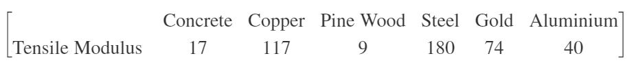

# Quiz 3 Solution

### Play Bull and Cows Game   
*Bulls and Cows* is a mind game. In the game, a random, **4-digit** number is chosen from 0 to 9, called a true number, and its values are compared to those of a test number. All four digits of the number are different. If any digit in the test number is the exact same value and in the exact same position as any digit in the true number, this is called a bull. If the digit is present in both the true number and test number but is not in the same location, this is called a cow. Note that this is an original game presented in the lecture slides. 

Assume that two players join a Bulls and Cows game. Player 1 and Player 2 each guesses a four digit number (which are the test numbers) and they are named as ‘test_ply1’ and ‘test_ply2’ respectively. You are going to compare their bulls and cows and decide who is **closer** to the true number named 'true_num'. The player with more bulls wins. If both players have equal number of bulls, then the player with more cows wins. If both players have an equal number of bulls and cows, it is a tie. 

**Example 1**: if bulls and cows for player 1 and 2 are [1,2] and [1,1], respectively, player 1 is **closer**. 

**Example 2**: if bulls and cows for player 1 and 2 are [1,2] and [2,0], respectively, player 2 is **closer**. 

You are going to design a function to determine who is the winner. 

Please write a function of ‘**TwoPlayerBullsCows**’ which has three inputs: a true number (‘true_num’) and two test numbers (‘test_num1’ and ‘test_num2’), and one output called ‘result’. 
```matlab
function result = TwoPlayerBullsCows(true_num, test_num1, test_num2)
```
If the test number for Player 1 is **closer** to the true number, assign 1 to ‘result’. If the test number for Player 2 is **closer** to the true number, assign 2 to ‘result’. If their bulls and cows are identical, assign **0** to ‘result’. 

**Solution**

```matlab
true_num = randperm(10,4)-1; % randomly generate a 1 x 4 vector (true number)
test_ply1 = randperm(10,4)-1; % randomly generate a 1 x 4 vector (number from Player 1)
test_ply2 = randperm(10,4)-1; % randomly generate a 1 x 4 vector (number from Player 2)

winner = TwoPlayerBullsCows(true_num, test_ply1, test_ply2);

fprintf('True number is [%d %d %d %d]. \n', true_num);
fprintf('Player 1 number is [%d %d %d %d]. \n', test_ply1);
fprintf('Player 2 number is [%d %d %d %d]. \n', test_ply2);

if winner == 1
   fprintf('Player 1 Win ! \n');
elseif winner == 2
   fprintf('Player 2 Win ! \n');
else
   fprintf('Draw ! \n'); 
end

% please design a function called TwoPlayerBullsCows

function result = TwoPlayerBullsCows(true_num, test_num1,test_num2)

[bulls1, cows1] = CompBullsCows(true_num, test_num1);
[bulls2, cows2] = CompBullsCows(true_num, test_num2);

if bulls1 > bulls2
    result = 1;
elseif bulls2 > bulls1
    result = 2;
else
    if cows1>cows2
        result = 1;
    elseif cows2>cows1
        result = 2;
    else
        result = 0;
    end
end

end

function [bulls, cows] = CompBullsCows(true_num, test_num)

% These are new solutions. 
% You can use the ones in the lecture slides (any working solutions)

bulls = sum(true_num==test_num);
cows = sum(true_num(:) == test_num, 'all') - bulls; % slide 185

end
```

### Zeros into a Vector

Create a function called '**InsertZeros**' which has two inputs and one output. 

```matlab
function outvec = InsertZeros(vec, n)
```

'outvec' is a **row** vector generated by inserting 'n' number of zeros after each element in the given vector named 'vec'. Note that 'vec' is a row vector and 'n' is a positive integer greater or equal to  1 (n >= 1). 

**Example 1:**  When vec = [1 2 3 4] and n = 3, 'outvec' becomes [1 0 0 0 2 0 0 0 3 0 0 0 4 0 0 0];
**Example 2:**  When vec = [2 1 1 2] and n = 2, 'outvec' becomes [2 0 0 1 0 0 1 0 0 2 0 0];
**Example 3:**  When vec = [1 2] and n = 1, 'outvec' becomes [1 0 2 0];


**Solution**

```matlab
test_vec = randi(100, 1, 30);
n = randi(10);

new_vec = InsertZeros(test_vec, n);

% please design a function called InsertZeros

function outvec = InsertZeros(vec, n)
nvec = numel(vec);
outvec = cat(1, vec, zeros(n, nvec));
outvec = outvec(:)';
end

```

### Subtract Column or Row Average from a 2D matrix
Create a function called '**MeanSubtract**' that accepts two inputs and one output. 

```matlab
function out_mat2d = MeanSubtract(mat2d, dim)
```

When 'dim' is 1, 'out_mat2d' is genreated by subtracting a column mean from the corresponding column in the input matrix named 'mat2d' 

When 'dim' is 2, 'out_mat2d' is genreated by subtracting a row mean from the corresponding row in the input matrix named 'mat2d' 

Example: When 'mat2d' is 
```matlab
     1     2     5
     2     3    10
     3     7    15
```
if we run the following script
```matlab
out_mat2d = MeanSubtract(mat2d, 1)
```
'out_mat2d' becomes
```matlab
    -1    -2    -5
     0    -1     0
     1     3     5
```
because the mean of each column = [2 4 10]. 
On the other hand, if we run the following script
```matlab
out_mat2d = MeanSubtract(mat2d, 2)
```
'out_mat2d' becomes
```matlab
   -1.6667   -0.6667    2.3333
   -3.0000   -2.0000    5.0000
   -5.3333   -1.3333    6.6667
```
because the mean of each row = [2.666; 5; 8.333]. 

**Solution**
```matlab
test_mat2d = randi(100, 10, 10);
dim = randi(2);

out_mat2d = MeanSubtract(test_mat2d, dim);

% please design a function called MeanSubtract

function out_mat2d = MeanSubtract(mat2d, dim)
vec = mean(mat2d, dim);
out_mat2d = mat2d - vec;  % slide 185
end
```

### N Values in Columns
Create a function called '**MaxMinN**' that accepts two inputs and two output. 

```matlab
function [max_num, min_num] = MaxMinN(mat2d, num)
```
The purpose of this function is to compute the maximum and minimum times the given number named 'num' that can be found within columns of an input matrix (named 'mat2d'). 
The maximum and minimum numbers of 'num' are assigned to 'max_num' and 'min_num', respectively. Note that 'max_num' and 'min_num' could be the same when **the number of 'num' is the same in each coulmn.**

For example, When we have the line [max_num, min_num] = MaxMinN(mat2d, 1), and 'mat2d' is 
```matlab
     1     5     5
     2     1    10
     3     5     1
```
The number of '1's in each column is one , so 'max_num' and 'min_num' can both be one.
Or, 'max_num' and 'min_num' could be both zeros when there is no 'num' in 'mat2d'. 

**Example 1**: When 'mat2d' is 
```matlab
     1     5     5
     2     3    10
     5     5    15
```
if we run the following script
```matlab
[max_num, min_num] = MaxMinN(mat2d, 5)
```
'max_num' and 'min_num' becomes 2 and 1, respectively. 

**Example 2:** When 'mat2d' is 
```matlab
```
    16     2     3    10
     5    11    10     8
     9     7     6    10
     4    14    15     1
if we run the following script
```matlab
[max_num, min_num] = MaxMinN(mat2d, 10)
```
'max_num' and 'min_num' becomes 2 and 0, respectively. 

**Solution**
```matlab
test_mat2d = randi(10, 20, 20);
test_num = randi(10);

[test_max_num, test_min_num] = MaxMinN(test_mat2d, test_num);

% please design your function called MaxMinN
function [max_num, min_num] = MaxMinN(mat2d, num)
n_num = sum(mat2d == num);
max_num = max(n_num);
min_num = min(n_num);
end
```

### How Many Given Word in a Character Vector? 

Create a function called '**CountWord**' that accepts two inputs and one output. 

```matlab
function n_word = CountWord(char_vec, word)
```
This function is to count the number of 'word' in 'char_vec' and assign its number to 'n_word'. Note that 'char_vec' and 'word' contain only lower case alphabetical words and 'char_vec' is much longer than 'word'.

Here is the example:


Note that although 'banana' is assigned to 'test_word' in the given code, the function supports any word. This means your function should be applicable on any word and does not use information that sepcifies your 'word' as 'banana'. 

You should not use the following built-in function: **strfind**, **count**. 

**Solution**
```matlab
test_word = 'banana';
char_vec = GenCharVec(test_word);

n_test_word = CountWord(char_vec, test_word);

% please design a function called CountWord

function n_word = CountWord(char_vec, word)

vec_len = numel(char_vec);
n_char = numel(word);

n_word = 0;
for ii=1:vec_len-n_char+1
    test_loc = ii:ii+n_char-1;
    if isequal(char_vec(test_loc), word)
       n_word = n_word + 1; 
    end
end

end

function char_vec = GenCharVec(test_word)
vec_len = 300;
n_char = numel(test_word);
char_vec = char(randi([97 122], 1, vec_len));
n_word = randi(20);

for ii=1:n_word
    loc = randi(vec_len-n_char);
    char_vec(loc:loc+n_char-1) = test_word;
end
end
```

### Remove Any Row in Which Contains N number

Create a function called '**RmvRowNCont**' which has two inputs and one output. 
```matlab
function out_mat2d = RmvRowNCont(mat2d, N)
```
'out_mat2d' is generated by removing the row(s) of 'mat2d' which contain the number 'N'. 
Note that 'mat2d' is a 2D matrix and 'N' is a scalar. 

Example 1: When 'mat2d' is:
```matlab
     4     5     1     4
    15    15    11    13
     6     4    10     3
    14    13     7     8
```
and we run the following script:
```matlab
out_mat2d = RmvRowNCont(mat2d, 4)
```
'out_mat2d' becomes:
```matlab
    15    15    11    13
    14    13     7     8     
```
because the first and third rows contain 4 so the corresponding rows are deleted. 

Example 2: When 'mat2d' is:
```matlab
     6    11     5    17    25     4
    17    20    30    20    24     9
     4     3    13     1    30    23
     2     7    29    24     7    25
    28     2    22    28    28     4
    30    15    18     1    20    15
```
and we run the following script:
```matlab
out_mat2d = RmvRowNCont(mat2d, 20)
```
'out_mat2d' becomes:
```matlab
     6    11     5    17    25     4
     4     3    13     1    30    23
     2     7    29    24     7    25
    28     2    22    28    28     4
```
because the second and last rows contain 20 so those rows are deleted. 

**Solution**
```matlab
mat2d = randi(60, 8, 8);
N = randi(60);

out_mat2d = RmvRowNCont(mat2d, N);

% please design a function called RmvRowNCont
function out_mat2d = RmvRowNCont(mat2d, N)

idx = logical(sum(mat2d == N, 2));
out_mat2d = mat2d;
out_mat2d(idx,:) = [];

end
```

### Remove Vowels 
Create a function called '**RmvVowels**' that accepts one input and one output. 
```matlab
function out_vec = RmvVowels(char_vec)
```
The purpose of this function is to remove all vowels from 'char_vec' and assign the result vector to 'out_vec'. 'char_vec' is a character vector and contains only **lower-case** letters. The vowels in the problem are 'a', 'e', 'i', 'o', and 'u'. 

**Example 1**: when 'char_vec' is 'aabcdeeffg', 'out_vec' becomes 'bcdffg'. 
**Example 2**: when 'char_vec' is 'abcdefghi', 'out_vec' becomes 'bcdfgh'. 

**Solution**
```matlab
char_vec = char(randi([97 122], 1, 100));

out_char_vec = RmvVowels(char_vec);

% Please write your function called RmvVowels
function out_vec = RmvVowels(char_vec)
vowels = 'aeiou';

% out_vec = char_vec;
% for ii=1:numel(vowels)
%    idx = (out_vec == vowels(ii));
%    out_vec(idx) = []; 
% end

lg_idx = zeros(1, numel(char_vec), 'logical');
for ii=1:numel(vowels)
    lg_idx = or(lg_idx, char_vec == vowels(ii));
end
out_vec = char_vec(~lg_idx);

end
```

### Tensile Stress: Function 
Create a function named '**CompTenStr**' that accepts two inputs and one output. 
```matlab
function tensile_stress = CompTenStr(strain_data, material_char)
```
This function is to determine tensile stess, where the output ('tensile_stress') is a scalar. The strain data named 'strain_data' and material data named 'material_char' are given for this problem. Please note that 'strain_data' for this problem is a scalar. Tensile stress can be obtained from the product of strain and the tensile modulus of a material . 
 
Tensile modulus for each of the given material is given as the following: 



'material_char' contains a character that indicates the material for given measurements. (e.g, 'material_char' can be 'c', which indicates "copper") ('c': Concrete, 'p': Coppper, 'w': Pine wood, 's': Steel, 'g': Gold, 'a': Aluminum)

You do not need to consider units for the tensile modulus and strain. 
Again, tensile stress is tensile modulus times strain. 


**Solution**
```matlab
% 'c': Concrete, 'p': Coppper, 'w': Pine wood, 's': Steel, 'g': Gold, 'a': Aluminum
material_char = ['c', 'p', 'w', 's', 'g', 'a'];

test_strain_data = randi(1000); % test tensile strain
test_mat_char = material_char(randi(6)); % test material character

test_tensile_stress = CompTenStr(test_strain_data, test_mat_char);

% please design a function called CompTenStr

function tensile_stress = CompTenStr(strain_data, mat_char)

switch mat_char
    case 'c'
        tensile_stress = strain_data * 17;
    case 'p'
        tensile_stress = strain_data * 117;
    case 'w'
        tensile_stress = strain_data * 9;
    case 's'
        tensile_stress = strain_data * 180;
    case 'g'
        tensile_stress = strain_data * 74;
    case 'a'
        tensile_stress = strain_data * 40;
end

end
```

### Generate a Character Sequence 

Create a function called '**GenSeq**' that accepts one input and one ouptut
```matlab
function char_seq = GenSeq(n)
```
This function is to generate a character vector named 'char_seq' using 'n' number of charcters in order. 'char_seq' is a character vector that contains the lower-case alphabet. 'n' is a scalar value that is less than or equal to 26.

When 'n' is 2, 'char_seq' becomes 'abb'.
When 'n' is 3, 'char_seq' becomes 'abbccc'.
When 'n' is 5, 'char_seq' becomes 'abbcccddddeeeee'.


**Solution**
```matlab
test_n = randi(26);

test_char_seq = GenSeq(test_n);

% please design your function: GenSeq

function char_seq = GenSeq(n)

char_seq = []; 
for ii=1:n
    cur_seq = char((96+ii) * ones(1, ii));
    char_seq = [char_seq cur_seq];
end

end

% option
% function char_seq = GenSeq(n)
% 
% alpha_seq = 'abcdefghijklmnopqrstuvwxyz';
% 
% char_seq = []; 
% for ii=1:n
%     cur_seq = char(alpha_seq(ii) * ones(1, ii));
%     char_seq = [char_seq cur_seq];
% end
% 
% end
```

### Candy Store: Function 
Noreen owns a candy store, and she did a promotion on May 2. If customers applied for membership cards on that day, they would have a chance to win a prize. 
The prize receivers are chosen based on their membership card number. 
The card number is 10 digits. To win the prize, the card number satisfy the following conditions:
- '6' appears at the second and fifth indexes (locations) of the card number. 
- The first and last digits are not 3. 
- The second last number is less than 5. 

For example, the person whose card number is either '1**6**23**6**121**22**' or '6**6**23**6**121**49**' will receive the prize

Creat a function named '**PrzRcv**' that accepts one input and one output. 
```matlab
function is_rsv = PrzRcv(card_num)
```
If 'card_num' satisfies the above three conditions for receiving the prize, true is assigned to 'is_rsv'. Otherwise, false is assigned to 'is_rsv'. 'card_num' is a 1 x 10 vector that contain numbers ranging from 0 to 9. 'is_rsv' is a logical value. 


**Solution**
```matlab
test_card_num = randi(10, 1, 10)-1; % test card number

test_is_rsv = PrzRcv(test_card_num);

% please design your function called PrzRcv

function is_rsv = PrzRcv(card_num)

cond1 = and(card_num(2)==6 , card_num(5)==6);
cond2 = and(card_num(1)~=3 , card_num(end)~=3);
cond3 = card_num(end-1) < 5;
is_rsv = cond1 && cond2 && cond3;

end
```