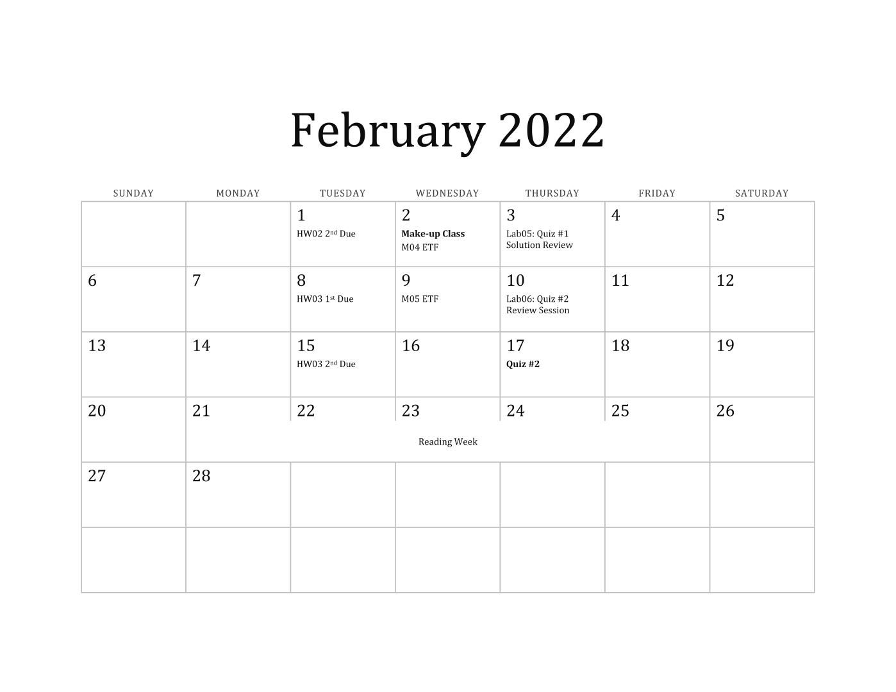
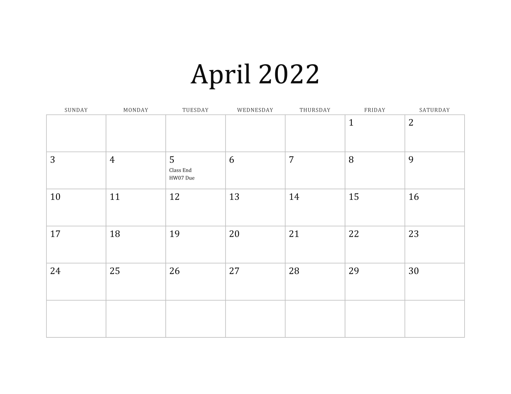

# CIVE 121: Computational Method (W2022)

|||
|:--------|:-----------|
||**Instructor:** Chul Min Yeum (cmyeum@uwaterloo.ca)   **TA:** Jesse St. John - Parker (jstjohnparker@uwaterloo.ca)   **TA (Graduate):** Rishabh Bajaj (r6bajaj@uwaterloo.ca)   **Class:** Mon & Wed (1:30 to 3:00 PM) at RCH 302 (as of Jan 31)   **Programming Lab:** Thu (1:30 to 3:30 AM) at CPH 1346 (as of Jan 31)   **Office hours (TA)**: Mon & Wed (9:00 to 11:50 AM) at E2-1787, Thu (3:30 to 5:00 PM) at CPH 1346 (as of Jan 31)   **Office hours (Instructor)**: Mon (3:30 to 04:30 PM) at E2-2313 (as of Jan 31)|

**Last updated:** 2022-01-06  

**Previous offerings of this course**
- [**Computational Method (Spring, 2021)**](old/s2021)
- [**Computational Method (Spring, 2020)**](old/s2020)
- [**Computational Method (Spring, 2019)**](old/s2019)

**Key links**
- [**LEARN**](https://learn.uwaterloo.ca/d2l/home/767310)
- [**MATLAB Grader- (W22) CIVE 121: Homework**](https://grader.mathworks.com/courses/63549-w22-cive-121-homework)
- [**MATLAB Grader- (W22) CIVE 121: Quizzes**](https://grader.mathworks.com/courses/64270-w22-cive-121-quizzes)
- [**MATLAB Grader- Tutorial: Computational Method**](https://grader.mathworks.com/courses/18318-tutorial-computational-method)
- [**MATLAB Grader- Quizzes in previous years**](https://grader.mathworks.com/courses/63504-quizzes-in-previous-years-computational-method)
- [**FAQ document**](qna)
- [**Course material**](comp_method_book_cm_s21.pdf)
- [**Attendance & Extra mark document**](https://uofwaterloo.sharepoint.com/:x:/s/tm-cee-uwcviss/EcEWEvABwh9CovMIkkh56SABkTBaeF5QYH5Cw2LRthettg?e=kDQ3xm)  

**Key Dates**
* <del> January 12 at 11:30 am: Make-up class 1 </del>
* January 27 at 1:30 pm: Quiz 1 (**Online**)
* February 02 at 11:30 am: Make-up class 2
* February 17 at 1:30 pm: Quiz 2
* February 21 to February 25: Reading week
* February 28 to March 04: Midterm week
* March 14: No class
* March 23 at 11:30 am: Make-up class 3
* March 24 at 1:30 pm: Quiz 3

Note the full schedule can be found from [**here**](#calendar)

## Online Schedule for the first four weeks (prior to Jan 31)
Please see a recent announcement regarding the winter term: https://uwaterloo.ca/coronavirus/news/extending-remote-work-and-learning-january-27

* All in-person classes on Jan 5, 10, 12, 17, 19, 24, and 26 will be canceled.
* All in-person labs on Jan 6, 13, and 20 will be canceled.
* The make-up class on Jan 12 will be canceled.
* Students need to watch per-recorded video lectures for Module 00, 01, 02, and 03 
* There will be three live lectures at the class time on every Wednesday **(no class on Jan 26)**. We are going to have a MS team meeting in our class MS team channel. Here are the detailed schedules:

|Time|Topic|Preparation|
|:----|:-----|:----|
|Jan 5 at 1:30 pm|Review a course syllabus and Q&A|Please carefully read the **course syllabus** before joining the meeting|
|Jan 12 at 1:30 pm|Review Module 01, play a Kahoot game, and introduce HW01|Please watch and study **Module 01** before joining the meeting|
|Jan 19 at 1:30 pm|Review Module 02 and play a Kahoot game|Please watch and study **Module 02** before joining the meeting| 

* We will do Kahoot games on Jan 12 and Jan 19, **which means students get attendance points if they join the game.**    
* All in-person office hours will be canceled. However, students feel free to send the TA a chat message through MS Team if they have questions or use a live help sessions. 
* To accommodate online training, the TA will have online live help sessions. We will schedule MS Team meetings during every help session so students can feel free to join the meeting without an appointment. Here are the live help session schedule:  
	* On Monday (Jan 10, 17, 24): 10:00 ~ 11:00 am, 1:30 ~ 3:00 pm
	* On Tuesday (Jan 11, 18, 25): 11:30 am ~ 12:30 pm 
	* On Thursday (Jan 6, 13): 3:00 ~ 5:00 pm
* TA will give a Q1 review session on Jan 20 at 1:30 ~ 3:00 pm using a MS team meeting like the instructor's lecture.
* Asking questions during this live help session is recognized as a participation mark for the first month (January). 
* We will have Quiz 1 on Jan 27 online. We will give you more detailed direction late.  

## Announcement
* **Jan 7, 2022:** HW 01 has been posted on [**MATLAB Grader- (W22) CIVE 121: Homework**](https://grader.mathworks.com/courses/63549-w22-cive-121-homework). The last three questions are copied from the questions in tutorials. Students should solve them by themselves first and review their model answers carefully. Although students copy and paste the model solutions for these problems, **they are NOT cheating.** However, the instructor highly recommend writing your own solutions.  
* **Jan 6, 2022:** Please check out the following updates:
	* [You will use your first name as a nick name in future Kahoot games.](#course-attendance)
	* [Calendars](#calendar) have been updated by considering the first month online term.
* **Jan 4, 2022:** Please see a revised announcement regarding online start to the winter term (new dates).  
* **Dec 20, 2021:** Please see a new announcement regarding online start to the winter term.  
* **Dec 02, 2021:** The first class will start at Jan 05, 2022.   

## Table of Contents
- [Course Description](#course-description)
- [Course Objectives](#course-objectives)
- [Study Guide](#study-guide)
- [Prerequisites](#prerequisites)
- [Course Textbook](#course-textbook)
- [Course Outline](#course-outline)
- [Course Attendance](#course-attendance)
- [Tutorial](#tutorial)
- [Programming Lab](#programming-lab)
- [Quiz](#quiz)
- [Policy for Cheating](#policy-for-cheating)
- [Homework Assignment](#homework-assignment)
- [Communication](#communication)
- [Grading](#grading)
- [Calendar](#calendar)
- [Note](#note)

## Course Description
This course introduces computer programming for engineering students using MATLAB. MATLAB is an easy and readable programming language and is an excellent choice for those who are learning programming for the first time. This course will cover various topics including programming fundamentals, matrix operations, and data visualization. Students who complete this course will gain a fundamental understanding of computer programming techniques and be able to operate, analyze, and visualize all types of data for future engineering studies. **Remember that this course is not a simple MATLAB tutorial course.** It is an introductory programming course that utilizes MATLAB to illustrate general concepts in computer programming.  

This course includes lectures, tutorials, homework assignments, and quizzes:
* [**Lectures**](#course-outline) are to cover the major topics, discussing the important programming concepts with worked-out examples. The instructor will teach the [*course material*](comp_method_book_cm_s21.pdf). 
* [**Tutorials**](#tutorial) are **self-study** resources to assist students to solve the problems in the course material, homework assignments, and quizzes. Students can find the problems on [*Tutorial: Computational Method*](https://grader.mathworks.com/courses/18318-tutorial-computational-method) in the MATLAB Grader.       
* [**Homework assignments**](#homework-assignment) are to provide practice for programming and evaluate your progress on the understanding of the course material. The homework assignments will be posted on [*(W22) CIVE 121: Homework*](https://grader.mathworks.com/courses/63549-w22-cive-121-homework) in the MATLAB Grader.
* [**Quizzes**](#quiz) are to evaluate your knowledge and programming skills. There will be four quizzes over the course. Four quizzes will be posted on [*(W22) CIVE 121: Quizzes*](https://grader.mathworks.com/courses/64270-w22-cive-121-quizzes)

## Course Objectives
By the end of this course, students should be able to  
* Develop MATLAB programming logic to solve problems. 
* Compose working, efficient, and readable MATLAB scripts in various ways.
* Debug your code to identify and fix programming errors.
* Identify suitable keywords to search for code snippets on the web.
* Apply MATLAB to write your own program (very important).

## Study Guide
* Attend all lectures. There are [video recordings of all lecture modules](#lecture-video) so you can review them if you do not understand the lectures clearly.    
* Solve problems in the course materials and tutorials by yourself (please follow [the following instruction](#tutorial)).
* Type and run all scripts of sample solutions in the course material and tutorial videos. Never skim the code.  
* Make online engagement through [**LEARN**](https://learn.uwaterloo.ca/d2l/home/767310) or or ask for help from TA.   
* Watch tutorial videos to check your answers to the problems.
* Employ an editor, Workspace browser, and debugging tool to solve the problems (not on MATLAB Grader). 

## Prerequisites
"Linear algebra" (AE/CIVE/ENVE/GEOE 115) is a prerequisite for this course, which you  already learned in the 1A term. If you are not familiar with these topics, please review corresponding lecture slides or tutorials. 

* [**How to use MATLAB Grader?**](doc/matlab_grader)
* [**How to download and install MATLAB on your computer?**](doc/matlab_install)

## Course Textbook 
This course is not based on any particular textbook. However, the [course materials](comp_method_book_cm_s21.pdf) have been prepared using the following two references:
* Attaway, Stormy. *"MATLAB-A Practical Introduction to Programming and Problem Solving,"* Elsevier, 2018.
* Moore, Holly. *"MATLAB for Engineers,"* Pearson, 2017.

## Course Outline
All lectures will be delivered in person. However, you can watch the video recordings of each module from [here](#lecture-video) or [**YouTube Channel**](https://youtube.com/playlist?list=PLa1nAPP8qUX9qwRR6Sj_dboIriPIGYgsm). There are ten modules and each module has 1~3 lectures. The study load for each module is marked as the number of regular 80 minutes offline classes, which becomes a total of 24 classes. The expected time to finish (ETF) in each module is also provided to help students manage their time and keep up with lectures, assignments, and quizzes. 

The lectures will cover the course materials (You can download it from [**here**](comp_method_book_cm_s21.pdf)), developed by the instructor. Homework assignments and quizzes are all cumulative. The assignments and quizzes to be covered are based on the knowledge from the current and all previous modules. For example (if you see the table below), Quiz 02 will cover Module 01 to Module 05. 

Lectures are to deliver fundamental knowledge and information in each module and **are not to give a direction on how to solve your homework assignments or quizzes**. However, all the practice problems were designed based on the course materials. Thus, if students do not find the relevance between them, they have not understood lectures yet and should carefully review them again. 

You can check the schedule all at once from [this calendar](#calendar).

|Module|Topics|Load|ETF|[Quiz](#quiz)| 
|:-----|:-----|:--:|:--:|:-----------:|
|**Module 00**|Preliminaries|1|January 05| |
|**Module 01**|Basic MATLAB Programming|2|January 12| |
|**Module 02**|Vectors and Matrices|2|January 19|**Quiz 01** (January 27)|
|**Module 03**|Selection Statement |2|January 26| |
|**Module 04**|Loop Statement|2|February 02||
|**Module 05**|Built-in Functions|3|February 09|**Quiz 02** (Februray 17)|
|**Module 06**|Operator|3|March 07||
|**Module 07**|Function|3|March 21|**Quiz 03** (March 24)|
|**Module 08**|Plotting|1|March 16|Will be taught by TA|
|**Module 09**|Data Structure|2|March 23||
|**Module 11**|Text Manipulation|2|March 30|**Quiz 04** (TBD)|

* <del> Note that the instructor will have one-week business trip on the 11th week (March 14 ~ 18). The lecture on March 14 will be covered on Lab 08 and our graduate TA will deliver a Module 08 lecture. </del> 
* There will be three make-up classes
	* <del> 11:30 AM to 12:20 PM, January 12 (RCH 302) </del>
	* 11:30 AM to 12:20 PM, February 02 (RCH 302)
	* 11:30 AM to 12:20 PM, March 23 (RCH 302)

### Lecture Video 
Students can watch lecture videos for each module. If students are absent from present the classes unavoidably or cannot follow in-person lectures, please watch the lecture videos for their study.  

|Module|Video| 
|:----|:----|
|**Module 00**| |
|**Module 01**|   |
|**Module 02**|  |
|**Module 03**| |
|**Module 04**|   |
|**Module 05**|  |
|**Module 06**|  |
|**Module 07**|  |
|**Module 08**|**No Lecture Video**|
|**Module 09**|  |
|**Module 11**|  |

## Course Attendance
Students are highly encouraged to attend all classes and have to attend the classes to receive 12 point attendance scores. There will be 10 fun games using [Kahoot](https://kahoot.it/) during classes, and students will join the question through their cell phones. There will be one or two game per each module and students receive 1.5 point **if they just join the game.** The maximum score that students will receive from these games is 12, not 15, which mean students can get a full mark (12 points) if they join at least eight games. This considers unavoidable absence, such as illness, job interview. The students need to bring their cell phones or laptops to join these games. If students did not bring the phone or laptop or its battery is out, students must inform TA before starting the game. Note that the instructor do not notify in advance when or what class the game in each module starts.  

Note that students **do not have to** inform TA or instructor for their absent in the class. No matter the reason, students **cannot** get the point if they do not join the game during the class. Students can still get a full attendance mark although they miss one or two classes (games). Thus, we will not arrange a special accommodation for the attendance. Please do not send an email to the instructor or TA to explain your absent.   

To participate the game, the instructor will show the students a game pin number. 

* Step 1: Go to the Kahoot! website [https://kahoot.it/](https://kahoot.it/) and type a pin number. The instructor will show the pin number in each game. 
* Step 2: Type your university email address
* Step 3: **Type your nick name. Please use your first name**.  
* Step 4. You are ready for joining the game    

|||
|:--------:|:-----------:|
|**Step 1**|**Step 2**|
|||
|**Step 3**|**Step 4**|

We will update your attendance (and participation mark) record to [this document](https://uofwaterloo.sharepoint.com/:x:/s/tm-cee-uwcviss/EcEWEvABwh9CovMIkkh56SABkTBaeF5QYH5Cw2LRthettg?e=kDQ3xm). If the record is not correct, please send an email to TA. When students check the attendance by dishonest means (e.g. a student present at a class join the game using more than one account, remotely access the game using a pin number, informed by a student present at a class), they are considered as an academic offense and receive 0 for **all attendance score**. And they are disciplined by [Policy for Cheating](#policy-for-cheating)    

## Tutorial
The tutorials are self-study resources to assist students in the problems of course material, homework assignments, and quizzes. Students can find the problems on [**Tutorial: Computational Method**](https://grader.mathworks.com/courses/18318-tutorial-computational-method) in the MATLAB Grader. The model answers for all tutorial problems were posted on this [**page**](tutorial). All students are **highly recommended** to solve practice problems to prepare for your quizzes. Here is how to study the tutorial. 

* **Step 1.** Understand a problem listed on each Module in MATLAB Grader: You need to carefully read the description of problems on [**Tutorial: Computational Method**](https://grader.mathworks.com/courses/18318-tutorial-computational-method) or from this [page](tutorial).

* **Step 2.** Write your own script to solve the problems: You should use a MATLAB program and write your own program to solve the question. You need to do practice on debugging to fix errors on your code if necessary. Please do not look at the model answer or watch the solution video before you make your own script.  

* **Step 3.** Copy and paste your script to the MATLAB Grader: If you think your script is ready for testing, copy and paste the script to the MATLAB Grader. Click "Run Script" first to check out any syntax or run-time errors (if you already check this on the MATLAB program, you should not see the error message). 

* **Step 4.** Submit your solution: Many tests (assessments) were pre-designed to evaluate the correctness of your solution. You need to ensure that your solution passes all the tests. However, you should not do hard coding to pass the tests. Developing the right logic on your code is much more important than passing the test. For example, many students got zero on problems in the quizzes last year, although they pass all tests. Passing the test is just to check the quality of your script (like pre-screening) but does not mean that your script is correct or written based on a right programming logic.           

* **Step 5.** Review the model solution: The model solutions for all problems were already posted on this [page](tutorial). The instructor recorded videos to review those problems. Students are encouraged to mimic how the instructor writes the script and debug its error. Although the model answer is simply one of the possible ways to solve the problem, they were written based on the key knowledge or methods covered in the corresponding or prior modules.   

* **Step 6.** Type and run the model script: Skimming the code is not a good way to improve your programming skill. You should type them and run the script in the MATLAB program and MATLAB Grader. I would say programming is like learning sports. You should do practice with your hand, not by eye. 

* **Step 7 (Very important).** Improve your original script: Although you may practice using the model solutions, it is important to develop your own script. A better approach is trying to improve your original script based on the model solution. For example, updating programming logic or shortening the scripts will be greatly helpful that you can employ such code in your future script. Try solving the program again without looking at your original script or model solutions. You will see that your new script will not be the same as the model solution but are much more efficient and compacted than your original ones. 

You do not have to memorize any of the solutions. You can freely access all these solutions during the quizzes because they are open-book quizzes. However, I tell you, without going through this process, you cannot write your own script during the quizzes and will not get a good mark on them. 

## Programming Lab
The programming labs will be held in a main computer lab (CPH 1346). The programming labs include <del> instruction sessions (Lab 01, 02) </del>, quiz solution review sessions (Lab 05, 08, 11), quiz review sessions (Lab 03, 06, Extra) and quizzes (Lab 04, 07, 10). These labs (except for quizzes) are designed to focus on hands-on practice with MATLAB programming. Students can use the computers in the lab or bring their own laptop if MATLAB is installed. **The instructor and TA will not check the attendance** but highly recommend coming to this sessions.  

### Schedule
|Lab|Topics|Date|Instructor|
|:---|:-------|:-----|:-----|
|Lab 01|<del> Getting started with MATLAB </del>|<del> January 06 at 1:30pm </del>|<del> Chul Min Yeum</del>|
|Lab 02|<del> Helping your first homework (HW01) </del>|<del> January 13 at 1:30pm|<del> Chul Min Yeum & Jesse Parker </del>|
|Lab 03|Quiz 01 Review Session (**online**)|January 20 at 1:30pm|Jesse Parker|
|Lab 04|Quiz 01 (**online**)|January 27 at 1:30pm|Chul Min Yeum & TAs|
|Lab 05|Quiz 01 Solution Review|February 03 at 1:30pm|Chul Min Yeum|
|Lab 06|Quiz 02 Review Session|February 10 at 1:30pm|Jesse Parker|
|Lab 07|Quiz 02|February 17 at 1:30pm|Chul Min Yeum & TAs|
|Lab 08|Lecture + Quiz 02 Solution Review|March 10 at 1:30pm|Chul Min Yeum|
|Lab 09|Quiz 03 Review Session|March 17 at 1:30pm|Jesse Parker|
|Lab 10|Quiz 03|March 24 at 1:30pm|Chul Min Yeum & TAs|
|Lab 11|Quiz 03 Solution Review|March 31 at 1:30pm|Chul Min Yeum|
|Extra|Quiz 04 Review Session|April 04 at 1:30pm|Jesse Parker|

## Quiz
The quizzes will be delivered through the MATLAB Grader like, tutorials or homework assignments. The quizzes will be posted on [*(W22) CIVE 121: Quizzes*](https://grader.mathworks.com/courses/64270-w22-cive-121-quizzes). The major differences are a **time limit** and **a limited submission**. Remember that although students do not pass pre-designed tests, they are not able to go back and edit their submitted solutions. Students are strongly encouraged to test and evaluate their solutions using a MATLAB (program) editor before submission. 
 
### Schedule  
|Exam|Topics|Date|Duration|Instruction|
|:---|:-------|:-----|:----|:----|
|**Quiz 01**|Module 01 ~ 02|January 27 at 1:30 pm|TBD|TBD|
|**Quiz 02**|Module 01 ~ 05|February 17 at 1:30 pm|TBD|TBD|
|**Quiz 03**|Module 01 ~ 07|March 24 at 1:30 pm|TBD|TBD|
|**Quiz 04**|Module 01 ~ 07, 09, 11|TBD|TBD|TBD|   

## Policy for Cheating 
Students are encouraged to work in groups through collaborative learning only for homework assignments, but are required to submit their assignments individually. Students **must not share their solutions with other students**. The TA will run software to check your scripts to detect plagiarism. Please do not think that you are able to deceive TAs or instructor. Although you pass all the problems in the MATLAB Grader, you will get a 0 grade if your solution is considered plagiarism with a zero-tolerance. Also, you might be reported to Engineering Undergraduate Associate Dean as [**an academic offense**](#discipline). **Both copiers and copyees are guilty of cheating and will receive an equal penalty.** The penalty includes a zero mark on the corresponding homework assignment or quiz and a zero mark on online engagement, which means they will not receive extra points.  

Experience has shown that the students who copy friend's solutions **do not know how to make them different** and tend to not bother to change their friends' code. **You should not trust your friends.** Once you share the solution with your friend, you will likely get caught for cheating. Sharing your solutions with your friend will not benefit you or your friends, and overall is a dumb thing to do. 

What's worse, once you are cheating, your and your friend's previous assignments and solutions for quizzes will be re-evaluated. If evidence is shown that solutions are shared among them more than one time, you will fail the course and should retake it in the future. Do not feel easy if your cheating is undetected as it can still end up in a disaster. 

For your information, 20 students were caught by cheating or academic dishonesty in S2021. They received a zero mark on the corresponding homework assignment and did not get any extra marks on the online engagement. Since they admitted their cheating honestly, I did not report their names to the First-year Engineering Office. However, instructors in our department were informed of this offence. So, if academic dishonesty were to occur in other courses, I would be able to provide the names of the students. **Please do not do anything you might regret.**           

## Homework Assignment
The homework assignments will be designed using the MATLAB Grader. This tool allows students instant feedback on the correctness of their solutions through the pre-designed testers. Thus, students can be highly motivated and inspired to persevere with completing the assignments. Problems in the homework assignments are more challenging than examples or problems in the course materials. You might seek bits of help from your colleagues or TAs. 

Again, please do not get used to writing your script directly to the MATLAB Grader only to pass the testers. For quizzes, students will only be able to submit their code on MATLAB Grader with a limited number. Thus, students are encouraged to use the MATLAB (program) editor to prepare the problems in the quizzes.  

The **Late submission policy** allow students to have **a maximum one-week delay for two of the six homework assignments (HW07 is not included here).** Students do not have to inform TA for their delayed submission as well as the reason for the delay. The MATLAB Grader records your submission time. TAs will just count the number of delays in your homework assignments. TAs will inform the students who delay their submission a second time. If the number of delays is more than two, the third delayed homework will be zero. Students must pay close attention to deadlines. 

In case of significant health issues that results in a third homework assignment being submitted late, students should contact both the First-Year Engineering Office and the instructor, and clearly explain why they had to submit all **three homework assignments** late. Therefore, **please do not waste your two chances for delayed submission**. Again, **no late submission is accepted after the second due date OR if you have used up both your extra weeks**, and any missed homework will be given a **grade of 0**. There is no exception.  

Note that TAs will check the time records of the latest submitted solutions. **If the students revise their solution after the first due date, it will be considered that you are using one of your two late submission attempts**. Please do not revise your submission after the due date unless you plan on using your late week. No revisions are allowed after the second due date.

### Schedule
|HW|Topic|Point|Start date|First due date|Second due date|
|:---|:-----|:-----|:----|:-----|:-----|
|HW 01|Module 01            |2|January 07|January 18|January 25|
|HW 02|Module 01 ~ Module 02|2|January 12|January 25|February 01|
|HW 03|Module 01 ~ Module 03|2|January 24|February 08|February 15|
|HW 04|Module 01 ~ Module 05|2|February 14|March 08|March 15|
|HW 05|Module 01 ~ Module 06|2|February 28|March 15|March 22|
|HW 06|Module 01 ~ Module 07|4|March 07|March 22|March 29|
|HW 07|Module 01 ~ Module 11|4|March 21|April 05|April 05|

* You can check the schedule all at once from [this calendar](#calendar).
* Students can start homework assignments if they are visible in the MATLAB Grader.
* There is no more delay for the last homework (HW 07). 
* Each homework assignments will be closed at 11:45pm on its second due date (NOT 11:59pm). You CANNOT submit your work after the second due date. Please submit your work 30 minutes earlier. 

### Homework Solution Review
|Module|Update Date|Video| 
|:----|:----|:----| 
|**HW 01**|January 26||
|**HW 02**|February 02||
|**HW 03**|February 16||
|**HW 04**|March 16||
|**HW 05**|March 23||
|**HW 06**|March 30||
|**HW 07**|April 06||

## Communication  
**All communication will be made through [**LEARN**](https://learn.uwaterloo.ca/d2l/home/767310) but all information related to the course will be posted on this course website. The instructor and TA will frequently announce on LEARN after updating the web page.** Students are responsible for checking the course website regularly. LEARN will be only used for announcements and online Q&A discussions.   

In this course, the students are highly encouraged to engage in online discussions to create and facilitate a **collaborative learning experience**. Students are invited to ask questions and answer them and share their knowledge and resources. Please direct your communications to the Discussion Forum on LEARN. However, if there is a good reason not to use the discussion forum (e.g., personal matters, a question that might reveal your solution of your report, etc.), please directly contact the TAs or instructor via MS Team.  

To encourage online participation, When students ask at least one question each month in LEARN, they will receive **1 point of an online engagement extra points each month**. Thus, students will receive up to 4 points in total. **If the questions are trivial and easy to be answered from the course materials or lecture/tutorial videos, they will not be counted.** 

Please follow the instruction having Discussions on LEARN below:
- Please be respectful of your peers, instructor, and others in your posts and comments.
- **When you ask questions about tutorial problems, please indicate the problem number in the title. (e.g., M01001: YOUR TITLE)** 
- Asking good questions is another way of learning by summarizing and explaining what you know and do not know. Thoughtful questions and answers will help all students in this class. Before posting a question, please ask yourself whether you are truly stuck (meaning that the answers cannot be readily found on the web) and your questions are complete and legible.
- In addition, please check if the same question was asked before.  
- Inappropriate posts and comments will be immediately deleted and closed without notice.

Before you ask questions, please take a look at the following [**Q&A document**](qna) first. It is a compilation of frequently asked questions for each Module. You might find the answers to your questions!

## Grading  
The final grade will be based on the total marks earned from 7 homework assignments and 4 quizzes. Their grade components are provided as:

|Component|Scores|
|:---|:-----|
|**Attendance**| 12 |
|**Homework assignments**| 18 |
|**Quiz #1**| 10 |
|**Quiz #2**| 15 |
|**Quiz #3**| 20 |
|**Quiz #4**| 25 |
|**Online engagement**|extra up to 4*|
|**Total** |100| 

## Calendar
||
|:---:|
||
||
||

## Fair Contingencies for Emergency Remote Teaching
We are facing unusual and challenging times. The course outline presents the instructor’s intentions for course assessments, their weights, and due dates in Winter 2022. As best as possible, we will keep to the specified assessments, weights, and dates. To provide contingency for unforeseen circumstances, **the instructor reserves the right to modify course topics and/or assessments and/or weight and/or deadlines with due and fair notice to students.** In the event of such challenges, the instructor will work with the Department/Faculty to find reasonable and fair solutions that respect rights and workloads of students, staff, and faculty. 

## Note
### Academic integrity
In order to maintain a culture of academic integrity, members of the University of Waterloo community are expected to promote honesty, trust, fairness, respect and responsibility. [Check <a href="https://uwaterloo.ca/academic-integrity/">the Office of Academic Integrity</a> for more information.]

### Grievance 
A student who believes that a decision affecting some aspect of his/her university life has been unfair or unreasonable may have grounds for initiating a grievance. Read <a href="https://uwaterloo.ca/secretariat-general-counsel/node/100">Policy 70, Student Petitions and Grievances, Section 4</a>. When in doubt, please be certain to contact the department’s administrative assistant who will provide further assistance.

### Discipline
A student is expected to know what constitutes academic integrity to avoid committing an academic offence, and to take responsibility for his/her actions. [Check <a href="https://uwaterloo.ca/academic-integrity/">the Office of Academic Integrity</a> for more information.] A student who is unsure whether an action constitutes an offence, or who needs help in learning how to avoid offences (e.g., plagiarism, cheating) or about “rules” for group work/collaboration should seek guidance from the course instructor, academic advisor, or the undergraduate associate dean. For information on categories of offences and types of penalties, students should refer to <a href="https://uwaterloo.ca/secretariat-general-counsel/node/97">Policy 71, Student Discipline</a>. For typical penalties, check <a href="https://uwaterloo.ca/secretariat-general-counsel/node/131">Guidelines for the Assessment of Penalties</a>.

### Appeals
A decision made or penalty imposed under <a href="https://uwaterloo.ca/secretariat-general-counsel/node/100">Policy 70, Student Petitions and Grievances</a> (other than a petition) or <a href="https://uwaterloo.ca/secretariat-general-counsel/node/97">Policy 71, Student Discipline</a> may be appealed if there is a ground. A student who believes he/she has a ground for an appeal should refer to <a href="https://uwaterloo.ca/secretariat-general-counsel/node/99">Policy 72, Student Appeals</a>.

### Note for students with disabilities 
<a href="https://uwaterloo.ca/disability-services/">AccessAbility Services</a>, located in Needles Hall, Room 1401, collaborates with all academic departments to arrange appropriate accommodations for students with disabilities without compromising the academic integrity of the curriculum. If you require academic accommodations to lessen the impact of your disability, please register with AccessAbility Services at the beginning of each academic term.

### Turnitin.com
Text matching software (Turnitin®) may be used to screen assignments in this course. Turnitin® is used to verify that all materials and sources in assignments are documented. Students' submissions are stored on a U.S. server, therefore students must be given an alternative (e.g., scaffolded assignment or annotated bibliography), if they are concerned about their privacy and/or security. Students will be given due notice, in the first week of the term and/or at the time assignment details are provided, about arrangements and alternatives for the use of Turnitin in this course.

It is the responsibility of the student to notify the instructor if they, in the first week of term or at the time assignment details are provided, wish to submit alternate assignment.

