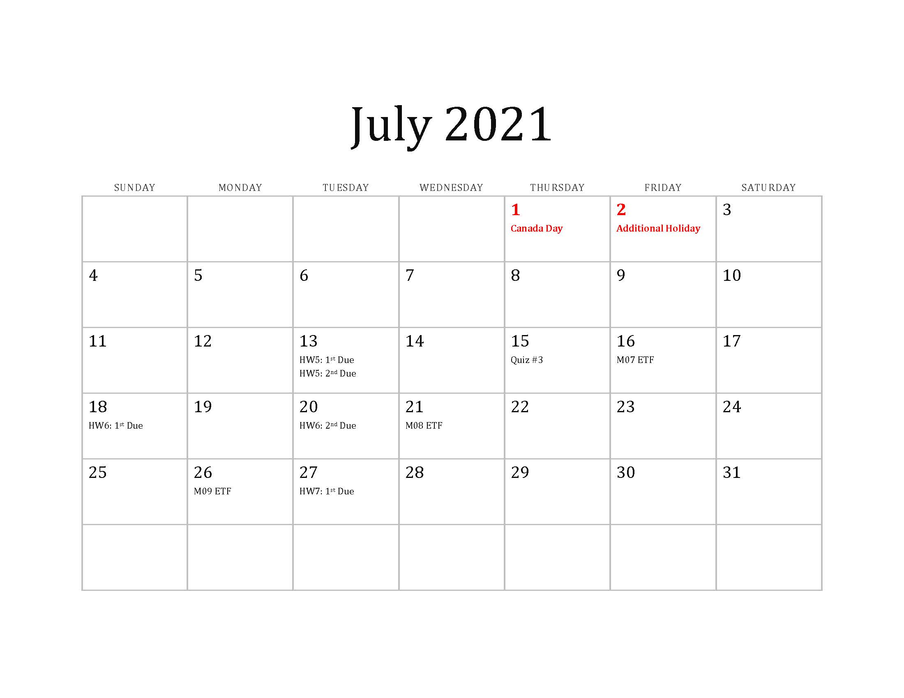

# Computational Method (University of Waterloo)

|||
|:--------|:-----------|
||**Instructor:** Chul Min Yeum (cmyeum@uwaterloo.ca)   **TA1:** Bianca Angheluta (bangheluta@uwaterloo.ca)  **TA2:** Kasturi Ghosh (kasturi.ghosh@uwaterloo.ca)   **Live Help Session (TA1)**: Mon & Wed (11:00AM to 12:30PM), Thu (02:30PM ~ 04:30PM)   **Live Help Session (TA2)**: Mon & Tue (02:30PM to 04:00PM), Fri (02:30PM ~ 03:30PM)   **Live Help Session (Instructor)**: Fri (3:30PM to 04:30PM)|

**Last updated:** 2021-08-11

**Previous offerings of this course**
- [**Computational Method (Spring, 2019)**](s2019)
- [**Computational Method (Spring, 2020)**](s2020)

## Reading List 
* **August 06**: Feedback for Quiz 3: [**Link**](doc/Q3_Feedback_Answer.md)
* **August 06**: Quiz 3 Result: [**Link**](doc/quiz3_result.md) 
* **August 04**: Instruction for Quiz 4: [**Link**](doc/Quiz4_Description.md)
* **June 13**: Instruction for Quiz 3: [**Link**](doc/Quiz3_Description.md)
* **July 06**: Quiz 2 Result: [**Link**](doc/quiz2_result.md) 
* **July 06**: Feedback for Quiz 2: [**Link**](doc/Q2_Feedback_Answer.md)
* **June 18**: Instruction for Quiz 2: [**Link**](doc/Quiz2_Description.md)
* **June 10**: Quiz 1 Result: [**Link**](doc/quiz1_result.md)
* **May 17**: Feedback for Quiz 1: [**Link**](doc/Q1_Feedback_Answer.md)
* **May 28**: Instruction for Quiz 1: [**Link**](doc/Quiz1_Description.md)

## Announcements
 

## Table of Contents
- [Course Description](#course-description)
- [Course Objectives](#course-objectives)
- [Study Guide](#study-guide)
- [Prerequisites](#prerequisites)
- [Course Textbook](#course-textbook)
- [Course Outline](#course-outline)
- [Tutorial](#tutorial)
- [Quiz](#quiz)
- [Policy for Cheating](#policy-for-cheating)
- [Live Help Session](#live-help-session)
- [Homework Assignment](#homework-assignment)
- [Communication](#communication)
- [Grading](#grading)
- [Calendar](#calendar)
- [Note](#note)

## Course Description
This course introduces computer programming for engineering students using MATLAB. MATLAB is an easy and readable programming language and is an excellent choice for those who are learning programming for the first time. This course will cover various topics including programming fundamentals, matrix operations, file I/O, and data visualization. Students who complete this course will gain a fundamental understanding of computer programming techniques and be able to operate, analyze, and visualize all types of data for future engineering studies. **This course is not just a MATLAB tutorial course.** It is an introductory programming course that utilizes MATLAB to illustrate general concepts in computer programming.  

This course includes lectures, tutorials, homework assignments, and quizzes:
* [**Lectures**](#course-outline) are to cover the major topics, discussing the important programming concepts with worked-out examples. The instructor will teach the [*course material*](comp_method_book_cm_s21.pdf). 
* [**Tutorials**](#tutorial) are self-study resources to assist students to solve the problems in the course material, homework assignments, and quizzes. Students can find the problems on [*Tutorial: Computational Method*](https://grader.mathworks.com/courses/18318-tutorial-computational-method) in the MATLAB Grader.       
* [**Homework assignments**](#
* assignment) are to provide practice for programming and evaluate your progress on the understanding of the course material. The homework assignments will be posted on [*AE/ENVE/GEOE 121(S21)*](https://grader.mathworks.com/courses/41892-ae-enve-geoe-121-s21) in the MATLAB Grader.
* [**Quizzes**](#quiz) are to evaluate your knowledge and programming skills.  

## Course Objectives
By the end of this course, students should be able to  
* Develop MATLAB programming logic to solve problems. 
* Compose working, efficient, and readable scripts in various ways.
* Debug your code to identify and fix programming errors.
* Identify suitable keywords to search for code snippets on the web.
* Apply MATLAB to write your own program.

## Study Guide
* Watch lecture video(s) of each module. 
* Solve problems in the course materials and tutorials by yourself (see [this instruction](#tutorial)).
* Type and run all scripts of sample solutions in the course material and tutorial videos. Never skim the code.  
* Make online engagement through [**LEARN**](https://learn.uwaterloo.ca/d2l/home/685447) or attend [live help sessions](#live-help-session).   
* Watch tutorial videos to check your answers to the problems.
* Employ an editor, Workspace browser, and debugging tool to solve the problems (not on MATLAB Grader). 
* Work with your colleagues or ask for help from TAs. 

## Prerequisites
"Linear algebra" (AE/ENVE/GEOE 115) is a prerequisite for this course, which you  already learned in the 1A term. If you are not familiar with these topics, please review corresponding lecture slides or tutorials. 

* [**How to use MATLAB Grader?**](doc/matlab_grader)
* [**How to download and install MATLAB on your computer?**](doc/matlab_install)

## Course Textbook 
This course is not based on any particular textbook. However, the [course materials](comp_method_book_cm_s21.pdf) have been prepared using the following two references:
* Attaway, Stormy. *"MATLAB-A Practical Introduction to Programming and Problem Solving,"* Elsevier, 2018.
* Moore, Holly. *"MATLAB for Engineers,"* Pearson, 2017.

## Course Outline
All lectures will be delivered using pre-recorded videos. All videos will be uploaded on a [**YouTube Channel**](https://youtube.com/playlist?list=PLa1nAPP8qUX9qwRR6Sj_dboIriPIGYgsm). For those who cannot access YouTube for some reason, video files will be shared in person. There are eleven modules and each module has one or two lecture videos. The study load for each module is marked as the number of regular offline classes, which becomes a total of 24 classes. Roughly, students are expected to complete two classes every week. The expected time to finish (ETF) in each module is also provided to help students manage their time and keep up with lectures, assignments, and quizzes. 

The lectures will cover the course materials (You can download it from [**here**](comp_method_book_cm_s21.pdf)), developed by the instructor. Homework assignments and quizzes are all cumulative. The assignments and quizzes to be covered are based on the knowledge from the current and previous modules. For example (if you see the table below), Quiz #2 will cover Module 01 to Module 05. 

Lectures are to deliver fundamental knowledge and information in each Module and not to give a direction on how to solve your homework assignments or quizzes. However, all the practice problems were designed based on the course materials. Thus, if students do not find the relevance between them, they have not understood lectures yet and should carefully review them again. 

You can check the schedule all at once from [this calendar](#calendar).

|Module|Topics|Load|ETF|[Quiz](#quiz)| 
|:-----|:-----|:--:|:--:|:-----------:|
|**Module 00**|Preliminaries|0.5|May 12| |
|**Module 01**|Basic MATLAB Programming|2|May 14| |
|**Module 02**|Vectors and Matrices|2|May 21|[**Quiz 01**](https://github.com/chulminy/AE_ENVE_GEOE_121/blob/master/doc/Quiz1_Description.md) (May 27)|
|**Module 03**|Selection Statement |2|June 02| |
|**Module 04**|Loop Statement|2|June 09||
|**Module 05**|Built-in Functions|3|June 18|[**Quiz 02**](https://github.com/chulminy/AE_ENVE_GEOE_121/blob/master/doc/Quiz2_Description.md) (June 24)|
|**Module 06**|Operator|3|June 30||
|**Module 07**|Function|3|July 16|[**Quiz 03**](doc/Quiz3_Description.md) (June 23)|
|**Module 08**|Plotting|1|July 21|
|**Module 09**|Data Structure|1.5|July 26||
|**Module 11**|Text Manipulation|3|August 05|[**Quiz 04**](doc/Quiz4_Description.md) (August 12)|

### Lecture Video 
|Module|Video| 
|:----|:----|
|**Module 00**|  |
|**Module 01**|   |
|**Module 02**|  |
|**Module 03**| |
|**Module 04**|   |
|**Module 05**|  |
|**Module 06**|  |
|**Module 07**|  |
|**Module 08**|**No Lecture Video**|
|**Module 09**|  |
|**Module 11**|  |

### Homework Solution Review 
|Module|Video| 
|:----|:----| 
|**HW 01**| |
|**HW 02**| |
|**HW 03**| |
|**HW 04**| |
|**HW 05**| |
|**HW 06**| |
|**HW 07**| |
|**HW 08**| |

### Quiz Review Session
|Module|Video| 
|:----|:----| 
|**Quiz 01**| |
|**Quiz 02**| |
|**Quiz 03**| |
|**Quiz 04**| |

### Quiz Solution Review 
|Module|Video| 
|:----|:----| 
|**Quiz 01**| |
|**Quiz 02**| |
|**Quiz 03**| |

## Tutorial
The tutorials are self-study resources to assist students in the problems of course material, homework assignments, and quizzes. Students can find the problems on [**Tutorial: Computational Method**](https://grader.mathworks.com/courses/18318-tutorial-computational-method) in the MATLAB Grader. The model answers for all tutorial problems were posted on this [**page**](tutorial). All students are **highly recommended** to solve all practice problems to prepare for your quizzes. Here is how to study the tutorial. 

* **Step 1.** Understand a problem listed on each Module in MATLAB Grader: You need to carefully read the description of problems on the MATLAB Grader or from this [page](tutorial).

* **Step 2.** Write your own script to solve the problems: You should use a MATLAB program and write own your program to solve the question. You need to do practice on debugging to fix errors on your code if necessary. Please do not look at the model answer or watch the review video before you make your own script.  

* **Step 3.** Copy and paste your script to the MATLAB Grader: If you think that your script is ready for testing, copy and paste the script to the MATLAB Grader. Click "Run Script" first to check out any syntax or run-time errors (if you already check this on the MATLAB program, you should not see the error message). Please do not debug your code on MATLAB Grader. 

* **Step 4.** Submit your solution: Many tests (assessments) were pre-designed to evaluate the correctness of your solution. You need to ensure that your solution passes all the tests. However, you should not do hard coding to pass the tests. Developing the right logic on your code is much more important than passing the test. For example, many students got zero on problems in the quizzes last year, although they pass all tests. Passing the test is just to check the quality of your script (like pre-screening) but does not mean that your script is correct and developed based on the right programming logic.           

* **Step 5.** Review the model solution: The model solutions for all problems were already posted on this [page](tutorial). The instructor recorded videos to review those problems. Students are encouraged to mimic how the instructor writes the script and debug its error. Although the model answer is simply one of the possible ways to solve the problem, they were written based on the key knowledge or methods covered in the corresponding or prior modules.   

* **Step 6.** Type and run the model script: Skimming the code is not a good way to improve your programming skill. You should type them and run the script in the MATLAB program and MATLAB Grader. I would say programming is like learning sports. You should do practice with your hand, not by eye. 

* **Step 7 (Very important).** Improve your original script: Although you may practice using the model solutions, it is important to develop your own script. A better approach is trying to improve your original script based on the model solution. For example, updating programming logic or shortening the scripts will be greatly helpful that you can employ such code in your future script. Try solving the program again without looking at your original script or model solutions. You will see that your new script will not be the same as the model solution but are much more efficient and compacted than your original ones. 

You do not have to memorize any of the solutions. You can freely access all these solutions during the quizzes because they are open-book quizzes. However, I tell you, without going through this process, you cannot write your own script during the quizzes and will not get a good mark on them. 

## Quiz
The quizzes will be delivered through the MATLAB Grader like, tutorials or homework assignments. The major differences are a time limit and a limited submission (only two times). Remember that although students do not pass pre-designed tests, they are not able to go back and edit their submitted solutions. Students are strongly encouraged to test and evaluate their solutions using a MATLAB (program) editor before submission. 
 
The students **must thoroughly prepare and be ready for taking the online quizzes** in advance, such as internet connection, computer peripheral devices, MATLAB access, laptop power status, personal circumstance. If the student is unable to attempt the quiz for whatsoever reason(s), they should contact both the First-Year Engineering Office and the instructor and provide a sensible explanation. If accepted, the students will be allowed to retake the quiz

### Schedule  
|Exam|Topics|Date|Duration|Instruction|
|:---|:-------|:-----|:----|:----|
|**Quiz 01**|Module 01 ~ 02|May 27 at 2:30pm (EST)|100 minutes|[Link](https://github.com/chulminy/AE_ENVE_GEOE_121/blob/master/doc/Quiz1_Description.md)|
|**Quiz 02**|Module 01 ~ 05|June 24 at 2:30pm (EST)|120 minutes|[Link](doc/Quiz2_Description.md)|
|**Quiz 03**|Module 01 ~ 07|July 23 at 2:30pm (EST)|130 minutes|[Link](doc/Quiz3_Description.md)
|**Quiz 04**|Module 01 ~ 07, 09, 11|August 12 at 2:30pm (EST)|150 minutes|[**Link**](doc/Quiz4_Description.md)|   

The extra quiz session (for students who require a time zone accommodation) will be scheduled on the following day [7 or 8 am (EST)] and can only be availed by those who stay in different time zones (e.g., Asia or the Middle East). Those students will receive a separate email. Note that this quiz attempt is NOT available to students currently residing in Canada or in the same time zone.   

## Policy for Cheating 
Students are encouraged to work in groups through collaborative learning only for homework assignments (**NOT** quizzes), but are required to submit their assignments individually. Students **must not share their solutions with other students**. The TAs will run software to check your scripts to detect plagiarism. Please do not think that you are able to deceive TAs or instructor. Although you pass all the problems in the MATLAB Grader, you will get a 0 grade if your solution is considered plagiarism with a zero-tolerance. Also, you might be reported to Engineering Undergraduate Associate Dean as [**an academic offense**](#discipline). Both copiers and copyees are guilty of cheating and will receive an equal penalty. The penalty includes a zero mark on the corresponding homework assignment or quiz and a zero mark on online engagement, which means they will not receive extra points.  

Experience has shown that the students who copy friend's solutions **do not know how to make them different** and tend to not bother to change their friends' code. **You should not trust your friends.** Once you share the solution with your friend, you will likely get caught for cheating. Sharing your solutions with your friend will not benefit you or your friends, and overall is a dumb thing to do. 

What's worse, once you are cheating, your and your friend's previous assignments and solutions for quizzes will be re-evaluated. If evidence is shown that solutions are shared among them more than one time, you will fail the course and should retake it in the future. Do not feel easy if your cheating is undetected as it can still end up in a disaster. 

For your information, 17 students were caught by cheating or academic dishonesty in S2020. They received a zero mark on the corresponding homework assignment and did not get any extra marks on the online engagement. Since they admitted their cheating honestly, I did not report their names to the First-year Engineering Office. However, instructors in our department were informed of this offence. So, if academic dishonesty were to occur in other courses, I would be able to provide the names of the students. Please do not do anything you might regret.           

## Live Help Session
To accommodate online training, an instructor and two TAs will have online live help sessions. We will schedule MS Team meetings during every help session so students can feel free to join the meeting without an appointment. These help sessions are scheduled during regular lectures and lab hours for two courses (AE and ENVE/GEOE 121). It becomes a total of 10 hours a week. The instructor will also have a one-hour help session for the students every Thursday. 

**Holiday (Live Sessions Cancelled)**
- May 24th: Victoria Day Holiday
- July 1st and 2nd: Canada Day and additional holiday 
- August 2nd: Civic Holiday
- August 6th ~ August 16th: Final exam period

## Homework Assignment
The homework assignments will be designed using the MATLAB Grader. This tool allows students instant feedback on the correctness of their solutions through the pre-designed testers. Thus, students can be highly motivated and inspired to persevere with completing the assignments. Problems in the homework assignments are more challenging than examples or problems in the course materials. You might seek bits of help from your colleagues or TAs. 

Again, please do not get used to writing your script directly to the MATLAB Grader only to pass the testers. For quizzes, students will only be able to submit their code on MATLAB Grader **twice**. Thus, students are encouraged to use the MATLAB (program) editor to prepare the problems in the quizzes.  

The **Late submission policy** allow students to have **a maximum one-week delay for two of the seven course assignments (HW08 is not included here).** Students do not have to inform TA for their delayed submission as well as the reason for the delay. The MATLAB Grader records your submission time. TAs will just count the number of delays in your homework assignments. TAs will inform the students who delay their submission a second time. If the number of delays is more than two, the third delayed homework will be zero. Students must pay close attention to deadlines. 

In case of significant health issues that results in a third homework assignment being submitted late, students should contact both the First-Year Engineering Office and the instructor, and clearly explain why they had to submit all **three homework assignments** late. Therefore, **please do not waste your two chances for delayed submission**. Again, **no late submission is accepted after the second due date OR if you have used up both your extra weeks**, and any missed homework will be given a **grade of 0**. There is no exception.  

Note that TAs will check the time records of the latest submitted solutions. **If the students revise their solution after the first due date, it will be considered that you are using one of your two late submission attempts**. Please do not revise your submission after the due date unless you plan on using your late week. No revisions are allowed after the second due date.

### Schedule
|HW|Topic|Start date|First due date|Second due date|
|:---|:-----|:----|:-----|:-----|
|HW 01|Module 01|May 09|May 18|May 25|
|HW 02|Module 01 ~ Module 02|May 15|May 25|June 01|
|HW 03|Module 01 ~ Module 03|May 25|June 08|June 15|
|HW 04|Module 01 ~ Module 05|June 08|June 22|June 29|
|HW 05|Module 01 ~ Module 06|June 28|July 13|July 13|
|HW 06|Module 01 ~ Module 07|July 06|July 18|July 20|
|HW 07|Module 01 ~ Module 09|July 13|**August 03**|August 03|
|HW 08|Module 01 ~ Module 12|July 20|August 05|August 05|

* You can check the schedule all at once from [this calendar](#calendar).
* Students can start homework assignments if they are visible in the MATLAB Grader.
* There is no more delay for the last homework (HW 08). 
* Each homework assignments will be closed at 11:45pm on its second due date (NOT 11:59pm). You CANNOT submit your work after the second due date. Please submit your work 30 minutes earlier. 
 
## Communication  
**All communication will be made through [**LEARN**](https://learn.uwaterloo.ca/d2l/home/685447) but all information related to the course will be posted on this course website. The instructor and TAs will frequently announce on LEARN after updating the web page.** Students are responsible for checking the course website regularly. LEARN will be only used for announcements and online Q&A discussions.   

In this course, the students are highly encouraged to engage in online discussions to create and facilitate a **collaborative learning experience**. Students are invited to ask questions and answer them and share their knowledge and resources. Please direct your communications to the Discussion Forum on LEARN. However, if there is a good reason not to use the discussion forum (e.g., personal matters, a question that might reveal your solution of your report, etc.), please directly contact the TAs or instructor via MS Team.  

To encourage online participation, When students ask at least one question each month on Live Help Session or in LEARN, they will receive **1.5 online engagement extra points each month**. TAs will record which students ask questions or involve discussion during Live Help Session. Also, when students answer the question and the TAs or instructor endorse the answer, the student can also receive 1.5 points each month. Thus, students will receive up to 6 points in total. **If the questions are trivial and easy to be answered from the course materials or lecture/tutorial videos, they will not be counted.** 

Please follow the instruction having Discussions on LEARN below:
- Please be respectful of your peers, instructor, and others in your posts and comments.
- **When you ask questions about tutorial problems, please indicate the problem number in the title. (e.g., M01001: YOUR TITLE)** 
- Asking good questions is another way of learning by summarizing and explaining what you know and do not know. Thoughtful questions and answers will help all students in this class. Before posting a question, please ask yourself whether you are truly stuck (meaning that the answers cannot be readily found on the web) and your questions are complete and legible.
- In addition, please check if the same question was asked before.  
- Inappropriate posts and comments will be immediately deleted and closed without notice.

Before you ask questions, please take a look at the following [**Q&A document**](qna) first. It is a compilation of frequently asked questions for each Module. You might find the answers to your questions!

## Grading  
The final grade will be based on the total marks earned from 8 homework assignments and 4 quizzes. Their grade components are provided as:

|Component|Scores|
|:---|:-----|
|**Homework assignments**| 25 |
|**Quiz #1**| 10 |
|**Quiz #2**| 15 |
|**Quiz #3**| 20 |
|**Quiz #4**| 30 |
|**Online engagement**|extra up to 6*|
|**MOD 08 assignment**|extra 2|
|**Total** |100| 

## Calendar
||
|:---:|
||
||
||

## Note
### Academic integrity
In order to maintain a culture of academic integrity, members of the University of Waterloo community are expected to promote honesty, trust, fairness, respect and responsibility. [Check <a href="https://uwaterloo.ca/academic-integrity/">the Office of Academic Integrity</a> for more information.]

### Grievance 
A student who believes that a decision affecting some aspect of his/her university life has been unfair or unreasonable may have grounds for initiating a grievance. Read <a href="https://uwaterloo.ca/secretariat-general-counsel/node/100">Policy 70, Student Petitions and Grievances, Section 4</a>. When in doubt, please be certain to contact the department’s administrative assistant who will provide further assistance.

### Discipline
A student is expected to know what constitutes academic integrity to avoid committing an academic offence, and to take responsibility for his/her actions. [Check <a href="https://uwaterloo.ca/academic-integrity/">the Office of Academic Integrity</a> for more information.] A student who is unsure whether an action constitutes an offence, or who needs help in learning how to avoid offences (e.g., plagiarism, cheating) or about “rules” for group work/collaboration should seek guidance from the course instructor, academic advisor, or the undergraduate associate dean. For information on categories of offences and types of penalties, students should refer to <a href="https://uwaterloo.ca/secretariat-general-counsel/node/97">Policy 71, Student Discipline</a>. For typical penalties, check <a href="https://uwaterloo.ca/secretariat-general-counsel/node/131">Guidelines for the Assessment of Penalties</a>.

### Appeals
A decision made or penalty imposed under <a href="https://uwaterloo.ca/secretariat-general-counsel/node/100">Policy 70, Student Petitions and Grievances</a> (other than a petition) or <a href="https://uwaterloo.ca/secretariat-general-counsel/node/97">Policy 71, Student Discipline</a> may be appealed if there is a ground. A student who believes he/she has a ground for an appeal should refer to <a href="https://uwaterloo.ca/secretariat-general-counsel/node/99">Policy 72, Student Appeals</a>.

### Note for students with disabilities 
<a href="https://uwaterloo.ca/disability-services/">AccessAbility Services</a>, located in Needles Hall, Room 1401, collaborates with all academic departments to arrange appropriate accommodations for students with disabilities without compromising the academic integrity of the curriculum. If you require academic accommodations to lessen the impact of your disability, please register with AccessAbility Services at the beginning of each academic term.

### Turnitin.com
Text matching software (Turnitin®) may be used to screen assignments in this course. Turnitin® is used to verify that all materials and sources in assignments are documented. Students' submissions are stored on a U.S. server, therefore students must be given an alternative (e.g., scaffolded assignment or annotated bibliography), if they are concerned about their privacy and/or security. Students will be given due notice, in the first week of the term and/or at the time assignment details are provided, about arrangements and alternatives for the use of Turnitin in this course.

It is the responsibility of the student to notify the instructor if they, in the first week of term or at the time assignment details are provided, wish to submit alternate assignment.

