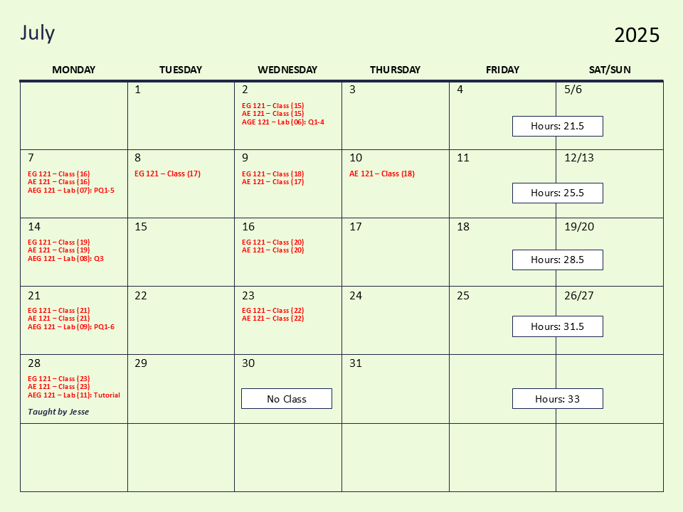

# AE/ENVE/GEOE 121: Computational Method (S2025)

||**Instructor:** Chul Min Yeum (cmyeum@uwaterloo.ca)   **WEEF TA:** Daniella Chan (daniella.chan@uwaterloo.ca)   **Graduate TA:** Jesse St. John - Parker (jstjohnparker@uwaterloo.ca)   **AE Class:** Mon (1:00-2:20 PM) and Wed (1:00-2:20 AM) at CPH-3604   **EG Class:** Mon (8:30-9:50 PM) and Wed (8:30-9:50 AM) at EIT-1015   **Lab:** Mon (3:30 to 5:50 PM) at E2-1792 and CPH 1346   **Office hours (TA)**: Visit the WEEF TA office (E2-1787)   **Office hours (Instructor)**: By appointment|
|:--------|:-----------|

**Courses in previous terms**
- [**Computational Method (Winter, 2025)**](old/w2025)
- [**Computational Method (Spring, 2024)**](old/s2024)
- [**Computational Method (Spring, 2022)**](old/s2022)
- [**Computational Method (Winter, 2022)**](old/w2022)
- [**Computational Method (Spring, 2021)**](old/s2021)
- [**Computational Method (Spring, 2020)**](old/s2020)
- [**Computational Method (Spring, 2019)**](old/s2019)

**Key links**  
- [**LEARN**](https://learn.uwaterloo.ca/d2l/home/1118775)
- [**MATLAB Grader- Tutorial: Computational Method**](https://grader.mathworks.com/courses/18318) 
- [**MATLAB Grader- Practice Questions**](https://grader.mathworks.com/courses/166380) 
- [**FAQ document**](qna)
- [**Course material**](comp_method_book_cm_s25.pdf)
- [**Kahoot**](tutorial/Kahoot)

<!-- -  -->
<!-- - [**MATLAB Grader- (S24) Quizzes in previous years**](https://grader.mathworks.com/courses/142536)  -->

<!-- 
- [**MATLAB Grader- Quizzes in previous years**](https://grader.mathworks.com/courses/63504-quizzes-in-previous-years-computational-method)
- [**MATLAB Grader- (S22) AE 121: Quizzes**](https://grader.mathworks.com/courses/76605-s22-ae-121-quizzes)
- [**MATLAB Grader- (S22) ENVE/GEOE 121: Quizzes**](https://grader.mathworks.com/courses/76610-s22-enve-geoe-121-quizzes)
-->

<!-- 
**Folders**   
- [**Class materials**](tutorial/CLASS)   
-->

## Make-up Class
* **Make-up Class (EG121):**
    * Thursday, May 15, 2025 at 3:30 - 4:20pm
    * Tuesday, June 10, 2025 at 2:30 - 3:20pm
    * Tuesday, July 8, 2025  at 2:30 - 3:20pm

* **Make-up Class (AE121):**
    * Thursday, June 12, 2025 at 2:30 - 3:20pm
    * Thursday, July 10, 2025 at 2:30 - 3:20pm

* **Make-up Lab (AE/ENGE/GEOE 121):**
    * Wednesday, July 2, 2025 (Victoria Day Makeup) at 3:30pm
    * (Cancelled) ~~Tuesday, July 22, 2025 at 4:30 - 7:00pm~~
        
## Key Dates
* Victoria Day: Monday, May 19, 2025
* **Quiz 01:** June 02, 2025
* **Quiz 02:** June 23, 2025
* **Quiz 03:** July 14, 2025
* **Quiz 04:** August 11, 2025
* Midterm Week: June 16 – June 20, 2025.
* Final Exam Period: August 5 - August 16, 2025.

## Table of Contents
- [Course Description](#course-description)
- [Course Objectives](#course-objectives)
- [Study Guide](#study-guide)
- [Prerequisites](#prerequisites)
- [Course Textbook](#course-textbook)
- [Course Outline](#course-outline)
- [Course Attendance](#course-attendance)
- [Course Calendar](#course-calendar)
- [Tutorial](#tutorial)
- [Programming Lab](#programming-lab)
- [Quiz](#quiz)
- [Policy for Cheating](#policy-for-cheating)
- [Communication](#communication)
- [Grading](#grading)
- [Note](#note)

## Course Description
This course introduces computer programming for engineering students using MATLAB. MATLAB is an easy and readable programming language and is an excellent choice for those who are learning programming for the first time. This course will cover various topics including programming fundamentals, matrix operations, and data visualization. Students who complete this course will gain a fundamental understanding of computer programming techniques and be able to operate, analyze, and visualize all types of data for future engineering studies. **Remember that this course is not a simple MATLAB tutorial course.** It is an introductory programming course that utilizes MATLAB to illustrate general concepts in computer programming.  

This course includes lectures, tutorials, and quizzes:
* [**Lectures**](#course-outline) are to cover the major topics, discussing the important programming concepts with worked-out examples. The instructor will teach the [*course material*](comp_method_book_cm_s21.pdf). 
* [**Tutorials**](#tutorial) are **self-study** resources to assist students to solve the problems in the course material, lab assignments, and quizzes. Students can find the problems on [*Tutorial: Computational Method*](https://grader.mathworks.com/courses/18318-tutorial-computational-method) in the MATLAB Grader.       
* [**Programming Lab**](#programming-lab) are to provide practice for programming and evaluate your progress on the understanding of the course material. They are posted on the MATLAB Grader.
* [**Quizzes**](#quiz) are to evaluate your knowledge and programming skills. There will be four quizzes over the course. 

## Course Objectives
By the end of this course, students should be able to  
* Develop MATLAB programming logics to solve problems. 
* Compose working, efficient, and readable MATLAB scripts in various ways.
* Debug your code to identify and fix programming errors.
* Identify suitable keywords to search for code snippets on the web.
* Apply MATLAB to write your own program (very important).
* **(newly added) Explain programming logics in the context of using GenAI**
* **(newly added) Interpret and understand existing MATLAB scripts**

## Study Guide
* Solve problems in the course materials and tutorials by yourself (please follow [the following instruction](#tutorial)).
* Type and run all scripts of sample solutions in the course material and tutorial videos. Never skim the code.  
* Make online engagement through **LEARN** or or ask for help from TA.   
* Watch tutorial videos to check your answers to the problems.
* Employ an editor, Workspace browser, and debugging tool to solve the problems (not on MATLAB Grader). 

**Special Guide Using Generative Artificial Intelligence:** You may utilize generative AI tools to support studies. However, it's important that you first attempt to solve the problems on your own and then compare your solutions with those generated by the AI. This approach ensures you enhance your programming skills. Please note that the use of generative AI tools is not permitted during quizzes. 

## Prerequisites
"Linear algebra" (AE/CIVE/ENVE/GEOE 115) is a prerequisite for this course, which you  already learned in the 1A term. If you are not familiar with these topics, please review corresponding lecture slides or tutorials. 

* [**How to use MATLAB Grader?**](doc/matlab_grader)
* [**How to download and install MATLAB on your computer?**](doc/matlab_install)

## Course Textbook 
This course is not based on any particular textbook. However, the [course materials](comp_method_book_cm_s21.pdf) have been prepared using the following two references:
* Attaway, Stormy. *"MATLAB-A Practical Introduction to Programming and Problem Solving,"* Elsevier, 2018.
* Moore, Holly. *"MATLAB for Engineers,"* Pearson, 2017.

## Course Outline
All lectures will be delivered in person. The lectures will cover the course materials (You can download it from [**here**](comp_method_book_cm_s21.pdf)), developed by the instructor. Quizzes are all cumulative. The quizzes to be covered are based on the knowledge from the current and all previous modules. 

Lectures are to deliver fundamental knowledge and information in each module and **are not to give a direction on how to solve quizzes**. However, all the practice problems were designed based on the course materials. Thus, if students do not find the relevance between them, they have not understood lectures yet and should carefully review them again. 

### Schedule
|Module|Topics|Hours (cumsum)|[Quiz](#quiz)| 
|:-----|:-----|:--:|:-----------:|
|**Module 00**|Preliminaries|1 (1)||
|**Module 01**|Basic MATLAB Programming|3 (4)||
|**Module 02**|Vectors and Matrices|4 (8)|**Quiz 01**|
|**Module 03**|Selection Statement |3 (11)||
|**Module 04**|Loop Statement|4 (15)|**Quiz 02**|
|**Module 05**|Built-in Functions|3 (18)||
|**Module 06**|Operator|5 (23)|**Quiz 03**|
|**Module 07**|Function|5 (28)|**Quiz 04**|
|**Module 08**|Plotting|1 (29)||
|**Module 09**|Data Structure|3 (32)||

## Course Attendance
Students have to attend all classes to receive 15 point attendance scores. The attendance will be checked using Kahoot game sessions. There are several Kahoot game sessions across the classes. Among them, I will randomly check the attendance only for **8 sessions**. I will check the attendance at the class when the student participation is low. 

Students receive 2.5 points if they simply **join the Kahoot sessions** in the class. The maximum score that students will receive from these games is 15, which mean students can get a full mark (15 points) if they join at least 6 sessions that the intructors accounts the attendance. This considers unavoidable absence, such as illness, job interview. The students need to bring their cell phones or laptops to join these games. If students did not bring the phone or laptop or its battery is out, students must inform TA before starting the game. 

Students **DO NOT HAVE TO** inform TA or instructor for their absent in the session when I check the attendance. No matter the reason, students **cannot** get the point if they do not join the game during the class. For example, even if a student has illness and cannot attend, no exception will be made. The rationale is that there is no reason a student cannot attend random three classes.  Students can still get a full attendance mark although they miss one or two classes (games). Thus, we will **not arrange a special accommodation for the attendance.** Please do not send an email to the instructor or TA to explain your absent. 

To participate the game, the instructor will show the students a game pin number. 

* Step 1: Go to the Kahoot! website [https://kahoot.it/](https://kahoot.it/) and type a pin number. The instructor will show the pin number in each game. 
* Step 2: **(Mandatory) Type your university ID as your nick name**
* Step 3. You are ready for joining the game    

|||
|:--------:|:-----------:|
|**Step 1**|**Step 2**|
|||
|**Step 3**||

**(Very Important)** When students check the attendance by dishonest means (e.g. a student present at a class join the game using more than one account, remotely access the game using a pin number, informed by a student present at a class), they are considered as an academic offense and receive 0 for **all attendance score**. And they are disciplined by [Policy for Cheating](#policy-for-cheating)    

We will update your attendance record in LEARN. If the record is not correct, please send an email to TA.   

## Course Calendar

| |
|:---:|
| | 
| | 

## Tutorial
The tutorials are self-study resources to assist students in the problems of course material and quizzes. Students can find the problems on [**Tutorial: Computational Method**](https://grader.mathworks.com/courses/18318-tutorial-computational-method) in the MATLAB Grader. The model answers for all tutorial problems were posted on this [**page**](tutorial). All students are **highly recommended** to solve practice problems to prepare for your quizzes. Here is how to study the tutorial. 

* **Step 1.** Understand a problem listed on each Module in MATLAB Grader: You need to carefully read the description of problems on [**Tutorial: Computational Method**](https://grader.mathworks.com/courses/18318-tutorial-computational-method) or from this [page](tutorial).

* **Step 2.** Write your own script to solve the problems: You should use a MATLAB program and write your own program to solve the question. You need to do practice on debugging to fix errors on your code if necessary. Please do not look at the model answer or watch the solution video before you make your own script.  

* **Step 3.** Copy and paste your script to the MATLAB Grader: If you think your script is ready for testing, copy and paste the script to the MATLAB Grader. Click "Run Script" first to check out any syntax or run-time errors (if you already check this on the MATLAB program, you should not see the error message). 

* **Step 4.** Submit your solution: Many tests (assessments) were pre-designed to evaluate the correctness of your solution. You need to ensure that your solution passes all the tests. However, you should not do hard coding to pass the tests. Developing the right logic on your code is much more important than passing the test. For example, many students got zero on problems in the quizzes last year, although they pass all tests. Passing the test is just to check the quality of your script (like pre-screening) but does not mean that your script is correct or written based on a right programming logic.           

* **Step 5.** Review the model solution: The model solutions for all problems were already posted on this [page](tutorial). The instructor recorded videos to review those problems. Students are encouraged to mimic how the instructor writes the script and debug its error. Although the model answer is simply one of the possible ways to solve the problem, they were written based on the key knowledge or methods covered in the corresponding or prior modules.   

* **Step 6.** Type and run the model script: Skimming the code is not a good way to improve your programming skill. You should type them and run the script in the MATLAB program and MATLAB Grader. I would say programming is like learning sports. You should do practice with your hand, not by eye. 

* **Step 7 (Very important).** Improve your original script: Although you may practice using the model solutions, it is important to develop your own script. A better approach is trying to improve your original script based on the model solution. For example, updating programming logic or shortening the scripts will be greatly helpful that you can employ such code in your future script. Try solving the program again without looking at your original script or model solutions. You will see that your new script will not be the same as the model solution but are much more efficient and compacted than your original ones. 

You do not have to memorize any of the solutions. You can freely access all these solutions during the quizzes because they are open-book quizzes. However, I tell you, without going through this process, you cannot write your own script during the quizzes and will not get a good mark on them. 

## Programming Lab
The programming labs include module reviews and quizzes. The programming labs are designed to focus on hands-on practice with MATLAB programming. Students can use the computers in the lab or bring their own laptop if MATLAB is installed. Students are highly encouraged to attend the programming labs. WE will not check the attendance of the programming lab. 

## Quiz
The quizzes will be delivered through the MATLAB Grader like tutorials or lab assignments, and written tests. 
<!-- 
* **AE**: [https://grader.mathworks.com/courses/76605-s22-ae-121-quizzes](https://grader.mathworks.com/courses/76605-s22-ae-121-quizzes)
* **ENVE/GEOE**: [https://grader.mathworks.com/courses/76610-s22-enve-geoe-121-quizzes](https://grader.mathworks.com/courses/76610-s22-enve-geoe-121-quizzes)

The major differences are a **time limit** and **a limited submission**. Remember that although students do not pass pre-designed tests, they are not able to go back and edit their submitted solutions. Students are strongly encouraged to test and evaluate their solutions using a MATLAB (program) editor before submission. 
-->

### Schedule 
|Quiz|Topics|Date|Duration|Location|Instruction|
|:---|:-------|:-----|:----|:----|:----|
|**Quiz 01**|Module 01 ~ 02 (PQ1-2)|June 02|95 minutes|CPH-1346 and E2-1792 |[**Link**](doc/Quiz1_Description.md)|
|**Quiz 02**|Module 01 ~ 04 (PQ1-3)|June  23|105 minutes |CPH-1346 and E2-1792 |[**Link**](doc/Quiz2_Description.md)|
|**Quiz 03**|Module 01 ~ 06 (PQ1-5)|July 14|120 minutes|CPH-1346 and E2-1792 |[**Link**](doc/Quiz3_Description.md)|
|**Quiz 04**|Module 01 ~ 07 (PQ1-6)|August 11|150 minutes|CPH-1346 and E2-1792 ||

<!--
|[**Quiz 01**](doc/Quiz1_Description.md)|Module 01 ~ 02|May 27|110 minutes|CPH-1346 and E2-1792 |[**Link**](doc/Quiz1_Description.md)|
|[**Quiz 02**](doc/Quiz2_Description.md)|Module 01 ~ 04|June 24|130 minutes|CPH-1346 and E2-1792|[**Link**](doc/Quiz2_Description.md)|
|[**Quiz 03**](doc/Quiz3_Description.md)|Module 01 ~ 06|July 15|130 minutes|CPH-1346 and E2-1792|[**Link**](doc/Quiz3_Description.md)|
|[**Quiz 04**](doc/Quiz4_Description.md)|Module 01 ~ 07, 09, 11|August 09|150 minutes|CPH-1346 and E2-1792|[**Link**](doc/Quiz4_Description.md)|
-->

## Policy for Cheating 

**This course is supported by a full-time WEEF TA. If you have any questions, please visit the WEEF TA office for assistance, or you may also post queries on the LEARN discussion board.**  

**Quiz:** Our teaching team will throughly review your answer. TAs will use software to detect any plagiarism in your scripts. It's important to understand that attempting to deceive the TAs or the instructor is futile. Even if you successfully solve all problems on the MATLAB Grader, **your quiz (both written and grader) will be graded zero if found to be plagiaristic.** This applies equally to those who copy and those who allow their work to be copied, with both parties facing potential reporting to the Engineering Undergraduate Associate Dean (AD) for academic offenses. 

**Attendance:** It has been observed that some students share links to allow absent peers to participate in Kahoot sessions remotely. This is a serious offense. Detected violations will result in a loss of all attendance marks, irrespective of past presence. Violations will result in a loss of 15 marks and be reported to AD. Repeated offenses may result in further disciplinary action from the AD. Please act with integrity to avoid regrets.

Please review [**Policy 71 – Student Discipline**](https://uwaterloo.ca/secretariat/policies-procedures-guidelines/policy-71).
          
## Communication  
**All communication will be made through LEARN but all information related to the course will be posted on this course website.** Students are responsible for checking the course website regularly. LEARN will be only used for announcements and online Q&A discussions.   

Students are invited to ask questions and answer them and share their knowledge and resources. Please direct your communications to the Discussion Forum on LEARN. However, if there is a good reason not to use the discussion forum (e.g., personal matters, a question that might reveal your solution of your report, etc.), please directly contact the TAs or instructor via email.  

Please follow the instruction having Discussions on LEARN below:
- Please be respectful of your peers, instructor, and others in your posts and comments.
- **When you ask questions about tutorial problems, please indicate the problem number in the title. (e.g., M01001: YOUR TITLE)** 
- Asking good questions is another way of learning by summarizing and explaining what you know and do not know. Thoughtful questions and answers will help all students in this class. Before posting a question, please ask yourself whether you are truly stuck (meaning that the answers cannot be readily found on the web) and your questions are complete and legible.
- In addition, please check if the same question was asked before.  
- Inappropriate posts and comments will be immediately deleted and closed without notice.

Before you ask questions, please take a look at the following [**Q&A document**](qna) first. It is a compilation of frequently asked questions for each Module. You might find the answers to your questions!

## Grading  
|Component|Scores|
|:---|:-----|
|**Attendance**|15|
|**Quiz #1**| 15 |
|**Quiz #2**| 20 |
|**Quiz #3**| 25 |
|**Quiz #4**| 30 |
|**Total** |105| 

## Note
### Generative artificial intelligence
Generative artificial intelligence (GenAI) trained using large language models (LLM) or other methods to produce text, images, music, or code, like Chat GPT, DALL-E, or GitHub CoPilot, may be used for assignments in this class with proper documentation, citation, and acknowledgement. Recommendations for how to cite GenAI in student work at the University of Waterloo may be found through the Library: https://subjectguides.uwaterloo.ca/chatgpt_generative_ai. Please be aware that generative AI is known to falsify references to other work and may fabricate facts and inaccurately express ideas. GenAI generates content based on the input of other human authors and may therefore contain inaccuracies or reflect biases. 

In addition, you should be aware that the legal/copyright status of generative AI inputs and outputs is unclear. Exercise caution when using large portions of content from AI sources, especially images. More information is available from the Copyright Advisory Committee: https://uwaterloo.ca/copyright-at-waterloo/teaching/generative-artificial-intelligence  

You are accountable for the content and accuracy of all work you submit in this class, including any supported by generative AI. 

### Academic integrity
In order to maintain a culture of academic integrity, members of the University of Waterloo community are expected to promote honesty, trust, fairness, respect and responsibility. [Check <a href="https://uwaterloo.ca/academic-integrity/">the Office of Academic Integrity</a> for more information.]

### Grievance 
A student who believes that a decision affecting some aspect of his/her university life has been unfair or unreasonable may have grounds for initiating a grievance. Read <a href="https://uwaterloo.ca/secretariat-general-counsel/node/100">Policy 70, Student Petitions and Grievances, Section 4</a>. When in doubt, please be certain to contact the department’s administrative assistant who will provide further assistance.

### Discipline
A student is expected to know what constitutes academic integrity to avoid committing an academic offence, and to take responsibility for his/her actions. [Check <a href="https://uwaterloo.ca/academic-integrity/">the Office of Academic Integrity</a> for more information.] A student who is unsure whether an action constitutes an offence, or who needs help in learning how to avoid offences (e.g., plagiarism, cheating) or about “rules” for group work/collaboration should seek guidance from the course instructor, academic advisor, or the undergraduate associate dean. For information on categories of offences and types of penalties, students should refer to <a href="https://uwaterloo.ca/secretariat-general-counsel/node/97">Policy 71, Student Discipline</a>. For typical penalties, check <a href="https://uwaterloo.ca/secretariat-general-counsel/node/131">Guidelines for the Assessment of Penalties</a>.

### Appeals
A decision made or penalty imposed under <a href="https://uwaterloo.ca/secretariat-general-counsel/node/100">Policy 70, Student Petitions and Grievances</a> (other than a petition) or <a href="https://uwaterloo.ca/secretariat-general-counsel/node/97">Policy 71, Student Discipline</a> may be appealed if there is a ground. A student who believes he/she has a ground for an appeal should refer to <a href="https://uwaterloo.ca/secretariat-general-counsel/node/99">Policy 72, Student Appeals</a>.

### Note for students with disabilities 
<a href="https://uwaterloo.ca/disability-services/">AccessAbility Services</a>, located in Needles Hall, Room 1401, collaborates with all academic departments to arrange appropriate accommodations for students with disabilities without compromising the academic integrity of the curriculum. If you require academic accommodations to lessen the impact of your disability, please register with AccessAbility Services at the beginning of each academic term.

### Turnitin.com
Text matching software (Turnitin®) may be used to screen assignments in this course. Turnitin® is used to verify that all materials and sources in assignments are documented. Students' submissions are stored on a U.S. server, therefore students must be given an alternative (e.g., scaffolded assignment or annotated bibliography), if they are concerned about their privacy and/or security. Students will be given due notice, in the first week of the term and/or at the time assignment details are provided, about arrangements and alternatives for the use of Turnitin in this course.

It is the responsibility of the student to notify the instructor if they, in the first week of term or at the time assignment details are provided, wish to submit alternate assignment.

