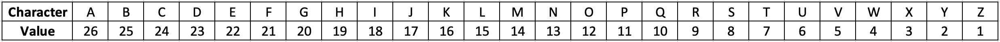

# Extra Assignment 2

## Work Evaluations Part I & II (★★★)
A large company does performance reviews on their employees every 6 months. After each meeting, their performance is summarized into a single word summary. There are seven options are:

```matlab
evaluations = ["Unsatisfactory", "Marginal", "Satisfactory", "Good", "Very Good", "Excellent", "Outstanding"];
```

The cell array 'emp_evals' contains the evaluations for all employees. **'emp_evals' is a cell variable, where each element indicates a set of evaluations of each employee received during work period.** The 5th element in 'emp_evals' corresponds to the evaluation for Employee 5. The element in each cell contain a string array including evaluations. **Since the work period of each employee is different, the size of the string array in each cell is different.** 

Below is the script to generate 'emp_evals'.

```matlab
evaluations = ["Unsatisfactory" "Marginal" "Satisfactory" "Good" ...
    "Very Good" "Excellent" "Outstanding"];

num_emp = randi([50 150]); % Company will have a random number of employees between 50 and 150
                          
emp_evals = cell(1, num_emp); % Each cell contains an evaluation array corresponding employee
                             
for ii = 1:num_emp
    num_work_terms = randi([4 70]); % Employee will have between 4 and 70 work terms
                            
    idx = randi(7,1, num_work_terms); % Generate random numbers between 1 and 7
                                      % as indices for 'evaluations' (generating
                                      % what performance reviews the employee will
                                      % get). Note these numbers can repeat!
                              
    indiv_evals = evaluations(idx); % 1 X num_work_terms string arrays of evalutions
    emp_evals{ii} = indiv_evals'; % Assign the employees evaluations to
                                  % location ii in the cell. Transpose to
                                  % turn the row vector of strings into a
                                  % column vector strings
end
```

(a) RatingChecker, which determines the total number of an inputted rating for each employee. RatingChecker accepts two inputs. The first is the data 'emp_evals' and the second is the desired rating, specified as a string. The function outputs a 1 x 'num_emp' row numeric vector containing the number of times each employee recieved that rating. 

```matlab
function num_ratings= RatingChecker(emp_evals, rating)
```

If you want to know how many "Outstanding" evaluations are received in each empolyee, you will run 

```matlab
num_rating_outstand = RatingChecker(emp_evals, 'Outstanding');
```

(b) ExcellentEmployee, which finds the number of employees who have at least 3 evaluations of 'excellent' or 'outstanding' during all terms. The output named 'emp_nums' is a scalar variable. If no employees meet the condition, 0 is assigned to 'emp_nums'.

```matlab
function emp_nums = ExcellentEmployee(emp_evals)
```

Please note that you can use the function that you created into other functions! Re-using functions will help you save time. For example:

```matlab
function output=mymean(vec)
output = mysum(vec)/numel(vec)
end

function output=mysum(vec)
output = 0
for ii=numel(vec)
    output=output+vec(ii)
end

end
```

(c) TermFinder, which accepts the data 'emp_evals' as an input and produces an output variable named as 'terms_all' which is the number of performance reviews (terms) each employee has had. 'terms_all' is a 1 x 'num_emp' row vector. 

```matlab
function terms_all = TermFinder(emp_evals)
```

(d) AveragePoint, which finds the average point for all employees. The average should be taken over all employees. For further clarification, the function outputs the average point rating of a singular work term. The point schemes are provided below:
- Outstanding is worth 7 Points
- Excellent is worth 6 Points
- Very Good is worth 5 Points
- Good is worth 4 Points
- Satisfactory is worth 3 Points
- Marginal is worth 2 Point
- Unsatisfactory is worth 1 Points

'avg_evals' is a scalar variable. 

```matlab
function avg_evals = AveragePoint(emp_evals)
```

Example:
- emp 1 : 3 excellent terms
- emp 2 : 2 outstanding terms and 1 excellent 
- emp 3 : 1 very good
- total terms= 3+2+1+1 = 7
- tot_avg = (4 excellent * 6 + 2 outstanding * 7 + 1 very good *5) / total terms

Note that you can copy and paste functions from part I and reuse them! (Hint: RatingChecker)

**Solution**

```matlab
evaluations = ["Unsatisfactory" "Marginal" "Satisfactory" "Good" ...
    "Very Good" "Excellent" "Outstanding"];

num_emp = randi([50 150]); % Company will have a random number of employees between 50 and 150
                          
emp_evals = cell(1, num_emp); % Each cell contains an evaluation array corresponding employee
                             
for ii = 1:num_emp
    num_work_terms = randi([4 70]); % Employee will have between 4 and 70 work terms
                            
    idx = randi(7,1, num_work_terms); % Generate random numbers between 1 and 7
                                      % as indices for 'evaluations' (generating
                                      % what performance reviews the employee will
                                      % get). Note these numbers can repeat!
                              
    indiv_evals = evaluations(idx); % 1 x num_work_terms string arrays of evalutions
    emp_evals{ii} = indiv_evals'; % Assign the employees evaluations to
                                  % location ii in the cell. Transpose to
                                  % turn the row vector of strings into a
                                  % column vector strings
end

% Script Testing


% (a)
num_ratings_test  = cell(1,7);
for ii = 1:7
    num_ratings_test{ii} = RatingChecker(emp_evals, evaluations(ii));
end

% (b)
emp_nums_test = ExcellentEmployee(emp_evals);

% (c)
num_terms_test = TermFinder(emp_evals);

% (d)
avg_evals_test = AveragePoint(emp_evals);

% please design four functions to test the above script. 


% (a) RatingChecker, which determines the total number of an inputted
% rating for each employee. RatingChecker accepts two inputs. The first is
% the data 'emp_evals' and the second is the desired rating, specified as a
% string. The function outputs a 1 x 'num_emp' vector containing
% the number of times each employee recieved that rating.

function num_ratings= RatingChecker(emp_evals, rating)

num_emp = length(emp_evals);
num_ratings = zeros(1,num_emp);
for ii = 1:num_emp
    employee = emp_evals{ii};
    rating_comp = (rating == employee);
    num_same = sum(rating_comp);
    num_ratings(ii) = num_same;
end

end

% (b) ExcellentEmployee, which finds the employee numbers who average at
% least 1 excellent rating every 3 evaluations. ExcellentEmployee accepts
% the rating data 'emp_evals' and outputs the employee numbers who meet the
% condition described above in a row vector. If no employees meet the
% condition, then a 1x0 double vector should be returned.

function emp_nums = ExcellentEmployee(emp_evals)

num_excellent = RatingChecker(emp_evals, "Excellent");
num_outstanding = RatingChecker(emp_evals, "Outstanding");

good_evals = num_excellent + num_outstanding;

emp_nums = sum(good_evals >= 3);

end

% (c) TermFinder, which accepts the data 'emp_evals' and outputs the 
% number of performance reviews (terms) each employee has had in the form of a 
% row vector.

function terms_all = TermFinder(emp_evals)

terms_all = zeros(1, numel(emp_evals));
for ii = 1:length(emp_evals)
    employee_data = emp_evals{ii};
    terms_all(ii) = numel(employee_data);
end

end

% (d) AveragePoint, find an average point for all employees. The point schems are prvoided below:

% Outstanding is worth 7 Points
% Excellent is worth 6 Points
% Very Good is worth 5 Points
% Good is worth 4 Points
% Satisfactory is worth 3 Points
% Marginal is worth 2 Point
% Unsatisfactory is worth 1 Points


function avg_evals = AveragePoint(emp_evals)
evaluations = ["Unsatisfactory" "Marginal" "Satisfactory" "Good" ...
    "Very Good" "Excellent" "Outstanding"];
points = 1:7;

num_terms = TermFinder(emp_evals);

total_points = 0;
for ii = 1:length(evaluations)
    num_rating = RatingChecker(emp_evals, evaluations(ii));
    num_points = num_rating * points(ii);
    total_points = total_points + num_points;

end


total_sum = sum(total_points);

avg_evals = total_sum / sum(num_terms);


end
```

## Function: UpperLetterScore (★★★)

Create a function called UpperLetterScore that accepts one input named 'char_seq' and one output named 'upper_score'. 

```matlab
function upper_score = UpperLetterScore(char_seq)
```

'char_seq' is a character vector that contains lower-case letters, symbols, and upper-case letters. 

Only upper-case letters have the following values:


'upper_score' can be computed by adding all equivalent values for ONLY upper-case letters. 
Here are some sample results:

**Example 1**
```matlab
>> upper_score = UpperLetterScore('MATLAB')

upper_score =

    113
```
upper_score = 14 ('M') + 26 ('A') + 7 ('T') + 15 ('L') + 26 ('A') + 25 ('B') = 113

**Example 2**
```matlab
>> upper_score = UpperLetterScore('Matlab')

upper_score =

    14
```
upper_score = 14 ('M') . Here, 'M' is the only upper-case letter.

**Example 3**
```matlab
>> upper_score = UpperLetterScore('Hi! MATLAB')

upper_score =

    132
```
upper_score = 19 ('H') + 14 ('M') + 26 ('A') + 7 ('T') + 15 ('L') + 26 ('A') + 25 ('B') = 132.

Note that you cannot manually calculate the score and then assign the result. Your programming logic should be applicable in general, not specific for testing character vector. 

**Hint:** a built-in function count can be used

**Solution 1**

```matlab
test_char_seq = 'Students in AEG121 are in ENVE, GEOE, or AE';
test_upper_score = UpperLetterScore(test_char_seq);

% please design your function called UpperLetterScore

function upper_score = UpperLetterScore(char_seq)

char_seq_db = double(char_seq);
values = 26:-1:1;
alp_vec = 65:90;

upper_score = 0;
for ii = 1:numel(alp_vec)
    score = sum(char_seq_db == alp_vec(ii)) * values(ii);
    upper_score = upper_score + score;
end


end

```

**Solution 2**

```matlab

test_char_seq = 'Students in AEG121 are in ENVE, GEOE, or AE';
test_upper_score = UpperLetterScore(test_char_seq);

% please design your function called UpperLetterScore


function upper_score = UpperLetterScore(char_seq)
values = 26:-1:1;
num_char = zeros(1,26);
alp_vec = char(65:90);

for ii = 1:numel(alp_vec)
       num_char(ii) = count(char_seq, alp_vec(ii));
end

upper_score = sum(num_char.*values);

end

```

## Pokemon Trading Cards (★★★)
You're in the good (or horrible) days of middle school where people are trading hockey cards, yugioh cards, and pokemon cards. After recess, you bring your binder of pokemon cards to trade with your school friends. Since you are trying to collect them all,  you decide that you are only willing to trade duplicate cards. After bartering, you finally convinced your friend that your duplicate cards are valueable enough for a holographic Charizard. Your task is to decide which duplicate card (that you are willing to trade) has the highest attack damage, because afterall, it is a holographic charizard and you dont want to rip off your colleagues. 


Create a function called 'bestcard' which determines the highest value duplicate pokemon card you can trade. The function accepts one input and has one output.

```matlab
function trade = BestCard(cards)
```

'cards' contains an entire 1 x 20 double vector of ones and zeros. The cards that are represented as one are cards your trading partner wants to obtain. The cards represented by zero are cards that you are defintely not willing to trade and you do not have duplicates of those cards. The cards are ordered from weakest to strongest, so the ones that are on the right hand side of the 'cards' vector are stronger. However, please note that the card duplicates for trade are placed NEXT TO EACH OTHER and that there can only be 2 cards that are duplicates of eachother. In other words there are only two logical '1's that stand next to eachother. This means that if there is a one by itself, you are not willing to put it up for trade. 

For example:
up for trade: '11011'
not up for trade: '0101'
The output 'trade' should be the first index of the duplicate card with the highest attack points. Note: bigger attack points just means that the card is stronger.

**Example 1:**
If 'cards' equals the following vector:
cards=[10011011010101101010]
The output would be:
    trade=14
14 is the index of the first '1' that exists in the farthest duplicate in right hand side of the vector.  

**Example 2:**
If 'cards' equals the following vector:
cards=[11011010101010010010]
The output would be:
    trade=4
4 is the index of the first '1' that exists in the farthest duplicate in right hand side of the vector.  

The '1' that stands alone have absolutely no play in the outcome.

Hint: Use **strfind** to find strings within character vectors. While the question uses a double vector, you can convert logical arrays into a character vector and use the strfind function. For example if you want to find the first index of when there are two 1's in a char vec:
charvec='011001'
duplicate_idx=strfind(charvec, '11')
OUTPUT:
duplicate_idx= 2
strfind will give you the first index value of the matching string. Please use this function to your advantage.

**Solution**

```matlab

%cards_array
pokemon_cards=zeros(1,20);
num=randi([3 4]);
duplicate_idx=1:3:numel(pokemon_cards)-1;
for ii=1:num
    rand_idx=randi(numel(duplicate_idx));
    pokemon_cards(duplicate_idx(rand_idx):duplicate_idx(rand_idx)+1)=1;
end
for ii=1:numel(pokemon_cards)-2
    if pokemon_cards(ii:ii+2)==0
        pokemon_cards(ii+1)=1;
    end
end
pokemon_cards=logical(pokemon_cards);
good_trade=BestCard(pokemon_cards);


function trade=BestCard(cards)
logi_vec=cards;
dup_idx=strfind(char(logi_vec+'0'),'11');
trade=max(dup_idx);
end

```