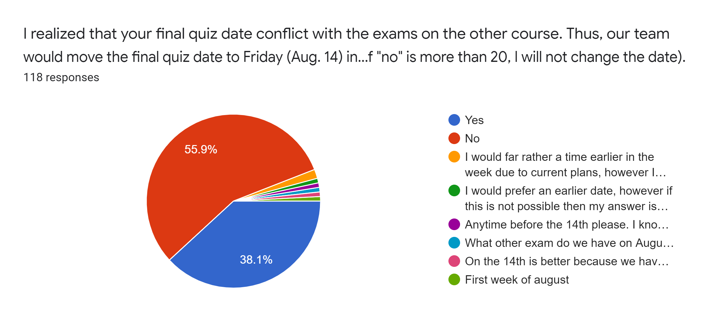

# AE/ENVE/GEOE 121: Study Progress Survey (8th Week)

## Overview
Our teaching team really appreciate all valuable feedback and they will help design the rest of this course. Overall, the feedback clearly divides into halves. For the students who are familiar with vectorized scripts and functions, they did not feel that Quiz#3 was more difficult than the last two quizzes. If the students are not familiar with built-in function, operator, and functions, these problems were much more difficult. They couldn't even solve any single one. 

Please watch all videos that we posted. Our teaching team emphasized the importance of "function" in the tutorial and overview videos several times. It is true that the problems are not similar to the assignments like Quiz 2. However, all questions are not something that you are not able to solve within this time limit. 

Based on your feedback on Quiz 3, we will make the following changes in Quiz 4.
- There will be no change on the final quiz date. It will be on **Aug 11**.
- The length of the exam will be **150** minutes.
- You will submit your solutions **unlimited** times. Since we look at your solutions, passing the tests has no meaning in your grade. Some answers got full marks although they did not pass the tests. We evaluate your script!
- The number of problems will be 6 ~ 7. We will not give more questions although the time limit increases. 
- There will be one or two extra problems. 

**CM:** Some students complain that the example and assignments are useless for taking the quiz. However, that's not true. I made questions based on what I taught in lecture and tutorial. Please review all model solutions carefully. 

**NG:** Some students complain that the review videos are not related to the quiz questions at all. I totally disagree becasue the examples discussed in the videos are pretty similar to the quiz questions, and I gave hints in the video as well. We are not supposed to talk about the exact same questions in the review videos beacuse it will be no point of having this quiz in that way. I did mention that functions can be applied to any questions we've covered in the course and you need to get the idea of how functions work in the video, but you probably missed the piece of information if you skipped a lot when watching this video. Also, we changed the question names in the video beacuse we don't want you to put the video on and look at the solutions in the middle of the quiz. It does not reflect yor real MATLAB skills if you do that. However, I will be clearer and discuss the quiz in general at the beginning of the next review video! Thank you for giving us your feedback.

## Survey Results
### Q. How did you feel about your third MATLAB quiz 3? Note that the target overall average is 70.

**CM:** This is what level of difficulty our teaching team expects. Remember that more than the half of students are meant to feel difficult on this quiz. Last year, among top 5 student, only one student had programming background. Programming background helps keeping up with this lecture but does not highly correlate with your grade.  
  

### Q. I realized that your final quiz date conflict with the exams on the other course. Thus, our team would move the final quiz date to Friday (Aug. 14) in the same week. Do you agree with this schedule change? (Note that if the number of "no" is more than 20, I will not change the date).

**CM:** More than the half of student do not want to delay the final date. Let's keep the original schedule. Our teaching team does not want to put you under pressure. I think many people are on the same page with this student:
*Please do not change the date of the final. I already hate my life because of school. I can't do it anymore. not even another 5 days. please please please. I beg of you. I just need it to be over. I would do all my finals in one day if I could.*

## Overview Plan for Quiz 4 

**Help Session:** We will keep the original schedule of help session.

**Extra Help Session:** The TAs will have extra Q&A sessions on WebEX Teams over the weekend. The office hours are listed below.

Vlad: 12-9 PM, Saturday, August 8th.
Noreen: 12-9 PM, Sunday, August 9th.

**Extra Practice:** We will post an extra practice assignment on the grader since many students have requested. Also, This assignment will help you earn **2 extra marks on the final grade** if you sumbit all the questions and pass all the tests. If you submit all the solutions but do not get all of them right, you can only get 1 extra mark.

**Review Videos:** Vlad and Noreen will make a review video each for quiz#4.

**Thank you for all 118 students proving us great feedback!!**

