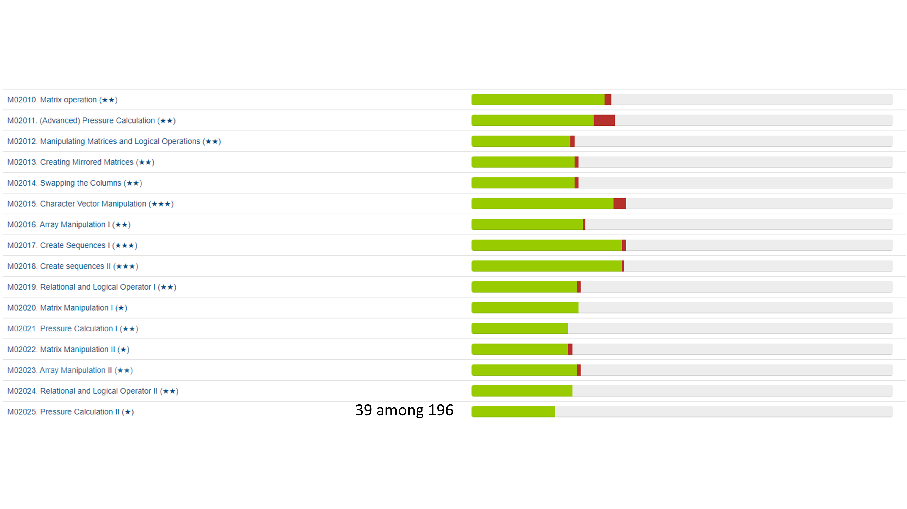

# Feedback Review for Quiz 1

## Overview
I would first talk about the grading scheme in this course. 

|Component|Scores|
|:---|:-----|
|**Homework assignments**| 25 |
|**Quiz #1**| 10 |
|**Quiz #2**| 15 |
|**Quiz #3**| 20 |
|**Quiz #4**| 30 |
|**Online engagement**|extra up to 6*|
|**Total** |100| 

from [https://github.com/chulminy/AE_ENVE_GEOE_121#grading](https://github.com/chulminy/AE_ENVE_GEOE_121#grading)

I designed this course so that **the final class average ranges from 75 to 80**. I assume that you receive a full mark from homework assignments and online engagement if you desire the final grade that is above average. This is the bare minimum for students who take this course if they are willing to learn from this course. Both your online engagement (6%) and assignment mark (25%) contribute to 31% of your final grade. This is definitely not a small number. 

Let's assume that you receive 50 from all quizzes (actually very low score). That will become 37.5% of your overall grade, and your final course average becomes 68.5. Now let’s consider a scenario where you receive an average 70 from your quizzes, then your final grade becomes 83.5. Although you received low scores on the quizzes, they do not drastically affect your final grade because you get the basic marks from the homework assignments and online engagement. If you receive over average 80 on quizzes, you will get over 90 in your final grade. I hope you understand this grading mechanism. 

I understand you want to receive perfect scores and top grades on your quizzes but this grading mechanism is meant to take into account that quizzes are typically harder to receive outstanding grades. I would say that the expected class averages for the quizzes in our course will not be over 70, which is why participation and assignment grades hold such high contributions to your final grade. I think this is fair. In that sense, the quizzes that follow up will be harder than Quiz 1, so be sure to study effectively for your quizzes, watch review videos, and play an active role in help sessions and Learn discussions. 

I understand you are not happy about the difficulty of the quiz problems. However, it is not hard to pass the course or achieve a descent final grade if you submit all homework assignments on time and receive a full mark from online engagement considering that our quizzes do not hold as much contribution as they normally would. Also, in doing this, we can give an advantage to the students who steadily study this course. Your efforts will pay off! 

## Results
All XXX students responded to the survey and the [**results**](results) are presented below. 

### Q. How did you feel about your first quiz? Note that the target overall average is 70.

### Q. How do you feel about the course overall?

### Q. How do you feel about workload of this course?

## Improvements for Future Quizzes
* Provide more time or reduce the number of questions (if possible)
* Provide three attempts of the submission instead of two. 
* Design problems that will allow students to spend more time on writing scripts rather than understanding the questions (e.g, reusing problem descriptions from homework or tutorial problems).   

## Advice to the Students 
* Please read the course syllabus and quiz instruction carefully. Please read them before taking the quiz.
* **The quiz problems are designed on the assumption that you complete homework and tutorial problems.** 
* You must read all announcements in LEARN. This is the only way we can communicate in an online environment. If they are unclear, please ask us! 
* To get prepared for the quizzes, you are able to solve all tutorial and homework assignments following [the study guideline](https://github.com/chulminy/AE_ENVE_GEOE_121#tutorial).

## Comments & Answers 

### Major comment: lack of time or too difficult
**CY:** More than half of the feedbacks is related to lack of time. Unfortunately, as mentioned in the beginning, we are not considering reducing the difficulty or more time to solve the questions in the following quizzes at this time. If the quiz hours increase, this means that the problems are more difficult. **This is because the average score for the quiz should be below 70.** However, the problems in the following quizzes are designed so that the students can spend more time on writing the scripts rather than understanding the questions and give one more submission trial. We will try to shorten the problems and make them clearer or reuse the description from homework or tutorial problems so that the students do not waste their time understanding the questions. 

The problems are designed based on homework or tutorial problems. If you study them following the [study guideline](https://github.com/chulminy/AE_ENVE_GEOE_121#tutorial), I'm sure that you can solve them within the time limit. However, unfortunately, only very few students asked questions through LEARN and less than 40% of students can receive a participation point for this month as of today. I'm looking at your tutorial progress and only 20% of students tried to solve them. I'm very frustrated.

I should encourage you to study this course. If you can solve quizzes without studying tutorial problems, you will not study tutorial problems any more. That's not good for you. I should do my job. Unless you make an effort, I can't listen your feedback. Let's see the class average for this quiz. If the class average score is too low, I will consider either reducing # of problems or increasing time.

### Miscellaneous

**I would answer some major feedback and address your concerns. Although I didn't answer your individual feedback, you can find the answer to similar questions.**

|Feedback & Answer|
|:---|
|**Student 1:** The quiz was terrible. I know i failed for a facts. This whole course is extremeley difficult for me and i am afraid that i will fail it (not kidding). It was very stressfull and unsufficient to me at all. **Student 2:** 100 minutes is not enough time to finish this quiz. I literally failed this quiz. This course should only be assignment based. This is so stressful.|
|**CY:** Yes. It  is stressful if you are the first-time coder. However, as an engineer, there is no way of avoiding programming. Please talk to TAs or the instructor to talk about your study plan|
|**Student:** The lectures have a great amount of detail and the tutorials and homework have a lot of good practice but they could be a bit closer to the level of the quiz so we aren't caught off guard|
|**CY:** Thank you. I think the quiz problems are easier than the homework or tutorial problems. If you felt difficult about them, I think you might skip Step 6 and 7 for your tutorial and homework problems (https://github.com/chulminy/AE_ENVE_GEOE_121#tutorial). If you do practice more following to this guideline, you will get good scores for upcoming quizzes|
|**Student:** Although I was able to get 85 based on the computer marked parts, I felt severely rushed and in the future I would greatly appreciate extra time to demonstrate a more accurate scope of my understanding!|
|**CY:** You are good now! You will get around 94 based on the marking schem above. Do more practice to get higher than that.|
|**Student:** i feel as though some topics were not explained thoroughly, like for example sequences.|
|**CY:** You can ask questions to TAs or the instructor in person. If you ask such question in LEARN, I will explain it more or give you some relevant practice questions. 
|**Student:** I’d appreciate for the tutorial questions maybe marking which ones are good to practice/strengthen skills and which ones help us learn new ones (e.g. the first pressure question problem is a recommended one and then other ones are like bonus/practice ones)|
|**CY:** I think # of stars indicate them. Problems with less than three starts are to practice or strengthen the lecture topics. More than three is to be more practical questions. However, overall, they are all necessary for building your knowledge in each module.|   
|**Student:** I didn’t feel like there was enough time to complete the work, it was really stressful. Some of the questions we’ve never completed in the homework, and it was hard to figure out the steps to complete it with so little time...|
|**CY:** I think you did not do sufficient practice using the tutorial  and homework questions. Have you studied them following to this guideline? (https://github.com/chulminy/AE_ENVE_GEOE_121#tutorial). If yes and you are still struggle with quiz problems, please consult with TAs or the instructor. It is also a problem that you cannot find the connection between quiz and homework or tutorial problems.|
|**Student:** Some questions were worth thinking how to translate the equation on the paper to the code (e.g. Matrix Pattern Generation and the Alphabet Number Game).|
|**CY:** Yes. I'm going to post model solutions. They are only few lines if you use those knowledge.|
|**Student:** The lecture videos are clear and I’ve been able to grasp concepts well. In my opinion, the assignments have been a good difficulty and length, but the second week’s tutorial seemed long. As for Quiz 1, I thought it was fair for the most part, but I struggled with Q5 even though I thought I prepared well.|
|**CY:** Thank you. Yes. Question 5 is the most difficult in Q1. However, if you see a model answer, you feel that you can solve it with your knowledge.|
|**Student:** I found the TAs pretty helpful with trying to answering questions. The lectures on the other hand are unreasonably long. I have 4 other courses that I’m behind in because I am trying to teach myself coding (I have never coded in my life). I think the ideas of tutorials are great, but have 20 questions and expecting us to do them on our own with no basis is unrealistic. I then have to spend 2-3 hours watching the responses to the tutorials on top of watching the 2-3 hours of lectures. I do not have 40 hours in a day and it’s really upsetting snd i put it so much time and effort it, I am behind in all my classes and still I can’t even complete the quiz. I understand there’s a lot of content to be covered but I have never had a class were the lecture videos were 1-2hoirs nonstop(unless it was art history). I will give it to you that the concepts matched what we learnt but that’s about it. I think I did my part in redoing and studying a lot but it is unrealistic to do 6 questions that have 4-5 parts to them (so that’s 24-30 questions) in 1.5 hours and also try to debug your own code. If the lecture videos are 2 hours long (having 3-4 questions) and it’s done by an experienced prof, it is so unfair to expect students that have very limited coding experience to do 24-30 questions that are all flagged as medium-hard (and only 1 that is supposedly “easy”) in 1.5hours.|
|**CY:** I completely understood your situation. Some students feel very very difficult and the others are not. My course should target the students in the middle. I'm considering reducing the homework questions but I don't think it can address your concern. Only comment on your feedback I can give you is that you should like doring programming. In your generation, you cannot survive without having programming skills. I recommend you need to spend more time on studying this course. TAs and the instructor will help you with. Note that at the end of the course, more than the half of the student who got nearly full grades had no programming experience.|
|**Student:** It would've been helpful if you went further detail for sequences. A lot of us were confused with that problem in the homework. I also would have appreciated more time. Even 2 hours would be enough. Overall, I think you even the lessons thoroughly but maybe include a few examples, similar to the ones on the quiz.|
|**CY:** Please ask questions. I haven't seen any of those questions in LEARN. TAs and the instructor are ready to help you with.|
|**Student:** The quiz was SO DIFFICULT, the questions themselves were doable, I’m not complaining about the difficulty of the questions themselves, I understand them all. HOWEVER, it usually takes me the whole day to answer the 6 questions of the homework. I knew going into this quiz that I wouldn’t be able to do the same amount of questions in 100 mins. It would be nice if it was an all day assignment or if was just less questions. The material itself is good and understandable.|
|**CY:** Yes. please see my answer above.|
|**Student:** I found it personally very difficult, I have had 0 pirror coding experience and found it much harder then the hmwrk assignments, especially given the time constraint. I belive as feedback that would be an ok test if their was no time constraint just like calculus, midterm and final. So I think due to their being a time constraint maybe less questions on the quiz or less difficult ones. The live sessions and lectures and tutorials are very well organized and delivered!|
|**CY:** Yes. It is very challenging for the first-time coder. However, if you do practice following to the study guideline, you are used to solving them within the time limit. TAs and I will support you.  |
|**Student:** I usually spend at least a minimum 3 hours for each homework assignment so I would appreciate if we got an extra 30 minutes to an hour to complete the quiz.|
|**CY:** That's normal if you are a first-time coder. You will be used to it and be fun with programming! Regarding the extra time, I answered it above.|
|**Student:** Live sessions and tutorial questions were helpful in preparing for the quiz. During the quiz, perhaps mention the channel so that a MS Teams notification appears when giving general announcements like time-checks.|
|**CY:** We did it. Please contact TAs about your MS team setup.|
|**Student 1:** Personally, I think the time pressure caused me to do worse than I thought I would do. Normally, we get almost 2 weeks to do homework assignments (same number of questions as the quiz). I understand that it is a quiz, but at the same time, it is a little unfair to put the same number of questions in less than 2 hour exam. **Student 2:** The quiz was nothing like anything we learned. We just learned diff concepts, however the quiz was at a whole other leverl|
|**CM:** In fact, all problems are very similar to the ones in homework assignments and tutorials. If you can solve the problems in lectures, tutorials, and homework assignments without looking at the solutions, you can solve these questions within the time limit.|
|**Student:** A longer quiz time would be better or even an indicator for how long a question should take would be better for next time.|
|**CY:** Yes. I will consider it. I think the number of stars also indicate the time taking|
|**Student:** Would it be possible to submit fixed solutions without running test, so that there will still be a test limit but students can submit their fixed solutions.|
|**CY:** I don't understand what is "fixed solutions". If you refer to random input values generated from given script, you can work with your own fixed input to debug your code. or in MATLAB, you can use rng function to fixed your input by referring the same random table in every run.|
|**Student:** In all honesty, I found this first quiz very difficult considering the amount of time allotted. Having completed the last two homework assignments, I found the lecture videos and tutorials very helpful as resources. Despite having access to these resources, the homework still took me several hours and several tries to understand. Looking back at this quiz, the difficulty and length appeared similar to a full homework module. Having entered the AE program with little computer science/ computer software experience, I am slowly becoming familiar with MATLAB and MATLAB Grader. I understand that some student may grasp concepts slower than others, so I hope through practice and continuous learning I can become familiar and more efficient in MATLAB. Despite this quiz not going nearly as well as expected, I have enjoyed the course material and method of teaching.|
|**CY:** I fully understand your situation and it is normal to take several hours to figure out homework problems. Have ever followed the study guidelines suggested [here](https://github.com/chulminy/AE_ENVE_GEOE_121#tutorial)? I think you haven't done full steps in this guideline. Yes. This is not easy course for the first-time coder but, you need to know programming for your engineering career. I know you are busy with the other courses but that does not excuse not focusing on this course.|

