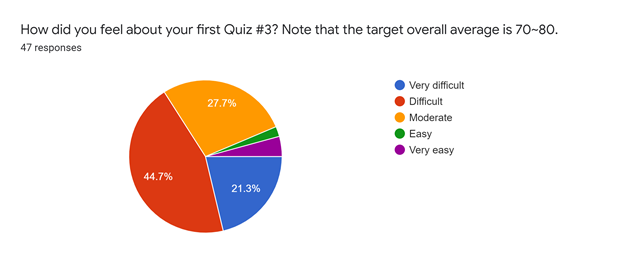
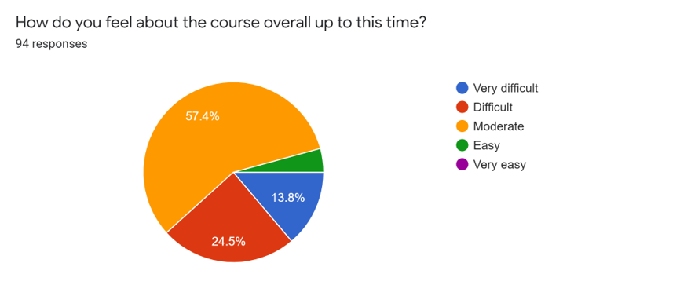
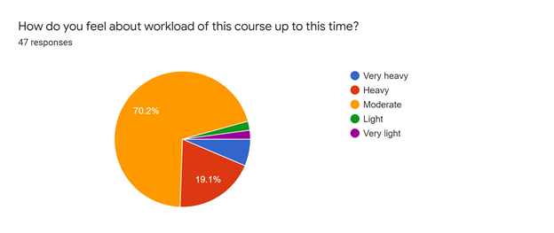

# Feedback Review for Quiz 3

## Summary
95 students responded to the survey and the results are presented below. The result shows that Quiz 3 is much easier than the previous quizzes: 

### Q. How did you feel about your Quiz 3? Note that the target overall average is 70.

### Q. How do you feel about the course overall up to this time?

### Q. How do you feel about workload of this course up to this time?

 
## Comments & Answers 
Since Quiz 03 is much easier than the other two quizzes, most of feedback are **very positive**. Students are very happy about current time limit and unlimited test trials. I think one-week delay of Quiz 03 gave students more time to prepare for the quiz 3. Also, they satisfy the quality of quiz review videos. The average of Quiz 03 was 79.9 and more than 100 students received more than 95. This means Quiz 4 will be more difficult than the other previous quizzes. Please thoroughly prepare for the last quiz 4. There are not many feedback that need my comment. 

|Feedback & Answer|
|:---|
|**Student:** I feel like it would be better to get new questions for Quiz 4. We have had similar questions from the last 3. Although that is beneficial for most people, some of us just do not get it. It is painful to sequentially get the same thing wrong over and over again. I do understand the reason behind it though since we are slowly building our skills.|
|**CM:** Yes. You will see some very new problems. If you think Quiz 03 problems are boring, you are on a right track!|
|**Student:** The phrasing on the question where we were asked to find the negative values that were shared between both matrices was somewhat unclear. I first understood it as that they had to have the same value and be negative rather than just be both negative. Other than that the rest of the quiz felt well balanced and even fun at times.|
|**CM:** If you are confused, please ask TAs during the quiz. We can help you to clarify the question.|
|**Student:** I was so sad to see the plotting portion go! Such an essential use case for matlab. While personally not too bothered by this, a few of my friends found it difficult to study module 8 without the lecture, especially since reading and unpacking the cell array is a little tricky to do correctly. I usually do only 2 or 3 tutorial questions marked as the most difficult and work on my assignment question straight away, so again this wasn't too big a problem for me, but some of my friends found it difficult to keep up with the assignment requiring code from a series of tutorials. the live help sessions continue to be excellent!! Thx & love to Bianca & Kasturi!|
|**CM:** Great comment. In this course, I would focus on programming parts, not tools in MATLAB. Drawing a graph in matlab will be easier if you are used to matlab programming. The extra assignment was almost similar to the tutorial questions and I posted tutorial videos. I hope that you watched the video for preparing for the extra assignment. |

