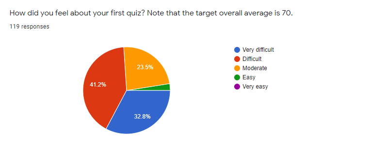
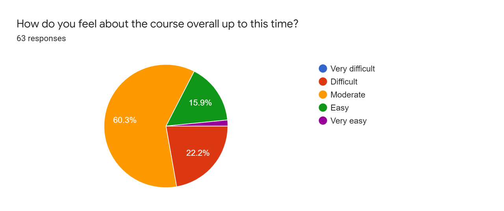
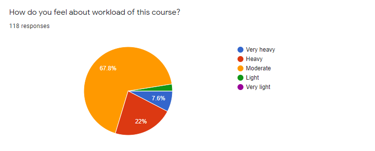

# Feedback Review for Quiz 1

## Overview
I would first talk about the grading scheme in this course. 

|Component|Scores|
|:---|:-----|
|**Attendance**| 12 |
|**Homework assignments**| 18 |
|**Quiz #1**| 10 |
|**Quiz #2**| 15 |
|**Quiz #3**| 20 |
|**Quiz #4**| 25 |
|**Online engagement**|extra up to 4*|
|**Total** |100| 

from [https://github.com/chulminy/AE_ENVE_GEOE_121#grading](https://github.com/chulminy/AE_ENVE_GEOE_121#grading)

I designed this course so that **the final class average ranges from 75 to 80**. I assume that you receive a full mark from homework assignments, attendance, and online engagement if you desire the final grade that is above average. This is the bare minimum for students who take this course if they are willing to learn from this course. Both your attendance (12%), online engagement (4%) and assignment mark (18%) contribute to 34% of your final grade. This is definitely not a small number. 

Let's assume that you receive 60 from all quizzes (actually very low scores). That will become 42% of your overall grade, and your final course average becomes 76. Now let’s consider a scenario where you receive an average 80 from your quizzes, then your final grade becomes 90. Although you received low scores on the quizzes, they do not drastically affect your final grade because you get the basic marks from the homework assignments and online engagement. If you receive over average 80 on quizzes, you will get over 90 in your final grade. I hope you understand this grading mechanism. 

I understand some of you are not happy about the difficulty of the quiz problems. However, it is not hard to pass the course or achieve a descent final grade if you submit all homework assignments on time and receive a full mark from online engagement considering that our quizzes do not hold as much contribution as they normally would. Also, in doing this, we can give an advantage to the students who steadily study this course. Your efforts will pay off! 

## Results
All 65 students responded to the survey and the results are presented below: 

### Q. How did you feel about your first quiz? Note that the target overall average is 70.

### Q. How do you feel about the course overall?

### Q. How do you feel about workload of this course?

## Advice to the Students 
* Please read the course syllabus and quiz instruction carefully. Please read them before taking the quiz.
* **Remember that the quiz problems are designed on the assumption that you attend all lectures and labs.** 
* You must read all announcements in LEARN. This is the only way we can communicate in an online environment. If they are unclear, please ask us! 
* To get prepared for the quizzes, you are able to solve all tutorial and homework assignments following [the study guideline](https://github.com/chulminy/AE_ENVE_GEOE_121#tutorial).

## Comments & Answers 
First, thank you for all positive reviews regarding the course layout, Kahoot game, TA sessions, Quiz! If you have any concern, please share us anytime. 

### Major comment 1: Lack of time or too difficult
* **Student 1:** I failed😭😭😭😭

* **Student 2:** 100 minutes is not enough time to finish this quiz. I literally failed this quiz. This course should only be assignment based. This is so stressful.

* **Student 3:** Rather than difficult, the quiz felt like there was just a lot of coding to do.

* **Student 4:** Barely had enough time to finish the quiz

* **Student 5:** I think the content in the quiz was good and it was challenging, but doable with the help of the lectures, Kahoots and office hours, but I think that 100 mins makes it much tougher. Maybe 120 mins with an extra question or 105-110 mins instead of 100 mins would have been a little more accommodating, especially when considering technical issues.

**CY:** The problems are designed based on homework or tutorial problems. If you study them following the [study guideline](https://github.com/chulminy/AE_ENVE_GEOE_121#tutorial), I'm sure that you can solve them within the time limit. If you haven't done them before quizzes, you spend extra time to understand the problem description.  It is very important that youwork through your tutorial problems as they will be helpful for the quizzes and your understanding of the course material. Please remember the full solutions of all the tutorial problems are posted [here](https://github.com/chulminy/AE_ENVE_GEOE_121/tree/master/tutorial)

### Major comment 2: Use student's own laptop for testing and concerns about in-person quizzes.

* **Student 1:** I believe it would make more sense for the quizzes to remain at home as it is just an extra hassle for us to come in person to write it if it is already open book and we don't have direct access to our personal files if we go in person. 
* **Student 2:** I think that the quiz 2 should be the same as quiz 1: we do it on our own laptop. This is because both the quizzes are open book so the only difference is that if we do it in the lab it is a hassle and headache. 
* **Student 3:** The format for up to quiz one was perfect but now up to quiz 2 is where it gets a little bit messy. I think allowing students to write their tests at home would be a lot easier and safer then placing 100+ students in one computer lab as well as it will be a lot easier for students to focus without the constant typing in the background.

**CY**: Yes. We decide that you can use your own laptop but make sure that you turn off all background programs (e.g., messengers, cloud sync) and follow all Quiz 2 guideline outlined in [**here**](Quiz2_Description.md).  

Regarding in-person quizzes, I agree that taking the quiz at home is easier and safer than taking it in one place. However, university made a decision to open the school and go back to all in-person lectures. We will do our best to take the quizzes following to Health and Safety protocols from [here](https://uwaterloo.ca/coronavirus/). If you are still worried about in-person lectures or quizzes, please express your concern to the first year engineering office. 

If you cannot focus on your quiz due to typing sound or noise, please talk to accessibility service. 
  
### Major comment 3: Inform attendance check days
* **Student 1:** Also can you tell us when we will be doing the kahoot for in-person classes, because if the lectures are already asynchonous I don't see the point of in-person classes other than the kahoots.
* **Student 2:** As well, it does not make sense to have synchronous lectures with random attendance checks when the actual lecture content is taught asynchronously. This would mean we would have more time allotted for instruction than what is actually on the schedule, which is not fair.
* **Student 3:** Kahoot didn't really help would rather have the prof go through example questions, review session helped a lot tho. Also the solutions are very useful to look at and learn the content. 

**CY:** Yes. I agree that some students who have programming experience feel that Kahoot review sessions are too easy and time-consuming. Also, the initial rule for getting "attendance" scores is to attend lectures and the Kahoot game is a part of the lectures. So, students might feel that it's more time allocated than the time initially proposed. If students feel that watching lectures videos are sufficient, please send an email to the TA until **Feb 11**. Those students will have a new grading scheme like below: 

|Component|Scores|
|:---|:-----|
|**Attendance**| 0 |
|**Homework assignments**| 18 |
|**Quiz #1**| 10 |
|**Quiz #2**| 15 |
|**Quiz #3**| 20 |
|**Quiz #4**| 37 |
|**Online engagement**|extra up to 4*|
|**Total** |100| 

### Miscellaneous
I would answer some feedback to address your concerns. Although I didn't answer your individual feedback, you can find the answer to similar questions.

|Feedback & Answer|
|:---|
|**Student:** Possibly post more course information on learn. I thought the quiz ended at 3:20. My fault for not reading GitHub, but it’s not used for any of my other courses|
|**CY: ** Yes. Jesse will more frequently update the announcement in LEARN. However, all students need to monitor all announcements in the course website carefully.|
|**Student:** I appreciate the kahoot game review, but the explanations between questions leave me feeling bored especially if I got the answer right. personally i would prefer the explanations for all questions to be at the end of the game so it is easier to see how concepts build on each other and I wouldn't get kicked out of the game because my phone fell asleep. I really liked Jesse's review session but other than that found the many tutorial problems the best resource for studying. The tutorial problems helped me feel confident on Quiz 1.|
|**CY: ** Yes. However, next questions are built upon the previous questions so it would be better to explain one by one.|