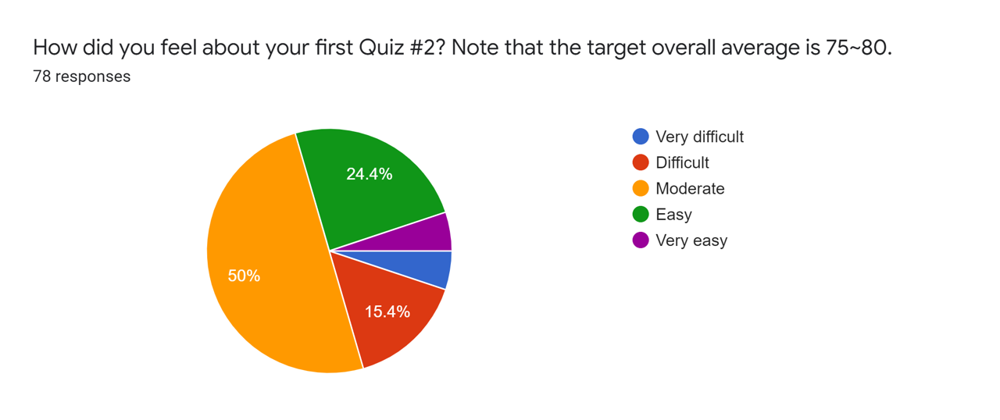
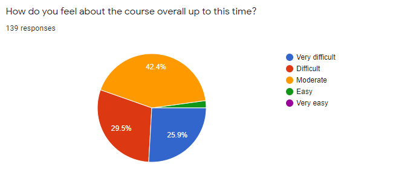
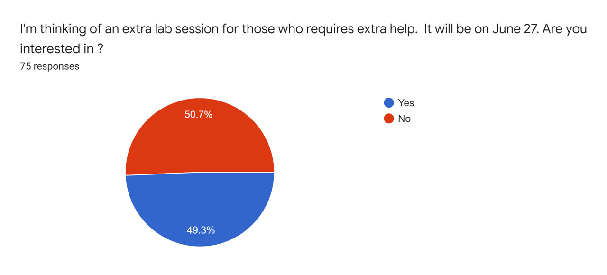

# Feedback Review for Quiz 2

## Survey Results
45 students responded to the survey and the results are presented below: 

### Q. How did you feel about your second quiz? Note that the target overall average is 70-80.

### Q. How do you feel about the course overall up to this time?

### Q. How do you feel about workload of this course up to this time?

## Overview
Overall, things were going along nicely up to this time. The survey results are very similar to the ones in Quiz 1. Although Quiz 2 was the first in-person quiz, it has done so well. Again, our teaching team is really sorry about our mistake on the problem 1 in Q2. All students will receive 15 points regardless of their answers.

Our teaching team will reflect your feedback and update our course and upcoming quizzes. 

* First, our teaching team appreciates all positive reviews regarding the course layout, Kahoot game, TA sessions, Quiz. 
* For the lectures, the instructor will briefly review the modules at the beginning and then play Kahoot games. However, the students should watch the lecture videos and prepare for the module before coming to the class.
* For the upcoming Kahoot games, you can see the problems in your mobile devices or laptops so you do not have to worry about legibility during the class. 
* For upcoming quizzes, you can use both your laptop and a desktop computer in the computer lab during the quiz. It would be nice to use the desktop for showing quiz problems and your laptop for programming (and vice versa). However, you **CANNOT** your tablets or phones. Also, you can use a noise-canceling headset or listen to music if they are helpful for you to focus on your quiz. However, you need to control the volume not to disturb other students.
* For upcoming quiz problems, one additional easy problem will be added to motivate the students who are struggling this course. However, one or two very challenging problems (but low points) will be also added to avoid many students getting a full mark. 
 
**Last but not least,** I would always emphasize 
* Please read the course syllabus and quiz instruction carefully. Please read them before taking the quiz.
* **Remember that the quiz problems are designed on the assumption that you attend all lectures and labs.** 
* You must read all announcements in LEARN. This is the only way we can communicate in an online environment. If they are unclear, please ask us! 
* To get prepared for the quizzes, you are able to solve all tutorial and homework assignments following [the study guideline](https://github.com/chulminy/AE_ENVE_GEOE_121#tutorial).

