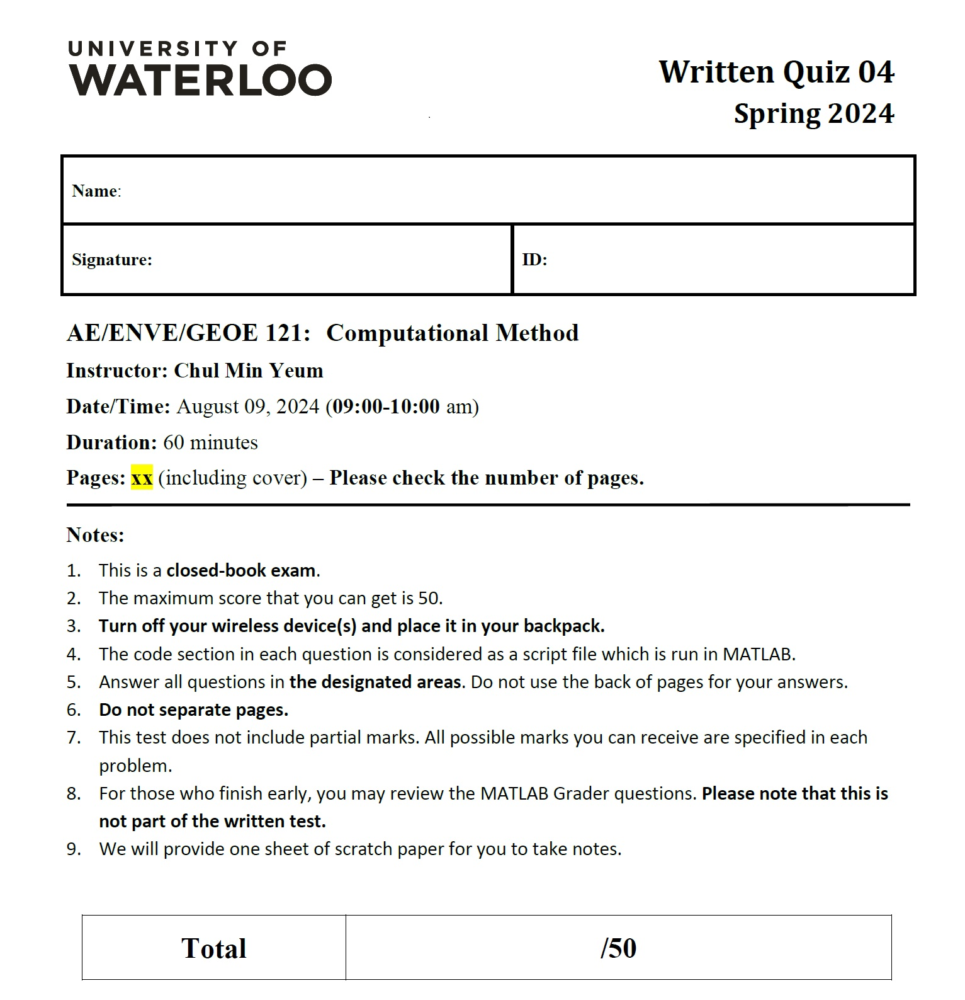

# Quiz #4

## General Description
**Quiz #4** is designed to evaluate your understanding of the key concepts covered in **Module 01 ~ Module 07, 09, 11**. This is an individual, in-person exam held in CPH-1346 and CPH-1325. Your specific room and seat assignment will be provided on the quiz date. You must complete all problems independently and are not allowed to discuss them with others. If you have questions, you may ask the TA proctors or the instructor at any time. The quiz consists of two parts: a written portion and a MATLAB Grader test.

**Guidelines for the Written Test**
  

**Please bring writing utensil, eraser, pencil sharpener**

**Guidelines for the Grader Test**
The grader test is open book, allowing you to access all class materials, including:

* MATLAB Grader
* MATLAB program in your computer
* Lecture slides (pdf) 
* MATLAB files that you have created while you study this course
* Digital/offline notes that you have made your own. 
Note that your digital or offline note (in pdf or word) contains only texts that you made and should not be a form of drag/drop website or tutorial YouTube contents. You never use searching engine like Google to search for information. **Your internet browser must only be used to access the course website and MATLAB Grader.** You **cannot** watch lecture or tutorial videos during the quiz.

You can use both your laptop and a desktop computer in the computer lab during the quiz. It would be nice to use the desktop for showing quiz problems and your laptop for programming (and vice versa). However, you **CANNOT** **your tablets or cell phones**.  

Before starting the quiz, you need to copy and paste all files in **a Desktop folder**. If you choose to use one of the desktop computers in the lab, you can save your files in a USB drive and copy them in the computer or can download the files from your cloud drive **BEFORE** starting the quiz. **Make sure that you must turn off all messenger programs or background cloud sync programs.** You cannot use any shared folder (e.g., cloud drive) during the quiz. Accessing different folders other than the Desktop folder might be considered as cheating.

**Attention**
* Before starting the grader quiz, ensure you turn off all synchronization programs.
* You cannot use OneNote or any other software that supports synchronization.
* You are not allowed to use the search function.
* Having tabs open in your browser, other than the ones specified, will be considered cheating.
* You cannot use a calculator.
* You can only use a laptop and/or desktop computer in the computer lab.

There are six questions:
- Q4-1. (★): 7 points
- Q4-2. (★): 7 points
- Q4-3. (★★): 7 points
- Q4-4. (★★): 7 points
- Q4-5. (★★): 10 points
- Q4-6. Custome Poker (★★★): 12 points
- Q4-Extra. (★★★★): 5 points

## Quiz Schedule
**AE/ENVE/GEOE:** August 09 at 09:00am ~ 11:30 qm - 60 min (written test) + 90 min (grader test)

**Please arrive at the lab 10 minutes before the exam. We will start promptly at 9:00 AM.**

## Submission & Grading (MATLAB Grader)
For Quiz 4, you must solve all questions within **90 minutes**. **Since the length of the quiz is also set to accommodate students who have technology challenges (e.g., slow internet connection, computer), no extra time will be provided.** Note that if your solution is submitted after the designated due time, it will not be graded. Please submit your solutions on time. You can access and solve the problems in any order. As promised, the number of stars to identify the difficulty of the problems will be provided to help students time management. You can submit your answer **unlimeted times**. However, **we will only grade your last submission** Great care should be taken before you submit your solution. Thus, it is highly recommended that you run and check your solution in the MATLAB program installed on your computer. Remember that we will **manually** grade your script at the end and review your programming logic. 

**Thus, although you pass the testers on the grader, you will get zero if your programming logic is not correct. There is no partial mark if you pass the tester with a WRONG logic.**

A set of assessments (or tests) in the MATLAB Grader is designed in each problem for “preliminary” auto-grading but your solutions will be manually re-graded to provide partial marks. Please do not be discouraged when you see that you have not passed all your tests. You need to include a **concise comment** in your scripts using ‘%’ (comment symbol) to obtain better partial marks. If the programming logic is correct based on the judgment on your comments, higher partial marks will be obtained. You can use any MATLAB built-in function at your own risk unless otherwise noted. However, if you misuse or misapply built-in functions that have not been covered in lectures or tutorials, you will not get partial marks for using them. Please do not use a built-in functions that we have not covered in our course if you are unsure of its applications. The maximum score that you can get is **55**. The score will contribute to the final grade with the corresponding weights outlined in the course website. 

Note that when you move to a different question without submitting your script on MATLAB Grader, the code will not be available when you reopen the previous question. Please do not work your script on MATLAB Grader. Instead, please use the MATLAB Editor to code your answers and save them in your computer. 
