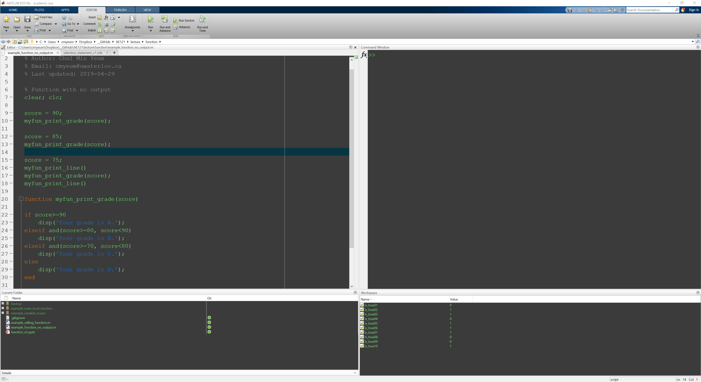
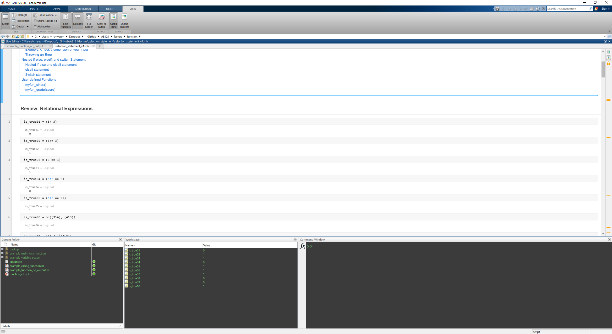
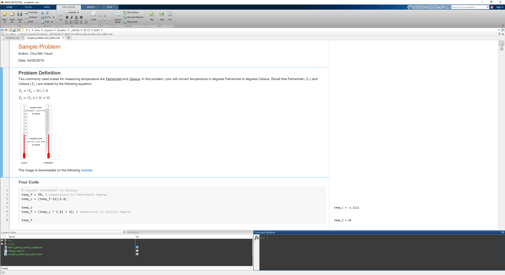

# Lab01: Getting Started With MATLAB

**Instructor:** Chul Min Yeum    
**TAs:** Jason Connelly and Juan Park
**Date:** May 9, 2019

Last updated: 2019-04-28

## Table of Contents
- [Github Account](#github-account)
- [MATLAB Window Arrangement](#matlab-window-arrangement)
- [Prerequisite](#prerequisite)
- [Course Textbook](#course-textbook)
- [Course Outline](#course-outline)
- [Communication](#communication)
- [Grading](#grading)
- [Computer Labs](#tasks)
- [Assignments](#assignments)
- [Note](#note)

## Github Accounts
[**https://github.com**](https://github.com/)

To post questions or comments, students should make their own Github account. Please sign up this website. Students **do not have to** make their accounts using **school emails** if they already have accounts or they want anonymity.

## MATLAB Autograder registration  

### Solve a problem

 
## MATLAB Window Arrangement

The instructor recommends MATLAB window arrangements to set up the best programming environment.

### When you are using both the editor and command windows (best for writing short scripts)

### When you are studying tutorials using the Live Editor

**Output on Right (recommended)** 

**Output inline**  

### When you do programming

### When you are using a small screen, you can minimize the Toolstrip. 

## Editor & Live Editor
### Simple program (editor)
Please write and run a simple program using the editor.

### Simple program (live editor) 
Please write and run a simple program using the live editor.
[**See this page**](sample_problem_live_editor.html)

### Editor Shortcut

### Live Editor Shortcut
Please repeat the above processes using the keyboard shortcuts

**Run**
`Ctrl + Enter`: run section
`F5`: run 
`F10` (`Ctrl + c` in command window): stop

**Text**
`Alt + Enter`: insert code
`Ctrl + Alt + Enter`: section break (important)
`Ctrl + Scroll`: change text size (:+1: not possible in an editor)
`Ctrl + B`, `Ctrl + I`, `Ctrl + U`: Bold, italic, and underline
`Ctrl + Shift + 1,2,3`: heading level

## Preferences 
### Change font size

### Change color scheme (eye fatigue)
Run `change_color.m`.

You can reset the color in your editor.

