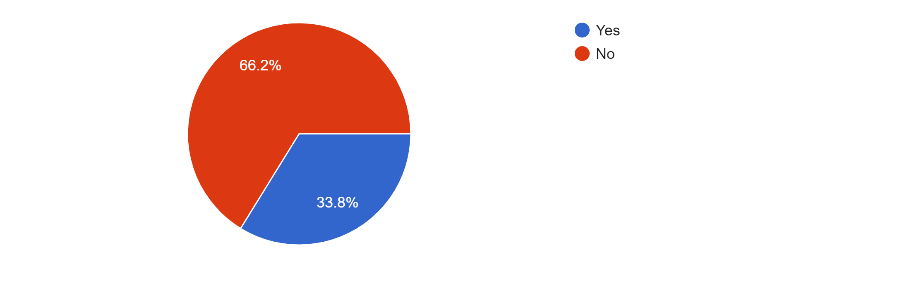

# AE/ENVE/GEOE 121: Study Process Survey (4th Week)

## Overview
We have surveyed to monitor your study progress in this course. Loop and selection statements are the basis of programming and will be frequently utilized in the following modules. We strongly encourage students to fully understand these topics. That's why we would give you more time to study these modules thoroughly. 

All 74 students responded to the survey and the [**results**](results) are presented below. As a result, we decide to delay the due date of HW#3 and HW#4 for five days. We hope that students can catch up with the modules and homework assignments during this extended period. However, this does not mean shifting the rest of the course schedules or delivery. Instead, the second submission period for HW#3 and HW#4 is shortened. This is because we plan on posting the HW#4 review video before students attend Quiz 2 (June 29). Regardless of this delay, students are still able to finish studying each module on the corresponding ETF (no changes on the current ETFs). 

The following new schedule has been posted on the course website. 

|HW|Topic|Start date|First due date (New date)|Second due date (New date)|
|:---|:-----|:----|:-----|:-----|
|HW #1|Module 01|May 11 |May 21|May 28|
|HW #2|Module 01 ~ Module 02|May 21 |May 28|June 04|
|HW #3|Module 01 ~ Module 04|May 28 |June 11 (**June 16**)|June 18 (**June 20**)|
|HW #4|Module 01 ~ Module 05|June 11 (**June 16**)|June 19 (**June 24**)|June 26 (**June 27**)|
|HW #5|Module 01 ~ Module 06|June 19 (**June 24**)|July 09|July 16|
|HW #6|Module 01 ~ Module 07|July 09|July 17|July 24|
|HW #7|Module 01 ~ Module 10|July 17|July 28|Aug 04|
|HW #8|Module 01 ~ Module 12|July 28|Aug 05|Aug 12|

## Results
### Q. Which module are you studying now?

### Q. Do you think you can finish the study of Module 4 on time (June 05)? 

### Q. Do you think you can finish HW #3 on time (June 11)? 

### Q. If you say either one above is no, how much more time do you need in total?   

## Comments & Answers 

**I would answer some major feedback and address your concerns.**

|Feedback & Answer|
|:---|
|**Student1:** Having some optional, extra practice problems would be helpful. **Student2:** If it were possible to have a list of outside resources we can go to for extra practice outside of HW and tutorials to enhance problem solving skills for quizzes. **Student3:** Would we be able to get extra optional challenge questions to prepare for the quizzes? I want to study with a practice problem that I’ve never completed before. Thank you!|
|**CM:** I'm happy with your enthusiasm for studying more. However, I would recommend that students repeat the tutorial and homework assignment problems. I mentioned this a couple of times in tutorial videos but if you can solve tutorial and homework questions without looking at those solutions, you will get a high mark on the quiz. However, passing the testers in the MATLAB Grader is not enough. Students need to compare their  solutions with the model solutions and think of how to improve their scripts. Please try to write them better. If you want to learn more, there is a very good website to study MATLAB programming: [**MATLAB Cody**](https://www.mathworks.com/matlabcentral/cody/problems).|
|**Student:** I appreciate that some questions in the modules directly correlate to questions in the homework as this is very helpful for us to understand concepts in the modules and then to extrapolate the knowledge on our own in the homework. **Student2:**I expect more examples close to the HW and modules will be shown in the Lectures.|
|**CM:** Worked-out examples in lectures are designed to check students' understanding of topics and are not meant for solving specific problems in homework assignments. The problems in tutorials that I reviewed are the closest problems to the homework assignments.| 
|**Student1:** The lectures and tutorials are clear and effective. I think with the quiz this week and the hw#3 being harder, I haven’t been able to start module 4 yet. **Student2:** Prior to this course, I’ve never coded before. The first and second module had a bit of difficulty, so module 3 and 4 definitely feel much harder. I appreciate the fact that HW due dates are pushed back a bit more for modules that are longer/more complex. I just hope that you guys can understand that this is pretty difficult for many of us. Lectures and tutorials feel very long, given that each video clip is about 1 hour long, there’s a lot of content to learn in each module, and it can get overwhelming. However, I do understand that there’s not much you guys can change content wise. I appreciate the fact that there’s many TA sessions available.|
|**CM:** I understand these are not easy topics. We extend the deadline for HW3 and HW4 for you to catch up with the modules. Hopefully, it will help you study.|
|**Student1:** TAs making fantastic effort to be available. **Student2:** TA sessions are very helpful and I appreciate how there are a lot of different time slots for them. **Student3:** Noreen has been very helpful during office hours:).|
|**CM:** Yes. Our TAs are the best :thumbsup::thumbsup:|
|**Student:** The architectural engineering class has a big studio project due Tues June 9th! In addition to 4 assignments next week so it's a pretty busy week!|
|**CM:** Please tell these major events to TAs so that we can arrange the schedule if needed.|
|**Student:**We seem to be covering a lot of content very quickly. I talked to students in upper years and they said that we are doing post midterm material already. Some of the material we have done already would have been post midterm material in Bob's class. I don't know how true this is, maybe Vlad and Noreen can speak about this. I can say that I am spending a lot more time on this course than my other courses. However, I do have to say that professor Yeum teaches very well. I can't complain about his methods of teaching, only about how much content there is to cover. Lastly, I can say (from my limited interaction with the TAs) that the TAs are helpful and want students to do well.|
|**CM:** Yes. I would teach more programming concepts in this course. That could help you use MATLAB for the rest of your undergraduate study and learn other programming languages. Basically, if we do not learn the selection and loop statement, the problems that we can solve are very limited. I'm aware that I taught selection and loop statement in an early stage. But, it can provide us more time on solving realistic programming problems. It also gives you more time to understand the concept before the end of the course. I would ask for your understanding.|

**Thank you for all the great feedback!!**
