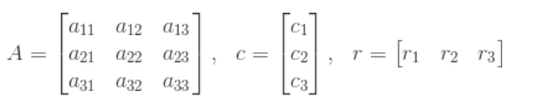
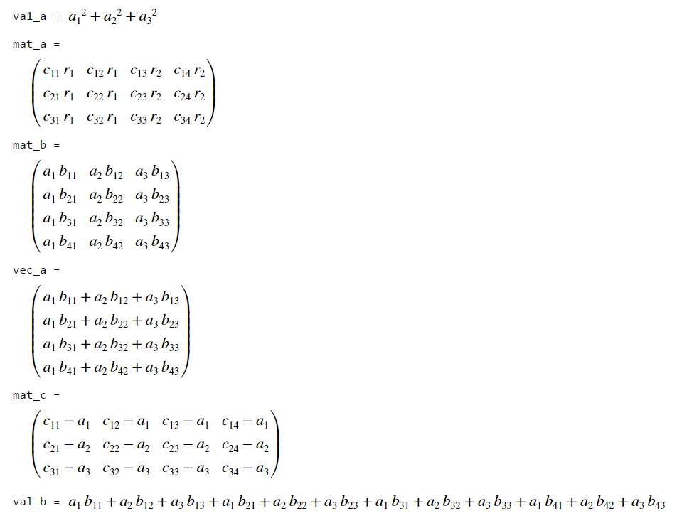

# Quiz 1

## Table of Contents
- [**Summary**](#summary)
- [**Group 1**](#group-1)
- [**Group 2**](#group-2)
- [**Group 3**](#group-3)

## Summary

**Average Score**
* **Group 1:** 69.01
* **Group 2 & 3:** 71.31

**Distribution**


## Group 1 
### Array Manipulation (20 points)
This program is to use matrix and element-wise operations. 
Assume that matrix A, a column vector c, and a row vector r are defined as follows.



Then, val_a, mat_b, mat_c, mat_d, mat_e, and val_f are defined as follows.
 


These values should be computed from A, c, and r through matrix and element-wise operations. Individual allocation of the elements is not permitted. 
Please write a script to compute 'val_a', 'mat_b', 'mat_c', 'mat_d', 'mat_e', and 'val_f' when numeric values for 'A', 'c', and 'r' are given.  
For example, when c = [1;2;3] and r = [1 1 0], 'val_a' become 3. (=1x1 + 2x1 + 0).

**Solution**

```matlab
A = randi(100, 3,3);
c = randi(100, 3,1);
r = randi(100, 1,3);

val_a = r*c;
mat_b = A - c*ones(1,3);
mat_c = A .*(ones(3,1)*r);
mat_d = A * c;
mat_e = A * transpose(r);

val_f = mat_d(1) + mat_d(2) + mat_d(3);
```

### Create Sequences (20 points)

```matlab
n = randi([10 100], 1); % n is a randomly generated number ranging from 10 to 100
```

(a) For this problem, combine two row vectors in which their elements multiplied together to create the following sequence:  6, 12, 20, 30, ..., n*(n-1). Use 'vec1' as your combined vector. For example, 6 = 3 x 2, 12 = 4 x 3, 20 = 5 x 4. 

(b) create a row vector named 'vec2', which is copied from 'vec1'. Then remove the elements with vaules of 42 and 56 of 'vec2'. 'vec2' becomes a 1 x (n-4) row vector. 

(c) create a row vector named 'vec3', which has the sequence: n^2, (n-1)^2, (n-2)^2, ..., 1.

(d) create a row vector named 'vec4', which is copied from 'vec3'. However, starting at the first element, remove the every second element of 'vec4'. (e.g. vec3 = [1 2 3 4 5 6 7], vec4 = [2 4 6])

(e) create a 1xn row vector named 'vec5' with all elements as zero. Please replace the value at the odd location with the value of (corresponding index)^2. Then, vec5 becomes 1 0 9 0 25 0...., (n-1)^2, 0 if n is even. When n is odd, vec5 becomes 1 0 9 0 25 0...., 0, n^2.Note that this is not a problem using selection statement or loop statement. Please avoid using selection and loop statements. 

**Solution**

```matlab
n = randi([10 100], 1); % n is a randomly generated number ranging from 10 to 100

%(a)
vec1 = (3:n).*(2:n-1);

%(b)
vec2 = vec1;
vec2(5:6) = [];

%(c)
vec3 = (n:-1:1).*(n:-1:1);

%(d)
vec4 = vec3;
vec4(1:2:end) = [];

%(e)
vec5 = (1:n).*(1:n);
vec5(2:2:n) = 0;
```

### Matrix Manipulation (20 points)
The following variables are created in advance using 'randi' and will be used for solving questions. 

```matlab
n = randi(100); % a random scalar 
mat1 = randi(100, 10, 10); % a 10 x 10 matrix with random values
```

(a) Create a 1x10 row vector called 'vec_a', which is copied from the fifth row of 'mat1'. Then, rearrange it so that its elements in its first half are switched with those in the second half. (e.g. the orginal vector: [1 2 3 4 5 6]; the modified vector: [4 5 6 1 2 3])

(b) Create a matrix called 'mat_b', which is copied from 'mat1'. Then, Then, swap the first row with the last row, and swap the first column with the last column. (Note that you need to do these steps in order)

(c) Create a 10x4 matrix called 'mat_c',  which concatenates every third columns of 'mat1' (first, fourth, seventh, tenth columns)

(d) Create a matrix called 'mat_d', which is copied from 'mat_c'. Then, replace the every fourth element of 'mat_d'  with a value of 5 (sarting from the first element) in terms of the linear indexing order.

(e) Create an n x (2n) matrix named 'mat_e'. Then, assign n to all of its elements.

**Solution**
```matlab
n = randi(100); % a random scalar 
mat1 = randi(100, 10, 10); % a 10 x 10 matrix with random values

%(a)
vec_a = mat1(5,:);
vec_a = vec_a([6:end 1:5]);
% vec_a([1:5 6:end]) = vec_a([6:end 1:5]);

%(b)
mat_b = mat1;
mat_b([1 end],:) = mat_b([end 1], :);
mat_b(:,[1 end]) = mat_b(:, [end 1]);

%(c)
mat_c = mat1(:,1:3:end);

%(d)
mat_d = mat_c;
mat_d(1:4:end) = 5;

%(e)
mat_e = ones(n,2*n)*n;
```

### Pressure Calculation (20 Points)

'press1', 'press2', 'press3', 'press4', and 'press5' contain pressure data that are collected over a period of 12 days from Station 1, 2, 3, 4, and 5 at 30 min intervals, starting at 10:00AM and ending at 4 pm (a total of 13 time stamps). 
Here is the script to generate syntatic values for these variables. 

```matlab
press1 = randi([10 30], 13, 12); % data contained at station 1
press2 = randi([0 20], 13, 12); % data contained at station 2
press3 = randi([10 30], 13, 12); % data contained at station 3
press4 = randi([10 60], 13, 12); % data contained at station 4
press5 = randi([0 25], 13, 12); % data contained at station 5

data_press = [press1 press2 press3 press4 press5]; % joining all staions data in the horizontal direction
clearvars press1 press2 press3 press4  press5 % delete 'press1', 'press2', 'press3', 'press4', 'press5' variables

area_devices = randi(100, 5, 1); % different cross-sectional area of pressure measuring devices
```

'press X' is a 13 x 12 matrix including all pressure data from Station X. 13 rows means 13 different times when measurements were taken and 12 columns means 12 different days of data collecting. 

a) Your boss wants you to find all of the pressure gradients from 11 am to 3 pm during the 10th day of anaylsis from all stations. Create an 9 x 5 matrix named as 'data_report', where each row represents pressure data recorded at a certain time interval from all stations. For example, the first column of 'data_report' is the pressure data at Station 1 measured at 10th day from 11 am to 3 pm. 

b) Your boss asks you to calculate the force based on the data analysis from each station at 10 am from days 3 to 12. However, your boss says that Station 4 is really old and that the data cannot be trusted, and thus you are asked to exclude that data. He wants you to also report your matrix data in a vertically concatenated manner so that every row represents 10 am data at the corresponding station.
 
The force acting on the pressure measuring devices can be calculated using the equation , where F is force, P is pressure and A is a cross-sectional area of the pressure measuring device. The cross-sectional areas of the devices at stations are different and their areas are given as 'area_devices'. Each numbered element in 'area_devices' corresponds to the station number. (e.g. the first element of 'area_devices' corresponds to station 1). Create a 4 x 10 matrix named 'final_data_report' such that the data can be reported in this manner. Each row corresponds to the time at which Station X has recorded a pressure value, while each column contains the day in which the measurement was taken. For example, the first row of 'final_data_report' is the force data at 10 am for day 3 to day 12 from Station 1 in order. 

**Solution**

```matlab
press1 = randi([10 30], 13, 12); % data contained at station 1
press2 = randi([0 20], 13, 12); % data contained at station 2
press3 = randi([10 30], 13, 12); % data contained at station 3
press4 = randi([10 60], 13, 12); % data contained at station 4
press5 = randi([0 25], 13, 12); % data contained at station 5

data_press = [press1 press2 press3 press4 press5]; % joining all staions data in the horizontal direction
clearvars press1 press2 press3 press4  press5 % delete 'press1', 'press2', 'press3', 'press4', 'press5' variables

area_devices = randi(100, 5, 1); % different cross-sectional area of pressure measuring devices

%a)
data_report = data_press(3:11,[10 22 34 46 58]);

% option 1
% data_report=[data_press(3:11,10),data_press(3:11,22),data_press(3:11,34),data_press(3:11,46) data_press(3:11,58)]'

%b)
force_at_st1 = data_press(1,3:12) * area_devices(1);
force_at_st2 = data_press(1,15:24) * area_devices(2);
force_at_st3 = data_press(1,27:36) * area_devices(3);
force_at_st5 = data_press(1,51:60) * area_devices(5);

final_data_report = [force_at_st1; force_at_st2; force_at_st3; force_at_st5];
```

### Relational and Logical Operator (20 points)

The following variables are created in advance using 'randi' and will be used for solving questions. 

```matlab
vec1 = char(randi([48 122],1,10)); % a 1 x 10 randomly generated character vector
x = randi([1 20]); % returns a random integer drawn from the interval [1, 20]
y = randi([1 20]); % returns a random integer drawn from the interval [1, 20]
z = randi([1 20]); % returns a random integer drawn from the interval [1, 20]
```

(a) Write a code to check if x lies in more than 6 and less than 12. If yes, assign logical 1 to 'l_a' and otherwise assign logical 0. 

(b) Write a code to check if y + 3 lies in less than 5 or more than 10. If yes, assign logical 1 to 'l_b' and otherwise assign logical 0. 

(c) Write a code to check if x/y is larger than y/z. If yes, assign logical 1 to 'l_c' and otherwise assign logical 0. 

(d) Create a 1x3 character vector called 'vec_d', which concatenates the every fourth elements of 'vec1' (1st, 5th, 9th values). 
Write a code to check how many uppercase letters there are in 'vec_d', and assign the result to 'num_d'.

(e) Write a code to check how many lowercase letters there are in 'vec_d', and assign the result to 'num_e'.

(f) Write a code to check how many english letters there are in 'vec_d', and assign the result to 'num_f'.

**Solution**

```matlab
vec1 = char(randi([48 122],1,10)); % a 1 x 10 randomly generated vector
x = randi([1 20]); % returns a random integer drawn from the interval [1, 20]
y = randi([1 20]); % returns a random integer drawn from the interval [1, 20]
z = randi([1 20]); % returns a random integer drawn from the interval [1, 20]

% write your code here

%(a)
l_a = (x>6) && (x<12);

%(b)
l_b = ((y+3)<5) || ((y+3)>10);

%(c)
l_c = (x/y) > (y/z);

%(d)
vec_d = vec1(1:4:end);
is_upper1 = and(vec_d(1) >= 'A',  vec_d(1) <= 'Z');
is_upper2 = and(vec_d(2) >= 'A',  vec_d(2) <= 'Z');
is_upper3 = and(vec_d(3) >= 'A',  vec_d(3) <= 'Z');
num_d = is_upper1 + is_upper2 +is_upper3;

%(e)
is_lower1 = and(vec_d(1) >= 'a',  vec_d(1) <= 'z');
is_lower2 = and(vec_d(2) >= 'a',  vec_d(2) <= 'z');
is_lower3 = and(vec_d(3) >= 'a',  vec_d(3) <= 'z');
num_e = is_lower1 + is_lower2 + is_lower3;

%(f)
num_f = num_d + num_e;

```

## Group 2 
### Create Sequences (20 points)

```matlab
n = randi([10 100], 1); % n is a randomly generated number ranging from 10 to 100
```
(a) create a row vector named 'vec1', which has the sequence: 9, 16, 25, 36, ..., n^2.

(b) create a row vector named 'vec2', which is copied from 'vec1'. Then, remove the elements with vaules of 25 and 64 from 'vec2'. 'vec2' becomes a 1 x (n-4) row vector. 

(c) create a 1 x n row vector named 'vec3', which has the sequence: n*1, (n-1)*2, (n-2)*3, (n-3)*4..., 2*(n-1), 1*n

(d) create a column vector named 'vec4', which has the same elements of 'vec3' in order. However, starting at the first element, every third element of 'vec4' is removed. (e.g. vec3 = [1 2 3 4 5 6 7], vec4 = [2; 3; 5; 6])

(e) create a 1xn row vector named 'vec5' with all elements as zero. Please replace the value at the even location with the value of (corresponding index)^2. 
Then, vec5 becomes 0 4 0 16 0 36... 0 , n^2 if n is even. When n is odd, vec5 becomes 0 4 0 16 .... (n-1)^2, 0. Note that this is not a problem using selection statement or loop statement. Please avoid using selection and loop statements. 


**Solution**

```matlab
n = randi([10 100],1); % n is a randomly generated number ranging from 10 to 100
% write your code here

%(a)
vec1 = (3:n).*(3:n);

%(b)
vec2 = vec1;
vec2([3 6]) = [];

%(c)
vec3 = (n:-1:1).*(1:n);


%(d)
vec4 = vec3';
vec4(1:3:end) = [];

%(e)
vec5 = (1:n).*(1:n);
vec5(1:2:n) = 0;
```

### Pressure Calculation (20 Points)
'press1', 'press2', 'press3', and 'press4' contain pressure data that have been collected over a period of 13 days from Station 1, 2, 3, and 4 at 2 hr intervals, starting at 10:00AM and ending at 2:00 am (all 9 measuremets per day at each station). 
Here is the script to generate syntatic values for these variables.

```matlab
press1 = randi([10 30], 9, 13); % data contained at station 1
press2 = randi([0 20], 9, 13); % data contained at station 2
press3 = randi([10 30], 9, 13); % data contained at station 3
press4 = randi([10 60], 9, 13); % data contained at station 4

data_press = [press1 press2 press3 press4]; % joining all staions data in the horizontal direction (a 9 x 52 matrix)
clearvars press1 press2 press3 press4 % delete 'press1', 'press2', 'press3', 'press4' variables

area_devices = randi(100, 4, 1); % different cross-sectional area of pressure measuring devices
``` 
'press X' is a 9 x 13 matrix including all pressure data from Station X. 9 rows means 9 different times when measurements were taken and 13 columns means 13 different days of data collecting. 

a) Your boss wants you to find all of the pressure gradients from 12 pm to 8 pm during the 7th day of anaylsis from all stations. Create an 5  x  4 matrix named as 'data_report', where each column represents pressure data recorded from 12 pm to 8 pm on the 7th day of analysis. For example, the first column of 'data_report' is the pressure data at Station 1 measured on the 7th day from 12 pm to 8 pm. 

b) Your boss asks you to calculate the force based on the data analysis from each station at 10 am from days 2 to 10. However, your boss says that Station 4 is really old and that the data cannot be trusted, and thus you are asked to exclude that data. He wants you to also report your matrix data in a vertically concatenated manner so that 'very row represents the 10 am data at the corresponding station.The force acting on the pressure measuring devices can be calculated using the equation , where F is force, P is pressure and A is a cross-sectional area of the pressure measuring device. The cross-sectional areas of the devices at stations are different and their areas are given as 'area_devices'. Each numbered element in 'area_devices' corresponds to the station number.(eg. The first element of 'area_devices' corresponds to station 1). Create a 3 x 9 matrix named 'final_data_report' such that the data can be reported in this manner. Each row corresponds to the time at which Station X has recorded a pressure value, while each column contains the day in which the measurement was taken (from days 2 to 10). For example, the first row of 'final_data_report' is the force data at 10 am for day 2 to day 10 from Station 1 in order. 


**Solution**

```matlab
press1 = randi([10 30], 9, 13); % data contained at station1
press2 = randi([0 20], 9, 13); % data contained at station 2
press3 = randi([10 30], 9, 13); % data contained at station 3
press4 = randi([10 60], 9, 13); % data contained at station 4

data_press = [press1 press2 press3 press4]; % joining all staions data in the horizontal direction (a 9 x 52 matrix)
clearvars press1 press2 press3 press4 % delete 'press1', 'press2', 'press3', 'press4' variables

area_devices = randi(100, 4, 1); % different cross-sectional area of pressure measuring devices

%a)
data_report = data_press(2:6,[7 20 33 46]);

% option 1
% data_report=[data_press(2:6,7),data_press(2:6,20),data_press(2:6,33),data_press(2:6,46)]'

%b)
force_at_st1 = data_press(1,2:10) * area_devices(1);
force_at_st2 = data_press(1,15:23) * area_devices(2);
force_at_st3 = data_press(1,28:36) * area_devices(3);

final_data_report = [force_at_st1; force_at_st2; force_at_st3];
```

### Matrix Manipulation (20 points)

The following variables are created in advance using 'randi' and will be used for solving questions. 

```matlab
n = randi(100); % a random scalar 
mat1 = randi(100, 16, 16); % a 16 x 16 matrix with random values
```
(a) Create a 1x16 row vector called 'vec_a', which is copied from the last row of 'mat1'. Then, re-arrange it so that the elements in its first half are switched with those in the second half. (e.g. the orginal vector: [1 2 3 4 5 6]; the modified vector: [4 5 6 1 2 3])

(b) Create a matrix called 'mat_b', which is copied from 'mat1'. Then, swap the first row with the second row, and swap the first column with the second column. (Note that you need to do these steps in order)

(c) Create a 16x4 matrix called 'mat_c', which concatenates every fourth columns of 'mat1' (the first, fifth, ninth, thirteenth columns).

(d) Create a matrix called 'mat_d', which is copied from 'mat_c'. Then, replace the every third element of 'mat_d'  with n. (sarting from the first element) in terms of the linear indexing.

(e) Create an n x (3n) matrix named 'mat_e'. Then, assign 3n to all of its elements.


**Solution**

```matlab
n = randi(100); % a random scalar 
mat1 = randi(100, 16, 16); % a 16 x 16 matrix with random values

%(a)
vec_a = mat1(end,:);
vec_a = vec_a([9:end 1:8]);
% vec_a([1:5 6:end]) = vec_a([6:end 1:5]);

%(b)
mat_b = mat1;
mat_b([1 2],:) = mat_b([2 1], :);
mat_b(:,[1 2]) = mat_b(:, [2 1]);

%(c)
mat_c = mat1(:,1:4:end);

%(d)
mat_d = mat_c;
mat_d(1:3:end) = n;

%(e)
mat_e = ones(n,3*n)*3*n;
```

### Array Manipulation (20 points)
This program is to use matrix and element-wise operations. Assume that a row vector A, matrix B, matrix C, and a column vector R are defined as follows.


val_a, mat_a, mat_b, vec_a, mat_c, and val_b are defined as the following. 
 


These values should be computed from A, B, C, and R through matrix and element-wise operations. Individual allocation of the elements is not permitted. 
Please write a script to compute 'val_a', 'mat_a', 'mat_b', 'vec_a', 'mat_c', and 'val_b' when values for 'A', 'B', 'C', and 'R' are given. For example, when A = [1 2 3], 'val_a' become 14. (= 1x1 + 2x2 + 3x3).

**Solution**

```matlab
A=randi([1,100],1,3);
B=randi([1,100],4,3);
C=randi([1,100],3,4);
R=randi([1,100],2,1);

val_a = A*transpose(A);

mat_a = [C(:,1:2)*R(1) C(:,3:4)*R(2)];

mat_b = B.*[A;A;A;A];

vec_a = B*transpose(A);

tA = transpose(A);
mat_c = [C(:,1)-tA C(:,2)-tA C(:,3)-tA C(:,4)-tA];

val_b = vec_a(1) + vec_a(2) + vec_a(3) + vec_a(4);
```

### Relational and Logical Operator (20 points)
The following variables are created in advance using 'randi' and will be used for solving questions. 

```matlab
vec1 = char(randi([48 126],1,15)); % a 1 x 15 randomly generated character vector
x = randi([5 30]); % returns a random integer drawn from the interval [5, 30]
y = randi([5 30]); % returns a random integer drawn from the interval [5, 30]
z = randi([5 30]); % returns a random integer drawn from the interval [5, 30]
```

(a) Write a code to check if x lies in more than 20 and less than 25. If yes, assign a logical 1 to 'l_a' and otherwise assign a logical 0. 

(b) Write a code to check if the closest integer of y/3 lies in less than 5 or more than 10. If yes, assign a logical 1 to 'l_b' and otherwise assign a logical 0. 

(c) Write a code to check if x/y is smaller and equal to y/z. If yes, assign a logical 1 to 'l_c' and otherwise assign a logical 0. 

(d) Create a 1x3 character vector called 'vec_d', which concatenates every fifth element of 'vec1' (1st, 6th, and 11th values). Write a code to check how many number characters ('0', '1', ..., '9') there are in 'vec_d', and assign the result to 'num_d'

(e) Write a code to check how many uppercase letters there are in 'vec_d', and assign the result to 'num_e'.

(f)  Write a code to check how many lowercase letters there are in 'vec_d', and assign the result to 'num_f'.

(g) Write a code to check how many english letters there are in 'vec_d', and assign the result to 'num_g'.


**Solution**

```matlab
vec1 = char(randi([48 126],1,15)); % a 1 x 15 randomly generated character vector
x = randi([5 30]); % returns a random integer drawn from the interval [5, 30]
y = randi([5 30]); % returns a random integer drawn from the interval [5, 30]
z = randi([5 30]); % returns a random integer drawn from the interval [5, 30]

% write your code here

%(a)
l_a = (x>20) && (x<25);

%(b)
l_b = (round(y/3)<5) || (round(y/3)>10);

%(c)
l_c = (x/y) <= (y/z);

%(d)
vec_d = vec1(1:5:end);
is_num1 = and(vec_d(1) >= '0',  vec_d(1) <= '9');
is_num2 = and(vec_d(2) >= '0',  vec_d(2) <= '9');
is_num3 = and(vec_d(3) >= '0',  vec_d(3) <= '9');
num_d = is_num1 + is_num2 +is_num3;

%(e)
is_upper1 = and(vec_d(1) >= 'A',  vec_d(1) <= 'Z');
is_upper2 = and(vec_d(2) >= 'A',  vec_d(2) <= 'Z');
is_upper3 = and(vec_d(3) >= 'A',  vec_d(3) <= 'Z');
num_e = is_upper1 + is_upper2 +is_upper3;

%(f)
is_lower1 = and(vec_d(1) >= 'a',  vec_d(1) <= 'z');
is_lower2 = and(vec_d(2) >= 'a',  vec_d(2) <= 'z');
is_lower3 = and(vec_d(3) >= 'a',  vec_d(3) <= 'z');
num_f = is_lower1 + is_lower2 + is_lower3;

%(g)
num_g = num_e + num_f;

```

## Group 3 
### Matrix Manipulation (20 points)

The following variables are created in advance using 'randi' and will be used for solving questions. 

```matlab
n = randi(100); % a random scalar 
mat1 = randi(100, 16, 16); % a 16 x 16 matrix with random values
```
(a) Create a 1x16 row vector called 'vec_a', which is copied from the last row of 'mat1'. Then, re-arrange it so that the elements in its first half are switched with those in the second half. (e.g. the orginal vector: [1 2 3 4 5 6]; the modified vector: [4 5 6 1 2 3])

(b) Create a matrix called 'mat_b', which is copied from 'mat1'. Then, swap the first row with the second row, and swap the first column with the second column. (Note that you need to do these steps in order)

(c) Create a 16x4 matrix called 'mat_c', which concatenates every fourth columns of 'mat1' (the first, fifth, ninth, thirteenth columns).

(d) Create a matrix called 'mat_d', which is copied from 'mat_c'. Then, replace the every third element of 'mat_d'  with n. (sarting from the first element) in terms of the linear indexing.

(e) Create an n x (3n) matrix named 'mat_e'. Then, assign 3n to all of its elements.


**Solution**

```matlab
n = randi(100); % a random scalar 
mat1 = randi(100, 16, 16); % a 16 x 16 matrix with random values

%(a)
vec_a = mat1(end,:);
vec_a = vec_a([9:end 1:8]);
% vec_a([1:5 6:end]) = vec_a([6:end 1:5]);

%(b)
mat_b = mat1;
mat_b([1 2],:) = mat_b([2 1], :);
mat_b(:,[1 2]) = mat_b(:, [2 1]);

%(c)
mat_c = mat1(:,1:4:end);

%(d)
mat_d = mat_c;
mat_d(1:3:end) = n;

%(e)
mat_e = ones(n,3*n)*3*n;

```

### Relational and Logical Operator (20 points)
The following variables are created in advance using 'randi' and will be used for solving questions. 

```matlab
vec1 = char(randi([48 126],1,15)); % a 1 x 15 randomly generated character vector
x = randi([5 30]); % returns a random integer drawn from the interval [5, 30]
y = randi([5 30]); % returns a random integer drawn from the interval [5, 30]
z = randi([5 30]); % returns a random integer drawn from the interval [5, 30]
```

(a) Write a code to check if x lies in more than 20 and less than 25. If yes, assign a logical 1 to 'l_a' and otherwise assign a logical 0. 

(b) Write a code to check if the closest integer of y/3 lies in less than 5 or more than 10. If yes, assign a logical 1 to 'l_b' and otherwise assign a logical 0. 

(c) Write a code to check if x/y is smaller and equal to y/z. If yes, assign a logical 1 to 'l_c' and otherwise assign a logical 0. 

(d) Create a 1x3 character vector called 'vec_d', which concatenates every fifth element of 'vec1' (1st, 6th, and 11th values). Write a code to check how many number characters ('0', '1', ..., '9') there are in 'vec_d', and assign the result to 'num_d'

(e) Write a code to check how many uppercase letters there are in 'vec_d', and assign the result to 'num_e'.

(f)  Write a code to check how many lowercase letters there are in 'vec_d', and assign the result to 'num_f'.

(g) Write a code to check how many english letters there are in 'vec_d', and assign the result to 'num_g'.


**Solution**

```matlab
vec1 = char(randi([48 126],1,15)); % a 1 x 15 randomly generated character vector
x = randi([5 30]); % returns a random integer drawn from the interval [5, 30]
y = randi([5 30]); % returns a random integer drawn from the interval [5, 30]
z = randi([5 30]); % returns a random integer drawn from the interval [5, 30]

% write your code here

%(a)
l_a = (x>20) && (x<25);

%(b)
l_b = (round(y/3)<5) || (round(y/3)>10);

%(c)
l_c = (x/y) <= (y/z);

%(d)
vec_d = vec1(1:5:end);
is_num1 = and(vec_d(1) >= '0',  vec_d(1) <= '9');
is_num2 = and(vec_d(2) >= '0',  vec_d(2) <= '9');
is_num3 = and(vec_d(3) >= '0',  vec_d(3) <= '9');
num_d = is_num1 + is_num2 +is_num3;

%(e)
is_upper1 = and(vec_d(1) >= 'A',  vec_d(1) <= 'Z');
is_upper2 = and(vec_d(2) >= 'A',  vec_d(2) <= 'Z');
is_upper3 = and(vec_d(3) >= 'A',  vec_d(3) <= 'Z');
num_e = is_upper1 + is_upper2 +is_upper3;

%(f)
is_lower1 = and(vec_d(1) >= 'a',  vec_d(1) <= 'z');
is_lower2 = and(vec_d(2) >= 'a',  vec_d(2) <= 'z');
is_lower3 = and(vec_d(3) >= 'a',  vec_d(3) <= 'z');
num_f = is_lower1 + is_lower2 + is_lower3;

%(g)
num_g = num_e + num_f;

```

### Array Manipulation (20 points)
This program is to use matrix and element-wise operations. 
Assume that matrix A, a column vector c, and a row vector r are defined as follows.


Then, val_a, mat_b, mat_c, mat_d, mat_e, and val_f are defined as follows.
 


These values should be computed from A, c, and r through matrix and element-wise operations. Individual allocation of the elements is not permitted. 
Please write a script to compute 'val_a', 'mat_b', 'mat_c', 'mat_d', 'mat_e', and 'val_f' when numeric values for 'A', 'c', and 'r' are given.  
For example, when c = [1;2;3] and r = [1 1 0], 'val_a' become 3. (=1x1 + 2x1 + 0).

**Solution**

```matlab
A = randi(100, 3,3);
c = randi(100, 3,1);
r = randi(100, 1,3);

val_a = r*c;
mat_b = A - c*ones(1,3);
mat_c = A .*(ones(3,1)*r);
mat_d = A * c;
mat_e = A * transpose(r);

val_f = mat_d(1) + mat_d(2) + mat_d(3);
```

### Create Sequences (20 points)

```matlab
n = randi([10 100], 1); % n is a randomly generated number ranging from 10 to 100
```

(a) For this problem, combine two row vectors in which their elements multiplied together to create the following sequence:  6, 12, 20, 30, ..., n*(n-1). Use 'vec1' as your combined vector. For example, 6 = 3 x 2, 12 = 4 x 3, 20 = 5 x 4. 

(b) create a row vector named 'vec2', which is copied from 'vec1'. Then remove the elements with vaules of 42 and 56 of 'vec2'. 'vec2' becomes a 1 x (n-4) row vector. 

(c) create a row vector named 'vec3', which has the sequence: n^2, (n-1)^2, (n-2)^2, ..., 1.

(d) create a row vector named 'vec4', which is copied from 'vec3'. However, starting at the first element, remove the every second element of 'vec4'. (e.g. vec3 = [1 2 3 4 5 6 7], vec4 = [2 4 6])

(e) create a 1xn row vector named 'vec5' with all elements as zero. Please replace the value at the odd location with the value of (corresponding index)^2. Then, vec5 becomes 1 0 9 0 25 0...., (n-1)^2, 0 if n is even. When n is odd, vec5 becomes 1 0 9 0 25 0...., 0, n^2.Note that this is not a problem using selection statement or loop statement. Please avoid using selection and loop statements. 

**Solution**

```matlab
n = randi([10 100], 1); % n is a randomly generated number ranging from 10 to 100

%(a)
vec1 = (3:n).*(2:n-1);

%(b)
vec2 = vec1;
vec2(5:6) = [];

%(c)
vec3 = (n:-1:1).*(n:-1:1);

%(d)
vec4 = vec3;
vec4(1:2:end) = [];

%(e)
vec5 = (1:n).*(1:n);
vec5(2:2:n) = 0;
```

### Pressure Calculation (20 Points)
'press1', 'press2', 'press3', and 'press4' contain pressure data that have been collected over a period of 13 days from Station 1, 2, 3, and 4 at 2 hr intervals, starting at 10:00AM and ending at 2:00 am (all 9 measuremets per day at each station). 
Here is the script to generate syntatic values for these variables.

```matlab
press1 = randi([10 30], 9, 13); % data contained at station 1
press2 = randi([0 20], 9, 13); % data contained at station 2
press3 = randi([10 30], 9, 13); % data contained at station 3
press4 = randi([10 60], 9, 13); % data contained at station 4

data_press = [press1 press2 press3 press4]; % joining all staions data in the horizontal direction (a 9 x 52 matrix)
clearvars press1 press2 press3 press4 % delete 'press1', 'press2', 'press3', 'press4' variables

area_devices = randi(100, 4, 1); % different cross-sectional area of pressure measuring devices
``` 
'press X' is a 9 x 13 matrix including all pressure data from Station X. 9 rows means 9 different times when measurements were taken and 13 columns means 13 different days of data collecting. 

a) Your boss wants you to find all of the pressure gradients from 12 pm to 8 pm during the 7th day of anaylsis from all stations. Create an 5  x  4 matrix named as 'data_report', where each column represents pressure data recorded from 12 pm to 8 pm on the 7th day of analysis. For example, the first column of 'data_report' is the pressure data at Station 1 measured on the 7th day from 12 pm to 8 pm. 

b) Your boss asks you to calculate the force based on the data analysis from each station at 10 am from days 2 to 10. However, your boss says that Station 4 is really old and that the data cannot be trusted, and thus you are asked to exclude that data. He wants you to also report your matrix data in a vertically concatenated manner so that 'very row represents the 10 am data at the corresponding station.The force acting on the pressure measuring devices can be calculated using the equation , where F is force, P is pressure and A is a cross-sectional area of the pressure measuring device. The cross-sectional areas of the devices at stations are different and their areas are given as 'area_devices'. Each numbered element in 'area_devices' corresponds to the station number.(eg. The first element of 'area_devices' corresponds to station 1). Create a 3 x 9 matrix named 'final_data_report' such that the data can be reported in this manner. Each row corresponds to the time at which Station X has recorded a pressure value, while each column contains the day in which the measurement was taken (from days 2 to 10). For example, the first row of 'final_data_report' is the force data at 10 am for day 2 to day 10 from Station 1 in order. 


**Solution**

```matlab
press1 = randi([10 30], 9, 13); % data contained at station1
press2 = randi([0 20], 9, 13); % data contained at station 2
press3 = randi([10 30], 9, 13); % data contained at station 3
press4 = randi([10 60], 9, 13); % data contained at station 4

data_press = [press1 press2 press3 press4]; % joining all staions data in the horizontal direction (a 9 x 52 matrix)
clearvars press1 press2 press3 press4 % delete 'press1', 'press2', 'press3', 'press4' variables

area_devices = randi(100, 4, 1); % different cross-sectional area of pressure measuring devices

%a)
data_report = data_press(2:6,[7 20 33 46]);

% option 1
% data_report=[data_press(2:6,7),data_press(2:6,20),data_press(2:6,33),data_press(2:6,46)]'

%b)
force_at_st1 = data_press(1,2:10) * area_devices(1);
force_at_st2 = data_press(1,15:23) * area_devices(2);
force_at_st3 = data_press(1,28:36) * area_devices(3);

final_data_report = [force_at_st1; force_at_st2; force_at_st3];
```


