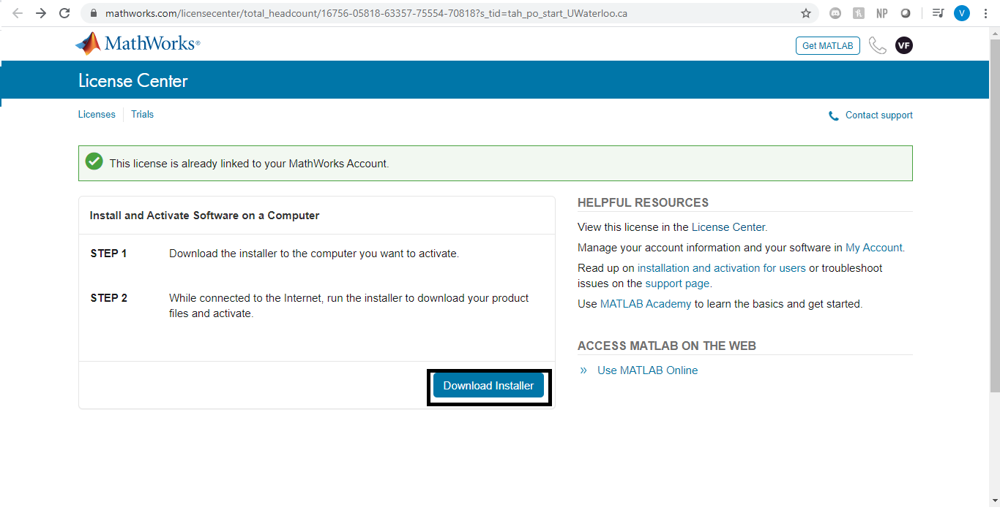
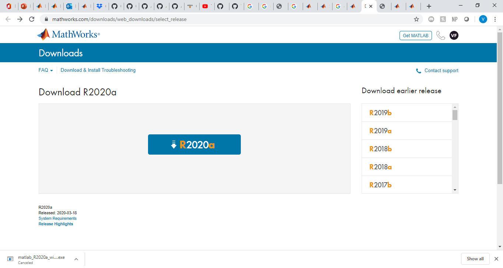
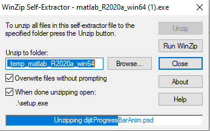
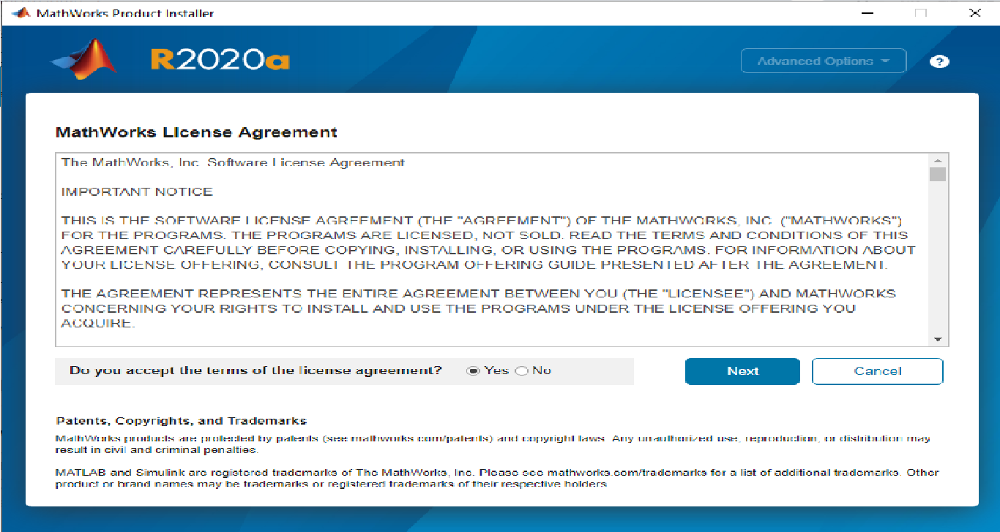
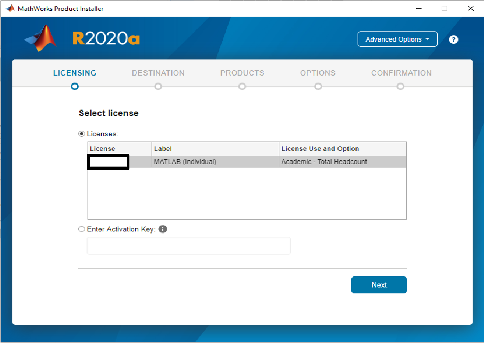

# Installing MATLAB
* **Author**: Vlad Fierastrau
* **Email**: vafierastrau@uwaterloo.ca 
* **Date**: May 5, 2020  

**For those installing MATLAB for the first time, please read all of the steps provided in this tutorial**

## Table of Contents  

* **Verifying your school license**
* **Creating a Mathworks account**
* **Downloading/Installing MATLAB** 

## Verifying your school license
* To get things started, you first need to open up any internet browser to get to the MATLAB home page: https://www.mathworks.com/products/matlab.html 
* Since you are a Waterloo student, you do not have to purchase a MATLAB temporary license since the school already has one (until the end of June, 2020). 
* Click "Check for access" shown below:

* Enter in the name of your school, school email along with other information shown on the page below.

* You will receive the following email from Mathworks. 

## Creating a Mathworks account 
Please refer to the following tutorial: [**How to use MATLAB Grader?**](tutorial/matlab_grader)

## Downloading/Installing MATLAB
* Go back to your **email** and copy and paste the link provided to you. 
* Press the "Sign in to get started" button.

* You should be prompted to the page below afterward.
* Do not worry about linking your Mathworks account and your account license yet.

* Press "Download Installer" and select the most recent version of MATLAB by pressing the big blue "R2020a" button.

* Please Select the Operator your current computer is using.
* Now sit tight and watch your installer being downloaded! 

* Select the installer from the bottom of your browser and wait for MATLAB files to be extracted. 
* After the installation is finished, allow MATLAB to make changes to your computer.
* If you have a firewall protecting some files being extracted, press "allow access".

* We're almost there, enter your Mathworks info and accept terms and conditions.

* Select the MATLAB License that is on **your** screen and confirm your selection.
* You may pick a specific file destination after this point, however, it would be best if you just leave the file destination that is already suggested.

* For license selection, pick MATLAB and Simulink and go to the last page.
* Select the options that best suit you and head straight to the confirmation page to finish your installation. Press "Begin install"

