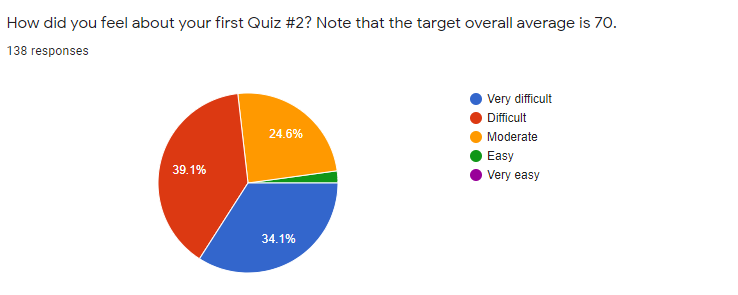
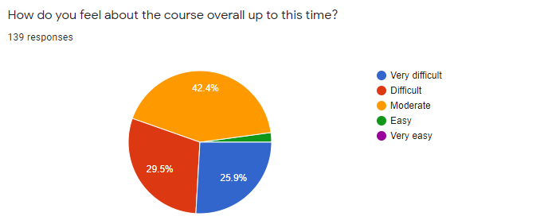
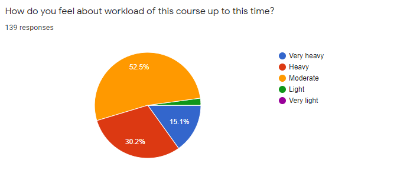

# Feedback Review for Quiz 2

## Summary
139 students responded to the survey and the results are presented below. These results are very similar to the ones from the 3rd-week survey: 

### Q. How did you feel about your Quiz 2? Note that the target overall average is 70.

### Q. How do you feel about the course overall up to this time?

### Q. How do you feel about workload of this course up to this time?

* Overall, students get more comfortable taking quizzes using MATLAB Grader. 
* Students think that the difficulty of Quiz 2 is like Quiz 1. However, some students feel it is still hard and require more time. 
* Around half of the students think that the course load and difficulty are moderate.  
 
## Rescheduling Q3 and Study Plan for Q3 and Q4
* Our teaching team will move the Q3 date from July 15 to July 23. The main reason for this schedule change is to provide students with more study time to prepare Q3. We think that taking the quiz on July 15 could make students feel nervous and pressured. Also, this one-week delay might have a good chance to ramp up the grade of the students who were unsuccessful from Q1 and Q2. If your grade is below 50, you have to give more effort into this course. **We will not do a poll to determine this schedule change**. This schedule change is made at the instructor's discretion. Class reps already asked this schedule change to the students and most of them are glad about it. However, students can petition against this change and we would listen to your request. Please send us an email and then, we will talk to those students in person and comply with their requests. I expect that there are very few.
* There is no lecture video for Module 08. Reviewing slides by yourself is enough for studying this module. Once you quickly review the slides, please solve four tutorial problems and watch the model solutions. There will be no homework or quiz problems from this module. However, we will post an extra assignment regarding this topic. This will be a chance to get extra credit for your grade. 
* There is no lecture in Module 10. In fact, this is a very useful topic to process spreadsheet data like Excel. However, I would save your time and let you put more effort into studying "programming" works. Once you get used to MATLAB programming, you can easily study this topic by yourself when you need those functions. I deleted this module in the course syllabus and tutorial in MATLAB Grader.   
* You cannot solve problems in Q3 if you do not know the topics in Module 06 and 07. If you don't know how to use operators to improve or modify loop-based scripts (Module 06) or you don't know how to define functions (Module 07), you cannot get a good grade. Remember that Module 06 and 07 are based on loop and selection statements. Thus, if you still do not get these concepts, please review these old modules first.    
* You have to know a cell structure and string data type to solve problems in Q4. More than half of the questions in Q4 are to manipulate texts using character vectors or string data. You should finish Module 11 as soon as you can to put your time to solve tutorial problems.  
* We will make one Poker game problem in Q4 (tutorial problems in M07007~M07017 and M07031). The Poker game problem is my favorite problem because it is the best for studying matrix operation and operators. If you do not solve those problems and are not familiar with the model solution, you cannot solve the problem in Q4 within a time limit. Please review them carefully. I would recommend reviewing these tutorial problems right after studying Module 7. However, if you would focus on boosting your grade from Q3, you can solve them later to prepare Q4.
* Again, the problems are designed based on homework or tutorial problems. If you study them following the [study guideline](https://github.com/chulminy/AE_ENVE_GEOE_121#tutorial), you can solve them within the time limit. If you haven't done them before quizzes, you spend extra time to understand the problem description.  

## Advice to the Students 
* Please read the course syllabus and quiz instruction carefully. Please read them before taking the quiz.
* **Remember that the quiz problems are designed on the assumption that you complete homework and tutorial problems.** 
* You must read all announcements in LEARN. This is the only way we can communicate in an online environment. If they are unclear, please ask us! 
* To get prepared for the quizzes, you are able to solve all tutorial and homework assignments following [the study guideline](https://github.com/chulminy/AE_ENVE_GEOE_121#tutorial).
* We already have posted model solution videos for tutorial problems however, some students want to see how our teaching team actually solve those questions and interact with us, such as identifying programming logic and learning debugging process. To accommodate this request, if students let our teaching team tutorial problems in advance, we will show how to solve them during live help session.    

## Comments & Answers 
### Fail to reschedule the quiz #2 date
**CY:** As we already mentioned, we could not change the date if all students agree on moving the date. Also, there was no time to find out another option to reschedule the date. I completely understand that it is unfair that the university does not hear the majority voice. However, these are University policies established at the beginning of this term. See this link: [http://ugradcalendar.uwaterloo.ca/page/Acad-Regs-Guidelines-Tests-Formal-Lecture-Period](http://ugradcalendar.uwaterloo.ca/page/Acad-Regs-Guidelines-Tests-Formal-Lecture-Period). 

### Miscellaneous

**I would answer some major feedback and address your concerns. Although I didn't answer your individual feedback, you can find the answer to similar questions.**

|Feedback & Answer|
|:---|
|**Student:**The quiz questions relied heavily on the homework solutions. I found myself copying my homework's code and logic to use for the quiz. I'm not sure if that is intended.|
|**CY:** Yes. If you notice that, you are on the right track. 
|**Student:** AGAIN the time is not enough!!!!! 2 hours instead of 100mins would be appreciated|
|**CY:** The time limit for Q2 was 2 hours.|
|**Student:** Similar to Quiz 1, I failed to complete all the problems within the given time. I don't know If I will ever complete one of these quizzes within the time period. There are too many questions that require a lot of problem-solving which uses up a lot of time.|
|**CY:** We will try to shorten the problem descriptions on the following quizzes so that you don't have to spend time on understanding the problem. However, you should do practice on making the script faster. Basically, if you know how to solve it, it doesn't take long and the given time period is enough.|
|**Student:** Teaching and instruction is spot on, maybe could do with some tips on how to get through the quiz in time, or possibly changes to the format to make that more feasible|
|**CY:** As mentioned in the study guideline, if you can solve the tutorial problems within the time limit, you can solve the quiz on time.|
|**Student:** The questions are just far too time consuming, to complete so many in such little time. I know we are aiming for that 70% average, but I can never finish them in time. Maybe it is because I am a slower typer, or maybe I am just not fast enough to figure out what the questions want, but really these quizzes make me like a failure.|
|**CY:** Please talk with our teaching team if you are struggled with solving all these questions.|
|**Student:**Fewer tutorials and base the quiz questions more on the homework questions and less on tutorial because we do not have the time to devote the time u expect us to devote to them.|
|**CY:** The quiz problems were based on tutorial and homework problems. If you do not notice that, you need to study more and spend more time to work on this course.|
|**Student:** I think it might've been helpful if we were given a concise list of some kind of all the built-in functions|
|**CY:** I would encourage students to make their own function list. The quiz is an open book so they can easily make it.|
|**Student:** Just want to clarify for workload that I didn’t do all the practice problems before the quiz, but I still understand the content and did well. If I wasn’t picking it up as quickly, or had to do all the problems to fully understand I would categorize this course as a heavy workload.| 
|**CY:** If you find tutorial problems are similar each other, you don't have to solve them all. |
|**Student:** I found quiz 2 very challenging (I think because there is such a build-up of information over the past 5 modules). I think summary sheets of common matlab functions and strategies would be very useful and beneficial considering the format in which all course notes are compiled -takes long to search and navigate!|
|**CY:** Again, this is an open-book quiz. Students need to make their own notes to prepare for the quizzes. However, our teaching team can review your summary notes.|
|**Student:** I could not find the quiz at first since I thought it was under homework where Quiz 1 was and not under grader so I lost some time trying to find it :( the questions were better to understand this time and I thought the review videos were helpful|
|**CY:** If you have any issue during the quiz, you can send us a message right away. Do not figure them out yourself.|
|**Student:**It's difficult to solve questions containing next concepts that we've never seen or practiced solving before, when the quiz realistically only allows for 20 minutes per question. If we were given more time it would have been more possible for me to solve questions that I had never practiced before (not seen in any of the tutorials, homework questions, or lectures). I wish the quiz content reflected more of what we've learned in class and less of the new ways of solving problems when we already don't have much time per question.|
|**CY:** It is not true that the problems in Quiz 2 are completely new ones. They were from homework assignment and Quiz 1. That's why we encourage you to watch solution videos. The problem descriptions are almost the same as the previous questions.|
|**Student:** I like this course so far! The quizzes feel similar to homework questions so they're not super intimidating, but still hard enough that its pretty challenging to finish. Aside from that, I only wish I had more questions for the learn discussion board, but everytime I think of something I see it's already been answered.|
|**CY:** Yes. If you notice that, you are on the right track.|
|**Student:** The quiz was fairly hard. I just hope that multiple people failed so we can get it curved. It pained me that last time over 30% passed and over 30% failed. I wish the marks were closer.| 
|**CY:** Yes. We will support students having low grades in the previous quizzes so that they can get better grades in the rest of the quizzes.|
|**Student:** I think the workload felt heavier because of other midterms. Also for the Candy store question, I am not sure why I am getting wrong answers without any errors and all conditions met.|
|**CY:** Please review a quiz 2 solution review video. |
|**Student:** The amount of tutorials and live sessions in this course are very fair and there’s actually quite a lot which is great because I get to ask a bunch of questions and go over topics I’m not understanding. The lectures are very thorough in teaching new concepts. Where there seems to be a disconnect is how that gets transferred into the quiz material. I feel that there are too many questions for the amount of time allotted. I don’t believe these quizzes are designed with the intention of student success.|
|**CY:** Great comment. Yes. I should choose to make either fewer but harder questions or more but easier questions. If we only provide two or three tough questions in the quiz, some students do not even solve any single problem. From my perspective, students think that the quizzes are likely competing how fast we are writing code but if you know the logic to solve the problem, 20 minutes per question are not short. For example, if you solve the question in Quiz #1, they can be solved within a few minutes now.|
|**Student:**The weighting for the last two quizzes seems as though it is set up to reward those retaking the course and those with prior coding experience. For the first time coders it will be extremely difficult to achieve a passing grade.|
|**CY:** That's not true. More than half of the students who got full marks had no programming experience. If we put more weight on the first two quizzes, the first time coder will be more struggled and hard to get a good grade. Regarding the students who retake the course, there are only five students this year and they will be graded separately.| 
|**Student:** During the quiz I was really stressed out and my brain froze. I couldn't think of anything I had learned or studied, so I definitely did poorly on the quiz. I would really appreciate if you could write some tips for remaining calm during quizzes.|
|**CY:** Have you had done practice following to the study guideline? [https://github.com/chulminy/AE_ENVE_GEOE_121#tutorial](https://github.com/chulminy/AE_ENVE_GEOE_121#tutorial). If you can't solve tutorial or homework problems having similar stars within a time limit (around 20 minutes), you can't complete quiz questions on time. Try out solving previous homework problems that you already submitted. I'm sure that you can't finish them quickly because those problems are not yours yet. There is no "special" tip or shortcut. Just study lecture and tutorial problems following to the study guideline.|
|**Student**: I was running my script a few times for question 1, thought it was weird that sometimes the vector size was 1*300 but sometimes it was more than 300, like 1*305. Anyhow, I followed the 300 as per the question parameters and it was wrong, but I did get it right after making my code more general. Thanks.|
|**CY:** I don't get your point. Once you get the Q2 result, please talk to our teaching team.|
|**Student 1**:Similar to Quiz 1, I failed to complete all of the problems within the given time period. I don't know If I will ever complete one of these quizzes within the time period. There are too many questions that require a lot of problem-solving which uses up a lot of time. **Student 2**:Quiz 2 was very difficult for me to complete and I feel like the amount of time given is not sufficient for me to be able to understand and properly answer all the questions. I have never coded before this course and while I feel as though I understand the material itself, I feel that the amount of questions for the amount of time given is very difficult and I believe we should either be given more time or fewer questions.|
|**CY:** I already answered the similar questions above.|
|**Student**:This quiz went smoother than the first by a wide margin I think. I will still note that I feel like more time would be a benefit. I don't understand the need for a strict time limit for these quizzes.|
|**CY:** Since it is an open-book quiz, the time limit is necessary.|
|**Student**: Personally I feel like evryone is treated academically equal in this course. I have gone to many office hours, spoken to many TA's, but like no one understands that I need that extra help and that I don't get it. At this point I think I am gonna fail this course, because of the fact that no one is understanding that I need a lot of help!|
|**CY:** If you need an extra help, just send us emails or MS chats. We can set up a time to support your study. I think TAs are very supportive and I tried my best effort to answer the questions in LEARN.|
|**Student**:I find doing the homework questions quite difficult, although I watch the lectures, look at the slides and tutorial questions, most of the homework questions don't have very similar tutorial questions that I could refer to. This causes me to constantly get stuck and makes it difficult to complete homework. I liked the first few homework assignments that we had, I was able to refer to the tutorial questions (as they were very similar) and find help with my questions and I found that I was able to understand more, and the homework did not stress me out.|
|**CY:** If you find difficulty in homework questions, just ask us for help. We can give you a hint or guide you to solve them quickly|
|**Student**: Why do they remove the test after the timer ends? You should still be able to view your solutions after the test has ended.|
|**CY:** This is because we should grade the quizzes. You might overwrite your new solutions although we can track them via submitted time. You can access the quiz problems a few days after.|
|**Student**:I think the time limit for the quiz was MUCH better. I wasn’t panicking the whole time. Solution videos for quiz 1 were very handy as well as the videos done by the WEEF TAs. I got a 30% as of right now but I am not mad because I think it was fair quiz. No unsurprising questions that we wouldn’t understand if we had studied or even looked over the recommended questions. The only thing I would suggest is uploading the quiz reviews a week in advance even if we haven’t learned the content yet because when it’s uploaded two or three days before the quiz, it’s hard to make time to watch everything, do everything and still balance the other classes which is why I know some people don’t watch them because of the time given from when they’re released to when the quiz is. Other than that, I’m good. Keep doing good work!|
|**CY:** We will upload the review videos as soon as we can. Making videos took a lot of time and effort so sometime, it is not easy to upload them on time. However, you will see the review videos for Q3 and Q4 early!|