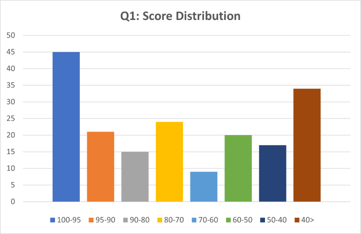

# Q1 Result

## Class average 

**68.589 / 100**

## Score Distribution

## Average by problems
|Q1-1 (15 pt)|Q1-2 (15 pt)|Q1-3 (20 pt)|Q1-4 (10 pt)|Q1-5 (20 pt)|Q1-6 (20 pt)|
|:---|:---|:---|:---|:---|:---|
|11.23|10.81|13.16|9.33|9.38|15.2|
