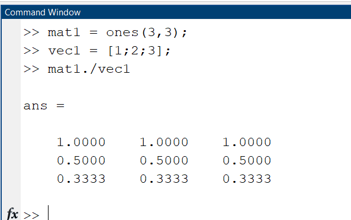
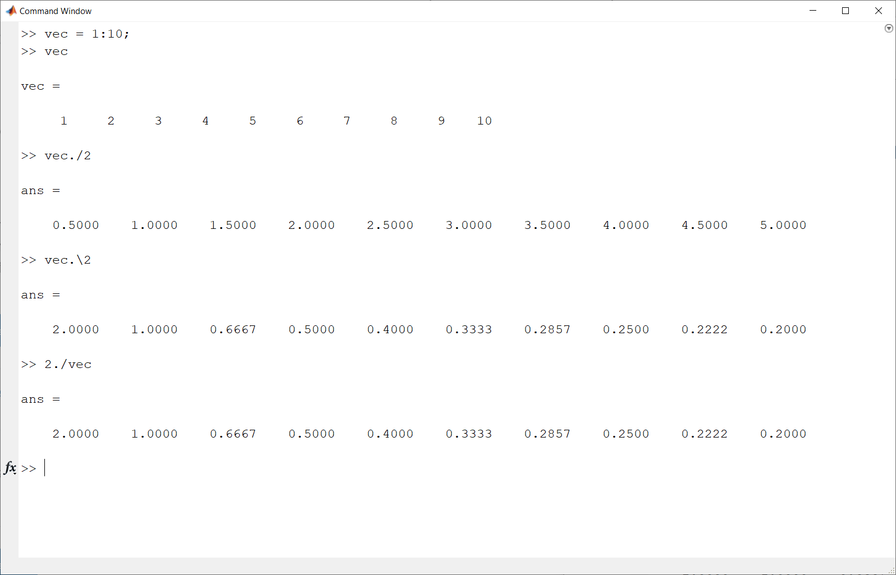
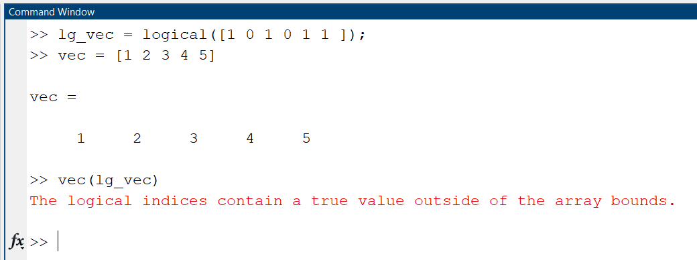

# Module 06: Operators

**Last updated:** 2021-08-14

## Question List
- [M06-Q1: Logical Indexing](#Q1)
- [M06-Q2: The "./" Operator](#Q2)
- [M06-Q3: The Difference between the ./ and .\ Operator](#Q3)
- [M06-Q4: Error: "The logical indices contain a true value outside of the array bounds"](#Q4)

### M06-Q1: Logical Indexing  
**Question:** I understand that Matlab will only accept a logical vector when locating the true or false elements in a vector but I don't understand why? What does making the vector logical change about how the software can read the ones and zeros in the vector?

**Answer**: There are three ways of indexing an array: subscript indexing, linear indexing, and logical indexing. When you use a logical vector as an indexing vector, you are doing the logical indexing.

### M06-Q2: The "./" Operator  
**Question:** When do i use ./ operator? only when i have to divide a vector by vector or when i have to divide vector with a scalar or when i have to divide a scalar by a vector or at all the three times?

**Answer**: You don't have to use ./ for vector and scalar division. You can use just the division. How about this? 

Please refer to Pages 67 to 69 in Module 2: Vectors and Matrices to understand the differences between Scalar and Array operations.
Check out this page for more information about the ./ function: [Mathworks: rdivide] (https://www.mathworks.com/help/matlab/ref/rdivide.html) 

### M06-Q3: The Difference between the ./ and .\ Operator  
**Question:** I was just wondering, what is the difference between the ./ operator and the .\ operator? I know they are for element-wise division, but what difference does the orientation of the dash make?

**Answer**: Very interesting question. I don't like the \ slash operator because if it is misused, it is a big problem..See my testing

It looks like dot backslash is flip the denominator and numerator. 
Since we can replicate those operations using dot slash, **I would not recommend using it, unless it is necessary.** 
MathWorks has some good documentation about the two functions: 
* ./ (rdivide): https://www.mathworks.com/help/matlab/ref/rdivide.html 
* .\ (ldivide): https://www.mathworks.com/help/matlab/ref/ldivide.html 

### M06-Q4: Error: "The logical indices contain a true value outside of the array bounds"  

**Question:** I have gotten this error a couple times and I'm not too sure what it exactly means . . 
"The logical indices contain a true value outside of the array bounds." 

**Answer**: I replicate this error message. Can you get what's wrong in this code? Hint: take a close look at the number of elements in lg_vec and vec. Think back to Module 2, can a vector be read by an index that does not exist yet?   

