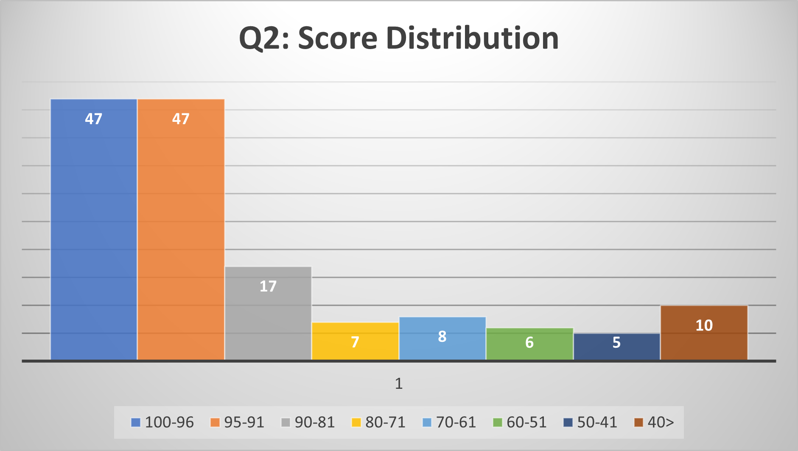
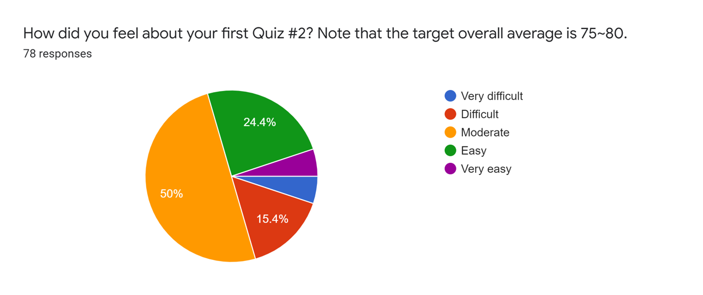
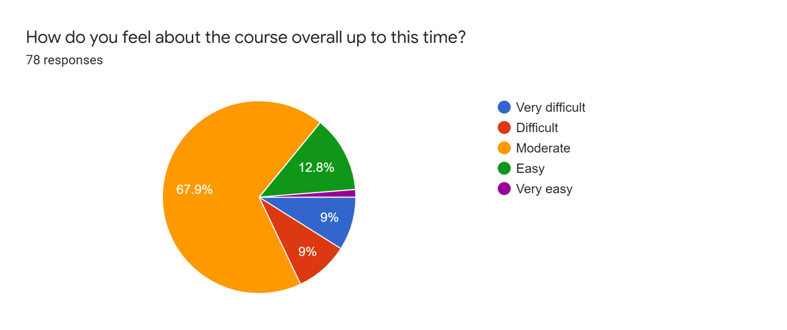
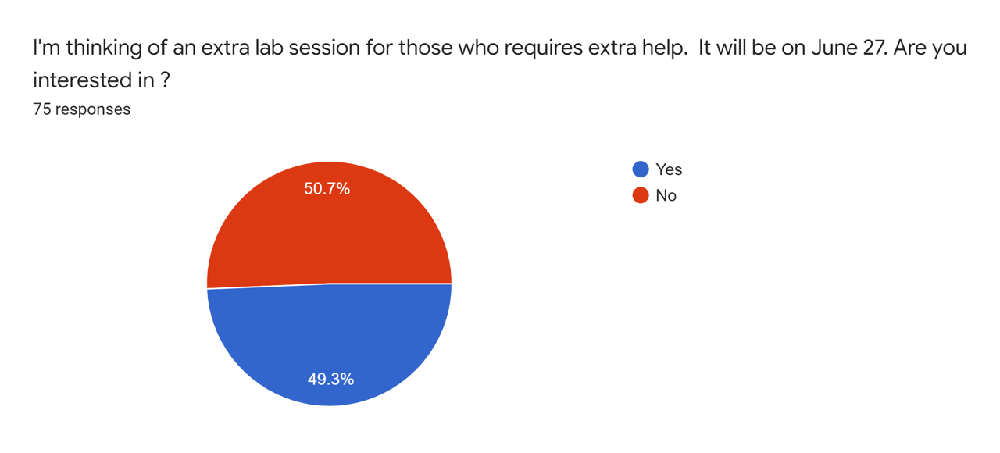

# Feedback Review for Quiz 2

## Q2 Score Distribution

**Class average: 86.64**

## Results
All 78 students responded to the survey and the results are presented below: 

### Q1. How did you feel about your first quiz? Note that the target overall average is 75~80.

### Q2. How do you feel about the course overall?

### Q3. I'm thinking of an extra lab session for those who requires extra help.  It will be on June 27. Are you interested in ?

## Major changes based on students' feedback
* **Q3 questions: ** There are six questions.
	- Q3-1 (★): 20 points
	- Q3-2 (★): 20 points
	- Q3-3 (★★): 15 points
	- Q3-4 (★★★): 15 points
	- Q3-5 (★★★): 20 points
	- Q3-6 (★★★★): 10 points 

*I completed the previous quizzes and the lab questions, and I was still not able to complete most of the questions in the quiz. Since it is our coding ability that is being tested, and not the speed at which we can code, then why can we not get more time for the quizzes? I believe we should get allotted more time during the quizzes*

*This in general is a very heavy course. However, considering the amount of hours my classmate and I put into studying for this quiz since Saturday the 4th, I personally am not happy with how Quiz 2 went. It was a very discouraging experience especially before midterms. That bonus question, should be treated as a bonus not counted for the total marks on the test. It was a low move to include it as such.*

*This is so hard I am drowning*

*I felt that in Quiz 2 I didn't have enough time. The first four questions took me an hour and 50 minutes. I got to the fifth question with only 10 minutes left and even though I knew how to do it, I didn't have enough time to finish. While I could use additional practice to help me be faster, more time on future quizzes would be appreciated.*

*I just think we should take the time in class to solve some tutorial questions*

*I wish the tutorial or past quiz's answer keys are on a link like some of the instead of having to play the video and find the answer. Then that way if I really don't understand, I can watch the video then.*

*I may be wrong, but I don't think the practice quiz questions were posted ahead of time before they were taken up during the help session. This would have helped me to know which questions to prioritize and save time. I think the last question of Quiz two was very difficult, I think it would have been helpful if there were five star questions added tot he tutorials so we could see more similar questions.*

## Advice to the Students 
* Please read the course syllabus and quiz instruction carefully. Please read them before taking the quiz.
* **Remember that the quiz problems are designed on the assumption that you complete homework and tutorial problems.**
* If you want to review model answers for quizzes or homework, please ask TAs to review your scripts and show the answers.   
* To get prepared for the quizzes, you are able to solve all tutorial and homework assignments following [the study guideline](https://github.com/chulminy/AE_ENVE_GEOE_121#tutorial).
