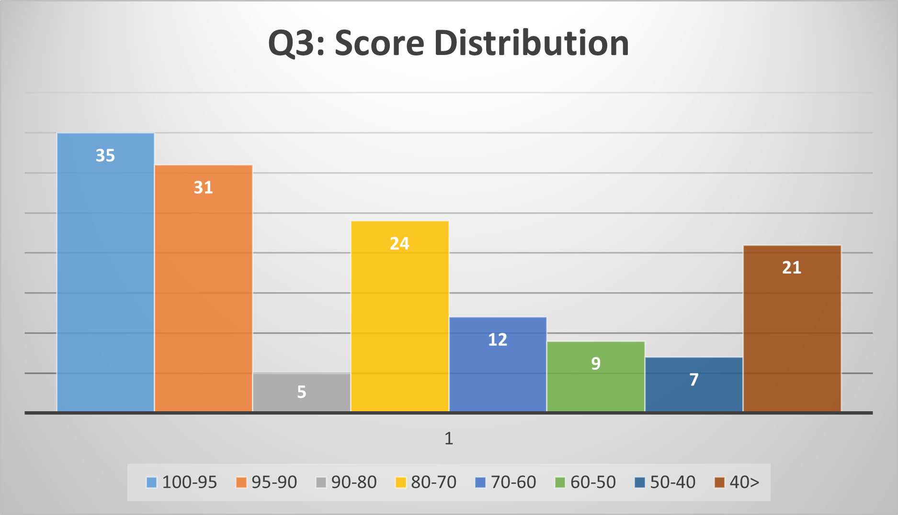
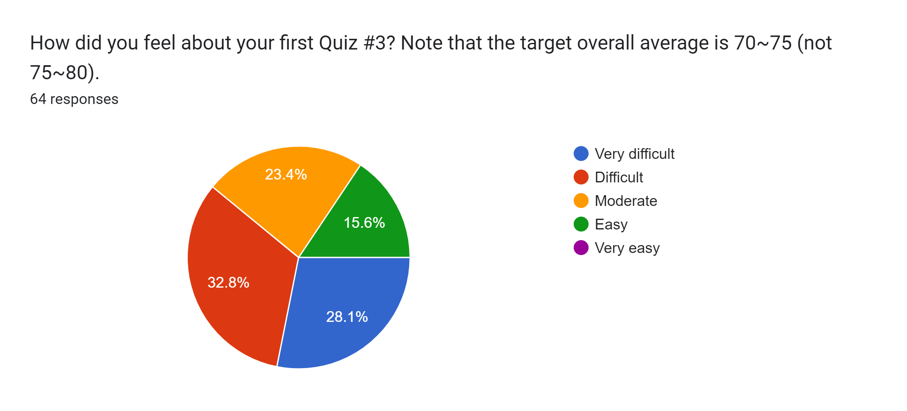
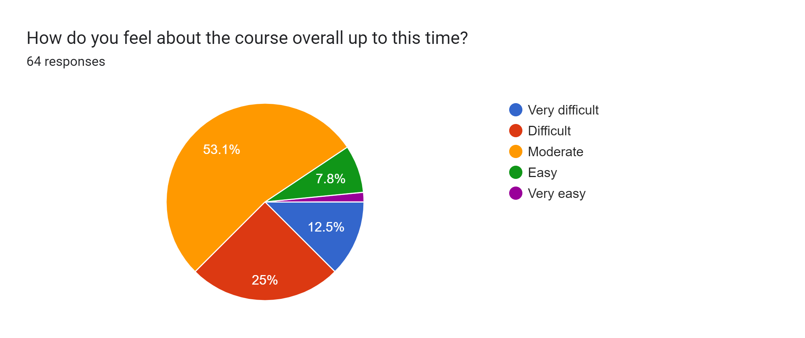

# Feedback Review for Quiz 3

## Q3 Score Distribution

**Class average: 71.97**

## Results
All 64 students responded to the survey and the results are presented below: 

### Q1. How did you feel about your first Quiz #3? Note that the target overall average is 70~75 (not 75~80).

### Q2. How do you feel about the course overall?

I found this quiz to be far harder than the others, I am expecting my grade to be 20-25% lower despite preparing about the same amount. A big issue for me today was time, despite finishing the other two 15+ mins early. I hope the final test will be more similar to the first two rather than the third test.

**The Kahoot sessions are inconsistent.**

I feel kinda stupid because I forgot what a median was

I felt like I didn't have time to think..I didn't even get a chance to read the last question. I understand the logic but I'm not fast enough.

bruh it’s so hard

Questions on the test were very related to the assignment and practice questions, overall seemed fair.

I think the quizzes are a good representation and expectation for student evaluation. It's just me personally, I find I don't have enough time to practice as many tutorial questions as I would like. Since I was not able to do all the tutorial questions, I got most of my value from helps sessions with TA's and practicing the quizzes and homework

Very difficult

it was good

I liked the help session, you should hold more for the other modules
quiz #3 was harder than I expected, but wasn't unreasonable

**the questions on quiz 3 were not similar to the ones we did in the lab, tutorial, homework**

Good difficulty with good timing

Can we get some partial marks for Word Finer puzzle question
The course is going well so far. All content is easy to understand, and the practice we get through labs and tutorial problems helps solve quiz questions adequately.

**I don't think it's fair that Quiz 3 was made harder on account of us having a higher average than expected**

Is the extra online engagement mark one for each month? or it doesn’t matter as long as I post 4 discussion posts throughout the term

I really liked Violets power point about the word search problem. That question was very hard for me to understand and I actually got my code to pass the tester thanks to what I learned from the power point. Also, I have posted a question for each month so far in the course, I was wondering if there was someway I could see that I have gotten my bonus marks for sure? Thanks!!!!!

I understood how to solve all the Qs on the quiz (even Q6), however, I messed up on the syntax for the function declaration (e.g. newmat2d = [ ]) and so I only got Q1 right (it passed the checks while others weren't able to sadly) and caused the most issues with my code due to getting very lengthy and messy on occasions. I realise this was due to a bit too less practice over the exact syntax applications for the code, however, I hope the logic and comments made are able to let me get a decent score.

## Advice to the Students 
* Please read the course syllabus and quiz instruction carefully. Please read them before taking the quiz.
* **Please review homework, lab, and previous quizzes thoroughly.**
* Remember that the quiz problems are designed on the assumption that you complete homework and tutorial problems.
* If you want to review model answers for quizzes or homework, please ask TAs to review your scripts and show the answers.   
* To get prepared for the quizzes, you are able to solve all tutorial and homework assignments following [the study guideline](https://github.com/chulminy/AE_ENVE_GEOE_121#tutorial).
