# Getting Started With MATLAB Grader
* **Author**: Noreen Gao
* **Email**: x97gao@uwaterloo.ca 
* **Date**: May 4, 2020 
 
*Updated: April 27, 2021 by Bianca Angheluta

*Updated v2: May 2, 2022 by Ethan Woo

## Table of Contents  
* **MATLAB Grader Account Creation**  
* **MATLAB Grader Questions**  
* **Submitting/Fixing Solutions**   

## MATLAB Grader Account Creation
* Go to the MATLAB Grader sign up page: https://grader.mathworks.com/    
* Students will receive an invitation email to join the "AE/ENVE/GEOE 121 (S22)" and "Tutorial:Computational Method" courses in the MATLAB Grader.
* Students will need to make a MATLAB Grader account before being able to access the course. 
* Students are required to use the MATLAB Grader for their tutorials, homework, and quizzes.  

||
|:--:|
|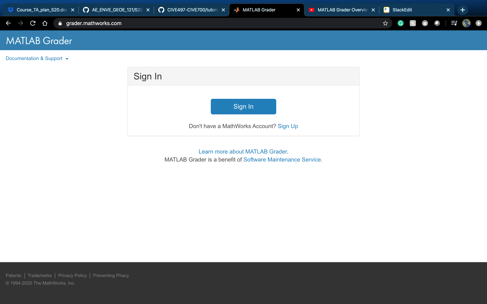|

* Please make sure that you sign up with **your school email**. (userID@uwaterloo.ca).
* Note that this example used a Google email as an example.  

||
|:--:|
|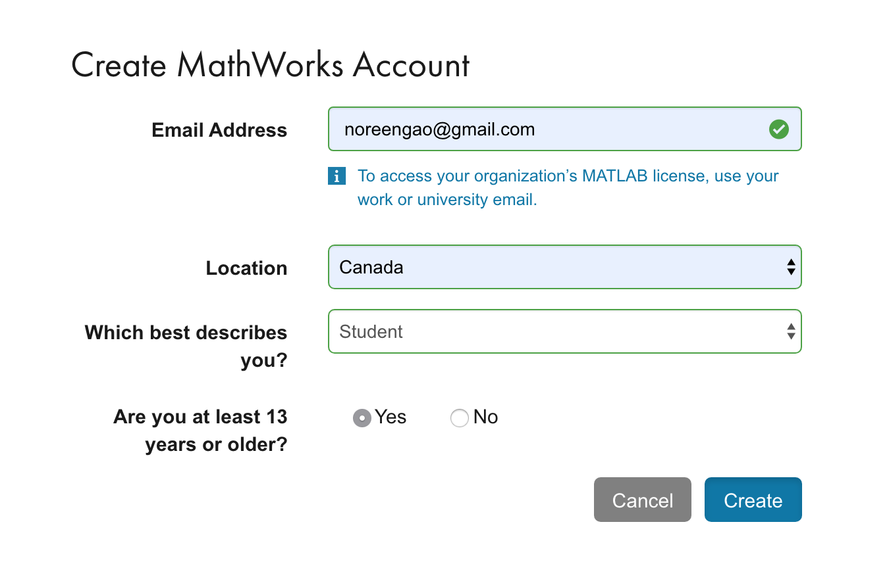|
 
* Please verify your email.  

|||
|:--------|:-----------|
|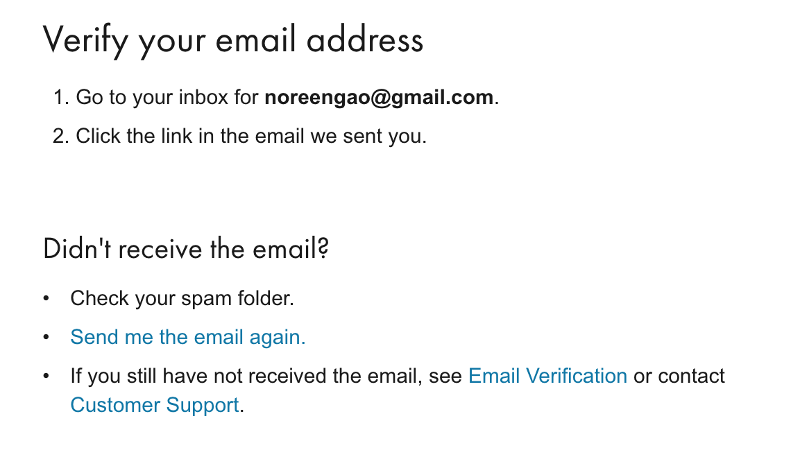|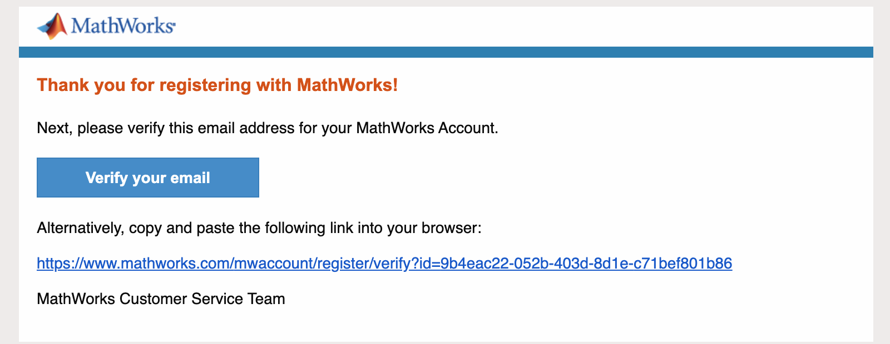|

* Please enter your personal information to finish the registration.
* Recently, students who wish to provide a chosen/preferred first name can be directed to WatIAM. **Please use the name used in WatIAM.** 

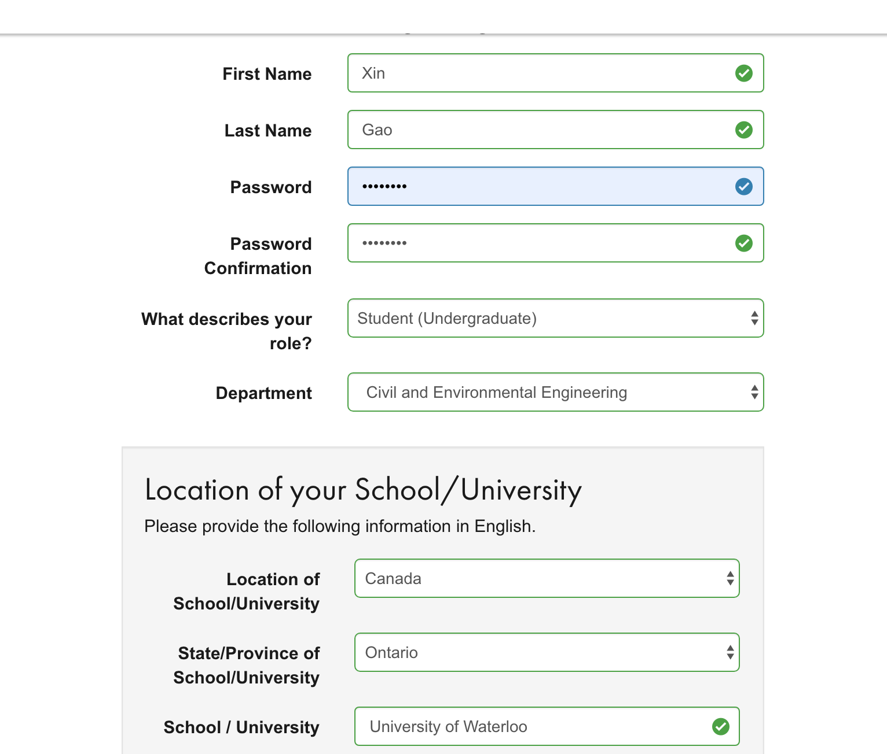

## MATLAB Grader Questions
* Go to our course (AE/ENVE/GEOE 121): https://grader.mathworks.com/courses/18318-tutorial-computational-method

|||
|:--------|:-----------|
|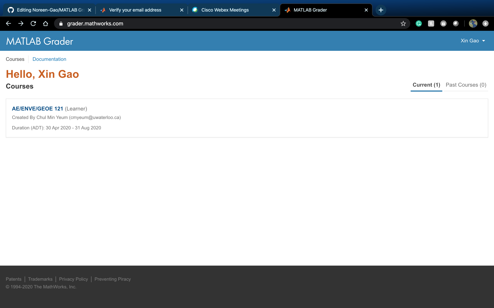|

* You will see tutorials and homework assignments in the column on the left.   

|||
|:--------|:-----------|
|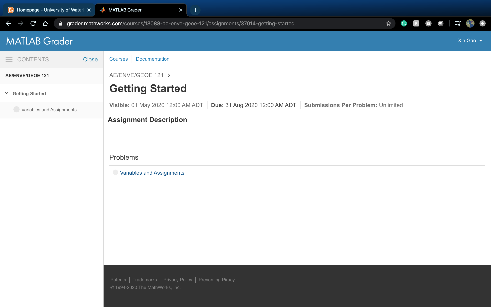|  
   
* Here, I made a sample assignment. 
* Click "Getting Started" -> "Variable and Assignments".
* Please solve this simple problem. 

|||
|:--------|:-----------|
|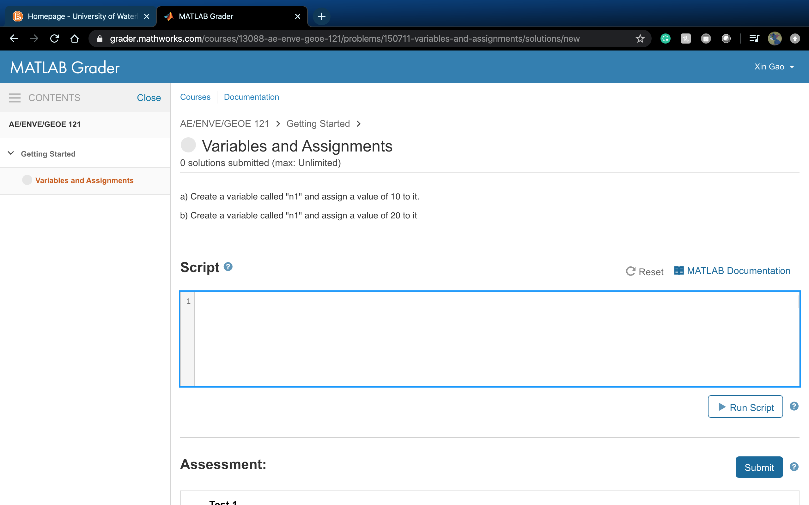|  

* You can push "Run Script" after typing your code into it. 
* This process is to check if your code is working properly without syntax errors. Also, you can print out the output to check the values stored in variables.  
* Note that this is nothing to do with evaluating the correctness of your code. Your code has not been tested or submitted yet. 

|||
|:--------|:-----------|
|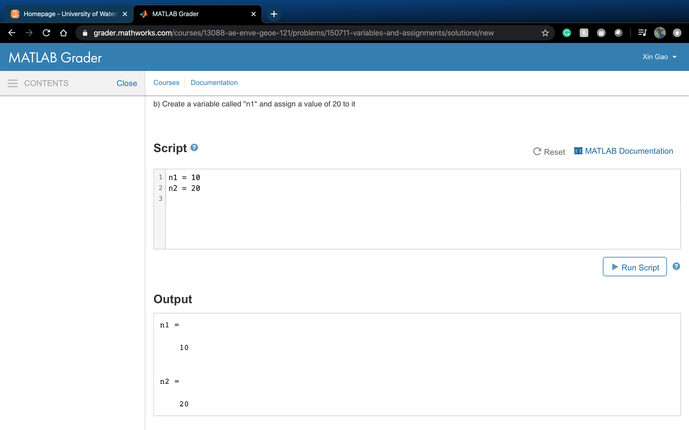|

## Submitting/Fixing Solutions 
* Once you confirm that there is no syntax error, click the "Submit" button on the end of the page to check if your code is correct or not using pre-designed tests.
* You can submit your solution as many times as you would like until all tests get passed for your homework (**not for quizzes**).
* Although you pass all tests, you can fix your solutions (Click "Improve This Solution"). 
* You can also view your past solutions to a problem (Click "My Solutions").

|||
|:--------|:-----------|
|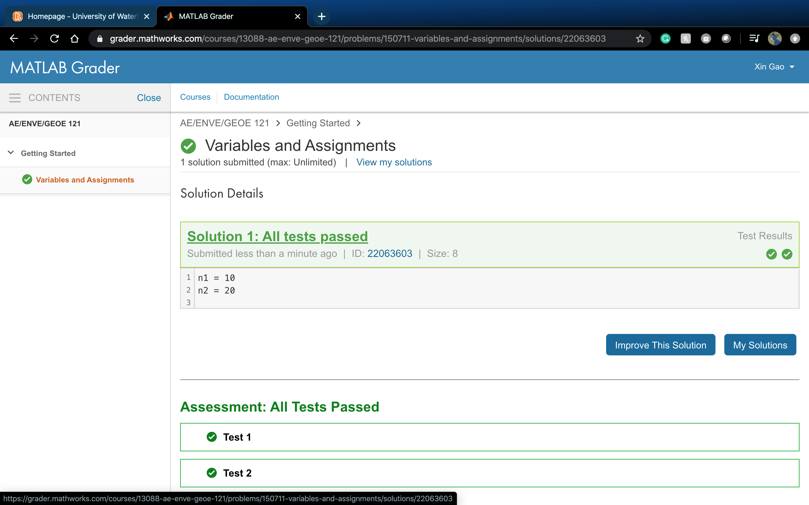|

* If you do not pass the tests, click the "Fix This Solution" button to correct your solution. 

|||
|:--------|:-----------|
|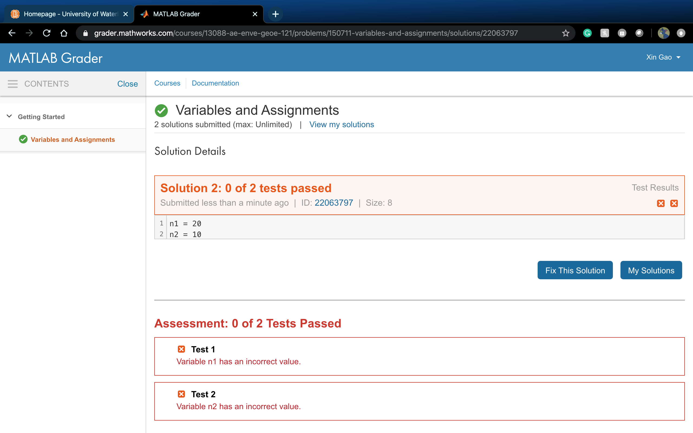|
