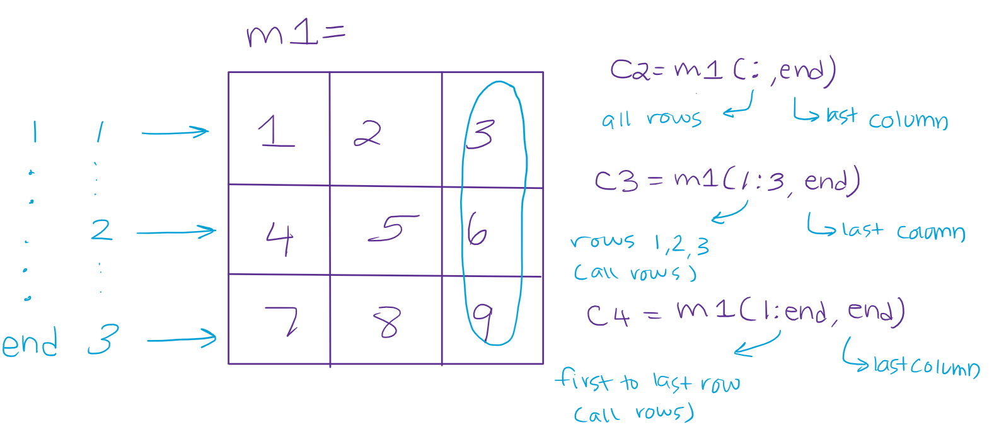
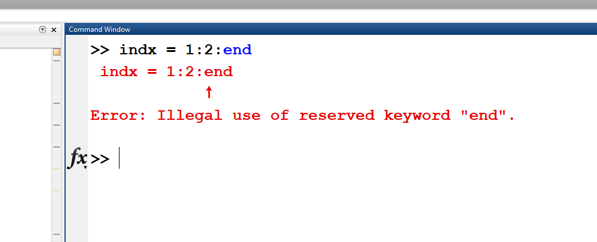
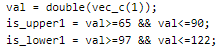

# Module 02: Vectors and Matrices

**Last updated:** 2021-08-12

## Question List
- [M02-Q1: What are ASCII values?](#Q1)
- [M02-Q2: How to use the colon operator to step up or down?](#Q2)
- [M02-Q3: Indexing](#Q3)
- [M02-Q4: Matrix Indexing](#Q4)
- [M02-Q5: The "and" Operator](#Q5)
- [M02-Q6: The "end" Operator](#Q6)
- [M02-Q7: Swapping Columns](#Q7)
- [M02-Q8: Difference between '*' and '.*'](#Q8)
- [M02-Q9: Comments](#Q9)
- [M02-Q10: Referencing by Index Vs. Creating a Variable](#Q10)
- [M02-Q11: Brackets](#Q11)

### M02-Q1: What are ASCII values? <a name="Q1"></a> 
**Question:** I was curious where the numerical values come from that are assigned to each character? For example, why does char (97) return 'a'?

**Answer**: These numerical values for characters all come from the [ASCII Table](https://www.rapidtables.com/code/text/ascii-table.html). The ASCII table assigns numeric values to all kinds of characters, not just alphabetical characters. For example, char(64) returns '@'. It is just a standard to encode a character to a unique numeric value.

### M02-Q2: How to use the colon operator to step up or down? <a name="Q2"></a> 
**Question:** In the colon operator it iterates through values in the form first: step: last, what does the step value stand for and how does it help create the vector? 

**Answer**: The "step" literally means a "jump". This "jump" could go up the numbers by any value you give it. Ex [1: 3: 10] would jump 3 spots from 1-10 printing out 1 4 7 10. It could also go down the numbers by giving it a minus "-" sign. Ex [10: -3: 1] would jump 3 spots DOWN from 10-1 printing 10 7 4 1. 

### M02-Q3: Indexing <a name="Q3"></a> 
**Question:** I was wondering when modifying a vector, I am still confused as to why a vector cannot be read by an index that does not yet exist, but it can be extended by referring to elements that do not yet exist? 

**Answer**: Very tricky to answer this question.... "Why a vector cannot be read by an index that does not yet exist" This is because we can't read the thing that doesn't exist. But we can "point out" or "refer" a new location although it does not exist. (It cannot be read because it does not exist, but we could create it by referring the space)

### M02-Q4: Matrix Indexing <a name="Q4"></a> 
**Question:** Is it possible to explain with sentences what the code means for C3 and C4 ? I see that the output for C2-C4 is the same. 

```matlab
m1 = [1 2 3; 4 5 6; 7 8 9]

c2 = m1(:,end);
c3 = m1(1:3,end);
c4 = m1(1:end,end);
```

**Answer**: C2, C3, and C4 are to explain how to access an entire column. C2  => m1(:, end)  ':' means accessing all values in the corresponding dimension C3 => m1(1:3, end) 1:3 means accessing the values from the first to the third. Since the dimension of m1 is 3 x 3, 1:3 means accessing all values. C4 => m1(1:end, end) 1:end mean accessing the values from the first to the end, which is the last location of the corresponding dimension. The last location is 3. Thus, 1:end here is the same as 1:3. The following diagram might also help:



As result, C2, C3, and C4 are the same!

### M02-Q5: The "and" Operator <a name="Q5"></a> 
**Question:** I have a general question in terms of the and (&&) operator. Is it possible to include it more than once in a line of script?

**Answer**: Yes, It is possible because if you plug something like the following into MATLAB no errors appear.

```matlab
a = 1;
b = -1;
c = 3;
d = 4;
x = (a>-1)&&(a<3)&& (a<4);
```

### M02-Q6: The "end" Operator <a name="Q6"></a> 
**Question:** I am trying to pick alternate values from a vector. If there is a vector

```matlab
values = [12  13  14  15  16  17];
```
a) why does this not work
```matlab
index = 1:2:end
answer = values(index)
```
b) and why does it only work if i do

```matlab
answer = values(1:2:end);
```

**Answer**: a) end is to refer the last value at each dimension. Thus, only when you use "end" inside the array, MATLAB knows the dimension of the corresponding array. Actually, the code doesn't reach to the line of "answer=values(index)" because the line of "index=1:2:end" has a syntax error like below. 



b) That's how the end works in this script! If MATLAB see the "end " in the index section, it is considered as the last dimension of the corresponding dimension.

### M02-Q7: Swapping Columns <a name="Q7"></a> 
**Question:** If we have a 5x6 matrix and we were to swap first and second rows, I'm confused about why we can't use comma to indicate the rows like such:
```matlab
matrix([1, 2], :) = matrix([2:-1:1], :)
```

**Answer**: "index(es)" that can refer or read values in a matrix is **a vector**!!! Here, you use a row vector where you can make either [1 2 3 4] or [1, 2, 3, 4]. Thus, in the left side, you do not have to use comma (,). Similarly, [2: -1:1] is a row vector, right so it works. 

### M02-Q8: Difference between '*' and '.*' <a name="Q8"></a>

**Question:** I'm getting confused on the difference between " * " and " .* ".  Can someone explain this to me?

**Answer:** The "*" operator multiplies vectors/matrices like you would have done in linear algebra last term. For example:

A 1x4 row vector * a 4x1 column vector would produce a single value

A 3x2 matrix * a 2x4 matrix would produce a 3x4 matrix

The ".*" operator is an element-wise operator, meaning that each element of a vector/matrix is multiplied by the value in the corresponding index of another vector/matrix. For example:

A 4x4 matrix .* a 4x4 matrix produces a 4x4 matrix

### M02-Q9: Comments <a name="Q9"></a>

**Question:** Is there a way to turn a block of code into comments? Like for example I think in java you can inser/* ...*/ to turn a block of code into comments which is useful for checking your code.

**Answer:** Yes, you can use '%' before a comment, or any block of code you don't want to run during a test. You'll need to put one in front of each line of code you want to block.

You can also use CTRL+R after selecting the lines to comment them all out, or CTRL+T to uncomment a set of lines.

### M02-Q10: Referencing by Index Vs. Creating a Variable <a name="Q10"></a>

**Question:** Why it is better to replace with a variable rather than referencing a value via index in logical operations? I am referencing situations like in the image shown below, why is this a better method than utilizing vec_c(1) where the val's are placed in is_upper1 and is_lower1?



**Answer:** It's your preference.  However, the above code is much more readable than this:

is_upper1 = double(vec_c(1)) >= 65 && double(vec(1)) <=90

Also, if it is readable, you can easily find your error when you are debugging.

### M02-Q11: Brackets <a name="Q11"></a>

**Question:** Are square brackets used to establish a matrix whereas round brackets are used when identifying matrix elements? I've noticed that square brackets are also used in identifying rows in a matrix ex. mat1([1 2], :), but this is when they are within round brackets.

**Answer:** Yes, essentially. Square brackets are used to establish arrays (vectors or matrices), whereas round brackets are used to identify matrix elements. If you want to identify more than one row/column at once, but not all of them, you need to establish an index vector. You can do this by creating the vector at the time you're identifying the elements in the matrix like this:

mat2 = mat1([2 5],:); % Assigns all column elements of rows 2 and 5 to mat2, in the given order

mat3 = mat1([5 2],:) % Assigns all column elements of rows 5 and 2 to mat2, in the given order

You can also predefine the index vectors like this:

ind_vec = [2 5];

mat2 = mat1(ind_vec,:); % Returns the same results as mat2 above
