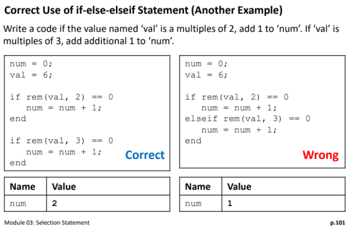

# Module 03: Selection Statement

**Last updated:** 2021-08-12

## Question List
- [M03-Q1: elseif vs. if-else Statements ](#Q1)
- [M03-Q2: Multi-Case Switch Statement](#Q2)

### M03-Q1: elseif vs. if-else Statements   
**Question:** Is there a difference between using the elseif command or just plainly using if and else statements?

**Answer**:Yes, there is a difference in using these 'if' vs 'elseif', this is a good example from the lecture notes: 

If you have conditions which are mutually exclusive (meaning only one of the actions can be performed) you would generally use elseif statements in your code. If you have conditions which are not mutually exclusive (meaning multiple actions can be performed) you would generally use if statements (but it can depend on the specific scenario).  

In this example, the question being asked is not mutually exclusive, if a number is a multiple of both 3 and 2, both actions should be performed which is why the first code is correct while the second is incorrect. 

### M03-Q2: Multi-Case Switch Statement   

**Question:** Is there a way to include multiple cases in the switch statement? For example, if the action is the same for multiple case expressions could you list those case expressions in one line? 

It might look like: 

switch category 

case 1 || 2 || 3 

val1 = 101; 

end 

So far I have tried using || and , to separate case expressions. 

**Answer**: In this course, you only know how to use switch-case statement. I encourage you to use if-else-if statement. The latter one is more flexible. A short answer is No. In your example above, in case XXX, XXX is not a condition statement. It is a value in category. 
