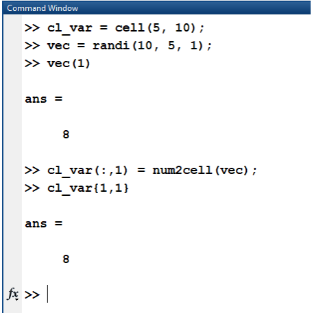
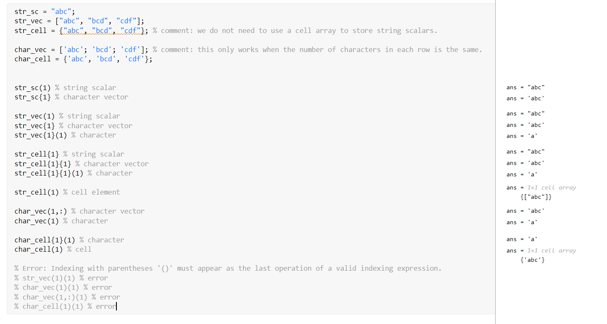

# Module 09: Data Structure

**Last updated:** 2021-08-14

## Question List
- [M09-Q1: Cell to Matrix ](#Q1)
- [M09-Q2: Cell vs. Structure Array ](#Q2)
- [M09-Q3: String Indexing Vs. Character Indexing](#Q3)
- [M09-Q4: "strfnd" vs. "find"](#Q4)
- [M09-Q5: Accessing Values in a Matrix stored in a Cell array](#Q5)
- [M09-Q6: Creation of Cell Arrays](#Q6)

### M09-Q1: Cell to Matrix   <a name="Q1"></a> 
**Question:** Does MATLAB have built in function that could change the cell to matrix or vector if all the items in the cell are double type. Or do we have a function that could change the matrix to a cell directly? 

**Answer**:

See the following functions:
* cell2mat: [cell2mat](https://www.mathworks.com/help/matlab/ref/cell2mat.html) 
* mat2cell: [matt2cell](https://www.mathworks.com/help/matlab/ref/mat2cell.html) 


### M09-Q2: Cell vs. Structure Array  <a name="Q2"></a> 
**Question:** Are there any good real-world examples of when it's better to use a cell array vs a structure array?  It seems to me that they have basically the same functionality but with different syntax.  

At first I thought I would always choose a structure array because I can name the fields and then I don't have to remember "column 1 = scores, column 2 = names, etc".  

But then I wondered, is it easier to input data into a cell array?   If I had a vector of student test scores that I wanted to be in located the 3rd column of my cell array could I write: cl_info{:,3} = test_scores; to put them all in at once?  And is there a way to do that in a structure array? 

**Answer**:It depends on your preference. For example,  

```matlab
st_info(1).names 

st_info(1).mid_term_exam 

st_info{1, 1} 

st_info{1, 5}
``` 

For me, if I know what are the first column and fifth column, the second way is better.  

Not sure if it is a good example but suppose that 2 - 5 columns of st_info contain Q1-Q5 score and you are processing them. If you are applying the same operations to the quiz score, you can make the loop structure to access values at 2~5 columns when you are using a cell array. However, if you do the same job on a structure array, you can't make it using loop because you need to access the value by field name. Can you get the difference?  

You can do it like this: 



### M09-Q3:  String Indexing Vs. Character Indexing <a name="Q3"></a> 

**Question:** What are the differences to string indexing and character indexing? With string indexing we use { } to reference a certain string in the array but with character indexing, can we still index i.e. x(1)(1) for first cell first character? Or does character indexing only follow rules of linear indexing in an array?

**Answer**: Please see the following examples:




### M09-Q4: "strfnd" vs. "find" <a name="Q4"></a> 

**Question:** What are the limitations to using strfnd function vs. find function? Are there situations where it is advantageous to use one over the other?

**Answer**: Very good question. I think you are asking strfnd and find, right? strfnd is to find location(s) of a pattern.e.g., strfnd(char_vec, 'banana') and gives the location(s) of the first occurrence of the input.
find is to give the location of logical true. e.g., find(char_vec == 'b').
strfind accept two string or character vectors as input. 
find accepts an input for a logical vector. I think they are different functions.

### M09-Q5: Accessing Values in a Matrix stored in a Cell array <a name="Q5"></a>

**Question:** If I have a cell with matrices in each element of the cell, how do I specifically access one of the values in one of the matrices?

**Answer:** You can use this syntax to access specific values inside a cell array:

cell_array{cell_row,cell_col}(array_row,array_col)

You can also use linear indexing rather then subscript indexing.

### M09-Q6: Creation of Cell Arrays <a name="Q6"></a>

**Question:** Is there a better-formatted way, or use of loops in order to create cell arrays in a more recyclable way rather than manually inputting each cell value? For example this code:

cl_info = cell(3,7);

cl_info{1,1} = 'Chul Min';

cl_info{1,2} = 'CIVE';

cl_info{1,3} = 1076123;

cl_info{1,4} = [80 90];

cl_info{1,5} = [70 30 50];

cl_info{1,6} = [4 5 1 2];

cl_info{1,7} = '4B';

cl_info{2,1} = 'Noreen';

cl_info{2,2} = 'ENVE';

**Answer:** In most case, cell array is created when we read table data like the data from excel files because they contains texts and numbers. Use of the cell type is only way to store those values in one single variable. (recently, another datatype called 'table' but I do not cover it in our course). 

Just formatting purposes, this is possiable but either way needs similar efforts. 

c_info{1, :} = {'Chul Min', 'CIVE', 1076123, ...} 
