# Module 02: Vectors and Matrices

**Last updated:** 2021-08-14

## M02001. Creating and Manipulating Arrays (★) 
The following variables are created in advance using `randi` and will be used for solving questions. 

```matlab
val1 = randi(100);
val2 = randi(100);

vec1 = randi(100, 10, 1);
vec2 = randi(100, 1, 5);

mat1 = randi(100, 10, 5);M
mat2 = randi(100, 5, 10);
mat3 = randi(100, 10, 5);
```

You need to write a script that creates a variable named:
(a) 'vec_a' that is copied from 'vec1'. Then, the value of the third element in 'vec_a' is changed to 'val1'.   
(b) 'vec_b' that is copied from 'vec1'. Then, the values of the third and fifth elements in 'vec_b' are changed to 'val1'.   
(c) 'vec_c' that is copied from 'vec2'. Then, the values of the third and fifth elements in 'vec_c' are changed to 'val2'.   
(d) 'vec_d' that is a row vector and is copied from the second row of 'mat1'.   
(e) 'vec_e' that is a column vector and is copied from the first column of 'mat2'.    
(f) 'mat_f' that is a matrix. The first, second, and third columns of 'mat2' are concatenated in the row (horizontal) direction and assign it to 'mat_f'.    
(g) 'mat_g' that is a matrix. The first, second, and fifth columns of 'mat2' are concatenated in the row (horizontal) direction and assign it to 'mat_g'.    
(h) 'mat_h' that is a 10 x 6 matrix. 'mat1' and 'vec1' are concatenated in the row direction, and assign it to 'mat_h'.    
(i) 'mat_i' that is a 11 x 5 matrix. 'mat3' and 'vec2' are concatenated in the column direction, and assign it to 'mat_i'.    
(j) 'mat_j' that is a 20 x 5 matrix. 'mat1' and 'mat3' are concatenated in the column direction, and assign it to 'mat_j'.    
(k) 'mat_k' that is a 2 x 5 matrix. The first and fifth rows of 'mat1' are concatenated in the column direction, and assign it to 'mat_k'.     

**Solution**  
Please watch this:[**https://youtu.be/jjcuh5eLEKk?t=10**](https://youtu.be/jjcuh5eLEKk?t=10)

## M02002. Basic Array Manipulation (★)

You need to write a script to create a variable named:  

(a) 'vec1' containing numbers from 1 to 10. 'vec1' is a 1 x 10 row vector.  
(b) 'vec2' containing even numbers from 2 going up to 20. 'vec2' is a 1 x 10 row vector.  
(c) 'vec3' containing every third number, starting at 30, and going down to 3. 'vec3' is a 1 x 10 row vector.  
(d) 'vec4', which is a row vector of size 1 x 30, containing 'vec1', 'vec2' and 'vec3' in that order (concatenating 'vec1', 'vec2', and 'vec3' in the row direction).   
(e) 'mat1' containing a 3 x 10 matrix that joins 'vec1', 'vec2' and 'vec3' in the column (vertical) direction (concatenating 'vec1', 'vec2', and 'vec3' in the column direction).   
(f) 'vec5', containing every 2nd element in 'vec4'. 'vec5' becomes a 1 x 15 row vector.  
(g) 'vec6', which is the 2nd column of 'mat1'. 'vec6' becomes a 3 x 1 column vector.  
(h) 'mat2', which contains the elements at all the rows and the 2nd and 6th columns of 'mat1'. 'mat2' becomes a 3 x 2 matrix.    
(i) 'val1', which is the element at the 3rd row and 4th column of 'mat1'. 'val1' is a scalar variable.    
(j) 'vec7', which is a 1 x 3 row vectors containing the elements at the first row and 4th, 5th and 6th columns of 'mat1'.    
(k) 'mat3', which is a 2 x 5 matrix containing the elements at first and third rows, and 6th to 10th columns of 'mat1'.    
(l) 'vec8', which is a 2 x 1 column vector. Please concatenate value1 and value2 in the column direction, where value1 is the element at the 3rd row and 2nd column of 'mat1' and value2 is the element at the 3rd row and 5th column of 'mat1' .    
(m) 'mat4', which is copied from 'mat1'. The 5th column of 'mat4' is then replaced with 'vec6'. 'mat4' is a 3 x10 matrix.    
(n) 'mat5', which is copied from 'mat1'. The elements at the 2nd row and 3th to 5th columns in 'mat5' are replaced with 'vec7. 'mat5' is a 3 x 10 matrix.    
(o) 'mat6', which is copied from 'mat1'. The elements at all the rows and 3th and 4th columns in 'mat6' are replaced with 'mat2'. 'mat6' is a 3 x 10 matrix.    

**Solution**   
```matlab
vec1 = 1:10; %(a)
vec2 = 2:2:20; %(b)
vec3 = 30:-3:3; %(c)
vec4 = [vec1 vec2 vec3]; %(d)
mat1 = [vec1; vec2; vec3]; %(e)
vec5 = vec4(1:2:end); %(f)
vec6 = mat1(:,2); %(g)
mat2 = mat1(:,[2 6]); %(h)
val1 = mat1(3,4); % (i)
vec7 = mat1(1,4:6); % (j)
mat3 = mat1([1 3], 6:10); %(k)
vec8 = [mat1(3,2); mat1(3,5)]; %(l)
mat4 = mat1; %(m)
mat4(:,5) = vec6;

mat5 = mat1; %(n)
mat5(2, [3 4 5]) = vec7;

mat6 = mat1; %(o)
mat6(:, [3 4]) = mat2;
```

## M02003. Pressure Calculation (★)

'press1', 'press2' and 'press3' contain pressure data that are collected from Station 1, 2, and 3, at 1hr intervals, starting at 6:00AM and ending at 11:00PM (all 18 measurements in each location). Here are the script to generate synthetic values for these variables.  

```matlab
press1 = randi([10 30], 18, 1);
press2 = randi([0 20], 18, 1);
press3 = randi([10 30], 18, 1);

area_device_const = randi(100); % constant cross-sectional area of pressure measuring devices
area_devices = randi(100, 3, 1); % different cross-sectional area of pressure measuring devices
```

Please write a script to  
(a) create a matrix 'data_press'. 'press1', 'press2', and 'press3' are concatenated in the row direction and assign the resulting matrix to 'data_press'.  For example, the first column in 'data_press' indicate the measurements at Station 1.   
(b) create a 1 x 3 vector called 'data_press_9am' which contains the data collected at 9:00 am from all stations.   
(c) create a matrix 'data_press_new' that is copied from 'data_press'. 
You realized that the data from Station 2 was abnormally low (underestimated) and should be corrected by adding 10.  Please correct the corresponding values in 'data_press_new'.   

The force acting on the pressure measuring devices can be calculated using the equation , where F is force, P is pressure and A is a cross-sectional area of the pressure measuring device.  
(d) If the cross-sectional areas of the devices at all Stations are constant and given as 'area_device_const'.  Please convert pressure data in 'data_press_new' to force data, and assign the resulting matrix to 'data_force1'. Note that 'data_press_new' and 'data_force' are same dimension.    
(e) If the cross-sectional areas of the devices at Stations are different and their areas are given as 'area_devices'.  Please convert pressure data in 'data_press_new' to force data, and assign the resulting matrix to 'data_force2'.   
(f) You still do not trust the data from Station 2. Please create a 18 x 3 matrix named 'data_press_good' that is copied from 'data_press'.  Please remove all data from Station 2 in 'data_press_good'. Thus, 'data_press_good' becomes a 18 x 2 matrix.   

Note that you do not need to consider units for pressure data and areas. 

**Solution**
Please watch this:[**https://youtu.be/jjcuh5eLEKk?t=1132**](https://youtu.be/jjcuh5eLEKk?t=1132)

## M02004. Character Type Casting (★★★) 

Note: refer to the ASCII table when solving this question: https://www.rapidtables.com/code/text/ascii-table.html
The following variables are created in advance using 'randi' and will be used for solving questions. 

```matlab
char_ran = char(randi([65 122])); % a randomly generated character
```
(a) a char vector 'vec1', which contains lowercased letters from a to z.   
(b) a char vector 'vec2', which contains lowercased letters from z to a.   
(c) a char vector 'vec3', which contains uppercased letters from A to Z.   
(d) a char vector 'vec4', which is copied from 'vec1'. The 10th element (letter j) of 'vec4' is removed.   
(e) 'is_upper' to test if 'char_ran' is an uppercased letter?    
(f) 'is_a_letter' to test if 'char_ran' is an English letter (alphabet)?   

**Solution**  
Please watch this:[**https://youtu.be/jjcuh5eLEKk?t=5191**](https://youtu.be/jjcuh5eLEKk?t=5191)

## M02005. Replicating built-in functions of fliplr and flipud (★★)

Before starting this problem it is important to understand exactly what the fliplr and flipud functions do ('lr' stands for left and right, and 'ud' stands for up and down).
For those who need review, the fliplr function is used to swap columns of any matrix is reverse order, while the flipud function does the same but for rows.  
* flipud: https://www.mathworks.com/help/matlab/ref/flipud.html  
* fliplr: https://www.mathworks.com/help/matlab/ref/fliplr.html  

a) Given an n x n matrix named 'n_mat', replicate the `fliplr` function without actually using it (flip the order of the columns). Use 'fliplr_mat' copied from 'n_mat' as the unknown variable for this question.   
b) Given an n x n matrix named 'n_mat', replicate the `flipud` function without actually using it (flip the order of the rows).  Use 'flipud_mat' copied from 'n_mat' as the unknown variable for this question.  

**Solution**   
Please watch this:[**https://youtu.be/jjcuh5eLEKk?t=2135**](https://youtu.be/jjcuh5eLEKk?t=2135)

## M02006. Array Manipulation (★★)

You need to write a script that creates a variable named :   
(a) 'vector1' that contains a 1 x 30 row vector and its elements are 1 through 30 in order.   
(b) 'vector2' that contains vector1 with a reverse order.  
(c) 'vector3' that contains a vector ('vec_tmp') in reverse order. For example, if vec_tmp is [4 3 2 1 5], vector3 becomes [5 1 2 3 4].  
(d) 'matrix1' that contains a 3 x 30 array joining 'vector1', 'vector2', and 'vector3' in a column direction (vertical) and in order.   
(e) 'matrix2' that is copied from 'matrix1'. Then, swap elements in first and second rows of 'matrix2' and then swap elements in second and third columns of 'matrix2'. 

For example, assume that mat1 = [1 2 3; 4 5 6]. After swapping rows, 'mat1' becomes [4 5 6;1 2 3]. Then, swapping columns makes 'mat1' [4 6 5;1 3 2].  

**Solution**  
Please watch this:[**https://youtu.be/jjcuh5eLEKk?t=3910**](https://youtu.be/jjcuh5eLEKk?t=3910)

## M02007. Simple Linear Indexing (★)

The following variables are created in advance using `randi` and will be used for solving questions.  

```matlab
mat1 = randi(100, 5, 6);
```
You need to write a script that creates a variable named:  
(a) 'val1', which is the element located on the third row and the fifth column of 'mat1'.  
(b) 'val2', which is the last element of 'mat1' in terms of a linear indexing order.  
(c) 'vec1', which is a row vector containing all the elements from the second to the seventeenth element of 'mat1' in terms of a linear indexing order.  
(d) 'vec2', which is a 1x30 row vector conataining integer numbers from 1 to 30.
(e) 'mat_e', which is a 5x6 matrix reshaped from 'vec2' in order.    
(f) 'mat_f', which is a reverse "linear indexing" order of 'mat1'. For instance, suppose that mat1 is [1 3 5; 2 4 6]. Then, mat2 becomes [6 4 2;5 3 1]   

**Solution**  
Please watch this: [**https://youtu.be/jjcuh5eLEKk?t=3021**](https://youtu.be/jjcuh5eLEKk?t=3021)

## M02008. 3D Matrix Problems (★★) 

MATLAB uses multiple functions and operations that allow you to create and modify matrices in the third dimension.   
a) Construct a 3 x 3 matrix filled with n. Use 'n_mat' as the name for the matrix.  
b) 'mat_3d' is copied from 'n_mat'. Append 'mat1' at the second location (layer) in the depth (third) dimension.  
c) 'mat_3d2' is copied from 'mat_3d'. Replace the elements located in the first row of the second layered array with n.  
d) Concatenate 'mat_3d2' and 'mat2' in the depth direction and assign this new matrix to 'mat_3d3'. This creates a 3 x 3 x 3 array.   
e) 'mat_3d4' is copied from 'mat_3d3'. Replace the matrix at the third location (layer) in the depth dimension with a 3 by 3 identity matrix.  

**Solution**  
Please watch this:[**https://youtu.be/jjcuh5eLEKk?t=4280**](https://youtu.be/jjcuh5eLEKk?t=4280)

## M02009. Creating and Modifying Arrays (★)

This program is to create and manipulate a row or column vector, 2D matrix, and 3D matrix. The following variables are created in advance using `randi` and will be used for solving problems.

```matlab
n = randi([4 10]);
val1 = randi(100);
val2 = randi(100);
vec_row1 = randi(100, 1, n);
vec_row2 = randi(100, 1, n);
vec_col1 = randi(100, n, 1);
vec_col2 = randi(100, n, 1);
mat1 = randi(100,n);
mat2 = randi(100,n);
```
You need to write a script that creates a variable named:  
(a) 'vec_a' that contains a n x 1 column vector and its elements are all val1.  
(b) 'vec_b' that contains a 2n x 1 column vector by appending 'vec_col2' to the end of 'vec_col1' in a column direction (For example, if vec_col1 = [1;-2;3] and vec_col2 = [4;7;5], vec_b = [1;-2;3;4;7;5]).   
(c) 'vec_c' that contains a 1 x (n+1) row vector by appending 'val2' to the end of 'vec_row1'.  
(d) 'mat_d' that contains a 2 x n matrix joining 'vec_row1' and 'vec_row2' in a column direction and in order (For example, if vec_row1 = [1,2,3] and vec_row2 = [4,5,6], mat_d = [1,2,3;4,5,6]).  
(e) 'mat_e' that contains a n x 2n matrix joining 'mat1' and 'mat2' in a row direction and in order (For example, if mat1 = [1,2 ; 4,5] and mat2 = [7,8 ; 10,11], mat_e = [1,2,7,8 ; 4,5,10,11]).   
(f) 'mat_f' that contains a 2n x n matrix joining 'mat1' and 'mat2' in a column direction and in order  (For example, if mat1 = [1,2 ; 4,5] and mat2 = [7,8 ; 10,11], mat_f = [1,2 ; 4,5 ; 7,8 ; 10,11]).  
(g) 'mat_g' that contains a 3D matrix having n x n x 2 array joining 'mat1' and 'mat2' in the third (depth) direction and in order (For example, if mat1 = [1,2 ; 4,5] and mat2 = [7,8 ; 10,11], mat_g = [[1,2 ; 4,5], [7,8 ; 10,11]]).  
(h) 'vec_h' that is copied from 'vec_row1'. Then, the first and last element in 'vec_h' are replaced by 'val1' and 'val2', respectively.   
(i) 'mat_i' that is copied from 'mat1'. Then, the first column in 'mat_i' is replaced by 'vec_col2' and then the last row in 'mat_i' is replaced to 'vec_row1'.  Make sure to do the steps in order!  

**Solution**  
Please watch this: [**https://youtu.be/CX8nq9Zia6Y?t=13**]([https://youtu.be/CX8nq9Zia6Y?t=13)


## M02010. Matrix operation (★★)

Please write a script to solve the following problem. Assume that matrix A, matrix B, column vector c are defined as follow:

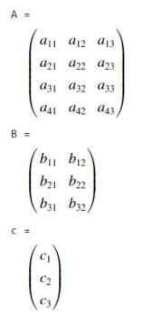

Then, mat1, mat2, mat3, mat4, and vec5 are defined as follow:  
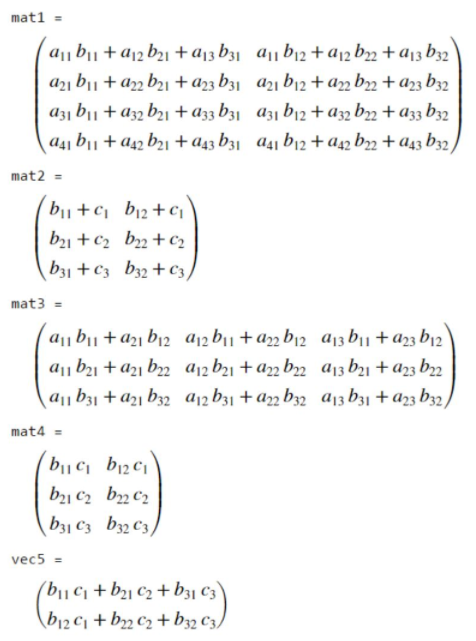

These arrays are computed from A, B, and c through matrix and element-wise operations. Please write a script to compute 'mat1', 'mat2', 'mat3', 'mat4' and 'vec5' using 'A', 'B', and 'c', which are created and their values are randomly generated. 

**Solution**  
Please watch this:[**https://youtu.be/CX8nq9Zia6Y**](https://youtu.be/CX8nq9Zia6Y)

## M02011. (Advanced) Pressure Calculation (★★) 

'press1', 'press2' and 'press3' contain pressure data that are collected from Station 1, 2, and 3, at 1hr intervals, starting at 6:00AM and ending at 11:00PM (all 18  measurements in each location) during ten days.   

Here are the script to generate synthetic values for these variables. 

```matlab
press1 = randi([10 30], 18, 10); % 18 measurements during 10 days at Station 1
press2 = randi([0 20], 18, 10); % 18 measurements during 10 days at Station 2
press3 = randi([10 30], 18, 10); % 18 measurments during 10 days at Station 3

data_press = [press1 press2 press3];
clearvars press1 press2 press3 % delete 'press1', 'press2', 'press3' variables

area_device_const = randi(100); % constant cross-sectional area of pressure measuring devices
area_devices = randi(100, 3, 1); % different cross-sectional area of pressure measuring devices
```

Please solve the following questions using 'data_press', not using 'press1', 'press2', and 'press3'.  
(a) Create a 1 x 10 row vector called 'data_press_8am_st3' which contains the data collected at 8:00 am of all ten day from Station 3 in order.   
(b) Create a 1 x 18 row vector called 'data_press_2nd_st2' which contains the data collected at the whole day of the 2nd day from Station 2 in order.  
(c) Create a 1 x 3 row vector called 'data_press_9am_2nd' which contains the data collected at 9:00 am of the 2nd day from all stations in order.  
(d) Create a 3 x 10 matrix called 'data_press_9am' which contains the data collected at 9:00 am of all ten days from all stations.  For instance, the first row of 'data_press_9am' contains measurements at 9:00 am of all ten day from Station 1.   
(e) Create a 3 x 18 matrix called 'data_press_5th' which contains the data collected at the whole day of the 5th day from all stations.  For instance, the third row of 'data_press_5th' contains measurements at the whole day of the 5th day from Station 3.   
(f) You realized that the data from Station 2 was abnormally low (underestimated) and should be corrected by adding 10. Create 'data_press_new', which is copied from 'data_press'. Then, please add 10 to all measurement data from Station 2 in 'data_press_new'. 

The force acting on the pressure measuring devices can be calculated using the equation , where F is force, P is pressure and A is a cross-sectional area of the pressure measuring device.  
(g) If the cross-sectional areas of the devices at all Stations are constant and given as 'area_device_const'.  Please convert pressure data 'data_press_new' to force data, and assign the resulting matrix to 'data_force_const', respectively.   Note that the size of 'data_force_const' is 18 x 30. 
(h)  If the cross-sectional areas of the devices at stations are different and their areas are given as 'area_devices'.   Please convert pressure data in 'data_press_new' to force data, and assign the resulting matrix to 'data_force_diff'.   
(i) You still do not trust the data from Station 2. Please create 'data_force_new' which is copied from 'data_force_const'.  Then, remove all measurements from Station 2 in 'data_force_new'. Note that the size of 'data_force_new' is 18 x 20.   

Note that you do not need to consider units for pressure data and areas. 

**Solution**  
Please watch this: [**https://youtu.be/CX8nq9Zia6Y?t=1377**](https://youtu.be/CX8nq9Zia6Y?t=1377)

## M02012. Manipulating Matrices and Logical Operations (★★)

```matlab
mat1 = reshape(1:16,4,4); % generate a 4 by 4 matrix by reshaping a 1 x 16 vector
mat2 = reshape(1:28,7,4); % generate a 7 by 4 matrix by reshaping a 1 x 28 vector
mat3 = reshape(1:8,4,2); % generate a 4 by 2 matrix by reshaping a 1 x 8 vector
```
You need to write a script to create:  
(a) 'mat4', which is copied from 'mat2'. The elements from the 4th to 7th rows (a total of four rows) of 'mat4', are replaced by 'mat1'. 'mat4' is a 7 x 4 matrix.   
(b) 'mat5', which is copied from 'mat1'. The first column of 'mat5' is replaced with the second column of 'mat3'. 'mat5' is a 4 x 4 matrix.   
(c) 'mat6'. Concatenate 'mat1' and 'mat3' in a horizontal direction and assign the resulting matrix to 'mat6'. 'mat6' becomes  a 4 x 6 matrix.  
(d) 'char1', which is a character array. 'char1' contains 'AEG 121 is fun!', without the quotation marks. 'char1' becomes a 1 x 15 character vector.   
(e) 'char2', which is copied from 'char1'. Remove a character vector of 'fun!' (without the quotation marks) from 'char2'. 'char2' becomes 'AEG 121 is ', which is a 1 x 11 character vector.   
(f) 'char3', which is copied from 'char2'. Append 'fantastic!' at the end of 'char2'. 'char3' becomes 'AEG 121 is fantastic!', which is a 1 x 21 character vector.   
(g) 'char4', which is copied from 'char3'. Then, flip the character vector of 'char4'. 'char4' becomes '!citsatnaf si 121 GEA'.     

**Solution**  
Please watch this: [**https://youtu.be/nW773qWe6I8?t=7**](https://youtu.be/nW773qWe6I8?t=7)  

## M02013. Creating Mirrored Matrices (★★) 

For this problem create several mirrored vectors named:  
a) 'vec1' with dimensions 1 x 2n in which a 1:n vector is mirrored after the nth number. (e.g., if n is 4, then vec1 = [1,2,3,4,4,3,2,1]).  
b) 'vec2' with dimensions 1 x (2n-1) in which n is the middle element of the vector. (e.g., if n is 5, then vec2 = [1,2,3,4,5,4,3,2,1]).  
c) 'vec3' with dimensions (2n-1) x 1 in which a 1:n (reverse vector) is mirrored at 1 (e.g.,  if n is 4, then vec3 = [4;3;2;1;2;3;4]).  
d) 'vec4' with dimensions 1 x (3n-2) in which n number of n is the middle of the mirrored vector. (e.g., if n is 4 then vec4 = [1 2 3 4 4 4 4 3 2 1] or if n is 5 then vec4 = [1 2 3 4 5 5 5 5 5 4 3 2 1]).  

**Solution**  
Please watch this: [**https://youtu.be/CX8nq9Zia6Y?t=652**](https://youtu.be/CX8nq9Zia6Y?t=652)  

## M02014. Swapping the Columns (★★)

The following variables are created in advance using `randi` and will be used for solving questions.

```matlab
sr = randi([5 20]); % size of the rows
sc = randi([10 20]); % size of the columns

mat1 = randi(100, sr, sc); % generate sr x sc matrix
mat2 = randi(100, sr, sc); % generate sr x sc matrix
mat3 = randi(100, sr, sc); % generate sr x sc matrix

clearvars sr sc % clear the variables regarding the size
```
You need to write a script that creates a variable named:  
(a) 'mat_a' that is copied from 'mat1'. Then, the first and second columns of mat_a are swapped.  
(b) 'mat_b' that is copied from 'mat1'. Then, the first and third columns of mat_b are swapped.  
(c) 'mat_c' that is copied from 'mat1'. Then, the second last and the last columns are swapped.  
(d) 'mat_d' that is copied from 'mat2'. Then, the first column of 'mat_d' is replaced with the second column of 'mat_d',  the second column of 'mat_d' is replaced with the third column of 'mat_d', and the third column of 'mat_d' is replaced with the first column of "mat_d".   
(e) 'mat_e' that is copied from 'mat2'. Then, the fifth column of 'mat_e' is replaced with the sixth column of 'mat_e',  the sixth column of 'mat_e' is replaced with the seventh column of 'mat_e', and the seventh column of 'mat_e' is replaced with the fifth column of 'mat_e'.  
(f) 'mat_f' that is copied from 'mat2'. Then, the second last column of 'mat_f' is replaced with the last column of 'mat_f',  the last column of 'mat_f' is replaced with the first column of 'mat_f', and the first column of 'mat_f' is replaced with the second last column of 'mat_f'.  
(g) 'mat_g' that is copied from 'mat3'. Then, the first and second rows of mat_g are swapped.  
(h) 'mat_h' that is copied from 'mat3'.  Then, the first row of 'mat_h' is replaced with the second row of 'mat_h',  the second row of 'mat_h' is replaced with the third row of 'mat_h', and the third row of 'mat_h' is replaced with the first row of "mat_h".  

**Solution**  
Please watch this: [**https://youtu.be/nW773qWe6I8?t=454**](https://youtu.be/nW773qWe6I8?t=454)  

## M02015. Character Vector Manipulation (★★★)

Refer to the ASCII table when solving this question: https://www.rapidtables.com/code/text/ascii-table.html

The following variables are created in advance using `randi` and will be used for solving questions. 

```matlab
charvec_ran = char(randi([65 122], 1,4)); % a randomly generated character vector
vec1 = randi([65 122],1,4) % a randomly generated vector
```

You need to write a script to create a variable named:  
(a) a  vector 'vec_a', which converts the character vector 'charvec_ran' to its numerical (ASCII) equivalent.  
(b) a  vector 'vec_b', which converts the values of 'vec1' to a character vector.  
(c) a char vector 'vec_c' that is copied from 'vec_b'. The last element is removed.  
(d) 'is_upper1' to test if the fist element of 'vec_c' is an uppercased letter?   
(e) 'is_lower1' to test if the fist element of 'vec_c' is a lowercased letter?   
(f) 'num_upper' to count how many uppercased letters contained in 'vec_c'.  
(g) 'num_lower' to count how many lowercased letters contained in 'vec_c'.  

**Solution**   
Please watch this: [**https://youtu.be/nW773qWe6I8?t=1313**](https://youtu.be/nW773qWe6I8?t=1313)  


## M02016. Array Manipulation I (★★)

This program is to use matrix and element-wise operations. Assume that matrix A, a column vector c, and a row vector r are defined as follows. 

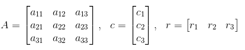

Then, val_a, mat_b, mat_c, mat_d, mat_e, and val_f are defined as follows. 

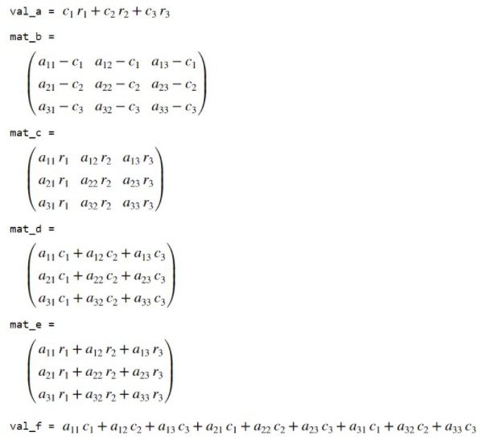

These values should be computed from A, c, and r through matrix and element-wise operations. Individual allocation of the elements is not permitted. Please write a script to compute 'val_a', 'mat_b', 'mat_c', 'mat_d', 'mat_e', and 'val_f' when numeric values for 'A', 'c', and 'r' are given.  For example, when c = [1;2;3] and r = [1 1 0], 'val_a' become 3 (=1x1 + 2x1 + 0).


**Solution**

```matlab
A = randi(100, 3,3);
c = randi(100, 3,1);
r = randi(100, 1,3);

val_a = r*c;
mat_b = A - c*ones(1,3);
mat_c = A .*(ones(3,1)*r);
mat_d = A * c;
mat_e = A * transpose(r);

val_f = mat_d(1) + mat_d(2) + mat_d(3);

```

## M02017. Create Sequences I (★★★) 

```matlab
n = randi([10 100], 1); % n is a randomly generated number ranging from 10 to 100
```
(a) create a row vector named 'vec1', which has the sequence: 9, 16, 25, 36, ..., n^2.  
(b) create a row vector named 'vec2', which is copied from 'vec1'. Then, remove the elements with values of 25 and 64 from 'vec2'. 'vec2' becomes a 1 x (n-4) row vector.   
(c) create a 1 x n row vector named 'vec3', which has the sequence: n*1, (n-1)*2, (n-2)*3, (n-3)*4..., 2*(n-1), 1*n   
(d) create a column vector named 'vec4', which has the same elements of 'vec3' in order. However, starting at the first element, every third element of 'vec4' is removed. (e.g. vec3 = [1 2 3 4 5 6 7], vec4 = [2; 3; 5; 6])  
(e) create a 1xn row vector named 'vec5' with all elements as zero. Please replace the value at the even location with the value of (corresponding index)^2. Then, vec5 becomes 0 4 0 16 0 36... 0 , n^2 if n is even. When n is odd, vec5 becomes 0 4 0 16 .... (n-1)^2, 0.   

Note that this is not a problem using selection statement or loop statement. Please avoid using selection and loop statements. 

**Solution**

```matlab
n = randi([10 100],1); % n is a randomly generated number ranging from 10 to 100
% write your code here

%(a)
vec1 = (3:n).*(3:n);

%(b)
vec2 = vec1;
vec2([3 6]) = [];

%(c)
vec3 = (n:-1:1).*(1:n);

%(d)
vec4 = vec3';
vec4(1:3:end) = [];

%(e)
vec5 = (1:n).*(1:n);
vec5(1:2:n) = 0;
```

## M02018. Create sequences II (★★★)  

```matlab
n = randi([10 100], 1); % n is a randomly generated number ranging from 10 to 100
```
(a) For this problem, combine two row vectors in which their elements multiplied together to create the following sequence:  6, 12, 20, 30, ..., n*(n-1). Use 
'vec1' as your combined vector. For example, 6 = 3 x 2, 12 = 4 x 3, 20 = 5 x 4.   
(b) create a row vector named 'vec2', which is copied from 'vec1'. Then remove the elements with values of 42 and 56 of 'vec2' . 'vec2' becomes a 1 x (n-4) row vector.    
(c) create a row vector named 'vec3', which has the sequence: n^2, (n-1)^2, (n-2)^2, ..., 1.   
(d) create a row vector named 'vec4', which is copied from 'vec3'. However, starting at the first element, remove the every second element of 'vec4'. (e.g. vec3 = [1 2 3 4 5 6 7], vec4 = [2 4 6]).    
(e) create a 1xn row vector named 'vec5' with all elements as zero. Please replace the value at the odd location with the value of (corresponding index)^2. Then, vec5 becomes 1 0 9 0 25 0...., (n-1)^2, 0 if n is even. When n is odd, vec5 becomes 1 0 9 0 25 0...., 0, n^2.   

Note that this is not a problem using selection statement or loop statement. Please avoid using selection and loop statements. 

**Solution**
```matlab
n = randi([10 100], 1); % n is a randomly generated number ranging from 10 to 100

%(a)
vec1 = (3:n).*(2:n-1);

%(b)
vec2 = vec1;
vec2(5:6) = [];

%(c)
vec3 = (n:-1:1).*(n:-1:1);

%(d)
vec4 = vec3;
vec4(1:2:end) = [];

%(e)
vec5 = (1:n).*(1:n);
vec5(2:2:n) = 0;
```
## M02019. Relational and Logical Operator I (★★)  

The following variables are created in advance using `randi` and will be used for solving questions. 

```matlab
vec1 = char(randi([48 122],1,10)); % a 1 x 10 randomly generated character vector
x = randi([1 20]); % returns a random integer drawn from the interval [1, 20]
y = randi([1 20]); % returns a random integer drawn from the interval [1, 20]
z = randi([1 20]); % returns a random integer drawn from the interval [1, 20]
```
(a) Write a code to check if x lies in more than 6 **and** less than 12. If yes, assign logical 1 to 'l_a' and otherwise assign logical 0.   
(b) Write a code to check if y + 3 lies in less than 5 **or** more than 10. If yes, assign logical 1 to 'l_b' and otherwise assign logical 0.    
(c) Write a code to check if x/y is larger than y/z. If yes, assign logical 1 to 'l_c' and otherwise assign logical 0.    

Please use the ASCII table to solve the following problems:   


(d) Create a 1x3 character vector called 'vec_d', which concatenates the every fourth elements of 'vec1' (1st, 5th, 9th values). Write a code to check how many uppercase letters there are in 'vec_d', and assign the result to 'num_d'.   
(e) Write a code to check how many lowercase letters there are in 'vec_d', and assign the result to 'num_e'.   
(f) Write a code to check how many English letters there are in 'vec_d', and assign the result to 'num_f'.   

**Solution**
```matlab
vec1 = char(randi([48 122],1,10)); % a 1 x 10 randomly generated vector
x = randi([1 20]); % returns a random integer drawn from the interval [1, 20]
y = randi([1 20]); % returns a random integer drawn from the interval [1, 20]
z = randi([1 20]); % returns a random integer drawn from the interval [1, 20]

% write your code here

%(a)
l_a = (x>6) && (x<12);

%(b)
l_b = ((y+3)<5) || ((y+3)>10);

%(c)
l_c = (x/y) > (y/z);

%(d)
vec_d = vec1(1:4:end);
is_upper1 = and(vec_d(1) >= 'A',  vec_d(1) <= 'Z');
is_upper2 = and(vec_d(2) >= 'A',  vec_d(2) <= 'Z');
is_upper3 = and(vec_d(3) >= 'A',  vec_d(3) <= 'Z');
num_d = is_upper1 + is_upper2 +is_upper3;

% (d) option 1
% vec_d = vec1(1:4:end);
% is_upper1 = (double(vec_d(1)) >= 65) && (double(vec_d(1)) <= 90);
% is_upper2 = (double(vec_d(2)) >= 65) && (double(vec_d(2)) <= 90);
% is_upper3 = (double(vec_d(3)) >= 65) && (double(vec_d(3)) <= 90);
% num_d = is_upper1 + is_upper2 +is_upper3;

%(e)
is_lower1 = and(vec_d(1) >= 'a',  vec_d(1) <= 'z');
is_lower2 = and(vec_d(2) >= 'a',  vec_d(2) <= 'z');
is_lower3 = and(vec_d(3) >= 'a',  vec_d(3) <= 'z');
num_e = is_lower1 + is_lower2 + is_lower3;

% (e) option1
% is_lower1 = (double(vec_d(1)) >= 97) && (double(vec_d(1)) <= 122);
% is_lower2 = (double(vec_d(2)) >= 97) && (double(vec_d(2)) <= 122);
% is_lower3 = (double(vec_d(3)) >= 97) && (double(vec_d(3)) <= 122);
% num_e = is_lower1 + is_lower2 + is_lower3;

%(f)
num_f = num_d + num_e;

% (f) option 1
% is_en1 = is_upper1 || is_lower1;
% is_en2 = is_upper2 || is_lower2;
% is_en3 = is_upper3 || is_lower3;
% num_f = is_en1 + is_en2 + is_en3;
```

## M02020. Matrix Manipulation I (★)   

The following variables are created in advance using `randi` and will be used for solving questions. 

```matlab
n = randi(100); % a random scalar 
mat1 = randi(100, 10, 10); % a 10 x 10 matrix with random values
```
(a) Create a 1x10 row vector called 'vec_a', which is copied from the fifth row of 'mat1'.  Then, rearrange it so that its elements in its first half are switched with those in the second half. (e.g. the original vector: [1 2 3 4 5 6]; the modified vector: 
[4 5 6 1 2 3])

(b) Create a matrix called 'mat_b', which is copied from 'mat1'. Then, Then, swap the first row with the last row, and swap the first column with the last column. 
(Note that you need to do these steps in order)

(c) Create a 10x4 matrix called 'mat_c',  which concatenates every third columns of 'mat1' (first, fourth, seventh, tenth columns)

(d) Create a matrix called 'mat_d', which is copied from 'mat_c'. Then, replace the every fourth element of 'mat_d'  with a value of 5 (starting from the first element) 
in terms of the linear indexing order.

(e) Create an n x (2n) matrix named 'mat_e'. Then, assign n to all of its elements.

**Solution**
```matlab
n = randi(100); % a random scalar 
mat1 = randi(100, 10, 10); % a 10 x 10 matrix with random values

%(a)
vec_a = mat1(5,:);
vec_a = vec_a([6:end 1:5]);
% vec_a([1:5 6:end]) = vec_a([6:end 1:5]);

%(b)
mat_b = mat1;
mat_b([1 end],:) = mat_b([end 1], :);
mat_b(:,[1 end]) = mat_b(:, [end 1]);

%(c)
mat_c = mat1(:,1:3:end);

%(d)
mat_d = mat_c;
mat_d(1:4:end) = 5;

%(e)
mat_e = ones(n,2*n)*n;
```

## M02021. Pressure Calculation I (★★)    

'press1', 'press2', 'press3', and 'press4' contain pressure data that have been collected over a period of 13 days from Station 1, 2, 3, and 4 at 2 hr 
intervals, starting at 10:00AM and ending at 2:00 am (all 9 measurements per day at each station). Here is the script to generate synthetic values for these variables.

```matlab
press1 = randi([10 30], 9, 13); % data contained at station 1
press2 = randi([0 20], 9, 13); % data contained at station 2
press3 = randi([10 30], 9, 13); % data contained at station 3
press4 = randi([10 60], 9, 13); % data contained at station 4

data_press = [press1 press2 press3 press4]; % joining all staions data in the horizontal direction (a 9 x 52 matrix)
clearvars press1 press2 press3 press4 % delete 'press1', 'press2', 'press3', 'press4' variables

area_devices = randi(100, 4, 1); % different cross-sectional area of pressure measuring devices
```
'press X' is a 9 x 13 matrix including all pressure data from Station X. 9 rows means 9 different times when measurements were taken and 13 columns means 13 different days of data collecting. 

a) Your boss wants you to find all of the pressure gradients from 12 pm to 8 pm during the 7th day of analysis from all stations. Create an 5  x  4 matrix named as 'data_report', where each column represents pressure data recorded from 12 pm to 8 pm on the 7th day of analysis. For example, the first column of 'data_report' is the pressure data at Station 1 measured on the 7th day from 12 pm to 8 pm. 

b) Your boss asks you to calculate the force based on the data analysis from each station at 10 am from days 2 to 10. However, your boss says that Station 4 is 
really old and that the data cannot be trusted, and thus you are asked to **exclude** that data. The force acting on the pressure measuring devices can be calculated using the equation , where F is force, P is pressure and A is a cross-sectional area of the 
pressure measuring device.

The cross-sectional areas of the devices at stations are different and their areas are given as 'area_devices'. Each numbered element in 'area_devices' corresponds to the station number.(eg. The first element of 'area_devices' corresponds to station 1)

Create a 3 x 9 matrix named 'final_data_report' such that the data can be reported in this manner.  Each row corresponds to the time at which Station X has recorded a pressure value, while each column contains the day in which the measurement was taken (from days 2 to 10). For example, the first row of 'final_data_report' is the force data at 10 am for day 2 to day 10 from Station 1 in order. 

**Solution**

```matlab
press1 = randi([10 30], 9, 13); % data contained at station1
press2 = randi([0 20], 9, 13); % data contained at station 2
press3 = randi([10 30], 9, 13); % data contained at station 3
press4 = randi([10 60], 9, 13); % data contained at station 4

data_press = [press1 press2 press3 press4]; % joining all staions data in the horizontal direction (a 9 x 52 matrix)
clearvars press1 press2 press3 press4 % delete 'press1', 'press2', 'press3', 'press4' variables

area_devices = randi(100, 4, 1); % different cross-sectional area of pressure measuring devices

%a)
data_report = data_press(2:6,[7 20 33 46]);

% option 1
% data_report=[data_press(2:6,7),data_press(2:6,20),data_press(2:6,33),data_press(2:6,46)]'

%b)
force_at_st1 = data_press(1,2:10) * area_devices(1);
force_at_st2 = data_press(1,15:23) * area_devices(2);
force_at_st3 = data_press(1,28:36) * area_devices(3);

final_data_report = [force_at_st1; force_at_st2; force_at_st3];
```

## M02022. Matrix Manipulation II (★) 

The following variables are created in advance using `randi` and will be used for solving questions. 

```matlab
n = randi(100); % a random scalar 
mat1 = randi(100, 16, 16); % a 16 x 16 matrix with random values
```
(a) Create a 1x16 row vector called 'vec_a', which is copied from the last row of 'mat1'. Then, re-arrange it so that the elements in its first half are switched with those in the second half. (e.g. the original vector: [1 2 3 4 5 6]; the modified vector: [4 5 6 1 2 3])

(b) Create a matrix called 'mat_b', which is copied from 'mat1'. Then, swap the first row with the second row, and swap the first column with the second column. (Note that you need to do these steps in order)

(c) Create a 16x4 matrix called 'mat_c', which concatenates every fourth columns of 'mat1' (the first, fifth, ninth, thirteenth columns).

(d) Create a matrix called 'mat_d', which is copied from 'mat_c'. Then, replace the every third element of 'mat_d'  with n (starting from the first element) in terms of the linear indexing.

(e) Create an n x (3n) matrix named 'mat_e'. Then, assign 3n to all of its elements.

**Solution**

```matlab
n = randi(100); % a random scalar 
mat1 = randi(100, 16, 16); % a 16 x 16 matrix with random values

%(a)
vec_a = mat1(end,:);
vec_a = vec_a([9:end 1:8]);
% vec_a([1:5 6:end]) = vec_a([6:end 1:5]);

%(b)
mat_b = mat1;
mat_b([1 2],:) = mat_b([2 1], :);
mat_b(:,[1 2]) = mat_b(:, [2 1]);

%(c)
mat_c = mat1(:,1:4:end);

%(d)
mat_d = mat_c;
mat_d(1:3:end) = n;

%(e)
mat_e = ones(n,3*n)*3*n;
```

## M02023. Array Manipulation II (★★) 

This program is to use matrix and element-wise operations. Assume that a row vector A, matrix B, matrix C, and a column vector R are defined as follows.


val_a, mat_a, mat_b, vec_a, mat_c, and val_b are defined as the following. 


These values should be computed from A, B, C, and R through matrix and element-wise operations. Individual allocation of the elements is not permitted. Please write a script to compute 'val_a', 'mat_a', 'mat_b', 'vec_a', 'mat_c', and 'val_b' when values for 'A', 'B', 'C', and 'R' are given. For example, when A = [1 2 3], 'val_a' become 14. (= 1x1 + 2x2 + 3x3).

**Solution**

```matlab
A=randi([1,100],1,3);
B=randi([1,100],4,3);
C=randi([1,100],3,4);
R=randi([1,100],2,1);

val_a = A*transpose(A);

mat_a = [C(:,1:2)*R(1) C(:,3:4)*R(2)];

mat_b = B.*[A;A;A;A];

vec_a = B*transpose(A);

tA = transpose(A);
mat_c = [C(:,1)-tA C(:,2)-tA C(:,3)-tA C(:,4)-tA];

val_b = vec_a(1) + vec_a(2) + vec_a(3) + vec_a(4);

```

## M02024. Relational and Logical Operator II (★★)

The following variables are created in advance using 'randi' and will be used for solving questions. 

```matlab
vec1 = char(randi([48 126],1,15)); % a 1 x 15 randomly generated character vector
x = randi([5 30]); % returns a random integer drawn from the interval [5, 30]
y = randi([5 30]); % returns a random integer drawn from the interval [5, 30]
z = randi([5 30]); % returns a random integer drawn from the interval [5, 30]
```
(a) Write a code to check if x lies in more than 20 **and** less than 25. If yes, assign a logical 1 to 'l_a' and otherwise assign a logical 0.   
(b) Write a code to check if the closest integer of y/3 lies in less than 5 **or** more than 10. If yes, assign a logical 1 to 'l_b' and otherwise assign a logical 0.   
(c) Write a code to check if x/y is smaller and equal to y/z. If yes, assign a logical 1 to 'l_c' and otherwise assign a logical 0.   

Please use the ASCII table to solve the following problems:  
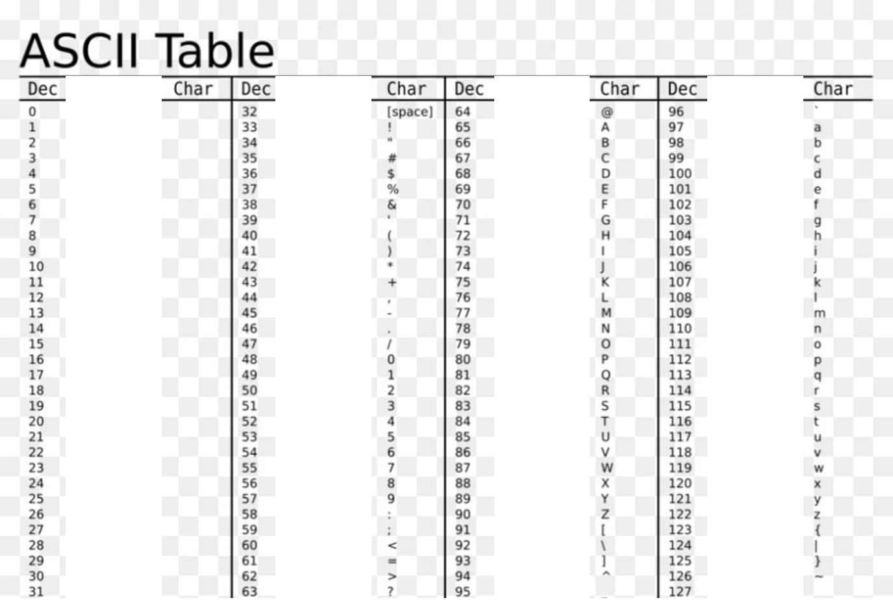

(d) Create a 1x3 character vector called 'vec_d', which concatenates every fifth element of 'vec1' (1st, 6th, and 11th values).   Write a code to check how many number characters ('0', '1', ..., '9') there are in 'vec_d', and assign the result to 'num_d'.    
(e) Write a code to check how many uppercase letters there are in 'vec_d', and assign the result to 'num_e'.  
(f)  Write a code to check how many lowercase letters there are in 'vec_d', and assign the result to 'num_f'.   
(g) Write a code to check how many English letters there are in 'vec_d', and assign the result to 'num_g'.  

**Solution**
```matlab
vec1 = char(randi([48 126],1,15)); % a 1 x 15 randomly generated character vector
x = randi([5 30]); % returns a random integer drawn from the interval [5, 30]
y = randi([5 30]); % returns a random integer drawn from the interval [5, 30]
z = randi([5 30]); % returns a random integer drawn from the interval [5, 30]

% write your code here

%(a)
l_a = (x>20) && (x<25);

%(b)
l_b = (round(y/3)<5) || (round(y/3)>10);

%(c)
l_c = (x/y) <= (y/z);

%(d)
vec_d = vec1(1:5:end);
is_num1 = and(vec_d(1) >= '0',  vec_d(1) <= '9');
is_num2 = and(vec_d(2) >= '0',  vec_d(2) <= '9');
is_num3 = and(vec_d(3) >= '0',  vec_d(3) <= '9');
num_d = is_num1 + is_num2 +is_num3;

%(e)
is_upper1 = and(vec_d(1) >= 'A',  vec_d(1) <= 'Z');
is_upper2 = and(vec_d(2) >= 'A',  vec_d(2) <= 'Z');
is_upper3 = and(vec_d(3) >= 'A',  vec_d(3) <= 'Z');
num_e = is_upper1 + is_upper2 +is_upper3;

%(f)
is_lower1 = and(vec_d(1) >= 'a',  vec_d(1) <= 'z');
is_lower2 = and(vec_d(2) >= 'a',  vec_d(2) <= 'z');
is_lower3 = and(vec_d(3) >= 'a',  vec_d(3) <= 'z');
num_f = is_lower1 + is_lower2 + is_lower3;

%(g)
num_g = num_e + num_f;
```

## M02025. Pressure Calculation II (★)

'press1', 'press2', 'press3', 'press4', and 'press5' contain pressure data that are collected over a period of 12 days from Station 1, 2, 3, 4, and 5 at 30 min intervals, starting at 10:00AM and ending at 4 pm (a total of 13 time stamps). Here is the script to generate synthetic values for these variables. 

```matlab
press1 = randi([10 30], 13, 12); % data contained at station 1
press2 = randi([0 20], 13, 12); % data contained at station 2
press3 = randi([10 30], 13, 12); % data contained at station 3
press4 = randi([10 60], 13, 12); % data contained at station 4
press5 = randi([0 25], 13, 12); % data contained at station 5

data_press = [press1 press2 press3 press4 press5]; % joining all staions data in the horizontal direction
clearvars press1 press2 press3 press4  press5 % delete 'press1', 'press2', 'press3', 'press4', 'press5' variables

area_devices = randi(100, 5, 1); % different cross-sectional area of pressure measuring devices
```
'press X' is a 13 x 12 matrix including all pressure data from Station X. 13 rows means 13 different times when measurements were taken and 12 columns means 12 different days of data collecting. 

a) Your boss wants you to find all of the pressure gradients from 11 am to 3 pm during the 10th day of analysis from all stations. Create an 9 x 5 matrix named as 'data_report', where each row represents pressure data recorded at a certain time interval from all stations. For example, the first column of 'data_report' is the pressure data at Station 1 measured at 10th day from 11 am to 3 pm. 

b) Your boss asks you to calculate the force based on the data analysis from each station at 10 am from days 3 to 12. However, your boss says that Station 4 is really old and that the data cannot be trusted, and thus you are asked to exclude that data.  

The force acting on the pressure measuring devices can be calculated using the equation , where F is force, P is pressure and A is a cross-sectional area of the pressure measuring device. The cross-sectional areas of the devices at stations are different and their areas are given as 'area_devices'. Each numbered element in 'area_devices' corresponds to the station number. (e.g. the first element of 'area_devices' corresponds to station 1)

Create a 4 x 10 matrix named 'final_data_report' such that the data can be reported in this manner. Each row corresponds to the time at which Station X has recorded a pressure value, while each column contains the day in which the measurement was taken. For example, the first row of 'final_data_report' is the force data at 10 am for day 3 to day 12 from Station 1 in order. 

**Solution**

```matlab
press1 = randi([10 30], 13, 12); % data contained at station 1
press2 = randi([0 20], 13, 12); % data contained at station 2
press3 = randi([10 30], 13, 12); % data contained at station 3
press4 = randi([10 60], 13, 12); % data contained at station 4
press5 = randi([0 25], 13, 12); % data contained at station 5

data_press = [press1 press2 press3 press4 press5]; % joining all staions data in the horizontal direction
clearvars press1 press2 press3 press4  press5 % delete 'press1', 'press2', 'press3', 'press4', 'press5' variables

area_devices = randi(100, 5, 1); % different cross-sectional area of pressure measuring devices

%a)
data_report = data_press(3:11,[10 22 34 46 58]);

% option 1
% data_report=[data_press(3:11,10),data_press(3:11,22),data_press(3:11,34),data_press(3:11,46) data_press(3:11,58)]'

%b)
force_at_st1 = data_press(1,3:12) * area_devices(1);
force_at_st2 = data_press(1,15:24) * area_devices(2);
force_at_st3 = data_press(1,27:36) * area_devices(3);
force_at_st5 = data_press(1,51:60) * area_devices(5);

final_data_report = [force_at_st1; force_at_st2; force_at_st3; force_at_st5];
```

## M02026. Creating Sequences (★★★)

```matlab
n = randi([10 30], 1); % n is a randomly generated number ranging from 10 to 30
```
(a) Create a row vector named vec1 which has the sequence: 8, 20, 36, 56,..., (n * ((n-3) * 2)). For example, 8=4x2, 20=5x4, 36=6x6, 56=7x8, 80=8x10, 108=9x12 
(b) Create a row vector named vec2 which is copied from vec1. Remove the elements with values 8, 56 and 108 
(c) Create a row vector named vec3 which has the sequence: (n^2) * 1, ((n-1)^2) * 2, ((n-2)^2) * 3,..., (1^2) * n. For example, when n is 10, 100=100 * 1, 162=81 * 2, 192=64 * 3, 196=49 * 4, ... 10=1 * 10
(d) Create a column vector named vec4 which has the same elements as vec3 in order. However, starting from the second element, every fourth element of vec4 is replaced with 0 (eg. vec3=[1 2 3 4 5 6 7 8 9 10], vec4=[1;0;3;4;5;0;7;8;9;0])
(e) Create a 1xn row vector named vec5 which has the sequence: 1, 2^3, 3^3, 4^3, ... n^3. Then, the value at even locations is replaced by 5.

**Solution**  
Please watch this: [https://youtu.be/tbroazX_i0o?list=PLa1nAPP8qUX9qwRR6Sj_dboIriPIGYgsm&t=4](https://youtu.be/tbroazX_i0o?list=PLa1nAPP8qUX9qwRR6Sj_dboIriPIGYgsm&t=4)

## M02027. Array or Matrix Manipulation (★★★)

```matlab
n = randi(100); % a random scalar 
mat_1 = randi(100, 15, 15); % a 15 x 15 matrix with random values
```
(a) Create a matrix called 'mat_a' which is made of only the even rows of 'mat_1' (7 x 15 matrix). 
(b) Create a matrix named mat_b which is a copy of mat_a. Then, re-arrange the elements in the LAST ROW ONLY of 'mat_b': the first 5 elements should be swapped with the last 5 elements. **NOTE**: the middle 5 elements in the last row of 'mat_a' remain in their original positions. For example, if the last row of the mat_b is [1 2 3 4 5 6 7 8 9 10 5 4 3 2 1], it becomes [5 4 3 2 1 6 7 8 9 10 1 2 3 4 5].
(c) Create a matrix 'mat_c' which is a copy of 'mat_a'. Edit 'mat_c' so that all values in the ODD positions (according to linear indexing) are equal to '0' except for the first column. **NOTE: odd positions in the first column of mat_b SHOULD NOT be '0'.**
(d) Create a (2n) x n sized matrix 'mat_d' in which every element is n. 
(e) Create a vector 'vec_b' that has the same elements as the first row of 'mat_1'. Every element in the even position of 'vec_b' is removed. 

**Solution**  
Please watch this: [https://youtu.be/tbroazX_i0o?list=PLa1nAPP8qUX9qwRR6Sj_dboIriPIGYgsm&t=870](https://youtu.be/tbroazX_i0o?list=PLa1nAPP8qUX9qwRR6Sj_dboIriPIGYgsm&t=870)

## M02028. Modifying arrays using a linear indexing and 3D matrix (★★)

```matlab
mat1 = randi(100,4,6); % a 4x6 matrix with randomly generated values 
```
Write a script that creates the variables named:
a) 'val_a', which is the second last element of 'mat1' in terms of a linear indexing order 
b) 'vec_b', which is a 1 x 8 row vector containing every third element of 'mat1' in a reverse linear indexing order (starting from the last element). 
For example, [1 1 1 1; 2 2 2 2] becomes  [2 1 2].
c) 'vec_c', which is a 1 x 24 row vector containing only the odd numbers from 1 to 47 (e.g., [1 3 5 ... 43 45 47])
d) 'mat_d', which is a 4 x 6 matrix reshaped from 'vec_c' (in a linear index order)
e) 'mat_e' which is a 4 x 6 x 2 3D matrix concatenating 'mat1' and 'mat_d' in the depth direction 
f) 'val_f', which is the element located in the second row, fourth column,and second layer of 'mat_e'
g) 'vec_g', which is a 11 x 1 column vector containing all the elements from the third to thirteenth element on the first layer of 'mat_e' according to linear indexing 

**Solution**  
Please watch this: [https://youtu.be/tbroazX_i0o?list=PLa1nAPP8qUX9qwRR6Sj_dboIriPIGYgsm&t=1852](https://youtu.be/tbroazX_i0o?list=PLa1nAPP8qUX9qwRR6Sj_dboIriPIGYgsm&t=1852)

## M02029. Character Type Casting (★★★)

Please refer to the ASCII table when solving this question: https://www.cs.cmu.edu/~pattis/15-1XX/common/handouts/ascii.html
The following variables are created in advance using 'randi' and will be used for solving questions. 

```matlab
charvec_1 = char(randi([32 122], 7,1)); % a randomly generated character vector from ASCII 32 to 122 (7 x 1)
vec = randi([65 122],1,5); % a randomly generated vector
```
(a) Create a 1 x 13 character vector 'vec_1' which contains uppercase letter from 'Z' to 'A', starting at 'Z', with every other letter missing. For example: 'ZXVT...B'
(b) Create a vector named 'vec_2', which converts the values of vector 'vec' to a character vector (type casting).
(c) Check if the THIRD element of 'vec_2' is NOT a lowercase alphabet letter. 
Store the answer in variable 'is_not_lower'. Assign true if it is not a lowercase letter, if not, assign false.
(d) Convert character vector 'charvec_1' to its numerical (ASCII) equivalent and store in vector named 'vec_3' and remove the last element of 'vec_3'.
(e) Check if the FIRST element of 'charvec_1' is an English letter (alphabet). 
Store in variable 'is_letter'. Assign true if it is a letter, if not, assign false.
NOTE: charvec_1 is a randomly generated character vector from ASCII 32 to 122. The range contains multiple non-alphabet characters.

**Solution**  
Please watch this: [https://youtu.be/8VPil7I_D44?list=PLa1nAPP8qUX9qwRR6Sj_dboIriPIGYgsm&t=4](https://youtu.be/8VPil7I_D44?list=PLa1nAPP8qUX9qwRR6Sj_dboIriPIGYgsm&t=4)

## M02030. Is a 2D Point Inside a Box? (★★)


You are going to write a code to check if a 2D point is inside the box (in yellow). 
The x and y coordinate of each point is stored as a 1 x 2 row vector and is randomly generated from the interval [0 10] in x and y directions.  
The x and y coordinates of Point 1 and Point 2 are stored in the variables named 'pt1' and 'pt2', respectively. 
```matlab
pt1 = (rand(1,2)-0.5) * 10 + 5;  % a 1 x 2 row vector generated on the interval [0 10]
pt2 = (rand(1,2)-0.5) * 10 + 5;  % a 1 x 2 row vector generated on the interval [0 10]
```
(a) Check if Point 1 is inside the box (in yellow). If yes, true is assigned to a variable named 'is_pt1_inside'. Otherwise, false is assigned to the variable. 
(b) Check if Point 2 is inside the box (in yellow). If yes, true is assigned to a variable named 'is_pt2_inside'. Otherwise, false is assigned to the variable. 
(c) If at least one point is inside the box (in yellow), true is assigned to a variable named 'is_pt_inside'. Otherwise, false is assigned to the variable. 
**Note that the point on the boarder (the boundary of the box) is not considered as "inside".**

**Solution**  
Please watch this: [https://youtu.be/8VPil7I_D44?list=PLa1nAPP8qUX9qwRR6Sj_dboIriPIGYgsm&t=1036](https://youtu.be/8VPil7I_D44?list=PLa1nAPP8qUX9qwRR6Sj_dboIriPIGYgsm&t=1036)

## M02031. Pressure Calculation (★★)

'press1', 'press2', and 'press3' contain pressure data that are collected over a period of 13 days from Station 1, 2, and 3 at 1 hour intervals  starting at 01:00 pm and ending at 08:00 pm (a total of 8 time stamps). 
Here is the script to generate synthetic values for these variables. 
```matlab
press1 = randi([10 30], 8, 13); % data contained at station 1
press2 = randi([0 20], 8, 13);  % data contained at station 2
press3 = randi([10 30], 8, 13); % data contained at station 3

data_press = [press1 press2 press3]; % joining all staions data in the horizontal direction
clearvars press1 press2 press3 % delete 'press1', 'press2', 'press3' variables
```
'press X' is a 8 x 13 matrix including all pressure data from Station X. 8 rows means 8 different times when measurements were taken and 13 columns means 13 different days of data collecting. You need to solve the following questions using 'data_press'. 'data_press' joins all stations data in the horizontal direction.
(a) Your boss wants you to find all of the pressure data from 5 pm to 7 pm during the 4th to 6th days from all stations. Create an 3 x 9 matrix named as 'data_report_a', where each row represents pressure data recorded at a certain time from all stations.  For example, the second column of 'data_report_a' is the pressure data at Station 1 measured at 5 th day from 5 pm to 7 pm. 
(b)Your boss wants you to find all of the pressure data for all times (1pm to 8pm) during the 10th day from all stations. Create an 8 x 3 matrix named as 'data_report_b', where each column represents corresponding pressure data recorded at each station. For example, the first column of 'data_report_b' is the pressure data at Station1 measured from 1pm to 8pm on the 10th day.  
(c)You realize that the data from Station 2 is all wrong and that the data from Stations 1 and 3 are low. Create a matrix named 'data_press_new', which is copied from 'data_press'. Then, all of Station 2 data is removed and 5 is added to all Station 1 and Station 3 data. Note that the size of 'data_press_new' becomes 8 x 26. 

**Solution**  
Please watch this: [https://youtu.be/8VPil7I_D44?list=PLa1nAPP8qUX9qwRR6Sj_dboIriPIGYgsm&t=1884](https://youtu.be/8VPil7I_D44?list=PLa1nAPP8qUX9qwRR6Sj_dboIriPIGYgsm&t=1884)

## M02032. Matrix Pattern Generation (★★★)

You and your friend are playing a game of battleship, and are both coming up with strategies on where to place your ships on the game board. The game board is an X by X matrix where X is a randomly generated value between 4 and 10. 
```matlab
X = randi([4 10]); % randomly generated value from 4 to 10 
```
a) You decide that you will place your ships in any element of the matrix except for the outside border, excluding the four corners (you can place your ships in the corners). Write a script to generate an X by X matrix, called 'mat_your', showing the locations you can place your ships. Locations you can place your ships should contain a '1' and locations where you cannot place your ships should contain a '0'. 
b) Your friend decides that they will only place their ships along the outside border of the matrix (none of their ships will be placed in the middle of the matrix). Write a script to generate an X by X matrix, called 'mat_friend', showing the locations your friend can place their ships. Locations your friend can place their ships should contain a '1' and locations where they cannot place their ships should contain a '0'. 
In sum, you need to write a script to create 'mat_your' and 'mat_friend' using X. 
For example, when X is 5, you need to create these two matrices

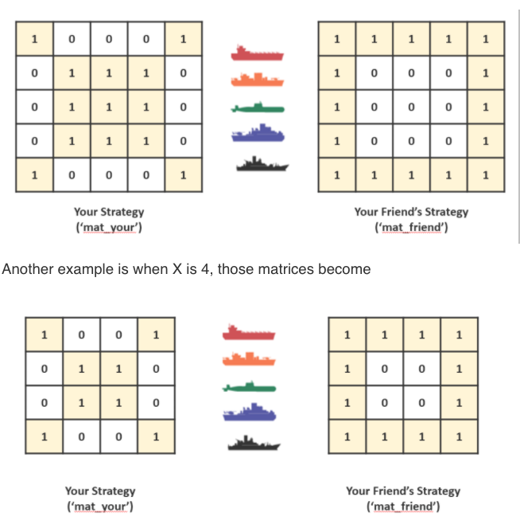

**Solution**  
Please watch this: [https://youtu.be/GjYnrI3PDV4?list=PLa1nAPP8qUX9qwRR6Sj_dboIriPIGYgsm&t=6](https://youtu.be/GjYnrI3PDV4?list=PLa1nAPP8qUX9qwRR6Sj_dboIriPIGYgsm&t=6)

## M02033. Array Manipulation (★★★) 

This program requires you to use matrix and element-wise operations. 
Assume that matrix A, matrix B, column vector c, and row vector r are defined as follows.

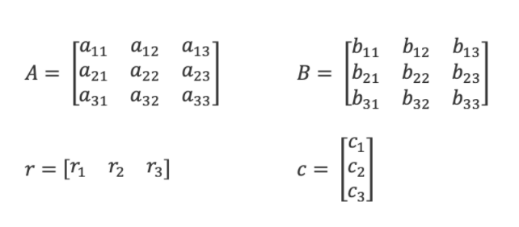

Then, mat_1, mat_2, mat_3, mat_4, and mat_5 are defined as follows. 

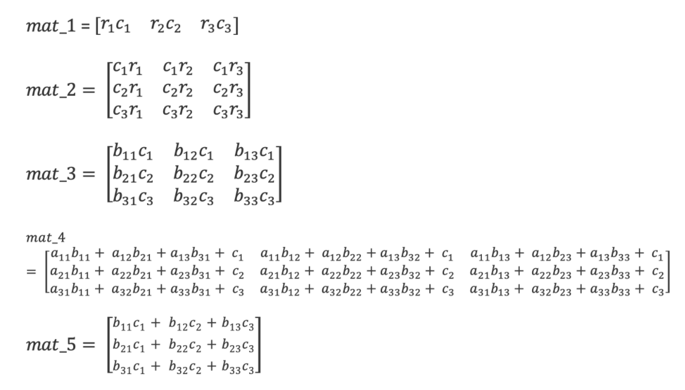

**These values should be computed from A, B, c, and r through matrix and element-wise operations.** 
Individual allocation of the elements is not permitted and also, you must not use any built-in functions in MATLAB to solve this problem. 
**Please write a script to compute mat_1, mat_2, mat_3, mat_4, and mat_5** when numeric values for matrix A, matrix B, vector c, and vector r  are given (randomly generated). 

```matlab
A = randi(100, 3,3); % matrix A (3 x 3)
B = randi(100, 3,3); % matrix B (3 x 3)
r = randi(100, 1,3); % row vector r
c = randi(100, 3,1); % column vector c
```

**Solution**  
Please watch this: [https://youtu.be/GjYnrI3PDV4?list=PLa1nAPP8qUX9qwRR6Sj_dboIriPIGYgsm&t=956](https://youtu.be/GjYnrI3PDV4?list=PLa1nAPP8qUX9qwRR6Sj_dboIriPIGYgsm&t=956)

## M02034. Is a 2D point inside the region? (★★) 

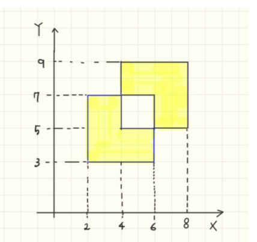

You are going to write a code to check if a 2D point is inside the region (in yellow). The x and y coordinate of a point is stored as a 1 x 2 row vector, named as 'pt'. The x and y coordiate of the point is randomly generated from the interval (0 10) in x and y directions. 

```matlab
pt = (rand(1,2)-0.5) * 10 + 5; % a 1 x 2 row vector generated on the interval (0 10)
```
(a) Check if 'pt' is inside the region (in yellow). If yes, true (a logical 1) is assigned to a variable named 'is_pt_inside'. Otherwise, false (a logical 0) is assigned to the variable. 
(b) Check if 'pt' is outside the region (in yellow). If yes, true (a logical 1) is assigned to a variable named 'is_pt_outside'. Otherwise, false (a logical 0) is assigned to the variable. 

**Note that the point on the border (the boundary of the box) is NOT considered as "inside".**

**Solution**  
Please watch this: [https://youtu.be/GjYnrI3PDV4?list=PLa1nAPP8qUX9qwRR6Sj_dboIriPIGYgsm&t=1778](https://youtu.be/GjYnrI3PDV4?list=PLa1nAPP8qUX9qwRR6Sj_dboIriPIGYgsm&t=1778)

## M02035. Array Manipulation (★) 

A matrix named 'mat_a' is a 5 x 5 matrix containing randomly generated values between 1 and 100. 

```matlab
mat_a = randi(100, 5, 5); % matrix mat_a (5 x 5) 
```
(a) Check if the element in the third row, fourth column of 'mat_a' lies between 32 and 67 (exclusive). If yes, assign true (or logical(1)) to variable 'val_a'. If not, assign false (or logical(0)).
(b) 'mat_b' is copied from 'mat_a'. Then, add 5 to each element of 'mat_b'. 
(c) Check to see if the first element in the matrix 'mat_a' is equal to the last element in the matrix 'mat_a'. If yes, assign true (or logical(1)) to variable 'val_c'. If not, assign false (or logical(0)).
(d) 'mat_d' is copied from 'mat_b'. Then, remove the last column of 'mat_d'. 'mat_d' becomes a 5 x 4 matrix. 
(e) 'mat_e' is copied from 'mat_a'. Then, assign a value of 0 to the elements from position 5 to 10 (according to linear indexing) in 'mat_e' (including position 5 and position 10). 

**Solution**  
Please watch this: [https://youtu.be/GjYnrI3PDV4?list=PLa1nAPP8qUX9qwRR6Sj_dboIriPIGYgsm&t=3038](https://youtu.be/GjYnrI3PDV4?list=PLa1nAPP8qUX9qwRR6Sj_dboIriPIGYgsm&t=3038)

## M02036. Alphabet Number Game (★★★) 

Kasturi and Bianca create an alphabet number game. A goal is to score a 1 x 3 lowercase alphabet sequence. A player with a higher score wins this game. The score of 'a' is 0 and the score of each following letter gradually increases by 2. For example, 'b' becomes 2, 'c' becomes 4 and 'z' becomes 50. The final score is found by summing the scores of all three letters in a given sequence.
 
```matlab
alph_seq = 'abcdefghijklmnopqrstuvwxyz';
p1_seq = alph_seq(randi(26, 1, 3)); % 1x3 character vector 
p2_seq = alph_seq(randi(26, 1, 3)); % 1x3 character vector 

clearvars alph_seq
```
Alphabet sequences for Player 1 and Player 2 are given as 'p1_seq' and 'p2_seq', respectively. Please solve the following problems: 
(a) Compute a final score of Player 1 and assign its score to a variable named 'p1_score'
(b) Compute a final score of Player 2 and assign its score to a variable named 'p2_score'
(c) Who wins this game? If Player 1 wins this game, assign true (or logical(1)) to a variable named 'is_p1_win'. Otherwise, assign false (or logical(0)) to the variable. 

Note that if the final score is tied, Player 1 wins. 

**Solution**  
Please watch this: [https://youtu.be/GjYnrI3PDV4?list=PLa1nAPP8qUX9qwRR6Sj_dboIriPIGYgsm&t=3291](https://youtu.be/GjYnrI3PDV4?list=PLa1nAPP8qUX9qwRR6Sj_dboIriPIGYgsm&t=3291)

## M02037. Pressure Calculation (★★)

'press1', 'press2', 'press3', and 'press4' contain pressure data that are collected over a period of 13 days from Station 1, 2, 3, and 4 at 1 hour intervals starting at 01:00 pm and ending at 08:00 pm (a total of 8 time stamps). 
Here is the script to generate synthetic values for these variables. 

```matlab
press1 = randi([10 30], 8, 13); % data contained at station 1
press2 = randi([0 20], 8, 13);  % data contained at station 2
press3 = randi([10 30], 8, 13); % data contained at station 3
press4 = randi([10 60], 8, 13); % data contained at station 4

data_press = [press1; press2; press3; press4]; % joining all staions data in the vertical direction
clearvars press1 press2 press3 press4 % delete 'press1', 'press2', 'press3', 'press4' variables
```

'press X' is an 8 x 13 matrix including all pressure data from Station X. 8 rows mean 8 different times when measurements were taken and 13 columns represent 13 different days of data collecting. You need to solve the following questions using 'data_press'. 'data_press' is a 32 x 13 matrix that joins data from all stations in the vertical direction.
a) Your boss wants you to find all of the pressure data from 3 pm to 7 pm during the 5th day from all stations. Create a 5 x 4 matrix named as 'data_report_a', where each row represents pressure data recorded at a certain time from all stations. Each column contains data from one station only. For example, the second column of 'data_report_a' is the pressure data at Station 2 measured at the 5th day from 3 pm to 7 pm. 

b) Your boss wants you to find all of the pressure data from 2 pm during the 5th ~ 7th day from all stations. Create a 4 x 3 matrix named as 'data_report_b', where each row represents corresponding pressure data recorded at each station. For example, the first row of 'data_report_b' is the pressure data at Station1 measured at 5th~7th day at 2 pm. The second column of 'data_report_b' is the pressure data at all stations mesured at 6th day at 2 pm. 

c) You realized that all measurements taken during the 5th day from all stations are wrong. The pressure values can be corrected by adding 10. Create 'data_press_correct' which is copied from 'data_press'. Then, please correct the wrong measurements and assign those values to 'data_press_correct'. Note that the size of 'data_press_correct' should be the same as 'data_press'.

**Solution**  
Please watch this: [https://youtu.be/GjYnrI3PDV4?list=PLa1nAPP8qUX9qwRR6Sj_dboIriPIGYgsm&t=3871](https://youtu.be/GjYnrI3PDV4?list=PLa1nAPP8qUX9qwRR6Sj_dboIriPIGYgsm&t=3871)

## M02038. Array Manipulation (★)

In this question, you will do some basic array manipulation. The following variables have been created for you to use in solving this question:
rvec1 = randi([10 100],1,10);
mat1 = randi([10 100],10,10);
Create a script that makes the following variables:
(a) 'lg_a' which checks if the sixth element of 'rvec1' is between 34 and 67 (exclusive). If yes, assign logical(1) to 'lg_a', otherwise assign logical(0).
(b) 'vec_b' which is copied from 'rvec1'. Then the second element of 'vec_b' is swapped with the last element of 'vec_b'
(c) 'mat_c' which is copied from 'mat1'. Then the third and fifth rows are deleted from 'mat_c'. 'mat_c' becomes a 8 x 10 matrix
(d) 'mat_d' which concatenates every even column from 'mat1' in a horizontal direction (The second, fourth, sixth, eighth, and tenth columns). This should result in a 10 x 5 matrix.  

**Solution**
```matlab
rvec1 = randi([10 100],1,10);
mat1 = randi([10 100],10,10);

% Write your code here

% (a)
vala = rvec1(6);
lg_a = (vala > 34) && (vala < 67);

% (b) 
vec_b = rvec1;
vec_b([2 end]) = vec_b([end 2]);

% option 1
% tmp = vec_b(2);
% vec_b(2) = vec_b(end);
% vec_b(end) = tmp;

% (c)
mat_c = mat1;
mat_c([3 5],:) = [];

% option 1
% mat_c = mat1;
% mat_c(3,:)= [];
% mat_c(4,:) = [];

% (d)
mat_d = mat1(:,2:2:10);

% option 1
% mat_d = [mat1(:,2) mat1(:,4) mat1(:,6) mat1(:,8) mat1(:,10)]
```

## M02039. Is a Point Inside a Yellow Box (★★)

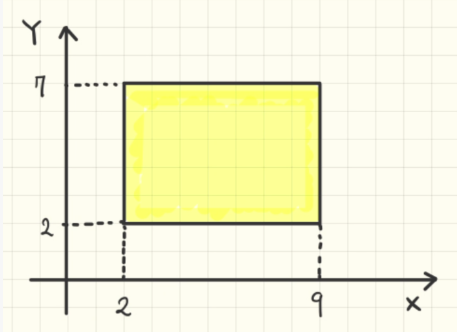

You are going to write a code to check if a 2D point is inside the box (in yellow). 
The x and y coordinate of each point is stored as a 1 x 2 row vector and is randomly generated from the interval [0 10] in x and y directions.  
The x and y coordinates of Point 1 and Point 2 are stored in the variables named 'pt1' and 'pt2', respectively. 
pt1 = (rand(1,2)-0.5)*10 + 5;  % a 1 x 2 row vector generated on the interval [0 10]
pt2 = (rand(1,2)-0.5)*10 + 5;  % a 1 x 2 row vector generated on the interval [0 10]
(a) Check if Point 1 is outside the box (in yellow). If yes, true is assigned to a variable named 'is_pt1_outside'. Otherwise, false is assigned to the variable. 
(b) Check if Point 2 is inside the box (in yellow). If yes, true is assigned to a variable named 'is_pt2_inside'. Otherwise, false is assigned to the variable. 
(c) If both points are inside the box (in yellow), true is assigned to a variable named 'is_pt_inside'. Otherwise, false is assigned to the variable. 
Note that the point on the boarder (the bounary of the box) is NOT considered as "inside". 

**Solution**
```matlab
pt1 = (rand(1,2)-0.5)*10 + 5;  % a 1 x 2 row vector generated on the interval [0 10]
pt2 = (rand(1,2)-0.5)*10 + 5;  % a 1 x 2 row vector generated on the interval [0 10]

bbox = [2 9 2 7]; % [x1 x2 y1 y2]

% (a)
is_pt1_inside = (pt1(1)>bbox(1) && pt1(1)<bbox(2)) && (pt1(2)>bbox(3) && pt1(2)<bbox(4));
is_pt1_outside = ~is_pt1_inside;

% (b)
is_pt2_inside = (pt2(1)>bbox(1) && pt2(1)<bbox(2)) && (pt2(2)>bbox(3) && pt2(2)<bbox(4));

% (c)
is_pt_inside = and(is_pt1_inside, is_pt2_inside);
```

## M02040. Recording Workouts (★)

Paola is a dedicated crossfitter and runner. She has been recording her deadlift (DL), bench press (BP) and overhead press (OP) weights as well as the distance she ran (RN) for her past ten workouts. This means each value from Day 1 to Day 10 is recorded in order. She has recorded these values in row vectors, shown below. 
vec_DL = randi([200 250],1,10); % a 1x10 row vector: How many pounds paola daedlifted each workout
vec_BP = randi([150 200],1,10); % a 1x10 row vector: How many pounds paola bench pressed each workout
vec_OP = randi([100 150],1,10); % a 1x10 row vector: How many pounds paola overhead pressed each workout
vec_RN = randi([5 10],1,10); % a 1x10 row vector: How many kilometers Paola ran each workout

all_WO = [vec_DL vec_BP vec_OP vec_RN]; % 1 x 40 row vector including all four workout records
clearvars vec_DL vec_BP vec_OP vec_RN
Paola has concetenated these fours workout records in a horizontal direction, stored it in 'all_WO' and deleted all four records (which means you cannot access individual vectors).

(a) Create a variable 'new_WO' that includes workout records in each column. 'new_WO' is the same as if all four records are concatenated in a horizontal direction after transforming each row record to a column vector. The size of 'new_WO' becomes 10 x 4. Note that since vec_DL, vec_BP, vec_OP and vec_RN have been deleted, you can't use them. You can only access 'all_WO'. 

(b) Paola wants to know if she ran a farther distance on her last day of recording running distances than on her first. If she did, assign logical(1) to 'lg_b', if not assign logical(0). 

(c) Paola realizes that there is a problem with the bench press machine and it records 10 pounds less than the correct reading. (e.g. if a current reading is 50 pounds, the actual reading is 60 pounds). 'fixed_WO' is copied from 'new_WO'. Then, please fix the bench press readings in 'fixed_WO'.

**Solution**
```matlab
vec_DL = randi([200 250],1,10); % a 1x10 row vector: How many pounds paola daedlifted each workout
vec_BP = randi([150 200],1,10); % a 1x10 row vector: How many pounds paola bench pressed each workout
vec_OP = randi([100 150],1,10); % a 1x10 row vector: How many pounds paola overhead pressed each workout
vec_RN = randi([5 10],1,10); % a 1x10 row vector: How many kilometers Paola ran each workout

all_WO = [vec_DL vec_BP vec_OP vec_RN]; % 1 x 40 row vector including all four workout records
clearvars vec_DL vec_BP vec_OP vec_RN

% Write your code here

% (a)
new_WO = reshape(all_WO, 10, 4);

% (b)
lg_b = new_WO(end, 4) > new_WO(1, 4);

% (c) 
fixed_WO = new_WO;
fixed_WO(:, 2) = fixed_WO(:, 2) + 10;
```

## M02041. Vector and matrix sequenceing (★★)

n = randi([10 100]); % A random scalar from 10 to 100
Write a script that creates the following vectors or matrices:
(a) 'vec_a' which is a 1 x 2n row vector containing a series of numbers from 1 to n, with each number repeated once before moving on to the next. 
Example 1: If n = 3, 'vec_a' becomes [1 1 2 2 3 3]. 
Example 2: If n = 4, 'vec_a' becomes [1 1 2 2 3 3 4 4]. 

(b) 'vec_b' which is copied from 'vec_a'. Then, remove every third element of 'vec_b' from the first element. 
Example 1: If 'vec_a' = [1 1 2 2 3 3], 'vec_b' becomes [1 2 3 3].
Example 2: If 'vec_a' = [1 1 2 2 3 3 4 4 5 5 6 6], 'vec_b' becomes [1 2 3 3 4 5 6 6]. 

(c) Create a row vector named 'vec_c', which has the sequence: 4, 9, 16, 25, 36, ..., (n-1)^2.
Example 1: n = 5, 'vec_c' becomes [4, 9, 16].
Example 2: n = 7, 'vec_c' becomes [4, 9, 16, 25, 36].
 
(d) 'mat_d' an n x n matrix with all elements equal to 0. Please replace every fourth element with 3 in a linear index order, starting from the first (1 5 9, etc.). 
Example 1: when n = 5, 
mat_d =

     3     0     0     0     3
     0     0     0     3     0
     0     0     3     0     0
     0     3     0     0     0
     3     0     0     0     3
Example 2: when n = 6, 
mat_d =

     3     0     3     0     3     0
     0     0     0     0     0     0
     0     3     0     3     0     3
     0     0     0     0     0     0
     3     0     3     0     3     0
     0     0     0     0     0     0

(e) 'mat_e' an n x n matrix with all elements equal to n. Please replace every fourth element with 1 in a linear index order, starting from the first again. 
Example 1: when n = 5, 
mat_e =

     1     5     5     5     1
     5     5     5     1     5
     5     5     1     5     5
     5     1     5     5     5
     1     5     5     5     1     
Example 2: when n = 6, 
mat_e =

     1     6     1     6     1     6
     6     6     6     6     6     6
     6     1     6     1     6     1
     6     6     6     6     6     6
     1     6     1     6     1     6
     6     6     6     6     6     6     
Hint: reshape, linear indexing

**Solution**
```matlab
n = randi([10 100]); % A random scalar from 10 to 100

% start your code here

% (a) 
vec_a = zeros(1, 2*n);
vec_a(1:2:(2*n)) = 1:n;
vec_a(2:2:(2*n)) = 1:n;

% (b)
vec_b = vec_a;
vec_b(1:3:end) = [];

% (c)
vec_c = (2:(n-1)).^2;

% (d)
vec_d = zeros(1, n*n);
vec_d(1:4:end) = 3;
mat_d = reshape(vec_d, n, n);

% (e)
vec_e = ones(1, n*n) * n;
vec_e(1:4:end) = 1;
mat_e = reshape(vec_e, n, n);
```

## M02042. Alphabet Game (★★★)

**Note that you should not use condition statements (e.g., if-else, if-end) for this problem.**

Jesse and Chulmin have created an alphabet game. The goal is to score a single character that is a lowercase alphabet, uppercase alphabet, or non-alphabet character. 
The player with the higher score wins this game. 
The score for a given character can be computed by the following rule:
a score for an uppercase alphabet: 7
a score for a lowercase alphabet: 3 
a score for a non-alphabet character: 2
alph_seq = 'ABCDEFGHIJKLMNOPQRSTUVWXYZabcdefghijklmnopqrstuvwxyz1234567890!@#$%^&*()_';
num_char = numel(alph_seq); % number of characters in 'alph_seq'
p1_char = alph_seq(randi(num_char, 1)); % a random single character
p2_char = alph_seq(randi(num_char, 1)); % a random single character

clearvars alph_seq
Alphabet characters for Player 1 and Player 2 are given as 'p1_char' and 'p2_char', respectively. 
Please solve the following problems: 
(a) Compute the score of Player 1 and assign its score to a variable named 'p1_score'
(b) Compute the score of Player 2 and assign its score to a variable named 'p2_score'
(c) Who wins this game? If Player 1 wins this game, assign true (or logical(1)) to a variable named 'is_p1_win'. Otherwise, assign false (or logical(0)) to the variable. 
Note that if the final score is tied, Player 1 wins. 
Hint: If a character is not lowercase alphabet and not uppercase alphabet, it's a non-alphabet character.

**Solution**
```matlab
alph_seq = 'ABCDEFGHIJKLMNOPQRSTUVWXYZabcdefghijklmnopqrstuvwxyz1234567890!@#$%^&*()_';
num_char = numel(alph_seq); % number of characters in 'alph_seq'
p1_char = alph_seq(randi(num_char, 1)); % a random single character
p2_char = alph_seq(randi(num_char, 1)); % a random single character

clearvars alph_seq

% your script here

% (a)
is_upper_p1 = (double(p1_char) >= 65) && (double(p1_char) <= 90);
is_lower_p1 = (double(p1_char) >= 97) && (double(p1_char) <= 122);
is_symbol_p1 = ~is_upper_p1 && ~is_lower_p1;

p1_score = is_upper_p1*7 + is_lower_p1*3 + is_symbol_p1*2;

% (b)
is_upper_p2 = (double(p2_char) >= 65) && (double(p2_char) <= 90);
is_lower_p2 = (double(p2_char) >= 97) && (double(p2_char) <= 122);
is_symbol_p2 = ~is_upper_p2 && ~is_lower_p2;

p2_score = is_upper_p2*7 + is_lower_p2*3 + is_symbol_p2*2;

is_p1_win = p1_score >= p2_score;
```

## M02043. Basic Array Manipulation (★★) 
In this question you will be creating and manipulating row vectors, column vectors and 2D matrices.

The following variables are created in advance for you to use while solving parts of this question:
```matlab
n = randi([5 15],1);  % a scalar value

val1 = randi([0 100],1); % a scalar value
val2 = randi([0 100],1); % a scalar value

vec_row1 = randi([0 10],1,n); % a row vector
vec_row2 = randi([0 10],1,n); % a row vector

vec_col1 = randi([0 20],n,1); % a column vector
vec_col2 = randi([0 20],n,1); % a column vector

mat1 = randi([0 30],n,n); % a matrix
mat2 = randi([0 30],n,n); % a matrix
```
Note that you should not change these values in your script. Write a script that creates the following variables:

(a) 'vec_a' which contains a 1 x n row vector of which values are all equal to 'val1'. 
Example: When n and 'val1' are 3 and 2, 'vec_a' becomes [2 2 2]. 

(b) 'vec_b' which contains a 1 x (2n+1) row vector, by joining 'vec_row1', 'vec_row2' and 'val2' in a row direction. 
Example: If 'vec_row1' = [1 2 3], 'vec_row2' = [4 5 6], and 'val2' = 7, then 'vec_b' becomes [1 2 3 4 5 6 7].

(c) 'vec_c' which contains a 2n x 1 column vector, by joining 'vec_col1' and 'vec_col2' in a column direction. 
Example: If 'vec_col1' = [1;2;3] and 'vec_col2' = [4;5;6] then 'vec_c' becomes [1;2;3;4;5;6].

(d) 'vec_d' is copied from 'vec_c'. Then, delete the 4th element of 'vec_d'. The size of 'vec_d' is (2n-1) x 1. 
Example: If 'vec_c' = [4;6;7;8;5;6],  then 'vec_d' becomes [4;6;7;5;6]. 

(e) 'mat_e' which contains an n x n matrix of which elements are all equal to 'val2'. 

(f) 'mat_f' which contains a 2 x n matrix, joining 'vec_row1' and 'vec_row2' in a column direction. 
Example: If 'vec_row1' = [1 2 3] and 'vec_row2' = [4 5 6], then 'mat_f' becomes [1 2 3;4 5 6].

(g) 'mat_g' which contains an n x 2n matrix, joining 'mat1' and 'mat2' in a row direction. 
Example: If 'mat1' = [1 2;3 4] and 'mat2' = [5 6;7 8], then 'mat_g' becomes [1 2 5 6;3 4 7 8].

(h) 'vec_h' which contains a 1 x n row vector copied from 'vec_row1', with the second and the second last (n-1)th elements replaced by 'val1' and 'val2' respectively.
Example: If vec_row1 = [1 2 3 4 5 6] and 'val1' and 'val2' are 3 and 4, then 'vec_h' becomes [1 3 3 4 4 6]

(i) 'mat_i which contains an n x n matrix copied from 'mat1'. Then,  its second last column is replaced by 'vec_col1' and its second last row replaced by 'vec_row2'. Make sure to do these steps in the order given.  

**Solution**  
```matlab
% Your code here

% (a)
vec_a = ones(1,n);
vec_a(:) = val1;

% optional
% vec_a = ones(1, n) * val1; 

% (b)
vec_b = [vec_row1 vec_row2 val2];

% (c)
vec_c = [vec_col1;vec_col2];

% (d)
vec_d = vec_c;
vec_d(4) = [];

%Alternate solution for d)
%vec_d = [vec_c(1:3);vec_c(5:end)];

% (e)
mat_e = zeros(n, n);
mat_e = mat_e + val2;

% (f)
mat_f = [vec_row1;vec_row2];

% (g) 
mat_g = [mat1 mat2];

% (h)
mat_h = mat1;
mat_h(:,:,2) = mat2;

% (i) 
vec_h = vec_row1;
vec_h([2 end-1]) = [val1 val2];

% (j)
mat_i = mat1;
mat_i(:,end-1) = vec_col1;
mat_i(end-1,:) = vec_row2;
```

## M02044. Reshape Arrays and Swap Columns/Rows (★★)
```matlab
rvec = randi([0 100],1,90); % A 1 x 90 row vector with randomly generated elements
```
Write a script that creates the following variables:

(a) ‘mat_a’, a 9 x10 matrix reshaped from the values in ‘rvec’ in a linear indexing order.

(b) ‘mat_b’, copied from ‘mat_a’. Switch the third column with the fifth column, then the first row with the seventh. Make sure you do these steps in order.

(c) ‘mat_c’ copied from ‘mat_b’. Then the last column is deleted to create a 9 x 9 square matrix.

(d) ‘mat_d’ copied from ‘mat_c’. Copy the second column, transform it to a row vector and paste it to the third row.

Example: For a 3 x 3 matrix, if mat_c = [1 **2** 3;4 **5** 6;7 **8** 9] then mat_d = [1 2 3;4 5 6;**2 5 8**]

**Solution**  
```matlab
% (a)
mat_a = reshape(rvec,9,10);

% (b)
mat_b = mat_a;

tmp = mat_b(:,3);
mat_b(:,3) = mat_b(:,5);
mat_b(:,5) = tmp;

tmp = mat_b(1,:);
mat_b(1,:) = mat_b(7,:);
mat_b(7,:) = tmp;

% optional (I like this)
% mat_b(:, [3 5]) = mat_b(:, [5 3]);
% mat_b([1 7], :) = mat_b([7 1], :);

% (c)
mat_c = mat_b;
mat_c(:,end) = [];

% (d)
mat_d = mat_c;
mat_d(3,:) = mat_d(:,2)';
```

## M02045. Play Alphabet Game (★★★)


Jesse and Chulmin create an alphabet number game. A goal is to score a 1 x 3 uppercase alphabet sequence. A player with a higher score wins this game. 
The score of 'A' is 3 and the score of each following letter gradually increases by 3. For example, 'B' becomes 6, 'C' becomes 9, 'D' becomes 12, and 'Z' becomes 78. 
The final score is found by summing the scores of all three letters in a given sequence.
```matlab
alph_seq = 'ABCDEFGHIJKLMNOPQRSTUVWXYZ';
p1_seq = alph_seq(randi(26, 1, 3)); % 1x3 character vector 
p2_seq = alph_seq(randi(26, 1, 3)); % 1x3 character vector 

clearvars alph_seq
```
Alphabet sequences for Player 1 and Player 2 are given as 'p1_seq' and 'p2_seq', respectively. 
Please solve the following problems: 

(a) Compute a final score of Player 1 and assign its score to a variable named 'p1_score'

(b) Compute a final score of Player 2 and assign its score to a variable named 'p2_score'

(c) Who wins this game? If Player 1 wins this game, assign true (or logical(1)) to a variable named 'is_p1_win'. Otherwise, assign false (or logical(0)) to the variable. 

Note that if the final score is tied, Player 2 wins. 
**Hint**: M02036

**Solution**  
```matlab
alph_seq = 'ABCDEFGHIJKLMNOPQRSTUVWXYZ';
p1_seq = alph_seq(randi(26, 1, 3)); % 1x3 character vector 
p2_seq = alph_seq(randi(26, 1, 3)); % 1x3 character vector 

clearvars alph_seq

fprintf('A sequence for Player 1 is %s. \n', p1_seq);
fprintf('A sequence for Player 2 is %s. \n', p2_seq);

% your script here

% (a)
p1_s1 = double(p1_seq(1)) - double('A') + 1;
p1_s2 = double(p1_seq(2)) - double('A') + 1;
p1_s3 = double(p1_seq(3)) - double('A') + 1;

p1_score = (p1_s1 + p1_s2 + p1_s3)*3;

% optional

% p1_s = (p1_seq - 'A' + 1) * 3;
% p1_score = p1_s(1) + p1_s(2) + p1_s(3);


% (b) 
p2_s1 = double(p2_seq(1)) - double('A') + 1;
p2_s2 = double(p2_seq(2)) - double('A') + 1;
p2_s3 = double(p2_seq(3)) - double('A') + 1;

p2_score = (p2_s1 + p2_s2 + p2_s3)*3;

% (c)
is_p1_win = p1_score > p2_score;
```

## M02046. Counting Calories (★)
Jon recently brought his cat Garfield into the animal clinic. 
However, his cat failed his physical health assessment and the veterinarian has told Jon to reduce his calorie intake as well as keep track of it over a month to reduce his weight..
He decides to keep track of his calorie intake for his 3 meals each day in April (30 days) by inputting the data into a 1x90 row vector under 'april'. The order of the matrix can be seen below 
```matlab
april = randi([190 250],1,90) % 1 x 90 matrix including [Apr1_breakfast, Apr1_lunch, Apr1_dinn, Apr2_breakfast, ..,Apr30_dinn]
```
At the end of the month, he decides to reorganize his data.

(a) Help him create a **3x30** matrix and label it as **'april_new'** where each column is a new day and each row is a different meal (breakfast, lunch, dinner).

(b) He also decides to keep track his calorie intake for May and June in which they are combined together with the month of April. 

He collected his data in his old organized method and created a 1x90 row vector for May and June as well.
```matlab
may = randi([180 240],1,90) % 1 x 90 matrix
june = randi([150 210],1,90) % 1 x 90 matrix
```
Create a **9x30 matrix (label it as 'diet')** in which every 3 rows is a different month with April coming first and June being last and each column is a new day.
(Assume Garfield decided to take a long nap on May 31, had no food and Jon decided not to include it in his matrix). 

(c) Jon is reading his credit card bill and he noticed that there was a payment on **May 19** and **June 19** at 8 pm to an Italian restaurant. He did not make this payment and it turns out Garfield on those 2 dates not only ate the food Jon provided him for **dinner**, but also cheated on his diet by ordering a whole lasagna to himself both times during **dinner** (Each lasagna is **750** calories). Jon needs to update his diet table for these 2 dates and is furious at his cat.

Update the matrix created in part (b), 'diet', to add the pizza consumption and assign the matrix to **'diet_new'**

**Solution**
```matlab
april = randi([190 250],1,90);
may = randi([180 240],1,90);
june = randi([150 210],1,90);

% Your code here (part a,b,c)

% (a)
april_new = reshape(april, 3, 30);

% (b)
may_new = reshape(may, 3, 30);
june_new = reshape(june, 3, 30);
diet = [april_new; may_new; june_new];

% (c)
diet_new = diet;
diet_new(6,19) = diet_new(6,19)+750;
diet_new(9,19) = diet_new(9,19)+750;
```

## M02047. Array Manipulation (★) 
In this question, you will do some basic array manipulation. The following variables have been created for you to use in solving this question:
```matlab
rvec1 = randi([10 100],1,10);
mat1 = randi([10 100],10,10);
```
Create a script that makes the following variables:

(a) 'lg_a' which checks if the sixth element of 'rvec1' is less than 34 or larger than 67. If yes, assign logical(1) to 'lg_a', otherwise assign logical(0).

(b) 'vec_b' which is copied from 'rvec1'. Then the third and fifth elements are deleted from 'vec_b'. 'vec_b' becomes a 1 x 8 vector

(c) 'mat_c' which is copied from 'mat1'. Then the second column of 'mat_c' is swapped with the third column of 'mat_c'.

(d) 'mat_d' which is copied from 'mat1'. Then, flip the order of the columns in 'mat_d'. For example, the first column becomes the last column, the second column becomes the second last column .. 

**Solution**
```matlab
rvec1 = randi([10 100],1,10);
mat1 = randi([10 100],10,10);

% Write your code here

% (a)
vala = rvec1(6);
lg_a = (vala < 34) || (vala > 67);

% (b) 
vec_b = rvec1;
vec_b([3 5]) = [];

% (c)
mat_c = mat1;
mat_c(:,[2 3]) = mat_c(:,[3 2]);

% (d)
mat_d = mat1;
mat_d(:, 1:10) = mat_d(:, 10:-1:1);
```

## M02048. Is a point inside a yellow box? (★★) 
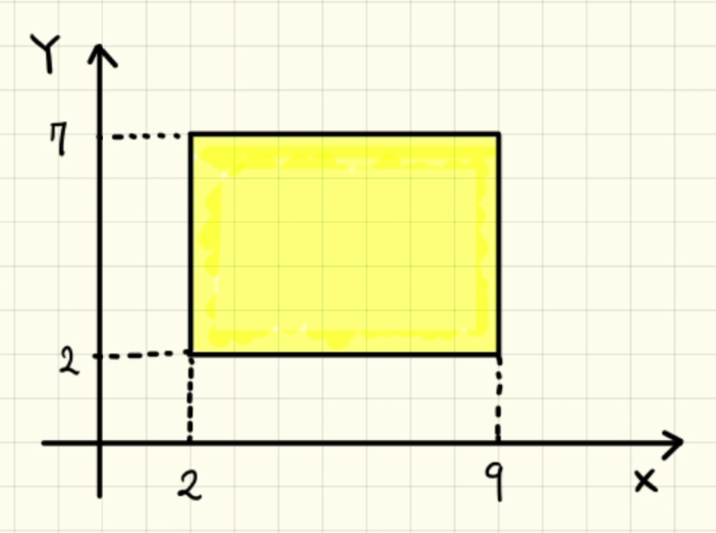

You are going to write a code to check how many 2D points are inside the box (in yellow). 

The x and y coordinate of each point are randomly generated from the interval [0 10] in the x and y directions, and are stored in each row of 'pt'.
```matlab
pt = (rand(3,2)-0.5)*10 + 5;  % a 3 x 2 row vector including the coordinates of three points
```
How many points are inside the yellow region? The number of points inside is assigned to 'num_pt'. 
**Note that the point on the boarder (the bounary of the box) is NOT considered as "inside".**

**Solution**
```matlab
pt = (rand(3,2)-0.5)*10 + 5;  % a 3 x 2 row vector including the coordinates of three points

bbox = [2 9 2 7]; % [x1 x2 y1 y2]

% (a)
pt_test = pt(1,:);
pt1_in = (pt_test(1)>bbox(1) && pt_test(1)<bbox(2)) && (pt_test(2)>bbox(3) && pt_test(2)<bbox(4));

pt_test = pt(2,:);
pt2_in = (pt_test(1)>bbox(1) && pt_test(1)<bbox(2)) && (pt_test(2)>bbox(3) && pt_test(2)<bbox(4));

pt_test = pt(3,:);
pt3_in = (pt_test(1)>bbox(1) && pt_test(1)<bbox(2)) && (pt_test(2)>bbox(3) && pt_test(2)<bbox(4));

num_pt = pt1_in + pt2_in + pt3_in;
```

## M02049. Vector and matrix sequencing (★★) 
```matlab
n = randi([10 100]); % A random scalar from 10 to 100
```
Write a script that creates the following vectors or matrices:

(a) 'vec_a' which is a 1 x 3n row vector containing a series of numbers from 1 to n, with each number repeated three times once before moving on to the next. 

Example 1: If n = 3, 'vec_a' becomes [1 1 1 2 2 2 3 3 3]. 

Example 2: If n = 4, 'vec_a' becomes [1 1 1 2 2 2 3 3 3 4 4 4]. 

(b) 'vec_b' which is copied from 'vec_a'. Then, remove all elements at even locations (e.g., 2rd, 4th, 6th...)

Example 1: If 'vec_a' = [1 **1** 1 **2** 2 **2** 3 **3** 3], 'vec_b' becomes [1 1 2 3 3].

Example 2: If 'vec_a' = [1 **1** 1 **2** 2 **2** 3 **3** 3 **4** 4 **4** 5 **5** 5 **6** 6 **6**], 'vec_b' becomes [1 1 2 3 3 4 5 5 6]. 

(c) Create a row vector named 'vec_c', which has the sequence:  10, 17, 26, 37, ..., (n^2 + 1).

Example 1: n = 5, 'vec_c' becomes [10, 17, 26].

Example 2: n = 7, 'vec_c' becomes [10, 17, 26, 37, 50].
 
(d) 'mat_d' an n x n matrix with all elements equal to 0. Please replace every **fourth** and **fifth** element with **3** in a linear index order, starting from the **first** (1 5 6 9 10, etc.). 

Example 1: when n = 5, 
```matlab
mat_d =

       3	3	3	3	3
       0	0	0	3	0
       0	0	3	0	0
       0	3	0	0	0
       3	0	0	0	3
```
Example 2: when n = 6, 
```matlab
mat_d =

     3	0	3	0	3	3
     0	0	0	0	3	0
     0	3	0	3	0	3
     0	0	3	0	0	0
     3	3	3	0	3	0
     3	0	0	0	0	3
```

**Solution**
```matlab
n = randi([10 100]); % A random scalar from 10 to 100

% start your code here

% (a) 
vec_a = zeros(1, 3*n);
vec_a(1:3:(3*n)) = 1:n;
vec_a(2:3:(3*n)) = 1:n;
vec_a(3:3:(3*n)) = 1:n;


% (b)
vec_b = vec_a;
vec_b(2:2:end) = [];

% (c)
vec_c = (3:n).^2 + 1;

% (d)
mat_d = zeros(n, n);
mat_d(1:4:end) = 3;
mat_d(1:5:end) = 3;
```

## M02050. Alphabet game (★★★)
**Note that you should not use condition statements (e.g., if-else, if-end) for this problem.**

Jesse has created an alphabet game. The goal is to score a single character that is a lowercase alphabet, uppercase alphabet, number character, or non-alphabet character. 

The score for a given character can be computed by the following rule:

* a score for an uppercase alphabet: 5

* a score for a lowercase alphabet: 3 

* a score for a number character: 2

* a score for a non-alphabet and non-number character: -2
```matlab
alph_seq = 'ABCDEFGHIJKLMNOPQRSTUVWXYZabcdefghijklmnopqrstuvwxyz0123456789!@#$%^&*()_';
num_char = numel(alph_seq); % number of characters in 'alph_seq'
p_char = alph_seq(randi(num_char, 1)); % a random single character

clearvars alph_seq
```
Compute the score of 'p_char' and assign its score to a variable named 'p_score'
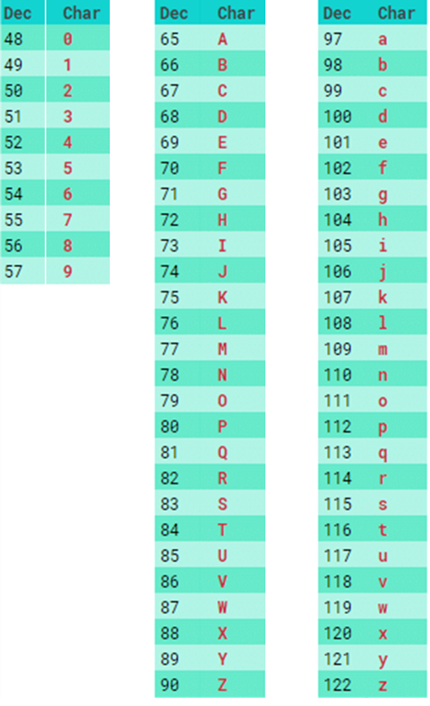

**Solution**
```matlab
% your script here
is_upper_p = (double(p_char) >= 65) && (double(p_char) <= 90);
is_lower_p = (double(p_char) >= 97) && (double(p_char) <= 122);
is_number_p = (double(p_char) >= '0') && (double(p_char) <= '9');
is_symbol_p = ~is_upper_p && ~is_lower_p && ~is_number_p;

p_score = is_upper_p*5 + is_lower_p*3 + is_number_p*2 + is_symbol_p*-2;
```

## M02051. Ordering Food (★★)
Wacky Burger is a fast food restaurant. To place an order, customers are given a card that has each of the 20 menu items along with a blank space next to each. The customer can write a number in any space to indicate that they would like that many of the item. 'menu' is a 5x4 matrix containing the number of each item on the menu.
```matlab
menu = reshape(1:20, 5, 4); %menu
menu_numb = randperm(20,5); % generates 5 random integers from 1-20 without repetition
amount = randi([1 6], 1, 5); % number of each menu selected in 'menu_numb'
```
(a) Stacy is picking up lunch for her coworkers. The menu items that she needs to order are given by 'menu_numb', a 1x5 row vector, and the corresponding amounts of each item are given by 'amount', another 1 x 5 row vector. Create a variable named 'card' which is a 5 x 4 array of zeros. Then assign the amount Stacy has ordered in each spot corresponding to the number's location in 'menu'. Note that items in 'menu' that aren't being ordered should be a 0 in 'card'. 

Example 1:
```matlab
menu_numb = [1 2 5 10 11];
amount = [2 3 3 3 5];
```
Then, 'card' becomes
```matlab

card =

     2     0     5     0
     3     0     0     0
     0     0     0     0
     0     0     0     0
     3     3     0     0
```
(b) The price for each item that you purchased is stored in 'pric', a 5x1 column vector.
```matlab
pric = randi([5 30],5,1);
```
How much does Stacy pay? Assign the value to 'tot', this should be a scalar value.

**Solution**
```matlab
menu = reshape(1:20, 5, 4); %menu
menu_numb = randperm(20,5); % generates 5 random integers from 1-20 without repetition
amount = randi([1 6], 1, 5); % number of each menu selected in 'menu_numb'
pric = randi([5 30],5,1); % price for each menu selected 

%your solution here

% (a)
card = zeros(5,4);
card(menu_numb) = amount;

% (b)
tot = amount*pric;
```
