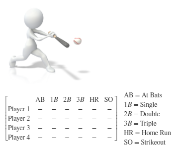
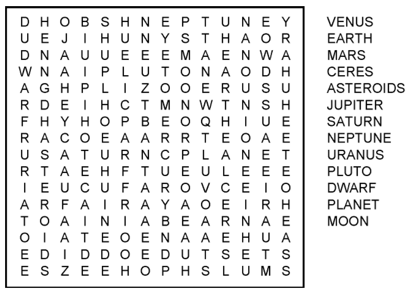
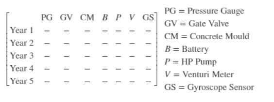
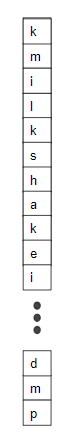
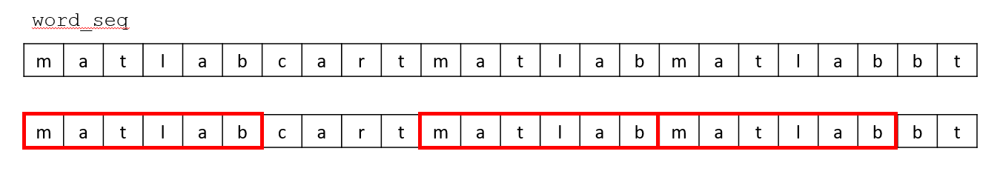

## M05001. Rounding Error Analysis (★)

**Last updated:** 2022-01-07

```matlab
mat1 = (rand(7,4)- 0.5)*200;
mat1 = round(mat1,4); % round values to the nearest 4 decimal digits
```
You need to write a script that creates a variable named:  

(a) 'mat2', which is copied from 'mat1'. The first column of 'mat2' is rounded towards negative infinity. 'mat2' is a 7 x 4 matrix.  

(b) 'mat3', which is copied from 'mat2'. The second column of 'mat3' is then rounded to the nearest integer toward zero. 'mat3' is a 7 x 4 matrix.  

(c) 'mat4', which is copied from 'mat3'. The third column of 'mat4' is then rounded to positive infinity. 'mat4' is a 7 x 4 matrix.  

(d) 'round_error', which contains the absolute value of the difference between elements in 'mat1' and 'mat4'. 'round_error' is a 7 x 4 matrix.  
For example, 'mat1' and 'mat4' are [1.1 -2.1;-1.1 2.2] and [1 -2;-1 2], 'round_error' becomes [0.1 0.1;0.1 0.2].  

(e) 'error_means', which determines the mean of each row of 'round_error'. 'error_means' is a 7 x 1 column vector.  

(f) 'error_sum', which determines the sum of all values in 'round_error'. 'error_sum' is a scalar.  

(g) 'error_max', which determines the maximum value in each row of 'round_error'. 'error_max' is a 7 x 1 column vector.  

(h) 'error_min', which determines the minimum value in each column of 'round_error'. 'error_min' is a 1 x 4 row vector.  

**Solution**
Please watch this:[**https://youtu.be/wqQB_Xti4CU?t=5**](https://youtu.be/wqQB_Xti4CU?t=5)

## M05002. Baseball Stats (★★)



```matlab
stat_1B = randi([65 88],4,1);
stat_2B = randi([20 45],4,1);
stat_3B = randi([0 8],4,1);
stat_HR = randperm(100, 4)'; % there is no same Home Run number.
stat_SO = randi([60 95],4,1);

stats = [stat_1B stat_2B stat_3B stat_HR stat_SO];
stats = [sum(stats,2) stats]; % add AB in the first column

clearvars stat_1B stat_2B stat_3B stat_HR stat_SO
```
The matrix 'stats' gives the information shown above about four baseball players performance over the course of a season. The data is represented by a dash (-) in the table above. Each row corresponds to a different player, and each column corresponds to a different statistic about the players performance. 'stats' is a 4 x 6 matrix. You need to make variables and index 'stats' to answer the following questions. 

(a) A single, double, triple and home run all count as hits. Create a variable named 'hits_a', which calculates the amount of hits each player has from the data in 'stats'. 'hits_a' is a 4 x 1 column vector. For example, if a row of 'stats' is [100 10 5 2 1 30], the  corresponding row of 'hits_a' becomes 18. **Please solve this problem using loop statements without using built-in functions. **

(b) You are going to solve the same problem of (a) using built-in functions without using loop statement. The values should be assigned to 'hits_b' and it is a 4 x 1 column vector. 

(c) A batting average is that the amount of hits each player has divided by the total number of batting attempts (At Bats or AB). 
Create a 1 x 4 row vector named 'bat_avg' from the data in 'stats', which includes the batting average of each player. **Please do not use loop statements.** 

(d) Create a variable 'hr_max' for the maximum number of home runs in 'stats'. **Please do not use loop statements. **

(e) Create a variable 'hr_leader' for the Player number who has the most home runs in the data 'stats'. For example, if Player 2 has the most home runs, 'hr_leader' = 2. **Please do not use loop statements. **

(f) You are going to solve the same problem of (d) and (e) without using built-in functions. The resulting values are assigned to 'hr_max_f' and 'hr_leader_f'. **Please use a loop statements.** 

**Solution**
Please watch this:[**https://youtu.be/wqQB_Xti4CU?t=440**](https://youtu.be/wqQB_Xti4CU?t=440)

## M05003. Built-In Functions (★)

```matlab
mat2 = randi([-100 100],4,5);
mat_new = randi([-100 100],20,20);
```
You need to write a script that creates a variable named:

(a) 'vec1', which is a 1 x 5 row vector and contains the maximum values in each column of 'mat2'.

(b) 'vec2', which is a 1 x 4 row vector and contains the minimum values in each row of 'mat2'.

(c) 'val1', which is a scalar variable and contain the maximum value of all values in 'mat2'.

(d) 'val2', which is a scalar variable and contains the row index where the minimum value of the first column of 'mat2' is located. For example, the first column of 'mat2' is [1;2;3;0], 'val2' is 4.

(e) 'vec3', which is a 4 x 1 column vector and calculates the sum of all values in each rows of 'mat2'. For example, 'mat2' is [1 2; 3 4; 5 6], 'vec3' becomes [3;7;11]. 

(f) 'val3', which is a scalar variable and contains the sum of the first column of 'mat2'.

(g) 'val4', which is a scalar variable and contains the sum of all values in 'mat2'.

(h) 'val5', which is a scalar variable and contains the sum of all diagonal elements in 'mat_new'.  For example, if 'mat_new' is [1 2 3; 4 5 6;7 8 9], 'val5' becomes 1 + 5 + 9 = 15. 

(i) 'vec4', which is a 1 x 5 row vector and contains the median of each column in 'mat2'.

(j) 'val6', which is a scalar variable and contains the mean of all values in 'mat2'.

(k) 'mat3', which is copied from 'mat2'. All columns are then sorted, with the highest value in the top row and lowest in the bottom row. For example, if 'mat2' is [1 2 3; 4 5 6; 7 8 9], 'mat3' becomes [7 8 9;4 5 6; 1 2 3].

(l) 'mat4', which is copied from 'mat2'. The third row is then sorted from the lowest on the left to the highest on the right. For example, if 'mat2' is [2 3 1; 6 5 4; 9 8 7], 'mat4' becomes  [2 3 1; 6 5 4; 7 8 9].

**Solution**
Please watch this:[**https://youtu.be/wqQB_Xti4CU?t=1330**](https://youtu.be/wqQB_Xti4CU?t=1330)

## M05004. Find Second Maximum (★★★)

```matlab
vec1 = randi([-20 20],1,100); % a 1x100 randomly generated vector with numbers raging from -20 to 20
```
Please write a script to find the second maximum element of 'vec1'. The second maximum element is assigned to the variable named 'max2'. 
For example, when 'vec1' is [1 3 10 2 10 9 3 9], 'max2' becomes 9 (Note that it is not 10). 
**Hint**: Use a sort function for this problem.

**Solution**
Please watch this:[**https://youtu.be/wqQB_Xti4CU?t=1890**](https://youtu.be/wqQB_Xti4CU?t=1890)

## M05005. Course Grading (★★★)

This program is to compute grades of students in a course.  Assume that there are 7 students in a class and they took 5 exams during the course. The weights of the exams that contribute the final grade are 10%, 15%, 20%, 25%, and 30% in order. 

```matlab
ex1 = randperm(61,7)+38+rand(1,7); % generate exam scores of 7 students for exam1 without overlap. 
ex2 = randperm(61,7)+38+rand(1,7); % generate exam scores of 7 students for exam2 without overlap. 
ex3 = randperm(61,7)+38+rand(1,7); % generate exam scores of 7 students for exam3 without overlap. 
ex4 = randperm(61,7)+38+rand(1,7); % generate exam scores of 7 students for exam4 without overlap. 
ex5 = randperm(61,7)+38+rand(1,7); % generate exam scores of 7 students for exam5 without overlap. 

score = [ex1;ex2;ex3;ex4;ex5]; 
clearvars ex1 ex2 ex3 ex4 ex5
```
A variable named 'score' is a 5 x 7 matrix and contains scores for each exam and each student. For instance, score(3,4) is a score of the third exam for student 4 and let's say that ID of this student is 4. Another example, score(2,1) is a score of the second exam for a student having ID 1. 'score' is randomly generated and it ranges from 40 to 100. 'score' is generated using 'randperm' so there is no identical score within each exam.  

Please write a script to answer the following question. 

(a) create a variable named 'st_score_a' that contains a student grade who scored the highest in the second exam.

(b) create a variable named 'st_id_b' that contains a student ID. This student scored the lowest in the third exam.

(c) create a variable named 'num_c' that contains the number of students who get a score more than 60 in the fifth exam. 

(d) create a variable named 'st_score_d' that contains a student score. This score is the closest to the average score of the fourth exam. 
For example, assume that scores for the fourth exam are 91, 41, 92, 71, 43, 100, and 44. The average becomes 68.86. Thus, 'st_score_d' is 71. 
You can assume that there is only one closest number.

(e) create a variable named 'weight_score_e' that contains a 7 x 1 vector and its elements are the final scores. 
The final score for each student can be computed by the weighted summation of all scores. For example, assume that a student got 40, 50, 60, 70, and 90 from the exam in order.   

(f) create a variable named 'weight_modified_score_f' that contains a 7 x 1 vector and its elements are the modified final scores. In 'score', a score less than or equal to 50 is considered as 0 and a score more than or equal to 90 is 100. The final score is computed with the same way that you did in (e). 

**Solution**
Please watch this:[**https://youtu.be/cepQyvVi3CM?t=5**](https://youtu.be/cepQyvVi3CM?t=5)

## M05006. Baseball Stats 2 (★★)


```matlab
stat_1B = randperm(200, 4)';
stat_2B = randperm(100, 4)';
stat_3B = randperm(30, 4)';
stat_HR = randperm(40, 4)';
stat_SO = randperm(100, 4)'; 
% there is no same stat between players;

stats = [stat_1B stat_2B stat_3B stat_HR stat_SO];
stats = [sum(stats,2) stats]; % add AB in the first column

clearvars stat_1B stat_2B stat_3B stat_HR stat_SO
```
The matrix 'stats' gives the information shown above about four  baseball players performance over the course of a season. The data is represented by a dash (-) in the table above. Each row corresponds to a different player, and each column corresponds to a different statistic about the players performance. 'stats' is a 4 x 6 matrix. You need to use 'stats' to answer the following questions. 

(a) Create a variable 'so_stats', which is a 1 x 2 row vector. The first element is the minimum number of strikeouts in 'stats', and the second element is the index of the player with the fewest strikeouts in 'stats'. For example, if the fewest number of strikeouts is 64 and the player is Player 1, 'so_stats' = [64 1]

(b)  A single, double, triple and home run all count as hits. Create a vector 'hits_sorted', which sorts the total hits of each player in descending order from top to bottom. 'hits_sorted' is a 4 x 1 column vector.

(c) Create a matrix 'stats_hrsorted', which is to sort player's stats by having the players with the most home runs at the top, and the player with the fewest at the bottom.  'stats_hr_sorted' is a 4 x 6 matrix. **Hint**: Please find 'sortrows' in MATLAB.

(d) Create a variable 'stats_max', which lists the maximum number of Singles, Doubles, Triples and Home Runs in the matrix 'stats'. 'stats_max' is a 1 x 4 row vector.

(e) Create a variable 'stats_leaders', which lists the players who lead in each category in question (d). 'stats_leaders' is a 1 x 4 row vector.

(f) Create a variable, 'total_bases'. which calculates the total bases each player has successfully reached. A single counts as 1, a Double counts as 2, a Triple counts as 3 and a Home Run counts as 4. 'total_bases' is a 4 x 1 column vector.


**Solution**

```matlab
stat_1B = randperm(200, 4)';
stat_2B = randperm(100, 4)';
stat_3B = randperm(30, 4)';
stat_HR = randperm(40, 4)';
stat_SO = randperm(100, 4)'; 
% there is no same stat between players;

stats = [stat_1B stat_2B stat_3B stat_HR stat_SO];
stats = [sum(stats,2) stats]; % add AB in the first column

clearvars stat_1B stat_2B stat_3B stat_HR stat_SO

% (a)
[strikeouts, strikeout_ind] = min(stats(:,6));
so_stats = [strikeouts strikeout_ind];

% (b)
hits = sum(stats(:,2:5), 2);
hits_sorted = sort(hits, 'descend');

% (c)
stats_hrsorted = sortrows(stats, 5, 'descend');

% (d)
stats_max = max(stats(:,2:5));

% (e)
[~, stats_leaders] = max(stats(:,2:5));

% (f)
bases_value = 1:4;
total_bases = stats(:,2:5) * bases_value';
```
## M05007. Word Finder Puzzle - Backward (★★★★)
I went to a Mel's diner with my daughter and saw an interesting word finder puzzle. Here is a sample. 



You are going to write a script to find a word from a puzzle. In general, this game is designed for searching multiple words. However, in this problem, you can write a program to find only one word, 'banana'. I wrote a code to create a word puzzle and insert 'banana' at **a random column or row locations**. This means, 'banana' is **not located at a diagonal direction.** 

The word can be read either down to up or up to down, or either right to left or left to right. You need to create a variable named 'word_loc' that contains a 6 x 2 matrix. Each row of 'word_loc' contains the location of each character of 'b','a', 'n', 'a', 'n', 'a' in order. Column 1 of 'word_loc' is the row location of the elements location, and column 2 of 'word_loc' is the column location of the elements location. Note that you need to use a MATLAB editor to solve this problem using debugger. Please copy the template codes to your editor. 

**Solution**

```matlab
word = 'banana';
n_word = numel(word);
word_db = double(word);

puzzle_size = 10;
puzzle = CreateWordPuzzle(puzzle_size, word);
disp('==Puzzle==');
disp(char(puzzle));

% find a word location
word_loc = zeros(numel(word),2);

% search columns
isRun = true;
for ii=1:puzzle_size
    col_vec = puzzle(:,ii);
    row_vec = puzzle(ii,:);
 
    for jj=1:(puzzle_size-n_word+1)
        test_loc = jj:(jj+n_word-1);
        
        test_word = col_vec(test_loc);
        if isequal(word_db, test_word')
            word_loc(:,2) = ii;
            word_loc(:,1) = test_loc;
        elseif isequal(fliplr(word_db),test_word')
            word_loc(:,2) = ii;
            word_loc(:,1) = fliplr(test_loc)';
        end
        
        test_word = row_vec(test_loc);
        if isequal(word_db, test_word)
            word_loc(:,1) = ii;
            word_loc(:,2) = test_loc;
        elseif isequal(fliplr(word_db),test_word)
            word_loc(:,1) = ii;
            word_loc(:,2) = fliplr(test_loc)';
        end
    end
end

% evaluate your answer
char_int = puzzle(word_loc(:,1) + (word_loc(:,2)-1)*puzzle_size);
fprintf('The word that you found is %s.\n',char(char_int'))

function puzzle = CreateWordPuzzle(puzzle_size, word)

puzzle = zeros(puzzle_size, puzzle_size);

% assign word set
n_word = numel(word);

is_forward = rand < 0.5;
word = is_forward*fliplr(word) + ~is_forward*word;

idx = randi(puzzle_size);
if randi([0 1])
    % cokumn vector
    str_idx = randi(puzzle_size-n_word+1);
    puzzle(str_idx:(str_idx+n_word-1),idx) = word';
else
    % row vector
    str_idx = randi(puzzle_size-n_word+1);
    puzzle(idx, str_idx:(str_idx+n_word-1),:) = word;
end

char_a = 97;
char_z = 122;
char_array = char_a:char_z;
non_word_char = char_array(~ismember(char_array, unique(word)));

emty_puzzle = ~puzzle(:);
puzzle(emty_puzzle) = ...
    non_word_char(randi(numel(non_word_char), [sum(emty_puzzle), 1]))';
end
```

## M05008. Equipment Purchasing (★★★) 



```matlab
num_PG = randi([3 15],5,1);
num_GV = randi([2 6],5,1);
num_CM = randi([50 140],5,1);
num_B = randi([75 150], 5,1);
num_P = randi([0 4],5,1);
num_V = randi([0 3],5,1);
num_GS = randi([10 45],5,1);

ann_purchases = [num_PG num_GV num_CM num_B num_P num_V num_GS];
clearvars num_PG num_GV num_CM num_B num_P num_V num_GS

equip_costs = [15 200 5 5 95 175 3];
```
The matrix 'ann_purchases' gives how many of each type of equipment has been purchased each year over 5 years. Each row of 'ann_purchases' corresponds to a different year, and each column corresponds to a different piece of equipment. The costs of the equipment is provided in 'equip_costs', a 1 x 7 row vector. The first element of 'equip_costs' is the price of a Pressure Gauge, and the last element is the price of a Gyroscope Sensor.

Write a script that creates a variable named:

(a) 'min_cm', which contains the fewest number of Concrete Moulds purchased during five years.  

(b) 'max_v', which contins the largest number of Venturi meter's purchased during five years.  

(c) 'min_yr_b', which contains the year when the fewest Batteries were purchased during five years. Note that if there are more than two minimum numbers, please assign the earliest year. For example, the fewest Batteries are purchased year 1 and year 2. You need to assign 1.   

(d) 'max_purchases_ind', which contains the year of when the highest number of every purchase.  'max_purchases_ind' is a 1 x 7 row vector. If the maximum items purchased is the same in multiple years, return the lowest year number that has the maximum items purchased.  Note that if there are more than two maximum numbers in each item, please assign the earliest year in each item.  

(e) 'max_yr', which contains the year with the maximum total number of items purcahsed during five years.  For example, 'ann_purchases' is [1 1 1 3; 1 1 2 4;2 2 2 3], 'max_purchase_yr' become 3 because year 1: 6, year 2: 8, year 3: 9. Note that if there are more than two maximum numbers, please assign the earliest year.   

(f) 'is_more_than_1200' which contains logical(1) if the total number of items purchased during five years are more than 1,200. Otherwise, assign logical(0) to 'is_more_than_1200'.  

We are going to compute the cost using the price for each equipmented provided in 'equip_costs'. 

(g) Create a variable named 'total_cost' which is a 5 x 1 column vector and determines the total cost of equipment in each year. Use the 'equip_cost' vector and 'ann_purchases' array to calculate the total cost.    

(h) Ever since year #3, all equipment prices have been increased by 10%. Compute 'total_cost_re' which is a 5 x 1 column vector and determines the revised total cost.  

(i) HST for all equipment is 13% except for Batteries. Batteries are tax free. Compute a scalar variable named 'total_hst', which is the total HST for all 5 years (Note: total tax does not mean total price). Use the original 'equip_costs' array, and not the one used in question (h).   

**Solution**
```matlab
num_PG = randi([3 15],5,1);
num_GV = randi([2 6],5,1);
num_CM = randi([50 140],5,1);
num_B = randi([75 150], 5,1);
num_P = randi([0 4],5,1);
num_V = randi([0 3],5,1);
num_GS = randi([10 45],5,1);

ann_purchases = [num_PG num_GV num_CM num_B num_P num_V num_GS];
clearvars num_PG num_GV num_CM num_B num_P num_V num_GS

equip_costs = [15 200 5 5 95 175 3];
% (a)
min_cm = min(ann_purchases(:,3));

% (b)
max_v = max(ann_purchases(:,6));

% (c)
[~,min_yr_b] = min(ann_purchases(:,4));

% (d)
[~, max_purchases_ind] = max(ann_purchases);

% (e)
sum_items = sum(ann_purchases, 2);
[~, max_yr] = max(sum_items);

% (f)
total_items = sum(ann_purchases, 'all');
is_more_than_1200 =  total_items > 1200;

% (g)
total_cost = ann_purchases*equip_costs';

% (h)
total_cost_year345 = ann_purchases(3:5,:)*equip_costs'*1.1';

total_cost_re = [total_cost(1:2,:);total_cost_year345];

% (i)
hst_vec = equip_costs'*0.13;
hst_vec(4) = 0;
total_hst = sum(ann_purchases*hst_vec);

% (g) 'equip_cost' which is a 5 x 1 column vector and determines the total cost in each year if pressure gauges and gate valves costed 10% and 20% more respectively.
% (h) 'equip_cost2' which is a 5 x 1 column vector and determines the average annual cost of each year if concrete mould and batteries costed 50% and 30% more respectively.
% (i) 'equip_cost3' which is a 1 x 5 row vector of the years in which each equipment has reached its highest cost if all equipment costed 20% more in the third year.
% (j) 'total_tax_cost' which is a 5 x 1 column vector of the total income each year if tax was 13% on the first year and +2% every following year. 
(Assume that tax is not included in the ann_purchases array)
% (k) 'equip_cost_max' which is the column index that is involved with the item that has the highest total cost.

% copy_ann_purchases=ann_purchases;
% percent_inc=zeros(5,2);
% percent_inc(:,1)=1.1;
% percent_inc(:,2)=1.2;
% copy_ann_purchases(:,[1,2])=copy_ann_purchases(:,[1,2]).*percent_inc;
% equip_cost=sum(copy_ann_purchases,2);
% 
% % (h)
% copy_ann_purchases=ann_purchases;
% percent_inc=zeros(5,2);
% percent_inc(:,1)=1.5;
% percent_inc(:,2)=1.3;
% copy_ann_purchases(:,[3,4])=copy_ann_purchases(:,[3,4]).*percent_inc;
% equip_cost2=mean(copy_ann_purchases,2);
% 
% % (i)
% copy_ann_purchases=ann_purchases;
% copy_ann_purchases(3,:)=copy_ann_purchases(3,:)*1.2;
% [~,equip_cost3]=max(copy_ann_purchases);
% 
% % (j)
% copy_ann_purchases=ann_purchases;
% yearly_tax=(13:2:21)';
% copy_ann_purchases=copy_ann_purchases.*yearly_tax;
% total_tax_cost=sum(copy_ann_purchases,2);
% 
% % (k)
% [~,equip_cost_max]=max(sum(ann_purchases));
```
## M05009. Matrix with forward and backward rows (★★)
Given n, create a nxn matrix in which the integers from 1 to n^2 are placed backward and forward in order (reverse 'S' shape). Here are the examples:


(a) Create a na x na matrix named 'mat_a', which is generated according to the above pattern. 

(b) Create a nb x nb matrix named 'mat_b', which is generated according to the above pattern without using loop statement.

**Solution**

```matlab
na = randi([5 20]);
nb = randi([5 20]);

%(a)
mat_a = reshape(1:na*na, na, na);
mat_a = mat_a';

for ii=2:2:na
    mat_a(ii,:) = fliplr(mat_a(ii,:));
end

% optional 1
% mat_a = zeros(n, n);
% for ii=1:n
%     st = (ii-1)*n + 1;
%     ed = ii*n;
%     
%     if rem(ii,2) == 1
%        mat_a(ii,:) = st:ed; 
%     else
%        mat_a(ii,:) = ed:-1:st; 
%     end
% end

%(b)
mat_b = reshape(1:nb*nb, nb, nb)';
mat_b(2:2:nb,:) = fliplr(mat_b(2:2:nb,:));
```

## M05010. Sorting by Distance (★★)

You need to sort a list of integer numbers according to the difference between the number and the target value.  The vector named 'vec1' is a 1 x 10 row vector and contains random integer values (without repetation). There are no values in 'vec1' that are the same as one another.  The target value named 't' is given as 3.6. Since the elements in 'vec1' are not repeated, the difference between each element and the target value (3.6) are different (which means that the difference in values are not repeated). The values in 'vec1' are sorted in descending order in terms of the absolute value of the difference between t and the corresponding elements in 'vec1'. Please assign the sorted values to 'vec1_sort'. For instance, if vec1 = [ 1 2 5 7 9 10], then 'vec1_sort' becomes [10 9 7 1 2 5]. (Since the absolute distances between t and elements in 'vec1' is [2.6, 1.6, 1.4, 3.4, 5.4, 6.4]. Thus their differences would be sorted in vec 2.)

**Solution**

```matlab
vec1 = randperm(100, 10)-30; % pick 10 values from -29 to 70
t = 3.6;

dist = abs(vec1-t);
[~, id] = sort(dist, 'descend');
vec1_sort = vec1(id);
```

## M05011. Simple Word Puzzle (★★★)

You are going to write a script to find a single word of 'banana' from a character vector named 'word_seq'. You need to create a 1 x 6 row vector named 'word_loc' that contains the location of each character in the word 'banana'.  'banana' is placed from left to right and at random location (six consecutive locations) in 'word_seq', which is a 1 x 30 row vector. 

For example, 'word_seq' is  

Then, 'word_loc' becomes [3 4 5 6 7 8]. Note that there are only lowercase letters. 

**Solution**
```matlab
num_seq = 30; % number of characters in 'word_seq'
word_seq = randi([97 122], 1, num_seq); % generate random numeric vectors corresponding to lowercase characters

word_bana = double('banana'); % convert 'banana' to a numeric vector
num_bana = numel(word_bana);

loc_b = randi([1 num_seq-num_bana+1]); % random location of 'b'
word_seq(loc_b:loc_b+num_bana-1) = word_bana; % place 'banana' to 'word_seq'

word_seq = char(word_seq); % conver the numeric word_seq to the character vector

clearvars loc_b

% Your script to find 'word_loc'

word_loc = zeros(1, num_bana);
for ii=1:num_seq-num_bana+1
    test_loc = ii:ii+num_bana-1;
    if isequal(word_seq(test_loc), 'banana')
       word_loc = test_loc; 
    end
end

fprintf('The word sequence is ');
disp(word_seq);

fprintf('The word that you find is ');
disp(word_seq(word_loc));
```
## M05012. Candy Store (★★)

Noreen owns a candy store, and she did a promotion on July 2. If customers applied for membership cards on that day, they would have a chance to win a prize. 10000 poeple applied for a membership card.
The prize will be awarded to only Five customers by order of application. The receivers are chosen based on their membership card number. 

The card number is 10 digits. To win the prize, the card number satisfy the following conditions:

* No '5' appears at all digits. 
* The sum of all digits is less than 40. 
* The largest digit is less than or equal to 8. 

Here are some examples:
The card numbers that satisfy the conditions are 
* 1234617812 
* 3212613212
* 6812143642

The card numbers that do not satisfy the conditions are 
* 1235617812 (not satisfying the first condition)
* 3212913212 (not satisfying the third condition)
* 6832743942 (not satisfying the second and third conditions)

A 10000 x 10 matrix named 'card_num_all' is randomly generated and each row represents a card number. 
```matlab
card_num_all = randi(10, 10000, 10)-1; % a 10000 x 10 matrix and its elements are generated from 0 to 9. 
priz_rs = zeros(1, 5); % index of receivers
```
Write a script to find the index of prize receivers and assign it value to 'priz_rs' in order, which is a 1 x 5 vector. 
In this problem, you must use a 'break' command so that the execuation is terminated once you find all five receievers. 
If you can't find five receivers (not probabilistically feasible), leave the element(s) as zero(s). 

**Solution**
```matlab
card_num_all = randi(10, 10000, 10)-1; % a 10000 x 10 matrix and its elements are generated from 0 to 9. 
priz_rs = zeros(1, 5); % index of receivers
% write your code here

num_id = 10000;

count_pz = 0;
for ii = 1:num_id
    test_id = card_num_all(ii,:);
    
    cond1 = true;
    for jj=1:10
       if test_id(jj) == 5
           cond1 = false;
           break;
       end
    end
    
    cond2 = sum(test_id) < 40;
    
    cond3 = max(test_id) <= 8;
    
    if cond1 && cond2 && cond3
        count_pz = count_pz + 1;
        priz_rs(count_pz) = ii;
    end
    
    if count_pz == 5
        break
    end
end
```

## M05013. Alphabet Character Manipulation (★★★)

Note: refer to the ASCII table when solving this question: https://www.rapidtables.com/code/text/ascii-table.html
The following variables are created in advance using 'randi' and will be used for solving questions. 

```matlab
charvec_ran = char(randi([97 122], 1,200)); % a 1 x 200 randomly generated character vector
vowels ='aeiou'; 
alpha_char = char(97:122); % 'abcdefghijklmnopqrstuvwxyz';
```
Note that 'charvec_ran', 'vowels' and 'alpha_char' only contain lowercase letters. 

(a) Write a script to check how many vowels are contained in 'charvec_ran' and assign the resulting count to 'num_vowels'. 

(b) Write a script to find the character that appears most frequently in 'charvec_ran' and assign the corresponding character to 'max_char'. If the characters that appear the most are more than one, return the earlier character. (e.g., 'b' is earlier than 'c'). 

**Solution**
```matlab
charvec_ran = char(randi([97 122], 1,200)); % a 1 x 200 randomly generated character vector
vowels ='aeiou'; % vowel characters
alpha_char = char(97:122); % 'abcdefghijklmnopqrstuvwxyz';

n_vec = numel(charvec_ran);
n_vow = 5;

%(a)
num_vowels = 0;
for ii=1:n_vec
    for jj=1:n_vow
        if charvec_ran(ii)==vowels(jj)
            num_vowels = num_vowels + 1;
        end
    end
end
    
%(b)
count_alpha = zeros(1, 26);
n_alpha = numel(alpha_char);
for ii=1:n_vec
    for jj=1:n_alpha
        if charvec_ran(ii) == alpha_char(jj)
            count_alpha(jj) = count_alpha(jj) + 1;
        end
    end
end

[~, I] = max(count_alpha);

max_char = alpha_char(I);
```

## M05014. Alphabet Character Manipulation (★★★)

Note: refer to the ASCII table when solving this question: https://www.rapidtables.com/code/text/ascii-table.html
The following variables are created in advance using 'randi' and will be used for solving questions. 

```matlab
char_vec_ran = char(randi([65 90], 150, 1)); % a 150 x 1 randomly generated character vector
vowel_vec ='AEIOU'; 
alp_vec = char(65:90); % 'ABCDEFGHIJKLMNOPQRSTUVWXYZ';
```

Note 'char_vec_ran', 'vowel_vec', and 'alp_vec' only contain uppercase letters. 

(a) Write a script to check how many vowels are contained in 'char_vec_ran' and assign the resulting count to 'num_v'. 

(b) Write a script to find the character that appears the most in 'char_vec_ran' and assign the corresponding character to 'max_char'.
If the characters that appear the most are more than one, return the earlier character. (e.g., 'B' is earlier than 'C'). 

**Solution**

```matlab
char_vec_ran = char(randi([65 90], 150, 1)); % a 150 x 1 randomly generated character vector
vowel_vec ='AEIOU'; 
alp_vec = char(65:90); % 'ABCDEFGHIJKLMNOPQRSTUVWXYZ';

n_vec = numel(char_vec_ran);
n_vow = 5;

%(a)
num_v = 0;
for ii=1:n_vec
    for jj=1:n_vow
        if char_vec_ran(ii)==vowel_vec(jj)
            num_v = num_v + 1;
        end
    end
end
    
%(b)
count_alpha = zeros(1, 26);
n_alpha = numel(alp_vec);
for ii=1:n_vec
    for jj=1:n_alpha
        if alp_vec(jj) == char_vec_ran(ii)
            count_alpha(jj) = count_alpha(jj) + 1;
        end
    end
end

[~, I] = max(count_alpha);

max_char = alp_vec(I);
```

## M05015. Candy Store (★★)

Noreen owns a candy store, and she did a promotion on July 2. If customers applied for membership cards on that day, they would have a chance to win a prize. 10000 poeple applied for a membership card. The prize will be awarded to only Seven customers by order of application. The receivers are chosen based on their membership card number. 

The card number is 10 digits. To win the prize, the card number must satisfy the following conditions:
* There is no '7' that appears at any digit. 
* The sum of all digits is greater than 30. 
* The smallest digit is greater than or equal to 2. 

Here are some examples:
The card numbers that **satisfy these conditions** are 
* 2234635832 
* 3232623282
* 6862943642

The card numbers that do not satisfy the conditions are 
* 1235617812 (not satifying the first and third conditions)
* 2222332223 (not satifying the second condition)
* 2232143142 (not satifying the second and third conditions)

A 10000 x 10 matrix named 'card_num_all' is randomly generated and each row represents a card number. 

```matlab
cardnum_all = randi(10, 10000, 10)-1; % a 10000 x 10 matrix and its elements are generated from 0 to 9. 
prize_rs = zeros(1, 7); % index of receivers
```

Write a script to find the index of prize receivers and assign it value to 'prize_rs' in order, which is a 1 x 7 vector. In this problem, you must use a 'break' command so that the execution is terminated once you find all seven receivers. If you can't find seven receivers (not probabilistically feasible), leave the element(s) as zero(s). 

**Solution**

```matlab
cardnum_all = randi(10, 10000, 10)-1; % a 10000 x 10 matrix and its elements are generated from 0 to 9. 
prize_rs = zeros(1, 7); % index of receivers
% write your code here

num_id = 10000;

count_pz = 0;
for ii = 1:num_id
    test_id = cardnum_all(ii,:);
    
    cond1 = true;
    for jj=1:10
       if test_id(jj) == 7
           cond1 = false;
           break;
       end
    end
    
    cond2 = sum(test_id) > 30;
    
    cond3 = min(test_id) >= 2;
    
    if cond1 && cond2 && cond3
        count_pz = count_pz + 1;
        prize_rs(count_pz) = ii;
    end
    
    if count_pz == 7
        break
    end
end
```        

## M05016. Simple Word Puzzle (★★★)

You are going to write a script to find a single word of 'milkshake' from a character vector named 'word_seq'. You need to create a  9 x 1 column vector named 'word_location' that contains the location of each character letter in the word 'milkshake'.  Only one word ('milkshake') is be placed from top to bottom at a random location in 'word_seq', which is a 40 x 1 column vector. 

For example, if 'word_seq' is :



Then, 'word_location' becomes [2; 3; 4; 5; 6; 7; 8; 9; 10]. Note that there are only lowercase letters. 

**Solution**

```matlab
num_seq = 40; % number of characters in 'word_seq'
word_seq = randi([97 122], num_seq, 1); % generate random numeric vectors corresponding to lowercase characters

word_milk = double('milkshake'); % convert 'milkshake' to a numeric vector
num_milk = numel(word_milk);

loc_b = randi([1 num_seq-num_milk+1]); % random location of 'm'
word_seq(loc_b:loc_b+num_milk-1) = word_milk; % place 'milkshake' to 'word_seq'

word_seq = char(word_seq); % conver the numeric word_seq to the character vector

clearvars loc_b

% Your script to find 'word_location'

word_location = zeros(num_milk, 1);
for ii=1:num_seq-num_milk+1
    test_loc = ii:ii+num_milk-1;
    if isequal(word_seq(test_loc)', 'milkshake')
       word_location = test_loc';
    end
end

fprintf('The word sequence is \n');
disp(word_seq'); % transpose the sequence for a priniting purpose!

fprintf('The word that you found is \n');
disp(word_seq(word_location)'); % transpose the sequence for a priniting purpose!
```    
## M05017: Word Finder Puzzle (★★★★)

I went to a Mel's diner with my daughter and saw an interesting word finder puzzle. 
Here is a sample. 


You are going to write a script to find a word from a puzzle. In general, this game is designed for searching multiple words.
However, in this problem, you can write a program to find only one word, 'mango'.
I wrote a code to create a word puzzle and insert 'mango' at a random column or row locations. 
The word is placed at either left-to-right or right-to-left in a row direction and at either top-to-bottom or bottom-to-top in a column direction.
This means, 'mango' is not located at a diagonal direction. 
You need to create a variable named 'word_loc' that contains a 5 x 2 matrix. 
Each row of 'word_loc' contains the location of each character of 'm','a', 'n', 'g', 'o' in order. 
The first column of 'word_loc' is the row location of the elements location, and the second column of 'word_loc' is the column location of the elements location.

Note that you need to use a MATLAB editor to solve this problem using debugger. Please copy the template codes to your editor. 

**Solution**
```MATLAB
word = 'mango';
n_word = numel(word);
word_db = double(word);

puzzle_size = 12;
puzzle = CreateWordPuzzle(puzzle_size, word);
disp('==Puzzle==');
disp(char(puzzle));

% find a word location
word_loc = zeros(numel(word),2);

% search columns
isRun = true;
for ii=1:puzzle_size
    col_vec = puzzle(:,ii);
    for jj=1:(puzzle_size-n_word+1)
        test_loc = jj:(jj+n_word-1);
        test_word = col_vec(test_loc);
        if isequal(word_db, test_word')
            word_loc(:,2) = ii;
            word_loc(:,1) = test_loc;
            isRun = false;
            break;
        elseif isequal(word_db, flip(test_word'))
            word_loc(:,2) = ii;
            word_loc(:,1) = flip(test_loc);
            isRun = false;
            break;
        end
    end
end

if isRun
    % search rows
    for ii=1:puzzle_size
        row_vec = puzzle(ii,:);
        for jj=1:(puzzle_size-n_word+1)
            test_loc = jj:(jj+n_word-1);
            test_word = row_vec(test_loc);
            if isequal(word_db, test_word)
                word_loc(:,1) = ii;
                word_loc(:,2) = test_loc;
            elseif isequal(word_db, flip(test_word))
                word_loc(:,1) = ii;
                word_loc(:,2) = flip(test_loc);
            end
        end
    end
end
% word_loc

% evaluate your answer
char_int = puzzle(word_loc(:,1) + (word_loc(:,2)-1)*puzzle_size);
fprintf('The word that you found is %s.\n',char(char_int'))

% option 1
% word_db = fliplr(word_db);
% 
% lg_mat1 = conv2(puzzle, word_db, 'valid')==sum(word_db.^2)
% lg_mat2 = conv2(puzzle, word_db', 'valid')==sum(word_db.^2)
% 
% if any(lg_mat1(:))
% [ii,jj] = find(lg_mat1)
% word_loc(:,2) = jj:jj+n_word-1;
% word_loc(:,1) = ii; 
% else
% [ii,jj] = find(lg_mat2);
% word_loc(:,1) = ii:ii+n_word-1;
% word_loc(:,2) = jj; 
% end

function puzzle = CreateWordPuzzle(puzzle_size, word)

puzzle = zeros(puzzle_size, puzzle_size);

% assign word set
n_word = numel(word);

if randi([0 1])
   word = flip(word); 
end

idx = randi(puzzle_size);
if randi([0 1])
    % cokumn vector
    str_idx = randi(puzzle_size-n_word+1);
    puzzle(str_idx:(str_idx+n_word-1),idx) = word';
else
    % row vector
    str_idx = randi(puzzle_size-n_word+1);
    puzzle(idx, str_idx:(str_idx+n_word-1),:) = word;
end

char_a = 97;
char_z = 122;
char_array = char_a:char_z;
non_word_char = char_array(~ismember(char_array, unique(word)));

emty_puzzle = ~puzzle(:);
puzzle(emty_puzzle) = ...
    non_word_char(randi(numel(non_word_char), [sum(emty_puzzle), 1]))';
end
```  

## M05018. (Advanced) Donut Store (★★★)

A raffle will take place at Bianca's donut store. Each customer receives a 10 digit number on their ticket and 1000 people got raffle tickets. The prize will be awarded to only five customers by order of application. The receivers are chosen based on their raffle ticket numbers. 

The ticket number is 10 digits. To win the prize, the ticket number must satisfy the following conditions:
* The second and third digits are odd number.
* The second last digit is greater than the last digit. 
* sum of all digits is less than 40. 
* The fourth and sixth digits are not equal to 4. 

For example, the person whose card number is either '5331121132' or '1352131175' will receive the prize if all 5 prizes were not taken by the other people registered before this person.

A 1000 x 10 matrix named 'card_num_all' is randomly generated and each row has a card number. 

```matlab
num_id = 1000;
card_num_all = randi(10, num_id, 10)-1; % a 1000 x 10 matrix and its elements are generated from 0 to 9. 
priz_rs = zeros(1, 5); % 1x5 vector containing index of receivers
```
Write a script to find the index of prize receivers and assign it value to 'prize_rs' in order, which is a 1 x 5 vector. In this problem, you must use a 'break' command so that the execution is terminated once you find all five receivers. If you can't find five receivers (not feasible probabilistically), leave the element(s) as zero(s).

**Solution**
Please watch this:[**https://youtu.be/XxXoMoQiJOA?t=2510**](https://youtu.be/XxXoMoQiJOA?t=2510)

## M05019. Earthquake Statistics (★★★)

```matlab
num_FS = randi([200 1000],5,1); % number of forershocks 
num_MS = randi([50 200],5,1); % numbrt of mainshocks 
num_AS = randi([500 1000],5,1); % number of aftershocks 
mag_MS = randi([6 10], 5,1); % average mainshock magnitude 
damg_RES = randi([100 1000],5,1); % number of damaged residential buildings 
damg_GOV = randi([100 1000],5,1); % number of damaged government buildings 
damg_HIST = randi([100 1000],5,1); % number of damaged historical buildings 

earthquake_stats = [num_FS num_MS num_AS mag_MS damg_RES damg_GOV damg_HIST]; % 5x7 matrix containing aftershock statistics
damg_costs = [10 15 20]; %damage cost per building (in thousands of dollars) 

clearvars num_FS num_MS num_AS mag_MS damg_RES damg_GOV damg_HIST %clearning variables
```
The matrix 'earthquake_stats' reports earthquake statistics over 5 years, the legend describes the types of statistics in the matrix. Each row of 'earthquake_stats' corresponds to a different year, and each column corresponds to a different statistic. The costs of the damage for each type of building (residential, government, historical) is reported in  in 'damg_costs', a 1 x 3 row vector. The first element of 'damg_costs' is the damage cost of residential buildings (in thousands of dollars), and the last element is the damage cost of historical buildings (in thousands of dollars).

Write a script that creates a variable named:
(a) 'total_quake' which is a 5x1 column vector that reports the total number of earthquakes (total number of FS, MS and AS) each year.
(b) 'max_mag_yr' which reports the year with the largest mainshock magnitude, note that if there are more than two maximum magnitudes, please assign the earliest year.
(c) 'is_yr4_over_mag' which has a value of logical(1) if the mainshock magnitude for year 4 is larger than the average mainshock magnitude over all 5 years.
(d) 'avg_damg_cost' which is the average cost of total damages for all building types for all five years, find the cost in tousands of dollars (ie. do not need to multiply 'damg_costs' by 1000).

**Solution**
Please watch this:[**https://youtu.be/GVRazuYtbBo?t=1651**](https://youtu.be/GVRazuYtbBo?t=1651)

## M05020. How many 'matlab' in a given sequence? (★★★) - 20 points

You are going to write a script to count the number of 'matlab' from a character vector named 'word_seq'. 'word_seq' is a 1 x 300 lowercase alphabet sequence. The resulting value is stored in a variable named 'num_matlab'. For example, if 'word_seq' is: 



Then, 'num_matlab' becomes 3. Note that you should not use built-in functions of 'strfind' and 'count'. 

**Solution**
Please watch this:[**https://youtu.be/dvypAsCkOK4?t=6**](https://youtu.be/dvypAsCkOK4?t=6)


## M05021. Alphabet Number Game (Advanced) (★★★) - 15 points

Kasturi and Bianca have created an alphabet number game. Each player has a 1 x 100 lowercase alphabet sequence. The player with the higher score wins this game. The score of 'a' is 0 and the score of each following letters gradually increases by 2. For example, 'b' becomes 2, 'c' becomes 4 and 'z' becomes 50. The final score is found by summing the scores of all 100 alphabet letters in a given sequence. 50 players join this game. 

```matlab
alph_seq = 'abcdefghijklmnopqrstuvwxyz';
player_seq = alph_seq(randi(26, 50, 100)); % 50 x 100 character vector 

clearvars alph_seq
```
Each row in 'player_seq' stores an alphabet sequence for each player containing 100 lowercase alphabets. Here, a row index is considered as a player id. Who wins this game? Please find the winner's id (corresponding a row index) and store it in a variable named 'win_id'. 
Note that if the final score is tied, the lowest player id wins. 

**Solution**
Please watch this:[**https://youtu.be/dvypAsCkOK4?t=758**](https://youtu.be/dvypAsCkOK4?t=758)

## M05022. Earthquake Statistics (★★★) - 15 points

```matlab
num_FS = randi([200 1000],5,1); % number of forershocks 
num_MS = randi([50 200],5,1); % number of mainshocks 
num_AS = randi([500 1000],5,1); % number of aftershocks 
mag_MS = randi([6 10], 5,1); % average mainshock magnitude 
damg_RES = randi([100 1000],5,1); % number of damaged residential buildings 
damg_GOV = randi([100 1000],5,1); % number of damaged government buildings 
damg_HIST = randi([100 1000],5,1); % number of damaged historical buildings 

earthquake_stats = [num_FS num_MS num_AS mag_MS damg_RES damg_GOV damg_HIST]; % 5x7 matrix containing aftershock statistics
damg_costs = [10 15 20]; % damage cost per building (in thousands of dollars) 

clearvars num_FS num_MS num_AS mag_MS damg_RES damg_GOV damg_HIST %clearing variables
```
The matrix 'earthquake_stats' reports earthquake statistics over 5 years, the legend describes the types of statistics in the matrix. Each row of 'earthquake_stats' corresponds to a different year, and each column corresponds to a different statistic. The costs of the damage for each type of building (residential, government, historical) is reported in  in 'damg_costs', a 1 x 3 row vector. The first element of 'damg_costs' is the damage cost of residential buildings (in thousands of dollars), and the last element is the damage cost of historical buildings (in thousands of dollars).

Write a script that creates a variable named:
(a) 'min_total_quake_yr' which reports the year with the lowest total number of earthquakes (FS, MS, and AS are totaled for each year).
(b) 'num_yrs_over_800' which is the number of years with over 800 afterhocks.
(c) 'avg_num_damg' which is a 1x3 vector that reports the average number of damaged buildings for each building type over the five years (RES, GOV, and HIST in order). For example, if a total of 3000 government buildings are damaged over 5 years, that is an average of 600 government buildings. 
(d) 'total_damg_cost_asnd' which is a 5x1 vector that reports the years in order from the year with the lowest total damage costs to the year with the highest total damage costs (ascending order) 
Note that the total damage cost is a sum of damage costs for all three building types.  

**Solution**
Please watch this:[**https://youtu.be/dvypAsCkOK4?t=1769**](https://youtu.be/dvypAsCkOK4?t=1769)

## M05023. Candy Store (★★) - 20 points

A raffle will take place at Kasturi's Candy Store. Each customer receives a 10 digit number on their ticket and 500 people got raffle tickets. The prize will be awarded to only three customers by order of application. The receivers are chosen based on their raffle ticket numbers. The ticket number is 10 digits. To win the prize, the ticket number must satisfy all the following conditions:
* The sum of the fifth and sixth digits is greater than the sum of the first and last digits - in 1352131175, 4 is not great than 6, hence it does not satisfy the condition.
* The third last digit is greater than 7 - in 1352131175, 1 is not great than 7, hence it does not satisfy the condition.
* The card number contains less than three 9 - in 1952991175, the number has three digits that are 9, hence it does not satisfy the condition.
* The third and sixth digits are not equal to each other - in 1952991175, 5 is not equal to 9, hence it satisfies the condition.

For example, the card numbers that satify all these four conditions are 1234512930, 0259192801 or 2910238901. 

A 500 x 10 matrix named 'card_num_all' is randomly generated and each row has a card number. 

```matlab
num_id = 500;
card_num_all = randi(10, num_id, 10)-1; % a 500 x 10 matrix and its elements are generated from 0 to 9. 
prize_rs = zeros(1, 3); % 1x3 vector containing index of receivers
```
Write a script to find the index of prize receivers and assign it value to 'prize_rs' in order, which is a 1 x 3 vector. In this problem, you must use a 'break' command so that the execution is terminated once you find all three receivers. If you can't find three receivers (not feasible probabilistically), leave the element(s) as zero(s).  

**Solution**
Please watch this:[**https://youtu.be/dvypAsCkOK4?t=2313**](https://youtu.be/dvypAsCkOK4?t=2313)

## M05024. Test Scores (★)

Test scores for a class are stored in 'test', a 200x5 matrix where each row represents an individual student's scores across 5 tests. 
The student in the first row has an ID # of 1 and the last row is 200. 
```matlab
test = randi([0 100], 200, 5); % test scores for 200 students
```
(a) Find the mean score of each test and assign to 'mean_score', a 1 x 5 row vector. 
(b) Create 'best_score', a 200 x 2 matrix. The first column contains each student's best test score and the second has the corresponding test #. If two or more scores are the same, include a lower test number. 

**Solution**
```matlab
test = randi([0 100], 200, 5); % test scores for 200 students

% (a)
mean_score = mean(test); % default dim is 1 

% (b)
best_score = zeros(200, 2);
[best_score(:,1), best_score(:,2)] = max(test, [], 2);
```

## M05025. Finding the Fastest Runners (★★)

Waterloo recently hosted a running race with 100 participants. The data for the participants were collected in a 100 x 2 matrix, named 'run_list'. 
The first column indicates the person's running numbers and the second column is their time in minutes.
```matlab
run_list = zeros(100, 2); 
run_list(:, 1)= randperm(999, 100)'; % select and assign 100 numbers from 1 to 999 without repetition  
run_list(:, 2)= (40.*rand(1,100) + 20)'; % % generate running time 
```
Find the 3 fastest runner's numbers (first column) and their running times (second column) and place it into a 3x2 matrix labelled 'fastest'. The matrix should be in reverse order, meaning the runner with the fastest time should be in the last row and the third fastest runner is in the first row.

**Solution**

```matlab
run_list = zeros(100, 2); 
run_list(:, 1)= randperm(999, 100)'; % select and assign 100 numbers from 1 to 999 without repetition  
run_list(:, 2)= (40.*rand(1,100) + 20)'; % % generate running time 

[time, idx]  = sort(run_list(:, 2));
% time = times sorted from fastest to slowest
% idx = row locations of runners from fastest to slowest

fastest = zeros(3,2);
fastest(:,1) = run_list(idx([3 2 1])); % reverse order of fastest runners
fastest(:,2) = time([3 2 1]); % reverse order of fastest times
```

## M05026. Built in Functions (★)

'mat1' is a 100 x100 matrix.
```matlab
mat1 = randi([1 100], 100, 100); % a 100 x 100 matrix
```
Write a script to:
(a) Find the median value from all values in 'mat1' and assign to 'med_all'.
(b) Find the minimum value in each row and assign to 'min_row', a 100 x 1 column vector.
(c) Find the sum of each column and assign to 'sum_col', a 1x100 row vector. 
(d) How many odd numbers are in each column of 'mat1'? Assign the resulting 1x100 row_vector to 'num_odd'. 

**Solution**

```matlab
mat1 = randi([1 100], 100, 100); % a 100 x 100 matrix

% (a)
med_all = median(mat1,'all');

% (b)
min_row = min(mat1,[],2);

% (c)
sum_col = sum(mat1);

% (d)
num_odd = sum(rem(mat1, 2));
```

## M05027 Smallest Number (★) 
```matlab
n = randi([30 100], 1); 
vec = randperm(100, n); % 1 x n row vector of which numbers are randomly selected from 1-100 without repetition

k = randi([2 10]); % a random number
```
Please write a script to find the sum of the kth smallest and kth lagest numbers in 'vec' and assign the resulting value to 'sum_k'.  
Note that numbers in 'vec' are not repeated. 

Example
```matlab
>> vec

vec =

   100    55    51    33    42    47     7    83     6    40

>> k

k =

     2
```
Then, 'sum_k' becomes 90 (83 + 7), where 83 is the 2nd largest number and 7 is the 2nd smallest number.

**Solution**

```matlab
n = randi([30 100], 1); 
vec = randperm(100, n); % 1 x n row vector of which numbers are randomly selected from 1-100 without repetition

k = randi([2 10]); % a random number

% your solution here

sort_vec = sort(vec);
sum_k = sort_vec(k) + sort_vec(end-k+1);
```

## M05028 Student Grades (★) 
A class's grades per question of a test are stored in 'grades', a 30x11 matrix. The rows represent each student's test and the grade achieved on each question are stored in the corresponding column. 
```matlab
grades = randi([0 100],30,11); % 30 students' grades
```
(a) The total test grade is determined using only 10 questions. Out of questions 10 & 11 only the best is counted towards a student's grade. Please create a 30x10 matrix 'best_grades' which contains all data from columns 1-9 of 'grades' and the 10th column has the higher value from either column 10 or 11 of 'grades'. Must use built-in 'max' function.
(b) Each of the 10 questions are weighted equally. Find the final test grades for all students using the mean function and assign to 'final_grades', a 30x1 column vector.

**Solution**
```matlab
grades = randi([0 100],30,11);

% (a)
best_grades = zeros(30, 10);
for ii=1:30
    best_grades(ii,1:9) = grades(ii,1:9);
    best_grades(ii,10) = max(grades(ii,10), grades(ii,11));
end

% option 1
% best_grades = zeros(30, 10);
% best_grades(:, 1:9) = grades(:,1:9); % first 9 grades
% best_grades(:,10) = max(grades(:,10),grades(:,11)); % assign max from column 10 or 11 

% (b)
final_grades = mean(best_grades,2);
```

## M05029 Concert Tickets (★★) 


Avenged Sevenfold has a tour with a stop in Waterloo in two months. A standard ticket costs $30, while a backstage pass costs $40. 
The band also offers some discounts:
Merch discount: If you show Avenged Sevenfold merch when you buy your ticket you'll recieve a 25% discount
Early Bird discount: If you buy your ticket at least 30 days (inclusive) before the concert, you'll recieve a 10% discount (e.g., 30, 31, 32 ...)
Senior and youth discount: If you're over the age of 60 OR under the age of 18 (exclusive) you'll receive a 5% discount (e.g., 61, 62, 17, or 16) 
Note: A person will only receive the highest discout that they're eligible for.  
For example, a person with merch who purchased their ticket 40 days before the concert will ONLY receive a 25% discount.
Another example, a senior person (whose age is 64) who purchased their ticket 50 days before the concert will ONLY receive a 10% discount.
n = 100; % Number of concert goers (100 in this question)

ticket = randi([1 2],n,1); % 100x1 vector containing 1 or 2. 1 - standard ticket, 2 - backstage pass
merch = randi([0 1],n,1); % 100x1 vector. 1 if person has merch, 0 if not
days = randi([1 60],n,1); % 100x1 vector. Number of days before the concert each person purchased their ticket
age = randi([1 100],n,1); % 100x1 vector. Age of each person

info = [ticket merch days age]; % 100 x 4 matrix, contaning relevant info for each person.
clearvars ticket merch days age
'info' contains all of the relevant information for your script. 
(a) Compute the minimum price among 100 concert goers' ticket prices and asssign the resulting value to 'min_price1' and 'min_price2'. 
You are going to solve this problem without a 'min' function and the resulting value is assigned to 'min_price1'.
Solve this problem with a 'min' function and asssign the resulting value to 'min_price2'. 
Note that 'min_price1' and 'min_price2' should be the same. 
(b) Write a script to count how many of the tickets were sold at the min price. Assign this number to 'count'.

**Solution**

```matlab
n = 100; % Number of concert goers (100 in this question)

ticket = randi([1 2],n,1); % 100x1 vector containing 1 or 2. 1 - standard ticket, 2 - backstage pass
merch = randi([0 1],n,1); % 100x1 vector. 1 if person has merch, 0 if not
days = randi([1 60],n,1); % 100x1 vector. Number of days before the concert each person purchased their ticket
age = randi([1 100],n,1); % 100x1 vector. Age of each person

info = [ticket merch days age]; % 100 x 4 matrix, contaning relevant info for each person.
clearvars ticket merch days age

price = zeros(n,1); % Pre-define vector size

% Write your script here
% (a)
min_price1 = 1000;
for ii = 1:n
    test_ticket = info(ii,1); % Extract ticket info
    test_merch = info(ii,2); % Extract merch info
    is_early = info(ii,3) >= 30; % Extract days before concert, compare to 30
    is_age = info(ii,4) < 18 || info(ii,4) > 60; % Extract age, compare to 18 or 60
    
    if test_ticket == 1 % If standard
        test_price = 30;
    else % If backstage
        test_price = 40;
    end
    
    % Discounts, largest to smallest
    if test_merch 
        discount = .25;
    elseif is_early
        discount = .1;
    elseif is_age
        discount = .05;
    else
        discount = 0;
    end
    
    test_price = test_price*(1-discount); % Apply largest discount
    
    price(ii) = test_price; % Assign cost to respective row in 'price'
    
    if min_price1 > price(ii)
       min_price1 = price(ii); 
    end
end

min_price2 = min(price);

% (b)
count = 0;
for jj = 1:n
    if price(jj) == min_price1
        count = count + 1;
    end
end
```

## M05030 How Many Numbers in a Matrix? (★★★) 
'num_mat' is a randomly generated 10x10 matrix with values ranging from 2 to 10. 
```matlab
num_mat = randi([2 10],10); % a 10x10 randomly generated matrix 
```
(a) Write a script to check how many times the number '5' appears in 'num_mat' and assign the resulting count to 'num_5'. 
(b) Write a script to find the number that appears the most in 'num_mat' and assign that number to 'num_most'. How many times does it appear? Assign this to 'count'.
If there are multiple numbers that appear the most, return the lower value. (e.g., if '2' and '4' both appear 6 times, '2' is lower than '4'). 

Example
'num_mat' is given as below:
```matlab
num_mat =

     2     6     8     4     2
    10     8     5     8     2
     3     5     6     8     5
     4     4     7     3     7
     9     2     2     3     8
```   
Then, 'count' and 'num_most' becomes
```matlab
>> count

count =

     5

>> num_most

num_most =

     2
```
## M05031 Sorting a Vector and Moving 2's (★★★) 

```matlab
row_vec = randi([1 10],1,20); % 1x20 row vector with random values of 1-10
```
A 1 x 20 matrix labeled as 'row_vec' with random integer values from 1-10 was generated. 
Please create a script that will sort the vector in ascending order and any 2's are moved to the end of the row and assign it to 'row_vec'.
Assign a variable labeled as 'num_2' which counts how many 2's are in the vector.
Example
If the original 'row_vec' is:
```matlab
>> row_vec

row_vec =

    10     7     2     4     1     6     5    10     9     5     9     2     4    10    10     8     7     4    10     2
```
'row_vec' becomes (after execute your script)

```matlab
>> row_vec

row_vec =

     1     4     4     4     5     5     6     7     7     8     9     9    10    10    10    10    10     2     2     2
     
num_2 =

     3
```     
