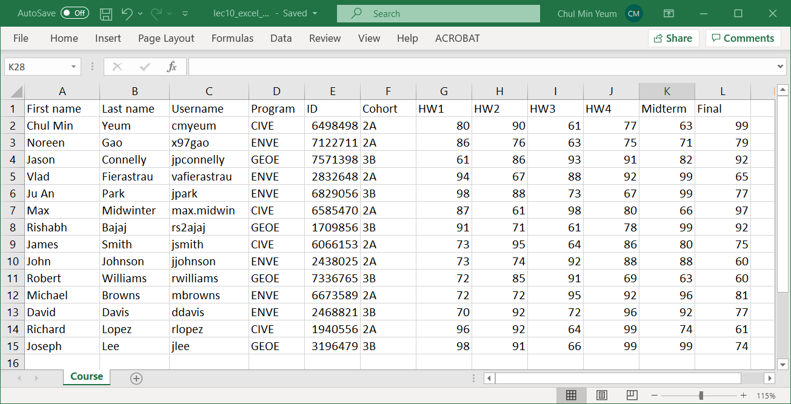
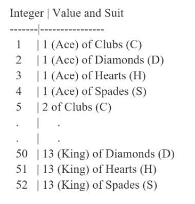
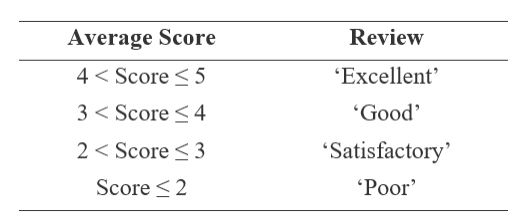
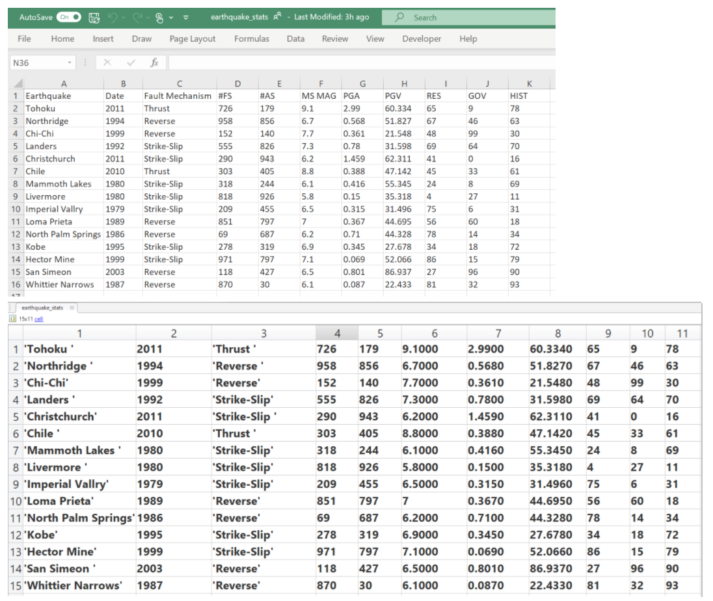
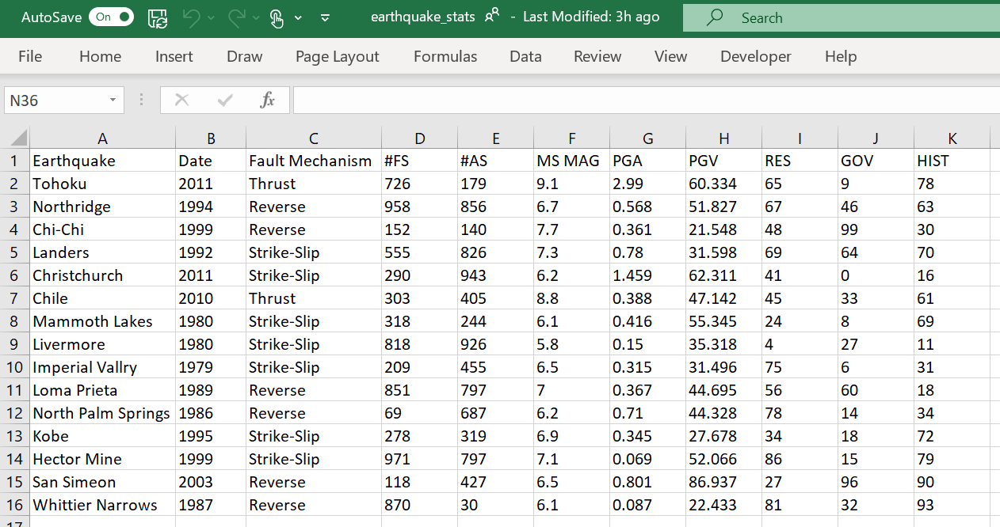
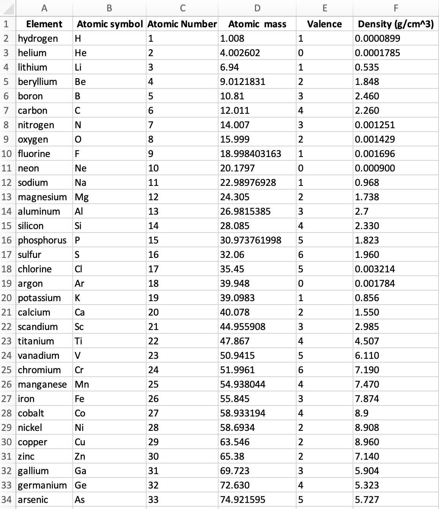
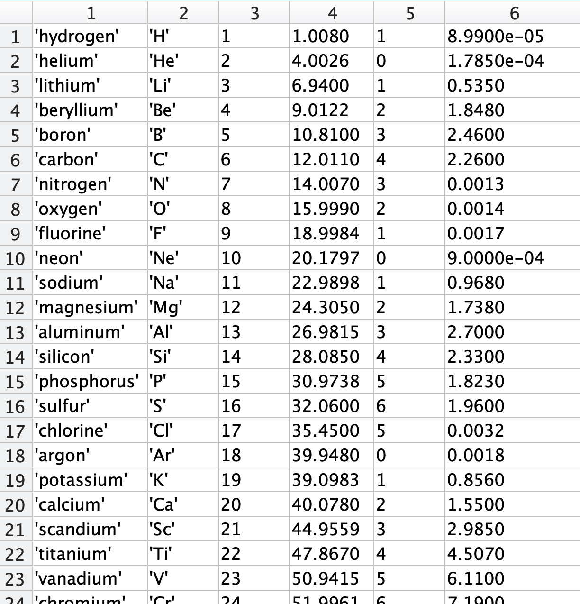

# Module 09: Data Structure

**Last updated:** 2021-08-14

## M09001. Course Data: Cell Array (★★★)
There are 14 students in a class. They are from different civil engineering programs and cohorts. They submitted four assignments and took midterm and final exam. Those information is stored in the following excel file. 



Then, the data is stored in  a cell-type variable named 'class_data'. 


Please write a script to compute the following values using 'class_data'. 
(1) 'num_2A' includes the number of 2A students in the class. 
(2) 'avg_clss_final' includes the avarge of the final exam for all students in the class
(3) 'avg_3B_final' includes the avarge of the final exam for 3B students in the class
(4) 'score_80_exam' include the number of students who received more than 80 either from midterm OR final exam. 
(5) The weight contributions to the final grade for hw1,hw2, hw3, hw4, midterm, and final are 0.1, 0.1, 0.1, 0.2, 0.2, and 0.3, respectively. 
'best_student_name' includes the first name of the best student among all student who received the height final mark. 
(6) 'best_2A_student_name' include the first name of the best student among 2A students who received the height final mark. 
Note that you solution/script should be generally applicable for 'class_data' with different data entry. 
Please do not manually assign the values to compute the values. 

```matlab
load course_data.mat class_data
```
This line is to read a 'class_data' variable stored in a 'course_data.mat' file. For the students who work on this problem in MATLAB editor, you can download the file from here: https://github.com/chulminy/AE_ENVE_GEOE_121/tree/master/tutorial/supplement 

**Solution**
Please watch this: [**https://youtu.be/Lfnj7DJsXak?t=5**](https://youtu.be/Lfnj7DJsXak?t=5)


## M09002. Performance Review (★★)

A large company does performance reviews on its 100 employees. After each meeting, their performance is summarized into a single number from 1 to 5, where 5 represents a great performance and 1 represents a worst performance. The cell array named 'emp_evals' contains the evaluations from all work terms for every employee. 'emp_evals' is a cell variable, where each cell contains the evaluations/work terms of an employee, and is in the form of a numeric row vector. Each employee went through a different number of work terms so the size of a row vector in each cell varies. 

The sample code generating ‘emp_evals’: 

```matlab
emp_evals = cell(1,100); 

for ii=1:100 
    num_work_terms = randi([4 70]);  % generating a random number of work terms ranging from 4 to 70
    emp_evals{ii} = randi(5,1, num_work_terms); % populating each cell with a 1 x 'num_work_terms' numeric vector conataing values ranging from 1 to 5
end 
```

(a) Please design a function named AvgEmpScr, which has one input and one output. The input is ‘emp_evals’ described above. The output named ‘avg_emp_rank’ is a 1 x 100 numeric vector that contains the average score of the evaluations for each employee.  

Here is the function header sytax:

```matlab
function avg_emp_rank=AvgEmpScr(emp_evals)
```

(b) Please design a function named EmpSalary, which has one input and has one output. The input ‘emp_evals’ is described above. The output named ‘salary_emps’ is a 1 x 100 numeric vector that contains the salary for each employee. The salary for each employee is estimated based on his/her average evaluation and its details are shown in the table below:  


Here is the function header sytax:

```matlab
function salary_emps=EmpSalary(emp_evals)
```

Note that you can reuse AvgEmpScr.

**Solution**

```matlab
emp_evals = cell(1,100); 

for ii=1:100 
    num_work_terms = randi([4 70]); % generating a random number of work terms ranging from 4 to 70
    emp_evals{ii} = randi(5,1, num_work_terms); % populating each cell with a 1 x 'num_work_terms' numeric vector conataing values ranging from 1 to 5
end 

%test for AvgEmpScr
avg_emp_rank=AvgEmpScr(emp_evals);

%test for EmpSalary
emp_salary=EmpSalary(emp_evals);

% Please design your functions called AvgEmpScr and EmpSalary

function avg_emp_rank = AvgEmpScr(emp_evals)
avg_emp_rank = zeros(1,100);
for ii = 1:100
    emp_data = emp_evals{ii};
    mn_scr = mean(emp_data);
    avg_emp_rank(ii) = mn_scr;
end
end

function salary_emps = EmpSalary(emp_evals)
ratings = AvgEmpScr(emp_evals);
salary_emps = zeros(1,100);
for ii = 1:100
    if ratings(ii) >= 3.5
        salary_emps(ii) = 60000;
    elseif ratings(ii) < 2
        salary_emps(ii) = 50000;
    else
        salary_emps(ii) = 55000;
    end
end

end
```

## M09003. Cell Arrays (★)

(a) Here are information of three different mineral (quartz, sepentine, and native silver). Please create a 3 x 5 cell array 'rock_info' that stores the following information:


All text information should be saved as character vectors and the numbers should be stored in numeric values. In order to pass the test, you need to store the exact same text in this table to the variable 'rock_info'. Note that the header row (the first row in this table) should not stored in 'rock_info'.

(b) How many minerals having their hardness more than 4? Assign the resulting value to 'hardness_more_4'. 
Note that although you already knew the answer, which is 2, you need to write a script to automatically compute this value from 'rock_info'. 

**Solution**

Please watch this: [https://youtu.be/ZpC4DHlwPKQ?list=PLa1nAPP8qUX9qwRR6Sj_dboIriPIGYgsm&t=5](https://youtu.be/ZpC4DHlwPKQ?list=PLa1nAPP8qUX9qwRR6Sj_dboIriPIGYgsm&t=5)

## M09004. Problem of Poker Game (★★★★)

This problem is exactly the same with M07031. You can copy and paste the model solution and it will not be a cheating but, I Highly encourage the students to design your own solution to solve this problem. Again, I will make one Poker game problem in Q4 (tutorial problems in M07007~M07017 and M07031). If you do not solve those problems and are not familiar with the model solution, you cannot solve the problem in Q4 within a time limit. Please review them carefully. 

The standard 52-card deck has 13 numbers and four different suits. Seven Card Stud is a classic poker game where seven cards are  distributed to each player. Each integer from 1 to 52 will represent the value and suit of a card (see the figure on the right). The order of the number from the **highest to the lowest** is 1, 13, 12, … 2 because the Ace (1) can be either 1 or 14. **The order of the suits from the lowest to the highest is “Clubs”, “Diamonds”, “Hearts”, and “Spades”.**   The input variable named ‘your_card’ is a 1 x 7 vector including seven integers indicating cards with the order below:



(a) Please write a function called **‘ChckTwThrKnd’**, which is to check if there is a two pair of Three-of-a-Kind. 

```matlab
function [is_tw_thr_knd, high_num] = ChckTwThrKnd(your_card)
```
The function has one input of a set of test cards named ‘your_card’ and two outputs. The first output named ‘is_tw_thr_knd’ tells you if there are two pairs of Three-of-a-Kind. The second output named 'high_num', which is the higher card number between two pairs of Three-of-a-Kind. 
If ‘is_tw_thr_knd’ is false (0), ‘high_num’ must be 0. 

**Please keep in mind that  Ace's are the highest valued cards in the poker. (e.g., Ace's are of higher value than kings)**

**Example 1**
```matlab
your_card =  [5 6 7 17 20 19 41]; % card sequence is [2C, 2D, 2H, 5C, 5S, 5H, 11C]; 
[is_tw_thr_knd, high_num] = ChckTwThrKnd(your_card)
```
Then, two output variables becomes
```matlab
is_tw_thr_knd =

  logical

   1

high_num =

     5
```

**Example 2**
```matlab
your_card =  [17 20 19 1 2 3 41]; % card sequence is [5C, 5S, 5H, 1C, 1D, 1H, 13C]; 
[is_tw_thr_knd, high_num] = ChckTwThrKnd(your_card)
```
Then, two output variables becomes
```matlab
is_tw_thr_knd =

  logical

   1

high_num =

     1
```
Again, Ace's are the highest value.  

**Example 3**
```matlab
your_card =  [17 20 19 1 2 50 41]; % card sequence is [5C, 5S, 5H, 1C, 1D, 13D, 13C]; 
[is_tw_thr_knd, high_num] = ChckTwThrKnd(your_card)
```
Then, two output variables becomes
```matlab
is_tw_thr_knd =

  logical

   0


high_num =

     0
```

(b) Please write a function called **‘ChckFls’**, which has one input of a test card set and three outputs.

```matlab 
function [is_fls, suit, high_num] = ChckFls(your_card)
```

The first output named ‘is_fls’ tells you if the rank is ‘Flush’ or not. The second output named ‘suit’ is a string scalar that contains the suit name of the flush sequence. The third output named ‘high_num’ is the highest card number in the flush sequence. If ‘is_fls’ is false (0), ‘suit’ become “None” and 'high_num' becomes 0, respectively.   
Please keep in mind that  Ace's are the highest valued cards in poker. (e.g., Ace's are of higher value than kings)

**Example 1**
```matlab
your_card =  [1 5 13 37 41 3 7]; % card sequence is [1C, 2C, 4C, 10C, 11C, 1H, 2H]; 
 [is_fls, suit, high_num] = ChckFls(your_card)
```
Then, three output variables becomes
```matlab
is_fls =

  logical

   1

suit = 

    "Clubs"

high_num =

     1
```

**Example 2**
```matlab
your_card =  [6 14 38 42 46 4 8]; % card sequence is [2D, 4D, 10D, 11D, 12D, 1S, 2S]; 
 [is_fls, suit, high_num] = ChckFls(your_card)
```
Then, three output variables becomes
```matlab
is_fls =

  logical

   1

suit = 

    "Diamonds"

high_num =

    12
```

**Example 3**
```matlab
your_card =  [7 14 38 42 46 4 8]; % card sequence is [2H, 4D, 10D, 11D, 12D, 1S, 2S]; 
 [is_fls, suit, high_num] = ChckFls(your_card)
```
Then, three output variables becomes
```matlab
is_fls =

  logical

   0

suit = 

    "None"

high_num =

     0
```
**Solution**

Please watch this: [https://youtu.be/ZpC4DHlwPKQ?list=PLa1nAPP8qUX9qwRR6Sj_dboIriPIGYgsm&t=792](https://youtu.be/ZpC4DHlwPKQ?list=PLa1nAPP8qUX9qwRR6Sj_dboIriPIGYgsm&t=792)

## M09005. Coop Scores and Review (★★)

There are 14 students in a class. They are from different civil engineering programs and cohorts. They each have completed six coop placements and recieved a rating from 1-5 for each coop (with 1 representing the lowest score and 5 the highest score). That information is stored in the following excel file. Then, the data is stored in a cell-type variable named 'coop_stats'. 


'coop_stats' is a cell variable, where each cell contains different information about each employee, including their scores for each coop. 'coop_stats' is a 14x12 cell array where the first header row is not included in this variable.
```matlab
load HW7_4.mat coop_stats
```
This line is to read a 'coop_stats' variable stored in a 'HW7_4.mat' file. You will test the following two functions using this variable. (You don't have to manually create the variable). For the students who work on this problem in MATLAB editor, you can download the file from here: https://github.com/chulminy/AE_ENVE_GEOE_121/tree/master/tutorial/supplement 

Please ensure you have saved 'HW7_4.mat' in the same folder as the script for this question to be able to load the file. 

(a) Please design a function named CoopScore, which has one input and two outputs. The input is ‘coop_stats’ described above. The first output named ‘avg_score’ is a column vector that contains the average score of the evaluations for each employee. The size beceoms (# of students) x 1, which is 14 x 1 in this example.  The second output named ‘best_coop_student’ is a character vector that contains the First name of the student with the highest average score.

Here is the function header sytax:
```matlab
function [avg_score, best_coop_student] = CoopScore(coop_stats)
```
Note that you can assume that there is only one highest average score from 'coop_stats'. 

(b) Please design a function named CoopReview, which has one input and has one output. The input ‘coop_stats’ is described above. The output named ‘coop_review' is a cell column array that contains the review for each coop student. Similarily, the size of the array becomes (# of students) x 1, which is a 14 x 1 cell array in this example. Each cell contains a character vector of different lengths containing the review. The review for each employee is estimated based on their average evaluation and its details are shown in the table below:  



Here is the function header sytax:
```matlab
function coop_review = CoopReview(coop_stats)
```
Note that you can reuse CoopScore.  

**Solution**
Please watch this: [https://youtu.be/ZpC4DHlwPKQ?list=PLa1nAPP8qUX9qwRR6Sj_dboIriPIGYgsm&t=2807](https://youtu.be/ZpC4DHlwPKQ?list=PLa1nAPP8qUX9qwRR6Sj_dboIriPIGYgsm&t=2807)

## M09006. Earthquake Statistics (Cell Array) (★★★)

Earthquake statistics for 15 different earthquakes are included in an Excel file, this information includes the earthquake name, date the earthquake occurred, the fault mechanism, number of foreshocks, number of aftershocks, the mainshock magnitude, the peak ground acceleration (PGA), peak ground velocity (PGV), and the number of residential, government, and historical buildings damaged during the earthquake (in thousands). 
That information is stored in the following excel file. Then, the data is stored in a cell-type variable named 'earthquake_stats'. 



'earthquake_stats' is a **cell** variable, where each cell contains different information about each earthquake. 'earthquake_stats' is a 15x11 cell array where the first header row is not included. 
```matlab
load HW7_5.mat earthquake_stats
```
This line is to read a 'earthquake_stats' variable stored in a 'HW7_5.mat' file. For the students who work on this problem in MATLAB editor, **you can download the file from here**: https://github.com/chulminy/AE_ENVE_GEOE_121/tree/master/tutorial/supplement
Please ensure you have saved 'HW7_5.mat' in the same folder as the script for this question to be able to load the file. 

Write a script that creates a variable named:
(a) 'order_names' which is a **15x1 cell array** containing the names of all earthquakes in order by the date they occurred (the oldest earthquake to the most recent). 
Note that when the earthquake happended at the same years, you need to list the name at the earliest row in 'earthquake_stats'. 

(b) 'fault_mech' which is **a character vector** containing the name of the fault mechanism for the earthquake with the highest PGV value.  

(c) 'max_mag_damg' which is **a scalar value** containing the mainshock magnitude of the earthquake with the largest total number of damaged buildings (total includes residential, governmental, and historical buildings).

(d) 'fs_as_sums' which is a **column vector** containing the sum of foreshocks and aftershocks for earthquakes that have a PGA over 0.5. 

**Solution**
Please watch this: [https://youtu.be/ZpC4DHlwPKQ?list=PLa1nAPP8qUX9qwRR6Sj_dboIriPIGYgsm&t=3884](https://youtu.be/ZpC4DHlwPKQ?list=PLa1nAPP8qUX9qwRR6Sj_dboIriPIGYgsm&t=3884)

## M09007. Mega Cities (★★)
Data from 40 megacities are included in an Excel File. This information includes the cities name, latitude (how north/south) , longitude (how west/east), the country its in, what kind of capital city it is, and the population of the city.

That information is stored in the following excel file. Then, the data is stored in a 40x6 cell array named 'MegaCities'. 

The .mat can be downloaded from the following link: https://github.com/chulminy/AE_ENVE_GEOE_121/blob/master/tutorial/supplement/HW7Q1.mat

Excel Spreadsheet:                                                                                                        

Cell Array in MATLAB:


(a) Calculate the number of cities that are 'primary' capital cities and assign it to '**primary_tot**'.

(b) Find the names of the cities that are in the Southern Hemisphere and the country its in (latitude is smaller than 0 when at the Southern Hemisphere), assigning it to a 'num' x 2 cell array named '**south**' where 'num' is the number of Southern Hemisphere cities. The first column should be the city name and the 2nd column should be the country. Keep the same row order as in the original cell array.

(c) Find the total population of all the megacities combined and assign it to '**pop_tot**'

**Solution**
```matlab
load HW7Q1.mat MegaCities

% (a) 
primary_tot = sum(strcmp(MegaCities(:,5),'primary'));

% (b)
south_idx = cell2mat(MegaCities(:,2))<0;
south = MegaCities(south_idx,[1,4]);

% (c)
pop_tot = sum(cell2mat(MegaCities(:,6)));
```

## M09008. Earthquake Statistics (function) (★★★)
Earthquake statistics for 15 different earthquakes are included in an Excel file. This information includes the earthquake name, date the earthquake occurred, the fault mechanism, number of foreshocks, number of aftershocks, the mainshock magnitude, the peak ground acceleration (PGA), peak ground velocity (PGV), and the number of residential, government, and historical buildings damaged during the earthquake (in thousands). 

That information is stored in the following excel file. Then, the data is stored in a cell-type variable named 'earthquake_stats'. 



'earthquake_stats' is a **cell** variable, where each cell contains different information about each earthquake. 'earthquake_stats' is a 15x11 cell array where the first header row is not included. 
```matlab
load Q4_1.mat earthquake_stats
```
This line is to read a 'earthquake_stats' variable stored in a 'Q4_1.mat' file. For the students who work on this problem in MATLAB editor, you can **download the file from here**: https://github.com/chulminy/AE_ENVE_GEOE_121/tree/master/tutorial/supplement

Please ensure you have saved 'Q4_1.mat' in the same folder as the script for this question to be able to load the file. 

(a)  Create a function called '**FaultMechQuakes**' which has two inputs 'earthquake_stats' and 'fault_mech' and one output 'fault_quake_stats' 
```matlab
function fault_quake_stats = FaultMechQuakes(earthquake_stats, fault_mech)
```
The output 'fault_quake_stats' provides a cell array containing all of the information for earthquakes of a certain fault mechanism specified by 'fault_mech' which can either be 'Thrust', 'Reverse' or 'Strike-Slip'

For example, if the function is called and 'Thrust' is specified for 'fault_mech'
```matlab
fault_quake_stats = FaultMechQuakes(earthquake_stats, 'Thrust')
```
The output for 'fault_quake_stats' would including the corresponding rows like:


(b) Create a variable called 'new_earthquake_stats' which is a **cell array** that reports the information for earthquakes with a 'Reverse' fault mechanism but remove rows from the cell array if their PGV is less than 30. 

**You MUST use the function you made, 'FaultMechQuakes' to solve this problem.**


in the above example, there is no 'Chi-Chi' and 'Whittier Narrows' earthquake rows of which fault mech is Reverse because their PGV is less than 30. 

(c) Create a variable called 'mag_ss' which is a **row vector** containg the **magnitude** of Strike-Slip earthquakes if their sum of FS amd AS are over 1000.  

**You MUST use the function you made, 'FaultMechQuakes' to solve this problem.**


**Solution**
```matlab
load Q4_1.mat earthquake_stats

%Questions for Function 1 

%Remove earthquakes with reverse mechanism if PGV is less than 30
reverse_quakes = FaultMechQuakes(earthquake_stats, 'Reverse');
under_30 = [reverse_quakes{:,8}]<30;
new_earthquake_stats = reverse_quakes;
new_earthquake_stats(under_30,:)=[];

%Report magnitude of strike-slip earthquakes if their sum of FS and AS was over 1000
ss_quakes = FaultMechQuakes(earthquake_stats, 'Strike-Slip');
sum_fs_as = sum(cell2mat(ss_quakes(:,4:5)),2);
over_1000=sum_fs_as>1000;
mag_ss=[ss_quakes{over_1000,6}];


%Function 1: Create function to create cell array of earthquakes with desired fault mechanism 
function fault_quake_stats = FaultMechQuakes(earthquake_stats, fault_mech)
if isequal(fault_mech, 'Thrust')
    quake_id = strcmp(string(earthquake_stats(:,3)), "Thrust");
    fault_quake_stats = earthquake_stats(quake_id,:);
elseif isequal(fault_mech, 'Reverse')
    quake_id = strcmp(string(earthquake_stats(:,3)), "Reverse");
    fault_quake_stats = earthquake_stats(quake_id,:);
elseif isequal(fault_mech, 'Strike-Slip')
    quake_id = strcmp(string(earthquake_stats(:,3)), "Strike-Slip");
    fault_quake_stats = earthquake_stats(quake_id,:);
end 

end 
```

## M09009. Cell Array Processing (★)
```matlab
c_arr = cell(1, 100);
for ii=1:100
    n = randi(100);
    c_arr{ii} = randi(100, 1, n);
end
```
'c_arr' is a 1 x 100 cell array of which contains various length row vectors. Each row vector contains integer numbers. 

(a) Find the maximum size of the row vectors in 'c_arr' and assign its number to 'max_length'. 

(b) How many 10 in the vectors in 'c_arr'. Count the number of 10 in all vectors in 'c_arr' and assign a resulting value to 'num_10'. 

(c) Create a variable, named 'mean_c_arr', which is a 1 x 100 row vector. You need to compute a mean value of each row vector and store it into a corresponding location in 'mean_c_arr'. 

**Solution**
```matlab
c_arr = cell(1, 100);
for ii=1:100
    n = randi(100);
    c_arr{ii} = randi(100, 1, n);
end

% your code here
% (a)
len_arr = zeros(1,100);
for ii=1:100
    len_arr(ii) = numel(c_arr{ii});
end
max_length = max(len_arr);

% (b)
num_10 = 0;
for ii=1:100
    num_10 = num_10 + sum(c_arr{ii} == 10);
end

% (c)
mean_c_arr = zeros(1, 100);
for ii=1:100
   mean_c_arr(ii) = mean(c_arr{ii}); 
end
```

## M09010. Periodic Elements Data (★★★)
Various data on the periodic elements are included in an Excel file, this information includes the element names, their atomic symbol (case sensitive character vector), atomic number, atomic mass, number of valence electrons, and their density. Data is available for 107 of the known elements.

That information is stored in the following excel file. Then, the data is stored in a cell-type variable named 'periodic_data'. 

Excel file:


MATLAB-Workspace:


'periodic_data' is a **cell** variable, where each cell contains different information about each element. 'periodic_data' is a 107x6 cell array where the first header row is not included. 
```matlab
load Lab7_4_S22.mat periodic_data
```
This line is to read a 'periodic_data' variable stored in a 'Lab7_4_S22.mat' file. For the students who work on this problem in MATLAB editor, **you can download the file from here**: https://github.com/chulminy/AE_ENVE_GEOE_121/tree/master/tutorial/supplement

Please ensure you have saved 'Lab7_4_S22.mat' in the same folder as the script for this question to be able to load the file. 

You are going to write a script to assist a scientist's research:

(a) Create '**dense_elem**' which is a **107x1 cell array** containing the names of all elements in order of descending density (the densest element to the least dense). 

(b) The scientist is primarily interested in 5 elements whose names are stored in '**elem_5**', a 5x1 cell array. 

Create a new **5x6 cell array** called '**just_5**' which contains all periodic data for those 5 elements. 

(c) A binary compound of oxygen and an unknown element, X, has the formula XO. The compound's molar mass is given by the variable 'mol_mass'. 

Determine the atomic symbol (case sensitive) of the unknown element X and assign to 'x_elem' which is a **character vector**. Note that you need to use the data provided in 'periodic_data'. 

Given various factors such as isotopes and error in the data, the mass contributed to XO by the unknown element X will not exactly match one of the elements in the array. 

**Find the closest match possible**. In other words, you need to find 'x_elem', where the mass of 'oxygen' + the mass of 'x_elem' are the closest to 'mol_mass'.

**Solution**
```matlab
load Lab7_4_S22.mat periodic_data
elem_5 = periodic_data(randi([1 107],5,1),1);
mol_mass = (rand(1)*538)+18; %molar mass between 18-556

% (a)
[~, idx] = sort([periodic_data{:,6}],'descend');
dense_elem = periodic_data(idx,1);

% (b)
just_5 = cell(5,6);
for ii = 1:5
    lg = strcmp(periodic_data(:,1),elem_5{ii});
    just_5(ii,:) = periodic_data(lg,:);
end

% (c)
ox_loc = strcmp(periodic_data(:,1),'oxygen');
ox_mass = periodic_data{ox_loc,4};
atm_weight = (mol_mass - ox_mass);
diff = abs([periodic_data{:,4}] - atm_weight);
[~, pos] = min(diff);
x_elem = periodic_data{pos,2};
```

## M09011. Megacity Function (★★★)
Data from 40 megacities are included in an Excel File. This information includes the cities name, latitude (how north/south), longitude (how west/east), the country its in, what kind of capital city it is, and the population of the city.

That information is stored in the following excel file. Then, the data is stored in a 40x6 cell array named 'MegaCities'. 

The .mat can be downloaded from the following link: https://github.com/chulminy/AE_ENVE_GEOE_121/blob/master/tutorial/supplement/Lab7Q5.mat

Excel Spreadsheet:   


Cell Array in MATLAB:


(a) Create a function that accepts 3 inputs: 'cell_in', 'list', and 'lg'. 'cell_in' will be the 40x6 cell array, 'list' is a 22 x 1 cell array that is a list of countries that have a megacity, and 'lg' is a numeric value.
```matlab
function list_output = MultiCity(cell_in, list,lg)
```
The function should:
* Find the name of countries in 'list' that have only 1 megacity when 'lg' is 0
* Find the name of countries in 'list' that have more than 1 megacity when 'lg' is 1
The name of countires should be assigned to 'list_output' as a num x 1 **cell array** where 'num' is the number of countries that are applicable. The cell array should be in the same order given in 'country_list'.

```matlab
one_city = MultiCity(MegaCities,country_list,0)

one_city =

  16×1 cell array

    {'Argentina'                       }
    {'Bangladesh'                      }
    {'Democratic Republic of the Congo'}
    {'Egypt'                           }
    {'France'                          }
    {'Indonesia'                       }
    {'Iran'                            }
    {'Mexico'                          }
    {'Nigeria'                         }
    {'Philippines'                     }
    {'Russia'                          }
    {'South Korea'                     }
    {'Thailand'                        }
    {'Turkey'                          }
    {'United Kingdom'                  }
    {'Vietnam'                         }
    
multi_city = MultiCity(MegaCities,country_list,1)

multi_city =

  6×1 cell array

    {'Brazil'       }
    {'China'        }
    {'India'        }
    {'Japan'        }
    {'Pakistan'     }
    {'United States'}
```
(b) Createa function that accepts 3 inputs: 'cell_in', 'val', and 'direction'. 'cell_in' will be the 40x6 cell array (MegaCities), 'val' is a numeric value and 'direction' is a character vector.
```matlab
function city = CloseCity(cell_in,val,direction)
```
The function:
* When directioin is 'lat' , find the city with the closest **latitude** value to 'val'
* When directioin is 'long' , find the city with the closest **longitude** value to 'val'
The name of the closest city should be output **a character vector** containing a corresponding city name. 

**Solution**
```matlab
load Lab7Q5.mat MegaCities

% Part A
[~,idx] = unique(MegaCities(:,4));
country_list = MegaCities(idx,4);
one_city = MultiCity(MegaCities,country_list,0);
multi_city = MultiCity(MegaCities,country_list,1);

% Part B
latitude_val = rand(1)*180-90;
longitude_val = rand(1)*360-180;
close_lat = CloseCity(MegaCities,latitude_val,'lat');
close_long = CloseCity(MegaCities,longitude_val,'long');


function output = MultiCity(cell_in,list,lg)

num_city = zeros(1,22);

for ii = 1:22
    num_city(ii) = sum(strcmp(cell_in(:,4),list(ii)));
end
if lg == 0
    idx = num_city == 1;
elseif lg ==1
    idx = num_city > 1;
end
output = list(idx);

end

function city = CloseCity(cell_in,val,direction)

if isequal('lat',direction)
    vec = cell2mat(cell_in(:,2));
elseif isequal('long',direction)
    vec = cell2mat(cell_in(:,3));
end

diff = abs(vec-val);
[~,idx] = min(diff);
city = cell_in{idx,1};

end
```
