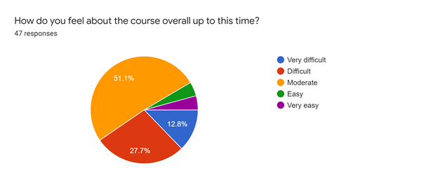
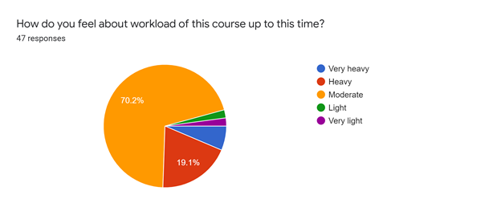
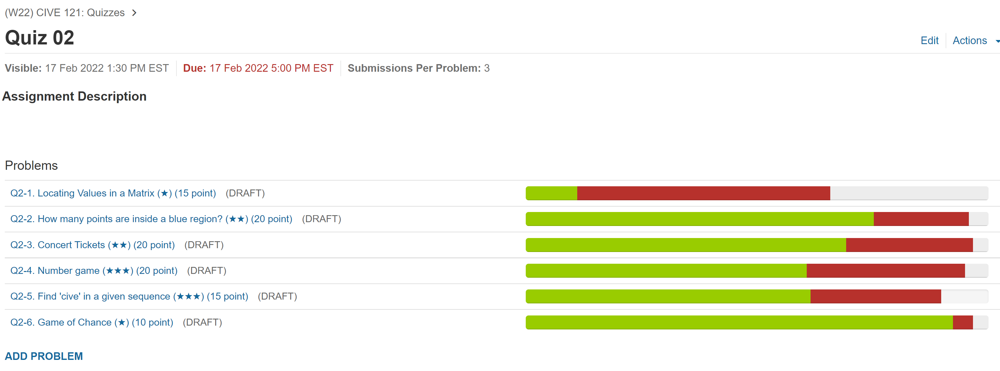
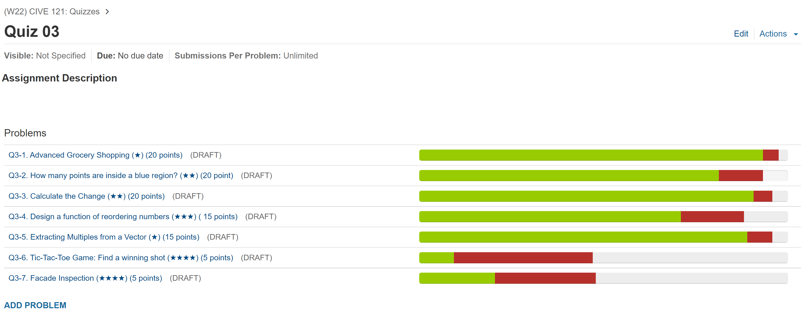

# Feedback Review for Quiz 3

## Survey Results
47 students responded to the survey and the results are presented below: 

### Q. How did you feel about your second quiz? Note that the target overall average is 70-80.

### Q. How do you feel about the course overall up to this time?

### Q. How do you feel about workload of this course up to this time?

### Q2 Grader Report 

### Q3 Grader Report

Q3-1: 109/117  
Q3-6: 11/117  
Q3-7: 24/117  

## Overview
Our teaching team will reflect your feedback and update our course and upcoming quizzes. 

* There will be **only one** 4-star question in Q4. 
* There is a Poker game question so please solve poker game question as soon as possible. 
* There will be a 4-hour lab on March 31. 
* For upcoming quizzes, you can use both your laptop and a desktop computer in the computer lab during the quiz. It would be nice to use the desktop for showing quiz problems and your laptop for programming (and vice versa). However, you **CANNOT** your tablets or phones. Also, you can use a noise-canceling headset or listen to music if they are helpful for you to focus on your quiz. However, you need to control the volume not to disturb other students.
 

