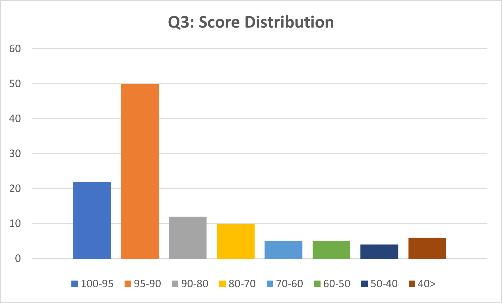

# Q3 Result

## Class average 

**80.55 / 100**

## Score Distribution

## Average by problems
|Q3-1 (20 pt)|Q3-2 (20 pt)|Q3-3 (20 pt)|Q3-4 (15 pt)|Q3-5 (15 pt)|Q3-6 (5 pt)|Q3-7 (5 pt)|
|:---|:---|:---|:---|:---|:---|:---|
|19.30|16.67|17.98|11.43|13.68|0.48|1.00|

