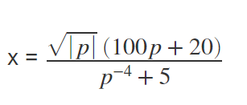

# Module 01: Basic MATLAB Programming

## M01001. Built-In Functions (★) 

```matlab
% https://www.mathworks.com/help/matlab/ref/rand.html
r1 = 12*(rand(1)*2-1); % a random real number between -12 and 12
r2 = 12*(rand(1)*2-1); % a random real number between -12 and 12
```
You need to write a script that creates a variable named:
(a) 's_a' which is copied from 'r1'. Please round-off the value in 's_a' towards the nearest integer. 
(b) 's_b' which is copied from 'r1'. Please round-off the value in 's_b' towards negative infinity. 
(c) 's_c' which is copied from 'r2'. Please round-off the value in 's_c' towards positive infinity. 
(d) 'l_d'. If the 'r1' is larger than 'r2', assign 'true' to 'l_d'. Otherwise, assign 'false'. 
(e) 'l_e'. If the absolute value of 'r1' is larger than the absolute value of 'r2', assign 'true' to 'l_d'. Otherwise, assign 'false'. 

**Solution**  
Please watch this:[**https://youtu.be/nYWJNN0uQCg?t=21**](https://youtu.be/nYWJNN0uQCg?t=21)

## M01002. Operator Precedence (★★)

```matlab
x = randi([1 14]); % returns an integer drawn from the interval [1, 14]
y = randi([1 14]); % returns an integer drawn from the interval [1, 14]
z = randi([1 14]); % returns an integer drawn from the interval [1, 14]
```

(a) Write a code to check if x lies in more than 5 and less than 10. If yes, assign 'true' to 'l_a' and otherwise 'false'. 
(b) Write a code to check if y + 2 lies in less than 5 or more than 10. If yes, assign 'true' to 'l_b' and otherwise 'false'. 
(c) Write a code to check if y + 2 is the same as x. If yes, assign 'true' to 'l_c' and otherwise 'false'. 
(d) Write a code to check if x + y is more than z and less than 10. If yes, assign 'true' to 'l_d' and otherwise 'false'.

**Solution**  
Please watch this:[**https://youtu.be/nYWJNN0uQCg?t=792**](https://youtu.be/nYWJNN0uQCg?t=792)

## M01003. Triangle Problem (★)

Given the variable lengths of 'A', 'B', 'C', determine whether a triangle with those sides lengths is a right triangle. 
Here, C is the hypotenuse: (https://en.wikipedia.org/wiki/Right_triangle). 

Check to see if each side creates a right angle triangle when:
a) the lengths of 'A', 'B', and 'C' are 3, 4, and 5, respectively. If yes, assign 'true' to 'tri_check_a', otherwise false. 
b) the lengths of 'A', 'B', and 'C' are 10, 5, and 12, respectively. If yes, assign true to 'tri_check_b', otherwise false. 
c) the lengths of 'A', 'B', and 'C' are 8,  6, and 10, respectively. If yes, assign true to 'tri_check_c', otherwise false. 

**Solution**  
Please watch this:[**https://youtu.be/nYWJNN0uQCg?t=1424**](https://youtu.be/nYWJNN0uQCg?t=1424)

## M01004. Swap Three Numbers (★★) 
Sarah has a younger cousin Ellie in Grade 7, and her school is currently covering the content of right-angle triangles. However,
Ellie is very bad at remembering names, and she always interprets a hypotenuse side as an adjacent side, an adjacent side as an opposite side, and an opposite side as a hypotenuse side. One day Sarah was checking Ellie's math assignment, and she found out Ellie made this  mistake again. Please correct Ellie's mistake and assign the right values for 'hypo', 'adj', and 'oppo'. Here, the values for 'hypo', 'adj', and 'oppo' are randomly generated, which are assumed to be written by Ellie.(e.g. The mistake she made is that she assigned the value of hypotenuse to adjacent etc.) 

**Solution**  
Please watch this:[**https://youtu.be/nYWJNN0uQCg?t=2001**](https://youtu.be/nYWJNN0uQCg?t=2001)

## M01005. Arithmetic Operations (★)

Suppose you are trying to build a tree house with metric tools using imperial instructions (no metric instruction). Note that 'N','G','A','B' are all random variables in this question.

a) The first step of the instructions asks you to make the walls N inchs. What would be the length of the walls from the instructions if you were to convert them in centimeter (cm)? 
Please assign the value to the variable named as 'side_length'. 
b) Next, the instruction manual asks to make the walls G feet tall. How tall are the walls in meters? 
Please assign the value to the variable named as 'side_height'. 
c) Afterwards you are asked to make rectangular windows. The base of the windows are A inch(s) while the height is B inch(s). 
What will be the area (in cm^2) of the windows? 
Please assign the area value to the variable named as 'window_area'. 

**Solution**  
Please watch this:[**https://youtu.be/nYWJNN0uQCg?t=2271**](https://youtu.be/nYWJNN0uQCg?t=2271)

## M01006. Rounding Function (★★) 

```matlab
% https://www.mathworks.com/help/matlab/ref/randi.html
x = randi([-20 20]); % returns an integer drawn from the interval [-20, 20]
y = randi([-20 20]); % returns an integer drawn from the interval [-20, 20]
```
(a) Write a script to compute a quotient when you divide x by y without using rem(x,y). The quotient should be stored in 's_a'. 
(b) Write a script to compute a remainder without using rem(x,y) function when you divide x by y. The remainder should be stored in 's_b'. 

Note that x and y are given. 

**Solution**  

```matlab
% https://www.mathworks.com/help/matlab/ref/randi.html
x = randi([-20 20]); % returns an integer drawn from the interval [-20, 20]
y = randi([-20 20]); % returns an integer drawn from the interval [-20, 20]

%(a)
s_a = fix(x/y);

%(b)
s_b = x-s_a*y;
```

## M01007. Swap Numbers (★★)
For a field surveying trip, a  surveying team was required to measure the elevations of a few locations. We create variables called elev_A, elev_B, elev_C, and elev_D, and assign the corresponding elevation values to them. Here, the values for 'elev_A', 'elev_B', 'elev_C', and 'evel_C', 'elev_D' are randomly generated. However, it turned out that one of the members misread the numbers (i.e. the value of location A was assigned to elev_D, the value of location B was assigned to elev_A, the value of location C was assigned to elev_B,  the value of location D was assigned to elev_C, etc.) 

Please fix this problem and assign the right elevation values to the corresponding variables. 

**Solution**  

```matlab
elev_A = randi(100); % a random scalar integer between 1 and 100
elev_B = randi(100); % a random scalar integer between 1 and 100
elev_C = randi(100); % a random scalar integer between 1 and 100
elev_D = randi(100); % a random scalar integer between 1 and 100

tmp = elev_D;% temporary assign variables
elev_D = elev_C;
elev_C = elev_B;
elev_B = elev_A;
elev_A = tmp;
```

## M01008. rem Function (★) 

In January of 2020, there was a presentation competition called "Living Planet at campus", which was sponsored by WWF. Helena heard that there were 1200~1300  individuals who submitted their applications. The organizer wanted to divide them into a group of 3, 4, or 5. In order to promote fair competition, they wanted to make sure the number of members of each group is the same. You are going to write a script to check if they can make this possible?
 
Create three variables, 'test_3', 'test_4', and 'test_5' to check if the partipants can be exactly divided into gorups of 3, 4, or 5 (Each group is required to have the same number of members). The number of participants is randomly generated in the given code. Note that your ouput for these variables is required to be logical (either a logical 0 or a logical 1).

**Solution**  

```matlab
num_parti = randi([1200 1300],1); % # of participants

% tests to check of the number of participants can be divisible by 3, 4, or 5
test_3 = rem(num_parti,3) == 0;
test_4 = rem(num_parti,4) == 0;
test_5 = rem(num_parti,5) == 0;
```

## M01009. Type Casting and rem Function (★★)
Karen is obsessed with gashapon Machines, which would give you one candy capsule with a different number of candies each time when you play them.  The number of candies in a capsule would be 1~20. One day, **Karen was with two of her friends**, and they played the machine for 4 times. Four variables, called cap1, cap2, cap3, and cap4, were the number of candies in the capsule each time they got from the machine respectively. They wanted to split the candies equally every round. Create four variables, lg1, lg2, lg3, and lg4 (type logical), to test if they cannot split the candies equally every round. Assign logical 1 in each variable if they **cannot** split the candies equally. Also, create a variable called num_3 to count how many times out of these 4 rounds they **cannot** split their candies equally.

**Solution**  

```matlab
cap1 = randi([1 20],1);
cap2 = randi([1 20],1);
cap3 = randi([1 20],1);
cap4 = randi([1 20],1); %the number of candies in the capsule each time (randomly generated)

% write your code here
lg1 = rem(cap1,3) ~= 0;
lg2 = rem(cap2,3) ~= 0;
lg3 = rem(cap3,3) ~= 0;
lg4 = rem(cap4,3) ~= 0;
num_3 = lg1 + lg2 + lg3 +lg4;
```

## M01010. Operator Precedence (★★)
```matlab
x = randi([1 15]); % returns an integer drawn from the interval [1, 15]
y = randi([1 15]); % returns an integer drawn from the interval [1, 15]
z = randi([1 15]); % returns an integer drawn from the interval [1, 15]
```
(a) Write a code to check if x+z is greater than y **and** less than y+5. If yes, assign 'true' to 'lg_a' and otherwise 'false'.
(b) Write a code to check if x is greater than 6 **and** less than 12 **and** is not equal to y. If yes, assign 'true' to 'lg_b' and otherwise 'false'. 
(c) Write a code to check if x is greater than 5 **and** less than 10 **or** is less than y+z.If yes, assign 'true' to 'lg_c' and otherwise 'false'.
(d) Write a code to check if y+3 is greater than 6 **or** less than z **or** is equal to x+z.If yes, assign 'true' to 'lg_d' and otherwise 'false'.
(e) Write a code to check if x * 5 is less than x^2 **and** is not equal to z. If yes, assign 'true' to 'lg_e' and otherwise 'false'.

**Solution**
Please watch this: [https://youtu.be/N7PcDAdsLyE?list=PLa1nAPP8qUX9qwRR6Sj_dboIriPIGYgsm&t=9](https://youtu.be/N7PcDAdsLyE?list=PLa1nAPP8qUX9qwRR6Sj_dboIriPIGYgsm&t=7)

## M01011. Rem and Round Function (★)
```matlab
x = randi([-50 200])/10; % returns an integer drawn from the interval [-50, 200] and divides by 10 to obtain a decimal value
y = randi([-50 200])/10; % returns an integer drawn from the interval [-50, 200] and divides by 10 to obtain a decimal value
z = randi([-50 200])/10; % returns an integer drawn from the interval [-50, 200] and divides by 10 to obtain a decimal value
```
Kasturi is working on a project where she measures the daily average temperature (in degree Celcius) for Waterloo, Kitchener, and Cambridge.
These values are stored in variables x, y and z. However, in order to use these values in her project, she needs the following information:
a) The nearest integer temperature values for x, y and z stored in variables named x1, y1 and z1 respectively.
b) The nearest integer greater than or equal to temperature '(x + 5) divided by 2' stored in a variable named x2.
c) The nearest integer towards zero to temperature 'y minus 3' stored in a variable named y2.
d) The nearest integer lesser than or equal to temperature 'z divided by 4' stored in a variable named z2.
e) She also needs to know if x1, y1 and z1 are even or odd temperature values and store the answers in variables lg_x, lg_y, lg_z respectively. 
Note that variables lg_x, lg_y and lg_z being '1' indicates an even temperature value whereas '0' indicates an odd temperature value.
x, y and z values are already provided in the question, so please **DO NOT** generate or change any values in x, y and z.

**Solution**
Please watch this: [https://youtu.be/N7PcDAdsLyE?list=PLa1nAPP8qUX9qwRR6Sj_dboIriPIGYgsm&t=788](https://youtu.be/N7PcDAdsLyE?list=PLa1nAPP8qUX9qwRR6Sj_dboIriPIGYgsm&t=788)

## M01012. Type Casting and abs Function (★★)
You and your friend are playing a dice game on a six-sided dice. Each of you rolls the dice and the numbers you roll are subtracted from one another. You play three rounds of this game, the first and second roll in each round are labled with the variables r1_1 (round 1, roll 1), r1_2 (round 1, roll 2), r2_1 (round 2, roll 1) and so on. To calculate the number, the second roll is subtracted from the first roll in each round where you roll first and your friend rolls second (ex. r1_1-r1_2). You get a point if the calculated number is positive (including zero) and your friend gets a point if the number is negative.
  
Create three variables, lg1, lg2, lg3 (logical type) to test if you win a point for each of the three rounds (positive number is calculated). 
Also create a variable called total_points to calculate how many points you have earned after three rounds.

**Solution**
Please watch this: [https://youtu.be/V308jjgmOts?list=PLa1nAPP8qUX9qwRR6Sj_dboIriPIGYgsm&t=5](https://youtu.be/V308jjgmOts?list=PLa1nAPP8qUX9qwRR6Sj_dboIriPIGYgsm&t=5)

## M01013. Arithmetic Problem (★)
```matlab
g_i = 32.174; %value of acceleration due to gravity in feet/seconds^2 (ft/s^2)
h_i = randi([1 20]); %generates a random value for height of fluid in feet (ft)
rho_i = randi([60 845]); %generates a random value for density of fluid in pounds/feet^3 (lb/ft^3)

P0_m = 101325; %value of air pressure at sea level in kilograms/(meter*second^2) (kg/(m*s^2))
```
Kasturi has been given values for acceleration due to gravity (g_i), fluid height (h_i) and fluid density (rho_i) for an unknown fluid in the **imperial** system. She needs to find total fluid pressure at given height in the tank in the metric system. She has also been provided with the value for air pressure at the top (P0_m) in **metric** units which doesn't requires unit conversion.
For that:
(a) Convert value of g_i to meter/second^2 (m/s^2) and assign value to g_m. 
(b) Convert value of h_i to meters (m) and assign value to h_m.
(c) Convert value of rho_i to kilograms/meter^3 (kg/m^3) and assign value to rho_m.
(d) Find fluid pressure at height h_m and assign value to P1_m. [answer should be reported in kilograms/(meter * second^2) (kg/(m * s^2))]
(e) Find total pressure at height h_m and assign value to P_m. [answer should be reported in kilograms/(meter * second^2) (kg/(m * s^2))]

**IMPORTANT INFORMATION (Please use these numbers)**
1 ft = 0.3048 m
1 lb = 0.45 kg
Formula for Fluid Pressure: P1 = g * h * rho
Formula for Total Pressure: P = P0 + (g * h * rho)
Please note that the values for variables g_i, h_i and rho_i have been provided in imperial units while the value for P0_m has been provided in metric units. 

**Solution**
Please watch this: [https://youtu.be/V308jjgmOts?list=PLa1nAPP8qUX9qwRR6Sj_dboIriPIGYgsm&t=990](https://youtu.be/V308jjgmOts?list=PLa1nAPP8qUX9qwRR6Sj_dboIriPIGYgsm&t=990)

## M01014. Swapping Numbers and Relational Operators (★★)
You are in the lab and have tested the Mohs hardness of four mineral samples and assigned those values to the variables smpl_1, smpl_2, smpl_3, smpl_4. However, your samples got mixed up after testing (the Mohs hardness of sample 1 was assigned to smpl_3, 2 was assigned to smpl_1, 3 was assigned to smpl_4, and 4 was assigned to smpl_2). First, write a script to assign the correct Mohs hardness to each sample variable.

Now that each sample has the correct Mohs hardness assigned to it, you want to figure out how many of your samples have a hardness of over 5 (note that Mohs hardness is a scale from 1-10). Write a script which calculates the number of samples that have a hardness over 5 and assign that value to the variable named total_smpls.

**Solution**
Please watch this: [https://youtu.be/V308jjgmOts?list=PLa1nAPP8qUX9qwRR6Sj_dboIriPIGYgsm&t=1672](https://youtu.be/V308jjgmOts?list=PLa1nAPP8qUX9qwRR6Sj_dboIriPIGYgsm&t=1672)

## M01015. Arithmetic, Relational and Logical Operators (★★)
```matlab
p_k = randi([-2 2]); %generates integer value -2 or 2 to indicate value used by Kasturi
p_b = randi([-2 2]); %generates integer value -2 or 2 to indicate value used by Bianca
p_c = randi([-2 2]); %generates integer value -2 or 2 to indicate value used by Chul Min
```
Chul Min and the TAs are working on solving a question where they need to find the value of x from a given p. However, they had to refer to a list of values and unknowingly used three different lists for the variable p in their equation. Their p values could match with each other or be completely different.  Kasturi used 'p_k', Bianca used 'p_b' and Chul Min used 'p_c', which have been provided to you.



(a) Check if both Kasturi and Bianca's p values match with Chul Min's p. If both p values match Chul Min's p, assign true to a variable named 'case_1', else assign false to the variable.
(b) Check if either Kasturi's or Bianca's p value matches Chul Min's p. If either (or both) p value(s) matches Chul Min's p, assign true to a variable named 'case_2', else if neither p values matches Chul Min's p, assign false to 'case_2'.
(c) Assuming that 'p_c' is the correct p value, calculate the value of x and store in a variable named 'x_c'.

**Solution**
Please watch this: [https://youtu.be/V308jjgmOts?list=PLa1nAPP8qUX9qwRR6Sj_dboIriPIGYgsm&t=2390](https://youtu.be/V308jjgmOts?list=PLa1nAPP8qUX9qwRR6Sj_dboIriPIGYgsm&t=2390)
