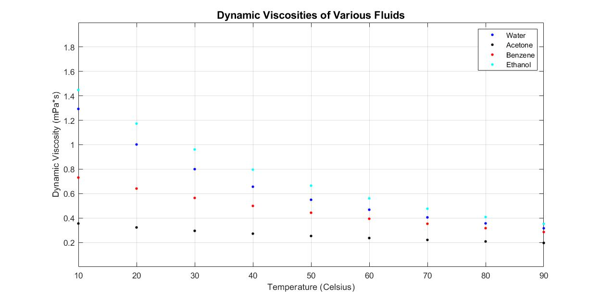
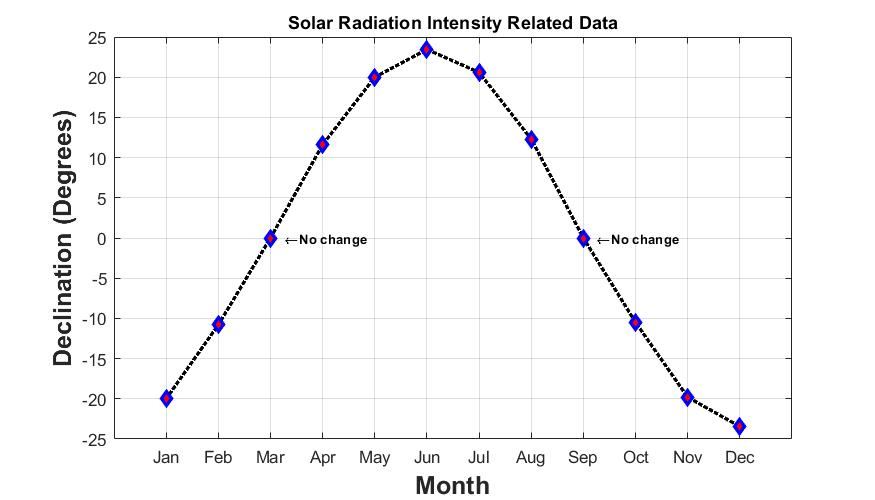
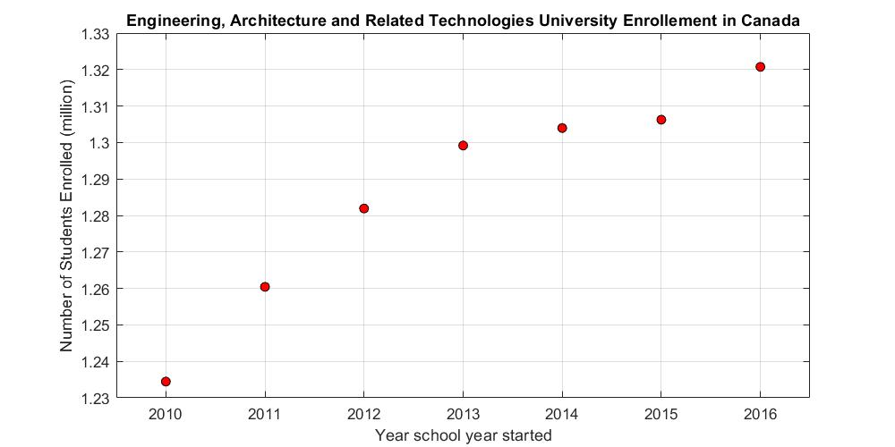
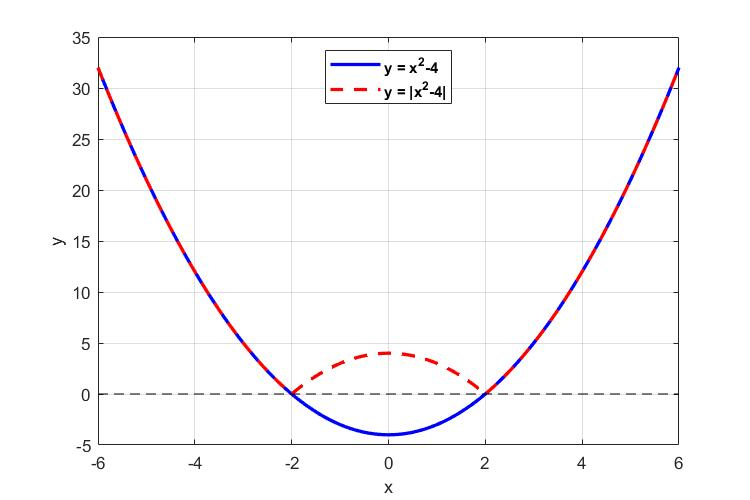

# Module 08: Plotting

**Last updated:** 2021-08-14

## M08001. Viscosity Plot

Create a plot which replicates the plot shown below:



Here is the data used to create this plot.

```matlab
temp = [10 20 30 40 50 60 70 80 90];
water = [1.293 1.002 0.800 0.656 0.549 0.468 0.405 0.356 0.316]; 
acetone = [0.355 0.323 0.295 0.272 0.253 0.236 0.221 0.208 0.196];
benzene = [0.731 0.641 0.564 0.499 0.443 0.394 0.353 0.317 0.285];
ethanol = [1.448 1.173 0.961 0.796 0.665 0.561 0.476 0.408 0.352]; 
```

**Solution**  
Please watch this: [**https://youtu.be/slQYIlPGkHY?t=6**](https://youtu.be/slQYIlPGkHY?t=6)

## M08002. Solar Radiation Plot
Create a plot that replicates the plot shown below:



Here is the data used to create this plot. Note the first value correcponds to the value for the first month (January) and second value corresponds to the value for the second month (February) etc.

```matlab
declination_data = [-20 -10.8 0 11.6 20 23.45 20.6 12.3 0 -10.5 -19.8 -23.45];
```

**Solution**  
Please watch this: [**https://youtu.be/slQYIlPGkHY?t=826**](https://youtu.be/slQYIlPGkHY?t=826)


## M08003. Student Enrollment Plot
Create a plot that replicates the plot shown below:



Here is the data for to create the plot:

```matlab
students = [1234473 1260435 1281906 1299174 1303959 1306251 1320735];
year = [2010 2011 2012 2013 2014 2015 2016];
```
 
**Solution**  
Plese watch this:[**https://youtu.be/slQYIlPGkHY?t=1633**](https://youtu.be/slQYIlPGkHY?t=1633)


## M08004. Function and its Absolute Value 
Create a plot that replicates the plot shown below:



**Solution**  
Plese watch this: [**https://youtu.be/slQYIlPGkHY?t=2058**](https://youtu.be/slQYIlPGkHY?t=2058)
