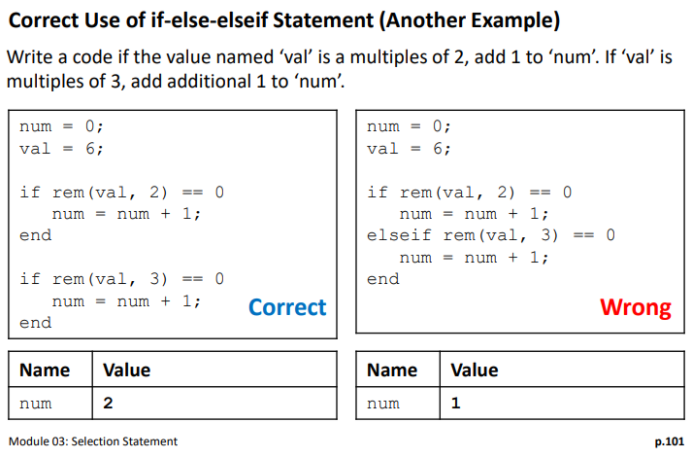

# Module 03: Selection Statement

**Last updated:** 2021-08-07

## Question List
- [Q1: elseif vs. if-else Statements ](#Q1)
- [Q2: Multi-Case Switch Statement](#Q2)
- [Q3: The "and" Built-In Function ](#Q3)

### Q1: elseif vs. if-else Statements   
**Question:** Is there a difference between using the elseif command or just plainly using if and else statements?

**Answer**:Yes, there is a difference in using these 'if' vs 'elseif', this is a good example from the lecture notes: 

If you have conditions which are mutually exclusive (meaning only one of the actions can be performed) you would generally want to use elseif statements in your code. If you have conditions which are not mutually exclusive (meaning multiple actions can be performed) you would generally use if statements (but it can depend on the specific scenario).  

In this example, the question being asked is not mutually exclusive, if a number is a multiple of both 3 and 2, both actions should be performed which is why the first code is correct while the second is incorrect. 

### Q2: Multi-Case Switch Statement   
**Question:** Is there a way to include multiple cases in the switch statement? 

For example, if the action is the same for multiple case expressions could you list those case expressions in one line? 

It might look like: 

switch category 

case 1 || 2 || 3 

val1 = 101; 

end 

So far I have tried using || and , to separate case expressions. 

**Answer**:You just know how to use switch-case statement and I encourage you to use if-else-if statement. The latter one is more flexible.  

A short answer is No. In your example above, in case XXX, XXX is not a condition statement. It is a value in category. 

### Q3: The "and" Built-In Function  

**Question:** For the Module 3 "income tax" practice, the professor's answer included a elseif "and" and then tested the range of the income tax. I'm not sure if this was explained in an earlier chapter and I forgot or if it is new, but could someone explain to me when you would write and when testing range and why we use it?

**Answer:** The "and(a,b)" function is the exact same as "&" or "&&". The function is mainly used ensuring that 2 conditions are present. For example, if we want to check to see if a number is in between a range, we use the "and(a,b)" function where a  is the first condition that defines the lower end of a range and b is the second condition that defines the upper end of a range. 

The way used the "and" function in his example, he used it to check if 2 specific conditions were present in order to issues a tax due. The first condition was to check to see if the money was greater than or equal to the lower end of the taxable income range, while the second condition was checking to see if the taxable income was less than or equal to the higher end of the taxable range. Therefore by using the "and" function he is able to define a range to check and see if the income received is within a certain taxable range.