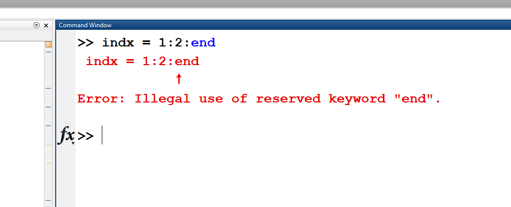

# Question and Answer

**Last updated:** 2021-04-30

## Table of Contents
- [**Module 01. Basic MATLAB Programming**](#module-01-basic-matlab-programming) 
- [**Module 02. Vectors and Matrices**](#module-02-vectors-and-matrices)
- [**Module 03. Selection Statement**](#module-03-selection-statement) 
- [**Module 04. Loop Statement**](#module-04-loop-statement)
- [**Module 05. Built-in Functions**](#module-05-builtin-functions)
- [**Module 06. Operators**](#module-06-operators)
- [**Module 07. Function**](#module-07-function) 
- [**Module 08. Plotting**](#module-08-plotting)
- [**Module 09. Data Structure**](#module-09-data-structure) 
- [**Module 10. File I/O**](#module-10-file-io)
- [**Module 11. Text Manipulation**](#module-11-text-manipulation) 
- [**Miscellaneous**](#miscellaneous)

## Module 01. Basic MATLAB Programming

### Brackets
I was wondering if there were any "easy" ways to remember when you should use () brackets vs when you should use [] brackets.  If there are any additional resources or tips that you can provide, that would be greatly appreciated!

**Answer**: The best way is to make your own note. You do not need to memorize its usage because you can simply revisit your note or lecture slides during your quizzes. Once you make a summary note, you will solve tutorial problems using this note without looking at the individual solutions. 

It's okay to not get the correct answer even if you study them. You should repeat this process so that you get used to their usage. Programming is not a math or science. You can think of learning sports: once you know the principle of how to do it, you need to do practice and learn by trial and error.

You can check out this webpage under ‘special characters’ for more information about the different types of brackets: [MathWorks: MATLAB Operators and Special Characters] (https://www.mathworks.com/help/matlab/matlab_prog/matlab-operators-and-special-characters.html?s_tid=doc_ta) 

### Rem Function and Type Casting
For rem Function, I started by dividing the variable by each integer, and I know that it wants a whole number as a solution, but I’m not sure how to ensure it’s a whole number and also how to convert that to a logical operator?

**Answer**: When you use the rem function first, some of your variables may have a non-zero remainder and others may have a zero remainder. You can then typecast these variables into logical type which will get you to "false" for equally divisible variables (zero remainder will become false  in logical type) and "true" for non-equally divisible variables (non-zero remainder will become true in logical type). 

For example,
```matlab
is_odd = logical(rem(4,2)); % false
is_odd = logical(rem(5,2)); % true 
```
 
## Module 02. Vectors and Matrices

### Indexing 
I was wondering when modifying a vector, I am still confused as to why a vector cannot be read by an index that does not yet exist, but it can be extended by referring to elements that do not yet exist? 

**Answer**: Very tricky to answer this question.... "Why a vector cannot be read by an index that does not yet exist" This is because we can't read the thing that doesn't exist. But we can "point out" or "refer" a new location although it does not exist. (It cannot be read because it does not exist, but we could create it by referring the space)

### Matrix Indexing
Is it possible to explain with sentences what the code means for C3 and C4 ? I see that the output for C2-C4 is the same. 

```matlab
m1 = [1 2 3; 4 5 6; 7 8 9]

c2 = m1(:,end);
c3 = m1(1:3,end);
c4 = m1(1:end,end);
```

**Answer**: C2, C3, and C4 are to explain how to access an entire column. 
C2  => m1(:, end)  ':' means accessing all values in the corresponding dimension
C3 => m1(1:3, end) 1:3 means accessing the values from the first to the third. Since the dimension of m1 is 3 x 3, 1:3 means accessing all values..
C4 => m1(1:end, end) 1:end mean accessing the values from the first to the end, which is the last location of the corresponding dimension. The last location is 3. Thus, 1:end here is the same as 1:3. The following diagram might also help:


As result, C2, C3, and C4 are the same!

### The "and" Operator
I have a general question in terms of the and (&&) operator. Is it possible to include it more than once in a line of script?

**Answer**:Yes, It is possible because if you plug something like the following into MATLAB no errors appear.

```matlab
a = 1;
b = -1;
c = 3;
d = 4;
x = (a>-1)&&(a<3)&& (a<4);
```

### The "zeros" Function
I was wondering if it was acceptable to write zeros(n,n) if you are writing a square matrix instead of zeros(n).  Additionally, for a 3D matrix, is there a way to code an nxnxn (zero) 3D matrix without writing zeros(n,n,n) (is there a short for like for the 2D matrix)? 

**Answer**:  Yes, definitely. Personally, I like zeros(n,n)  rather than zeros(n). But, either one is fine.  For your second question, as far as I know, that is the simplest way to initialize a 3D matrix. 

### The "Ones" Function
Is there another way to create a vector of all one number other than making a vector of all zeros with the proper dimensions and replacing the values with the ones you want?

0**Answer**: The simplest way is to use "ones" built-in function. 
 

### The "end" Operator
I am trying to pick alternate values from a vector. If there is a vector

```matlab
values = [12  13  14  15  16  17];
```
a) why does this not work
```matlab
index = 1:2:end
answer = values(index)
```
b) and why does it only work if i do

```matlab
answer = values(1:2:end);
```
**Answer**:
a) end is to refer the last value at each dimension. Thus, only when you use "end" inside the array, MATLAB knows the dimension of the corresponding array. Actually, the code doesn't reach to the line of "answer=values(index)" because the line of "index=1:2:end" has a syntax error like below. 



b) That's how the end works in this script! If MATLAB see the "end " in the index section, it is considered as the last dimension of the corresponding dimension.


### Swapping Columns
If we have a 5x6 matrix and we were to swap first and second rows, I'm confused about why we can't use comma to indicate the rows like such:
```matlab
matrix([1, 2], :) = matrix([2:-1:1], :)
```
**Answer**: "index(es)" that can refer or read values in a matrix is **a vector**!!! Here, you use a row vector where you can make either [1 2 3 4] or [1, 2, 3, 4]. Thus, in the left side, you do not have to use comma (,). Similarly, [2: -1:1] is a row vector, right so it works.  Note that [2: 6t6tg `*63
201-1:1], [2 1], and [2, 1] are all the same row vector. 

### Type Logical "1" and double"1"
when submitting this code, I originally wrote only_lower = 1 and only_lower = 0, yet matlab grader marked it incorrect. why does it only accept the code being written as logical(true) and logical(false)? 

**Answer**: 1 is a numeric value, not logical value. logical(1) or true is a logical true. 
You do not need to convert it two times like above. 

## Module 03. Selection Statement 

###  The "and" Function
For the Module 3 "income tax" practice, the professor's answer included a elseif "and" and then tested the range of the income tax. I'm not sure if this was explained in an earlier chapter and I forgot or if it is new, but could someone explain to me when you would write and when testing range and why we use it?

**Answer**: The "and(a,b)" function is the exact same as "&" or "&&". The function is mainly used ensuring that 2 conditions are present. For example, if we want to check to see if a number is in between a range, we use the "and(a,b)" function where a  is the first condition that defines the lower end of a range and b is the second condition that defines the upper end of a range. 

The way used the "and" function in his example, he used it to check if 2 specific conditions were present in order to issues a tax due. The first condition was to check to see if the money was greater than or equal to the lower end of the taxable income range, while the second condition was checking to see if the taxable income was less than or equal to the higher end of the taxable range. Therefore by using the "and" function he is able to define a range to check and see if the income received is within a certain taxable range.


### If vs. Switch Statement
I was wondering if there are situations where one would benefit from using the switch statement rather than if statements? Because personally I think the if and associate statements are a lot more intuitive and easier to understand and read.

**Answer**: You can use either if-else or switch statements, which is more convenient for you. As mentioned in the lecture, if the expression contains a character or character vectors, the use of switch is more intuitive and readable (ex.depending on which case you have for a given grade, you will display a different output which is easier to read using a switch statement). But, it's up to you.  Yes. I also prefer the if-else statement than switch. 

## Module 04. Loop Statement 

### The "While" Loop
I'm not really sure where to use While loop function. Is there a way of telling when is the best time for using it?

**Answer**: Normally, if you don't know the end range of iterator, we use a while loop with 'break'. 


In the above code, MATLAB keeps drawing a graph but if you push the 'ESC' button, it will stop. Assume that we do not know how many time we draw a graph and would stop drawing graph when we do an action (like push ESC button), that's the right place to use while. 

Also, if you do not know # of iteration or # of iteration is changing during iteration, you need to use while statement. 

### Removing Elements from a Vector


**Answer**:  This is a very good question! It's because you are changing the vector and matlab does x(2) = [] first, then it performs x(5)= []. They are not done at the same time. So, when you do x(2) = [], matlab removes the second element from your original vector and your new vector becomes [75 50 25 45 80]

Then, when you do x(5) = [], Matlab will remove the fifth element from the new vector you just created so it will become [75 50 25 45]. The fifth element here is not the fifth element in the original vector. 

If you are getting rid of the 2nd and 5th element of the original vector at the same time, you need to use this syntax. 

### Word Finder Puzzle Question
I don't understand how this is possible, I thought the order in brackets was (row, column, layer), but in the description it says: "word_loc(1,2,2) indicated the column location of 'b' in 'backpack'. Another example is word_loc(3,1,4) indicates the row location of 'x' in 'maximize'. From reading the location in the brackets I would think it was saying 'b' in backpack was in the 1st row, 2nd column, and 2nd layer, which is untrue because it is actually (2,1,1).

I also don't understand why this matrix has 5 layers? It says "the script that outputs 'word_loc', which is a 8x2x5 matrix." what are the 5 layers for?
And also some clarification for what "word_loc(:,:,ii) is a 8x2 matrix where the 1st and 2nd columns contain the row and column locations of the characters in a words(ii,:), respectively" means. This is very confusing, I can't understand or picture what this means?

**Answer**: Please see my description and then you will get the idea. 


## Module 05. Built-in Functions

### The "Flip" Function
I'm just wondering what is the difference between flip, fliplr and flipud? And can I use flip to replace fliplr and flipud.

**Answer**:Please see the attached picture. Basically **fliplr** flips things right to left and **flipud** flips things in the up and down direction.As stated in the lecture, the flip function can also be used to flip matrices right to left or up and down if you include a dimension, flip(x, dim). For example, flip(x, 1) will flip the matrix up and down, flip(x,2) will flip the matrix right to left. 


### Placeholder
when using [B,I] = sort(A,direction) and B is replaced with a ~, what exactly does this mean. I don't fully understand this notation.

**Answer**: It is just a placeholder, like using "tmp" except it doesn't save a value to "tmp". [B,I] should give you two vectors, B as the sorted A vector, and I as the indexes of the sorted A vector.  When you use the tilde (~) for B, you're telling MATLAB doesn't care about B, you just want the indexes.  MATLAB requires a variable placed at B, so you can't leave it blank.


### Rounding to a nearest multiple of a specific number
I understand rounding to the nearest integer, but is there a way to round to a certain multiple? Like for example, if I want to round to the nearest multiple of 7, how would I do it?

**Answer**:You can use this code. If you wanted to round to the nearest multiple of a different number you would just have to change the “7” to that number. 

```matlab
x = 47;
x= round(x/7)*7;
```

### Bubble Sorting Question
Will there ever be a case where bubble sorting is the only option?

**Answer**:There are many: https://en.wikipedia.org/wiki/Sorting_algorithm. I haven't a chance to look at all these algorithms but I just coded the selection sorting like this 


## Module 06. Operators

### The "./" Operator
When do i use ./ operator? only when i have to divide a vector by vector or when i have to divide vector with a scalar or when i have to divide a scalar by a vector or at all the three times?

**Answer**: You don't have to use ./ for vector and scalar division. You can use just the division. How about this? 


Please refer to Pages 67 to 69 in Module 2: Vectors and Matrices to understand the differences between Scalar and Array operations.
Check out this page for more information about the ./ function: [Mathworks: rdivide] (https://www.mathworks.com/help/matlab/ref/rdivide.html) 

### The "Coop Decision" Question
For the COOP Decisions question, b), where it asked for best employer average-it required either the maximum or the minimum value (depending on the variable) of a column.I initially wrote varindex = find(max(coop_factors ( : , x))), where varindex is the index of the desired value (max or min of each column), and x is column that it is searching in. I expected max(coop_factors ( : , x)) to give the max value of each column, and find(...) would then provide the index (row number) of that value- this didn't end up working, and instead, it just returned a value of 1, regardless of the actual desired data. I initially thought this was because the find function was working with 2 dimensions, and my query was only limited to 1 dimension, however, [val, index] = max (coop_factors ( :, x ) ) worked perfectly fine, returning just the row number index (as desired)- what am I missing? 

**Answer**:max(coop_factors(:,x)) gives your a single maximum number. Thus, you will always get 1 because the first value is the first and last non-zero value. 
I guess you are trying to do like

```matlab
varindex = find(coop_factors == max(coop_factors(:,x));
```
However, as you already mentioned, 
```matlab
[val, index] = max(coop_factors(:,x))
```
does the same operation so there is no reason to use find function.

Regarding the code above, if you are referring the row, you need to have a loop structure. 

Instead, you can use the following script to vectorized your code:
```matlab
[val, index] = max(coop_factors);
```

### The Difference between the "./" and ".\" Operator
I was just wondering, what is the difference between the ./ operator and the .\ operator? I know they are for element-wise division, but what difference does the orientation of the dash make? 

**Answer**: 
Very interesting question that I haven't thought of..I don't like the \ slash operator because if it is misused, it is a big problem..See my testing

It looks like dot backslash is flip the denominator and numerator. 
Since we can replicate those operations using dot slash, **I would not recommend using it, unless it is necessary.** 
MathWorks has some good documentation about the two functions: 
* ./ (rdivide): https://www.mathworks.com/help/matlab/ref/rdivide.html 
* .\ (ldivide): https://www.mathworks.com/help/matlab/ref/ldivide.html 

## Module 07. Function 

### The "Poker Game" Question--string
why did you add lg_vec + '0' to the char in the last line?

**Answer**: It is a tricky part. That's why I gave you the code. 

Let me explain it. The goal is to make a logical vector to a character (numeric) vector.
lg_vec = [1 1 1 1 0 1];
How to make them ['1', '1' '1' '1' '0' '1'] ?
If you add '0' to lg_vec,  '0' becomes an equivalent numeric value, which is 48. 
lg_vec + 48 becomes [49 49 49 49 48 49]. Then, char([49 49 49 49 48 49]) becomes ['1', '1' '1' '1' '0' '1']. I know this is very tricky. You can just consider it as a simple trick to convert a logical vector to a character numeric vector, but to do so you have to convert it to a numeric vector first. 

### Error: "The logical indices contain a true value outside of the array bounds"
I have gotten this error a couple times and I'm not too sure what it exactly means . . 
"The logical indices contain a true value outside of the array bounds." 

**Answer**: I replicate this error message. Can you get what's wrong in this code? Hint: take a close look at the number of elements in lg_vec and vec. Think back to Module 2, can a vector be read by an index that does not exist yet?   


## Module 08. Plotting

## Module 09. Data Structure 

### "strcmp" vs. "isequal"
I was going over the lectures again and I noticed that the strcmp function was labelled as isequal in one of the videos. It's clear that strcmp is for strings, however is there any other big difference between them?

**Answer**: I think strcmp is literally comparing strings and supports cell array as an input. 

Here is the example:

When using strcmp the input arguments can be string arrays, character vectors, or cell arrays of character vectors and the output will be either true or false, or an array of logical vectors if the input was an array. Mathworks also has some good information about the [strcmp](https://www.mathworks.com/help/matlab/ref/strcmp.html) and [isequal](https://www.mathworks.com/help/fixedpoint/ref/isequal.html). 


### String Indexing Vs. Character Indexing
What are the differences to string indexing and character indexing? With string indexing we use { } to reference a certain string in the array but with character indexing, can we still index i.e. x(1)(1) for first cell first character? Or does character indexing only follow rules of linear indexing in an array?

**Answer**: Please see the following examples:


### "strcmp" Vs. "find"
What are the limitations to using strcmp function vs. find function? Are there situations where it is advantageous to use one over the other?

**Answer**: Very good question. I think you are asking strfnd and find, right? strfnd is to find location(s) of a pattern.e.g., strfnd(char_vec, 'banana') and gives the location(s) of the first occurrence of the input.
find is to give the location of logical true. e.g., find(char_vec == 'b').
strfind accept two string or character vectors as input. 
find accepts an input for a logical vector. I think they are different functions. 


## Module 10. File I/O

## Module 11. Text Manipulation 

### Creating an empty String
When creating an empty string, do both of these syntaxes give the same result:

```matlab
a = strings(1,1);

b = "";

```

**Answer**: All three are the same. 


### TUT 11 ("Word Finder Puzzle")

For the error "conversion from cell to double is not possible" what would I have to do to fix this?

**Answer**:Good question. 

word_loc(kk) is to refer to the "cell" element, not the value space. 
Thus, you need to assign a cell, not the value. 

```matlab
word_loc{kk} = test_loc;
```
OR 

```matlab
word_loc(kk) = {test_loc};
```
Note that Parentheses () are used to index into an array whereas curly brackets {} are used to index to a specific cell array element by enclosing all indices in them. 

## Miscellaneous

### Using functions not covered in the quizzes
For the exam are we allowed to use built-in functions that we haven't been taught? For example, I learned the function ind2sub, would I be able to use that?

**Answer**:  You can use any MATLAB built-in function at **your own risk** unless otherwise noted. When you misuse or misapply built-in functions that have not been covered in lectures or tutorials, you **will not** get partial marks for using them. Please do not use a built-in functions that the lectures have not covered in our course if you are unsure of its applications. You can solve the problems without them. 


### Partial marks
I am aware that TA's are going in after the fact to grade question. Does this mean that part marks may be awarded to certain answers that the grader did not deem as correct, or are they simply going in to make sure you haven't cheated pr bypassed the proper coding method?

**Answer**: Questions will be manually graded by TAs again and confirmed by the instructor.  If your programming logic is correct, you will receive partial marks. 