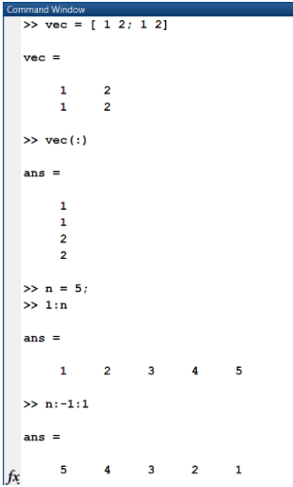

# Homework and Tutorial Problems 

**Last updated:** 2021-08-07

## Problem List
- [P1: M02004. Character Type Casting](#P1)
- [P2: M02012. Manipulating Matrices and Logical Operations](#P2)
- [P3: M02026. Creating Sequences](#P3)
- [P4: M02031. Pressure Calculation (Deleting Variables and Data Processing)](#P4)
- [P5: M03006. Shear Modulus (Switch Statement) ](#P5)
- [P6: M03009. Repeating Elements and Mirrored Matrices (Concatenation and Linear Indexing) ](#P6)
- [P7: M04011. Coop Salaries (For Loops) ](#P7)
- [P8: M05007. Word Finder Puzzle - Backward (The "diag" Built-In Function) ](#P8)
- [P9: M05028. Find the Number of Subsets (Nested Loops)](#P9)
- [P10: M06017. Lifting Up Zeros (Loop Statements)](#P10)
- [P11: M07011. (Testing) Design ChckStr for Straight (Rank 6)) (Type Conversion) ](#P11)
- [P12: M09004. Problem of Poker Game (Using the "find" function) ](#P12)
- [P13: M11009. Text Manipulation ](#P13)
- [P14: M03001. Income Tax (The "and" Built-In Function)](#P14)

### P1: M02004. Character Type Casting <a name="P1"></a> 

**Question:** For part d) of this tutorial question, when I try removing the 10th element of vec1, I use vec1(10) == []. It then tells me this creates a "0x0 empty logical array". I was just wondering what this means. 

**Answer:** '==' is a relational operator that checks for equality and returns a logical value. In your code, you are trying to check if the 10th element of vec1 denoted by vec1(10) is equal to []. 

The assignment operator is '=' and the syntax for it is: variable = expression. 

### P2: M02012. Manipulating Matrices and Logical Operations <a name="P2"></a> 

**Question:** In question e, it asks for the character but combining numbers inside. I tried putting brackets to make it a vector, but it does not work. 


**Answer:** I think you can keep things simple like using "end" instead of putting so many numbers. An array is a placeholder to store a set of values of the SAME TYPE! Your last line is trying to store values with different types (char and numeric). In this case, the numeric values are implicitly changed to corresponding character values. Regardless of its possibility, I'm not recommending such syntax. On a side note, here are some experiments to understand how the last line works: 


### P3: M02026. Creating Sequences  <a name="P3"></a> 
**Question:** For part (a), the Matlab is kept saying that the arrays have incompatible sizes and I don't really get it.  

**Answer**: If you are trying to perform element-wise multiplication on two arrays, the arrays need to be the same size. If the two arrays you are trying to multiply are of different sizes, you will get the error message that the arrays have incompatible sizes. Hope this helps!  


### P4: M02031. Pressure Calculation - Deleting Variables and Data Processing <a name="P4"></a> 

**Question:** I am confused that why the given code deleted the variables of press1 press2 &press3. And if I copied from the code again to make the variable, the values are not the original generations. How should I start the question?  

**Answer**:For this question, the code that is provided to you clears the values of 'press1' 'press2' and 'press3' (so we cannot use these variables to solve the question). This is because these three matrices are concatenated in the horizontal direction into a matrix called 'data_press' , you will need to solve this problem using 'data_press' rather than 'press1' 'press2' and 'press3'. For example, when you process data in Exel, you will process data like 'data_press', not individual press X. This example is to practice data processing or analysis of table data.

### P5: M03006. Shear Modulus - Switch Statement  <a name="P5"></a> 

**Question:** I eventually solved H3-2, however I was a bit confused at first. When using switch statements can "case" only be followed by a letter such as 'a', as we saw in both the lecture grade example and this question? 

Or can it be followed by any expression, such as "material_data = 'a'"? I'm just wondering as we haven't seen any examples that use that form. 

**Answer:**  The syntax of switch statements has to be as follows: 
```matlab

switch <switch expression> 

            case <case expression 1> 

                    action 1 

            case <case expression 2> 

                    action 2 

end 
```
You call the array "material_data" in the switch expression, and all the case expressions correspond to characters assigned to "material_data".  You only put expressions (an expression means there's no equal sign) in the case statement, therefore "material_data == 'a'" is incorrect syntax. Essentially, the equal sign is already implied in the switch statement. 

### P6: M03009. Repeating Elements and Mirrored Matrices - Concatenation and Linear Indexing <a name="P6"></a> 

**Question:**  I'm not sure how to approach this question. Should I be using a selection statement to solve or should I be referring to M02013: Creating Mirrored Matrices?  

**Answer:** This example gives you an idea:

 

### P7: M04011. Coop Salaries - For Loops <a name="P7"></a> 

**Question:** Hi! Can someone please explain a bit more what this part of the code does? I'm having some trouble getting 4-3 from the HW and I think understanding this a bit more may help. Why do we include the number nest to the ii? The 1 or the 2 when it says (ii,1) or (ii,2). 

 

**Answer:** A short answer is that coop_data includes information of 20 coop students. We need to design a loop statement to read the record for each student to test his or her salary. 

### P8: M05007. Word Finder Puzzle - Backward - The "diag" Built-In Function <a name="P8"></a> 

**Question:** I was wondering how the code would look for tutorial if there was a possibility of finding the word banana diagonally. 

**Answer:** You can design the solution using a loop statement but I use 'diag' function. Here is how diag function work:
```matlab

>> alpha_low = 'a':'z'; 
>> puzzle = alpha_low(randi(23, 6,6)) 

% puzzle = 6×6 char array 

'fjffbl' 
'dejcgn' 
'fungsf' 
'kwghak' 
'hknjvw' 
'vcqlqm' 

>> diag(puzzle, 0)' 

ans = 

'fenhvm' 

>> diag(puzzle, 1)' 

ans = 

'jjgaw' 

>> diag(puzzle, -1)' 

ans = 

'dugjq' 

>> diag(puzzle, 2)' 

ans = 

'fcsk' 

>> diag(puzzle, 5)' 

ans = 

'l' 

>> diag(puzzle, -5)' 

ans = 

'v' 

end 
``` 

You are going to access characters in diagonal elements using this function.  

Then, you can solve it in the same way. 

### P9: M05028. Find the Number of Subsets - Nested Loops <a name="P9"></a> 

**Question:** Hello! I'm struggling to find a way to identify repeated subsets in this question.  I've got a script that does the basic principle of the question and addresses the "no 5+5" rule, but I can't come up with a way to identify situations when I've got a repeated subset and exclude those from the loop.  Is there an easy way to do that? Or to remove repeated elements from the vector before running it thru a loop?  
  

**Answer:** How about changing the loop range? then, you don't need to have the second condition statement. 
```matlab

for ii=1:n 

     for jj=ii+1:n 

          DO SOMETHING 

    end 

end 
```
Also, in_vec is generated from randperm so there is no overlapped value. 

If there is repeating element, how about this?  
```matlab

if and((in_vec(ii) + in_vec(jj) == sum_val),  (in_vec(ii) ~= in_vec(jj)))  

end 
``` 


### P10: M06017. Lifting Up Zeros - Loop Statements <a name="P10"></a> 

**Question:**  I managed to solve question 5, however my solution method was very inefficient. The method I used was the following code, but I had to do this for each column:

 

I'm just wondering if you could give me advice on how to make the code more efficient or point me in the direction of an example of with a similar solution method. 

**Answer:** This is a very good solution. Your solution is the same as my solution. You did it rightly and this is what I expect. I think you should repeat it in each column. There is no more shortcut to do it without loop statement at my end.

### P11: M07011. (Testing) Design ChckStr for Straight (Rank 6) - Type Conversion <a name="P11"></a> 

**Question:** Why did you add lg_vec + '0' to the char in the last line? 

**Answer:** The goal is to make a logical vector to a character (numeric) vector. 

lg_vec = [1 1 1 1 0 1]; 

How to make them ['1', '1' '1' '1' '0' '1'] ? 

If you add '0' to lg_vec,  '0' becomes an equivalent numeric value, which is 48.  

lg_vec + 48 becomes [49 49 49 49 48 49]. Then, char([49 49 49 49 48 49]) becomes ['1', '1' '1' '1' '0' '1']. I know this is very tricky. You can just consider it as a simple trick to convert a logical vector to a character numeric vector, but to do so you have to convert it to a numeric vector first.  

### P12: M09004 Problem of Poker Game - Using the "find" function <a name="P12"></a> 

**Question:** After referring to M07031, I am a bit confused on the code. May you please explain what the highlighted part of the code is doing?

 

**Answer:** The function needs the high number as an output.  

 card_sum_new is a vector that contains numeric values. 

If the value is three, that's number (column location) is considered as three of kinds.  

find(card_sum==3)  give you the card numbers of three of kinds.  

The problem is ACE (1 ) is the highest number so we need to consider it.  

Thus, we make card_sum_new = [card_sum card_sum(1)]; 

when we do 'card_sum_new == 3',  our goal is to find the last location of 1 because that's the highest number.  

high_num = find(card_sum_new ==3, 1, 'last')  

This gives us the last location of 1. 

Here is the sample usage of the above find syntax: 


### P13: M11009 Text Manipulation <a name="P13"></a> 

**Question:**  I've attached my working code for this question below. I was able to figure out that the condition for the if statement had to be "double(char_vec(ii)) - 48 > 5", and I'm a little confused about why I needed to subtract 48. Could someone clarify why this is necessary?
```matlab

num_count = 0; 

for ii = 1:n 

    if double(char_vec(ii)) - 48 > 5 

        num_count = num_count + 1; 

    end 

end 
```

**Answer:** The given input is a character vector, not a numeric value. Thus, to compare the digit in a character vector with 5, you need to convert 'char_vec' to a set of numeric digit. However, if you run double('0'), it's not 0 because the equivalent numeric value of a '0' character is 48. And the equivalent numeric values of digits are continuous, increased by 1. Thus, for example, if you subtract 48 from char('1'), it gives you 1. The other numbers are similar; 

char('2')-48   gives you 2.  

char('3')-48   gives you 3. 


### P14: M03001. Income Tax - The "and" Built-In Function <a name="P14"></a> 

**Question:** For the Module 3 "income tax" practice, the professor's answer included a elseif "and" and then tested the range of the income tax. I'm not sure if this was explained in an earlier chapter and I forgot or if it is new, but could someone explain to me when you would write and when testing range and why we use it?

**Answer:** The "and(a,b)" function is the exact same as "&" or "&&". The function is mainly used ensuring that 2 conditions are present. For example, if we want to check to see if a number is in between a range, we use the "and(a,b)" function where a  is the first condition that defines the lower end of a range and b is the second condition that defines the upper end of a range. 

The way used the "and" function in his example, he used it to check if 2 specific conditions were present in order to issues a tax due. The first condition was to check to see if the money was greater than or equal to the lower end of the taxable income range, while the second condition was checking to see if the taxable income was less than or equal to the higher end of the taxable range. Therefore by using the "and" function he is able to define a range to check and see if the income received is within a certain taxable range.
