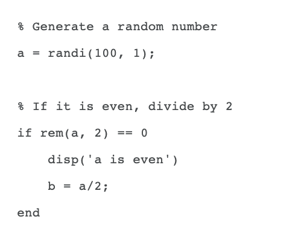
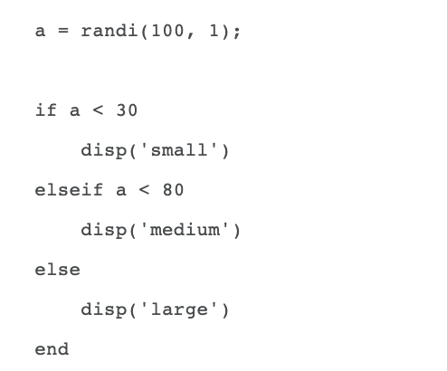

# Module 04: Loop Statements

**Last updated:** 2021-08-12

## Question List
- [M04-Q1: Conditional Statements](#Q1)
- [M04-Q2: For loops using ii and jj](#Q2)
- [M04-Q3: Removing Elements from a Vector](#Q3)
- [M04-Q4: The "While" Loop](#Q4)

### M04-Q1: Conditional Statements  
**Question:** I was wondering if there were any difference between condition statements (Cond1, Cond2, etc.) and if-else statements. In what scenarios is best to use each?

**Answer**: Conditional statements enable you to select at run time which block of code to execute. The simplest conditional statement is an if statement. For example: 

if statements can include alternate choices, using the optional keywords elseif or else. For example: 

### M04-Q2: For loops using ii and jj  
**Question:** I am a bit confused about the concept of using ii and jj. Does it have to equal an entire matrix, or can we assign that to a numerical value?

**Answer**: It depends on the problem but when you access a matrix using a subscript indexing method, you need to have two indexes for row and column. Then, ii and jj from the nested (double) loop structure allow to do it. An important thing to note is that ii and jj are simple number ranges, to use them to refer to an element in a matrix (for example, mat_a), you need to use them as indexes like, mat_a(ii) or mat_a (ii,jj).

### M04-Q3: Removing Elements from a Vector  
**Question:** 

**Answer**: This is a very good question! It's because you are changing the vector and matlab does x(2) = [] first, then it performs x(5)= []. They are not done at the same time. So, when you do x(2) = [], matlab removes the second element from your original vector and your new vector becomes [75 50 25 45 80]

Then, when you do x(5) = [], Matlab will remove the fifth element from the new vector you just created so it will become [75 50 25 45]. The fifth element here is not the fifth element in the original vector. 

If you are getting rid of the 2nd and 5th element of the original vector at the same time, you need to use this syntax. 

### M04-Q4: The "While" Loop  
**Question:** I'm not really sure where to use While loop function. Is there a way of telling when is the best time for using it?

**Answer**: Normally, if you don't know the end range of iterator, we use a while loop with 'break'. 

In the above code, MATLAB keeps drawing a graph but if you push the 'ESC' button, it will stop. Assume that we do not know how many time we draw a graph and would stop drawing graph when we do an action (like push ESC button), that's the right place to use while. 

Also, if you do not know # of iteration or # of iteration is changing during iteration, you need to use while statement. 

