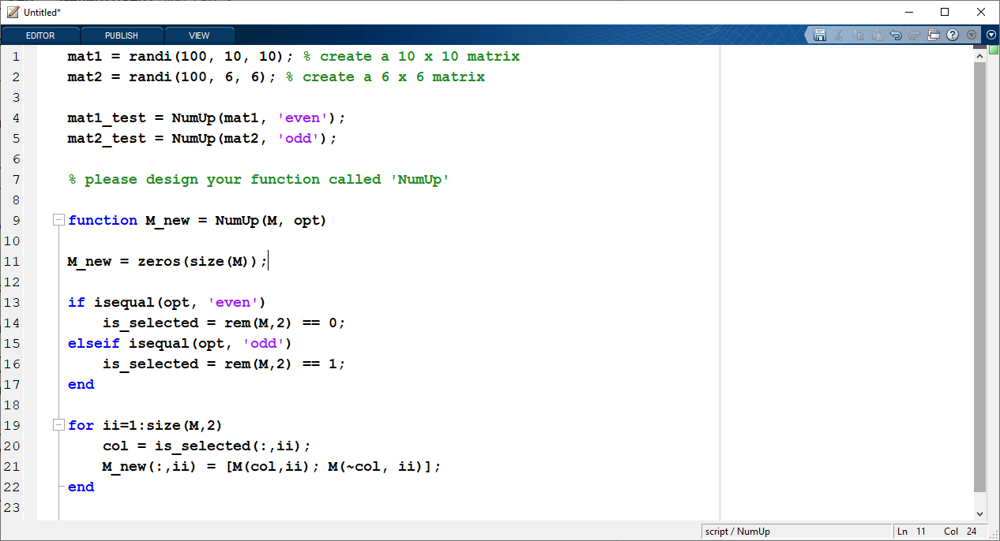
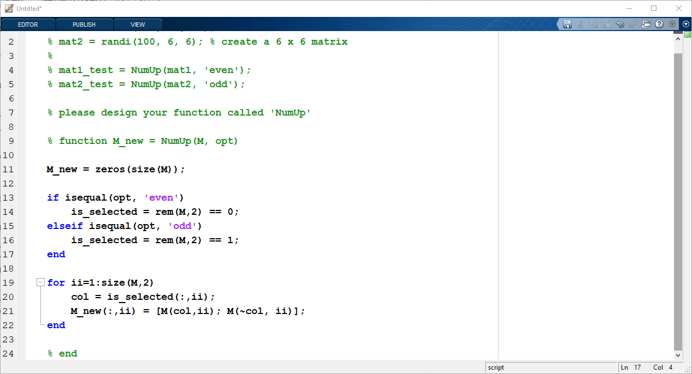
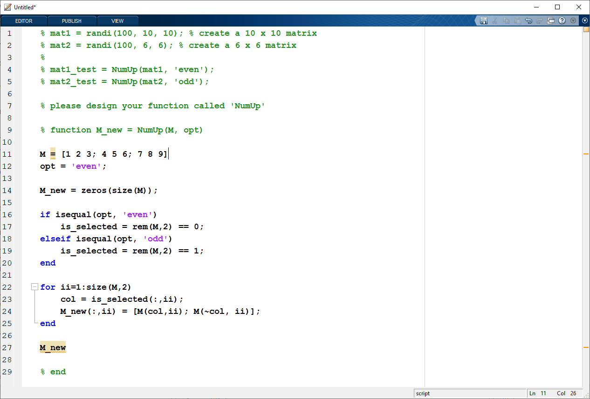
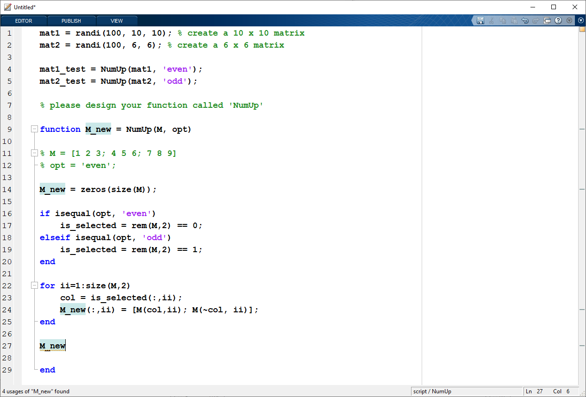

# Module 07: Function

**Last updated:** 2021-08-07

## Question List
- [Q1: Debugging Functions  ](#Q1)
- [Q2: isequal vs. ==](#Q2)

### Q1: Debugging Functions   
**Question:** IIs it bad practice in general to first create your function outside of the 'function' workspace? Let's say the function you are making consists of a loop, could you first create the loop, make sure it works as intended, before you put function [output] = Function_Name(input)? I understand the professor uses 'breakpoint' to debug the function variables and have access to that workspace but I have never used it to make a function so far and it has worked. 

**Answer**:Very good question! I will give you an example. Here is the H6-6 solution.

When you design this function, you would start with known M and opt value. You are commenting the script like this: 

Then, you are manually assigning the input like: 

Since you know the expected output of 'M_new', so you can debug your code using this format. Also, you can change the 'opt' value to check your script.  
If you include M at line 11 and  M_new at line 27 without ;, you can print out the M and M_new values in the commend window, which makes debugging easier. 
Then,  you first DELETE your manual input (this is a common mistake), and uncomment function header and input like this: 

(Tips: Comment and uncomment using Ctrl+R and Ctrl+T) 

When you test your script,  you can use the test values before function header like mat1 and mat2. 

### Q2: isequal vs. ==   
**Question:** I am wondering what's the exact difference and function for "iseuqal" and"==". There is a question in this week's assignment, and when I use "==" it said something like out of given space, but when I changed it to isequal, it worked well. Thus, I am wondering when we are supposed to use each of them.

**Answer**: If you are comparing character vectors with different size (1x 3 == 1x 4) so you will see the error message said, "Arrays have incompatible sizes for this operation".  

If you are comparing arrays of different sizes, I recommend isequal or strcomp for that operation. 
