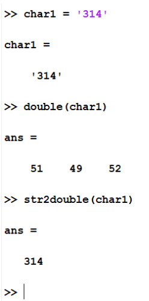

# Module 11: Text Manipulation

**Last updated:** 2021-08-07

## Question List
- [M11-Q1: ‘double’ vs. ‘str2double’](#Q1)
- [M11-Q2: ‘sprintf’ and ‘fprintf’](#Q2)
- [M11-Q3: ‘strcmp’ vs. ‘isequal’](#Q3)
- [M11-Q4: Creating an empty string](#Q4)
- [M11-Q5: strcmp usage](#Q5)

### M11-Q1: ‘double’ vs. ‘str2double’ <a name="Q1"></a> 
**Question:** What is the difference between double and str2double? In what situations would I use double and str2double? 

**Answer**:String data type was introduced in 2016. Before then, character vectors are a general data type to store a text. All built-in functions associated with processing text are targeting for character vectors. In fact, in "str2double", "str" shows texts, not string data type (and most built-in functions support both character and string data types).  




str2double is useful when you convert the number from a character vector. However, if the variable is a string scalar, there is no difference. 

### M11-Q2: ‘sprintf’ and ‘fprintf’ <a name="Q2"></a> 

**Question:** I am wondering what the %s and \n' that were used with sprintf and fprintf do. I figured out how to use them with sprintf to complete HW08 based on the example in the lecture video but I wasn't exactly sure what their roles were.   

**Answer**:% s is a placeholder for string input. In Slide 292, str1 and str2 are inserted to the first and second %s. \n is a new line. If you generate a multiple line texts, you need to use it. 

### M11-Q3: ‘strcmp’ vs. ‘isequal’ <a name="Q3"></a> 

**Question:** General question for the strcmp and isequal syntaxes. Could you please clarify the main difference between them, sometimes they both give me the same answers and other times they give completely different values, is there a reason for this?

**Answer:** The strcmp function is used to compare whether or not two strings are identical (in which case the function will return either 1 or 0) or find a string within an array of strings. This function can only be used with strings or character vectors. 

However, isequal can be used to compare values of any type, not just strings and character vectors, and returns true when the arguments are equal. Also, you can't use isequal to find a specific string within an array, because it always only returns 1 or 0.

### M11-Q4: Creating an empty string <a name="Q4"></a>
**Question:** When creating an empty string, do both of these syntaxes give the same result:

```matlab
a = strings(1,1);

b = "";

```

**Answer**: All three are the same. 


### M11-Q5: strcmp usage <a name="Q5"></a>
**Question** What is the difference between strcmp and strcmpi? On the course note, it says that strcmpi is case insensitive. Then does this mean strcmp is case sensitive or does the case not matter for this function?

Also, I believe the number of elements don't matter for both strings and cells when comparing two vectors, matrix, etc. but I sometimes get a run-time error for the same code which worked previously. Can you confirm that this logic is correct and that the script is supposed to work?

As an example, 

s1 = ["A", "B"]
s2 = "A"
lg = strcmp(s1, s2)
s1 = {'time', 'place', 'occasion'}
s2 = 'hello'
lg = strcmp(s1, s2)


**Answer**
1) strcmp (s1, s2) is to compare if s1 is identical to s2. Thus, it's case sensitive. 

2) Great example

But, for string data type, you don't have to use strcmp.

An example is shown below:


