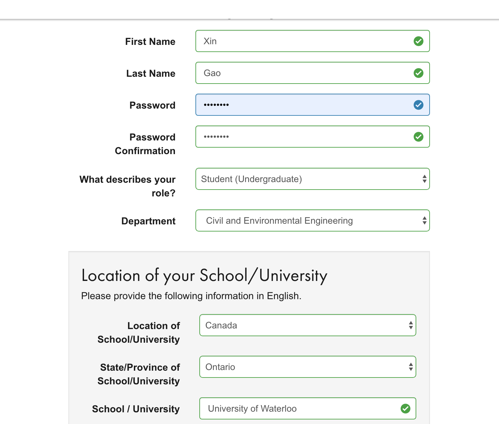
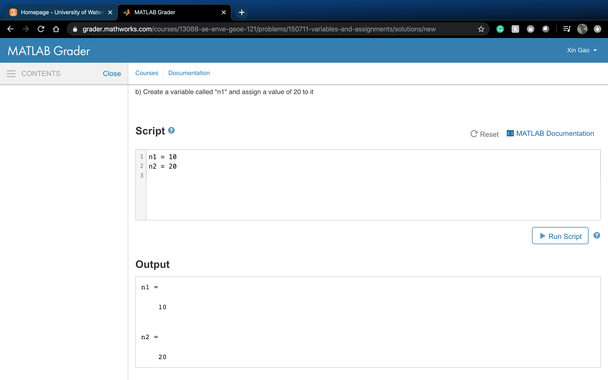

# Getting Started With MATLAB Grader
* **Author**: Noreen Gao
* **Email**: x97gao@uwaterloo.ca 
* **Date**: May 4, 2020  

**Please read, understand, and complete all the following sections.**

## Table of Contents  
* **MATLAB Grader Account Creation**  
* **MATLAB Grader Questions**  
* **Submitting/Fixing Solutions**   

## MATLAB Grader Account Creation
* Go to the MATLAB Grader sign up page: https://grader.mathworks.com/    
* Students will receive an invitation email to join the course in the MATLAB Grader.
* Students are required to use the MATLAB Grader for their assignments and quizzes.  
 

* Please make sure that you sign up with **your school email**. (userID@uwaterloo.ca).
* Note that this example used a Google email as an example.  
 
.

* Please verify your email.  

  

* Please enter your personal information to finish the registration.
* Recently, students who wish to provide a chosen/preferred first name can be directed to WatIAM. Please use the name used in WatIAM. 

## MATLAB Grader Questions
* Go to our course (AE/ENVE/GEOE 121): https://grader.mathworks.com/courses/13088-ae-enve-geoe-121  

* You will see tutorials and assignments in the column on the right.   

  
   

* Here, I made a sample assignment. 
* Click "Getting Started" -> "Variable and Assignments"
* Please solve this simple problem. 

  

* You can push "Run Script" after typing your code into it. 
* This process is to check if your code is working properly without syntax errors. Also, you can print out the output to check the values stored in variables.  
* Note that this is nothing to do with evaluating the correctness of your code. Your code has not been tested or submitted yet. 

## Submitting/Fixing Solutions 
* Once you confirm that there is no syntax error, click the "Submit" button on the end of the page to check if your code is correct or not using pre-designed tests.
* You can submit your solution as many times as you would like until all tests get passed for your assignment (not quizzes)
* Although you pass all tests, you can fix your solutions (Click "Improve This Solution"). 

* If you do not pass the tests, click the "Fix This Solution" button to get your solution fixed. 

