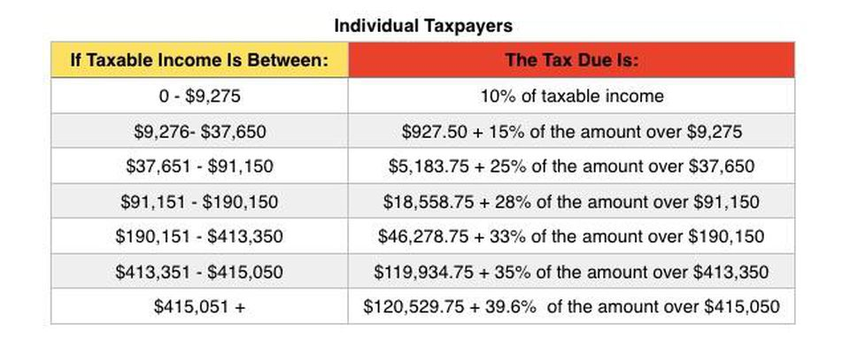
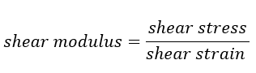
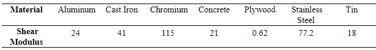

# Module 03: Selection Statement

**Last updated:** 2021-08-14

## M03001. Income Tax (★★)

This program is to evaluate your skills for using selection statement. Please write your own script to solve following problems.


https://www.forbes.com/sites/kellyphillipserb/2015/10/21/irs-announces-2016-tax-rates-standard-deductions-exemption-amounts-and-more/#3b74ce0b2cd0

The above figure shows the tax due by American indivual's in 2016.  

Mike is a freelancer, so his income varies every year. You are going to write a script to compute the tax due for Mike's taxable income. Mike's taxable income for year 2016 is created from the following code:
```matlab
income_tax = randi(700000, 1);
```
Please write a script to calculate Mike's Tax Due for the year 2016, and assign the value to 'tax_due'. All values are round off to the nearest integer before assigning the values. 'tax_due' is a scalar.

**Solution**  
Please watch this:[**https://youtu.be/ySMWZkQTz-U?t=591**](https://youtu.be/ySMWZkQTz-U?t=591)


## M03002. Number Comparison (★)

```matlab
val1 = randi(100)-50; % generate a random value between -49 and 50
val2 = randi(100)-50; % generate a random value between -49 and 50 
```
Please create a variable named 'result1', 'result2', and 'result3'. You need to write a script to do this operation using if-statement.    
(a) If 'val1' is negative, assign 10 to 'result1'. Otherwise, assign 5 to 'result1'.    
(b) If 'val2' is less than -10, assign 10 to 'result2'. If the value is more than and equal to -10 and less than 10, assign 20 to 'result2'. Otherwise, assign 30 to 'result2'.    
(c) if 'val1' is larger than 'val2', assign 100 to 'result3'. Otherwise, assign 10 to 'result3'.    

**Solution**   
Please watch this:[**https://youtu.be/ySMWZkQTz-U?t=10**](https://youtu.be/ySMWZkQTz-U?t=10)

## M03003. Charity Bazaar (Switch Statement) (★★)

The goal of this problem is to help you understand and learn the switch stament and its operations. You need to use a switch statement (avoid using if-statement). You and your co-workers are participating a charity Bazaar . The host gives you a hat filled with 6 names and a coin for you to flip. 

If you get a heads, you can buy the gift with 50% of the marked price. The following participants, along with their wish list are:
* Jack (Gift: 16$ Sketchbook)
* Geoffrey (Gift: 20$ Lifting straps)
* William (Gift: 18$ T-shirt)
* Anna (Gift: 10$ Rubics cube)
* Saad (Gift: 12$ Video game)
* Peter (Gift: 30$ Water bottle)

For example, you draw Jack and get a heads from your coin flip, you need to pay $ 8 and bring the Sketchbook. Another example, you draw William and get a tails from the coin, you need to pay $18 to get a T-shirt. 'chosen_name' is a random character vector that include participants name and 'coin' is a random logical value (True is a heads and False is a tails). 

Please write a script that computes your budget named 'budget'. 

Hint: Think about how to make a condition statement without using if-statement (see Module 03).

**Solution**  
Please watch this:[**https://youtu.be/ySMWZkQTz-U?t=973**](https://youtu.be/ySMWZkQTz-U?t=973)

## M03004. Coop Salary (★★★)

ByteDance always hires Canadian university students for coops. There are four departments are hiring coop students, including the IT, HR, marketing, and finance departments. 

Write a script to estimate the average hourly salary rate for any one undergraduate student hired. They pay the first-year and the second-year students $16 an hour, the third-year students $22 an hour, and the fourth-year students $24 an hour. Your salary would be raised if you meet the following conditions:
* This company has close cooperation with the University of Waterloo. If you have UW student ID, your hourly salary can be raised by 10%.
* If you can use MATLAB language and you are hired by the IT department, your hourly salary can be raised by 5%. 
* If you are doing a minor in business, and you are either in the marketing department or the finance department, your salary can be raised by 8%.

Note that the conditions can be combined. For example, a UW student that knows the MATLAB language is hired in the IT department, this student's salary can be raised by 15%.

```matlab
year = randi([1 4],1); % the number represents which year the student is in
department  = randi([1 4], 1); 
% 'department'= 1: the IT department
% 'department'= 2: the HR department
% 'department'= 3: the marketing department
% 'department'= 4: finance department
ids = randi(2)-1; % 'ids' = 1 if the student has a UW student ID, and 0 otherwise.
mat_language = randi(2)-1; % 'mat_language' = 1 if the student knows the 'MATLAB' language, and 0 otherwise.
business = randi(2)-1; % ‘business’ = 1 if the student is doing a minor in business, and 0 otherwise.
```
Assign the estimated hourly salary of any student to a variable called 'salary_hr'.

**Solution**  
Please watch this:[**https://youtu.be/ySMWZkQTz-U?t=2172**](https://youtu.be/ySMWZkQTz-U?t=2172)

## M03005. Amazon Sale (★★★)

Amazon Canada is having an online Summer Sale! The 4 categories you can shop from to get a discount are: Sports, Technology, Home Decor and Books. There is a $20 shipping fee for purchases in the Sports and Technology categories, there is a $10 shipping fee for purchases in the Home Decor category and shipping is free for Books.

Write a script to calculate the final amount for a person shopping. You can avail the discounts if you meet the following conditions:
* Amazon offers a special student discount. If you have UW student ID, your will receive a 10% discount.
* There is a special discount for Prime subscription holders. If you have a Prime Subscription, you will receive a 15% discount. 
* If you have a Mastercard, you will receive a 25% discount. 
* If you have a Prime Subscription and a Mastercard and have spent over $500, you will get a 50% discount.
 
Please note that **two discounts cannot be combined**. If a person is eligible for two discounts, the greater of the two will be applied. For example: Kasturi has a UW Student ID and a Prime Subscription. She will ONLY receive a 15% discount and not a 25% (10% + 15%) discount.
The final amount is calculated by subtracting the discount and then adding the shipping fee. Please note the discount is applied on the 'cart_total' only and **does not apply on shipping fees**.  

```matlab
cart_total = randi([100 1000],1); % the number represents how much the person spent
category  = randi([1 4], 1); 
% 'category'= 1: Sports
% 'category'= 2: Technology
% 'category'= 3: Home Decor
% 'category'= 4: Books
student_id = randi(2)-1; % 'student_id' = 1 if the person has a UW student ID
prime_sub = randi(2)-1; % 'prime_sub' = 1 if the person has a Prime Subscription
mastercard = randi(2)-1; % 'mastercard' = 1 if the person has a Mastercard
```
Assign final amount to be paid to a variable called 'final_amount'.

**Solution**  
Please watch this: [https://youtu.be/E9RrExKMA5A?list=PLa1nAPP8qUX9qwRR6Sj_dboIriPIGYgsm&t=5](https://youtu.be/E9RrExKMA5A?list=PLa1nAPP8qUX9qwRR6Sj_dboIriPIGYgsm&t=5)

## M03006. Shear Modulus (Switch Statement) (★★)

The Modulus of Rigidity (or Shear Modulus) is a measure of the elastic shear stiffness of a material and is the ratio of shear stress to shear strain given as:


Different materials have different shear moduli based on their physical properties. The shear moduli for seven different materials are given below:


Shear stress is contained in 'stress_data'. The data are created from the following code: 
```matlab
material_char = ['a', 'i', 'h', 'c', 'p', 's', 't'];
% 'a' Aluminum, 'i' Cast Iron, 'h' Chromiun, 'c' Concrete, 'p' Plywood, 's' Stainless Steel, 't' Tin

num_material = numel(material_char); % # of material 

stress_data = randi(10000, 1, 1); % shear stress value which are randomly generate
material_data = material_char(randi(num_material)); % a material initial is stored in 'material_data'
```
'material_data' contains a character that indicates the material for the stress measurement given in 'stress_data'. Please write a script to determine the shear strain when the shear stress data and material are given. You will assign the shear strain for each measurement to 'shear_strain'. You do not need to consider units for shear modulus and stress.

**You need to use a switch statement (do not use if-else statements).** 

**Solution**  
Please watch this: [https://youtu.be/E9RrExKMA5A?list=PLa1nAPP8qUX9qwRR6Sj_dboIriPIGYgsm&t=792](https://youtu.be/E9RrExKMA5A?list=PLa1nAPP8qUX9qwRR6Sj_dboIriPIGYgsm&t=792)


## M03007. Number Change (★)

You are going to evaluate single integer numbers named 'x1', 'x2', and 'x3'. 
(a) If 'x1' is a multiple of 3 or a multiple of 5, assign 15 to the variable named 'val1'. Otherwise, assign 0 to 'val1'. 
(b) If 'x2' is a multiple of 3 but not mutiple of 5, assign 3 to the variable named 'val2'. Otherwise, assign 0 to 'val2'. 
(c) If 'x3' is a multiple of 3, assign 3 to the variable named 'val3'. If 'x3' is a multiple of 5, assign 5 to 'val3'. However, if 'x3' is a multipe of 15, you have to assign 15 to 'val3'. Otherwise, assign 0 to 'val3'. 

**Solution**  
Please watch this: [https://youtu.be/Ob0OHoo-Ygc?list=PLa1nAPP8qUX9qwRR6Sj_dboIriPIGYgsm&t=7](https://youtu.be/Ob0OHoo-Ygc?list=PLa1nAPP8qUX9qwRR6Sj_dboIriPIGYgsm&t=7)

## M03008. Numeric Manipulation (★)

```matlab
num_1 = randi([0 50], 1); % randomly generated number
```
'num_1' is a randomly generated variable. Write a code so that:
* If 'num_1' is zero, add 15 to 'num_1',
* If 'num_1' is even (excluding zero), multiply 'num_1' by 5,
* If 'num_1' is odd, multiply 'num_1' by 10.
Check if the resulting 'num_1' is divisible by 3 and store logical (1) in variable 'div_3' if it is, if not store logical (0) in 'div_3'.

**Solution**  
Please watch this: [https://youtu.be/Ob0OHoo-Ygc?list=PLa1nAPP8qUX9qwRR6Sj_dboIriPIGYgsm&t=277](https://youtu.be/Ob0OHoo-Ygc?list=PLa1nAPP8qUX9qwRR6Sj_dboIriPIGYgsm&t=277)

## M03009. Repeating Elements and Mirrored Matrices (★★★)

```matlab
n=randi([1 10]); % ramdonly generated number from 1-10
Q=randi([1 25],1,n); % randomly generated 1xn row vector 
```
(a) Given the 1 x n row vector Q, create a 1 x 4n row vector 'vec_a' where a copy of each element in Q is quadrupled. For examplem, when Q=[1 5 7 8], vec_a=[1 1 1 1 5 5 5 5 7 7 7 7 8 8 8 8]. You should not use a built-in function of 'repelem'.
(b) Remove the appropriate elements from 'vec_a' so that instead of each element of Q being quadrupled, it is only tripled, call this new vector 'vec_b'. For example, when vec_a=[1 1 1 1 5 5 5 5 7 7 7 7 8 8 8 8], vec_b=[1 1 1 5 5 5 7 7 7 8 8 8]
(c) Create a 1 x (3n-2) row vector called 'vec_c' which is a reverse and forward vector in which 1 (in the middle of the mirrored vector) is repeated n times. For example, when n=4, vec_d=[4 3 2 1 1 1 1 2 3 4]

**Solution**  
Please watch this: [https://youtu.be/Ob0OHoo-Ygc?list=PLa1nAPP8qUX9qwRR6Sj_dboIriPIGYgsm&t=276](https://youtu.be/Ob0OHoo-Ygc?list=PLa1nAPP8qUX9qwRR6Sj_dboIriPIGYgsm&t=276)

## M03010. Donut Store (★★★)

A raffle will take place at Bianca's donut store. Each customer receive 10 digit number. 
To win the prize, 
* the digits at the fifth and sixth locations are even.
* the last digit is not 5. 
* the second digit is larger the first digit

Kasturi received a 10 digit number and the number is stored at 'x1', which is a 1x 10 row vector. If Kasturi can receive a prize, assign true to the variable named 'is_win'. Otherwise, assign false to 'is_win'. 

**Solution**  
Please watch this: [https://youtu.be/Ob0OHoo-Ygc?list=PLa1nAPP8qUX9qwRR6Sj_dboIriPIGYgsm&t=1078](https://youtu.be/Ob0OHoo-Ygc?list=PLa1nAPP8qUX9qwRR6Sj_dboIriPIGYgsm&t=1078)

## M03011. Game of Chance (★)

roll1 = randi([1 6]); % First dice, from 1 to 6
roll2 = randi([1 6]); % Second dice, from 1 to 6
Jesse plays a game of chance with two dice. He will roll the pair of dice once. If the sum of the numbers rolled is 7 then Jesse wins $100. If the sum of the numbers rolled is between 3 and 7 (exclusive) then Jesse wins $50. If the sum of the numbers rolled is between 7 and 11 (exclusive) then he wins $25. If none of these conditions occur, he doesn't win any money. 
Assign the amount of money Jesse wins to the variable 'winnings'. 

**Solution**

```matlab
roll1 = randi([1 6]); % First dice, from 1 to 6
roll2 = randi([1 6]); % Second dice, from 1 to 6

% Write your script here
roll_sum = roll1 + roll2;

% with sum 
if roll_sum == 7
    winnings = 100;
elseif and(roll_sum > 3, roll_sum < 7)
    winnings = 50;
elseif and(roll_sum > 7, roll_sum < 11)
    winnings = 25;
else
    winnings = 0;   
end
```
## M03012 Create a custom matrix (★)

```matlab
n = randi(3)-2; % Randomly generate a value among -1, 0 and 1
m = randi(10)+3; % Random integer number
```
Create a m x m matrix named 'mat3' depending on the sign of n. 
If the sign of n is negative. 'mat3' becomes a m x m matrix of which elements have zero except for the values at the odd columns. The values at the odd columns are m. 
If the sign of n is positive. 'mat3' becomes a m x m matrix of which elements have zero except for the values at the even rows. The values at the even rows are m. 
If n is zero, 'mat3' becomes a m x m matrix of which elements have zero except for all the values at the even columns and at the odd rows. The values at the even columns and odd rows are m. 

Example 1: when n is -1 and m is 5, mat3 becomes
```matlab
mat3 =

     5     0     5     0     5
     5     0     5     0     5
     5     0     5     0     5
     5     0     5     0     5
     5     0     5     0     5
```
The values at the odd columns are 5.

Example 2: when n is 1 and m is 6, mat3 becomes
mat3 =

     0     0     0     0     0     0
     6     6     6     6     6     6
     0     0     0     0     0     0
     6     6     6     6     6     6
     0     0     0     0     0     0
     6     6     6     6     6     6
The values at the even rows are 6. 

Example 3: when n is 0 and m is 7, mat3 becomes
mat3 =

     7     7     7     7     7     7     7
     0     7     0     7     0     7     0
     7     7     7     7     7     7     7
     0     7     0     7     0     7     0
     7     7     7     7     7     7     7
     0     7     0     7     0     7     0
     7     7     7     7     7     7     7
The values at the even columns and odd rows are 7. 

**YOU CAN SOLVE THIS PROBLES WITH/WITHOUT A LOOP STATEMENT.**

**Solution**
```matlab
n = randi(3)-2; % randomaly generate a value among -1, 0 and 1
m = randi(10)+3; % random integer number

mat3 = zeros(m,m);

if n<0
    mat3(:, 1:2:end) = m;
elseif n>0
    mat3(2:2:end, :) = m;
else
    mat3(:, 2:2:end) = m;
    mat3(1:2:end, :) = m;
end
```
