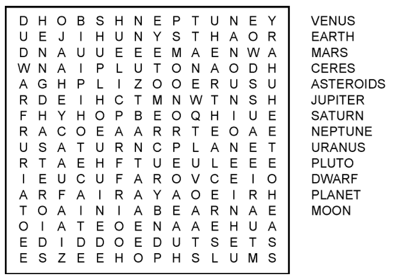
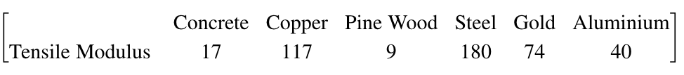
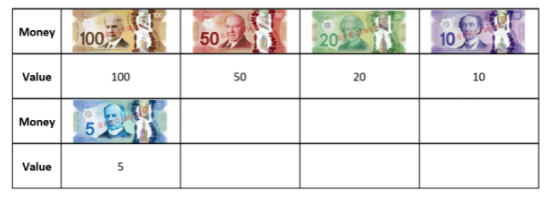
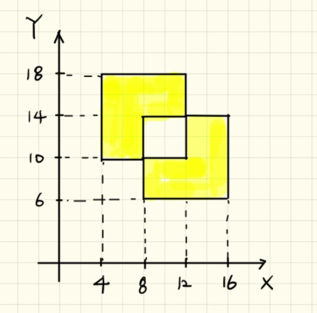
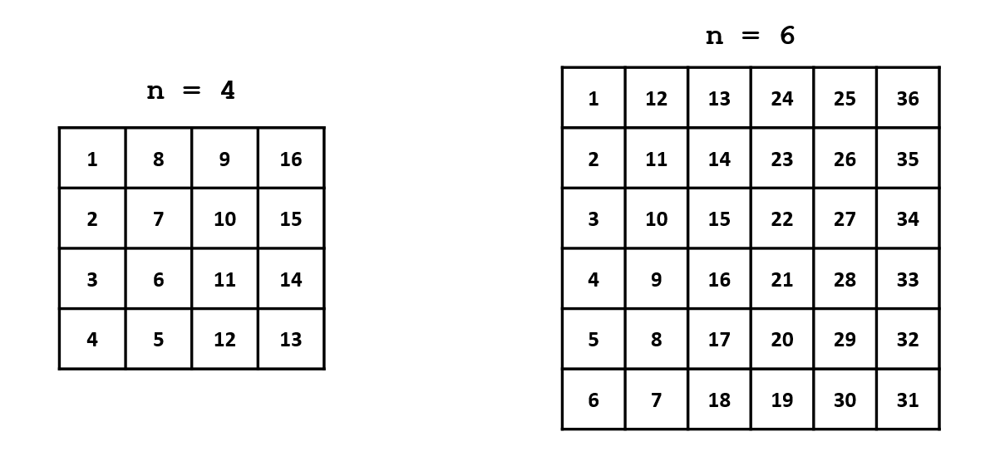

# Module 04: Loop Statement

**Last updated:** 2022-02-07

## M04001. Word Finder Puzzle (★★★)
I went to a Mel's diner with my daughter and saw an interesting word finder puzzle. Here is a sample. 



You are going to write a script to find a word from a puzzle. In general, this game is designed for searching multiple words. However, in this problem, you can write a program to find only one word, 'banana'. I wrote a code to create a word puzzle and insert 'banana' **at a random column or row locations.** This means, 'banana' is **not located at a diagonal direction.** 

You need to create a variable named 'word_loc' that contains a 6 x 2 matrix. Each row of 'word_loc' contains the location of each character of 'b','a', 'n', 'a', 'n', 'a' in order.  Column 1 of 'word_loc' is the row location of the elements location, and column 2 of 'word_loc' is the column location of the elements location. Note that you need to use a MATLAB editor to solve this problem using debugger. Please copy the template codes to your editor. 

**Solution**  
Please watch this:[**https://youtu.be/tNU7PFt6RzU?t=2430**](https://youtu.be/tNU7PFt6RzU?t=2430)

## M04002. Bus Fare (★★★)


Write a script to estimate the bus fare for any one person. Adults aged 18 to 59 cost $5, seniors aged 60 and older cost $3, youth aged 5 years to 17 years old cost $2 and children under 5 are free.

Also, here are the discount offers:
* Having a student ID receive a 15% discount (for all days), 
* Youth travelling on schooldays (Monday to Friday) receive a 20% discount
* Seniors travelling on Senior's Day (Tuesday's) receive a 10% discount.

Note that the discount offer can combined. For example, a senior adult having a student id will receive 25% discount. Values for age are provided in ''ages', and the day is given as a number between 1 and 7 as 'days'. The first day of the week (day 1) is a Monday.  'ids' is 1 if the passenger has a valid student ID, and 0 otherwise. 'bus_data' contains all these three variables and you need to use 'bus_data' to solve this problem. The fare for each passenger in 'bus_data' should be contained in 'fare_vals'.  Each fare in 'fare_vals' will be evaluated in the test in the MATLAB Grader.

**Solution**  
Please watch this:[**https://youtu.be/tNU7PFt6RzU?t=1343**](https://youtu.be/tNU7PFt6RzU?t=1343)

## M04003. Value Replacement using a loop statement (★)
Please write a script to do the following operation using a loop statement.

(a) A column vector named 'vec1' is given: 

```matlab
vec1 = randi(100,50,1);
```
If the values in ‘vec1' are larger than 0 and less than 50, replace the values with 10. Otherwise, replace them with 5. 

(b) A matrix named 'mat1' is given: 

```matlab
mat1 = randi(100,50,10);
```
 If the values in ‘mat1' are larger than 0 and less than 50, replace the values with 10. Otherwise, replace them with 5. 
 
**Solution**  
Please watch this:[**https://youtu.be/d-jmA0pK97c?t=20**](https://youtu.be/d-jmA0pK97c?t=20)

## M04004. Element-wise Operations with a for-loop Statement (★)
Element-wise operations work by doing whatever operation is specified to each element in a matrix. This can also be done using a for loop.

```matlab
row1 = randi(100);
col1 = randi(100);
mat1 = randi(20,row1,col1);
```
(a) Create a new matrix 'mat2' with every element in 'mat1' multiplied by 3.  
(b) Create a new matrix 'mat3' with every element in 'mat1' having 6 added.  
(c) Create a new matrix 'mat4' which is element by element multiplication on elements of 'mat1' and 'mat2'.  
(d) Create a new matrix 'mat5' which is element by element addition of elements of 'mat1', 'mat2', 'mat3'.   

**Solution**  
Please watch this:[**https://youtu.be/d-jmA0pK97c?t=2425**](https://youtu.be/d-jmA0pK97c?t=2425)


## M04005. Are these two variables the same? (★★)

You are going to write a code to check if the given two variables are identical or not. 

(a) Write a script if two numeric vectors ('nvec1' and 'nvec2') are identical using a for-loop (Do not use any built-in function). If they are the same, assign logical(1) to 'lg_a'. Otherwise assign logical(0). 
```matlab
numeric_mat = [1 2 3 4 5; 2 3 4 5 6];
nvec1 = numeric_mat(randi(2), :);
nvec2 = numeric_mat(randi(2), :);
```

(b) Write a script if two character vectors ('cvec1' and 'cvec2') are identical using a for-loop (Do not use any built-in function). If they are the same, assign logical(1) to 'lg_b'. Otherwise assign logical(0). 
```matlab
char_mat = ['MATLAB'; 'Noreen'];
cvec1 = char_mat(randi(2), :);
cvec2 = char_mat(randi(2), :);
```
(c) Evaluate (a) and (b) using a built-in function called "isequal". https://www.mathworks.com/help/matlab/ref/isequal.html
Assign the test result to 'lg_cn' and 'lg_cc', respectively. For instance, you need to compute 'lg_cn' using 'isequal' and it is the same with the value in 'lg_a'. 

**Solution**
```matlab
numeric_mat = [1 2 3 4 5; 2 3 4 5 6];
nvec1 = numeric_mat(randi(2), :);
nvec2 = numeric_mat(randi(2), :);

char_mat = ['MATLAB'; 'Noreen'];
cvec1 = char_mat(randi(2), :);
cvec2 = char_mat(randi(2), :);

%(a)
n_num = numel(nvec1);
lg_a = logical(1);
for ii=1:n_num
    if nvec1(ii) ~= nvec2(ii)
       lg_a = logical(0); 
       break;
    end
end

%(b)
n_char = numel(cvec1);
lg_b = logical(1);
for ii=1:n_num
    if cvec1(ii) ~= cvec2(ii)
       lg_b = logical(0); 
       break;
    end
end

%(c)
lg_cn = isequal(nvec1, nvec2);
lg_cc = isequal(cvec1, cvec2);
```

## M04006. Candy Store (★★)

Noreen owns a candy store, and she did a promotion on May 2. If customers applied for membership cards on that day, they would have a chance to win a prize. 3000 people applied for a membership card. The prize will be awarded to only three customers by order of application. The receivers are chosen based on their membership card number. 

The card number is 10 digits. To win the prize:
* '3' appears at the third and fifth indexes (locations) of the card number. 

For example, the person whose card number is either '12**3**5**3**42456' or '12**3**5**3**42313' will receive the prize if people who apply for the card application prior to the person do not take three of prizes. 

The following numbers do not satisfy the above conditions: '1212**3**12**33**1', '1111**3**12168', '12**3**1095869'

A 3000 x 10 matrix named 'card_num_all' is randomly generated and each row has a card number.
```matlab
card_num_all = randi(10, 3000, 10)-1; % a 3000 x 10 matrix and its elements are generated from 0 to 9. 
priz_rs = zeros(1, 3); % index of receivers
```
Write a script to find the index of prize receivers and assign it value to 'priz_rs' in order, which is a 1 x 3 vector.  In this problem, you must use a 'break' command so that the execution is terminated once you find all three receivers. If you can't find three receivers (not feasible probabilistically), leave the element(s) as zero(s). 

**Solution**   
Please watch this:[**https://youtu.be/tNU7PFt6RzU?t=54**](https://youtu.be/tNU7PFt6RzU?t=54)

## M04007. Built-in Functions: diag and strcmp (★)
In this problem, we will be recreating MATLAB built-in functions using for/while loops! You must use a loop statement without using the corresponding built-in functions. 

(a) **diag()**: A n x n matrix named 'mat1' is given. Please read values at a diagonal member and assign its value to a 1 x n row vector named 'vec_a'. For example, if 'mat1' is [1 2 3; 4 5 6; 7 8 9], 'vec_a' becomes [1 5 9]. 

(b) **strcmp(a,b)**: This function is to compare two vectors to check to see if they're equal (very similar to the 'isequal' function), and either a logical(0) or logical(1) is assigned if they are different or the same. 'ch_vec1' and 'ch_vec2' are given and they are the same length. Please compare these two vectors to see if they are the same or not. Its result (logical value) is assigned to 'logi_b'. Note that you assume that you do not know the values in 'ch_vec1' and 'ch_vec2'. 

**Solution**   
Please watch this:[**https://youtu.be/d-jmA0pK97c?t=860**](https://youtu.be/d-jmA0pK97c?t=860)

## M04008. Word Puzzle Solver - Multiple Words (★★★★)


In this problem, you will solve an advanced word puzzle problem, similar to the one in the tutorial. However, this time your script must be able to solve for the locations of multiple words! The words you will search for are given in a character array called 'words'. Similar to in Lab 05, the words are inserted either horizontally or vertically. The word will also not read backwards (down to up or right to left). 

```matlab
word = ['textbook'; 'backpack'; 'overhead'; 'maximize'; 'popinjay'];
```
Write a script that outputs 'word_loc', which is a 8x2x5 matrix. word_loc(:,:,ii) is a 8 x 2 matrix where the first and second columns contain the row and column locations of characters in a words(ii,:), respectively. For example, word_loc(1,2,2) indicates that the column location of 'b' in 'backpack'. Another example is word_loc (3,1, 4) indicates that the row location of 'x' in 'maximize'. The code for printing the words that you found is in the learner template so you can check your answer. 

**Solution**

```matlab
words = ['textbook'; 'backpack'; 'overhead'; 'maximize'; 'popinjay'];
n_word = size(words, 1);
n_char = size(words, 2); % same # of characters in all words

word_db = double(words);

puzzle_size = 20;
puzzle = CreateWordPuzzle(puzzle_size, words);


% print the puzzle
fprintf('TEST PUZZLE \n \n'); 
disp(char(puzzle));
fprintf('\n');

% find a word location
word_loc = zeros(n_char, 2, n_word);
for ii = 1:n_word
    word_test = words(ii, :);
    
    for jj = 1:puzzle_size
        test_row = strfind(char(puzzle(jj, :)), word_test); % search rows
        test_col = strfind(char(puzzle(:, jj))', word_test); % search a column
        if ~isempty(test_row)
            word_loc(:,1,ii) = jj;
            word_loc(:,2,ii) = test_row:(test_row+n_char-1);
            break
        elseif ~isempty(test_col)
            word_loc(:,1,ii) = test_col:(test_col+n_char-1);
            word_loc(:,2,ii) = jj;
            break
        end
    end
end

% printing the words that you found
fprintf('The words that you found are: \n')
for ii=1:n_word
    char_found = puzzle(word_loc(:,1,ii) + (word_loc(:,2,ii)-1)*puzzle_size);    
    fprintf('%s \n', char(char_found'));
end


% Generating a puzzle
function puzzle = CreateWordPuzzle(puzzle_size, word_set)

puzzle = zeros(puzzle_size, puzzle_size);
word_char_seq = [];

% assign word set
n_word = size(word_set,1);
for ii=1:n_word
    word = char(word_set(ii,:));
    word_char_seq = [word_char_seq word];
    len_word = numel(word);
    while 1
        idx = randi(puzzle_size);
        if randi([0 1])
            % row vector
            row_vec = puzzle(idx,:);
            cs_row_vec = conv(~row_vec, ones(1, numel(word)),'valid');
            logi_cs_row = (cs_row_vec == numel(word));
            if any(logi_cs_row)
                loc = find(logi_cs_row);
                str_loc = loc(randperm(numel(loc),1));
                puzzle(idx,str_loc:(str_loc+len_word-1)) = word;
                break;
            end
        else
            % column vector
            col_vec = puzzle(:, idx);
            cs_col_vec = conv(~col_vec, ones(1, numel(word)),'valid');
            logi_cs_col = (cs_col_vec == numel(word));
            if any(logi_cs_col)
                loc = find(logi_cs_col);
                str_loc = loc(randperm(numel(loc),1));
                puzzle(str_loc:(str_loc+len_word-1), idx) = word';
                break;
            end
        end
    end
end

char_a = 97;
char_z = 122;
char_array = char_a:char_z;
non_word_char = char_array(~ismember(char_array, unique(word_char_seq)));

emty_puzzle = ~puzzle(:);
puzzle(emty_puzzle) = ...
    non_word_char(randi(numel(non_word_char), [sum(emty_puzzle), 1]))';

end
```

## M04009. Alphabet Character Manipulation (★★)

```matlab
n = randi(10);% a randomly generated number ranging from 1 to 10
char_vec = char(randi([60 122],1,n)); % a 1xn charater vector
vowels = 'aeiouAEIOU';
```
(a) Write a script to check if 'char_vec' contains only lower case letters? Assign the result to 'only_lower'.  
(b) Write a script to check if 'char_vec' contains only alphabet? Assign the result to 'only_alp'.  
(c) Write a script to check how many vowels are contained in 'char_vec'? Assign the result to 'num_v'.  

**Solution**  
```matlab
n = randi(10);% a randomly generated number ranging from 1 to 10
char_vec = char(randi([60 122],1,n)); % a 1xn charater vector
vowels = 'aeiouAEIOU'; % giveb code
% write your code here

%(a)
only_lower = true;
for ii=1:n
    test_char = char_vec(ii);
    
    if ~and('a' < test_char, test_char < 'z');
        only_lower = false;
        break;
    end
end

% option 1
% lower_list_db = 97:122;
% n_list = numel(lower_list_db);
% n_lower = 0;
% for ii = 1:n
%     test_char_db = char_vec(ii);
%     for jj = 1:n_list
%         test_lower_db = lower_list_db(jj);
%         if test_char_db == test_lower_db
%             n_lower = n_lower + 1;
%         end
%     end
% end
% only_lower = n == n_lower;


%(b)
only_alp = true;
for ii=1:n
    test_char = char_vec(ii);
    
    cond1 = and('A' < test_char, test_char < 'Z');
    cond2 = and('a' < test_char, test_char < 'z');
    
    if ~or(cond1, cond2)
        only_alp = false;
        break;
    end
end

% option 2
% alp_list_db = [65:90 97:122];
% n_list = numel(alp_list_db);
% n_alp = 0;
% for ii = 1:n
%     test_char_db = double(char_vec(ii));
%     for jj = 1:n_list
%         test_alp_db = alp_list_db(jj);
%         if test_char_db ==  test_alp_db
%             n_alp = n_alp + 1;
%         end
%     end
% end
% only_alp = n == n_alp;

%(c)
n_vow_list = numel(vowels);
num_v = 0;
for ii = 1:n
    test_char = char_vec(ii);
    for jj = 1:n_vow_list
        if test_char == vowels(jj)
            num_v = num_v + 1;
        end
    end
end
```

## M04010. Repeating array elements (★★)

For loops are very useful in understanding how to maniplate vectors and matricies on an element-by-element basis, however, MATLAB provides enough basic functionlity where for-loops are not nessesary to get the same results. 

Given a row vector Q, make vector H, where the length of Q is tripled and a copy of each element is triple. For example if Q=[1 7 9], H=[1 1 1 7 7 7 9 9 9].  
(a) Use a for-loop to generate H and assign it to 'H1'.  
(b) Solve the same question but without using a loop statement. Generate H and assign it to 'H2'.   Hint: exploit vector concatenation and linear indexing ideas.

Note that there is a function called 'repelem' is designed for perfoming this operation. However, please do not use this function in this question.

**Solution**

```matlab
n=randi([1 10]);
Q=randi([1 25],1,n);

% (a)
H1 = [];
for ii=1:n
    H1 = [H1 ones(1,3)*Q(ii)]; % joining two of the same elements together
end

% (b)
H2 = [Q;Q;Q];
H2 = H2(1:3*n);
```

## M04011. Coop Salaries (★★★)

ByteDance always hires Canadian undergraduate students for coops. There are four departments are hiring coop students, including the IT, HR, marketing, and finance departments.  The company hires 20 coop students for summer 2020. Write a script to estimate the average hourly salary rate for any one undergraduate student hired in summer 2020. They pay the first-year and the second-year students $16 an hour, the third-year students $22 an hour, and the fourth-year students $24 an hour. 

Your salary would be raised if you meet the following conditions:
* This company has close cooperation with the University of Waterloo. If you have UW student ID, your hourly salary can be raised by 10%.
* If you can use MATLAB language and you are hired by the IT department, your hourly salary can be raised by 5%. 
* If you are doing a minor in business, and you are either in the marketing department or the finance department, your salary can be raised by 8%.

Note that :
* the conditions can be combined. For example, a UW student that knows the MATLAB language is hired in the IT department, this student's salary can be raised by 15%.
* 'ids' = 1 if the student has a UW student ID, and 0 otherwise.
* 'mat_language' = 1 if the student knows the 'MATLAB' language, and 0 otherwise.
* business’ = 1 if the student is doing a minor in business, and 0 otherwise.

Assign the estimated hourly salary of any 20 coop student to a variable called 'salary_vals', which is a 20 x 1 column vector.

**Solution**
```matlab
year = randi([1 4],20,1); % a 20 x 1 column vector representing which year the student is in
department  = randi([1 4], 20, 1); % a 20 x 1 column vector representing which department the student is in
% 'department'= 1: the IT department
% 'department'= 2: the HR department
% 'department'= 3: the marketing department
% 'department'= 4: finance department
ids = randi(2,20,1)-1; % a 20 x 1 column vector with values of either 0 or 1
mat_language = randi(2,20,1)-1; % a 20 x 1 column vector with values of either 0 or 1
business = randi(2,20,1)-1; % a 20 x 1 column vector with values of either 0 or 1
coop_data = [year department ids mat_language business];
clearvars year department ids mat_language business

n_coop = size(coop_data,1); % # of rows: See this syntax of the 'size' function
salary_vals = zeros(n_coop,1); % your output variable that include hourly salary for all coop students
for ii = 1:n_coop
    test_year = coop_data(ii,1);
    test_department = coop_data(ii,2);
    test_ids = coop_data(ii,3);
    test_mat_language = coop_data(ii,4);
    test_business = coop_data(ii,5);
    
    % write your script here
    % base slary
    if (test_year == 1) || (test_year == 2)
        base_sal = 16;
    elseif test_year == 3
        base_sal = 22;
    else
        base_sal = 24;
    end
    
    % determine if the student is in the marketing or the financa department
    is_mar_fin = (test_department == 3) || (test_department == 4);
    
    raise = 0;
    % raise: id
    if test_ids == 1
        raise = 0.1;
    end
    
    %raise: skills
    if (test_department == 1) && (test_mat_language == 1)
        raise = raise + 0.05;
    elseif (is_mar_fin) && (test_business == 1)
        raise = raise + 0.08;
    end
    
    salary_vals(ii) = base_sal*(1+raise);
    
end
```

## M04012. (Advanced) Candy Store (★★★)

Noreen owns a candy store, and she did a promotion on May 2. If customers applied for membership cards on that day, they would have a chance to win a prize. 10000 people applied for a membership card. The prize will be awarded to only **ten** customers by order of application. The receivers are chosen based on their membership card number. 

The card number is 10 digits. To win the prize, the card number satisfy the following conditions:
* '6' appears at the second and fifth indexes (locations) of the card number. 
* The first and last digits are not 3. 
* The second last number is less than 5. 

For example, the person whose card number is either '1**6**23**6**12122' or '6**6**23**6**12149' will receive the prize if all 10 prizes were not taken by the other people registered before this person.

A 10000 x 10 matrix named 'card_num_all' is randomly generated and each row has a card number. 

```matlab
card_num_all = randi(10, 10000, 10)-1; % a 10000 x 10 matrix and its elements are generated from 0 to 9. 
priz_rs = zeros(1, 10); % index of receivers
```

Write a script to find the index of prize receivers and assign it value to 'prize_rs' in order, which is a 1 x 10 vector. In this problem, you must use a 'break' command so that the execution is terminated once you find all ten receivers. 

If you can't find ten receivers (not feasible probabilistically), leave the element(s) as zero(s). 

**Solution**

```matlab
card_num_all = randi(10, 10000, 10)-1; % a 10000 x 10 matrix and its elements are generated from 0 to 9. 
priz_rs = zeros(1, 10); % index of receivers
% write your code here

num_id = 10000;

count_pz = 0;
for ii = 1:num_id
    test_id = card_num_all(ii,:);
    
    cond1 = and(test_id(2)==6 , test_id(5)==6);
    cond2 = and(test_id(1)~=3 , test_id(end)~=3);
    cond3 = test_id(end-1)<5;
    
    
    if cond1 && cond2 && cond3
        count_pz = count_pz + 1;
        priz_rs(count_pz) = ii;
    end
    
    if count_pz == 10;
        break
    end
end
```

## M04013. Tensile Stress (★★)

Please write a script that determines a tensile stress when tensile strain data and materials are given.  You need to use a switch statement (Avoid using if-else statement).  Tensile stress can be obtained from the product of strain and a tensile modulus of a material . A tensile modulus for each material is given as follows: 



Assume that 100 strain data measurements are made from different materials each time. The data are created from the following code:

```matlab
num_data = 100; % # of strain data
num_material = 6; % # of material
material_char = ['c', 'p', 'w', 's', 'g', 'a'];
% 'c': Concrete, 'p': Coppper, 'w': Pine wood, 's': Steel, 'g': Gold, 'a': Aluminum
strain_data = randi(10000, num_data, 1); % 'num_dat' number of strain values are randomly generate
material_data = zeros(num_data,1);
for ii=1:num_data
   material_data(ii) = material_char(randi(num_material)); % material initials are stored.
end
tensile_stress = zeros(num_data,1); % output tensile stress. 
```
'material_data' contain characters that indicate the materials for given measurements. You will assign tensile stress for each measurement to 'tensile_stress'. 'tensile_stress' is a 100 x 1 column vector. You do not need to consider units for the tensile modulus and strain. Note that tensile stress is tensile modulus times strain. 

**Solution**

```matlab
num_data = 100; % # of strain data
num_material = 6; % # of material
material_char = ['c', 'p', 'w', 's', 'g', 'a'];

% 'c': Concrete, 'p': Coppper, 'w': Pine wood, 's': Steel, 'g': Gold, 'a': Aluminum
strain_data = randi(10000, num_data, 1); % 'num_dat' number of strain values are randomly generate
material_data = zeros(num_data,1);
for ii=1:num_data
   material_data(ii) = material_char(randi(num_material)); % material initials are stored.
end
tensile_stress = zeros(num_data,1); % output tensile stress. 

% solution
for ii = 1:num_data
    material_test = material_data(ii);
    strain_test = strain_data(ii);
    switch material_test
        case 'c'
            stress_test = strain_test * 17;
        case 'p'
            stress_test = strain_test * 117;
        case 'w'
            stress_test = strain_test * 9;
        case 's'
            stress_test = strain_test * 180;
        case 'g'
            stress_test = strain_test * 74;
        case 'a'
            stress_test = strain_test * 40;
    end
    tensile_stress(ii) = stress_test;
end
%second option:
%material_data_char=char(material_data);
%modulus=tensile_stress;
%for i=1:num_data;
    %switch material_data_char(i)
        %case 'c'
            %modulus(i)=17;
        %case 'p'
            %modulus(i)=117;
        %case 'w'
            %modulus(i)=9;
        %case 's'
            %modulus(i)=180;
        %case 'g'
            %modulus(i)=74;
        %case 'a'
           %modulus(i)=40;
    %end
%end
%tensile_stress=modulus.*strain_data
```

## M04014. Making the Change (★★★)


You are making a script for a telling machine. If the money value is provided, your script computes the number of bills or coins. Always use bigger bills or coins first if it allows. The tellling machine has seven Canadian different bills/coins above. The output of your script is a 1 x 7 row vector named 'cad_change' that includes the number of bills/coins in the order above. For example, when 232 dollar is provide as an input dollar, 'cad_change' becomes [2 0 1 1 0 1 0]. Another example, when 68 dollar is provide as an input dollar, 'cad_change' becomes [0 1 0 1 1 1 1]. The input dollar named 'money' is randomly generated. 

**Solution**

```matlab
money = randi([30 500], 1);
cad_change = zeros(1,7);

cad_vec = [100 50 20 10 5 2 1];
rem_money = money;
for ii=1:7
    cad_change(ii) = fix(rem_money/cad_vec(ii));
    rem_money = rem_money - cad_change(ii) * cad_vec(ii);
end

fprintf('The input dollar is %d \n', money);
fprintf('The number of Canadian bills/coins are \n');
fprintf('100: %d, 50: %d, 20: %d, 10: %d, 5: %d, 2: %d, 1: %d \n',cad_change);
```

## M04015. Bulls and Cows (★)

UW Bulls and Cows is a mind game, developed by Noreen. In the game, a random, 3-digit even number (Possible digits are 0, 2, 4, 6, 8) is chosen, called a true number, and its values are compared to those of a test number. All rules are exactly the same as the original Bulls and Cows game that we studied in the lecture except the digits used and the number of digits evaluated. All three digits of the number are different. If any digit in the test number is the exact same value and in the exact same position as any digit in the true number, this is called a bull. If the digit is present in both the trial number and chosen number but is not in the same location, this is called a cow. 

Please note that both the test number and true number have every digit element separated into an array element. For example if the test number is 024, 'test_num' is actually [0,2,4]. A true number named as 'true_num' is given and a test number named as 'test_num' is also given. Please write a script to evaluate bulls and cows of a test number. The resulting bulls and cows are assigned to 'bulls' and 'cows'. 

**Solution**

```matlab
even_num = [0 2 4 6 8];
true_num = even_num(randperm(5,3)); % randomly generate a 1 x 3 vector in which elements are picked among even digits.
test_num = even_num(randperm(5,3)); % randomly generate a 1 x 3 vector in which elements are picked among even digits.

% bulls 
numb = 0; % number of Bull
for ii=1:3
    if true_num(ii) == test_num(ii)
        numb = numb + 1;
    end
end

bulls = numb;

% cows
numc = 0;
for ii=1:3
    for jj=1:3
        if true_num(ii) == test_num(jj)
            numc = numc + 1;
        end
    end
end

cows = numc-bulls;

fprintf('True number is [%d %d %d]. \n', true_num);
fprintf('Test number is [%d %d %d]. \n', test_num);
fprintf('Bulls and Cows that you found are %d and %d \n', bulls, cows);
```

## M04016. Create Sequences (★) 

```matlab
n = randi([4 20], 1); % n is a randomly generated number ranging from 4 to 20
mat1 = randi([10 100], n);
mat2 = randi([10 100], n);
```
a) Create a mirrored row vector named 'vec1' where the second last element (n-1) is repeated n-2 times on both side of the middle element.  (Note that if n is 4 then vec1 = [1 2 3 3 4 3 3 2 1] or if n is 5 then vec1 = [1 2 3 4 4 4 5 4 4 4 3 2 1])

b) Create a 1 x n row vector named 'vec2' which has the sequence 2(3), 4(4), 6(5), 8(6)..., (2*n)x(n+2). 

c) Create a matrix named 'mat_c' which concatenates 'mat1' and 'mat2' in the third dimension.

**Solution**
```matlab
n = randi([4 20], 1); % n is a randomly generated number ranging from 4 to 20
mat1 = randi([10 100], n);
mat2 = randi([10 100], n);

%(a)
vec1=[1:(n-2),ones(1,n-2)*(n-1),n,ones(1,n-2)*(n-1),(n-2):-1:1];

%(b)
vec2=(2:2:2*n).*(3:(n+2));

%(c)
mat_c = mat1;
mat_c(:,:, 2) = mat2;
```

## M04017. Making the Change: Many Money Values (★★★)


You are making a script for a telling machine. If the money value is provided, your script computes the number of bills or coins. Always use bigger bills or coins first if it is possible. The tellling machine has seven Canadian different bills/coins above. For example, when 232 dollars is provided as an input amount, the bills/coins needed are $100x 2, $20 x 1, $10x1, $2 x 1.

20 different money values are provided as an input. A 1 x 20 input money value vector named 'money' is randomly generated. You must find how many bills 
and coins are needed for each money value. The output of your script is a 1 x 7 matrix named 'cad_change' that includes the summed number of bills/coins for all 20 money values in the order: ($100, $50, $20, $10, $5, $2, $1). 

For example, suppose that there are two money values are inputted, 121 and 68. The bills and coins required for each of the money values are:
* $151:  $100 x 1, 50 x 1,  $1 x 1
* $68:  $50 x 1, $10 x 1, $5 x 1, $2 x 1, $1 x 1. 

The bills required to make up the money values are then summed into each respective bill category in 'cad_change'. Thus, 'cad_change' becomes [1 2 0 1 1 1 2].

**WARNING**: Do not sum up all the elements in 'money' and then solve for the bills needed to produce that result. You will automatically get the question wrong. 
This will be the result if you do so:
* $151 + $68 = $219
* $219: $100 x 2,  $10 x 1, $5 x 1, $2 x 2

And thus 'cad_change' becomes [2 0 0 1 1 2 0], which is a **wrong result**!!
Please note the difference between the two example vectors!

**Solution**
```matlab
n_money = 20;
money = randi([30 500], 1, n_money);
cad_change = zeros(1,7);

cad_vec = [100 50 20 10 5 2 1];

for ii=1:n_money
    test_money = money(ii);
    
    rem_money = test_money;
    test_change = zeros(1,7);
    for jj=1:7
        test_change(jj) = fix(rem_money/cad_vec(jj));
        rem_money = rem_money - test_change(jj) * cad_vec(jj);    
    end
    cad_change = cad_change + test_change;
end
```

## M04018. Making the Change: Bills Only (★★★)



You are making a script for a telling machine. If the money value is provided, your script computes the number of bills or coins that are equivalent to the input money value. Always use bigger bills or coins first if it is possible. For this specific tellling machine, it only provides 5 different types of Canadian dollars bills shown above. 
Thus, you need to round off the input money value in such a way that the money value is converted to the closest multiple of 5.  For example, 
* $232 → $230
* $538 → $540
* $137 → $135
* $32 → $30

Then, you need to compute the number of bills needed to reach the given money value. The output of your script is a 1 x 5 row vector named 'cad_change' that includes the number of bills in the order above. For example, when $232 dollars are provided as an input amount, the bills needed are:
* 2 x $100
* 0 x $50
* 1 x $20
* 1 x $10
* 0 x $5
* 
Therefore, 'cad_change' becomes [2 0 1 1 0], which is an amount of $230. 

Another example, when $68 dollars are provided as an input amount, the bills needed are:
* 0 x $100
* 1 x $50
* 1 x $20
* 0 x $10
* 0 x $5 

And thus 'cad_change' becomes [0 1 1 0 0], which is an amount of $70. 
The input amount named 'money' is randomly generated. 

**Solution**

```matlab
money = randi([30 500], 1);

cad_change = zeros(1,7); % re-define for re-using the code

cad_vec = [100 50 20 10 5 2 1];
rem_money = money;
for ii=1:7
    cad_change(ii) = fix(rem_money/cad_vec(ii));
    rem_money = rem_money - cad_change(ii) * cad_vec(ii);
end

if cad_change(6)*2+cad_change(7) >=3
    cad_change(5) = cad_change(5) + 1;
end
cad_change(6:7) = [];

fprintf('The input dollar is %d \n', money);
fprintf('The number of Canadian bills/coins are \n');
fprintf('100: %d, 50: %d, 20: %d, 10: %d, 5: %d \n',cad_change);
```

## M04019. Create Sequence (★) 

```matlab
n = randi([5 20], 1); % n is a randomly generated number ranging from 5 to 20
mat1 = randi([10 100], n);
mat2 = randi([10 100], n);
```
a) Create a (3n-3) x 1 column mirrored vector named 'vec_a' in which n is repeated (n-1) times. n is the middle of the mirrored vector.  (Note that n is repeated for n-1 times in the middle. e.g., if n is 4 then vec4 = [1; 2; 3; 4; 4; 4; 3; 2; 1] or if n is 5 then vec4 = [1; 2; 3; 4; 5; 5; 5; 5; 4; 3; 2; 1])

b) Create a 1 x n row vector named 'vec_b', which has the sequence: n*3, (n-1)*4, (n-2)*5, (n-3)*6..., 2*(n+1), 1*(n+2).

c) Create a matrix named 'mat_c' which concatenates 'mat1' and 'mat2' in the third dimension.

**Solution**
```matlab
n = randi([5 20], 1); % n is a randomly generated number ranging from 5 to 20
mat1 = randi([10 100], n);
mat2 = randi([10 100], n);

%(a)
vec_a = [1:n-1 ones(1,n-1)*n n-1:-1:1]';

%(b)
vec_b = (n:-1:1).*(3:n+2);

%(c)
mat_c = mat1;
mat_c(:,:, 2) = mat2;
```

## M04020. Bulls and Cows (★)

UW Bulls and Cows is a mind game, developed by Noreen. In the game, a random, 3-digit odd number is chosen (with possible digits of 1, 3, 5, 7, 9), called a true number, and its values are compared to those of a test number.All rules are exactly the same as the original Bulls and Cows game that we studied in the lecture except the digits used and the number of digits evaluated. All three digits of the number are different. If any digit in the test number is the exact same value and in the exact same position as any digit in the true number, this is called a bull. If the digit is present in both the trial number and chosen number but is not in the same location, this is called a cow. 

Please note that both the test number and true number have every digit element separated into an array element. For example if the test number is 173, 'test_num' is actually [1,7,3]. A true number named as 'true_num' is given and a test number named as 'test_num' is also given. Please write a script to evaluate bulls and cows of both of the test number. The resulting bulls and cows are assigned to 'bullz' and  'cowz'. 

**Solution**
```matlab
odd_num = [1 3 5 7 9];
true_num = odd_num(randperm(5,3)); % randomly generate a 1 x 3 vector in which elements are picked among odd digits.
test_num = odd_num(randperm(5,3)); % randomly generate a 1 x 3 vector in which elements are picked among odd digits.

% bulls 
numb = 0; % number of Bull
for ii=1:3
    if true_num(ii) == test_num(ii)
        numb = numb + 1;
    end
end

bullz = numb;

% cows
numc = 0;
for ii=1:3
    for jj=1:3
        if true_num(ii) == test_num(jj)
            numc = numc + 1;
        end
    end
end

cowz = numc-bullz;

fprintf('True number is [%d %d %d]. \n', true_num);
fprintf('test number is [%d %d %d]. \n', test_num);
fprintf('Bulls and Cows that you found are %d and %d \n', bullz, cowz);
```

## M04021 Matrix Manipulation using Loop Statements (★)

I went to a Mel's diner with my daughter and saw an interesting word finder puzzle. Here is a sample. 


You are going to write a script to find a word from a puzzle. In general, this game is designed for searching multiple words.
However, in this problem, you can write a program to find only one word, 'mango'. I wrote a code to create a word puzzle and insert 'mango' at a random column or row locations. The word is placed at either left-to-right or right-to-left in a row direction and at either top-to-bottom or bottom-to-top in a column direction. This means, 'mango' is not located at a diagonal direction. You need to create a variable named 'word_loc' that contains a 5 x 2 matrix. Each row of 'word_loc' contains the location of each character of 'm','a', 'n', 'g', 'o' in order. 

The first column of 'word_loc' is the row location of the elements location, and the second column of 'word_loc' is the column location of the elements location. Note that you need to use a MATLAB editor to solve this problem using debugger. Please copy the template codes to your editor. 

**Solution**
Please watch this:[**https://youtu.be/XxXoMoQiJOA?t=6**](https://youtu.be/XxXoMoQiJOA?t=6)


## M04022 Amazon Sale: Loop and Selection Statements (★★)

Amazon Canada is having an online Summer Sale! The 4 categories you can shop from to get a discount are: Sports, Technology, Home Decor and Books. There is a $20 shipping fee for purchases in the Sports and Technology categories, there is a $10 shipping fee for purchases in the Home Decor category and shipping is free for Books. There are 20 people who are making purchases during the sale. Write a script to calculate the final amount for each of the 20 people shopping. You can avail the discounts if you meet the following conditions:

* Amazon offers a special student discount. If you have UW student ID, your will receive a 10% discount.
* There is a special discount for Prime subscription holders. If you have a Prime Subscription, you will receive a 15% discount. 
* If you have a Mastercard, you will receive a 25% discount. 
* If you have a Prime Subscription and a Mastercard and have spent over $500, you will get a 50% discount. 

Please note that two discounts cannot be combined. If a person is eligible for two discounts, the greater of the two will be applied. For example: Kasturi has a UW Student ID and a Prime Subscription. She will ONLY receive a 15% discount and not a 25% (10% + 15%) discount. The final amount is calculated by subtracting the discount and then adding the shipping fee. Please note the discount is applied on the total amount spent only and does not apply on shipping fees.
  
All data are stored in 'shopping_data'. Please assign final amount to be paid by each of the 20 people to a variable called 'final_amount' which is a 1x20 row vector.

```matlab
cart_total = randi([100 1000],1, 20); % 1x20 vector, the numbers represents how much each of the 20 people spent
category  = randi([1 4], 1, 20); 
% 'category'= 1: Sports
% 'category'= 2: Technology
% 'category'= 3: Home Decor
% 'category'= 4: Books
student_id = randi(2,1,20)-1; % 1x20 vector, 'student_id' = 1 if the person has a UW student ID, and 0 otherwise.
prime_sub = randi(2,1,20)-1; % 1x20 vector, 'prime_sub' = 1 if the person has a Prime Subscription, and 0 otherwise. 
mastercard = randi(2,1,20)-1; % 1x20 vector, ‘mastercard’ = 1 if the person has a Mastercard, and 0 otherwise. 

shopping_data=[cart_total; category; student_id; prime_sub; mastercard]; %5x20 matrix containing shopping data for each person
clearvars cart_total category student_id prime_sub mastercard 

num_people=size(shopping_data, 2); % # of columns (number of people);
final_amount=zeros(1,num_people); % your output variable that includes final amount paid by each person
```

**Solution**
Please watch this:[**https://youtu.be/XxXoMoQiJOA?t=1786**](https://youtu.be/XxXoMoQiJOA?t=1786)

## M04023. Find the Number of Subsets (★★)

Kasturi is playing a number game where she is given a random set of numbers stored in a row vector called 'in_vec' of length 'n' (randomly generated).
```matlab
n = randi([1 30], 1); %random number between 1 and 30
in_vec = randperm(50, n); % 1 x n row vector of randomly generated numbers between 1 and 50 with no repeating elements
```
She is also given a value 'sum_val'. You need to compute the number of subsets of any two different numbers in 'in_vec' where their sum becomes 'sum_val'.
```matlab 
sum_val = randi([1 100], 1); %sum of two values within in_vec (between 1 and 100)
```
The number of possible subsets should be stored in 'num_set', which is Kasturi's final score. 'in_vec' is a row vector that contains integers without repeating elements. This means that if 'num_set' has a value which when summed with itself equals to 'sum_val', it does not count towards 'num_set' (a subset cannot have two same numbers). See example 4 for this explanation. Both 'sum_val' and 'num_set' are scalar values. 

**Example1: **
```matlab
in_vec = [1 2 3 4 5];
sum_val = 7;
num_set = 2;
```
Then, 'num_set' becomes 2 because sum of (2, 5) and (3, 4) becomes 7 (sum_val). Note that (2, 5) and (5, 2) are the same and only count as 1 subset  in 'num_set'. 

**Example 2:**
```matlab 
in_vec = [3 11 10 2 1 12];
sum_val = 13;
num_set = 3;
```
Then, 'num_set' becomes 3 because the sum of (3, 10), (11, 2), and (1, 12) becomes 13 (sum_val). 

**Example 3: **
```matlab
in_vec = [3 11 10 2 1 12];
sum_val = 16;
num_set = 0;
```
Then, 'num_set' becomes 0 because there is no set of two numbers of which summed becomes 16. 

**Example 4:**
```matlab
in_vec = [8 2 5 12 13 14];
sum_val = 10;
num_set = 1;
```
Then, 'num_set' becomes 1 because only (8,2) are the only set of numbers that are different and sum up to 10. (5,5) does not count for this problem.

**Solution**
Please watch this:[**https://youtu.be/GVRazuYtbBo?t=858**](https://youtu.be/GVRazuYtbBo?t=858)

## M04024. How many points are inside the box? (★★) - 15 points



You are going to write a code to check how many 2D points are inside the region (in yellow). 
The x and y coordinates of 300 points are stored as a 300 x 2 array named 'pt_set'.
The first column of 'pt_set' contains x coordinates and the second column contains y coordinates for all points. 
The x and y coordinate of each point is randomly generated from the interval (0 20) in x and y directions.  
```matlab
pt_set = (rand(300,2)-0.5)*20 + 10; % a 300 x 2 array generated on the interval (0 20)
```
(a) Write a script to calculate a number of points inside the region (in yellow) and assign the resulting number to 'num_pt_in'. 
(b) Write a script to calculate a number of points outside the region (in yellow) and assign the resulting number to 'num_pt_out'. 
Note that the point on the border (the boundary of the box) is NOT considered as "inside". 

**Solution**
Please watch this:[**https://youtu.be/dvypAsCkOK4?t=381**](https://youtu.be/dvypAsCkOK4?t=381)

## M04025. Value arrangement (★★) - 15 points

Create a n x n matrix where the integers from 1 to n^2 are placed forward and backward in a vertical direction in order. Here are the examples:
  
  

(a) Create a n x n matrix named 'mat_a', which is generated according to the above pattern using loop statements. 
(b) Create a n x n matrix named 'mat_b', which is generated according to the above pattern without using loop statements. 

**Solution**
Please watch this:[**https://youtu.be/dvypAsCkOK4?t=1363**](https://youtu.be/dvypAsCkOK4?t=1363)

## M04026. Locating Values in a Matrix (★) 

n = randi([10 20]); % A random scalar from 10 to 20
mat = randi([0 20],n,n); % A n x n matrix with random element values from 0 to 20
Find the first 10 incidences (occurrence) of the value 15 in the given variable 'mat'. You need to search them in a linear indexing order but record their subscript indexes in order.
Create a variable named 'loc_ind', a 10x2 matrix and assign subscript indexes in each row in 'loc_ind'. Note that the row and column indexes are located in the first and second columns in 'loc_ind'. 
If there are less than 10 incidences of 15 in 'mat', leave all remaining values in 'loc_ind' as 0.  
Requirement
1. Must use 'for-loop' function while solving this problem. 
2. Must not use built-in functions that find indices and values (e.g., find). 

Example 1. If 'mat' is 
mat =

    17     0    16    13
    14     9     3    14
     6     8    10    15
    15    16    15     5
then, 'loc_ind' becomes 
loc_ind =

     4     1
     4     3
     3     4
     0     0
     0     0
     0     0
     0     0
     0     0
     0     0
     0     0

Example 2. If 'mat' is 
mat =

    13    15    10     2    17
    15    12    14     3     5
     2     4    15     5    19
    10    15    20    17     7
    20     5    11     5     4
then, 'loc_ind' becomes 
loc_ind =

     2     1
     1     2
     4     2
     3     3
     0     0
     0     0
     0     0
     0     0
     0     0
     0     0

**Solution**

```matlab
n = randi([10 20]); % A random scalar from 10 to 20
mat = randi([0 20],n,n); % A n x n matrix with random element values from 0 to 20

% Write your script here
loc_ind = zeros(10,2); % Pre-define size
count = 0; % Initialize count

for ii = 1:n % column index numbers
    for jj = 1:n % row index numbers
        test_val = mat(jj,ii); % Extract test value
        
        if test_val == 15 
            count = count +1; % Increase count by 1
            loc_ind(count,:) = [jj ii]; % Store index values
        end
        
        if count == 10 
            break % End inside loop once 10 values found
        end
    end
    
    if count == 10
        break % End outside loop once 10 values found
    end
    
end
```

## M04027. How Many Points are Inside a Blue Region (★★) 


You are going to write a code to check how many 2D points are inside the region (in blue). 
The x and y coordinates of 400 points are stored as a 2 x 400 array named 'pt_set'.
The first row of 'pt_set' contains x coordinates and the second row contains y coordinates for all points. 
The x and y coordinate of each point is randomly generated from the interval (0 16) in x and y directions.  
pt_set = rand(2, 400)*16; % a 2 x 400 array generated on the interval (0 16)
Write a script to calculate the number of points inside the region (in blue) and assign the resulting number to 'num_pt_in'. 
Note that the point on the border (the boundary of the blue region) is NOT considered as "inside".

**Solution**

```matlab
pt_set = rand(2, 400)*16; % a 2 x 400 array generated on the interval (0 16)

bbox1 = [3 12 4 10]; % Outer box: x1 x2 y1 y2
bbox2 = [5 10 6 8]; % Inner box: x1 x2 y1 y2

num_pt_in = 0; 

for ii=1:400
    pt = pt_set(:, ii);
 
    is_b1 = (pt(1)>bbox1(1) && pt(1)<bbox1(2)) && (pt(2)>bbox1(3) && pt(2)<bbox1(4));
    is_b2 = (pt(1)>=bbox2(1) && pt(1)<=bbox2(2)) && (pt(2)>=bbox2(3) && pt(2)<=bbox2(4));
    
    is_pt_inside = is_b1 && ~is_b2;
    
    num_pt_in = num_pt_in + is_pt_inside;
end
```

## M04028. Concert Tickets (★★) 

Avenged Sevenfold has a tour with a stop in Waterloo in two months. A standard ticket costs $30, while a backstage pass costs $40. 
The band also offers some discounts:
Merch discount: If you show Avenged Sevenfold merch when you buy your ticket you'll recieve a 25% discount
Early Bird discount: If you buy your ticket at least 30 days (inclusive) before the concert, you'll recieve a 10% discount (e.g., 30, 31, 32 ...)
Senior and youth discount: If you're over the age of 60 OR under the age of 18 (exclusive) you'll receive a 5% discount (e.g., 61, 62, 17, or 16) 
Note: A person will only receive the highest discout that they're eligible for.  
For example, a person with merch who purchased their ticket 40 days before the concert will ONLY receive a 25% discount.
Another example, a senior person (whose age is 64) who purchased their ticket 50 days before the concert will ONLY receive a 10% discount.

```matlab
n = 100; % Number of concert goers (100 in this question)

ticket = randi([1 2],n,1); % 100x1 vector containing 1 or 2. 1 - standard ticket, 2 - backstage pass
merch = randi([0 1],n,1); % 100x1 vector. 1 if person has merch, 0 if not
days = randi([1 60],n,1); % 100x1 vector. Number of days before the concert each person purchased their ticket
age = randi([1 100],n,1); % 100x1 vector. Age of each person

info = [ticket merch days age]; % 100 x 4 matrix, contaning relevant info for each person.
clearvars ticket merch days age

price = zeros(n,1); % Pre-define vector size
```

'info' contains all of the relevant information for your script. 
Compute the money paid by each person and assign the value to 'price' in order. 

**Solution**

```matlab
n = 100; % Number of concert goers (100 in this question)

ticket = randi([1 2],n,1); % 100x1 vector containing 1 or 2. 1 - standard ticket, 2 - backstage pass
merch = randi([0 1],n,1); % 100x1 vector. 1 if person has merch, 0 if not
days = randi([1 60],n,1); % 100x1 vector. Number of days before the concert each person purchased their ticket
age = randi([1 100],n,1); % 100x1 vector. Age of each person

info = [ticket merch days age]; % 100 x 4 matrix, contaning relevant info for each person.
clearvars ticket merch days age

price = zeros(n,1); % Pre-define vector size

% Write your script here

for ii = 1:n
    test_ticket = info(ii,1); % Extract ticket info
    test_merch = info(ii,2); % Extract merch info
    is_early = info(ii,3) >= 30; % Extract days before concert, compare to 30
    is_age = info(ii,4) < 18 || info(ii,4) > 60; % Extract age, compare to 18 or 60
    
    if test_ticket == 1 % If standard
        test_price = 30;
    else % If backstage
        test_price = 40;
    end
    
    % Discounts, largest to smallest
    if test_merch 
        discount = .25;
    elseif is_early
        discount = .1;
    elseif is_age
        discount = .05;
    else
        discount = 0;
    end
    
    test_price = test_price*(1-discount); % Apply largest discount
    
    price(ii) = test_price; % Assign cost to respective row in 'price'
end
```

## M04029. Number Game (★★★) 

Jesse has created a number game. The goal is to score a 1 x 50 number sequence (vector) that contains 50 non-zero positive integers. 
The final score is computed by summing the scores of all 50 numbers in a given sequence. 
The score for a given number can be computed by the following rule (cumulative):
Single digit number (like 1, 2..9): +5 
Multiple of 2: +2
Multiple of 3: +3
If the number does not satisfy any of the above three conditions: -3

```matlab
seq = randi([1,100], 1, 50); % 1 x 50 sequence
```

Compute the score of 'seq' and assign its score to a variable named 'score'

Example 1: If 'seq' is 
seq =

    10     5     6
then, 'score' becomes
score =

    17
because the score for each number is
10: +2
5: +5 
6: +10 (5 + 2 + 3)
Example 2: If 'seq' is 
seq =

    11     7     17
then, 'score' becomes
score =

    -1
because the score for each number is
11: -3
7: +5 
17: -3 

**Solution**

```matlab
seq = randi([1,100], 1, 50); % 1 x 50 sequence

% Write your script

score = 0;

for ii=1:50
   tchar = seq(ii);
   
   tscore = 0;
   if tchar<10
      tscore = tscore + 5;
   end
   
   if rem(tchar, 2) == 0
       tscore = tscore + 2;
   end
   
   if rem(tchar, 3) == 0
       tscore = tscore + 3;
   end
   
   if tscore == 0
       tscore = -3;
   end
   score = score + tscore; 
end
```

## M04030. Number Game (★★★) 

You are going to write a script to find the locations of 'cive' from a character vector named 'word_seq'. 
'word_seq' is a 1 x 500 lowercase alphabet sequence.  
The locations are stored in a row of 'word_loc' in order. The size of 'word_loc' becomes (a number of 'cive') x 4. 
Note that a number of 'cive' in 'word_seq' is at least one and less than 20. 

Example 1: If 'word_seq' is 

```matlab
word_seq = 'civeabdecivaaciveiepwqmcive';
```

then, 'word_loc' becomes
word_loc =

     1     2     3     4
    14    15    16    17
    24    25    26    27
word_seq = 'civeabdecivaaciveiepwqmcive';
The first 'cive' is located at [1 2 3 4]. 
The second 'cive' is located at [14 15 16 17]. 
The third 'cive' is located at [24 25 26 27]. 

Example 2: If 'word_seq' is 

```matlab
word_seq = 'asabdeciwqvdaaciveiepwqmaive';
```

then, 'word_loc' becomes
word_loc =

    15    16    17    18
word_seq = 'asabdeciwqvaaciveiepwqmaive';
There is only one 'cive' and its location is [15 16 17 18].

**Solution**

```matlab
word_seq = char(randi([97 122], 1, 500)); % generate a random character sequece

n_word = randi([5 20]); % # of 'cive'
wst = randi([1 490], 1, n_word); % starting word locations
wst_loc = reshape([wst;wst+1;wst+2;wst+3], [], 1);

word_seq(wst_loc) = repmat('cive', 1, n_word); 

clearvars wst wst_loc n_word

% write your script

num_cive = 4;
word_loc = [];
for ii=1:500-num_cive+1
    test_loc = ii:(ii+num_cive-1);
    if isequal(word_seq(test_loc), 'cive')
        word_loc = [word_loc; test_loc];
    end
end

% you need to create 'word_loc' to execute the code below
n_word = size(word_loc, 1); % # of 'cive'

fprintf('The word sequence is \n');
disp(word_seq); 

fprintf('\nWords that you found are \n');
for ii=1:n_word
    fprintf('%d. ', ii);
    disp(word_seq(word_loc(ii,:)));
end
```

## M04031. Advanced grocery Shopping (★) 

In HW3-Q1, you helped Rachel write a code to determine how much money she should spend on groceries. 
She's told all of her friends about how much your code has helped her with budgeting her spending, and now they all want your help determining how much they should spend. 
*If someone has less than $50 in their bank account, they will spend it all on groceries. 
*If someone has less than $100 and more than (or exactly) $50, they will spend 75% of their money on groceries.
*If someone has less than $300 and more than (or exactly) $100, they will spend 50% of their money on groceries.
*If someone has greater than (or exactly) $300, they will spend 50% of their money on groceries that they needs as well as an aditional $30 on some treats that they're craving.
A 50 x 1 column vector named 'acc_total' contains how much money each person has in their account:
acc_total = randi([0 500],50,1); % how much money each person has in their account
Create a script to determine how much each person should spend on groceries, assigning these values to a 50 x 1 column vector named 'money_spent'.
Use whichever method you prefer. 

**Solution**

```matlab
acc_total = randi([0 500],50,1); % how much money each person has in their account

% Start your script here

money_spent = zeros(50,1); % pre-define size

% I prefer this rather than the option 1. 
for ii=1:50
    test_acc = acc_total(ii);
    
    if test_acc < 50
        test_spent = test_acc;
    elseif test_acc >= 50 && test_acc < 100
        test_spent = test_acc*0.75;
    elseif test_acc >= 100 && test_acc < 300
        test_spent = test_acc*0.5;
    else
        test_spent = test_acc*0.5 + 30;
    end
    money_spent(ii) = test_spent;
end


% option 1
% %Find index values
% cond1 = acc_total < 50;
% cond2 = acc_total >= 50 & acc_total < 100;
% cond3 = acc_total >= 100 & acc_total < 300;
% cond4 = ~(cond1|cond2|cond3);
% 
% %Assign correct values to each location in 'money_spent'
% money_spent(cond1) = acc_total(cond1);
% money_spent(cond2) = acc_total(cond2)*.75;
% money_spent(cond3) = acc_total(cond3)*.5;
% money_spent(cond4) = acc_total(cond4)*.5 + 30;

% option 2
% money_spent=[];
% for ii=1:50
%     total_now = acc_total(ii);
%     if total_now<50
%         spent_now = total_now;
%     elseif total_now<100
%         spent_now = 0.75*total_now;
%     elseif total_now<300
%         spent_now = 0.5*total_now;
%     else
%         spent_now = 0.5*total_now + 30;
%     end
%     money_spent=[money_spent;spent_now];
% end
```
