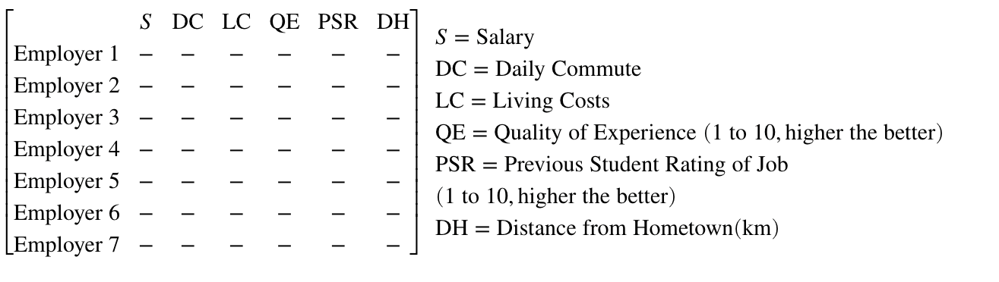
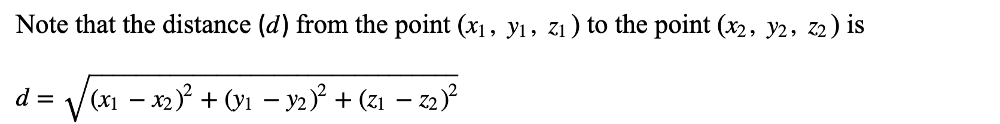
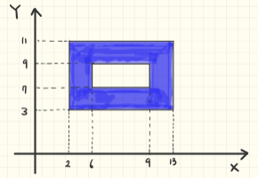

# Module 06: Operators

**Last updated:** 2021-08-14

## M06001. Parking Data (★★★★) 

```matlab
empty_lot = zeros(20,20);
parking_data = cat(3, empty_lot, randi([0 1],20,20,9), empty_lot); % there is no car ('empty_lot') at 8 AM and 6 PM 
```

You want to determine how often cars are moving from parking spots at a mall. 'parking_data' is provided in the form of a 20x20x11 matrix, where each element is a parking spot and each layer is a different time from 8AM to 6PM (layer 1 is 8AM and layer 10 is 5PM). The mall opens at 9AM and closes at 5PM, so at 8AM and 6PM the parking lot should be empty (see how 'parking_data' is created). An occopied parking spot is represented with a 1, and an empty parking spot is represented with a 0. 

You will need to write a script to create a variable named:

(a) 'num_fill', which is a scalar value. 'num_fill' represent the total number of spots that are filled with cars during working hours. 400 (20 x 20) spots are availabe each hour so the total number of spots avialable for 9 working hours (9AM to 5PM) are 3600. How many spots are filled with cars? Assign its value to 'num_fill'. 

(b) 'max_occ' and 'min_occ'. 'max_occ' finds the time of day with the most spots occupied, and 'min_occ' finds the time of day with the fewest spots occupied when the mall is opened (neither 8AM or 6PM). Time of day is equal to the layer number. For example, if 9AM is the busiest time, 2 is assigned to 'max_occ'. 

(c)  'num_park_left', which is a 1x11 row vector (from 8AM to 6PM). 'num_park_left' represents the number of cars that have left parking spots (fill to empty). The first element of 'num_park_left' should be zero because the parking lot is empty at 8AM.

(d)  'num_park_enter', which is a 1x11 row vector  (from 8AM to 6PM). 'num_park_enter' represents the number of cars that have entered parking spots (empty to filled). The first and last elements of 'num_park_enter' are a zero because none of cars come in the parking at 8AM and 6PM.

(e) 'most_filled_spot', which is a scalar value. What is the longest time (in hours) in which a parking spot has been taken up by a car? Note that this question is to count the number of hours when the corresponding parking spot is filled. It is not counting the longest hours that a single car is parked.Here is a simple example to help your understanding. 


**Solution**  
Please watch this:[**https://youtu.be/dzlSFfTIQYU?t=1021**](https://youtu.be/dzlSFfTIQYU?t=1021)

## M06002. Course Grading using Array Operations (★★★)

This program is to compute grades of students in a course.  Assume that there are 7 students in a class and they took 5 exams during the course. The weights of the exams that contribute the final grade are 10%, 15%, 20%, 25%, and 30% in order. 

```matlab
ex1 = randperm(61,7)+38+rand(1,7); % generate exam scores of 7 students for exam1 without overlap. 
ex2 = randperm(61,7)+38+rand(1,7); % generate exam scores of 7 students for exam2 without overlap. 
ex3 = randperm(61,7)+38+rand(1,7); % generate exam scores of 7 students for exam3 without overlap. 
ex4 = randperm(61,7)+38+rand(1,7); % generate exam scores of 7 students for exam4 without overlap. 
ex5 = randperm(61,7)+38+rand(1,7); % generate exam scores of 7 students for exam5 without overlap. 

score = [ex1;ex2;ex3;ex4;ex5]; 
clearvars ex1 ex2 ex3 ex4 ex5
```

A variable named 'score' is a 5 x 7 matrix and contains scores for each exam and each student. For instance, score(3,4) is a score of the third exam for student 4 and let's say that ID of this student is 4.  Another example, score(2,1) is a score of the second exam for a student having ID 1. 'score' is randomly generated and it ranges from 40 to 100. 'score' is generated using 'randperm' so there is no identical score within each exam. 

Please write a script to answer the following question. **You should not use a loop statement (e.g., for-loop or while-loop) to solve the following problems.**

(a) create a variable named 'num_a' that contains the number of students who get a score more than 60 in the fourth exam. 

(b) create a variable named 'st_score_b' that contains a student score. This score is the closest to and larger than the average score of the fourth exam. For example, assume that scores for the fourth exam are 91, 41, 92, 71, 43, 100, and 44. The average becomes 68.86. Thus, 'st_score_d' is 71. For example, assume that scores for the fourth exam are 91, 41, 92, 71, 43, 100, and 99. The average becomes 76.71. Thus, 'st_score_d' is 91. 

(c) create a variable named 'weight_score_c' that contains a 7 x 1 vector and its elements are the final scores. The final score for each student can be computed by the weighted summation of all scores. For example, assume that a student got 40, 50, 60, 70, and 90 from the exam in order.  The final score becomes 40x0.1 + 50x0.15 + 60x0.2 + 70x0.25 + 90x0.3 = 68. You will compute the final score for all students and their values are assigned to 'weight_score_c' in order. 

(d) create a variable named 'weight_modified_score_d' that contains a 7 x 1 vector and its elements are the modified final scores. In 'score', a score less than or equal to 50 is considered as 0 and a score more than or equal to 90 is 100. The final score is computed with the same way that you did in (c). For example, assume that a student got 40, 50, 60, 70, and 90 from the exam in order. The final score becomes 0x0.1 + 0x0.15 + 60x0.2 + 70x0.25 + 100x0.3 = 59.5.

**Solution**  
Please watch this:[**https://youtu.be/dzlSFfTIQYU?t=7**](https://youtu.be/dzlSFfTIQYU?t=7)

## M06003. Array Operation with Built-in Functions (★★★)

```matlab
n = randi([12 20]); % a random integer drawn from 12 to 20
mat1 = randi(40, 2, n); % a 2 x n matrix of which values are randomly drawn from 1 to 40

vec1 = randi(100, 1, 100); % a 1 x 100 matrix of which values are randomly drawn from 1 to 100
```
You need to write a script that create a variable named :

(a) 'is_there_39' that conains a logical value. The value is true if there exists an element greater than or equal to 39 in 'mat1'. Otherwise, assign the variable as false.

(b) 'mat2' that is copied from 'mat1'. Then, all elements larger than 10 in 'mat2' are replaced to 20. 

(c) 'vec3' that is copied from the second row of 'mat1'. Then, all elements in odd locations are replaced to 20 if they are larger than 10. 

(d) 'max_sum_pair' that contain the maximum sum of pairs. Let's assume that we are adding two numbers in 'vec1' in turn (without overlap). Since 'vec1' is a 1x 100 vector, 50 pairs and their sums could be generated. Assign the maximum sum value to 'max_pair'.  For example, when vec1 = [1 2 4 5 4 2], the sums of pairs becomes [3 9 6]. Thus, 9 is assigned to 'max_sum_pair'. 

(e) 'max_diff_pair' that contain the maximum absolute difference of pairs. Let's assume that we are computing absolute difference between two numbers in 'vec1' in turn (without overlap). Since 'vec1' is a 1x 100 vector, 50 pairs and their absolute difference could be generated. Assign the maximum absolute difference value to 'max_pair'. For example, when vec1 = [1 2 4 5 4 2], the absolute difference of pairs becomes [1 1 2]. Thus, 2 is assigned to 'max_diff_pair'. 

**Solution**  
Please watch this:[**https://youtu.be/JGcSm0YARNk?t=1641**](https://youtu.be/JGcSm0YARNk?t=1641)

## M06004. Matrix Indexing (★)

In this tutorial, we will be covering relational operators and logical built-in functions. Please avoid the use of if statments, assigning 'true' or 'false', or or assigning logical(1) or logical(0). The following given are provided for you to use for the questions below:

```matlab
n1 = randi([8 17]);
n2 = randi([8 17]);

vec1 = [randi([0 6]), randi([7 12])];
mat1 = reshape(randperm(n1*n2), n1, n2);

mat2 = randi([0 12], 3,4);
mat3 = randi([0 12], 3,4);
mat4 = randi([0 12], 3,4);

```

(a) Create a variable named 'mat_log1' which determines if each element in 'mat1' is greater than 2. If yes, return a logical(1) to the corresponding index location,  otherwise return a logical(0). 'mat_log1' is a 3 x 4 logical matrix. For example, if mat2 is [1 6; 7 0], then the resulting logical matrix is [0 1;1 0].

(b) Create a variable named 'mat_log2' which determines if each element in 'mat 2' is greater than the first element in 'vec1'.  'mat_log2' is a 3 x 4 logical matrix

(c) Create a variable named 'mat_log3' which determines if each element in 'mat3' is less than or equal to the element in the corresponding index of 'mat4'. If yes, return a logical(1) to the corresponding location, otherwise return a logical(0). 'mat_log3' is a 3 x 4 logical matrix. For example, 'mat3' is [1 6; 7 0] and 'mat4' is [1 10; 1 2]. Then, a resulting matrix is [1 1;0 1];

(d) Create a variable named 'is_same_mat234', which determine 'mat2', 'mat3' and 'mat4' are idenitcal. If yess, assign true to 'is_same_mat234', otherwise return false. 'is_same_mat234' is a logical value. 

(e) Create a variable named 'is_mat3_3_10', which determines if all elements in 'mat3' is greater than 3 and less than 10. If yes, assign true to 'is_mat3_3_10', otherwise return false. 'is_mat3_3_10' is a logical value. 

**Solution**  
Please watch this:[**https://youtu.be/JGcSm0YARNk?t=6**](https://youtu.be/JGcSm0YARNk?t=6)

## M06005. Built-in Function and Array Operation (★★)

```matlab
n = randi([10 20]); % a random integer generation
mat1 = randi([-50 50], n, n); % a nxn matrix of which elements are randomly generated from -50 to 50
mat2 = randi(100, n, n); % a nxn matrix of which elements are randomly generated from 1 to 100

num_shuffle = randperm(36); % random shuffling integers from 1 to 36
mat3 = reshape(num_shuffle, 4, 9); % reshape 'num_shuffle' to a 4 x 9 matrix

vec1 = randi(200, 3*n, 1); % a 3n x 1 column vector of which elements are randomly generated from 1 to 200

clearvars n 
```
You need to write a script that can:
(a) create a scalar variable named 'val_a' that contains the number of negative values in 'mat1'. For example, assume that mat1 = [1 3 -1; -2 1 -3]. 'val_a' becomes 3. 

(b) create a scalar variable named 'val_b' that contains the number of odd values in 'mat2'. For example, assume that mat2 = [1 3 2; 2 6 4]. 'val_b' becomes 2. 

(c) create a scalar variable named 'val_c' that contains the number of multiples of 3 in 'mat2'. For example, assume that mat2 = [1 3 2; 2 6 4]. 'val_c' becomes 2. 

(d) create a scalar variable named 'val_d' that contains a sum of the five lowest values in 'mat2'.  

(e) create a scalar variable named 'val_e' that contains an average of the four highest values in 'mat3'. 

(f) create a scalar variable named 'val_f' that contains the maximum distance between two values in 'vec1'. For example, vec1 = [3 1 3 20]. All distances between two values are 3, 2, 19, 1, 16, 17, which are from six different combinations of two values. Thus, 'val_f' becomes 19, which is obtained from the distance between 1 and 20. 

**Solution**  
Please watch this:[**https://youtu.be/JGcSm0YARNk?t=766**](https://youtu.be/JGcSm0YARNk?t=766)

## M06006. Candy Store: Array Operation (★★)

Vlad owns a candy store, and he did a promotion on July 2. If customers applied for membership cards on that day, they would have a chance to win a prize. 3000 people applied for a membership card. The prize will be awarded to **ALL** customers who qualify. The receivers are chosen based on their membership card number. 

The card number is 10 digits. To win the prize:
* '3' appears at the third and fifth indexes (locations) of the card number. 

For example, the person whose card number is either '1235342456' or '1235342313' will receive a prize. The following numbers do not satisfy the above conditions: '1212312331', '1111312168', '1231095869'

A 3000 x 10 matrix named 'card_num_all' is randomly generated and each row has a card number. 
```matlab
card_num_all = randi(10, 3000, 10)-1; % a 3000 x 10 matrix and its elements are generated from 0 to 9. 
num_priz_rs = 0; % number of prize receivers
```
Write a script to compute **the number of prize receivers** and assign its value to 'num_priz_rs'. **Please do not use a loop statement to solve this problem.**

**Solution**  
Please watch this:[**https://youtu.be/mlFJIMdrhNs?t=423**](https://youtu.be/mlFJIMdrhNs?t=423)

## M06007. Building Sensor Installation (★★★★) 

The matrix 'force_data' is an n1 x n2 matrix with each data point representing the force acting on the face of a building.  The row and column direction show where on the building that force was acting. For example, force_data(2,1) indicate the force value acting on the location of (2,1). You can consider the matrix as locations at the building facade. 

**The goal of this problem is to find five sensor locations and they should be consecutively placed in a row or column direction. **

The sensor location is determined by whatever five consecutive points that have the highest average force. You need to create a variable called 'sens_loc', which contains the best coordinate locations for the sensor.  'sens_loc' is a 5 x 2 matrix. Five rows represent the coordinate of five consecutive points respectively. For example, if the coordiante of the first point is (5, 4), the first row of 'sens_loc' will be [5 4].

Note that the sensor locations are recorded from left to right or from top to bottom. 

**Solution**  
Please watch this:[**https://youtu.be/mlFJIMdrhNs?t=716**](https://youtu.be/mlFJIMdrhNs?t=716)

## M06008. Value Replacement using array operation (★★)
Please write a script to do the following operations using array operation and logical operators. **You should not use loop statements to solve the following problems.**

(a) A column vector named 'vec1' is given: 
```matlab
vec1 = randi(100,50,1);
```
If the values in ‘vec1' are larger than 0 and less than 50, replace the values with 10. Otherwise, replace them with 5. 

(b) A matrix named 'mat1' is given: 
```matlab
mat1 = randi(100,50,10);
```
If the values in ‘mat1' are larger than 0 and less than 50, replace the values with 10. Otherwise, replace them with 5. 

**Solution**  
Please watch this:[**https://youtu.be/mlFJIMdrhNs?t=149**](https://youtu.be/mlFJIMdrhNs?t=149)

## M06009. Are these two variables the same? (using array operation) (★)

You are going to write a code to check if the given two variables are identical or not. **You should not use a loop statement and 'isequal' or 'strcmp' built-in functions.** 

(a) Write a script if two numeric vectors ('nvec1' and 'nvec2') are identical using array operation. If they are the same, assign logical(1) to 'lg_a'. Otherwise assign logical(0). 
```matlab
numeric_mat = [1 2 3 4 5; 2 3 4 5 6];
nvec1 = numeric_mat(randi(2), :);
nvec2 = numeric_mat(randi(2), :);
```
(b) Write a script if two character vectors ('cvec1' and 'cvec2') are identical using array operation. If they are the same, assign logical(1) to 'lg_b'. Otherwise assign logical(0). 
```matlab
char_mat = ['MATLAB'; 'Noreen'];
cvec1 = char_mat(randi(2), :);
cvec2 = char_mat(randi(2), :);
```

**Solution**  
Please watch this:[**https://youtu.be/mlFJIMdrhNs?t=6**](https://youtu.be/mlFJIMdrhNs?t=6)

## M06010. Co-op Decisions (★★★★)



```matlab
salary = randi([12 25],7,1);
daily_comm = randi([0 60],7,1);
liv_costs = [100 300 490 600 700 200 800]'; liv_costs = liv_costs(randperm(7,7));
qual_exp = randperm(10,7); 
prev_rat = [1 7 8 9 2 10 8]'; prev_rat = prev_rat(randperm(7,7));
dist_home = randi([30 500],7,1);
coop_factors = [salary, daily_comm, liv_costs, qual_exp, prev_rat, dist_home]; % commas for readabilty
clearvars salary daily_comm liv_costs qual_exp prev_rat dist_home
```
A coop student has recieved several offers for where to work the following term, but is unable to decide... To assist in their decision making process, they have created a matrix with several key factors listed called 'coop_factors'. 'coop_factors' is a 7 x 6 matrix with each row corresponding to a different employer, and each column being a different factor. 

You need to write a script to create a variable named:

(a) 'dh_300', determining what employer number(s) you should work for if you want to work within 300 (km) of your hometown. 'dh_300' contain a empty vector, a scalar or a vector. Use a 'find' built-in function. 

(b) 'best_emp',  determining what employer number you should work for if you want to work for an empoyer that is the best in the most factors. If there is a tie amongst two employers leading in the same amount of categories, the lowest employer number is returned.

Good factor: High Salary (S), Low Daily Commute (DC), Low Livigin Costs (LC), High Quality of Experience (QE), High Previous Student Rating of Job (PSR), Low Distance from Hometown(DH)

Hint: Use 'mode' built-in function: https://www.mathworks.com/help/matlab/ref/mode.html

(c) 'liv_500', determining what the maximum salary that you could recieve while you pay less than 500 in living costs.

(d) 'avg_sal', which determines the average salary of the employers whose Previous Student Ratings are greater than or equal to 7.


**Solution**  
Please watch this:[**https://youtu.be/mlFJIMdrhNs?t=1467**](https://youtu.be/mlFJIMdrhNs?t=1467)

## M06011. Building Sensor Installation: 3 x 3 (★★★) 


The matrix 'force_data' is a 50 x 50 matrix with each data point representing the force acting on the face of a building.  The row and column direction show where on the building that that force is acting. For example, force_data(2,1) indicates the force value acting on the second row, and the first column of the building location. You can consider the matrix as the locations of the building facade. 

**The goal of this problem is to find a  3 x 3 sensor location that has the lowest average force. **

The sensor location is determined by whatever five consecutive points that have the highest average force". However in this problem, instead of finding a 1 x 5 row or column, you are finding a 3 x 3 array or submatrix within "force_data" that gives you the lowest average force.

You need a create a variable called 'sens_loc', which is a 1 x 2 array that contains the center sensor location of the 3 x 3 matrix.


For example, if the coordinate of the middle point is (5, 4), 'sens_loc' will be [5 4]. Note that the tested variable of this question is 'sens_loc'.

**Solution**  
```matlab
n1 = 50;
n2 = 50;

force_data = randi(10000,n1,n2) + rand(n1, n2);
%Your code below

% Model solution %-Vlad's solution
%%%%%%%%%%%%%%%%%%%%%%%%%%%%%%%%%%%%%%%%%%%%%%%%
%%%% Search the locations in every direction %%%
%%%%%%%%%%%%%%%%%%%%%%%%%%%%%%%%%%%%%%%%%%%%%%%%
num_sens = 3;
num_rows = size(force_data,1)-num_sens + 1;
num_comb_col = size(force_data,2) - num_sens + 1;
sens_loc=zeros(1,2);
min_mean = max(force_data); %initializer 
for ii = 1:num_rows
    for jj = 1:num_comb_col
        test_force_set = mean(force_data(ii:(ii+num_sens-1),jj:(jj+num_sens-1)),'all');
        if test_force_set < min_mean
            min_mean = test_force_set;
            sens_loc(1) = ii+1;
            sens_loc(2) = jj+1;
        end
    end
```

## M06012. Maximum and Minimum Distance between a Pair of Two Points (★★★★)

200 points with x, y, and z coordinates are provided row-wise (ie. [x1, y1, z1; x2, y2, z3; x3, y3, z3; …; x200, y200, z200] along with their corresponding ids, which are given as 1, 2, … 200 in order. Please write a script to find the minimum and maximum distance between a pair of two different points and their ids.  

```matlab
num_point = 200; 
points_3D = randi(1000, num_point, 3) + rand(num_point, 3); % add noise 
point_ids = 1:num_point; 
```
 
(a) Please compute the maximum distance between two points and assign the value to a variable named ‘**max_dist**’. Assign the points that have the greatest distance by using the 'points_ids' vector where every scalar element corresponds to the points in 'points_3d'. Store one of the point ids to variable ‘id_max1’ and the other to ‘id_max2’.  (note that you store the **lower point_ids value as 'id_max1' and the higher poing_ids value as 'id_max2'**)

(b) Please compute the minimum distance between two points and assign the value to a variable named ‘min_dist’, and store one of the point ids to variable ‘id_min1’ and the other to ‘id_min2’.  (note that you store the lower point ids value as 'id_min1' and the higher point ids value as 'id_min2')

For example, there are four 3D points, points = [1 1 1; 2 2 2; 10 10 10; 12 12 12], point_ids=[1,2,3,4]. ‘max_dist’ becomes 19.0526 between two points, 1 1 1 and 12 12 12 . ‘id_max1’ and ‘id_max2’ becomes 1 and 4, respectively.  ‘min_dist’ becomes 1.7321 between two point 1 1 1 and 2 2 2. ‘id_min1’ and ‘id_min2’ becomes 1 and 2, respectively. 



```matlab
num_point = 200; 
points_3D = randi(1000, num_point, 3) + rand(num_point, 3); % add noise 
point_ids = 1:num_point; 
%%%%%%%%%%%%%%%%%%%%%%%%%%% Your code starts here %%%%%%%%%%%%%%%%%%%%%%%%%

% Noreen's modification for tests
d_min_tmp = realmax;
d_max_tmp = realmin;

for ii = 1:num_point
    for jj = ii+1:num_point
        
        d = sqrt(sum((points_3D(ii,:) - points_3D(jj,:)).^2));
        
        if d > d_max_tmp
            d_max_tmp = d;
            max_dist = d;
            id_max1 = ii;
            id_max2 = jj;
        end
        
        if d < d_min_tmp
            d_min_tmp = d;
            min_dist = d;
            id_min1 = ii;
            id_min2 = jj;
        end
    end
end

% Chul Min's no loop solution
% pairs = nchoosek(1:num_point,2);
% d = sqrt(sum((points_3D(pairs(:,1),:) - points_3D(pairs(:,2),:)).^2, 2));
% 
% [min_dist, min_I] = min(d);
% id_min1 = pairs(min_I,1);
% id_min2 = pairs(min_I,2);
% 
% [max_dist, max_I] = max(d);
% id_max1 = pairs(max_I,1);
% id_max2 = pairs(max_I,2);
```

## M06013. Array Input for Built-in Functions and Operator - Part 1 (★★★) 

```matlab
n = randi([10 20]); % a random integer generation for the size of arrays
mat1 = randi([-50 50], n, n); % a n x n matrix of which elements are randomly generated from -50 to 50
mat2 = randi(100, n, n); % a n x n matrix of which elements are randomly generated from 1 to 100
mat3 = randi(45, 6, 7); % a 6 x 7 matrix with random elements from 1 to 45

vec1 = randi(100, 4*n, 1); % a 4n x 1 column vector of which elements are randomly generated from 1 to 100
```

Write a script that creates a variable named: 
a) 'num_neg_even' which is a scalar value containg the number of negative values which are also even in 'mat1'. For example:
```matlab
 mat1=
    1  -3  -4
    6  8  -10
 
 num_neg_even=2 
 ```
Since -4 and -10 are negative even numbers 

b) 'eq_val' which is a column vector containing the values of elements (in a linear indexing order) which are equal to each other at the same position in 'mat1' and 'mat2'. For example:
```matlab
mat1=
    1  2  3
    4  5  6

mat2=
    1  7  9
    4  5  9

eq_val=[1;4;5] 
 ```
Since those three values are equal to each other and in the same positions 

c) 'med_mat3' which is a scalar containing the median of the highest 6 numbers in 'mat3'. For example:
```matlab
mat3=[1 7 4 5 11 2 8 9]
med_mat3=7.5 
```

d) 'idx_val6' which is a vector containing the index locations (according to linear inxdexing order)  of elements equal to 6 or -6 in 'mat1'. For example: 
```matlab
mat1=
    -6  2  3
     6  6  5
idx_val6=[1;2;4] 
 ```
Since 6 or -6 is located in these positions 

e) 'is_vec1_between' which is a logical value containg a logical(1) if any of the values in 'vec1' lie between 64 and 67, otherwise it contains a logical(0). For example:
```matlab
vec1=[23 65 48 99]
is_vec1_between=1 
 ```
Since 65 is between 64 and 67 
Please do not use a loop statement to solve this problem (e.g, for-loop, while-loop).

**Solution**  
Please watch this:[**https://youtu.be/cWBX0tsiC7c?t=5**](https://youtu.be/cWBX0tsiC7c?t=5)

## M06014. Array Input for Built-in Functions and Operator - Part 2 (★★★★) 

```matlab
n = randi([10 20]); % a random integer generation
mat1 = randi([-50 50], n, n); % a n x n matrix of which elements are randomly generated from -50 to 50
mat2 = randi(100, n, n); % a n x n matrix of which elements are randomly generated from 1 to 100
vec1 = randi(100, 1, 4*n); % a 1 x 4n row vector of which elements are randomly generated from 1 to 100
```

Write a script that creates a variable named:
a) 'any_neg' which is a logical value containing logical(1) if any of the values in 'mat1' are less than -45, otherwise it contains a logical(0)
b) 'mat_pos' which is copied from 'mat1' and where all positive elements are replaced with 0
c) 'mat_eq' which is copied from 'mat2', if an element at a given index is not equal to the element at the same index in 'mat1', replace that value with 0. For example:
```matlab
mat1 =  
    1  2  5 
    4  5  6 

mat2 = 
    1  2  3
    4  5  6

mat_eq =
    1  2  0
    4  5  6
 ```
d) 'mat_diag' which is copied from 'mat2', if a diagonal element is even, replace that value with 10. For example:
when mat2 is 
```matlab
mat2 =
     8     1     6
     3     5     7
     4     9     2
 ```
, then mat_diag becomes
```matlab
mat_diag =

    10     1     6
     3     5     7
     4     9    10   
```

e) 'min_sum_quad' which contains the minimum sum of quadruples. Let's assume we are adding four numbers in 'vec1' in turn (without overlap),since 'vec1' is a 1x4n vector, n quadruples can be generated. 
For example, when vec1=[1 3 2 5 1 3 2 7] the sums of quadruples become [11 13] and thus 11 is assigned to 'min_sum_quad'. Hint: H3-5.

Please do not use a loop statement to solve this problem (e.g, for-loop, while-loop).

**Solution**  
Please watch this:[**https://youtu.be/cWBX0tsiC7c?t=792**](https://youtu.be/cWBX0tsiC7c?t=792)

## M06015. Donut Store (Operator) (★★★)
A raffle will take place at Bianca's donut store. Each customer receives a 10 digit number on their ticket and 1000 people got raffle tickets.
The ticket number is 10 digits. To win the prize, the ticket number must satisfy the following conditions:
* The second and third digits are odd number.
* The second last digit is greater than the last digit. 
* sum of all digits is less than 40. 
* The fourth and sixth digits are not equal to 4. 

For example, the person whose card number is either '5331121132' or '1352131175' will receive the prize.

A 1000 x 10 matrix named 'card_num_all' is randomly generated and each row has a card number. 
```matlab
 card_num_all = randi(10, 1000, 10)-1; % a 1000 x 10 matrix and its elements are generated from 0 to 9. 
```
Write a script to compute the number of prize receivers and assign its value to 'num_priz_rs'. Please do not use a loop statement to solve this problem (e.g, for-loop, while-loop).
Hint: M06006

**Solution**  
Please watch this:[**https://youtu.be/cWBX0tsiC7c?t=1714**](https://youtu.be/cWBX0tsiC7c?t=1714)

## M06016. Building Sensor Installation (★★★)
The matrix 'force_data' is an n1 x n2 matrix with each data point representing the force acting on the face of a building. The row and column direction show where on the building that force was acting. For example, force_data(2,1) indicate the force value acting on the location of (2,1). You can consider the matrix as locations at the building facade. 

The goal of this problem is to find three sensor locations and they should be consecutively placed in a row or column direction. The sensor location is determined by whatever three consecutive points that have the highest sum force. You need a create a variable called 'sens_loc', which is a 1 x 2 array that contains the center sensor location

For example, if the coordinate of the middle point is (5, 4), 'sens_loc' will be [5 4]. 

**Hint**: M06007, M06011, see how to implement a 'max' function


**Solution**  
Please watch this:[**https://youtu.be/cWBX0tsiC7c?t=1714**](https://youtu.be/cWBX0tsiC7c?t=1714)

## M06017. Lifting Up Zeros (★★★) 
Bianca is playing a number pattern game called "Lifting Up Zeros". She is given a 20 x 20 matrix called 'mat2d' filled with values from 1 to 100. Within 'mat2d',  50 random locations are assigned the value '0'. 
```matlab
mat2d = randi(100, 20, 20); % create a 20 x 20 matrix
mat2d(randperm(400, 50)) = 0; % assign 0 on 50 random locations in 'mat2d'
```
The purpose of this game is to move all zeros in each column of 'mat2d' all the way to the top of the corresponding column. The order of the remaining non-zero elements should be preserved and attached next to the zero elements on the top. Create a variable called 'new_mat2d' where the zeros in 'mat2d' are lifted up to the top as described.
Here are some examples:

**Example 1**
```matlab
mat2d =

    50    16     0    32
    61     0     0     1
     0    56     1     4
     0    70    10    21

new_mat2d =

     0     0     0    32
     0    16     0     1
    50    56     1     4
    61    70    10    21
 ```
**Example 2**
```matlab
mat2d =

     1     6    11    16    21
     2     7    12    17     0
     3     0    13     0     0
     4     9    14    19    24
     5    10    15    20     0

new_mat2d=
     1     0    11     0     0
     2     6    12    16     0
     3     7    13    17     0
     4     9    14    19    21
     5    10    15    20    24
 ```

**Example 3**
```matlab
mat2d =

    55    55    75     0    93     0
     0    78     0     0     0     0
     0     4   100     0     0    55
    32     0     5     0     0     0
     0    69     0     0     0    35
     0    62    24     0    49     5

mew_mat2d =

     0     0     0     0     0     0
     0    55     0     0     0     0
     0    78    75     0     0     0
     0     4   100     0     0    55
    55    69     5     0    93    35
    32    62    24     0    49     5
```

**Solution**  
Please watch this:[**https://youtu.be/BpFsUUaCBts?t=971**](https://youtu.be/BpFsUUaCBts?t=971)

## M06018. How many words can you make? (★★)
A 1 x 1000 uppercase alphabet chracters are randomly generated and named as 'char_vec'. A goal of this problem is to compute a number of 'CIVE' that you can make using alphabet characters in 'char_vec'. Of course, you cannot reuse the character once you make the word of 'CIVE'. The resulting number is assgined to a variable named 'num_word'. For example, 'char_vec' is 'ABCDEFGHIJVEVCAIECE', 2 is assigned to 'num_word' because  'ABCDEFGHIJVEVCAIECE', two words of 'CIVE' can be made using the bolded characters. Another example, 'char_vec' is 'ABCCCIIIVVVE', 1 is assigned to 'num_word' because 'E' is only one. 

**Solution**  
Please watch this:[**https://youtu.be/BpFsUUaCBts?t=1802**](https://youtu.be/BpFsUUaCBts?t=1802)

## M06019. How many points are inside a blue region? (★★)

**You should not use a loop statement (e.g., for-loop, while) while solving this problem.** 



You are going to write a code to check how many 2D points are inside the region (in blue). 
The x and y coordinates of 500 points are stored as a 2 x 500 array named 'pt_set'.
The first row of 'pt_set' contains x coordinates and the second row contains y coordinates for all points. 
The x and y coordinate of each point is randomly generated from the interval (0 16) in x and y directions.  
pt_set = rand(2, 500)*16; % a 2 x 500 array generated on the interval (0 16)
Write a script to calculate the number of points **inside** the region (in blue) and assign the resulting number to **'num_pt_in'.** 

**Note that the point on the border (the boundary of the blue region) is NOT considered as "inside".**

**Solution**

```matlab
pt_set = rand(2, 500)*16; % a 2 x 500 array generated on the interval (0 16)

bbox1 = [2 13 3 11]; % Outer box: x1 x2 y1 y2
bbox2 = [6 9 7 9]; % Inner box: x1 x2 y1 y2

is_b1 = (pt_set(1,:)>bbox1(1) & pt_set(1,:)<bbox1(2)) & (pt_set(2,:)>bbox1(3) & pt_set(2,:)<bbox1(4));
is_b2 = (pt_set(1,:)>=bbox2(1) & pt_set(1,:)<=bbox2(2)) & (pt_set(2,:)>=bbox2(3) & pt_set(2,:)<=bbox2(4));
    
is_pt_inside = is_b1 & ~is_b2;
    
num_pt_in = sum(is_pt_inside);
```

## M06020. Using Built-in Functions (★)
```matlab
rvec = randi([1 100],1,10); % 1 x 10 row vector
cvec = randi([1 100],10,1); % 10 x 1 colun vector
mat = randi([1 100],10,10); % 10 x 10 matrix
mat(randi(50)) = 101;
```
Create a script that does the following:

(a) Flips the column's order in 'mat', followed by the rows. Assign the resulting value to 'mat_a'. Please use the 'flip' function rather than 'flipud' or 'fliplr'. 

(b) Concatenate two rvec vertically and assign the resulting matrix (2 x 10) to 'mat_b'. Use the 'cat' function. 

Example: If 'rvec' = [1 2 3], then 'mat_b' = [1 2 3;1 2 3];

(c) Extract the diagonal values of 'mat' and assign them to 'vec_c', a 10x1 column vector. Use the 'diag' function.

(d) Find the median value of 'mat' in each column and assign those values to 'vec_d'. 'vec_d' becomes a 1 x 10 row vector. 

(e) Sort all values of 'mat' in a descending order. The resulting value becomes a 100 x 1 column vector, named 'vec_e'. 

(f) Find a location (subscript index) of the maximum value in 'mat'. The location value is assigned to 'loc_f', which is a 1 x 2 row vector.

**Solution**
```matlab
% (a) 
mat_a = mat;
mat_a = flip(mat_a,1); % Flip columns
mat_a = flip(mat_a,2); % flip rows

% (b)
mat_b = cat(1,rvec,rvec);

% (c)
vec_c = diag(mat);

% (d)
vec_d = median(mat);

% (e)
vec_e = sort(mat(:), 'descend');

% (f)
[row, col] = find(mat == max(mat(:)));
loc_f = [row col];
```

## M06021. Many Games of Chance (★★)
```matlab
roll = randi([1 6],100,2); % First and second dice rolls for 100 players, from 1 to 6
```
100 people play a game of chance with two dice. They will each roll the pair of dice once.

For each player:
* If the **sum** of the numbers rolled is **7** then that person wins $100
* If the **sum** of the numbers rolled is **between 3 and 7 (exclusive)** then that person wins $50
* If the **sum** of the numbers rolled is **between 7 and 11 (exclusive)** then that person wins $25
* If none of these conditions occur, that person doesn't win any money. 

(a) Assign the amount of money each peson wins to the variable 'winnings', a 100 x 1 column vector. 

(b) What is the total amount of money won by players? Assign this value to 'total_winnings', which is a scalar.

(c) How many do players win the money? Assing the value to 'num_winner', which is a scalar. 

**Note: Do not use a loop statement to solve this problem**

**Solution**
```matlab
roll = randi([1 6],100,2); % First and second dice rolls for 100 players, from 1 to 6

% Start your script here
sum_rolls = sum(roll, 2); % sum roll values

% (a)
winnings = zeros(100, 1);

winnings(sum_rolls ==7) = 100;

locb = and(sum_rolls > 3,sum_rolls < 7);
winnings(locb) = 50;

locc = and(sum_rolls > 7,sum_rolls < 11);
winnings(locc) = 25;

% (b)
total_winnings = sum(winnings);

% (c)
num_winner = sum(winnings>0)
```

## M06022. Game of Chance (★)
```matlab
roll = randi([1 6], 1, 1000); % roll a dice 1000 times
```
What number occurs most often? The resulting number is assigned to 'most_occ'. 

Note that if the number of occurenace are the same, please assign a lower value number to 'most_occ'. 

*This script is to replicate a built-in function of 'mode'. Please do not use 'mode'*. 

https://www.mathworks.com/help/matlab/ref/mode.html 

**Solution**
```matlab
roll = randi([1 6], 1, 1000); 

num_occ = zeros(1, 6);
for ii=1:6
   num_occ(ii) = sum(roll==ii);
end

[~, most_occ] = max(num_occ);

% alt solution:
% max_num=0;
% for ii=1:6
%     nii=sum(roll==ii);
%     if nii>max_num
%         max_num=nii;
%         most_occ=ii;
%     end
% end
```

## M06023. Candy store (★★)
Ethan owns a candy store, and he did a promotion on March 9th. If customers applied for membership cards on that day, they would have a chance to win a prize. 3000 people applied for a membership card.

The prize will be awarded to **ALL** customers who qualify. The receivers are chosen based on their membership card number. 

The card number is 10 digits. To win the prize:
* '7' appear at the second **and** seventh indexes (digit locations) of the card number.
* The sum of all numbers in the card is greater than 40

For example, the person whose card number is either '5**7**3534**7**456' or '6**7**3534**7**343' will receive a prize. 

The following numbers do not satisfy the above two conditions: '1212312331', '1111312168', '1231095869'

A 3000 x 10 matrix named 'card_num_all' is randomly generated and each row has a card number. 
```matlab
card_num_all = randi(10, 3000, 10)-1; % a 3000 x 10 matrix and its elements are generated from 0 to 9. 
```
(a) Write a script to compute the number of prize receivers using for loops. Assign its value to 'num_priz_rs1'.

(b) Write a script to compute the number of prize receivers without using loops. Assign its value to 'num_priz_rs2'. 

**Solution**
```matlab
card_num_all = randi(10, 3000, 10)-1; % a 3000 x 10 matrix and its elements are generated from 0 to 9. 

% Start your script here

n = length(card_num_all);

% a) - for loops

num_priz_rs1 = 0; % initialize variable

for ii = 1:n
   
    test_card = card_num_all(ii,:); % specify test row
    
    cond1 = test_card(2) == 7 && test_card(7) == 7;
    cond2 = sum(test_card) > 40;
    
    if cond1 && cond2
        num_priz_rs1 = num_priz_rs1 + 1;
    end
    
end

% b) - without for loops

cond1 = card_num_all(:,2) == 7 & card_num_all(:,7) == 7; % logical vector for each card
cond2 = sum(card_num_all,2) > 40; % sum rows, then compre

num_priz_rs2 = sum(cond1 & cond2); % count all cards that meet both conditions
```

## M06024. Logical indexing and built-in functions (★★)
```matlab
mat1 = randi([1 50],10,10); % 10x10 matrix with values from 1 to 50

vec1 = randi([1 100],1,100); % 1x100 row vector with values from 1 to 100
```
**Do not use loops or condition statements in this problem.**

Write a script that:

a) 'is_there_27' which tests if the number 27 is present in 'mat1'. Return true or false. 

b) 'mat_b' copied from 'mat1'. Then every element between 10 and 30 (exclusive) becomes 100.

c) 'min_product_pair' which contains the minimum **product** of pairs (adjacent numbers). Let's assume that we are multiplying two numbers in 'vec1' in turn (without overlap) in order. 

For example, when vec1 = [1 2 4 5 4 2], the product of pairs becomes [2 20 8]. Thus, 2 is assigned to 'min_product_pair'. 
* 2 = 1 x 2
* 20 = 4 x 5
* 8 = 4  x 2

Since 'vec1' is a 1x 100 vector, 50 pairs and their products should be generated. Assign the minimum product value to 'min_product_pair'.

d) Counts the number of elements in 'vec1' with values greater than 60 (exclusive) and assigns this value to 'num_over_60'.

**Solution**
```matlab
mat1 = randi([1 50],10,10); % 10x10 matrix with values from 1 to 50

vec1 = randi([1 100],1,100); % 1x100 row vector with values from 1 to 100

% Start your script here

% a)
is_there_27 = any(mat1(:) == 27); % return scalar value

% b)
mat_b = mat1;
lg_vec = mat_b > 10 & mat_b < 30; % create logical vector
mat_b(lg_vec) = 100;

% c)
prod_pairs = vec1(1:2:end) .* vec1(2:2:end); % multiply pairs
min_product_pair = min(prod_pairs); % find min

% d)
num_over_60 = sum(vec1 > 60);
```

## M06025. Number game (★★★) 
**PLEASE SOLVE THIS WITHOUT USING A LOOP STATEMENT**

Jesse has created a number game. The goal is to score a 1 x 50 number sequence (vector) that contains 50 non-zero positive integers. 

The final score is computed by summing the scores of all 50 numbers in a given sequence. 

The score for a given number can be computed by the following rule (cummulative):
* Single digit number (like 1, 2,..,9): +5 
* Multiple of 2: +2
* Multiple of 3: +3
* If the number does not satisfy any of the above three conditions: -3
```matlab
seq = randi([1,100], 1, 50); % 1 x 50 sequence
```
Compute the score of 'seq' and assign its score to a variable named 'score'.

**Note that the value in 'score' should be the same as the one in 'score_org' (see script below for 'score_org'). Again, make sure to solve this problem without using a loop statement.**

**Hint**: Think of the use of creating logical arrays.

Example 1: If 'seq' is 
```matlab
seq =

    10     5     6
```    
then, 'score' becomes
```matlab
score =

    17
```
because the score for each number is
* 10: +2
* 5: +5 
* 6: +10 (5 + 2 + 3)

Example 2: If 'seq' is 
```matlab
seq =

    11     7     17
```
then, 'score' becomes
```matlab
score =

    -1
```
because the score for each number is
* 11: -3
* 7: +5 
* 17: -3

**Solution**
```matlab
seq = randi([1,100], 1, 50); % 1 x 50 sequence

score_org = 0;

for ii=1:50
   tchar = seq(ii);
   
   tscore = 0;
   if tchar<10
      tscore = tscore + 5;
   end
   
   if rem(tchar, 2) == 0
       tscore = tscore + 2;
   end
   
   if rem(tchar, 3) == 0
       tscore = tscore + 3;
   end
   
   if tscore == 0
       tscore = -3;
   end
   score_org = score_org + tscore; 
end

% Write your script

s_vec = zeros(1, 50);

lg1 = seq < 10;
lg2 = rem(seq, 2) == 0;
lg3 = rem(seq, 3) == 0;
lg4 = ~(lg1|lg2|lg3);

s_vec(lg1) = s_vec(lg1) + 5;
s_vec(lg2) = s_vec(lg2) + 2;
s_vec(lg3) = s_vec(lg3) + 3;
s_vec(lg4) = s_vec(lg4) - 3;

score = sum(s_vec);

fprintf('A value in score_org: %d \n', score_org);
fprintf('A value in score: %d \n', score);
```

## M06026. How many 'cive' can be constructed using a given character sequence (★★★) 
'word_seq' is a 1 x 500 **lowercase** alphabet sequence.  

You are going to compute the number of 'cive' that can be made using characters in 'word_seq' and assign the resulting value to 'num_cive'. 

You **cannot** reuse the characters. For example, if the number of 'c', 'i', 'v', and 'e' are 10, 4, 3, 2, then you can only make **two** 'cive'. so 'num_cive' becomes 2. 

**Solve the problem with/without a loop statement.** 

**Hint 1**: Think of what the limitation is while forming the maximum number of the same word with limited letters.

**Hint 2**: The number of times a letter appears can be found by using the 'sum' function. Eg: 
```matlab
sum(word_seq == 'c'); % to find the number of times 'c' appears in the sequence
```
Example: If 'word_seq' is 
```matlab
word_seq = 'civeabdecivaaciveiepwqmcive';
```
then, 'num_cive' becomes
```matlab
num_cive =
   4
```
word_seq = '**cive**abd**eciv**aa**civeie**pwqm**cive**'

**Solution**
```matlab
word_seq = char(randi([97 122], 1, 500)); % generate a random character sequece

n_word = randi([5 20]); % # of 'cive'
wst = randi([1 490], 1, n_word); % starting word locations
wst_loc = reshape([wst;wst+1;wst+2;wst+3], [], 1);

word_seq(wst_loc) = repmat('cive', 1, n_word); 

clearvars wst wst_loc n_word

% write your script
nc = sum(word_seq == 'c');
ni = sum(word_seq == 'i');
nv = sum(word_seq == 'v');
ne = sum(word_seq == 'e');

num_cive = min([nc ni nv ne]);
```
