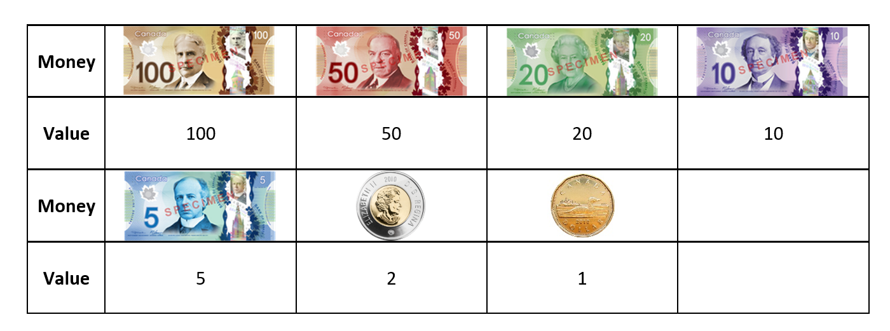
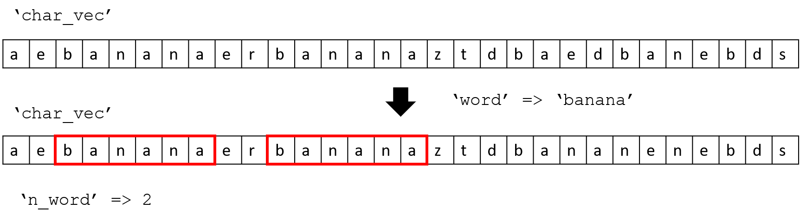
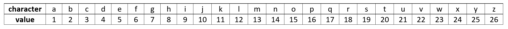
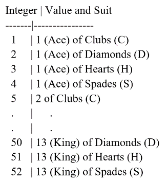
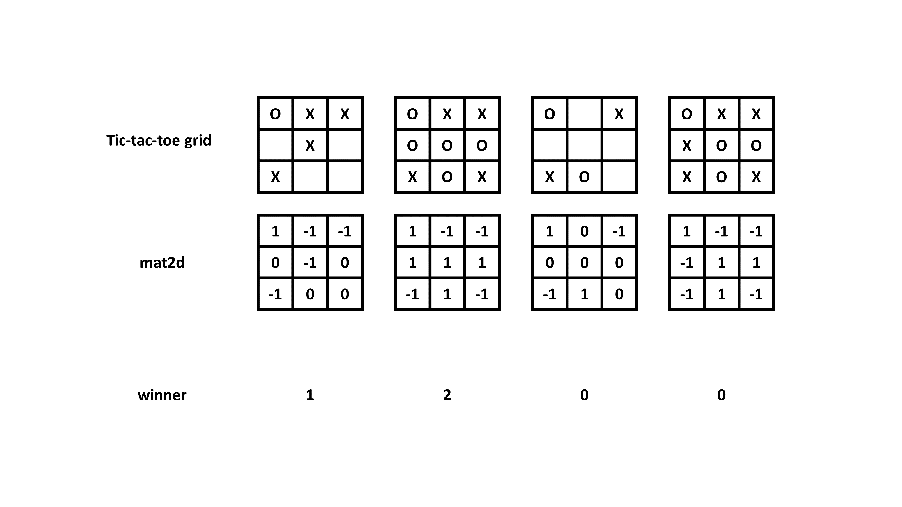
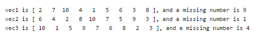
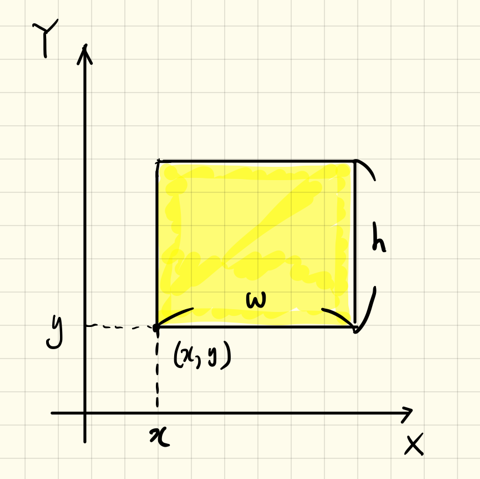
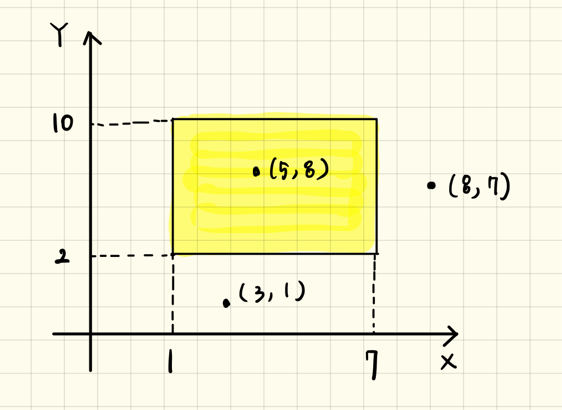
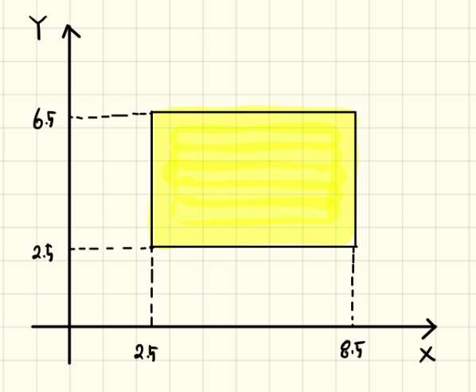

# Module 07: Function

**Last updated:** 2021-08-14

## M07001. Income Tax: Functions (★★)


https://www.forbes.com/sites/kellyphillipserb/2015/10/21/irs-announces-2016-tax-rates-standard-deductions-exemption-amounts-and-more/#3b74ce0b2cd0

In M03001, you wrote a script to calculate the required income tax an individual has to pay based on their taxable income. The guidelines for how to calculate the tax due is shown above. 

(a) Create a function 'TaxRequired' that needs one input and has one output. The input, 'tax_inc', is an individuals taxable income for the year. The output, 'tax_due', is the amount of tax that individual must pay based on their taxable income. The value must be round off to the nearest integer before assigning the value.
```matlab
function tax_due = TaxRequired(tax_inc)
```

(b) Create a function 'TaxAnalysis' that needs one input and has three outputs. The input is a column vector named 'tax_inc' and contain taxable incomes. You first compute tax due for each taxable income. Then, compute the three outputs:  The first output, 'mean_tax', computes the mean of tax dues . The second output, 'max_tax', computes the maximum tax dues. The third output, 'above_50k', computes the number of individuals who must pay more than $50,000 for tax dues (after rounded off to the nearest integer). Please re-use your 'TaxRequired' function. Note that all tax dues that you are using for the output computation in this function should be rounded-off to the nearest integer. 
```matlab
function [mean_tax, max_tax, above_50k] = TaxAnalysis(tax_inc)
```

Note that you are going to design local function on the bottom of the given script code. 

**Solution**
Please watch this:[**https://youtu.be/BbUvzLtOT5c?t=685**](https://youtu.be/BbUvzLtOT5c?t=685)


## M07002. Making the Change: Function (★★)
Create a function called '**MoneyTeller**' that accepts one input named 'money' and one output named 'cad_change'.  

```matlab
function cad_change = MoneyTeller(money)
```
'money' is a scalar value that contains the money value. 'cad_chage' is a 1 x 7 row vector that contain the number of bills or coins. 

Below you will find instructions on how the function works.



Your function computes the number of bills or coins. Always use bigger bills or coins first if it allows. The tellling machine has seven Canadian different bills/coins above. For example, when 232 dollar is provide as an input dollar, 'cad_change' becomes [2 0 1 1 0 1 0]. Another example, when 68 dollar is provide as an input dollar, 'cad_change' becomes [0 1 0 1 1 1 1]. The input dollar named 'money' is randomly generated. 

Note that this problem is almost exactly the same as M05010.

**Solution**
Please watch this:[**https://youtu.be/BbUvzLtOT5c?t=5**](https://youtu.be/BbUvzLtOT5c?t=5)

## M07003. Building Sensor Installation: Function (★★★)

The matrix 'force_data' is an n1 x n2 matrix with each data point representing the force acting on the face of a building. The row and column index show where on the building that force is acting. For example, force_data(2,1) indicates the force value acting on the location of (2,1). You can consider the matrix as a building facade. The goal of this problem is to find five sensor locations and they should be consecutively placed in a row or column direction. The sensor location is determined by whatever five consecutive points that have the highest average force. 

```matlab
function [final_loc, max_avg_force] = HighestForce(force_data)
```
You need to create a function 'HighestForce' that accepts one input. The input is the 'force_data' which represent all forces acting on the building wall. Your function should have two outputs named 'final_loc' and 'max_avg_force', the best coordinate locations for the sensor.  
'final_loc' is a 5 x 2 matrix and it column and row is a row and column location of each sensor location, respectively. Note that the sensor locations are recorded from left to right or from top to bottom. 'max_avg_force' is a scalar variable that contains the average force acting on 'final_loc'. 

**Solution**
```matlab
n1 = randi([50 150]);
n2 = randi([50 150]);

force_data = randi(10000,n1,n2) + rand(n1, n2);

[final_loc, max_avg_force] = HighestForce(force_data);

% Model solution
function [sens_loc, max_mean_force] = HighestForce(force_data)

%%%%%%%%%%%%%%%%%%%%%%%%%%%%%%%%%%%%%%%%%%%%%%%%
% Search the locations in a horizontal direction
%%%%%%%%%%%%%%%%%%%%%%%%%%%%%%%%%%%%%%%%%%%%%%%%
num_sens = 5;
num_rows = size(force_data,1);
num_comb_col = size(force_data,2) - num_sens + 1;

max_hors = zeros(num_rows, num_comb_col);
for ii = 1:num_rows
    test_row_force = force_data(ii,:);
    for jj = 1:num_comb_col
        test_force_set = test_row_force(jj:(jj+num_sens-1));
        max_hors(ii,jj) = mean(test_force_set);
    end
end; clearvars test_row_force test_force_set

% Find the highest average set in a horizontal direction
max_mean_hor = max(max_hors(:));
[ind_row, ind_col] = find(max_hors == max_mean_hor);

max_mean_loc_hor  = zeros(5,2);
max_mean_loc_hor(:,1) = ind_row;
max_mean_loc_hor(:,2) = (ind_col:(ind_col + num_sens - 1))';
clearvars ind_row ind_col num_rows num_comb_col max_hors

%%%%%%%%%%%%%%%%%%%%%%%%%%%%%%%%%%%%%%%%%%%%%%%%
% Search the locations in a vertical direction
%%%%%%%%%%%%%%%%%%%%%%%%%%%%%%%%%%%%%%%%%%%%%%%%
num_sens = 5;
num_cols = size(force_data,2);
num_comb_row = size(force_data,1) - num_sens + 1;

max_vers = zeros(num_comb_row, num_cols);
for ii = 1:num_cols
    test_col_force = force_data(:, ii);
    for jj = 1:num_comb_row
        test_force_set = test_col_force(jj:(jj+num_sens-1));
        max_vers(jj,ii) = mean(test_force_set);
    end
end; clearvars test_col_force test_force_set

% Find the highest average set in a horizontal direction
max_mean_ver = max(max_vers(:));
[ind_row, ind_col] = find(max_vers == max_mean_ver);

max_mean_loc_ver  = zeros(5,2);
max_mean_loc_ver(:,1) = (ind_row:(ind_row + num_sens - 1))';
max_mean_loc_ver(:,2) = ind_col;
clearvars ind_row ind_col num_cols num_comb_row max_vers

% Check which mean value is larger
if max_mean_ver> max_mean_hor
    sens_loc = max_mean_loc_ver;
    max_mean_force = max_mean_ver;
else
    sens_loc = max_mean_loc_hor;
    max_mean_force = max_mean_hor;
end

end

% Second Possible Solution
function sens_loc = HighestForce2(force_data)
% Search rows
row_mean = mean(force_data(1,1:5));
row_ind = [ones(5,1) [1:5]'];
for jj = 1:size(force_data,1)
    for ii = 1:size(force_data,2) -5
        if row_mean < mean(force_data(jj,ii+1:ii+5))
            tmp1 = ones(5,1)*jj;
            tmp2 = [ii+1:ii+5]';
            row_ind = [tmp1 tmp2];
            row_mean = mean(force_data(jj,ii+1:ii+5));
            clearvars tmp1 tmp2
        end
    end
end


% Search cols
col_mean = mean(force_data(1:5,1));
col_ind = [[1:5]' ones(5,1)];
for jj = 1:size(force_data,2)
    for ii = 1:size(force_data,1) -5
        if col_mean < mean(force_data(ii+1:ii+5,jj))
            tmp1 = ones(5,1)*jj;
            tmp2 = [ii+1:ii+5]';
            col_ind = [tmp2 tmp1];
            col_mean = mean(force_data(ii+1:ii+5,jj));
            clearvars tmp1 tmp2
        end
    end
end

if col_mean > row_mean
    sens_loc = col_ind;
else
    sens_loc = row_ind;
end
end


% Third Possible Solution
function sens_loc = HighestForce3(force_data)
% Search rows
row_mean = mean(force_data(1,1:5));
row_ind = [ones(5,1) [1:5]'];
for jj = 1:size(force_data,1)
    for ii = 1:size(force_data,2) -5
        if row_mean < mean(force_data(jj,ii+1:ii+5))
            tmp1 = ones(5,1)*jj;
            tmp2 = [ii+1:ii+5]';
            row_ind = [tmp1 tmp2];
            row_mean = mean(force_data(jj,ii+1:ii+5));
            clearvars tmp1 tmp2
        end
    end
end


% Search cols
col_mean = mean(force_data(1:5,1));
col_ind = [[1:5]' ones(5,1)];
for jj = 1:size(force_data,2)
    for ii = 1:size(force_data,1) -5
        if col_mean < mean(force_data(ii+1:ii+5,jj))
            tmp1 = ones(5,1)*jj;
            tmp2 = [ii+1:ii+5]';
            col_ind = [tmp2 tmp1];
            col_mean = mean(force_data(ii+1:ii+5,jj));
            clearvars tmp1 tmp2
        end
    end
end

if col_mean > row_mean
    sens_loc = col_ind;
else
    sens_loc = row_ind;
end
end
```

## M07004. Remove a Character from a Character Vector (★★)

You need to create a function named 'RmvChr' that has two inputs and one output

``` matlab
function new_char_vec = RmvChr(char_vec, char_val)
```
One input is 'char_vec', which is a randomly generated char vector. The second input is 'char_val', which is a single character element you want to remove from 'char_vec'. The output, 'new_char_vec', will be the new character vector after removing 'char_val' from 'char_vec'. For example, when 'char_vec' is '13adhok' and 'char_val' is '1', then 'new_char_vec' will be '3adhok'. Note that 'new_char_vec' will remain the same as 'char_vec' if 'char_vec' does not contain 'char_val'.

**Solution**  
Please watch this:[**https://youtu.be/BbUvzLtOT5c?t=1432**](https://youtu.be/BbUvzLtOT5c?t=1432)


## M07005. Sum Diagonal Elements (★★★)
Create a function '**DiagSum**' that will sum the diagonal or anti-diagonal elements of a square 2D matrix named 'mat2d'. 

```matlab
function sumdiag = DiagSum(mat2d, direction)
```
The function accepts two inputs: 'mat2d' and 'direction'. 'mat2d' is a square 2D matrix and 'direction' is to choose either diagonoal or anti-diagonal. When 'direction' is 'diag', diagonal elements in 'mat2d' are summed. When 'direction' is 'adiag', anti-diagonal elements in 'mat2d' are summed. The resulting summed value is assigned to the output named 'sumdiag'. 

**Solution**  
Please watch this:[**https://youtu.be/Y1M5wF78r24?t=5**](https://youtu.be/Y1M5wF78r24?t=5)

## M07006. Most Nonzero Element Row (★★)
You need to create a function 'MostNnzRow' that has one input and one output. 
```matlab
function id_row = MostNnzRow(mat2d)
```
The input 'mat2d' is a randomly generated 2D matrix. The output 'id_row' will be the row index of the row with the most non-zero values. 

For example, if 'mat2d' is 

```matlab
     0     0     2     1
     0     4     1     1
     0     0     8     2
     0     0     0     2
```
then 'id_row' will be 2. Note that if there are multiple rows having the same most non-zero elements, it will always return the first one. 
For example,  if 'mat2d' is 

```matlab
     0     4     2     1
     0     4     1     1
     0     0     8     2
     0     0     0     2
```
 then 'id_row' will be 1. (both row 1 and 2 have three non-zero elements)

**Solution**  
Please watch this:[**https://youtu.be/Y1M5wF78r24?t=695**](https://youtu.be/Y1M5wF78r24?t=695)


## M07007. Introduction of Seven Card Poker (Description Only)

Please review the problem description on MATLAB Grader.

[](https://www.youtube.com/watch?v=d3ORQ_OCGUs) 

## M07017. (Main) Poker Game
You are supposed to write each function for each possible combination of cards showing if it can be made with the cards dealt or not. **You need to design nine functions and include them at the bottom of the given code.** Each function provides a true/false logical output as to whether that combination is possible or not (true if the combination is possible).

Note that **you don't need to determine if only one combination is possible.** 

For example, the ChckPr function might produces higher rank cards (two pair, three of a kind) as a pair. This result does not affect the final rank decision because 'your_card' is evaluated from the highest rank to the lowest ones as an if/else-if statement is used to determine the highest combination. For example, suppose that your card contain the Royal Flush combination, ChckPr (your_card) is allowed to produce true (because this doesn't matter if ChckRylFls can correctly identify the Royal Flush combintation).  Once ChckRylFls(your_card) becomes true, ChckPr(your_card) will not be evaluated. See the given script for evaluating the set of 'your_card'

**Solution**  
Please watch this:[**https://youtu.be/XvHxbukEUmY**](https://youtu.be/XvHxbukEUmY)


## M07018. Play Bull and Cows Game (★★★)
Bulls and Cows is a mind game. In the game, a random, 4-digit number is chosen from 0 to 9, called a true number, and its values are compared to those of a test number. All four digits of the number are different. If any digit in the test number is the exact same value and in the exact same position as any digit in the true number, this is called a bull. If the digit is present in both the true number and test number but is not in the same location, this is called a cow. Note that this is an original game presented in the lecture slides. 

Assume that two players join a Bulls and Cows game. Player 1 and Player 2 each guesses a four digit number (which are the test numbers) and they are named as ‘test_ply1’ and ‘test_ply2’ respectively. You are going to compare their bulls and cows and decide who is closer to the true number named 'true_num'. The player with more bulls wins. If both players have equal number of bulls, then the player with more cows wins. If both players have an equal number of bulls and cows, it is a tie. 
* Example 1: if bulls and cows for player 1 and 2 are [1,2] and [1,1], respectively, player 1 is **closer**. 
* Example 2: if bulls and cows for player 1 and 2 are [1,2] and [2,0], respectively, player 2 is **closer**. 

You are going to design a function to determine who is the winner. 

Please write a function of ‘**TwoPlayerBullsCows**’ which has three inputs: a true number (‘true_num’) and two test numbers (‘test_num1’ and ‘test_num2’), and one output called ‘result’. 
```matlab
function result = TwoPlayerBullsCows(true_num, test_num1, test_num2)
```
If the test number for Player 1 is **closer** to the true number, assign 1 to ‘result’. If the test number for Player 2 is closer to the true number, assign 2 to ‘result’. If their bulls and cows are identical, assign 0 to ‘result’. 

**Solution**  
Please see this: 
```matlab
true_num = randperm(10,4)-1; % randomly generate a 1 x 4 vector (true number)
test_ply1 = randperm(10,4)-1; % randomly generate a 1 x 4 vector (number from Player 1)
test_ply2 = randperm(10,4)-1; % randomly generate a 1 x 4 vector (number from Player 2)

winner = TwoPlayerBullsCows(true_num, test_ply1, test_ply2);

fprintf('True number is [%d %d %d %d]. \n', true_num);
fprintf('Player 1 number is [%d %d %d %d]. \n', test_ply1);
fprintf('Player 2 number is [%d %d %d %d]. \n', test_ply2);

if winner == 1
   fprintf('Player 1 Win ! \n');
elseif winner == 2
   fprintf('Player 2 Win ! \n');
else
   fprintf('Draw ! \n'); 
end

% please design a function called TwoPlayerBullsCows

function result = TwoPlayerBullsCows(true_num, test_num1,test_num2)

[bulls1, cows1] = CompBullsCows(true_num, test_num1);
[bulls2, cows2] = CompBullsCows(true_num, test_num2);

if bulls1 > bulls2
    result = 1;
elseif bulls2 > bulls1
    result = 2;
else
    if cows1>cows2
        result = 1;
    elseif cows2>cows1
        result = 2;
    else
        result = 0;
    end
end

end

function [bulls, cows] = CompBullsCows(true_num, test_num)

% These are new solutions. 
% You can use the ones in the lecture slides (any working solutions)

bulls = sum(true_num==test_num);
cows = sum(true_num(:) == test_num, 'all') - bulls; % slide 185

end
```

## M07019. Zeros into a Vector (★★)
Create a function called 'InsertZeros' which has two inputs and one output. 
```matlab
function outvec = InsertZeros(vec, n)
```
'outvec' is a row vector generated by inserting 'n' number of zeros after each element in the given vector named 'vec'. Note that 'vec' is a row vector and 'n' is a positive integer greater or equal to  1 (n >= 1). 
* Example 1:  When vec = [1 2 3 4] and n = 3, 'outvec' becomes [1 0 0 0 2 0 0 0 3 0 0 0 4 0 0 0];
* Example 2:  When vec = [2 1 1 2] and n = 2, 'outvec' becomes [2 0 0 1 0 0 1 0 0 2 0 0];
* Example 3:  When vec = [1 2] and n = 1, 'outvec' becomes [1 0 2 0];

**Solution**
Please see this: 
```matlab
test_vec = randi(100, 1, 30);
n = randi(10);

new_vec = InsertZeros(test_vec, n);

% please design a function called InsertZeros

function outvec = InsertZeros(vec, n)
nvec = numel(vec);
outvec = cat(1, vec, zeros(n, nvec));
outvec = outvec(:)';
end
```

## M07020. Subtract Column or Row Average from a 2D matrix (★★)
Create a function called 'MeanSubtract' that accepts two inputs and one output. 
```matlab
function out_mat2d = MeanSubtract(mat2d, dim)
```
* When 'dim' is 1, 'out_mat2d' is genreated by subtracting a column mean from the corresponding column in the input matrix named 'mat2d' 
* When 'dim' is 2, 'out_mat2d' is genreated by subtracting a row mean from the corresponding row in the input matrix named 'mat2d' 

Example: When 'mat2d' is 

```matlab
     1     2     5
     2     3    10
     3     7    15
```
if we run the following script
```matlab
out_mat2d = MeanSubtract(mat2d, 1)
```
'out_mat2d' becomes

```matlab
    -1    -2    -5
     0    -1     0
     1     3     5
```
because the mean of each column = [2 4 10]. 

On the other hand, if we run the following script

```matlab
out_mat2d = MeanSubtract(mat2d, 2)
```

'out_mat2d' becomes

```matlab
   -1.6667   -0.6667    2.3333
   -3.0000   -2.0000    5.0000
   -5.3333   -1.3333    6.6667
```
because the mean of each row = [2.666; 5; 8.333]. 

**Solution**  
Please see this: 
```matlab
test_mat2d = randi(100, 10, 10);
dim = randi(2);

out_mat2d = MeanSubtract(test_mat2d, dim);

% please design a function called MeanSubtract

function out_mat2d = MeanSubtract(mat2d, dim)
vec = mean(mat2d, dim);
out_mat2d = mat2d - vec;  % slide 185
end
```
## M07021. N Values in Columns (★★)
Create a function called 'MaxMinN' that accepts two inputs and two output. 
```matlab
function [max_num, min_num] = MaxMinN(mat2d, num)
```
The purpose of this function is to compute the maximum and minimum times the given number named 'num' that can be found within columns of an input matrix (named 'mat2d'). The maximum and minimum numbers of 'num' are assigned to 'max_num' and 'min_num', respectively.
 
Note that 'max_num' and 'min_num' could be the same when the number of 'num' is the same in each coulmn.
For example, When we have the line [max_num, min_num] = MaxMinN(mat2d, 1), and 'mat2d' is 

```matlab
     1     5     5
     2     1    10
     3     5     1
```

The number of '1's in each column is one , so 'max_num' and 'min_num' can both be one. Or, 'max_num' and 'min_num' could be both zeros when there is no 'num' in 'mat2d'.
 
**Example 1**: When 'mat2d' is 

```matlab
     1     5     5
     2     3    10
     5     5    15
```

if we run the following script

```matlab
[max_num, min_num] = MaxMinN(mat2d, 5)
```

'max_num' and 'min_num' becomes 2 and 1, respectively. 

**Example 2**: When 'mat2d' is 

```matlab
    16     2     3    10
     5    11    10     8
     9     7     6    10
     4    14    15     1
 ```
if we run the following script

```matlab
[max_num, min_num] = MaxMinN(mat2d, 10)
```

'max_num' and 'min_num' becomes 2 and 0, respectively. 

**Solution**  
Please see this: 
```matlab
test_mat2d = randi(10, 20, 20);
test_num = randi(10);

[test_max_num, test_min_num] = MaxMinN(test_mat2d, test_num);

% please design your function called MaxMinN
function [max_num, min_num] = MaxMinN(mat2d, num)
n_num = sum(mat2d == num);
max_num = max(n_num);
min_num = min(n_num);
end
```

## M07022. How Many Given Word in a Character Vector? (★★★)
Create a function called 'CountWord' that accepts two inputs and one output. 
```matlab
function n_word = CountWord(char_vec, word)
```
This function is to count the number of 'word' in 'char_vec' and assign its number to 'n_word'. Note that 'char_vec' and 'word' contain only lower case alphabetical words and 'char_vec' is much longer than 'word'.
Here is the example:



Note that although 'banana' is assigned to 'test_word' in the given code, the function supports any word. This means your function should be applicable on any word and does not use information that sepcifies your 'word' as 'banana'. 
You should not use the following built-in function: strfind, count. 

**Solution**  
Please see this: 
```matlab
test_word = 'banana';
char_vec = GenCharVec(test_word);

n_test_word = CountWord(char_vec, test_word);

% please design a function called CountWord

function n_word = CountWord(char_vec, word)

vec_len = numel(char_vec);
n_char = numel(word);

n_word = 0;
for ii=1:vec_len-n_char+1
    test_loc = ii:ii+n_char-1;
    if isequal(char_vec(test_loc), word)
       n_word = n_word + 1; 
    end
end

end

function char_vec = GenCharVec(test_word)
vec_len = 300;
n_char = numel(test_word);
char_vec = char(randi([97 122], 1, vec_len));
n_word = randi(20);

for ii=1:n_word
    loc = randi(vec_len-n_char);
    char_vec(loc:loc+n_char-1) = test_word;
end
end
```

## M07023. Remove Any Row in Which Contains N number (★★★)
Create a function called 'RmvRowNCont' which has two inputs and one output. 

```matlab
function out_mat2d = RmvRowNCont(mat2d, N)
```

'out_mat2d' is generated by removing the row(s) of 'mat2d' which contain the number 'N'. Note that 'mat2d' is a 2D matrix and 'N' is a scalar. 

**Example 1:** When 'mat2d' is:

```matlab
     4     5     1     4
    15    15    11    13
     6     4    10     3
    14    13     7     8
```

and we run the following script:

```matlab
out_mat2d = RmvRowNCont(mat2d, 4)
```
'out_mat2d' becomes:

```matlab
    15    15    11    13
    14    13     7     8   
```
because the first and third rows contain 4 so the corresponding rows are deleted. 

**Example 2:** When 'mat2d' is:

```matlab
     6    11     5    17    25     4
    17    20    30    20    24     9
     4     3    13     1    30    23
     2     7    29    24     7    25
    28     2    22    28    28     4
    30    15    18     1    20    15
```
and we run the following script:
```matlab
out_mat2d = RmvRowNCont(mat2d, 20)
```
'out_mat2d' becomes:
```matlab
     6    11     5    17    25     4
     4     3    13     1    30    23
     2     7    29    24     7    25
    28     2    22    28    28     4
```
because the second and last rows contain 20 so those rows are deleted. 

**Solution**  
Please see this: 
```matlab
mat2d = randi(60, 8, 8);
N = randi(60);

out_mat2d = RmvRowNCont(mat2d, N);

% please design a function called RmvRowNCont
function out_mat2d = RmvRowNCont(mat2d, N)

idx = logical(sum(mat2d == N, 2));
out_mat2d = mat2d;
out_mat2d(idx,:) = [];

end
```

## M07024. Remove Vowels (★★★)
Create a function called '**RmvVowels**' that accepts one input and one output. 
```matlab
function out_vec = RmvVowels(char_vec)
```
The purpose of this function is to remove all vowels from 'char_vec' and assign the result vector to 'out_vec'. 
'char_vec' is a character vector and contains only lower-case letters. The vowels in the problem are 'a', 'e', 'i', 'o', and 'u'. 
* Example 1: when 'char_vec' is 'aabcdeeffg', 'out_vec' becomes 'bcdffg'. 
* Example 2: when 'char_vec' is 'abcdefghi', 'out_vec' becomes 'bcdfgh'. 

**Solution**  
Please see this:
```matlab
char_vec = char(randi([97 122], 1, 100));

out_char_vec = RmvVowels(char_vec);

% Please write your function called RmvVowels
function out_vec = RmvVowels(char_vec)
vowels = 'aeiou';

% out_vec = char_vec;
% for ii=1:numel(vowels)
%    idx = (out_vec == vowels(ii));
%    out_vec(idx) = []; 
% end

lg_idx = zeros(1, numel(char_vec), 'logical');
for ii=1:numel(vowels)
    lg_idx = or(lg_idx, char_vec == vowels(ii));
end
out_vec = char_vec(~lg_idx);

end
```

## M07025. Tensile Stress: Function (★)
Create a function named '**CompTenStr**' that accepts two inputs and one output. 

```matlab
function tensile_stress = CompTenStr(strain_data, material_char)
```

This function is to determine tensile stess, where the output ('tensile_stress') is a scalar. 
The strain data named 'strain_data' and material data named 'material_char' are given for this problem. Please note that 'strain_data' for this problem is a scalar.
Tensile stress can be obtained from the product of strain and the tensile modulus of a material . 
Tensile modulus for each of the given material is given as the following: 


'material_char' contains a character that indicates the material for given measurements. (e.g, 'material_char' can be 'c', which indicates "copper")
('c': Concrete, 'p': Coppper, 'w': Pine wood, 's': Steel, 'g': Gold, 'a': Aluminum)
You do not need to consider units for the tensile modulus and strain. 
Again, tensile stress is tensile modulus times strain. 

**Solution**  
Please see this:  
```matlab
% 'c': Concrete, 'p': Coppper, 'w': Pine wood, 's': Steel, 'g': Gold, 'a': Aluminum
material_char = ['c', 'p', 'w', 's', 'g', 'a'];

test_strain_data = randi(1000); % test tensile strain
test_mat_char = material_char(randi(6)); % test material character

test_tensile_stress = CompTenStr(test_strain_data, test_mat_char);

% please design a function called CompTenStr

function tensile_stress = CompTenStr(strain_data, mat_char)

switch mat_char
    case 'c'
        tensile_stress = strain_data * 17;
    case 'p'
        tensile_stress = strain_data * 117;
    case 'w'
        tensile_stress = strain_data * 9;
    case 's'
        tensile_stress = strain_data * 180;
    case 'g'
        tensile_stress = strain_data * 74;
    case 'a'
        tensile_stress = strain_data * 40;
end

end
```

## M07026. Generate a Character Sequence (★★★)
Create a function called 'GenSeq' that accepts one input and one ouptut

```matlab
function char_seq = GenSeq(n)
```
This function is to generate a character vector named 'char_seq' using 'n' number of charcters in order. 
'char_seq' is a character vector that contains the lower-case alphabet. 
'n' is a scalar value that is less than or equal to 26.
* When 'n' is 2, 'char_seq' becomes 'abb'.
* When 'n' is 3, 'char_seq' becomes 'abbccc'.
* When 'n' is 5, 'char_seq' becomes 'abbcccddddeeeee'.

**Solution**  
Please see this: 
```matlab
test_n = randi(26);

test_char_seq = GenSeq(test_n);

% please design your function: GenSeq

function char_seq = GenSeq(n)

char_seq = []; 
for ii=1:n
    cur_seq = char((96+ii) * ones(1, ii));
    char_seq = [char_seq cur_seq];
end

end

% option
% function char_seq = GenSeq(n)
% 
% alpha_seq = 'abcdefghijklmnopqrstuvwxyz';
% 
% char_seq = []; 
% for ii=1:n
%     cur_seq = char(alpha_seq(ii) * ones(1, ii));
%     char_seq = [char_seq cur_seq];
% end
% 
% end
```

## M07027. Candy Store: Function (★)
Noreen owns a candy store, and she did a promotion on May 2. If customers applied for membership cards on that day, they would have a chance to win a prize. The prize receivers are chosen based on their membership card number. The card number is 10 digits. To win the prize, the card number satisfy the following conditions:
 
* '6' appears at the second and fifth indexes (locations) of the card number. 
* The first and last digits are not 3. 
* The second last number is less than 5. 
 
For example, the person whose card number is either '1623612122' or '6623612149' will receive the prize.
 
Creat a function named 'PrzRcv' that accepts one input and one output. 

```matlab
function is_rsv = PrzRcv(card_num)
```

If 'card_num' satisfies the above three conditions for receiving the prize, true is assigned to 'is_rsv'. Otherwise, false is assigned to 'is_rsv'. 'card_num' is a 1 x 10 vector that contain numbers ranging from 0 to 9. 'is_rsv' is a logical value.

**Solution**  
Please see this: 
```matlab
test_card_num = randi(10, 1, 10)-1; % test card number

test_is_rsv = PrzRcv(test_card_num);

% please design your function called PrzRcv

function is_rsv = PrzRcv(card_num)

cond1 = and(card_num(2)==6 , card_num(5)==6);
cond2 = and(card_num(1)~=3 , card_num(end)~=3);
cond3 = card_num(end-1) < 5;
is_rsv = cond1 && cond2 && cond3;

end
```

## M07028. Word Construction (★★★★)
Create a function named **ReWordScr**, which has two inputs, ‘org_wrd’ and ‘char_seq’, and one output named ‘is_word’, which is a logical vector. 

```matlab
function is_word = ReWordScr(org_wrd, char_seq)
```

If a word in ‘org_wrd’ can be constructed with the characters available in ‘char_seq’, assign a logical 1 to ‘is_ word’, and otherwise, assign a logical 0 to it. The original word named ‘org_wrd’ is a lowercase character vector and is also an alphabet word (e.g., ‘pizza’, ‘calculus’, ‘summer’). ‘char_seq’ is a 1 x 20 character vector that is randomly drawn from ‘a’ to ‘z’. 

Your task is to check if you can make ‘org_wrd’ by combining a set of characters in ‘char_seq’. For example, assume that ‘char_seq’ is ‘zmpzizastdioerublt’ and ‘org_wrd’ is ‘pizza’. You can construct the charcater vector ‘pizza’ (‘zmpzizastdioerubltt’ → pizza). However, if ‘org_wrd’ is ‘matlab’ or ‘calculus’, you cannot construct those words because there is only one ‘a’ or ‘l’ in ‘char_seq’. Note that the number of characters in ‘org_wrd’ is less than 20.  

**Solution**

```matlab
word = ['matlab';'enviro'; 'arceng';'geoeng'];
org_wrd = word(randi(4), :);
char_seq = char(randi([97 122],1,20));
is_word_test = ReWordScr(org_wrd,char_seq);

% please design your function called ReWordScr
function is_word = ReWordScr(org_wrd, char_seq)

is_word = true;
for jj=1:numel(org_wrd)
    idx_char = (char_seq == org_wrd(jj));
    if any(idx_char)
        loc = find(idx_char, 1, 'first');
        char_seq(loc) = []; 
    else
       is_word = false;
       break;
    end
end

end
```

## M07029. Word Score (★★★)
Create a function called WordScore that accepts one input named 'char_vec' and one output named 'score'. 

```matlab
function score = WordScore(char_vec)
```

'char_vec' is a character vector that contains lower-case letters, symbols, and upper-case letters. 

Only lower-case letters have the following values:



'score' can be computed by adding all equivalent values for ONLY lower-case letters. 
Here are some sample results:
**Example 1**

```matlab
>> score = WordScore('matlab')

score =

    49
```

score = 13 ('m') + 1 ('a') + 20 ('t') + 12 ('l') + 1 ('a') + 2 ('b') = 49

**Example 2**

```matlab
>> score = WordScore('Matlab')

score =

    36
```

score = 1 ('a') + 20 ('t') + 12 ('l') + 1 ('a') + 2 ('b') = 36. Here, 'M' is not a lower-case letter so there is no value. 

**Example 3**

```matlab
>> score = WordScore('Hi! Matlab')

score =

    45
```

score = 9 (i) + 1 ('a') + 20 ('t') + 12 ('l') + 1 ('a') + 2 ('b') = 45. 

Note that you cannot manually calculate the score and then assign the result. Your programming logic should be applicable in general, meaning that your code should work for any character vector and not just the one provided in the question. 

**Solution**

```matlab
test_char_vec = 'Students in AEG121 is amazing!';
test_score = WordScore(test_char_vec);

% please design your function called WordScore


function score = WordScore(char_vec)
char_db = double(char_vec);
lgv = (97 <= char_db) & (char_db <= 122);
score = sum(char_db(lgv)-96);
end

% Noreen's sol

% function score = WordScore(char_vec)
% values = 1:26;
% num_char = zeros(1,26);
% alp_vec = char(97:122);
% 
% for ii = 1:numel(alp_vec)
%        num_char(ii) = count(char_vec, alp_vec(ii));
% end
% 
% score = sum(num_char.*values);
% 
% end
```

## M07030. Design MyRem and CountRem Functions (★★★)
**rem** is a built-in function in MATLAB, used to find the remainder after division. 

r = rem(a, b) returns the remainder after the division of ‘a’ by ‘b’, where ‘a’ is the dividend and b is the divisor. Note that the input named ‘a’, which is a dividend, can be either a scalar, vector, matrix, or multidimensional array. The size of ‘r’ is exactly the same with the size of ‘a’. For example, 
* rem(4,3) becomes 1. 
* rem([3 4 5], 3) becomes [0 1 2]
* rem([3;4;5],2) becomes [1;0;1]
* rem([3 4; 5 6], 4) becomes [3 0; 1 2]

(a) Please design a function named **MyRem** without using a built-in function **rem**. 

```matlab
function r = MyRem(a, b)
```
This function has two inputs and one output. The two inputs ‘a’ and ‘b’ are a dividend and divisor respectively, and are both positive numbers. Supporting dimension of ‘a’ for **MyRem** is a **scalar** and **vector**. The output named ‘r’ is a remainder and its size is the same with the size of ‘a’. For example, 
* MyRem(4, 3) becomes 1.
* MyRem(10, 2) becomes 0.
* MyRem([1 2 3], 2) becomes [1 0 1].
* MyRem([4;5;6], 3) becomes [1;2;0].

Note that the behavior of **MyRem** is the same with **rem**. 

(b) Please design a function named CountRem. 

```matlab
function num_rem = CountRem(vec, b)
```

The CountRem function calculates the remainders for an array of numbers, and counts the number of all remainders with value of 0, 1, 2, and so on. This function has two inputs and one output. The first input named ‘vec’ is a 1 x 10 row vector containing the dividends and the second input named ‘b’ is a divisor. The output named ‘num_rem’ is a 1 x b vector that contains the counts of elements with remainders 0, 1, 2, and so on in order.
* CountRem([1 1 1 1 2 2 2 2 2 2], 2) becomes [6 4].
* CountRem([1 1 1 1 2 2 2 2 2 2], 3) becomes [0 4 6].
* CountRem( [1 2 3 4 5 6 7 8 9 10], 3) becomes [3 4 3].
* CountRem([2 6 11 20 20 4 20 20 10 17], 2) becomes [8 2].

Again, the first element is the count of the number of remainders with value 0, the second element the count of the number of remainders with value 1, and so forth.  

Note that you can reuse **MyRem** or use a built-in function **rem**.    

**Solution**

```matlab
divisor_test1 = randi(10)+1;

row_vec = randi(1000, 1, randi(10)+1);
col_vec = randi(1000, randi(10)+1, 1);

remainder_test1 = MyRem(row_vec,divisor_test1); % tests to test your solution for part (a)
remainder_test2 = MyRem(col_vec,divisor_test1); % tests to test your solution for part (a)

divisor_test2 = randi(10)+1;

vec_test1 = randi(1000,1,10);
vec_test2 = randi(1000,1,10);
num_rem_test1 = CountRem(vec_test1,divisor_test2); % tests to test your solution for part (b)
num_rem_test2 = CountRem(vec_test2,divisor_test2); % tests to test your solution for part (b)

% Please design your functions called MyRem and CountRem

function r = MyRem(a,b)
num_div = floor(a/b);
num_in = num_div.*b;
r = a - num_in;
end

function num_rem = CountRem(vec, b)
rem_vec = rem(vec,b);
num_rem = zeros(1, b);

for ii=1:b
    num_rem(ii) = sum(rem_vec == ii-1);
end

end

% Noreen: I thought that we are not allowed to use any built-in function and I used the text manipulation....
% function r = MyRem(a, b)
% 
% answer = a/b;
% answer_str = string(answer);
% [nr nc] = size(answer_str);
% 
% quotient = strings(nr,nc);
% 
% for ii = 1:nr
%   for  jj = 1:nc
%     answer_test = answer_str{ii,jj};
%     dot_idx = strfind(answer_test,'.');
%     
%     if ~isempty(dot_idx)
%         q_test = answer_test(1:dot_idx-1);
%     else
%         q_test = answer_test;
%     end
%     
%     quotient(ii,jj) = q_test; 
%   end
%        
% end
% r = a-str2double(quotient)*b;
% end
% 
% %(b)
% function num_rem = CountRem(vec, b)
% r = rem(vec,b);
% num_rem = zeros(1,b);
% 
% for ii = 1:numel(num_rem) % stores the counts of elements with remainder 0, 1, 2, and so on.
%     remainder_test = ii-1;
%     logical_vec = r == remainder_test;
%     num_rem(ii) = sum(logical_vec);
% end
% 
% end
% 
```

## M07031. Custom Poker Game (★★★★)
The standard 52-card deck has 13 numbers and four different suits. Seven Card Stud is a classic poker game where seven cards are distributed to each player. Each integer from 1 to 52 will represent the value and suit of a card (see the figure on the right). The order of the number from the highest to the lowest is 1, 13, 12, … 2 because the Ace (1) can be either 1 or 14. **The order of the suits from the lowest to the highest is “Clubs”, “Diamonds”, “Hearts”, and “Spades”.**   The input variable named ‘your_card’ is a 1 x 7 vector including seven integers indicating cards with the order below:



(a) Please write a function called ‘**ChckTwThrKnd**’, which is to check if there is a two pair of Three-of-a-Kind.

```matlab
function [is_tw_thr_knd, high_num] = ChckTwThrKnd(your_card)
```
* The function has one input of a set of test cards named ‘your_card’ and two outputs. 
* The first output named ‘is_tw_thr_knd’ tells you if there are two pairs of Three-of-a-Kind. 
* The second output named 'high_num', which is the higher card number between two pairs of Three-of-a-Kind. 

If ‘is_tw_thr_knd’ is false (0), ‘high_num’ must be 0. Please keep in mind that  Ace's are the highest valued cards in the poker. (e.g., Ace's are of higher value than kings)

**Example 1**

```matlab
your_card =  [5 6 7 17 20 19 41]; % card sequence is [2C, 2D, 2H, 5C, 5S, 5H, 11C]; 
[is_tw_thr_knd, high_num] = ChckTwThrKnd(your_card)
```

Then, two output variables becomes

```matlab
is_tw_thr_knd =

  logical

   1

high_num =

     5
```

**Example 2**

```matlab
your_card =  [17 20 19 1 2 3 41]; % card sequence is [5C, 5S, 5H, 1C, 1D, 1H, 13C]; 
[is_tw_thr_knd, high_num] = ChckTwThrKnd(your_card)
```

Then, two output variables becomes

```matlab
is_tw_thr_knd =

  logical

   1

high_num =

     1
```

Again, Ace's are the highest value. 

**Example 3**

```matlab
your_card =  [17 20 19 1 2 50 41]; % card sequence is [5C, 5S, 5H, 1C, 1D, 13D, 13C]; 
[is_tw_thr_knd, high_num] = ChckTwThrKnd(your_card)
```

Then, two output variables becomes

```matlab
is_tw_thr_knd =

  logical

   0


high_num =

     0
```

(b) Please write a function called ‘**ChckFls**’, which has one input of a test card set and three outputs.

```matlab
function [is_fls, suit, high_num] = ChckFls(your_card)
```

* The first output named ‘is_fls’ tells you if the rank is ‘Flush’ or not. 
* The second output named ‘suit’ is a string scalar that contains the suit name of the flush sequence. 
* The third output named ‘high_num’ is the highest card number in the flush sequence. 

If ‘is_fls’ is false (0), ‘suit’ become “None” and 'high_num' becomes 0, respectively. 
Please keep in mind that  Ace's are the highest valued cards in poker. (e.g., Ace's are of higher value than kings)

**Example 1**

```matlab
your_card =  [1 5 13 37 41 3 7]; % card sequence is [1C, 2C, 4C, 10C, 11C, 1H, 2H]; 
 [is_fls, suit, high_num] = ChckFls(your_card)
 ```
 
Then, three output variables becomes

```matlab
is_fls =

  logical

   1

suit = 

    "Clubs"

high_num =

     1
```

**Example 2**

```matlab
your_card =  [6 14 38 42 46 4 8]; % card sequence is [2D, 4D, 10D, 11D, 12D, 1S, 2S]; 
 [is_fls, suit, high_num] = ChckFls(your_card)
 ```
 
Then, three output variables becomes

```matlab
is_fls =

  logical

   1

suit = 

    "Diamonds"

high_num =

    12
```

**Example 3**

```matlab
your_card =  [7 14 38 42 46 4 8]; % card sequence is [2H, 4D, 10D, 11D, 12D, 1S, 2S]; 
 [is_fls, suit, high_num] = ChckFls(your_card)
```

Then, three output variables becomes

```matlab
is_fls =

  logical

   0

suit = 

    "None"

high_num =

     0
```

**Solution**

```matlab
numTest = 400;
cards_all = zeros(7,numTest);
for ii=1:numTest
    cards_all(:,ii) = randperm(52,7)';
end

idx = randperm(numTest, 6);
cards_all(:, idx(1)) = [1 2 3 21 22 50 23]'; % two pair of Three-of-a-Kind. 
cards_all(:, idx(2)) = [49 50 51 1 2 4 34]'; % two pair of Three-of-a-Kind. 
cards_all(:, idx(3)) = [20 19 18 30 31 32 52]'; % two pair of Three-of-a-Kind. 
cards_all(:, idx(4)) = [1 5 21 25 45 41 52]'; % Flush
cards_all(:, idx(5)) = [4 8 12 42 48 52 1]'; % Flush
cards_all(:, idx(6)) = [2 6 11 15 22 26 30]'; % Flush

% Problem (a)
is_tw_thr_knd = zeros(numTest,1);
high_num_tw_thr_knd = zeros(numTest,1);
for ii=1:numTest
    your_cards = cards_all(:,ii);
    [is_tw_thr_knd(ii), high_num_tw_thr_knd(ii)] = ChckTwThrKnd(your_cards);
end

% Problem (b)
is_fls = zeros(numTest,1);
suit_fls = strings(numTest,1);
high_num_fls = zeros(numTest,1);

for ii=1:numTest
    your_cards = cards_all(:,ii);
    [is_fls(ii), suit_fls(ii), high_num_fls(ii)] = ChckFls(your_cards);
end

% please design your functions called ChckTwThrKnd and ChckThrPr

function [is_tw_thr_knd, high_num] = ChckTwThrKnd(your_card)
card_vec = zeros(52,1);
card_vec(your_card) = 1;
card_mat = reshape(card_vec, 4, 13);

card_sum = sum(card_mat);
is_tw_thr_knd = sum(card_sum==3) == 2;
if ~is_tw_thr_knd
    high_num = 0;
else
    card_sum_new = [card_sum card_sum(:,1)];
    high_num = find(card_sum_new == 3, 1, 'last');
    if high_num == 14
        high_num = 1;
    end
end

end

function [is_fls, suit, high_num] = ChckFls(your_card)
suit_names = ["Clubs" "Diamonds" "Hearts" "Spades"];

card_vec = zeros(52,1);
card_vec(your_card) = 1;
card_mat = reshape(card_vec, 4, 13);
card_sum = sum(card_mat, 2); % sum rows

is_fls = any(card_sum>=5);
if ~is_fls
    high_num = 0;
    suit = "None";
else
    
    id_fls = find(card_sum >=5);
    suit = suit_names(id_fls);
    
    card_sum_new = [card_mat card_mat(:,1)];
    high_num = find(card_sum_new(id_fls,:), 1, 'last');
    if high_num == 14
        high_num = 1;
    end
    
end

end
```


## M07032. Find the Number of Subsets (★★★)
Create a function named '**NumSubset**' that accepts two inputs named 'in_vec' and 'sum_val', and one output named 'num_set'

```matlab
function num_set = NumSubset(in_vec, sum_val)
```

You need to compute the number of subsets of any two numbers in 'in_vec' where their sum becomes 'sum_val'. The number of possible subsets should be stored in 'num_set', which is  the output of this function. 'in_vec' is a row vector that contains integers **without repeating elements**. This means that if 'num_set' has a value which when summed with itself equals to 'sum_val', it does not count towards 'num_set' (a subset cannot have two same numbers). See example 4 for this explanation. Both 'sum_val' and 'num_set' are scalar values. 

**Example1:** 

```matlab
in_vec = [1 2 3 4 5];
sum_val = 7;
num_set = NumSubset(in_vec, sum_val);
```

Then, 'num_set' becomes 2 because sum of (2, 5) and (3, 4) becomes 7 (sum_val). 
Note that (2, 5) and (5, 2) are the same and only count as 1 subset  in 'num_set'. 

**Example 2:** 

```matlab
in_vec = [3 11 10 2 1 12];
sum_val = 13;
num_set = NumSubset(in_vec, sum_val);
```

Then, 'num_set' becomes 3 because the sum of (3, 10), (11, 2), and (1, 12) becomes 13 (sum_val). 

**Example 3:** 

```matlab
in_vec = [3 11 10 2 1 12];
sum_val = 16;
num_set = NumSubset(in_vec, sum_val);
```

Then, 'num_set' becomes 0 because there is no set of two numbers of which summed becomes 16. 

**Example 4:**

```matlab
in_vec = [8 2 5 12 13 14];
sum_val = 10;
num_set = NumSubset(in_vec, sum_val);
```

Then, 'num_set' becomes 1 because only (8,2) are the only set of numbers that are different and sum up to 10. (5,5) does not count for this problem.

**Solution**

```matlab
in_vec = randperm(1000, 300); % a 1 x 300 numeric vector ranging from 1 to 100.
num_set_test = NumSubset(in_vec, 150);

% please design your function called 'NumSubset'

function num_set = NumSubset(in_vec, sum_val)
num_in = numel(in_vec);
num_set = 0;
for ii=1:num_in
    for jj=ii+1:num_in
        val = in_vec(ii) + in_vec(jj);
        if val == sum_val
           num_set = num_set + 1; 
        end
    end
end
end

% vectorized code
% function num_set = NumSubset(in_vec, sum_val)
% 
% num_in = numel(in_vec);
% pair = nchoosek(1:num_in,2);
% sum_pair = in_vec(pair(:,1)) + in_vec(pair(:,2));
% num_set = sum(sum_pair == sum_val);
% 
% end
```

## M07033. Push-up Zeros (★★★)
Create a function called '**UpZeros**' that accepts one input named 'mat2d' and one output named 'new_mat2d'. 

```matlab
function new_mat2d = UpZeros(mat2d)
```

The purpose of this function is to move all zeros in each column all the way to the top of the corresponding column in 'new_mat2d'.  The order of the remaining non-zero elements should be preserved and attached next to the zero elements on the top. 

Here are some examples: 

**Example 1**

```matlab
mat2d =

    50    16     0    32
    61     0     0     1
     0    56     1     4
     0    70    10    21

>> mat2d_test = UpZeros(mat2d);
>> mat2d_test

mat2d_test =

     0     0     0    32
     0    16     0     1
    50    56     1     4
    61    70    10    21
```

**Example 2**

```matlab
mat2d =

     1     6    11    16    21
     2     7    12    17     0
     3     0    13     0     0
     4     9    14    19    24
     5    10    15    20     0

>> mat2d_test = UpZeros(mat2d);
>> mat2d_test

mat2d_test =

     1     0    11     0     0
     2     6    12    16     0
     3     7    13    17     0
     4     9    14    19    21
     5    10    15    20    24
```

**Example 3**

```matlab
mat2d =

    55    55    75     0    93     0
     0    78     0     0     0     0
     0     4   100     0     0    55
    32     0     5     0     0     0
     0    69     0     0     0    35
     0    62    24     0    49     5

>> mat2d_test = UpZeros(mat2d);
>> mat2d_test

mat2d_test =

     0     0     0     0     0     0
     0    55     0     0     0     0
     0    78    75     0     0     0
     0     4   100     0     0    55
    55    69     5     0    93    35
    32    62    24     0    49     5
```

**Solution**

```matlab
mat2d = randi(100, 20, 20); % create a 20 x 20 matrix
mat2d(randperm(400, 50)) = 0; % assign 0 on 50 random locations in 'mat2d'

mat2d_test = UpZeros(mat2d);

% please design your function called 'UpZeros'

function new_mat2d = UpZeros(mat2d)

n = size(mat2d, 1);
new_mat2d = zeros(n, n);
for ii=1:n
    col = mat2d(:,ii);
    lg_vec = col == 0;
    num_z = sum(lg_vec);
    new_mat2d(num_z+1:end,ii) = col(~lg_vec); 
end

end

% Noreen's Solution

% function new_mat2d = UpZeros(mat2d)
% 
% [nr, nc] = size(mat2d);
% new_mat2d = zeros(nr, nc);
% 
% for ii = 1:nc
%     column_test = mat2d(:,ii);
%     num_zeros = sum(column_test == 0);
%     column_test(column_test == 0) = [];
%     new_column = [zeros(num_zeros,1); column_test];
%     new_mat2d(:,ii) = new_column;
% end
% 
% end
```

## M07034. Replication of Built-in Functions: 'mean' and 'sum' (★★)

(a) You need to create a function 'MySum' that has two inputs and one output. 
```matlab
function sum_val = MySum(matrix2D, dimension)
```
One input is 'matrix2D' and is a 2D matrix. The second input named 'dimension' is a character input that determines in what direction the values will be summed. 
* 'c' specifies that each column will be summed. sum_val become a row vector.
* 'r' specifies that each row will be summed. sum_val become a column vector. 
* 'a' specifies that all elements will be summed. sum_val become a scalar. 

Note that you must enter your 'direction' input as a character. The output, 'sum_val', is the resulting row vector, column vector, or scalar values containing the sum of the values. **You cannot use the MATLAB built-in sum function.**

(b) You need to create a function 'MyMean' that has two inputs and one output. 
```matlab
function mean_val = MyMean(matrix2D, dimension)
```
One input is 'matrix2D' and is a 2D matrix. The second input named 'direction' is a character input that determines in what direction the mean of the matrix will be taken. 
* 'c' specifies that mean of each column will be taken. mean_val become a row vector.
* 'r' specifies that mean of each row will be taken. mean_val become a column vector. 
* 'a' specifies that mean of all elements will be taken. mean_val become a scalar. 

Note that you must enter your 'direction' input as a character. The output, 'mean_val', is the resulting row vector, column vector, or scalar value containing the mean(s). **You cannot use the MATLAB built-in mean function but you can reuse MySum.** 

**Solution**  
Please watch this:[**https://youtu.be/Y1M5wF78r24?t=1498**](https://youtu.be/Y1M5wF78r24?t=1498)

## M07035. Lotto Max (★★)

Kasturi has purchased a Lotto Max ticket hoping to win the big jackpot. She has picked 7 digits from a field of 1 to 50 numbers on the slip. Her selection is stored in a vector called 'k_num' which is a 1 x 7 vector. 
```matlab
k_num = randi(50, 1, 7); % Kasturi's selection of numbers
```
The winning draw is announced as a set of 7 numbers + an extra Bonus number. The winning draw is stored in a 1 x 8 vector called 'win_num'. Note: The bonus number is always the last digit in 'win_num'
```matlab 
win_num = randi(50, 1, 8); % include bonus number
```
The rules of Lotto Max are the following:
* If your selection of numbers match any of the numbers from the first seven numbers of the winning draw, you are eligible for a prize.
* If your selection of the numbers includes the bonus number from the winning draw, you are eligible for a prize.
* If your selection of numbers is in the exact order of the first seven numbers of the winning draw, you are eligible for the maxmillions prize.

Write a function 'LottoMax' that takes two inputs: Kasturi's selection of tickets (k_num) and the winning draw (win_num) and has three outputs: 
* 'match_num': a double output that returns the total number number of digits in Kasturi's ticket that match the winning draw.
* 'is_bonus': a boolean output that returns logical(1) is Kasturi's selection includes the bonus number and logical(0) if it does not
* 'maxmillions': a boolean output that returns logical(1) is Kasturi's eligible for the maxmillions prize and logical(0) if she is not

For example, 
If Kasturi's selected numbers are [5 48 18 4 9 20 17] and the winning draw is [1 15 48 9 39 3 22 50 5] 

```matlab
match_num = 2 %48 and 9
is_bonus = 1 %5
maxmillions = 0 %all numbers do not match
```
If Kasturi's selected numbers are [15 34 17 41 8 33 49] and the winning draw is [15 34 17 41 8 33 49 26] 
```matlab 
match_num = 7 %15,34,17,41,8,33 and 49
is_bonus = 0 
maxmillions = 1 %all numbers match in the correct order
```
If Kasturi's selected numbers are [13 6 24 41 8 50 39] and the winning draw is [8 24 50 41 13 39 6 26]  
```matlab
match_num = 7 %13,6,24,41 ,8,50,39
is_bonus = 0 
maxmillions = 0 %all numbers match but NOT the correct order
```

**Solution**
Please watch this:[**https://youtu.be/IjbQDXhkEm0?t=4**](https://youtu.be/IjbQDXhkEm0?t=4)

## M07036. Candy Store (Function) (★)

A raffle will take place at Kasturi's candy store. Each customer receives a 10 digit number on their ticket and 500 people got raffle tickets. The prize will be awarded to only six customers by order of application. The receivers are chosen based on their raffle ticket numbers. 

Create a function 'CandyRaffle' that has one input and one output to evaluate who wins this raffle. 

```matlab
function is_winner = CandyRaffle(card_num)
```
The input is a 1 x 10 vector containing a single card number (card_num). The output, is_winner, is a boolean value indicating if the input card number wins.
The ticket number is 10 digits. To win the prize, the ticket number must satisfy all the following conditions:
* The fourth and ninth digits are even number.
* The smallest digit is less than 3. 
* The third digit not equal to 5 and the sixth digit is not equal to 7.
* The sum of all digits is greater than or equal to 25. 

For example, the person whose card number is either '5332121182' or '1372136105' will receive the prize if all 6 prizes were not taken by the other people registered before this person.

A 500 x 10 matrix named 'card_num_all' is randomly generated and each row has a card number.

```matlab
num_id = 500;
card_num_all = randi(10, num_id, 10)-1; % a 500 x 10 matrix and its elements are generated from 0 to 9.
```
You have been given a script to store the index number of prize receivers and assign it value to 'prize_rs' in order, which is a 6 x 1 vector. Please compete the script by designing 'CandyRaffle'. 

**Solution**
Please watch this:[**https://youtu.be/IjbQDXhkEm0?t=857**](https://youtu.be/IjbQDXhkEm0?t=857)

## M07037. Push Odd Number Up (★★★)

Create a function called 'OddUp' that accepts one input named 'M' and one output named 'M_new'. 
```matlab
function M_new = OddUp(M)
```
The purpose of this function is to move odd numbers in each column of M all the way to the top of the corresponding column in 'M_new'. The order of the remaining even number elements should be preserved and attached next to the odd numbers elements on the top. Note that 'M' only contains non-zero positive numbers.

**Example 1**

```matlab
>> mat2d = randi(100, 10, 10)

mat2d =

    61    33    33   100    93    55    80    90    84    94
    26    77    84    76    41    34    75    25    17    69
    33    24    82    99     1    84    13    13    51    97
    41    75    56    24    55    56    83    23   100    44
    41    70    27    53    21    96     3    36    36    95
    39    83    69     6    22    90    42    29     5     1
    61    83    24    76    33    36    74    93    22    62
    17    30    46    61    10    55    79     6    40    81
    19    31    39    86    75    35    37    60    34    24
    10    53    54    99    75    63    75    17    23    94

>> mat2d_test = OddUp(mat2d)

mat2d_test =

    61    33    33    99    93    55    75    25    17    69
    33    77    27    53    41    55    13    13    51    97
    41    75    69    61     1    35    83    23     5    95
    41    83    39    99    55    63     3    29    23     1
    39    83    84   100    21    34    79    93    84    81
    61    31    82    76    33    84    37    17   100    94
    17    53    56    24    75    56    75    90    36    44
    19    24    24     6    75    96    80    36    22    62
    26    70    46    76    22    90    42     6    40    24
    10    30    54    86    10    36    74    60    34    94
```
**Example 2**

```matlab
>> mat2d = randi(100, 10, 10)

mat2d =

    77    41    60    76     9    27    24    56    66    67
    83    87    81    39    51    45    71    94    91    53
    58    62    11    43    53    85    38    73   100    26
    80   100    83    96    10    20    98    49    66    97
    33    21    85    58    91    31    98    64    11    55
    23    83    36    85    89    49    65    89     4     4
    32    68    44    28    44    34    87    20    62    70
    59    25    58    63    79    80    41    40    57    52
    83    48    71    59    15    99    64   100    97     6
    30    40    75    97    62    16    99    41    75    90

>> mat2d_test = OddUp(mat2d)

mat2d_test =

    77    41    81    39     9    27    71    73    91    67
    83    87    11    43    51    45    65    49    11    53
    33    21    83    85    53    85    87    89    57    97
    23    83    85    63    91    31    41    41    97    55
    59    25    71    59    89    49    99    56    75    26
    83    62    75    97    79    99    24    94    66     4
    58   100    60    76    15    20    38    64   100    70
    80    68    36    96    10    34    98    20    66    52
    32    48    44    58    44    80    98    40     4     6
    30    40    58    28    62    16    64   100    62    90
```

**Solution**
Please watch this:[**https://youtu.be/IjbQDXhkEm0?t=1305**](https://youtu.be/IjbQDXhkEm0?t=1305)

## M07038. Find the row that has most multiples of N (★★★)

You need to create a function 'MostMultiNRow' that has two inputs and one output. 
```matlab
function id_row = MostMultiNRow(mat2d, N)
```
* The first input 'mat2d' is a 2D matrix. 
* The second input 'N' is a non-zero positive integer. 
* The output 'id_row' will be the row index of the row that has most number with a multiples of N. 

Note that if there are multiple rows having the same most non-zero elements, it will always return the first one. 

**Example 1**

```matlab
>> mat2d = randi(30, 4, 4)

mat2d =

    17     2    24    23
    25     7    14    16
    22    14    11     6
    27    29     2    13

>> MostMultiNRow(mat2d, 2)

ans =

     3
```
The third row has three numbers which are a multiples of 2 (even numbers). The other rows have less than 3. 

**Example 2**

```matlab
>> mat2d = randi(30, 6, 6)

mat2d =

     3    25    29    21     7    26
    18    16    14    11    24    24
    20    21     3    29    28     9
    20     7     2    16    24     7
    26    17    19    29     9    10
     2    22    24     3     5    25

>> MostMultiNRow(mat2d, 4)

ans =

     2
```

The second row has three numbers which are a multiples of 4. The 4th row also has three numbers but you should return the first one when the numbers are tied. 

**Solution**
Please watch this:[**https://youtu.be/bGCrW6UpHMk?t=5**](https://youtu.be/bGCrW6UpHMk?t=5)

## M07039. Tic-Tac-Toe (★★★★)

Tic-tac-toe is a paper-and-pencil game for two players, X and O, who take turns marking the spaces in a 3×3 grid. The player who succeeds in placing three of their marks in a diagonal, horizontal, or vertical row is the winner. Create a function 'CheckWin' that has one input and one output to evaluate who wins this game. 

```matlab
function winner = CheckWin(mat2d)
```
The input 'mat2d' is a 3 x 3 matrix named mat2d, which contain 1, -1 and 0. -1 and 1 indicate X and O respectively and 0 represents that the space hasn't been filled yet. Player 1 and 2 use X and O marks, respectively. The output 'winner' include a winner's id. If Player 1 wins the game, assign 1 to 'winner'. If Player 2 does, 2 is assigned to 'winner'. If the winner cannot be determined yet from 'mat2d', assign 0 to 'winner'.



**Solution**
Please watch this:[**https://youtu.be/bGCrW6UpHMk?t=413**](https://youtu.be/bGCrW6UpHMk?t=413)

## M07040. Push Odd or Even Number Up (★★★★)

Create a function called 'NumUp' that accepts two input named 'M' and 'opt', and one output named 'M_new'. 

```matlab
function M_new = NumUp(M, opt)
```

The purpose of this function is to move odd or even numbers in each column of M all the way to the top of the corresponding column in 'M_new' depending on 'opt'. If 'opt' is 'even', the function moves even numbers up. On the other hand, if 'opt' is 'odd', the function moves odd numbers up. The order of the remaining even (or odd depending on 'opt') elements should be preserved and attached next to the selected numbers elements on the top. Note that 'M' only contains non-zero positive numbers and 'opt' only take two options of either 'even' or 'odd'. 

Hint: M04005, M07005

**Example 1**

```matlab
>> mat1 = randi(100, 10, 10)

mat1 =

     7    11    46    70    61    48    25    43    61    26
    32    62    88     7    39     4    92    65    46    62
    54    78    52    26    92    18    27    65    46    59
    66    43    95    23     1    73    77    68    67    55
    41    10    64    67    47    48    19    64    78    87
    82    27    96    85    43    16    29    95    36    27
    72    16    25    35    47    35    10    21    67    32
    97    29    68    79    78    61    58    71    42    12
    54    45    29    68    33    20    69    24    85    94
    33    53    68     1    79    74    55    12    84    65

>> mat1_Test = NumUp(mat1, 'even')

mat1_Test =

    32    62    46    70    92    48    92    68    46    26
    54    78    88    26    78     4    10    64    46    62
    66    10    52    68    61    18    58    24    78    32
    82    16    64     7    39    48    25    12    36    12
    72    11    96    23     1    16    27    43    42    94
    54    43    68    67    47    20    77    65    84    59
     7    27    68    85    43    74    19    65    61    55
    41    29    95    35    47    73    29    95    67    87
    97    45    25    79    33    35    69    21    67    27
    33    53    29     1    79    61    55    71    85    65

>> mat1_Test = NumUp(mat1, 'odd')

mat1_Test =

     7    11    95     7    61    73    25    43    61    59
    41    43    25    23    39    35    27    65    67    55
    97    27    29    67     1    61    77    65    67    87
    33    29    46    85    47    48    19    95    85    27
    32    45    88    35    43     4    29    21    46    65
    54    53    52    79    47    18    69    71    46    26
    66    62    64     1    33    48    55    68    78    62
    82    78    96    70    79    16    92    64    36    32
    72    10    68    26    92    20    10    24    42    12
    54    16    68    68    78    74    58    12    84    94
```
**Example 2**

```matlab
>> mat2 = randi(100, 6, 6)

mat2 =

    48    53    41    94    53    75
    64   100    45    98    54    53
    55    22    37    20    87    35
    65    11    77    14    49    15
    55    11    63    70    40    59
    73     7    78    10    68    27

>> mat2_test = NumUp(mat2, 'even')

mat2_test =

    48   100    78    94    54    75
    64    22    41    98    40    53
    55    53    45    20    68    35
    65    11    37    14    53    15
    55    11    77    70    87    59
    73     7    63    10    49    27

>> mat2_test = NumUp(mat2, 'odd')

mat2_test =

    55    53    41    94    53    75
    65    11    45    98    87    53
    55    11    37    20    49    35
    73     7    77    14    54    15
    48   100    63    70    40    59
    64    22    78    10    68    27
```

**Solution**
Please watch this:[**https://youtu.be/bGCrW6UpHMk?t=1369**](https://youtu.be/bGCrW6UpHMk?t=1369)

## M07041. How many words in a given sequence? (★★) 

Create a function called NumWord which has two inputs and one output:

```matlab
function n_word = NumWord(char_vec, word)
```
'char_vec' is a character vector containing uppercase, lowercase, and symbol letters. You are going to write a script to count the number of the 'word' from 'char_vec' and the resulting count is stored in a variable named 'n_word'. It is case-sensitive so we can count only when a exact 'word' is placed in 'char_vec'. Note that you should not use built-in functions of 'strfind' or 'count'. 

**Example**

```matlab
>> word1='GEO';
>> word2='geo';
>> word3='ab';
>> char_vec = 'abcGEOabdgeoGEOdogcat';
>> NumWord(char_vec, word1)

ans =

     2

>> NumWord(char_vec, word2)

ans =

     1

>> NumWord(char_vec, word3)

ans =

     2
```

**Solution**
Please watch this:[**https://youtu.be/3vdBTGUzXwY?t=5**](https://youtu.be/3vdBTGUzXwY?t=5)

## M07042. Matrix manipulation (★) 

Your are going to write a script to change the values in 'mat2D'. 
* If the value is zero, assign 15 to the corresponding element in 'mat2D'. 
* If the value is even (excluding zero), multiply it by 5 and assign the resulting value to the corresponding element in 'mat2D'. 
* If the value is odd (excluding zero), multiply it by 10 and assign the resulting value to the corresponding element in 'mat2D'. 

Please do not use a loop statement to solve this problem (e.g, for-loop, while-loop).

**Example 1**
If the initial 'mat2D' becomes

```matlab
mat2D =

     9     4    11     9
     0    13    18     5
    15    11     8    18
    14    17     7     9
```
After changing the values in 'mat2D', 'mat2D' becomes
```matlab
mat2D =

    90    20   110    90
    15   130    90    50
   150   110    40    90
    70   170    70    90
```

**Example 2**
If the initial 'mat2D' becomes

```matlab
mat2D =

     0     8     5     2
     1     6     6    10
     5    10    17    17
     0    18     6     7
```
After changing the values in 'mat2D', 'mat2D' becomes
```matlab
mat2D =

    15    40    50    10
    10    30    30    50
    50    50   170   170
    15    90    30    70
``` 

**Solution**
Please watch this:[**https://youtu.be/3vdBTGUzXwY?t=458**](https://youtu.be/3vdBTGUzXwY?t=458)

## M07043. What is the missing number? (★★) 

You need to create a function named 'FindMissNum' that has one input and output.  

```matlab
function num = FindMissNum(vec)
```
The input is a 1 x 9 row vector named 'vec', which contains nine different numbers between 1 and 10 (without repetition). You are going to find one missing number from 1 to 10 in 'vec' and assign it to the output variable named 'num'. 

Here is a sample output generated from a model answer: 



**Solution**
Please watch this:[**https://youtu.be/3vdBTGUzXwY?t=1031**](https://youtu.be/3vdBTGUzXwY?t=1031)

## M07044. Function: is a 2D point inside the region? (★★) 

(a) Create a function called CheckPtIn that acceptes two input named 'pt' and 'rect', and one output name 'is_inside'. 

```matlab
function is_inside = CheckPtIn(pt, rect)
```
'pt' is a 1 x 2 row vector that contains the x and y coordinate of a point. 'rect' define the yellow region. It is a 1 x 4 row vector of the form [x, y, w, h] where (x,y) is the coordinate of the bottom-left corner of the yellow rectangular and w and h are its width and height. See image below



'is_inside' is to check if 'pt' is inside the region defined as 'rect'. If yes, true (a logical 1) is assigned. Otherwise, false (a logical 0) is assigned to the variable. Note that the point on the border (the boundary of the box) is NOT considered as "inside". 

**Example**
When the yellow region is defined by [2 1 6 8] (see below), 



you will see the following results from your function:

```matlab
>> rect = [1 2 6 8];
>> CheckPtIn([5 8], rect)

ans =

  logical

   1

>> CheckPtIn([3 1], rect)

ans =

  logical

   0

>> CheckPtIn([8 7], rect)

ans =

  logical

   0

```
(b) You are going to write a script to check how many 2D points are inside the region (in yellow). The x and y coordinates of 300 points are stored as a 300 x 2 array named 'pt_set'. The first column of 'pt_set' contains x coordinates and the second column contains y coordinates for all points. The x and y coordinate of each point is randomly generated from the interval (0 20) in x and y directions. 

```matlab
pt_set = (rand(300,2)-0.5)*10 + 5; % a 300 x 2 array generated on the interval (0 10)
```



Write a script to calculate a number of point inside the region (in yellow) and assign the resulting number to 'num_pt_in'. 
In this problem, you must utilize the function CheckPtIn that you made in (a). 

**Solution**
Please watch this:[**https://youtu.be/3vdBTGUzXwY?t=1381**](https://youtu.be/3vdBTGUzXwY?t=1381)

## M07045. Array Operator (★★★) 

You should not use a loop statement to solve this problem (e.g, for-loop, while-loop).

```matlab
n = randi([10 20]); % a random integer generation for the size of arrays
mat1 = randi([-50 50], n, n); % a n x n matrix of which elements are randomly generated from -50 to 50
mat2 = randi([-75, 75], n, n); % a n x n matrix of which elements are randomly generated from -75 to 75
```

Write a script that creates a variable named: 
(a) 'loc_neg' which is a column vector containing the index locations (in linear indexing order) of elemets which are negative at the same position in 'mat1' and 'mat2'. For example:

**Example 1**:

```matlab
    mat1=                     mat2=                  loc_neg=[2;3] 
        1  -2  3                   1  -7   9
       -4   5  6                  -2   5 -10
```

**Example 2**:

```matlab
  mat1=                     mat2=                  loc_neg=[3;6] 
        10  -2  3                   -1  -7  -9
        0   -5  -6                   0   5 -10
```

Here, 0 is not neither positive nor negative. 

(b) 'mat_mult3' which is copied from 'mat1', if an element is a multiple of 3, replace that value with 0. 

**Example 1**:

```matlab
   mat1=                 mat_mult3=
       -6  -2  9                   0  -2  0                 
       -4  12  5                  -4   0  5 
```

**Example 2**:
```matlab
 mat1=                 mat_mult3=
        9  6   0                   0   0  0                 
        0  12 -6                   0   0  0 
``` 
(c) 'mat2_new' which is copied from 'mat2'. The positive values are replaced with 1 and non-positive values are replaced with -1. 
Note that 0 is a non-positive value. 

**Example 1**:

```matlab
   mat2=                 mat2_new=
       -6  -2  0                  -1  -1  -1                 
       -4  12  5                  -1   1   1 
```

**Example 2**:
```matlab
mat2=                 mat2_new=
        0  -2   0                 -1  -1  -1                 
       10   1  -5                  1   1  -1  
```

**Solution**
Please watch this:[**https://youtu.be/3vdBTGUzXwY?t=1869**](https://youtu.be/3vdBTGUzXwY?t=1869)

## M07046. New Alphabet Number Game (★★★) 

Create a function called WordScore that accepts one input named 'char_vec' and one output named 'score'. 

```matlab
function score = WordScore(char_vec)
```
'char_vec' is a 1 x 100 character vector that contains lowercase and uppercase alphabets, and non-alphabet characters like symbols. The score of a lowercase alphabet 'a' is 1 and the score of each following lowercase alphabet gradually increases by 1. For example, 'b' becomes 2, 'c' becomes 3 and 'z' becomes 26. For uppercase alphabets, 'A' is 10 and the score of each following uppercase alphabet gradually increases by 1. For example, 'B' becomes 11, 'C' becomes 12, and 'Z' becomes 35. 
All non-alphabet letters are zero score. 

**Example 1**

```matlab
>> score = WordScore('matlab')

score =

    49
```
score = 13 ('m') + 1 ('a') + 20 ('t') + 12 ('l') + 1 ('a') + 2 ('b') = 49


**Example 2**

```matlab
mat2D =
>> score = WordScore('Matlab')

score =

    58
```
score = 22('M') + 1 ('a') + 20 ('t') + 12 ('l') + 1 ('a') + 2 ('b') = 58. Here, 'M' is not a lower-case letter hence it follows upper-case score rules. 

**Example 3**

```matlab
>> score = WordScore('Hi! Matlab')

score =

    84
```
score = 17('H') + 9('i') + 22('M)  + 1 ('a') + 20 ('t') + 12 ('l') + 1 ('a') + 2 ('b') = 84. 

Note that you should not manually calculate the score and then assign the result. Your programming logic should be applicable in general, meaning that your code should work for any character vector and not just the one provided in the question. 

**Solution**
Please watch this:[**https://youtu.be/3vdBTGUzXwY?t=2377**](https://youtu.be/3vdBTGUzXwY?t=2377)

## M07047. Calculate the Change (★★)

Create a function called 'CalChange' that accepts two inputs named 'money' and 'values' and one output named 'cad_change'.  

```matlab
function cad_change = CalChange(money, values)
```

* 'money' is a scalar value that contains the money value.
* 'values' is a 1 x n row vector that contains values of the bills and coins. You can assume that their values are listed in a descending order. 
* 'cad_chage' is a 1 x n row vector (which is the same size as 'values') that contain the number of bills or coins listed in 'values'. 
* Your function computes the number of bills or coins. Always use bigger bills or coins first if it allows. 

Example 1
The input dollar is 321 
Types of bills and coins are [ 100 50 20 10 5 2 1 ] 
Numbers of bills and coins are [ 3 0 1 0 0 0 1 ] 

Example 2
The input dollar is 211 
Types of bills and coins are [ 100 10 5 2 1 ] 
Numbers of bills and coins are [ 2 1 0 0 1 ] 

Example 3
The input dollar is 114 
Types of bills and coins are [ 50 20 5 1 ] 
Numbers of bills and coins are [ 2 0 2 4 ] 

**Solution**
```matlab
% example 1
money1 = randi([50 300]);
values1 = [100 50 20 10 5 2 1];
cad_change1 = CalChange(money1, values1);

fprintf('The input dollar is %d \n', money1);
fprintf('Types of bills and coins are [ %s] \n', sprintf('%d ', values1));
fprintf('Numbers of bills and coins are [ %s] \n\n', sprintf('%d ', cad_change1));

% example 2
money2 = randi([50 300]);
values2 = [100 10 5 2 1];
cad_change2 = CalChange(money2, values2);

fprintf('The input dollar is %d \n', money2);
fprintf('Types of bills and coins are [ %s] \n', sprintf('%d ', values2));
fprintf('Numbers of bills and coins are [ %s] \n\n', sprintf('%d ', cad_change2));

% example 3
money3 = randi([50 300]);
values3 = [50 20 5 1];
cad_change3 = CalChange(money3, values3);

fprintf('The input dollar is %d \n', money3);
fprintf('Types of bills and coins are [ %s] \n', sprintf('%d ', values3));
fprintf('Numbers of bills and coins are [ %s] \n\n', sprintf('%d ', cad_change3));

function cad_change = CalChange(money, values)

nvalue = numel(values);
cad_change = zeros(1, nvalue);
rem_money = money;
for ii=1:nvalue
    cad_change(ii) = fix(rem_money/values(ii));
    rem_money = rem_money - cad_change(ii) * values(ii);
end
end
```

## M07048. Design a Function of Reordering Numbers (★★★)

Create a function called 'ShiftNum' that accept two inputs named 'mat2d' and 'num' and one output named 'mat2d_ord'. 

```matlab
function mat2d_ord = ShiftNum(mat2d, num)
```

'mat2d' is a n x n matrix filled with positive integer values. 'num' is a positive integer value.
The purpose of the function is to move all 'num'  in each row of 'mat2d' all the way to the left of the corresponding row. 
The order of the remaning elements should be preserved and attached next to the 'num' elements on the left. 
The resulting matrix is assigned to the output variabled named 'mat2d_ord'.

Here are some examples: 
Example 1
mat2d_test =

     3     5     4     1     1     1
     3     1     3     1     2     3
     4     2     2     3     1     3
     3     1     2     3     4     4
     5     2     1     2     1     1
     1     5     3     3     1     4
Then, 
```matlab
mat2d_test_ord = ShiftNum(mat2d_test, 2)
```

mat2d_test_ord =

     3     5     4     1     1     1
     2     3     1     3     1     3
     2     2     4     3     1     3
     2     3     1     3     4     4
     2     2     5     1     1     1
     1     5     3     3     1     4

Example 2
mat2d_test =

     2     3     4     4     5
     2     4     1     3     3
     4     3     3     3     3
     3     4     3     5     3
     1     5     3     2     5
Then, 
```matlab
mat2d_test_ord = ShiftNum(mat2d_test, 5)
```

mat2d_test_ord =

     5     2     3     4     4
     2     4     1     3     3
     4     3     3     3     3
     5     3     4     3     3
     5     5     1     3     2


**Solution**
```matlab
% Test 1
n = randi([10 30]);
mat2d_t1 = randi(20, n, n);
mat2d_t1_ord = ShiftNum(mat2d_t1, 10);

% Test 2
n = randi([10 30]);
mat2d_t2 = randi(20, n, n);
mat2d_t2_ord = ShiftNum(mat2d_t2, 3);

% Test 3
n = randi([10 30]);
mat2d_t3 = randi(20, n, n);
mat2d_t3_ord = ShiftNum(mat2d_t3, 19);

% please design your ShiftNum function

function mat2d_ord = ShiftNum(mat2d, num)

n = size(mat2d, 1);

mat2d_ord = ones(n, n)*num;
for ii=1:n
    row = mat2d(ii,:);
    lg_vec = row == num;
    num_z = sum(lg_vec);
    mat2d_ord(ii,num_z+1:end) = row(~lg_vec); 
end

end
```

## M07049. Extracting Multiples from a Vector (★)

In this question you need to create a function named 'ExtractMulti', which extracts multiples of 'num' from 'vec'. 

```matlab
function multi_vec = ExtractMulti(vec,num)
```

* 'vec' is the input row vector.
* 'multi_vec' is the output row vector, containing all multiples of 'num' in 'vec'.

Example 1

```matlab
vec1 = randi([1 100],1, 10)
```

vec1 =

    23    39    59    26    30    62    27    83    99    74

```matlab
multi1 = ExtractMulti(vec1, 2)
```

multi1 =

    26    30    62    74
    
Example 2

```matlab
vec1 = randi([1 100],1, 10)
```

vec1 =

    35    59    11    91    88    82    27    60     3    43

```matlab
multi1 = ExtractMulti(vec1, 5)
```

multi1 =

    35    60
    
Example 3

```matlab
vec1 = randi([1 100],1, 10)
```
vec1 =

     4     7    32    54    66    41    82    72    97    54
     
```matlab
multi1 = ExtractMulti(vec1, 7)
```

multi1 =

     7    


**Solution**
```matlab
num1 = randi([2 10]);
vec1 = randi([1 100],1,50);
multi1 = ExtractMulti(vec1, num1);

num2 = randi([2 10]);
vec2 = randi([1 100],1,50);
multi2 = ExtractMulti(vec2, num2);

num3 = randi([2 10]);
vec3 = randi([1 100],1, 50);
multi3 = ExtractMulti(vec3, num3);

% Write your function "ExtractMulti" below

function multi_vec = ExtractMulti(vec, num)

lg_even = rem(vec,num) == 0;
multi_vec = vec(lg_even);

end

% alt solution:
% function multi_vec = ExtractMulti(vec,num)
% multi_vec=[];
% for ii=1:length(vec)
%     if rem(vec(ii),num)==0
%         multi_vec=[multi_vec, vec(ii)];
%     end
% end
% end
```

## M07050. Tic-Tac-Toe Game: Find a Winning Shot (★★★★)


This question is to make a function to find winning shot location(s) of a given player of a Tic-Tac-Toe game. 
The input 'mat2d' is a 3 x 3 matrix, which contain 1, -1 and 0. 
-1 and 1 indicate X and O, respectively and 0 represents that the space hasn't been filled yet.  Player 1 and 2 use X and O marks, respectively. 

Create a function fun_find_win_shot that has two input and one output to evaluate winning shot locations when an input grid and player number is given.

```matlab
function win_loc = fun_find_win_shot(mat2d, ply_num)
```

The output 'win_loc' is a linear index of the winning shot locations in 'mat2d'. 
If the multiple locations are valid, 'win_loc' becomes a row vector in an ascending order. 
'ply_num' is a player number, which is either 1 or 2. If there is no winning shot, 'win_loc' becomes an empty vector.

Example
mat2d_t1 =

     0    -1    -1
     0     1     1
    -1     0    -1

mat2d_t1: winning shot for player 1: [ 1 6 ] 
mat2d_t1: winning shot for player 2: [ 2 ] 

mat2d_t2 =

     1     0    -1
     0    -1     1
     1     0     0

mat2d_t2: winning shot for player 1: [  ] 
mat2d_t2: winning shot for player 2: [ 2 ] 

mat2d_t3 =

    -1     1    -1
     1     0     1
    -1     0    -1

mat2d_t3: winning shot for player 1: [ 5 6 ] 
mat2d_t3: winning shot for player 2: [ 5 ] 


**Solution**
```matlab
mat2d_t1 = [0, -1, -1; 0, 1, 1; -1, 0, -1];
t1_loc1 = fun_find_win_shot(mat2d_t1, 1);
t1_loc2 = fun_find_win_shot(mat2d_t1, 2);

display(mat2d_t1)
fprintf('mat2d_t1: winning shot for player 1: [ %s] \n', sprintf('%d ', t1_loc1));
fprintf('mat2d_t1: winning shot for player 2: [ %s] \n', sprintf('%d ', t1_loc2));

mat2d_t2 = [1, 0, -1; 0, -1, 1; 1, 0, 0];
t2_loc1 = fun_find_win_shot(mat2d_t2, 1);
t2_loc2 = fun_find_win_shot(mat2d_t2, 2);

display(mat2d_t2)
fprintf('mat2d_t2: winning shot for player 1: [ %s] \n', sprintf('%d ', t2_loc1));
fprintf('mat2d_t2: winning shot for player 2: [ %s] \n', sprintf('%d ', t2_loc2));

mat2d_t3 = [-1, 1, -1; 1, 0, 1; -1, 0, -1];
t3_loc1 = fun_find_win_shot(mat2d_t3, 1);
t3_loc2 = fun_find_win_shot(mat2d_t3, 2);

display(mat2d_t3)
fprintf('mat2d_t3: winning shot for player 1: [ %s] \n', sprintf('%d ', t3_loc1));
fprintf('mat2d_t3: winning shot for player 2: [ %s] \n', sprintf('%d ', t3_loc2));

function win_loc = fun_find_win_shot(mat2d, ply_num)

test_loc = find(mat2d(:) == 0);

val = -1*(ply_num==1) + (ply_num==2);

win_loc = [];
for ii = 1: numel(test_loc)
    mat2d_test = mat2d;
    mat2d_test(test_loc(ii)) = val;
    winner = fun_check_win(mat2d_test);
    if winner == ply_num
        win_loc = [win_loc test_loc(ii)];
    end
end

end

function winner = fun_check_win(mat2d)
    
n = -3;
is_win_p1 = any(sum(mat2d) == n) || any(sum(mat2d,2) == n) || any(sum(diag(mat2d))==n) || any(sum(diag(fliplr(mat2d)))==n);

n = 3;
is_win_p2 = any(sum(mat2d) == n) || any(sum(mat2d,2) == n) || any(sum(diag(mat2d))==n) || any(sum(diag(fliplr(mat2d)))==n);

if is_win_p1
    winner = 1;
elseif is_win_p2
    winner = 2;
else
    winner = 0;
end

end
```

## M07051. Facade Inspection (★★★★)

The matrix 'force_data' is an n1 x n2 matrix with each data point representing the force acting on the building facade. 
The row and column directions show where on the building each force is acting. 
For example, force_data(2,1) indicates the force value acting on the location of (2,1). You can consider the matrix as locations on the building facade.
The goal of this problem is to find a 2 x 2 sensor location, which is determined by whatever 2 x 2 location has the highest sum force. 

You need to create a function named 'FacdeInsp', with one input and two outputs:

```matlab
function [sum_force,sen_loc] = FacdeInsp(force_data)
```

* 'force_data' is the force matrix mentioned earlier
* 'sum_force' is the largest sum of 2x2 force values in 'force_data'
* 'sen_loc' is a 4x2 mtrix, containing the best subscript coordinate locations (first column contains row index, second column contains column index) for the sensor in linear indexing order

Example
If 'force_data' is 
force_data =

    10     1     6     8
     7     3    14    15
    15     5    20     7
     3     2     1     8
'sum_force' becomes
sum_force = 
    
     56
'sens_loc' becomes
sens_loc =

     2     3
     3     3
     2     4
     3     4     


**Solution**
```matlab
n1 = randi([50 150]);
n2 = randi([50 150]);

force_data_test = randi(10000,n1,n2) + rand(n1, n2);

[force_test,loc_test] = FacdeInsp(force_data_test); % first test of your function

% Create your function below

function [sum_force,sen_loc] = FacdeInsp(force_data)
    
sum_force = 0;
[r,c] = size(force_data);

for jj = 1:c-1 % Columns
    for ii = 1:r-1 % Rows
        test_loc = force_data([ii ii+1],[jj jj+1]);
        
        test_sum = sum(test_loc,'all');
        
        if test_sum > sum_force
            
            sum_force = test_sum;
            sen_loc = [ii jj;ii+1 jj;ii jj+1;ii+1 jj+1];
        end
    end
end
end
```
## M07052. Grouping Students with a Function (★)

You did such a good job helping Professor Ruffell and the other biology professor create equal groups of students in the other question that they would like you to create a function so they can reuse your method for years to come. 
```matlab
num_class = randi([30 50]); % Randomly generate number of classes
num_studi = randi([75 125],num_class,1); % A (num_class)x1 column vector containing the number of students in each class
```
Each row in 'num_studi' represents the number of students in one class. 
These professors would like you to evaluate if their students can be evenly divided into groups of two, three, four, five or six. They would then like you to tell them what the largest group they can evenly divide all of their students into is, from the five different group numbers you evaluated. 
Create a function named 'GroupStudents' with one input and one output:
```matlab
function max_group = GroupStudents(num_studi)
```
This function must create a  (num_class) x 1 column vector named 'max_group'. Find the largest group that each class of students can be evenly divided into and then assign that value to the index of 'max_group' that corresponds to the index of the class in 'num_studi'. 
Example: If the value in the third row of 'num_studi' is divisible by 2, 3, and 5, assign a value of 5 to the third row of 'max_group' because 5 is the largest  group. 
Note: If the students cannot be evenly divided into any of the group numbers, assign a value of 1 to the respective row in 'max_group'. 

**Solution**

```matlab
num_class = randi([30 50]); % Randomly generate number of classes
num_studi = randi([75 125],num_class,1); % A (num_class)x1 column vector containing the number of students in each class

max_group = GroupStudents(num_studi);

% Write your function here

function max_group = GroupStudents(num_studi)

num_class = numel(num_studi);

max_group = zeros(num_class,1);

for ii = 1:num_class
    test_studi = num_studi(ii);
    
    if rem(test_studi,6) == 0
        max_group(ii) = 6;
        
    elseif rem(test_studi,5) == 0
        max_group(ii) = 5;
        
    elseif rem(test_studi,4) == 0
        max_group(ii) = 4;
        
    elseif rem(test_studi,3) == 0
        max_group(ii) = 3;
        
    elseif rem(test_studi,2) == 0
        max_group(ii) = 2;
    else
        max_group(ii) = 1;
    end
    
end
end
```

## M07053. Replicating a 'median' function (★★★)

You need to create a function named MyMedian with two inputs and one output:
```matlab
function median_val = MyMedian(matrix2D, dimension)
```
An input named 'matrix2D' is a 2D matrix 
An input named 'dimension' is the dimension you're going to find median value(s): 
'a' means you are finding a median value from all values in 'matrix2D'
'r' means you are finding a median value in each row
'c' means you are finding a median value in each column 
'median_val' becomes a scalar value for dimension 'a'
'median_val' becomes a row vector for dimension 'c' (because a median value is found from each column). 
'median_val' becomes a column vector for dimension 'r' (because a median value is found from each row). 
Note: You cannot use the built-in 'median' function.

**Solution**
```matlab
n = randi([20 30]);
mat = randi([1 100], n, n+1);

median1 = MyMedian(mat, 'a'); % same as median(mat, 'all')
median2 = MyMedian(mat, 'r'); % same as median(mat, 2)
median3 = MyMedian(mat, 'c'); % same as median(mat, 1)

%Write your function MyMedian below

function median_val = MyMedian(matrix2D, dimension)

switch dimension
    case 'a'
        tvec = matrix2D(:);
        median_val = CompMedian(tvec);
    case 'r'
        nrow = size(matrix2D, 1);
        median_val = zeros(nrow, 1);
        
        for ii=1:nrow
            tvec = matrix2D(ii,:);
            median_val(ii) = CompMedian(tvec);
        end
        
    case 'c'
        ncol = size(matrix2D, 2);
        median_val = zeros(1, ncol);
        
        for ii=1:ncol
            tvec = matrix2D(:, ii);
            median_val(ii) = CompMedian(tvec);
        end
        
    otherwise
        error('Wrong dimension value');
end

end

function mid_val = CompMedian(vec)
n = numel(vec);
mid = floor(n/2);
svec = sort(vec);

if rem(n,2) == 0
    mid_val = (svec(mid) + svec(mid+1))/2;
else
    mid_val = svec(mid + 1);
end

end


% Alternate Solution (no loops) - Kielen Scrimgeour

%Write your function MyMedian below

%function median_val = MyMedian(matrix2D,dimension)
%num_val = numel(matrix2D(:));
%num_row = numel(matrix2D(:,1))
%num_col = numel(matrix2D(1,:))
%cond1 = isequal(dimension,'a');
%cond2 = isequal(dimension,'r');
%cond3 = isequal(dimension,'c');
%if cond1 ==true
%    sort_mat_full = sort(matrix2D(:));
%    if rem(num_val,2) ==0
%        mid = num_val/2;
%        mid_low = floor(mid);
%        mid_high = ceil(mid+1);
%        median_val = (sort_mat_full(mid_low)+sort_mat_full(mid_high))./2;
%    else
%        median_val = sort_mat_full(ceil(num_val/2));
%    end
%elseif cond2 == true
%    sort_mat_col = sort(matrix2D,2);
%    mid = (num_col+1)/2;
%    mid_low = floor(mid);
%    mid_high = ceil(mid);
%    median_val = (sort_mat_col(:,mid_low)+sort_mat_col(:,mid_high))./2 ;

%elseif cond3 == true
%    sort_mat_row = sort(matrix2D,1);
%    mid = (num_row+1)/2;
%    mid_low = floor(mid);
%    mid_high = ceil(mid);
%    median_val = (sort_mat_row(mid_low,:)+sort_mat_row(mid_high,:))./2; 
%end
%end
```
## M07054. Soccer league (★★★)


You have been hired to create a function named 'RankPlayers' that will rank the teams based on 'wins', 'draws', or 'loses'. 
Information for each team's record is stored in the variable named 'team_data'. 
Each row represents a single team's record and the columns represent the following:
Team id ||  Wins || Draws || Loses
Create a function named 'RankPlayers' with two inputs and one output:
```matlab
function ranked_data = RankPlayers(team_data, record)
```
'record' becomes 'wins', 'draws' or 'loses'. You need to sort the tables in descending order acording to the data in the column corresponding to 'record' and store the resulting matrix to 'ranked_data'. 
Note that you can assume that there is NO same values in each column. 

Example
```matlab
>> team_data

team_data =

     1    15     3    13
     2     8    26    17
     3     4     9    12
     4    21    23     6
     5     9    17    21
     6    20    11    14
     7    26     7    18
     8    23    25    26
     9    28     8    16
    10    30     1     3
    11    19     2    15
    12    11    20     2
    13    27    15    29
    14    29    28     1

>> ranked_data = RankPlayers(team_data, 'loses')

ranked_data =

    13    27    15    29
     8    23    25    26
     5     9    17    21
     7    26     7    18
     2     8    26    17
     9    28     8    16
    11    19     2    15
     6    20    11    14
     1    15     3    13
     3     4     9    12
     4    21    23     6
    10    30     1     3
    12    11    20     2
    14    29    28     1
    
>> ranked_data = RankPlayers(team_data, 'wins')

ranked_data =

    10    30     1     3
    14    29    28     1
     9    28     8    16
    13    27    15    29
     7    26     7    18
     8    23    25    26
     4    21    23     6
     6    20    11    14
    11    19     2    15
     1    15     3    13
    12    11    20     2
     5     9    17    21
     2     8    26    17
     3     4     9    12
    
```

