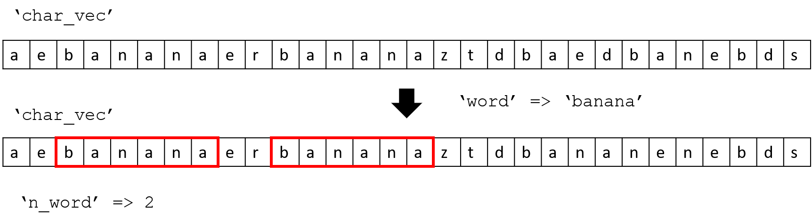

# Module 07: Function

## M07001. Income Tax: Functions (★★)


https://www.forbes.com/sites/kellyphillipserb/2015/10/21/irs-announces-2016-tax-rates-standard-deductions-exemption-amounts-and-more/#3b74ce0b2cd0

In M03001, you wrote a script to calculate the required income tax an individual has to pay based on their taxable income. The guidelines for how to calculate the tax due is shown above. 

(a) Create a function 'TaxRequired' that needs one input and has one output. The input, 'tax_inc', is an individuals taxable income for the year. The output, 'tax_due', is the amount of tax that individual must pay based on their taxable income. The value must be round off to the nearest integer before assigning the value.
```matlab
function tax_due = TaxRequired(tax_inc)
```

(b) Create a function 'TaxAnalysis' that needs one input and has three outputs. The input is a column vector named 'tax_inc' and contain taxable incomes. You first compute tax due for each taxable income. Then, compute the three outputs:  The first output, 'mean_tax', computes the mean of tax dues . The second output, 'max_tax', computes the maximum tax dues. The third output, 'above_50k', computes the number of individuals who must pay more than $50,000 for tax dues (after rounded off to the nearest integer). Please re-use your 'TaxRequired' function. Note that all tax dues that you are using for the output computation in this function should be rounded-off to the nearest integer. 
```matlab
function [mean_tax, max_tax, above_50k] = TaxAnalysis(tax_inc)
```

Note that you are going to design local function on the bottom of the given script code. 

**Solution**
Please watch this:[**https://youtu.be/BbUvzLtOT5c?t=685**](https://youtu.be/BbUvzLtOT5c?t=685)


## M07002. Making the Change: Function (★★)
Create a function called '**MoneyTeller**' that accepts one input named 'money' and one output named 'cad_change'.  

```matlab
function cad_change = MoneyTeller(money)
```
'money' is a scalar value that contains the money value. 'cad_chage' is a 1 x 7 row vector that contain the number of bills or coins. 

Below you will find instructions on how the function works.


Your function computes the number of bills or coins. Always use bigger bills or coins first if it allows. The tellling machine has seven Canadian different bills/coins above. 

For example, when 232 dollar is provide as an input dollar, 'cad_change' becomes [2 0 1 1 0 1 0]. Another example, when 68 dollar is provide as an input dollar, 'cad_change' becomes [0 1 0 1 1 1 1].
The input dollar named 'money' is randomly generated. 

Note that this problem is almost exactly the same as M05010.

**Solution**
Please watch this:[**https://youtu.be/BbUvzLtOT5c?t=5**](https://youtu.be/BbUvzLtOT5c?t=5)

## M07003. Building Sensor Installation: Function (★★★)

The matrix 'force_data' is an n1 x n2 matrix with each data point representing the force acting on the face of a building. The row and column index show where on the building that force is acting. For example, force_data(2,1) indicates the force value acting on the location of (2,1). You can consider the matrix as a building facade. The goal of this problem is to find five sensor locations and they should be consecutively placed in a row or column direction. The sensor location is determined by whatever five consecutive points that have the highest average force. 

```matlab
function [final_loc, max_avg_force] = HighestForce(force_data)
```
You need to create a function 'HighestForce' that accepts one input. The input is the 'force_data' which represent all forces acting on the building wall. Your function should have two outputs named 'final_loc' and 'max_avg_force', the best coordinate locations for the sensor.  
'final_loc' is a 5 x 2 matrix and it column and row is a row and column location of each sensor location, respectively. Note that the sensor locations are recorded from left to right or from top to bottom. 'max_avg_force' is a scalar variable that contains the average force acting on 'final_loc'. 

**Solution**
```matlab
n1 = randi([50 150]);
n2 = randi([50 150]);

force_data = randi(10000,n1,n2) + rand(n1, n2);

[final_loc, max_avg_force] = HighestForce(force_data);

% Model solution
function [sens_loc, max_mean_force] = HighestForce(force_data)

%%%%%%%%%%%%%%%%%%%%%%%%%%%%%%%%%%%%%%%%%%%%%%%%
% Search the locations in a horizontal direction
%%%%%%%%%%%%%%%%%%%%%%%%%%%%%%%%%%%%%%%%%%%%%%%%
num_sens = 5;
num_rows = size(force_data,1);
num_comb_col = size(force_data,2) - num_sens + 1;

max_hors = zeros(num_rows, num_comb_col);
for ii = 1:num_rows
    test_row_force = force_data(ii,:);
    for jj = 1:num_comb_col
        test_force_set = test_row_force(jj:(jj+num_sens-1));
        max_hors(ii,jj) = mean(test_force_set);
    end
end; clearvars test_row_force test_force_set

% Find the highest average set in a horizontal direction
max_mean_hor = max(max_hors(:));
[ind_row, ind_col] = find(max_hors == max_mean_hor);

max_mean_loc_hor  = zeros(5,2);
max_mean_loc_hor(:,1) = ind_row;
max_mean_loc_hor(:,2) = (ind_col:(ind_col + num_sens - 1))';
clearvars ind_row ind_col num_rows num_comb_col max_hors

%%%%%%%%%%%%%%%%%%%%%%%%%%%%%%%%%%%%%%%%%%%%%%%%
% Search the locations in a vertical direction
%%%%%%%%%%%%%%%%%%%%%%%%%%%%%%%%%%%%%%%%%%%%%%%%
num_sens = 5;
num_cols = size(force_data,2);
num_comb_row = size(force_data,1) - num_sens + 1;

max_vers = zeros(num_comb_row, num_cols);
for ii = 1:num_cols
    test_col_force = force_data(:, ii);
    for jj = 1:num_comb_row
        test_force_set = test_col_force(jj:(jj+num_sens-1));
        max_vers(jj,ii) = mean(test_force_set);
    end
end; clearvars test_col_force test_force_set

% Find the highest average set in a horizontal direction
max_mean_ver = max(max_vers(:));
[ind_row, ind_col] = find(max_vers == max_mean_ver);

max_mean_loc_ver  = zeros(5,2);
max_mean_loc_ver(:,1) = (ind_row:(ind_row + num_sens - 1))';
max_mean_loc_ver(:,2) = ind_col;
clearvars ind_row ind_col num_cols num_comb_row max_vers

% Check which mean value is larger
if max_mean_ver> max_mean_hor
    sens_loc = max_mean_loc_ver;
    max_mean_force = max_mean_ver;
else
    sens_loc = max_mean_loc_hor;
    max_mean_force = max_mean_hor;
end

end

% Second Possible Solution
function sens_loc = HighestForce2(force_data)
% Search rows
row_mean = mean(force_data(1,1:5));
row_ind = [ones(5,1) [1:5]'];
for jj = 1:size(force_data,1)
    for ii = 1:size(force_data,2) -5
        if row_mean < mean(force_data(jj,ii+1:ii+5))
            tmp1 = ones(5,1)*jj;
            tmp2 = [ii+1:ii+5]';
            row_ind = [tmp1 tmp2];
            row_mean = mean(force_data(jj,ii+1:ii+5));
            clearvars tmp1 tmp2
        end
    end
end


% Search cols
col_mean = mean(force_data(1:5,1));
col_ind = [[1:5]' ones(5,1)];
for jj = 1:size(force_data,2)
    for ii = 1:size(force_data,1) -5
        if col_mean < mean(force_data(ii+1:ii+5,jj))
            tmp1 = ones(5,1)*jj;
            tmp2 = [ii+1:ii+5]';
            col_ind = [tmp2 tmp1];
            col_mean = mean(force_data(ii+1:ii+5,jj));
            clearvars tmp1 tmp2
        end
    end
end

if col_mean > row_mean
    sens_loc = col_ind;
else
    sens_loc = row_ind;
end
end


% Third Possible Solution
function sens_loc = HighestForce3(force_data)
% Search rows
row_mean = mean(force_data(1,1:5));
row_ind = [ones(5,1) [1:5]'];
for jj = 1:size(force_data,1)
    for ii = 1:size(force_data,2) -5
        if row_mean < mean(force_data(jj,ii+1:ii+5))
            tmp1 = ones(5,1)*jj;
            tmp2 = [ii+1:ii+5]';
            row_ind = [tmp1 tmp2];
            row_mean = mean(force_data(jj,ii+1:ii+5));
            clearvars tmp1 tmp2
        end
    end
end


% Search cols
col_mean = mean(force_data(1:5,1));
col_ind = [[1:5]' ones(5,1)];
for jj = 1:size(force_data,2)
    for ii = 1:size(force_data,1) -5
        if col_mean < mean(force_data(ii+1:ii+5,jj))
            tmp1 = ones(5,1)*jj;
            tmp2 = [ii+1:ii+5]';
            col_ind = [tmp2 tmp1];
            col_mean = mean(force_data(ii+1:ii+5,jj));
            clearvars tmp1 tmp2
        end
    end
end

if col_mean > row_mean
    sens_loc = col_ind;
else
    sens_loc = row_ind;
end
end
```

## M07004. Remove a Character from a Character Vector (★★)

You need to create a function named 'RmvChr' that has two inputs and one output

``` matlab
function new_char_vec = RmvChr(char_vec, char_val)
```
One input is 'char_vec', which is a randomly generated char vector. The second input is 'char_val', which is a single character element you want to remove from 'char_vec'. 
The output, 'new_char_vec', will be the new character vector after removing 'char_val' from 'char_vec'. For example, when 'char_vec' is '13adhok' and 'char_val' is '1', then 'new_char_vec' will be '3adhok'. Note that 'new_char_vec' will remain the same as 'char_vec' if 'char_vec' does not contain 'char_val'.

**Solution**  
Please watch this:[**https://youtu.be/BbUvzLtOT5c?t=1432**](https://youtu.be/BbUvzLtOT5c?t=1432)


## M07005. Sum Diagonal Elements (★★★)
Create a function '**DiagSum**' that will sum the diagonal or anti-diagonal elements of a square 2D matrix named 'mat2d'. 

```matlab
function sumdiag = DiagSum(mat2d, direction)
```
The function accepts two inputs: 'mat2d' and 'direction'. 'mat2d' is a square 2D matrix and 'direction' is to choose either diagonoal or anti-diagonal. When 'direction' is 'diag', diagonal elements in 'mat2d' are summed. When 'direction' is 'adiag', anti-diagonal elements in 'mat2d' are summed. The resulting summed value is assigned to the output named 'sumdiag'. 

**Solution**  
Please watch this:[**https://youtu.be/Y1M5wF78r24?t=5**](https://youtu.be/Y1M5wF78r24?t=5)

## M07006. Most Nonzero Element Row (★★)
You need to create a function 'MostNnzRow' that has one input and one output. 
```matlab
function id_row = MostNnzRow(mat2d)
```
The input 'mat2d' is a randomly generated 2D matrix. 
The output 'id_row' will be the row index of the row with the most non-zero values. 

For example, if 'mat2d' is 

```matlab
     0     0     2     1
     0     4     1     1
     0     0     8     2
     0     0     0     2
```
then 'id_row' will be 2. 
Note that if there are multiple rows having the same most non-zero elements, it will always return the first one. 
For example,  if 'mat2d' is 

```matlab
     0     4     2     1
     0     4     1     1
     0     0     8     2
     0     0     0     2
```
 then 'id_row' will be 1. (both row 1 and 2 have three non-zero elements)

**Solution**  
Please watch this:[**https://youtu.be/Y1M5wF78r24?t=695**](https://youtu.be/Y1M5wF78r24?t=695)


## M07007. Introduction of Seven Card Poker (Description Only)

Please review the problem description on MATLAB Grader.

[](https://www.youtube.com/watch?v=d3ORQ_OCGUs) 

## M07017. (Main) Poker Game
You are supposed to write each function for each possible combination of cards showing if it can be made with the cards dealt or not. **You need to design nine functions and include them at the bottom of the given code.** Each function provides a true/false logical output as to whether that combination is possible or not (true if the combination is possible).

Note that **you don't need to determine if only one combination is possible.** 
For example, the ChckPr function might produces higher rank cards (two pair, three of a kind) as a pair. This result does not affect the final rank decision because 'your_card' is evaluated from the highest rank to the lowest ones as an if/else-if statement is used to determine the highest combination. For example, suppose that your card contain the Royal Flush combination, ChckPr (your_card) is allowed to produce true (because this doesn't matter if ChckRylFls can correctly identify the Royal Flush combintation).  Once ChckRylFls(your_card) becomes true, ChckPr(your_card) will not be evaluated. See the given script for evaluating the set of 'your_card'

**Solution**  
Please watch this:[**https://youtu.be/XvHxbukEUmY**](https://youtu.be/XvHxbukEUmY)


## M07018. Play Bull and Cows Game (★★★)
Bulls and Cows is a mind game. In the game, a random, 4-digit number is chosen from 0 to 9, called a true number, and its values are compared to those of a test number. All four digits of the number are different. If any digit in the test number is the exact same value and in the exact same position as any digit in the true number, this is called a bull. If the digit is present in both the true number and test number but is not in the same location, this is called a cow. Note that this is an original game presented in the lecture slides. 

Assume that two players join a Bulls and Cows game. Player 1 and Player 2 each guesses a four digit number (which are the test numbers) and they are named as ‘test_ply1’ and ‘test_ply2’ respectively. You are going to compare their bulls and cows and decide who is closer to the true number named 'true_num'. The player with more bulls wins. If both players have equal number of bulls, then the player with more cows wins. If both players have an equal number of bulls and cows, it is a tie. 
* Example 1: if bulls and cows for player 1 and 2 are [1,2] and [1,1], respectively, player 1 is **closer**. 
* Example 2: if bulls and cows for player 1 and 2 are [1,2] and [2,0], respectively, player 2 is **closer**. 

You are going to design a function to determine who is the winner. 

Please write a function of ‘**TwoPlayerBullsCows**’ which has three inputs: a true number (‘true_num’) and two test numbers (‘test_num1’ and ‘test_num2’), and one output called ‘result’. 
```matlab
function result = TwoPlayerBullsCows(true_num, test_num1, test_num2)
```
If the test number for Player 1 is **closer** to the true number, assign 1 to ‘result’. If the test number for Player 2 is closer to the true number, assign 2 to ‘result’. If their bulls and cows are identical, assign 0 to ‘result’. 

**Solution**  
Please see this: 
```matlab
true_num = randperm(10,4)-1; % randomly generate a 1 x 4 vector (true number)
test_ply1 = randperm(10,4)-1; % randomly generate a 1 x 4 vector (number from Player 1)
test_ply2 = randperm(10,4)-1; % randomly generate a 1 x 4 vector (number from Player 2)

winner = TwoPlayerBullsCows(true_num, test_ply1, test_ply2);

fprintf('True number is [%d %d %d %d]. \n', true_num);
fprintf('Player 1 number is [%d %d %d %d]. \n', test_ply1);
fprintf('Player 2 number is [%d %d %d %d]. \n', test_ply2);

if winner == 1
   fprintf('Player 1 Win ! \n');
elseif winner == 2
   fprintf('Player 2 Win ! \n');
else
   fprintf('Draw ! \n'); 
end

% please design a function called TwoPlayerBullsCows

function result = TwoPlayerBullsCows(true_num, test_num1,test_num2)

[bulls1, cows1] = CompBullsCows(true_num, test_num1);
[bulls2, cows2] = CompBullsCows(true_num, test_num2);

if bulls1 > bulls2
    result = 1;
elseif bulls2 > bulls1
    result = 2;
else
    if cows1>cows2
        result = 1;
    elseif cows2>cows1
        result = 2;
    else
        result = 0;
    end
end

end

function [bulls, cows] = CompBullsCows(true_num, test_num)

% These are new solutions. 
% You can use the ones in the lecture slides (any working solutions)

bulls = sum(true_num==test_num);
cows = sum(true_num(:) == test_num, 'all') - bulls; % slide 185

end
```

## M07019. Zeros into a Vector (★★)
Create a function called 'InsertZeros' which has two inputs and one output. 
```matlab
function outvec = InsertZeros(vec, n)
```
'outvec' is a row vector generated by inserting 'n' number of zeros after each element in the given vector named 'vec'. Note that 'vec' is a row vector and 'n' is a positive integer greater or equal to  1 (n >= 1). 
* Example 1:  When vec = [1 2 3 4] and n = 3, 'outvec' becomes [1 0 0 0 2 0 0 0 3 0 0 0 4 0 0 0];
* Example 2:  When vec = [2 1 1 2] and n = 2, 'outvec' becomes [2 0 0 1 0 0 1 0 0 2 0 0];
* Example 3:  When vec = [1 2] and n = 1, 'outvec' becomes [1 0 2 0];

**Solution**
Please see this: 
```matlab
test_vec = randi(100, 1, 30);
n = randi(10);

new_vec = InsertZeros(test_vec, n);

% please design a function called InsertZeros

function outvec = InsertZeros(vec, n)
nvec = numel(vec);
outvec = cat(1, vec, zeros(n, nvec));
outvec = outvec(:)';
end
```

## M07020. Subtract Column or Row Average from a 2D matrix (★★)
Create a function called 'MeanSubtract' that accepts two inputs and one output. 
```matlab
function out_mat2d = MeanSubtract(mat2d, dim)
```
When 'dim' is 1, 'out_mat2d' is genreated by subtracting a column mean from the corresponding column in the input matrix named 'mat2d' 
When 'dim' is 2, 'out_mat2d' is genreated by subtracting a row mean from the corresponding row in the input matrix named 'mat2d' 
Example: When 'mat2d' is 

```matlab
     1     2     5
     2     3    10
     3     7    15
```
if we run the following script
out_mat2d = MeanSubtract(mat2d, 1)
'out_mat2d' becomes

```matlab
    -1    -2    -5
     0    -1     0
     1     3     5
```
because the mean of each column = [2 4 10]. 
On the other hand, if we run the following script
out_mat2d = MeanSubtract(mat2d, 2)
'out_mat2d' becomes

```matlab
   -1.6667   -0.6667    2.3333
   -3.0000   -2.0000    5.0000
   -5.3333   -1.3333    6.6667
```
because the mean of each row = [2.666; 5; 8.333]. 

**Solution**  
Please see this: 
```matlab
test_mat2d = randi(100, 10, 10);
dim = randi(2);

out_mat2d = MeanSubtract(test_mat2d, dim);

% please design a function called MeanSubtract

function out_mat2d = MeanSubtract(mat2d, dim)
vec = mean(mat2d, dim);
out_mat2d = mat2d - vec;  % slide 185
end
```
## M07021. N Values in Columns (★★)
Create a function called 'MaxMinN' that accepts two inputs and two output. 
```matlab
function [max_num, min_num] = MaxMinN(mat2d, num)
```
The purpose of this function is to compute the maximum and minimum times the given number named 'num' that can be found within columns of an input matrix (named 'mat2d'). 
The maximum and minimum numbers of 'num' are assigned to 'max_num' and 'min_num', respectively. 
Note that 'max_num' and 'min_num' could be the same when the number of 'num' is the same in each coulmn.
For example, When we have the line [max_num, min_num] = MaxMinN(mat2d, 1), and 'mat2d' is 

```matlab
     1     5     5
     2     1    10
     3     5     1
```

The number of '1's in each column is one , so 'max_num' and 'min_num' can both be one.
Or, 'max_num' and 'min_num' could be both zeros when there is no 'num' in 'mat2d'. 
Example 1: When 'mat2d' is 

```matlab
     1     5     5
     2     3    10
     5     5    15
```

if we run the following script

```matlab
[max_num, min_num] = MaxMinN(mat2d, 5)
```

'max_num' and 'min_num' becomes 2 and 1, respectively. 

Example 2: When 'mat2d' is 

```matlab
    16     2     3    10
     5    11    10     8
     9     7     6    10
     4    14    15     1
 ```
if we run the following script

```matlab
[max_num, min_num] = MaxMinN(mat2d, 10)
```

'max_num' and 'min_num' becomes 2 and 0, respectively. 

**Solution**  
Please see this: 
```matlab
test_mat2d = randi(10, 20, 20);
test_num = randi(10);

[test_max_num, test_min_num] = MaxMinN(test_mat2d, test_num);

% please design your function called MaxMinN
function [max_num, min_num] = MaxMinN(mat2d, num)
n_num = sum(mat2d == num);
max_num = max(n_num);
min_num = min(n_num);
end
```

## M07022. How Many Given Word in a Character Vector? (★★★)
Create a function called 'CountWord' that accepts two inputs and one output. 
```matlab
function n_word = CountWord(char_vec, word)
```
This function is to count the number of 'word' in 'char_vec' and assign its number to 'n_word'. Note that 'char_vec' and 'word' contain only lower case alphabetical words and 'char_vec' is much longer than 'word'.
Here is the example:



Note that although 'banana' is assigned to 'test_word' in the given code, the function supports any word. This means your function should be applicable on any word and does not use information that sepcifies your 'word' as 'banana'. 
You should not use the following built-in function: strfind, count. 

**Solution**  
Please see this: 
```matlab
test_word = 'banana';
char_vec = GenCharVec(test_word);

n_test_word = CountWord(char_vec, test_word);

% please design a function called CountWord

function n_word = CountWord(char_vec, word)

vec_len = numel(char_vec);
n_char = numel(word);

n_word = 0;
for ii=1:vec_len-n_char+1
    test_loc = ii:ii+n_char-1;
    if isequal(char_vec(test_loc), word)
       n_word = n_word + 1; 
    end
end

end

function char_vec = GenCharVec(test_word)
vec_len = 300;
n_char = numel(test_word);
char_vec = char(randi([97 122], 1, vec_len));
n_word = randi(20);

for ii=1:n_word
    loc = randi(vec_len-n_char);
    char_vec(loc:loc+n_char-1) = test_word;
end
end
```

## M07023. Remove Any Row in Which Contains N number (★★★)
Create a function called 'RmvRowNCont' which has two inputs and one output. 

```matlab
function out_mat2d = RmvRowNCont(mat2d, N)
```

'out_mat2d' is generated by removing the row(s) of 'mat2d' which contain the number 'N'. Note that 'mat2d' is a 2D matrix and 'N' is a scalar. 

**Example 1:** When 'mat2d' is:

```matlab
     4     5     1     4
    15    15    11    13
     6     4    10     3
    14    13     7     8
```

and we run the following script:

```matlab
out_mat2d = RmvRowNCont(mat2d, 4)
```
'out_mat2d' becomes:

```matlab
    15    15    11    13
    14    13     7     8   
```
because the first and third rows contain 4 so the corresponding rows are deleted. 

**Example 2:** When 'mat2d' is:

```matlab
     6    11     5    17    25     4
    17    20    30    20    24     9
     4     3    13     1    30    23
     2     7    29    24     7    25
    28     2    22    28    28     4
    30    15    18     1    20    15
```
and we run the following script:
```matlab
out_mat2d = RmvRowNCont(mat2d, 20)
```
'out_mat2d' becomes:
```matlab
     6    11     5    17    25     4
     4     3    13     1    30    23
     2     7    29    24     7    25
    28     2    22    28    28     4
```
because the second and last rows contain 20 so those rows are deleted. 

**Solution**  
Please see this: 
```matlab
mat2d = randi(60, 8, 8);
N = randi(60);

out_mat2d = RmvRowNCont(mat2d, N);

% please design a function called RmvRowNCont
function out_mat2d = RmvRowNCont(mat2d, N)

idx = logical(sum(mat2d == N, 2));
out_mat2d = mat2d;
out_mat2d(idx,:) = [];

end
```

## M07024. Remove Vowels (★★★)
Create a function called '**RmvVowels**' that accepts one input and one output. 
```matlab
function out_vec = RmvVowels(char_vec)
```
The purpose of this function is to remove all vowels from 'char_vec' and assign the result vector to 'out_vec'. 
'char_vec' is a character vector and contains only lower-case letters. The vowels in the problem are 'a', 'e', 'i', 'o', and 'u'. 
* Example 1: when 'char_vec' is 'aabcdeeffg', 'out_vec' becomes 'bcdffg'. 
* Example 2: when 'char_vec' is 'abcdefghi', 'out_vec' becomes 'bcdfgh'. 

**Solution**  
Please see this:
```matlab
char_vec = char(randi([97 122], 1, 100));

out_char_vec = RmvVowels(char_vec);

% Please write your function called RmvVowels
function out_vec = RmvVowels(char_vec)
vowels = 'aeiou';

% out_vec = char_vec;
% for ii=1:numel(vowels)
%    idx = (out_vec == vowels(ii));
%    out_vec(idx) = []; 
% end

lg_idx = zeros(1, numel(char_vec), 'logical');
for ii=1:numel(vowels)
    lg_idx = or(lg_idx, char_vec == vowels(ii));
end
out_vec = char_vec(~lg_idx);

end
```

## M07025. Tensile Stress: Function (★)
Create a function named '**CompTenStr**' that accepts two inputs and one output. 

```matlab
function tensile_stress = CompTenStr(strain_data, material_char)
```

This function is to determine tensile stess, where the output ('tensile_stress') is a scalar. 
The strain data named 'strain_data' and material data named 'material_char' are given for this problem. Please note that 'strain_data' for this problem is a scalar.
Tensile stress can be obtained from the product of strain and the tensile modulus of a material . 
Tensile modulus for each of the given material is given as the following: 


'material_char' contains a character that indicates the material for given measurements. (e.g, 'material_char' can be 'c', which indicates "copper")
('c': Concrete, 'p': Coppper, 'w': Pine wood, 's': Steel, 'g': Gold, 'a': Aluminum)
You do not need to consider units for the tensile modulus and strain. 
Again, tensile stress is tensile modulus times strain. 

**Solution**  
Please see this:  
```matlab
% 'c': Concrete, 'p': Coppper, 'w': Pine wood, 's': Steel, 'g': Gold, 'a': Aluminum
material_char = ['c', 'p', 'w', 's', 'g', 'a'];

test_strain_data = randi(1000); % test tensile strain
test_mat_char = material_char(randi(6)); % test material character

test_tensile_stress = CompTenStr(test_strain_data, test_mat_char);

% please design a function called CompTenStr

function tensile_stress = CompTenStr(strain_data, mat_char)

switch mat_char
    case 'c'
        tensile_stress = strain_data * 17;
    case 'p'
        tensile_stress = strain_data * 117;
    case 'w'
        tensile_stress = strain_data * 9;
    case 's'
        tensile_stress = strain_data * 180;
    case 'g'
        tensile_stress = strain_data * 74;
    case 'a'
        tensile_stress = strain_data * 40;
end

end
```

## M07026. Generate a Character Sequence (★★★)
Create a function called 'GenSeq' that accepts one input and one ouptut

```matlab
function char_seq = GenSeq(n)
```
This function is to generate a character vector named 'char_seq' using 'n' number of charcters in order. 
'char_seq' is a character vector that contains the lower-case alphabet. 
'n' is a scalar value that is less than or equal to 26.
* When 'n' is 2, 'char_seq' becomes 'abb'.
* When 'n' is 3, 'char_seq' becomes 'abbccc'.
* When 'n' is 5, 'char_seq' becomes 'abbcccddddeeeee'.

**Solution**  
Please see this: 
```matlab
test_n = randi(26);

test_char_seq = GenSeq(test_n);

% please design your function: GenSeq

function char_seq = GenSeq(n)

char_seq = []; 
for ii=1:n
    cur_seq = char((96+ii) * ones(1, ii));
    char_seq = [char_seq cur_seq];
end

end

% option
% function char_seq = GenSeq(n)
% 
% alpha_seq = 'abcdefghijklmnopqrstuvwxyz';
% 
% char_seq = []; 
% for ii=1:n
%     cur_seq = char(alpha_seq(ii) * ones(1, ii));
%     char_seq = [char_seq cur_seq];
% end
% 
% end
```

## M07027. Candy Store: Function (★)
Noreen owns a candy store, and she did a promotion on May 2. If customers applied for membership cards on that day, they would have a chance to win a prize. The prize receivers are chosen based on their membership card number. The card number is 10 digits. To win the prize, the card number satisfy the following conditions:
 
* '6' appears at the second and fifth indexes (locations) of the card number. 
* The first and last digits are not 3. 
* The second last number is less than 5. 
 
For example, the person whose card number is either '1623612122' or '6623612149' will receive the prize.
 
Creat a function named 'PrzRcv' that accepts one input and one output. 

```matlab
function is_rsv = PrzRcv(card_num)
```

If 'card_num' satisfies the above three conditions for receiving the prize, true is assigned to 'is_rsv'. Otherwise, false is assigned to 'is_rsv'. 'card_num' is a 1 x 10 vector that contain numbers ranging from 0 to 9. 'is_rsv' is a logical value.

**Solution**  
Please see this: 
```matlab
test_card_num = randi(10, 1, 10)-1; % test card number

test_is_rsv = PrzRcv(test_card_num);

% please design your function called PrzRcv

function is_rsv = PrzRcv(card_num)

cond1 = and(card_num(2)==6 , card_num(5)==6);
cond2 = and(card_num(1)~=3 , card_num(end)~=3);
cond3 = card_num(end-1) < 5;
is_rsv = cond1 && cond2 && cond3;

end
```

## M07028. Word Construction (★★★★)
Create a function named **ReWordScr**, which has two inputs, ‘org_wrd’ and ‘char_seq’, and one output named ‘is_word’, which is a logical vector. 

```matlab
function is_word = ReWordScr(org_wrd, char_seq)
```

If a word in ‘org_wrd’ can be constructed with the characters available in ‘char_seq’, assign a logical 1 to ‘is_ word’, and otherwise, assign a logical 0 to it. The original word named ‘org_wrd’ is a lowercase character vector and is also an alphabet word (e.g., ‘pizza’, ‘calculus’, ‘summer’). ‘char_seq’ is a 1 x 20 character vector that is randomly drawn from ‘a’ to ‘z’. 

Your task is to check if you can make ‘org_wrd’ by combining a set of characters in ‘char_seq’. For example, assume that ‘char_seq’ is ‘zmpzizastdioerublt’ and ‘org_wrd’ is ‘pizza’. You can construct the charcater vector ‘pizza’ (‘zmpzizastdioerubltt’ → pizza). However, if ‘org_wrd’ is ‘matlab’ or ‘calculus’, you cannot construct those words because there is only one ‘a’ or ‘l’ in ‘char_seq’. Note that the number of characters in ‘org_wrd’ is less than 20.  

**Solution**

```matlab
word = ['matlab';'enviro'; 'arceng';'geoeng'];
org_wrd = word(randi(4), :);
char_seq = char(randi([97 122],1,20));
is_word_test = ReWordScr(org_wrd,char_seq);

% please design your function called ReWordScr
function is_word = ReWordScr(org_wrd, char_seq)

is_word = true;
for jj=1:numel(org_wrd)
    idx_char = (char_seq == org_wrd(jj));
    if any(idx_char)
        loc = find(idx_char, 1, 'first');
        char_seq(loc) = []; 
    else
       is_word = false;
       break;
    end
end

end
```

## M07029. Word Score (★★★)
Create a function called WordScore that accepts one input named 'char_vec' and one output named 'score'. 

```matlab
function score = WordScore(char_vec)
```

'char_vec' is a character vector that contains lower-case letters, symbols, and upper-case letters. 

Only lower-case letters have the following values:


'score' can be computed by adding all equivalent values for ONLY lower-case letters. 
Here are some sample results:
**Example 1**

```matlab
>> score = WordScore('matlab')

score =

    49
```

score = 13 ('m') + 1 ('a') + 20 ('t') + 12 ('l') + 1 ('a') + 2 ('b') = 49

**Example 2**

```matlab
>> score = WordScore('Matlab')

score =

    36
```

score = 1 ('a') + 20 ('t') + 12 ('l') + 1 ('a') + 2 ('b') = 36. Here, 'M' is not a lower-case letter so there is no value. 

**Example 3**

```matlab
>> score = WordScore('Hi! Matlab')

score =

    45
```

score = 9 (i) + 1 ('a') + 20 ('t') + 12 ('l') + 1 ('a') + 2 ('b') = 45. 

Note that you cannot manually calculate the score and then assign the result. Your programming logic should be applicable in general, meaning that your code should work for any character vector and not just the one provided in the question. 

**Solution**

```matlab
test_char_vec = 'Students in AEG121 is amazing!';
test_score = WordScore(test_char_vec);

% please design your function called WordScore


function score = WordScore(char_vec)
char_db = double(char_vec);
lgv = (97 <= char_db) & (char_db <= 122);
score = sum(char_db(lgv)-96);
end

% Noreen's sol

% function score = WordScore(char_vec)
% values = 1:26;
% num_char = zeros(1,26);
% alp_vec = char(97:122);
% 
% for ii = 1:numel(alp_vec)
%        num_char(ii) = count(char_vec, alp_vec(ii));
% end
% 
% score = sum(num_char.*values);
% 
% end
```

## M07030. Design MyRem and CountRem Functions (★★★)
**rem** is a built-in function in MATLAB, used to find the remainder after division. 

r = rem(a, b) returns the remainder after the division of ‘a’ by ‘b’, where ‘a’ is the dividend and b is the divisor. Note that the input named ‘a’, which is a dividend, can be either a scalar, vector, matrix, or multidimensional array. The size of ‘r’ is exactly the same with the size of ‘a’. For example, 
* rem(4,3) becomes 1. 
* rem([3 4 5], 3) becomes [0 1 2]
* rem([3;4;5],2) becomes [1;0;1]
* rem([3 4; 5 6], 4) becomes [3 0; 1 2]

(a) Please design a function named **MyRem** without using a built-in function **rem**. 

```matlab
function r = MyRem(a, b)
```
This function has two inputs and one output. The two inputs ‘a’ and ‘b’ are a dividend and divisor respectively, and are both positive numbers. Supporting dimension of ‘a’ for **MyRem** is a **scalar** and **vector**. The output named ‘r’ is a remainder and its size is the same with the size of ‘a’. For example, 
* MyRem(4, 3) becomes 1.
* MyRem(10, 2) becomes 0.
* MyRem([1 2 3], 2) becomes [1 0 1].
* MyRem([4;5;6], 3) becomes [1;2;0].

Note that the behavior of **MyRem** is the same with **rem**. 

(b) Please design a function named CountRem. 

```matlab
function num_rem = CountRem(vec, b)
```

The CountRem function calculates the remainders for an array of numbers, and counts the number of all remainders with value of 0, 1, 2, and so on. This function has two inputs and one output. The first input named ‘vec’ is a 1 x 10 row vector containing the dividends and the second input named ‘b’ is a divisor. The output named ‘num_rem’ is a 1 x b vector that contains the counts of elements with remainders 0, 1, 2, and so on in order.
* CountRem([1 1 1 1 2 2 2 2 2 2], 2) becomes [6 4].
* CountRem([1 1 1 1 2 2 2 2 2 2], 3) becomes [0 4 6].
* CountRem( [1 2 3 4 5 6 7 8 9 10], 3) becomes [3 4 3].
* CountRem([2 6 11 20 20 4 20 20 10 17], 2) becomes [8 2].

Again, the first element is the count of the number of remainders with value 0, the second element the count of the number of remainders with value 1, and so forth.  

Note that you can reuse **MyRem** or use a built-in function **rem**.    

**Solution**

```matlab
divisor_test1 = randi(10)+1;

row_vec = randi(1000, 1, randi(10)+1);
col_vec = randi(1000, randi(10)+1, 1);

remainder_test1 = MyRem(row_vec,divisor_test1); % tests to test your solution for part (a)
remainder_test2 = MyRem(col_vec,divisor_test1); % tests to test your solution for part (a)

divisor_test2 = randi(10)+1;

vec_test1 = randi(1000,1,10);
vec_test2 = randi(1000,1,10);
num_rem_test1 = CountRem(vec_test1,divisor_test2); % tests to test your solution for part (b)
num_rem_test2 = CountRem(vec_test2,divisor_test2); % tests to test your solution for part (b)

% Please design your functions called MyRem and CountRem

function r = MyRem(a,b)
num_div = floor(a/b);
num_in = num_div.*b;
r = a - num_in;
end

function num_rem = CountRem(vec, b)
rem_vec = rem(vec,b);
num_rem = zeros(1, b);

for ii=1:b
    num_rem(ii) = sum(rem_vec == ii-1);
end

end

% Noreen: I thought that we are not allowed to use any built-in function and I used the text manipulation....
% function r = MyRem(a, b)
% 
% answer = a/b;
% answer_str = string(answer);
% [nr nc] = size(answer_str);
% 
% quotient = strings(nr,nc);
% 
% for ii = 1:nr
%   for  jj = 1:nc
%     answer_test = answer_str{ii,jj};
%     dot_idx = strfind(answer_test,'.');
%     
%     if ~isempty(dot_idx)
%         q_test = answer_test(1:dot_idx-1);
%     else
%         q_test = answer_test;
%     end
%     
%     quotient(ii,jj) = q_test; 
%   end
%        
% end
% r = a-str2double(quotient)*b;
% end
% 
% %(b)
% function num_rem = CountRem(vec, b)
% r = rem(vec,b);
% num_rem = zeros(1,b);
% 
% for ii = 1:numel(num_rem) % stores the counts of elements with remainder 0, 1, 2, and so on.
%     remainder_test = ii-1;
%     logical_vec = r == remainder_test;
%     num_rem(ii) = sum(logical_vec);
% end
% 
% end
% 
```

## M07031. Custom Poker Game (★★★★)
The standard 52-card deck has 13 numbers and four different suits. Seven Card Stud is a classic poker game where seven cards are distributed to each player. Each integer from 1 to 52 will represent the value and suit of a card (see the figure on the right). The order of the number from the highest to the lowest is 1, 13, 12, … 2 because the Ace (1) can be either 1 or 14. **The order of the suits from the lowest to the highest is “Clubs”, “Diamonds”, “Hearts”, and “Spades”.**   The input variable named ‘your_card’ is a 1 x 7 vector including seven integers indicating cards with the order below:


(a) Please write a function called ‘**ChckTwThrKnd**’, which is to check if there is a two pair of Three-of-a-Kind.

```matlab
function [is_tw_thr_knd, high_num] = ChckTwThrKnd(your_card)
```
* The function has one input of a set of test cards named ‘your_card’ and two outputs. 
* The first output named ‘is_tw_thr_knd’ tells you if there are two pairs of Three-of-a-Kind. 
* The second output named 'high_num', which is the higher card number between two pairs of Three-of-a-Kind. 

If ‘is_tw_thr_knd’ is false (0), ‘high_num’ must be 0. Please keep in mind that  Ace's are the highest valued cards in the poker. (e.g., Ace's are of higher value than kings)

**Example 1**

```matlab
your_card =  [5 6 7 17 20 19 41]; % card sequence is [2C, 2D, 2H, 5C, 5S, 5H, 11C]; 
[is_tw_thr_knd, high_num] = ChckTwThrKnd(your_card)
```

Then, two output variables becomes

```matlab
is_tw_thr_knd =

  logical

   1

high_num =

     5
```

**Example 2**

```matlab
your_card =  [17 20 19 1 2 3 41]; % card sequence is [5C, 5S, 5H, 1C, 1D, 1H, 13C]; 
[is_tw_thr_knd, high_num] = ChckTwThrKnd(your_card)
```

Then, two output variables becomes

```matlab
is_tw_thr_knd =

  logical

   1

high_num =

     1
```

Again, Ace's are the highest value. 

**Example 3**

```matlab
your_card =  [17 20 19 1 2 50 41]; % card sequence is [5C, 5S, 5H, 1C, 1D, 13D, 13C]; 
[is_tw_thr_knd, high_num] = ChckTwThrKnd(your_card)
```

Then, two output variables becomes

```matlab
is_tw_thr_knd =

  logical

   0


high_num =

     0
```

(b) Please write a function called ‘**ChckFls**’, which has one input of a test card set and three outputs.

```matlab
function [is_fls, suit, high_num] = ChckFls(your_card)
```

* The first output named ‘is_fls’ tells you if the rank is ‘Flush’ or not. 
* The second output named ‘suit’ is a string scalar that contains the suit name of the flush sequence. 
* The third output named ‘high_num’ is the highest card number in the flush sequence. 

If ‘is_fls’ is false (0), ‘suit’ become “None” and 'high_num' becomes 0, respectively. 
Please keep in mind that  Ace's are the highest valued cards in poker. (e.g., Ace's are of higher value than kings)

**Example 1**

```matlab
your_card =  [1 5 13 37 41 3 7]; % card sequence is [1C, 2C, 4C, 10C, 11C, 1H, 2H]; 
 [is_fls, suit, high_num] = ChckFls(your_card)
 ```
 
Then, three output variables becomes

```matlab
is_fls =

  logical

   1

suit = 

    "Clubs"

high_num =

     1
```

**Example 2**

```matlab
your_card =  [6 14 38 42 46 4 8]; % card sequence is [2D, 4D, 10D, 11D, 12D, 1S, 2S]; 
 [is_fls, suit, high_num] = ChckFls(your_card)
 ```
 
Then, three output variables becomes

```matlab
is_fls =

  logical

   1

suit = 

    "Diamonds"

high_num =

    12
```

**Example 3**

```matlab
your_card =  [7 14 38 42 46 4 8]; % card sequence is [2H, 4D, 10D, 11D, 12D, 1S, 2S]; 
 [is_fls, suit, high_num] = ChckFls(your_card)
```

Then, three output variables becomes

```matlab
is_fls =

  logical

   0

suit = 

    "None"

high_num =

     0
```

**Solution**

```matlab
numTest = 400;
cards_all = zeros(7,numTest);
for ii=1:numTest
    cards_all(:,ii) = randperm(52,7)';
end

idx = randperm(numTest, 6);
cards_all(:, idx(1)) = [1 2 3 21 22 50 23]'; % two pair of Three-of-a-Kind. 
cards_all(:, idx(2)) = [49 50 51 1 2 4 34]'; % two pair of Three-of-a-Kind. 
cards_all(:, idx(3)) = [20 19 18 30 31 32 52]'; % two pair of Three-of-a-Kind. 
cards_all(:, idx(4)) = [1 5 21 25 45 41 52]'; % Flush
cards_all(:, idx(5)) = [4 8 12 42 48 52 1]'; % Flush
cards_all(:, idx(6)) = [2 6 11 15 22 26 30]'; % Flush

% Problem (a)
is_tw_thr_knd = zeros(numTest,1);
high_num_tw_thr_knd = zeros(numTest,1);
for ii=1:numTest
    your_cards = cards_all(:,ii);
    [is_tw_thr_knd(ii), high_num_tw_thr_knd(ii)] = ChckTwThrKnd(your_cards);
end

% Problem (b)
is_fls = zeros(numTest,1);
suit_fls = strings(numTest,1);
high_num_fls = zeros(numTest,1);

for ii=1:numTest
    your_cards = cards_all(:,ii);
    [is_fls(ii), suit_fls(ii), high_num_fls(ii)] = ChckFls(your_cards);
end

% please design your functions called ChckTwThrKnd and ChckThrPr

function [is_tw_thr_knd, high_num] = ChckTwThrKnd(your_card)
card_vec = zeros(52,1);
card_vec(your_card) = 1;
card_mat = reshape(card_vec, 4, 13);

card_sum = sum(card_mat);
is_tw_thr_knd = sum(card_sum==3) == 2;
if ~is_tw_thr_knd
    high_num = 0;
else
    card_sum_new = [card_sum card_sum(:,1)];
    high_num = find(card_sum_new == 3, 1, 'last');
    if high_num == 14
        high_num = 1;
    end
end

end

function [is_fls, suit, high_num] = ChckFls(your_card)
suit_names = ["Clubs" "Diamonds" "Hearts" "Spades"];

card_vec = zeros(52,1);
card_vec(your_card) = 1;
card_mat = reshape(card_vec, 4, 13);
card_sum = sum(card_mat, 2); % sum rows

is_fls = any(card_sum>=5);
if ~is_fls
    high_num = 0;
    suit = "None";
else
    
    id_fls = find(card_sum >=5);
    suit = suit_names(id_fls);
    
    card_sum_new = [card_mat card_mat(:,1)];
    high_num = find(card_sum_new(id_fls,:), 1, 'last');
    if high_num == 14
        high_num = 1;
    end
    
end

end
```


## M07032. Find the Number of Subsets (★★★)
Create a function named '**NumSubset**' that accepts two inputs named 'in_vec' and 'sum_val', and one output named 'num_set'

```matlab
function num_set = NumSubset(in_vec, sum_val)
```

You need to compute the number of subsets of any two numbers in 'in_vec' where their sum becomes 'sum_val'. The number of possible subsets should be stored in 'num_set', which is  the output of this function. 'in_vec' is a row vector that contains integers **without repeating elements**. This means that if 'num_set' has a value which when summed with itself equals to 'sum_val', it does not count towards 'num_set' (a subset cannot have two same numbers). See example 4 for this explanation. Both 'sum_val' and 'num_set' are scalar values. 

**Example1:** 

```matlab
in_vec = [1 2 3 4 5];
sum_val = 7;
num_set = NumSubset(in_vec, sum_val);
```

Then, 'num_set' becomes 2 because sum of (2, 5) and (3, 4) becomes 7 (sum_val). 
Note that (2, 5) and (5, 2) are the same and only count as 1 subset  in 'num_set'. 

**Example 2:** 

```matlab
in_vec = [3 11 10 2 1 12];
sum_val = 13;
num_set = NumSubset(in_vec, sum_val);
```

Then, 'num_set' becomes 3 because the sum of (3, 10), (11, 2), and (1, 12) becomes 13 (sum_val). 

**Example 3:** 

```matlab
in_vec = [3 11 10 2 1 12];
sum_val = 16;
num_set = NumSubset(in_vec, sum_val);
```

Then, 'num_set' becomes 0 because there is no set of two numbers of which summed becomes 16. 

**Example 4:**

```matlab
in_vec = [8 2 5 12 13 14];
sum_val = 10;
num_set = NumSubset(in_vec, sum_val);
```

Then, 'num_set' becomes 1 because only (8,2) are the only set of numbers that are different and sum up to 10. (5,5) does not count for this problem.

**Solution**

```matlab
in_vec = randperm(1000, 300); % a 1 x 300 numeric vector ranging from 1 to 100.
num_set_test = NumSubset(in_vec, 150);

% please design your function called 'NumSubset'

function num_set = NumSubset(in_vec, sum_val)
num_in = numel(in_vec);
num_set = 0;
for ii=1:num_in
    for jj=ii+1:num_in
        val = in_vec(ii) + in_vec(jj);
        if val == sum_val
           num_set = num_set + 1; 
        end
    end
end
end

% vectorized code
% function num_set = NumSubset(in_vec, sum_val)
% 
% num_in = numel(in_vec);
% pair = nchoosek(1:num_in,2);
% sum_pair = in_vec(pair(:,1)) + in_vec(pair(:,2));
% num_set = sum(sum_pair == sum_val);
% 
% end
```

## M07033. Push-up Zeros (★★★)
Create a function called '**UpZeros**' that accepts one input named 'mat2d' and one output named 'new_mat2d'. 

```matlab
function new_mat2d = UpZeros(mat2d)
```

The purpose of this function is to move all zeros in each column all the way to the top of the corresponding column in 'new_mat2d'.  The order of the remaining non-zero elements should be preserved and attached next to the zero elements on the top. 

Here are some examples: 

**Example 1**

```matlab
mat2d =

    50    16     0    32
    61     0     0     1
     0    56     1     4
     0    70    10    21

>> mat2d_test = UpZeros(mat2d);
>> mat2d_test

mat2d_test =

     0     0     0    32
     0    16     0     1
    50    56     1     4
    61    70    10    21
```

**Example 2**

```matlab
mat2d =

     1     6    11    16    21
     2     7    12    17     0
     3     0    13     0     0
     4     9    14    19    24
     5    10    15    20     0

>> mat2d_test = UpZeros(mat2d);
>> mat2d_test

mat2d_test =

     1     0    11     0     0
     2     6    12    16     0
     3     7    13    17     0
     4     9    14    19    21
     5    10    15    20    24
```

**Example 3**

```matlab
mat2d =

    55    55    75     0    93     0
     0    78     0     0     0     0
     0     4   100     0     0    55
    32     0     5     0     0     0
     0    69     0     0     0    35
     0    62    24     0    49     5

>> mat2d_test = UpZeros(mat2d);
>> mat2d_test

mat2d_test =

     0     0     0     0     0     0
     0    55     0     0     0     0
     0    78    75     0     0     0
     0     4   100     0     0    55
    55    69     5     0    93    35
    32    62    24     0    49     5
```

**Solution**

```matlab
mat2d = randi(100, 20, 20); % create a 20 x 20 matrix
mat2d(randperm(400, 50)) = 0; % assign 0 on 50 random locations in 'mat2d'

mat2d_test = UpZeros(mat2d);

% please design your function called 'UpZeros'

function new_mat2d = UpZeros(mat2d)

n = size(mat2d, 1);
new_mat2d = zeros(n, n);
for ii=1:n
    col = mat2d(:,ii);
    lg_vec = col == 0;
    num_z = sum(lg_vec);
    new_mat2d(num_z+1:end,ii) = col(~lg_vec); 
end

end

% Noreen's Solution

% function new_mat2d = UpZeros(mat2d)
% 
% [nr, nc] = size(mat2d);
% new_mat2d = zeros(nr, nc);
% 
% for ii = 1:nc
%     column_test = mat2d(:,ii);
%     num_zeros = sum(column_test == 0);
%     column_test(column_test == 0) = [];
%     new_column = [zeros(num_zeros,1); column_test];
%     new_mat2d(:,ii) = new_column;
% end
% 
% end
```

## M07034. Replication of Built-in Functions: 'mean' and 'sum' (★★)

(a) You need to create a function 'MySum' that has two inputs and one output. 
```matlab
function sum_val = MySum(matrix2D, dimension)
```
One input is 'matrix2D' and is a 2D matrix. The second input named 'dimension' is a character input that determines in what direction the values will be summed. 
* 'c' specifies that each column will be summed. sum_val become a row vector.
* 'r' specifies that each row will be summed. sum_val become a column vector. 
* 'a' specifies that all elements will be summed. sum_val become a scalar. 

Note that you must enter your 'direction' input as a character. The output, 'sum_val', is the resulting row vector, column vector, or scalar values containing the sum of the values. **You cannot use the MATLAB built-in sum function.**

(b) You need to create a function 'MyMean' that has two inputs and one output. 
```matlab
function mean_val = MyMean(matrix2D, dimension)
```
One input is 'matrix2D' and is a 2D matrix. The second input named 'direction' is a character input that determines in what direction the mean of the matrix will be taken. 
* 'c' specifies that mean of each column will be taken. mean_val become a row vector.
* 'r' specifies that mean of each row will be taken. mean_val become a column vector. 
* 'a' specifies that mean of all elements will be taken. mean_val become a scalar. 

Note that you must enter your 'direction' input as a character. The output, 'mean_val', is the resulting row vector, column vector, or scalar value containing the mean(s). **You cannot use the MATLAB built-in mean function but you can reuse MySum.** 

**Solution**  
Please watch this:[**https://youtu.be/Y1M5wF78r24?t=1498**](https://youtu.be/Y1M5wF78r24?t=1498)
