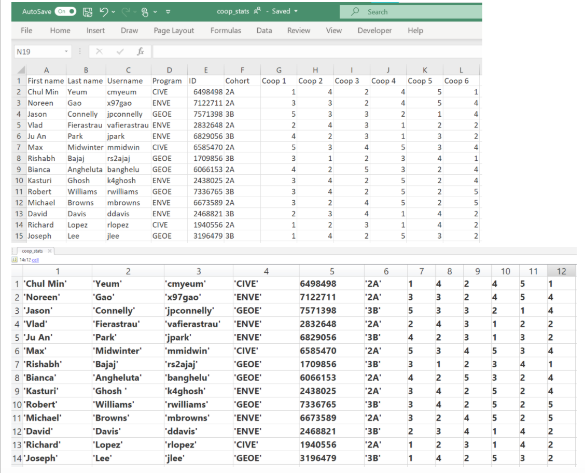

# Module 11: Text Manipulation

**Last updated:** 2021-08-14

## Table of Contents

## M11001. Word Unscrambler (★★★★)
A variable named 'words_100' is a 1 x 100 string array and each element contains a word. A variable named 'scram_words_100' is also a string array generated from 'words_100' by randomly shuffling the order of words as well as the order of characters inside each word. Thus, all words in 'words_100' are also in 'scram_words_100' but their word and characters positions are different. 

'words_100' and 'scram_words_100' are given in the beginning. 'scaram_words_100' is created after changing the order of the words and scrambling the positions of each chracter in each word. Here is an example of a scrambled and unscrambled variables (when rng(10) is used). The first three words 'scram_words_100' are

```matlab
>> scram_words_100(1:3)

ans = 

  1×3 string array

    "nbdoguni"    "ioitnncfe"    "iscmooetn"
 ```
 
Their original words are "bounding", "infrection", and "economist", which are located at 88, 65, and 92 in 'words_100', respectively. The goal of this task is to make a function to  unscramble each word in 'scram_words_100'. 

Note:  We are keeping the order of the words in 'unscram_words_100' as the one in 'scram_words_100', and we are just fixing the character positions in each word.

Create a function named UnscrWord, which accepts for two inputs named  'scram_words_100' and 'words_100' and one output named  'unscram_words_100'. 

```matlab
function unscram_words_100 = UnscrWord(scram_words_100, words_100)
```

The function should unscramble each word in 'scam_words_100' using the words in 'words_100'. The unscrambeled words are stored in 'unscram_words_100', which is a 1 x 100 string array. For the case of the example above, the first three words in 'unscram_words_100' should be "bounding", "infrection", and "economist". Note that each scarambled word only has a unique unscrambled (original) word. This means that given scrambled words cannot become the more than one word in the 'words_100' string array. 


**Solution**
Please watch this: [**https://youtu.be/mY2fjUi-DNo?t=1256**](https://youtu.be/mY2fjUi-DNo?t=1256)


## M11002. Word Finder Puzzle - Multiple Words: String Array (★★★)
In this problem, you will create a new 'Word Finder Puzzle - Multiple' script. However, this time your script must be able to solve for the locations of mutliple words with different lengths! The words you will search for are given in a string array called 'words'. The words are inserted either horizontally or vertically. The word will also not read backwards (down to up or right to left). 

```matlab
words = ["matlab", "mechanics", "circuits", "studio", "calculus", "summer", "university"];
```

Write a script that creates 'word_loc', which is a 1x7 cell array, with each element of the cell array corresponding to each of the words. Inside each element of the cell array is a matrix containing the row and column locations of where each lettter in one of the words is located in the puzzle. Each row is a different letter, and the first column contains the row number location and the second column contains the column number location.

For example, word_loc{1} produces a 6x2 matrix with the locations in the puzzle of each letter in "matlab". word_loc{2} is a 9 x 2 matrix and word_loc{2}(4,:) produces a 1 x 2 vector with the row and column location of the 'h' in "mechanics". The code for priniting the words that you found is in the learner template so you can check your answer.
 
Note that you can use 'strfind' function in MATLAB.

**Solution**
Please watch this: [**https://youtu.be/WybZTRqNxsU?t=664**](https://youtu.be/WybZTRqNxsU?t=664)


## M11003. Work Evaluations (★★★)
A large company does performance reviews on their employees every 6 months. After each meeting, their performance is summarized into a single word summary: there are seven options are:

```matlab
evaluations = ["Unsatisfactory", "Marginal", "Satisfactory", "Good", "Very Good", "Excellent", "Outstanding"];
```

The cell array 'emp_evals' contains the evaluations for all employees. 'emp_evals' is a cell variable, where each element indicates a set of evaluations of each employee received during work period. The 5th element in 'emp_evals' corresponds to the evaluation for Employee 5. The element in each cell contain a string array including evaluations. Since the work period of each employee is different, the size of the string array in each cell is different. 

Below is the script to generate 'emp_evals'.


```matlab
evaluations = ["Unsatisfactory" "Marginal" "Satisfactory" "Good" ...
    "Very Good" "Excellent" "Outstanding"];

num_emp = randi([50 150]); % Company will have a random number of employees between 50 and 150
                          
emp_evals = cell(1, num_emp); % Each cell contains an evaluation array corresponding employee
                             
for ii = 1:num_emp
    num_work_terms = randi([4 70]); % Employee will have between 4 and 70 work terms
                            
    idx = randi(7,1, num_work_terms); % Generate random numbers between 1 and 7
                                      % as indices for 'evaluations' (generating
                                      % what performance reviews the employee will
                                      % get). Note these numbers can repeat!
                              
    indiv_evals = evaluations(idx); % 1 X num_work_terms string arrays of evalutions
    emp_evals{ii} = indiv_evals'; % Assign the employees evaluations to
                                  % location ii in the cell. Transpose to
                                  % turn the row vector of strings into a
                                  % column vector strings
end
```

Create functions named:
(a) TermFinder, which accepts the data 'emp_evals' as an input and produces an output variable named as 'terms_all' which is the number of performance reviews (terms) each employee has had. 'terms_all' is a 1 x 'num_emp' row vector. 


```matlab
function terms_all = TermFinder(emp_evals)
```

(b) RatingChecker, which determines the total number of an inputted rating for each employee. RatingChecker accepts two inputs. The first is the data 'emp_evals' and the second is the desired rating, specified as a string. The function outputs a 1 x 'num_emp' row vector containing the number of times each employee recieved that rating. 


```matlab
function num_ratings= RatingChecker(emp_evals, rating)
```

If you want to know how many "Outstanding" evaluations are received in each empolyee, you will run 

```matlab
num_rating_outstand = RatingChecker(emp_evals, 'Outstanding');
```

(c) ExcellentEmployee, which finds the number of employees who have at least 3 evaluations of 'excellent' or 'outstanding' during all terms. The output named 'emp_nums' is a scalar variable. If no employees meet the condition, 0 is assigned to 'emp_nums'.


```matlab
function emp_nums = ExcellentEmployee(emp_evals)
```

(d) AveragePoint, which finds the average point for all employees. The average should be taken over all employees. Please note that it does not mean that you should take the average of every individual employer, and then sum those values and thendivide by the total number of employees. 

The point schemes are provided below:
* Outstanding is worth 7 Points
* Excellent is worth 6 Points
* Very Good is worth 5 Points
* Good is worth 4 Points
* Satisfactory is worth 3 Points
* Marginal is worth 2 Point
* Unsatisfactory is worth 1 Points

'avg_evals' is a scalar variable. 


```matlab
function avg_evals = AveragePoint(emp_evals)
```

**Solution**
```matlab
evaluations = ["Unsatisfactory" "Marginal" "Satisfactory" "Good" ...
    "Very Good" "Excellent" "Outstanding"];

num_emp = randi([50 150]); % Company will have a random number of employees between 50 and 150
                          
emp_evals = cell(1, num_emp); % Each cell contains an evaluation array corresponding employee
                             
for ii = 1:num_emp
    num_work_terms = randi([4 70]); % Employee will have between 4 and 70 work terms
                            
    idx = randi(7,1, num_work_terms); % Generate random numbers between 1 and 7
                                      % as indices for 'evaluations' (generating
                                      % what performance reviews the employee will
                                      % get). Note these numbers can repeat!
                              
    indiv_evals = evaluations(idx); % 1 x num_work_terms string arrays of evalutions
    emp_evals{ii} = indiv_evals'; % Assign the employees evaluations to
                                  % location ii in the cell. Transpose to
                                  % turn the row vector of strings into a
                                  % column vector strings
end

% Script Testing
% (a)
num_terms_test = TermFinder(emp_evals);

% (b)
num_ratings_test  = cell(1,7);
for ii = 1:7
    num_ratings_test{ii} = RatingChecker(emp_evals, evaluations(ii));
end

% (c)
emp_nums_test = ExcellentEmployee(emp_evals);

% (d)
avg_evals_test = AveragePoint(emp_evals);

% please design four functions to test the above script. 

% (a) TermFinder, which accepts the data 'emp_evals' and outputs the 
% number of performance reviews (terms) each employee has had in the form of a 
% row vector.

function terms_all = TermFinder(emp_evals)

terms_all = zeros(1, numel(emp_evals));
for ii = 1:length(emp_evals)
    employee_data = emp_evals{ii};
    terms_all(ii) = numel(employee_data);
end

end

% (b) RatingChecker, which determines the total number of an inputted
% rating for each employee. RatingChecker accepts two inputs. The first is
% the data 'emp_evals' and the second is the desired rating, specified as a
% string. The function outputs a 1 x 'num_emp' vector containing
% the number of times each employee recieved that rating.


function num_ratings= RatingChecker(emp_evals, rating)

num_emp = length(emp_evals);
num_ratings = zeros(1,num_emp);
for ii = 1:num_emp
    employee = emp_evals{ii};
    rating_comp = (rating == employee);
    num_same = sum(rating_comp);
    num_ratings(ii) = num_same;
end

end

% (c) ExcellentEmployee, which finds the employee numbers who average at
% least 1 excellent rating every 3 evaluations. ExcellentEmployee accepts
% the rating data 'emp_evals' and outputs the employee numbers who meet the
% condition described above in a row vector. If no employees meet the
% condition, then a 1x0 double vector should be returned.

function emp_nums = ExcellentEmployee(emp_evals)

num_excellent = RatingChecker(emp_evals, "Excellent");
num_outstanding = RatingChecker(emp_evals, "Outstanding");

good_evals = num_excellent + num_outstanding;

emp_nums = sum(good_evals >= 3);

end


% (d) AveragePoint, find an average point for all employees. The point schems are prvoided below:

% Outstanding is worth 7 Points
% Excellent is worth 6 Points
% Very Good is worth 5 Points
% Good is worth 4 Points
% Satisfactory is worth 3 Points
% Marginal is worth 2 Point
% Unsatisfactory is worth 1 Points


% 'avg_evals' is a scalar variable. 


function avg_evals = AveragePoint(emp_evals)
evaluations = ["Unsatisfactory" "Marginal" "Satisfactory" "Good" ...
    "Very Good" "Excellent" "Outstanding"];
points = 1:7;

num_terms = TermFinder(emp_evals);

total_points = 0;
for ii = 1:length(evaluations)
    num_rating = RatingChecker(emp_evals, evaluations(ii));
    num_points = num_rating * points(ii);
    total_points = total_points + num_points;

end


total_sum = sum(total_points);

avg_evals = total_sum / sum(num_terms);


end
```


## M11004. Reverse the Words and Letters of a String (★★)
Create a function named 'RvsWordChar' that accepts for one input string array named 'in_str' and one output string array named 'out_str'. 

```matlab
function out_str = RvsWordChar(in_str)
```

This function is to reverse the words in 'in_str' in a reverse order AND to reverse letters (characters) in each word. 

**Example 1:**

```matlab
in_str = ["AEG123", "is", "the", "best"];
out_str = RvsWordChar(in_str);
```

Then, 'out_str' is 

```matlab
out_str = 

  1×4 string array

    "tseb"    "eht"    "si"    "321GEA"
```

**Example 2:**

```matlab
in_str = ["University", "of", "Waterloo"];
out_str = RvsWordChar(in_str)
```

Then, 'out_str' is 

```matlab
out_str = 

  1×3 string array

    "oolretaW"    "fo"    "ytisrevinU"
```

**Solution**
Please watch this: [**https://youtu.be/WybZTRqNxsU?t=5**](https://youtu.be/WybZTRqNxsU?t=5)

NOTE: The 4 extra-credit problems mentioned in the video are from last year and DO NOT apply to AE/ENVE/GEOE 121 (Spring 2021)

## M11005. Cipher Encoder (★★★★)
You undertake a task that send a cipher to your allies. 
You are going to design a cipher encoder function called 'CphEncd' to encode the message (convert it to be unreadable!). 

```matlab
function new_str = CphEncd(str)
```

The input for this function named 'str' is a character vector that includes alphabet, symbols, and space. The encoding rule is that lower case letter (except for 'z'') is converted to the upper case of the next letter and the upper case letter (except for 'Z) is converted to the lower case of the next letter. Also, as a special case,  'z' and 'Z' becomes 'A' and 'a', respectively (because next letters are not alphabet). The other symbols or space remains the same. 

```matlab
>> CphEncd('abc')

ans =

    'BCD'

>> CphEncd('ABC')

ans =

    'bcd'

>> CphEncd('zZa')

ans =

    'AaB'

>> CphEncd('AGE 121!')

ans =

    'bhf 121!'
```

Please design the cipher encoding function called 'CphEncd'. 

**Solution**
Please watch this: [**https://youtu.be/mY2fjUi-DNo?t=5**](https://youtu.be/mY2fjUi-DNo?t=5)


## M11006. String Email Address Generation (★★★)
There are 14 students in a class. They came from different civil engineering programs and cohorts. They submitted four assignments and took a midterm and final exam. The information is stored in the following excel file. 


Then, the data is imported to a cell-type variable named 'class_data'. 


```matlab
load course_data.mat class_data
```
This line is to read a 'class_data' variable stored in a 'course_data.mat' file. For the students who work on this problem in MATLAB editor, you can download the file from here: https://github.com/chulminy/AE_ENVE_GEOE_121/tree/master/tutorial/supplement 


Our teaching team would like to send a group email to all students in the class. We know that student email addresses have the following format: <Username>@uwaterloo.ca. To send a group emails, we need to generate text that includes all the email addresses separated by a comma (,). Please write a script to generate a string scalar that includes all emails address separated by comma. The output string is stored in 'email_group'. In other words, your script is to generate the following string and assign it to 'email_group'.
  
```matlab  
>> email_group

email_group = 

    "cmyeum@uwaterloo.ca,x97gao@uwaterloo.ca,jpconnelly@uwaterloo.ca,vafierastrau@uwaterloo.ca,jpark@uwaterloo.ca,max.midwin@uwaterloo.ca,rs2ajaj@uwaterloo.ca,jsmith@uwaterloo.ca,jjohnson@uwaterloo.ca,rwilliams@uwaterloo.ca,mbrowns@uwaterloo.ca,ddavis@uwaterloo.ca,rlopez@uwaterloo.ca,jlee@uwaterloo.ca"
```

You should not manually assign the values to the output variable. There should have a programming logic. 

**Solution**

```matlab
load tut09.mat class_data
class_data(1,:) = []; % remove header

email_group = "";

n_st = size(class_data, 1);
for ii=1:n_st
   email_group = email_group + string(class_data{ii,3}) + "@uwaterloo.ca,";
end

email_group{1}(end) = [];
```

## M1107. Is This Mammals, Birds, or Fishes?  (★★)
Create function named WhatVertGroup which accept two inputs and one output. 

```matlab
function groups = WhatVertGroup (verterbrate, name)
```

'vertebrate' is a cell array and given as the following:

```matlab
vertebrate = cell(1,3);
mammals = ["gorilla", "rat", "kangaroos", "dog", "cat", "whale", "dolphin", "cheetah", "lion", "sheep"];
birds = ["crow", "peacock", "dove", "sparrow", "goose", "ostrich", "pigeon",  "turkey", "hawk", "bald eagle", "raven", "parrot"];
fishes = ["betta","goldfish", "guppies", "cod", "catfish", "bass", "carp", "bluefish"];

vertebrate{1} = mammals;
vertebrate{2} = birds;
vertebrate{3} = fishes;
```

'name' is a string scalar that includes a species name. The purpose of this function is to determine the group name ("mammals", "birds", or "fishes") where the 'name' of the species is and assign its group name in 'groups'. 'groups' is a string scalar which can only output the following strings: "mammals", "birds", "fishes", or "no result". If 'name' is not in the list of species names listed in 'vertebrate', "no result" is assigned to 'groups'. 

Here are some sample results:

```matlab
>> groups = WhatVertGroup(verterbrate, "dog")

groups = 

    "mammals"
    
>> groups = WhatVertGroup(vertebrate, "cod")

groups = 

    "fishes"
    
>> groups = WhatVertGroup(vertebrate, "sparrow")

groups = 

    "birds"

>> groups = WhatVertGroup(vertebrate, "waterloo")

groups = 

    "no result"
```

Note that you should not manually assign the values to the test variables!!

**Solution**

```matlab
vertebrate = cell(1,3);
mammals = ["gorilla", "rat", "kangaroos", "dog", "cat", "whale", "dolphin", "cheetah", "lion", "sheep"];
birds = ["crow", "peacock", "dove", "sparrow", "goose", "ostrich", "pigeon",  "turkey", "hawk", "bald eagle", "raven", "parrot"];
fishes = ["betta","goldfish", "guppies", "cod", "catfish", "bass", "carp", "bluefish"];

vertebrate{1} = mammals;
vertebrate{2} = birds;
vertebrate{3} = fishes;
clearvars mammals birds fishes;

test_group1 = WhatVertGroup (vertebrate, "dog");
test_group2 = WhatVertGroup (vertebrate, "catfish");
test_group3 = WhatVertGroup (vertebrate, "pigeon");
test_group4 = WhatVertGroup (vertebrate, "kitchener");
% please deisgn your function called 'WhatVertGroup'


function groups = WhatVertGroup (vertebrate, name)

if any(vertebrate{1} == name)
   groups = "mammals"; 
elseif any(vertebrate{2} == name)
   groups = "birds"; 
elseif any(vertebrate{3} == name)
   groups = "fishes"; 
else
   groups = "no result"; 
end

end

% Noreen's sol

% function groups = WhatVertGroup (verterbrate, name)
% 
% groups_vec = ["mammals" "birds" "fishes"];
% groups = "no result";
% for ii = 1:numel(verterbrate)
%     group_test = verterbrate{ii};
%     
%     for jj = 1:numel(group_test)
%         
%         name_test = group_test(jj);
%         
%         if strcmp(name_test,name)
%             groups = groups_vec(ii);
%             break
%         end
%         
%     end        
% end
% end
```
  

## M11008. Find Number of Given Digit (★★★)
  
Create a function 'FindNumDigit' that has two input and one output:
```matlab
function count = FindNumDigit(vec, digit)
```
The first input 'vec' is a row vector that contain numbers. The second input 'digit' is a single digit number that you want to search for. The output 'count' is to count the number of elements in 'vec' that contain a number having 'digit'. 

**Examples**

```matlab
>> vec=1:10;
>> FindNumDigit(vec, 7)

ans =

     1
```
Corresponding elements in 'vec': 7
```matlab
>> vec = 1:100;
>> FindNumDigit(vec, 5)

ans =

    19
```
Corresponding elements in 'vec': 5, 15, 25, 35, 45, 50~59, 65, 75, 85, 95
```matlab
>> vec = [1 2 77 17 3 4 10 72 73];
>> FindNumDigit(vec, 7)

ans =

     4
```
Corresponding elements in 'vec': 77, 17, 72, 73
```matlab
>> vec = [10 11 101 70 33];
>> FindNumDigit(vec, 0)

ans =

     3
```
Corresponding elements in 'vec': 10, 101, 70  
  
**Solution**
Please watch this: [https://youtu.be/x8Mfybv4z64?list=PLa1nAPP8qUX9qwRR6Sj_dboIriPIGYgsm&t=5](https://youtu.be/x8Mfybv4z64?list=PLa1nAPP8qUX9qwRR6Sj_dboIriPIGYgsm&t=5)
  
## M11009. Text Manipulation (★★★)

```matlab
n = randi([10 20]);% a random integer generation 
m = randi([5 8]);% a random integer generation 
```
(a) For a randomly generated character vector, of length 1 x n, 'char_vec' comprising of numbers, find how many values are greater than 5 and store it in a variable called 'num_count'. For example:
  
```matlab
char_vec = '84421377605' 
num_count = 4
```
Since 8, 7, 7 and 6 are greater than 5.
  
(b) For two given strings of length 1 x n, 'alpha_1' and 'alpha_2', find how many common letters they have an the same position in both strings and store it in a variable called 'alpha_count'. For example:
  
```matlab
alpha_1 = "jiikadmeu"
alpha_2 = "hifnedxku"
alpha_count = 3
```
Since 'i','d' and 'u' are three same letters in the same position in 'alpha_1' and 'alpha_2'.

(c) Given a string array, 'str_array', count the number of character in each string scalar and assign their values to 'num_char_str'. For example:
  
```matlab
str_array = ["AE121", "GEOE121", "ENVE121"]
num_char_str = [5 7 7];
``` 
  
(d) Print out the following texts in the command window using data from 'str_array'. For example:
  
```matlab
str_array = ["AE121", "GEOE121", "ENVE121"]
then, display:
Lecture 1: AE121
Lecture 2: GEOE121
Lecture 3: ENVE121
``` 

(e) Reverse the 'm'th element in 'str_array' and store it in a character vector called 'rev'. For  example:
  
```matlab
str_array = ["AE121", "GEOE121", "ENVE121"]
m = 3
rev = '121EVNE'
``` 

**Solution**
Please watch this: [https://youtu.be/x8Mfybv4z64?list=PLa1nAPP8qUX9qwRR6Sj_dboIriPIGYgsm&t=536](https://youtu.be/x8Mfybv4z64?list=PLa1nAPP8qUX9qwRR6Sj_dboIriPIGYgsm&t=536)
  
## M11010. New Cipher Encoder (★★★★)
You undertake a military mission that send a cipher to your allies. 
You are going to design a cipher encoder function called 'CphEncd' to encode the message (convert it to be unreadable!). 

```matlab
function new_str = CphEncd(str)
```

The input for this function named 'str' is a character vector that includes alphabet, symbols, and space. 
The encoding rule is that lower case letter (except for 'a') is converted to the upper case of the previous letter and the upper case letter (except for 'A') is converted to the lower case of the previous letter. 
Also, as a special case,  'a' and 'A' becomes 'Z' and 'z', respectively (because previous letters are not alphabet). The other symbols or space remains the same. 

```matlab
>> CphEncd('bcd')

ans =

    'ABC'

>> CphEncd('ABC')

ans =

    'zab'

>> CphEncd('AGE 121!')

ans =

    'zfd 121!'

>> CphEncd('aAb')

ans =

    'ZzA'
```
Please design the cipher encoding function called 'CphEncd'. 
  
**Solution**
Please watch this: [https://youtu.be/x8Mfybv4z64?list=PLa1nAPP8qUX9qwRR6Sj_dboIriPIGYgsm&t=1275](https://youtu.be/x8Mfybv4z64?list=PLa1nAPP8qUX9qwRR6Sj_dboIriPIGYgsm&t=1275)
  
## M11011. String Email and Name Generation (★★)
There are 14 students in a class. They are from different engineering programs and cohorts. 
That information is stored in the following excel file. Then, the data is stored in a cell-type variable named 'coop_stats'. 
**Note that this is the same data and .mat file used in HW7-4.**


 
'coop_stats' is a cell variable, where each cell contains different information about each employee, including their scores for each coop. 
'coop_stats' is a 14x12 cell array where the first header row is not included in this variable. This starts from the second row  in this table. 
```matlab
load HW7_4.mat coop_stats
```
This line is to read a 'coop_stats' variable stored in a 'HW7_4.mat' file. For the students who work on this problem in MATLAB editor, *you can download the file from here*: https://github.com/chulminy/AE_ENVE_GEOE_121/tree/master/tutorial/supplement
Please ensure you have saved 'HW7_4.mat' in the same folder as the script for this question to be able to load the file. 

(a) Write a script that generates a **string** scalar that includes all emails address separated by comma. The output string is stored in 'student_emails'. Student email addresses have the format <Username>@uwaterloo.ca and each email address is separated by a comma (,) and there is no comma after the last email. 
```matlab
>> student_emails

student_emails = "cmyeum@uwaterloo.ca,x97gao@uwaterloo.ca,...,rwilliams@uwaterloo.ca,mbrowns@uwaterloo.ca,ddavis@uwaterloo.ca,rlopez@uwaterloo.ca,jlee@uwaterloo.ca"
```
Here the output has been shortened with a '...' for convenience, but your output will contain emails in that location. Note that this text is very useful when you send out a group email!

(b) Write a script that generates a **string** scalar that includes all student names (first names and last names) separated by comma and space. The output string is stored in 'student_names'. Student first names and last names are separated by a space ( ) and the names of two different students are separated by a comma then a space (, ). **There is **no space or comma after the last name.** 
```matlab
>> student_names

student_names = "Chul Min Yeum, Noreen Gao, ... , Robert Williams, Michael Browns, David Davis, Richard Lopez, Joseph Lee"
```
  
Here the output has been shortened with a '...' for convenience, but your output will contain names in that location. 

**You should not manually assign the values to the output variable. There should have a programming logic.** 
  
**Solution**
Please watch this: [https://youtu.be/eF15b9jpeAk?list=PLa1nAPP8qUX9qwRR6Sj_dboIriPIGYgsm&t=8](https://youtu.be/eF15b9jpeAk?list=PLa1nAPP8qUX9qwRR6Sj_dboIriPIGYgsm&t=8)
  
## M11012. FIFA Tournament (★★)
ESL is hosting an online FIFA - 21 tournament that has cash prizes on the basis of player ranks. Depending on their performance in each individual game, players are ranked from 1 to 10, which 1 being the best and 10 being the worst. The cell array named 'play_rank' contains the ranks from all games for every player. 

'play_rank' is a cell variable, where each cell contains the ranks/game of a player, and is in the form of a numeric row vector. Each player has completed a **different number of games**, so the size of a row vector in each cell varies. 
The sample code generating ‘play_rank’: 

```matlab
play_rank = cell(1,100); 

for ii=1:100 
    num_games = randi([3 70]);  % generating a random number of games ranging from 3 to 70
    play_rank{ii} = randi(10,1,num_games); % populating each cell with a 1 x 'num_games' numeric vector conataing values ranging from 1 to 10
end 
```
  
(a) Please design a function named **AvgPlayRank**, which has one input and one output. The input is ‘play_rank’ described above. The output named ‘avg_rank’ is a **1 x 100 numeric vector** that contains the average score of the evaluations for each employee. To qualify for a prize, the player needs to have competed in **at least** 5 games. If the player has competed in less than 5 games, his average rank should be 0. 
Here is the function header syntax:
```matlab
function avg_rank = AvgPlayRank(play_rank)
```

(b) Please design a function named **PrizeWin**, which has one input and has one output. The input ‘play_rank' is described above. The output named ‘prize_amt’ is a **1 x 100 numeric vector** that contains the prize amount for each player. **If the player has competed in less than 5 games, they do not receive a prize, which means assigning 0**. The prize amount for each player is estimated based on their average rank and its details are shown in the table below:  
  


Here is the function header sytax:
```matlab
function prize_amt = PrizeWin(play_rank)
```
Note that you can reuse **AvgPlayRank**.
  
**Solution**
Please watch this: [https://youtu.be/eF15b9jpeAk?list=PLa1nAPP8qUX9qwRR6Sj_dboIriPIGYgsm&t=745](https://youtu.be/eF15b9jpeAk?list=PLa1nAPP8qUX9qwRR6Sj_dboIriPIGYgsm&t=745)
  
## M11013. Is it a Plant, Animal, Rock or Mineral? (★★)
  
Create function named WhatClasGroup which accept two inputs and one output. 
```matlab
function group = WhatClasGroup (classification, name)
```
'classification' is a cell array and given as the following:
```matlab
classification = cell(1,4);

plants = ["fern", "pine tree", "cactus", "yucca", "aloe", "ivy", "orchid", "begonia", "palm tree", "spruce tree"];
animals = ["crow", "catfish", "dove", "sparrow", "goose", "horse", "cat",  "cow", "bee", "starfish", "guppies", "parrot"];
minerals = ["quartz","obsidian", "malachite", "flourite", "sodalite", "biotite", "gypsum", "hematite"];
rocks = ["dolomite", "sandstone", "marble", "granite", "shale", "schist", "basalt", "gabbro", "gneiss"];

classification{1} = plants;
classification{2} = animals;
classification{3} = minerals;
classification{4} = rocks;
```
  
'name' is a **string scalar** that includes a plant, animal, mineral or rock name. The purpose of this function is to determine the group name ("plant", "animal", or "rock or mineral") where the 'name' of the plant, animal, mineral or rock is and assign its group name in 'group'. 
'group' is a **string scalar** which can only output the following strings: "name: plant", "name: animal", "name: rock or mineral", or "no result". 

**Note there is a space ( ) after the colon (:)** and then the group name (plant, animal, rock or mineral). If 'name' is not in the list of plant, animal, mineral or rock names listed in 'classification', "no result" is assigned to 'group'. 
  
```matlab
Here are some sample results:

>> group = WhatClasGroup(classification, "fern")

group = 

    "fern: plant"
    
>> group = WhatClasGroup(classification, "goose")

group = 

    "goose: animal"
    
>> group = WhatClasGroup(classification, "obsidian")

group = 

    "shale: rock or mineral"
    
>> group = WhatClasGroup(classification, "shale")

group = 

    "shale: rock or mineral"

>> group = WhatClasGroup(classification, "waterloo")

group = 

    "waterloo: no result"
```
  
**Note that you should not manually assign the values to the test variables!!**
  
**Solution**
Please watch this: [https://youtu.be/eF15b9jpeAk?list=PLa1nAPP8qUX9qwRR6Sj_dboIriPIGYgsm&t=1753](https://youtu.be/eF15b9jpeAk?list=PLa1nAPP8qUX9qwRR6Sj_dboIriPIGYgsm&t=1753)
  
## M11014. Text Manipulation (★)
```matlab
alpha = char([65:90 97:122]); % all alphabet characters
num_alpha = numel(alpha); % # of lowercase and uppercase alphabets

n = randi([90 100]); % random integer between 90 and 100 (char_vec size)

char_vec = alpha(randi(num_alpha,1,n)); % random character vector
str_vec = string(char_vec); % convert char_vec to str_vec
str_array = ["ENVE121","ENVE123","ENVE153","ENVE199","MATH118","ENVE105"];

clearvars alpha num_alpha n char_vec
```
Write a script that:
  
(a) Creates 'low_str', copied from 'str_vec' with all uppercase letters converted to lowercase.

(b) Creates 'num_b', which counts the number of 'b' there are in 'low_str'.
  
(c) Creates 'num_change', which counts the number of characters that were converted from uppercase to lowercase in part (a).

(d) Creates ' new_str', copied from 'str_array' except every instance of 'ENVE' is replaced by 'CIVE'. **Hint: strrep**.
  
**Solution**
```matlab
alpha = char([65:90 97:122]); % all alphabet characters
num_alpha = numel(alpha); % # of lowercase and uppercase alphabets

n = randi([90 100]); % random integer between 90 and 100 (char_vec size)

char_vec = alpha(randi(num_alpha,1,n)); % random character vector
str_vec = string(char_vec); % convert char_vec to str_vec
str_array = ["ENVE121","ENVE123","ENVE153","ENVE199","MATH118","ENVE105"];

clearvars alpha num_alpha n char_vec

% (a)
low_str = lower(str_vec);

% (b)
num_b = count(low_str, 'b');
% num_b = sum(low_str{:} == 'b');

% (c)
num_change = sum(str_vec{:} ~= low_str{:});

% (d)
new_str = strrep(str_array,'ENVE','CIVE');
```
  
## M11015. Airport Data (★★)
Data was collected regarding 446 airports worldwide and are stored in an Excel File. This information is sorted by the airports IATA code (3-letter code) and includes the following information: the airports full name, latitude (how north/south), longitude (how west/east), elevation (in ft), the airport's continent, the country code, and the municiplaity the airport is in.

The .mat file can be downloaded in the following link: https://github.com/chulminy/AE_ENVE_GEOE_121/blob/master/tutorial/supplement/HW8Q2.mat

Excel File:
  

MatLab Cell Array:
  

(a) Create a 7x1 cell array where it contains the **municiplaity name** of the 7 most eastern cities (**Largest Positive Longitude**) with an airport. They cell array should be in order of how 'east' the airport is and should be saved in the variable name '**east_city**'.

(b) Create a num x 1 cell array where it contains all the airport names with the word '**International**' in its name where 'num' is the number of cities that are applicable. Use the same order as presented in the original cell array.

**Solution**
  ```matlab
load HW8Q2.mat airport_table

% (a) 
[~, idx] = sort(cell2mat(airport_table(:,4)),'descend'); % Sort cities by how east they are in descending order and finding the index
east_city = airport_table(idx(1:7),8); % Taking only the first 7 cities and finding the city name

% (b)
intl_name = airport_table(contains(airport_table(:,2),"International"),2); % Finding the names of airports that have "International" using contain function

% option (loop based)
% idx = [];
% for ii=1:446
%    if contains(airport_table(ii,2), 'Internationa')
%       idx = [idx ii]; 
%    end
% end
% intl_name = airport_table(idx,2);
```
  
## M11016. Text Manipulation (★)
```matlab
alpha = char([65:90 97:122]); % all alphabet characters
num_alpha = numel(alpha); % # of lowercase and uppercase alphabets

n = randi([90 100]); % random integer between 90 and 100 (char_vec size)

char_vec = alpha(randi(num_alpha,1,n)); % random character vector
str_vec = string(char_vec); % convert char_vec to str_vec
str_array = ["ENVE121","ENVE123","ENVE153","ENVE199","MATH118","ENVE105"];

clearvars alpha num_alpha n char_vec
```
Write a script that:
  
(a) Creates 'up_str', copied from 'str_vec' with all lowercase letters converted to uppercase.

(b) Creates 'num_Z', which counts the number of 'Z' there are in 'up_str'.

(c) Creates 'num_change', which counts the number of characters that were converted from lowercase to uppercase in part (a).

(d) Creates 'num_ENVE', which determines how many of the selected courses in 'str_array' are 'ENVE' courses. **Hint: strncmp or count**
  
**Solution**
```matlab
alpha = char([65:90 97:122]); % all alphabet characters
num_alpha = numel(alpha); % # of lowercase and uppercase alphabets

n = randi([90 100]); % random integer between 90 and 100 (char_vec size)

char_vec = alpha(randi(num_alpha,1,n)); % random character vector
str_vec = string(char_vec); % convert char_vec to str_vec
str_array = ["ENVE121","ENVE123","ENVE153","ENVE199","MATH118","ENVE105"];

clearvars alpha num_alpha n char_vec

% Start your script here

% (a)
up_str = upper(str_vec);

% (b)
num_Z = count(up_str,'Z');
% num_Z = sum(up_str{:} == 'Z');

% (c)
num_change = sum(str_vec{:} ~= up_str{:});

% (d)
num_ENVE = sum(strncmp(str_array,'ENVE',4));
```
  
## M11017. Cipher Decoder (★★)
We designed a "**CphEcd**" function in M11005. 
  
In this problem, you are going to design a cipher decoder function called '**CphDcd**' to decode a message. 
```matlab
function org_str = CphDcd(enc_str)
```
* The input for this function named 'enc_str' is a character vector which contains an **encoded message**. 
* The output 'org_str' is the decoded string.

The encoding rule is **different** from the one in M11005:

***The encoding rule*** *is that lower case letter (except for 'a') is converted to the upper case of the* ***previous letter*** *and the upper case letter (except for 'A') is converted to the lower case of the* ***previous letter***. 
  
*Also, as a special case, 'a' and 'A' become 'Z' and 'z', respectively (because previous letters are not alphabet). The other symbols or spaces remain the same*. 
  
Here, '**enc_str**' includes the encoded message using the rules mentions above. 

Your **CphDcd** function is to decode 'enc_str' to obtain the original message that was sent to us, named as 'org_str'. 

Here are some examples:
```matlab
>> new_str = CphEncd('abc'); % encode your original message of 'abc'
>> new_str

new_str =

    'ZAB'

>> org_str = CphDcd('ZAB'); % decode the encoded message of 'ZAB'. Then, we can obtain what's the original message.
>> org_str

ans =

    'abc'
    
>> CphEncd('AGE 121!')

ans =

    'zfd 121!'
    
>> CphDcd('zfd 121!')

ans =

    'AGE 121!'    
```
Please design the cipher decoder function called **CphDcd**. 
  
**Solution**
```matlab
str_vec = "Students in AEG 121 are amazing!";
en_str_vec = CphEncd(str_vec);
org_str_vec = CphDcd(en_str_vec);

fprintf("str_vec: %s \n", str_vec);
fprintf("org_str_vec: %s \n", org_str_vec);

% Hint: If your CphDcd is working correctly, 'org_char_vec' must be the same as 'char_vec'. 

% please deisgn your function called CphDcd

function org_str = CphDcd(enc_str)

char_vec = char(enc_str);

lg_up = and(65 <= char_vec, char_vec <=89); % uppercase
lg_lw = and(97 <= char_vec, char_vec <=121); % lowercase
lg_up_z = char_vec == 'Z'; % 'Z'
lg_lw_z = char_vec == 'z'; % 'z'

org_chr = char_vec;
org_chr(lg_up) = org_chr(lg_up) + 33;
org_chr(lg_lw) = org_chr(lg_lw) - 31;
org_chr(lg_up_z) = 'a';
org_chr(lg_lw_z) = 'A';

org_str = string(org_chr);

end

function new_str_vec = CphEncd(str_vec)

char_vec = str_vec{:};

lg_up = and(66 <= char_vec, char_vec <=90); % uppercase
lg_lw = and(98 <= char_vec, char_vec <=122); % lowercase
lg_up_a = char_vec == 'A'; % 'A'
lg_lw_a = char_vec == 'a'; % 'a'

new_char_vec = char_vec;
new_char_vec(lg_up) = new_char_vec(lg_up) + 31;
new_char_vec(lg_lw) = new_char_vec(lg_lw) - 33;
new_char_vec(lg_up_a) = 'z';
new_char_vec(lg_lw_a) = 'Z';

new_str_vec = string(new_char_vec);

end
```

## M11018. Which Eng Department is this Student in? (★★)
```matlab
eng_study = cell(1,3);
ENVE = ["Jesse" "Kristen" "Rachel" "Kiridan" "Vedanjali" "Vlad"];
CIVE = ["Chul Min" "Richard" "Max" "Shunam" "Llannah"];
GEOE = ["Jeff" "Bianca" "Jason" "Robert" "Leah"];

eng_study{1} = ENVE;
eng_study{2} = CIVE;
eng_study{3} = GEOE;
```
You need to create a functon named '**WhatEngDep**', with two inputs and one output:
```matlab
function department = WhatEngDep(eng_study, name)
```
* 'name' is an input string scalar. 
* 'eng_study' is a 1 x 3 cell array, containing the names of students in each engineering department.
* 'department' is an output string scalar, determined based on which department the inupt 'name' belongs to. Use the exact department codes listed in the given code. If 'name' is not included in any of these departments, return "Department not found".

Example 1
```matlab
>> WhatEngDep(eng_study,"Vlad")

ans = 

    "ENVE"
```
Example 2
```matlab
>> WhatEngDep(eng_study,"Leah")

ans = 

    "GEOE"
```
Example 3
```matlab
>> WhatEngDep(eng_study,"Waterloo")

ans = 

    "Department not found"
```

**Solution**
```matlab
eng_study = cell(1,3);
ENVE = ["Jesse" "Kristen" "Rachel" "Kiridan" "Vedanjali" "Vlad"];
CIVE = ["Chul Min" "Richard" "Max" "Shunam" "Llannah"];
GEOE = ["Jeff" "Bianca" "Jason" "Robert" "Leah"];

eng_study{1} = ENVE;
eng_study{2} = CIVE;
eng_study{3} = GEOE;

clearvars ENVE CIVE GEOE

test_department1 = WhatEngDep(eng_study,"Jesse");
test_department2 = WhatEngDep(eng_study,"Shunam");
test_department3 = WhatEngDep(eng_study,"Jasson");
test_department4 = WhatEngDep(eng_study,"Kitchener");

% Create your function below

function department = WhatEngDep(eng_study,name)

if any(eng_study{1} == name)
    department = "ENVE";
elseif any(eng_study{2} == name)
    department = "CIVE";
elseif any(eng_study{3} == name)
    department = "GEOE";
else
    department = "Department not found";
end

end
```
  
## M11019. Remove String Words (★★)
Create a function called '**RmvWord**' that accepts two inputs and one output. 
```matlab
function out_str = RmvWord(in_str, word_rmv)
```
The input 'in_str' is a string array. 
  
The purpose of this function is to remove the words in 'word_rmv' from 'in_str' and assign the resulting string array to 'out_str'. 

Example 1
```matlab
>> in_str = ["dog", "salamander", "birch", "bee"];
>> word_rmv=["salamander"];
>> out_str = RmvWord(in_str, word_rmv)

out_str=
       ["dog", "birch", "bee"];
```
Example 2 
```matlab
>> in_str = ["dog", "salamander", "birch", "bee", "cat", "cow", "marble", "cat"];
>> word_rmv=["salamander", "cat"];
>> out_str = RmvWord(in_str, word_rmv)

out_str=
       ["dog", "birch", "bee", "cow", "marble"];
```
Example 3
```matlab
>> in_str = ["dog", "salamander", "birch", "bee", "cat", "cow", "marble", "cat"];
>> word_rmv=["speaker", "salamander", "dog"];
>> out_str = RmvWord(in_str, word_rmv)

out_str=
       ["birch", "bee", "cat", "cow", "marble", "cat"];
```

**You should not manually assign the values to pass the test.**
  
**Solution**
```matlab
in_str = ["cat", "fern", "sodalite", "dolomite", "guppies", "cow", "bee", "marble", "salmon", "cardinal", "obsidian", "cow"];
word_rmv=["guppies", "corn dog", "salmon",  "speaker", "cow"];

out_str_test = RmvWord(in_str, word_rmv);

% please design your function called 'RmvWord'

function out_str = RmvWord(in_str, word_rmv)

lg_vec = logical(ones(1, numel(in_str)));

n_test_words = numel(word_rmv);
for ii=1:n_test_words
    lg_vec = lg_vec & (in_str~=word_rmv(ii));
end

out_str = in_str(lg_vec);

end


% % option
% function out_str = RmvWord(in_str, word_rmv)
% 
% out_str = in_str;
% for ii=1:numel(word_rmv)
%     out_str(out_str==word_rmv(ii))=[];
% end
% 
% end
```
  
## M11020. Custom Poker Game (★★★)
The standard 52-card deck has 13 numbers and four different suits. Seven Card Stud is a classic poker game where seven cards are distributed to each player. Each integer from 1 to 52 will represent the value and suit of a card (see the figure on the right). The order of the number from the highest to the lowest is 1, 13, 12, … 2 because the Ace (1) can be either 1 or 14. **The order of the suits from the lowest to the highest is “Clubs”, “Diamonds”, “Hearts”, and “Spades”.**  The input variable named ‘cards’ is a 1 x 7 vector including seven integers indicating cards with the order below:
  


Please create a function named '**ChckFlsNew**', with one input and three outputs:
```matlab
function [is_fls, suit, high_num] = ChckFlsNew(cards)
```
* 'cards' is the input card sequnece. 
* 'is_fls' is a logical scalar, true if there is a flush given 'cards' and otherwise, false.
* 'suit' is a **string** scalar, returning the full name of the suit of the flush if there is one and "None" if there is not
* 'high_num' is the highest number in 'suit'.  If 'is_fls' is false, 'high_num' becomes 0. 
* Keep in mind that Ace's are the highest number cards in poker. (e.g., Ace's are of higher value than kings)

**This table is useful**: https://github.com/chulminy/AE_ENVE_GEOE_121/blob/master/tutorial/supplement/poker_table.md 

**(Flush)**: When five or more cards in a hand are of the same suit, it is a flush.

Example 1
```matlab
>> your_card = [2 6 9 10 20 23 29]; % 1D 2D 3C 3D 5S 6H 8C
>> [is_fls, suit, high_num] = ChckFlsNew(your_card)

is_fls =

  logical

   0


suit = 

    "None"


high_num =

     0
```
Example 2
```matlab
>> your_card = [6 11 15 22 26 30 50];  % 2D, 3H, 4H, 6D, 7D, 8D, 13D
>> [is_fls, suit, high_num] = ChckFlsNew(your_card)

is_fls =

  logical

   1


suit = 

    "Diamonds"


high_num =

    13
```     
Example 3
```matlab
>> your_card = [2 6 11 15 22 26 30]; % 1D, 2D, 3H, 4H, 6D, 7D, 8D
>> [is_fls, suit, high_num] = ChckFlsNew(your_card)

is_fls =

  logical

   1


suit = 

    "Diamonds"


high_num =

     1   
```
  
**Solution**
```matlab
numTest = 400;
cards_all = zeros(7,numTest);
for ii=1:numTest
    cards_all(:,ii) = randperm(52,7)';
end

idx = randperm(numTest, 3);
cards_all(:, idx(1)) = [1 5 21 25 45 41 52]'; % Flush
cards_all(:, idx(2)) = [4 8 12 42 48 52 1]'; % Flush
cards_all(:, idx(3)) = [2 6 11 15 22 26 30]'; % Flush

% Test
is_fls_test = zeros(numTest,1);
suit_test = strings(numTest,1);
high_num_test = zeros(numTest,1);

for ii=1:numTest
    your_card = cards_all(:,ii);
    [is_fls_test(ii), suit_test(ii), high_num_test(ii)] = ChckFlsNew(your_card);
end

% Create your ChckFlsNew function below

function [is_fls, suit, high_num] = ChckFlsNew(cards)

card_vec = zeros(52,1);
card_vec(cards) = 1;
card_mat = reshape(card_vec, 4, 13);

card_sum = sum(card_mat,2); % Find suit numbers

is_fls = any(card_sum >= 5); % Check for flushes

suit_names = ["Clubs","Diamonds","Hearts","Spades"];

if ~is_fls
    suit = "None";
    high_num = 0;
else
    fls_row = find(card_sum >= 5);
    suit = suit_names(fls_row);
    
    num_fls = find([card_mat(fls_row,:) card_mat(fls_row, 1)]);
    high_num = max(num_fls);
    
    if high_num == 14
        high_num = 1;
    end
end
end
```
  
## M11021. New Course Data: Cell Array (★★★)
There are 14 students in a class. They are from different civil engineering programs and cohorts. 

They submitted four assignments and took midterm and final exam. Those information is stored in the following excel file. 


Then, the data is stored in  a cell-type variable named 'class_data'. 


```matlab
load course_data.mat class_data
```
This line is to read a 'class_data' variable stored in a 'course_data.mat' file. For the students who work on this problem in MATLAB editor, you can download the file from here: https://github.com/chulminy/AE_ENVE_GEOE_121/tree/master/tutorial/supplement

Please write a script to compute the following values using 'class_data'. 

(a) Design a function called **OneProgram** which takes two inputs and produces one output.
```matlab
function one_class_data = OneProgram(class_data, program)
```
* The input 'class_data' is the original cell array.
* The input 'program' is either 'CIVE', 'ENVE', 'GEOE' 
* The output 'one_class_data' is a new cell array containing only information for students in the specified program.

(b) Design a function called **TopCohortStudent** which takes two inputs and produces one output.
```matlab
function top_student = TopCohortStudent(class_data, cohort)
```
* The input 'class_data' is the original cell array.
* The input 'cohort' is a character vector of either '2A' or '3B'.
* The output 'top_student' is a **string** type of the first name of the student from the specified cohort who recieved the highest grade on their final. 

(c) Use both of your functions to create two variables, 'cive_2A' and 'enve_3B' which stores a string of the first name of the students with the highest scores. 'cive_2A' will be the student from CIVE in 2A who performed the best on the final and 'enve_3B' is the student from ENVE in 3B who perfomed the best on the final. 
  
**Solution**
```matlab
load course_data.mat class_data;

class_data(1,:) = []; % remove header

% (c)
cive_class_data = OneProgram(class_data, 'CIVE');
cive_2A = TopCohortStudent(cive_class_data, '2A')
enve_class_data = OneProgram(class_data, 'ENVE');
enve_3B = TopCohortStudent(enve_class_data, '3B')

% (a)
function one_class_data = OneProgram(class_data, program)
lg = strcmp(class_data(:,4), program);
one_class_data = class_data(lg,:);
end

% (b)
function top_student = TopCohortStudent(class_data, cohort)
lg = strcmp(class_data(:,6),cohort);

scores = cell2mat(class_data(lg,12));
names = class_data(lg,1);
[~,id] = max(scores);
top_student = names{id};
top_student = string(top_student);
end
```
